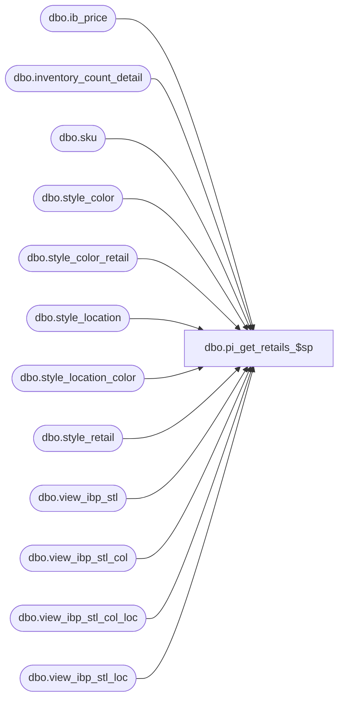

# dbo.pi_get_retails_$sp

**Database:** me_01  
**Server:** bedrockdb02  

## Architecture Diagram



## Table Dependencies

| Referenced Table |
|---|
| dbo.ib_price |
| dbo.inventory_count_detail |
| dbo.sku |
| dbo.style_color |
| dbo.style_color_retail |
| dbo.style_location |
| dbo.style_location_color |
| dbo.style_retail |
| dbo.view_ibp_stl |
| dbo.view_ibp_stl_col |
| dbo.view_ibp_stl_col_loc |
| dbo.view_ibp_stl_loc |

## Stored Procedure Code

```sql
create proc dbo.pi_get_retails_$sp 


(@DocId AS DECIMAL(12,0), @IclId AS DECIMAL(13,0), @LocId AS SMALLINT, @JurisdictionId AS SMALLINT, @DocDate AS SMALLDATETIME) 
AS

/* 
Proc name: pi_get_retails_$sp 
Description: Procedure called by pi_process_loc_$sp to retrieve retails and price statuses as of the count date

HISTORY: 
Date       	Name         	Def#	Desc
Sept01,04   	Sameer Patel   	21616	Part of performance improvements for physical inventory
May30, 05	Sameer Patel	52470	style does not have valid retail, infobase cannot be updated for phy inv count new style w/o cost
*/

BEGIN

/*--------------------------------------------------------------------------------------------------------------*/
/*--------------------------------------------------------------------------------------------------------------*/
-- Set retails to NULL
	
	UPDATE
		inventory_count_detail
	SET
		valuation_unit_retail = NULL,
		selling_unit_retail = NULL,
		price_status_id = NULL,
		effective_date = NULL
	WHERE
		inventory_control_id = @DocId
		AND inventory_control_loc_id = @IclId


/*--------------------------------------------------------------------------------------------------------------*/
/*--------------------------------------------------------------------------------------------------------------*/
-- For each sku, get the max effective date from ib_price using the following views
	-- view_ibp_stl
	-- view_ibp_stl_col
	-- view_ibp_loc
	-- view_ibp_stl_col_loc

	SELECT
		SKU_DATE.sku_id,
		SKU_DATE.style_id,
		SKU_DATE.color_id,
		MAX(SKU_DATE.effective_date) effective_date
	INTO 
		#MAX_DATE
	FROM
		(
			SELECT
				inventory_count_detail.sku_id,
				sku.style_id,
				NULL color_id,
				MAX(view_ibp_stl.effective_date) effective_date 
			FROM
				inventory_count_detail WITH (NOLOCK),
				view_ibp_stl,
				sku
			WHERE
				inventory_count_detail.sku_id = sku.sku_id
				AND view_ibp_stl.style_id = sku.style_id
				AND view_ibp_stl.effective_date <= CONVERT (DATETIME, @DocDate, 101)
				AND view_ibp_stl.jurisdiction_id = @JurisdictionId
				AND inventory_count_detail.inventory_control_loc_id = @IclId
				AND inventory_count_detail.inventory_control_id = @DocId
				AND inventory_count_detail.total_retail IS NULL
			GROUP BY
				inventory_count_detail.sku_id,
				sku.style_id
			
			UNION ALL
			
			SELECT
				inventory_count_detail.sku_id,
				sku.style_id,
				style_color.color_id,
				MAX(view_ibp_stl_col.effective_date) effective_date 
			FROM
				inventory_count_detail WITH (NOLOCK),
				view_ibp_stl_col,
				style_color,
				sku
			WHERE
				inventory_count_detail.sku_id = sku.sku_id
				AND view_ibp_stl_col.style_id = sku.style_id
				AND view_ibp_stl_col.style_id = style_color.style_id
				AND sku.style_color_id = style_color.style_color_id
				AND view_ibp_stl_col.color_id = style_color.color_id
				AND view_ibp_stl_col.effective_date <= CONVERT (DATETIME, @DocDate, 101)
				AND view_ibp_stl_col.jurisdiction_id = @JurisdictionId
				AND inventory_count_detail.inventory_control_loc_id = @IclId
				AND inventory_count_detail.inventory_control_id = @DocId
				AND inventory_count_detail.total_retail IS NULL
			GROUP BY
				inventory_count_detail.sku_id,
				sku.style_id,
				style_color.color_id
			
			UNION ALL
			
			SELECT
				inventory_count_detail.sku_id,
				sku.style_id,
				NULL color_id,
				MAX(view_ibp_stl_loc.effective_date) effective_date 
			FROM
				inventory_count_detail WITH (NOLOCK),
				view_ibp_stl_loc,
				sku
			WHERE
				inventory_count_detail.sku_id = sku.sku_id
				AND view_ibp_stl_loc.style_id = sku.style_id
				AND view_ibp_stl_loc.effective_date <= CONVERT (DATETIME, @DocDate, 101)
				AND view_ibp_stl_loc.jurisdiction_id = @JurisdictionId
				AND view_ibp_stl_loc.location_id = @LocId
				AND inventory_count_detail.inventory_control_loc_id = @IclId
				AND inventory_count_detail.inventory_control_id = @DocId
				AND inventory_count_detail.total_retail IS NULL
			GROUP BY
				inventory_count_detail.sku_id,
				sku.style_id
			
			UNION ALL
			
			SELECT
				inventory_count_detail.sku_id,
				sku.style_id,
				style_color.color_id,
				MAX(view_ibp_stl_col_loc.effective_date) effective_date 
			FROM
				inventory_count_detail WITH (NOLOCK),
				view_ibp_stl_col_loc,
				style_color,
				sku
			WHERE
				inventory_count_detail.sku_id = sku.sku_id
				AND view_ibp_stl_col_loc.style_id = sku.style_id
				AND view_ibp_stl_col_loc.style_id = style_color.style_id
				AND sku.style_color_id = style_color.style_color_id
				AND view_ibp_stl_col_loc.color_id = style_color.color_id
				AND view_ibp_stl_col_loc.effective_date <= CONVERT (DATETIME, @DocDate, 101)
				AND view_ibp_stl_col_loc.jurisdiction_id = @JurisdictionId
				AND view_ibp_stl_col_loc.location_id = @LocId
				AND inventory_count_detail.inventory_control_loc_id = @IclId
				AND inventory_count_detail.inventory_control_id = @DocId
				AND inventory_count_detail.total_retail IS NULL
			GROUP BY
				inventory_count_detail.sku_id,
				sku.style_id,
				style_color.color_id
		) SKU_DATE
	GROUP BY
		SKU_DATE.sku_id,
		SKU_DATE.style_id,
		SKU_DATE.color_id

	CREATE  NONCLUSTERED  INDEX [#MAX_DATE_$ndx1] ON [dbo].[#MAX_DATE]([effective_date], [style_id], [color_id])

/*--------------------------------------------------------------------------------------------------------------*/
/*--------------------------------------------------------------------------------------------------------------*/
-- For each sku, get the max ib_price from ib_price using the following views:
	-- view_ibp_stl
	-- view_ibp_stl_col
	-- view_ibp_loc
	-- view_ibp_stl_col_loc
	
	SELECT
		T.sku_id,
		MAX (T.ib_price_id) ib_price_id
	INTO 
		#MAX_ID
	FROM
		(
			SELECT
				#MAX_DATE.sku_id,
				MAX (view_ibp_stl.ib_price_id) ib_price_id
			FROM
				view_ibp_stl,
				#MAX_DATE
			WHERE
				view_ibp_stl.effective_date = #MAX_DATE.effective_date
				AND view_ibp_stl.style_id = #MAX_DATE.style_id
				AND view_ibp_stl.jurisdiction_id = @JurisdictionId
				AND #MAX_DATE.color_id IS NULL
			GROUP BY
				#MAX_DATE.sku_id
		
			UNION ALL
			
			SELECT
				#MAX_DATE.sku_id,
				MAX (view_ibp_stl_col.ib_price_id) ib_price_id
			FROM
				view_ibp_stl_col,
				#MAX_DATE
			WHERE
				view_ibp_stl_col.effective_date = #MAX_DATE.effective_date
				AND view_ibp_stl_col.style_id = #MAX_DATE.style_id
				AND view_ibp_stl_col.color_id = #MAX_DATE.color_id
				AND view_ibp_stl_col.jurisdiction_id = @JurisdictionId
			GROUP BY
				#MAX_DATE.sku_id
			
			UNION ALL
			
			SELECT
				#MAX_DATE.sku_id,
				MAX (view_ibp_stl_loc.ib_price_id) ib_price_id
			FROM
				view_ibp_stl_loc,
				#MAX_DATE
			WHERE
				view_ibp_stl_loc.effective_date = #MAX_DATE.effective_date
				AND view_ibp_stl_loc.style_id = #MAX_DATE.style_id
				AND view_ibp_stl_loc.jurisdiction_id = @JurisdictionId
				AND view_ibp_stl_loc.location_id = @LocId
				AND #MAX_DATE.color_id IS NULL
			GROUP BY
				#MAX_DATE.sku_id
			
			UNION ALL
			
			SELECT
				#MAX_DATE.sku_id,
				MAX (view_ibp_stl_col_loc.ib_price_id) ib_price_id
			FROM
				view_ibp_stl_col_loc,
				#MAX_DATE
			WHERE
				view_ibp_stl_col_loc.effective_date = #MAX_DATE.effective_date
				AND view_ibp_stl_col_loc.style_id = #MAX_DATE.style_id
				AND view_ibp_stl_col_loc.color_id = #MAX_DATE.color_id
				AND view_ibp_stl_col_loc.jurisdiction_id = @JurisdictionId
				AND view_ibp_stl_col_loc.location_id = @LocId
			GROUP BY
				#MAX_DATE.sku_id
		) T
	GROUP BY
		T.sku_id

	CREATE  NONCLUSTERED  INDEX [#MAX_ID_$ndx1] ON [dbo].[#MAX_ID]([sku_id])

/*--------------------------------------------------------------------------------------------------------------*/	
/*--------------------------------------------------------------------------------------------------------------*/
-- Based on the max ib_price_id determined in the previous step
-- update the inventory_count_detail table with the retail_price, price_status_id and effective
-- for each sku as of the count_date

	UPDATE
		inventory_count_detail
	SET
		inventory_count_detail.valuation_unit_retail = Z.valuation_retail_price,
		inventory_count_detail.selling_unit_retail = Z.selling_retail_price,
		inventory_count_detail.price_status_id = Z.price_status_id,
		inventory_count_detail.effective_date = Z.effective_date
	FROM
		inventory_count_detail WITH (NOLOCK),
		(
			SELECT
				#MAX_ID.sku_id,
				ib_price.valuation_retail_price,
				ib_price.selling_retail_price,
				ib_price.price_status_id,	
				ib_price.effective_date
			FROM
				ib_price,
				#MAX_ID
			WHERE
				ib_price.ib_price_id = #MAX_ID.ib_price_id	
		) Z
	WHERE
		inventory_count_detail.sku_id = Z.sku_id
		AND inventory_count_detail.inventory_control_loc_id = @IclId
		AND inventory_count_detail.inventory_control_id = @DocId
		AND inventory_count_detail.total_retail IS NULL

/*--------------------------------------------------------------------------------------------------------------*/
/*--------------------------------------------------------------------------------------------------------------*/
-- If are any detail missing retails, go into the future and find the first retail to match the sku/location criteria

	DECLARE @CountNullRetail AS INTEGER
	SELECT 
		@CountNullRetail = COUNT(*) 
	FROM 
		inventory_count_detail WITH (NOLOCK) 
	WHERE 
		inventory_control_id = @DocId 
		AND inventory_control_loc_id = @IclId 
		AND valuation_unit_retail IS NULL
		AND pack_id IS NULL

	IF @CountNullRetail <> 0

		BEGIN

			SELECT
				SKU_DATE.sku_id,
				SKU_DATE.style_id,
				SKU_DATE.color_id,
				MIN(SKU_DATE.effective_date) effective_date
			INTO 
				#MIN_DATE
			FROM
				(
					SELECT
						inventory_count_detail.sku_id,
						sku.style_id,
						NULL color_id,
						MIN(view_ibp_stl.effective_date) effective_date 
					FROM
						inventory_count_detail WITH (NOLOCK),
						view_ibp_stl,
						sku
					WHERE
						inventory_count_detail.sku_id = sku.sku_id
						AND view_ibp_stl.style_id = sku.style_id
						AND inventory_count_detail.inventory_control_loc_id = @IclId
						AND inventory_count_detail.inventory_control_id = @DocId
						AND inventory_count_detail.total_retail IS NULL
						AND inventory_count_detail.valuation_unit_retail IS NULL
						AND view_ibp_stl.document_number IS NULL
						AND view_ibp_stl.jurisdiction_id = @JurisdictionId
					GROUP BY
						inventory_count_detail.sku_id,
						sku.style_id
					
					UNION ALL
					
					SELECT
						inventory_count_detail.sku_id,
						sku.style_id,
						style_color.color_id,
						MIN(view_ibp_stl_col.effective_date) effective_date 
					FROM
						inventory_count_detail WITH (NOLOCK),
						view_ibp_stl_col,
						style_color,
						sku
					WHERE
						inventory_count_detail.sku_id = sku.sku_id
						AND view_ibp_stl_col.style_id = sku.style_id
						AND view_ibp_stl_col.style_id = style_color.style_id
						AND sku.style_color_id = style_color.style_color_id
						AND view_ibp_stl_col.color_id = style_color.color_id
						AND inventory_count_detail.inventory_control_loc_id = @IclId
						AND inventory_count_detail.inventory_control_id = @DocId
						AND inventory_count_detail.total_retail IS NULL
						AND inventory_count_detail.valuation_unit_retail IS NULL
						AND view_ibp_stl_col.document_number IS NULL
						AND view_ibp_stl_col.jurisdiction_id = @JurisdictionId
					GROUP BY
						inventory_count_detail.sku_id,
						sku.style_id,
						style_color.color_id
					
					UNION ALL
					
					SELECT
						inventory_count_detail.sku_id,
						sku.style_id,
						NULL color_id,
						MIN(view_ibp_stl_loc.effective_date) effective_date 
					FROM
						inventory_count_detail WITH (NOLOCK),
						view_ibp_stl_loc,
						sku
					WHERE
						inventory_count_detail.sku_id = sku.sku_id
						AND view_ibp_stl_loc.style_id = sku.style_id
						AND view_ibp_stl_loc.location_id = @LocId
						AND inventory_count_detail.inventory_control_loc_id = @IclId
						AND inventory_count_detail.inventory_control_id = @DocId
						AND inventory_count_detail.total_retail IS NULL
						AND inventory_count_detail.valuation_unit_retail IS NULL
						AND view_ibp_stl_loc.document_number IS NULL
						AND view_ibp_stl_loc.jurisdiction_id = @JurisdictionId
					GROUP BY
						inventory_count_detail.sku_id,
						sku.style_id
					
					UNION ALL
					
					SELECT
						inventory_count_detail.sku_id,
						sku.style_id,
						style_color.color_id,
						MIN(view_ibp_stl_col_loc.effective_date) effective_date 
					FROM
						inventory_count_detail WITH (NOLOCK),
						view_ibp_stl_col_loc,
						style_color,
						sku
					WHERE
						inventory_count_detail.sku_id = sku.sku_id
						AND view_ibp_stl_col_loc.style_id = sku.style_id
						AND view_ibp_stl_col_loc.style_id = style_color.style_id
						AND sku.style_color_id = style_color.style_color_id
						AND view_ibp_stl_col_loc.color_id = style_color.color_id
						AND view_ibp_stl_col_loc.location_id = @LocId
						AND inventory_count_detail.inventory_control_loc_id = @IclId
						AND inventory_count_detail.inventory_control_id = @DocId
						AND inventory_count_detail.total_retail IS NULL
						AND inventory_count_detail.valuation_unit_retail IS NULL
						AND view_ibp_stl_col_loc.document_number IS NULL
						AND view_ibp_stl_col_loc.jurisdiction_id = @JurisdictionId
					GROUP BY
						inventory_count_detail.sku_id,
						sku.style_id,
						style_color.color_id
				) SKU_DATE
			GROUP BY
				SKU_DATE.sku_id,
				SKU_DATE.style_id,
				SKU_DATE.color_id

			CREATE  NONCLUSTERED  INDEX [#MIN_DATE_$ndx1] ON [dbo].[#MIN_DATE]([effective_date], [style_id], [color_id])
			
			SELECT
				T.sku_id,
				MAX (T.ib_price_id) ib_price_id
			INTO 
				#MIN_ID
			FROM
				(
					SELECT
						#MIN_DATE.sku_id,
						MIN (view_ibp_stl.ib_price_id) ib_price_id
					FROM
						view_ibp_stl,
						#MIN_DATE
					WHERE
						view_ibp_stl.effective_date = #MIN_DATE.effective_date
						AND view_ibp_stl.style_id = #MIN_DATE.style_id
						AND #MIN_DATE.color_id IS NULL
						AND view_ibp_stl.document_number IS NULL
						AND view_ibp_stl.jurisdiction_id = @JurisdictionId
					GROUP BY
						#MIN_DATE.sku_id
				
					UNION ALL
					
					SELECT
						#MIN_DATE.sku_id,
						MIN (view_ibp_stl_col.ib_price_id) ib_price_id
					FROM
						view_ibp_stl_col,
						#MIN_DATE
					WHERE
						view_ibp_stl_col.effective_date = #MIN_DATE.effective_date
						AND view_ibp_stl_col.style_id = #MIN_DATE.style_id
						AND view_ibp_stl_col.color_id = #MIN_DATE.color_id
						AND view_ibp_stl_col.document_number IS NULL
						AND view_ibp_stl_col.jurisdiction_id = @JurisdictionId
					GROUP BY
						#MIN_DATE.sku_id
					
					UNION ALL
					
					SELECT
						#MIN_DATE.sku_id,
						MIN (view_ibp_stl_loc.ib_price_id) ib_price_id
					FROM
						view_ibp_stl_loc,
						#MIN_DATE
					WHERE
						view_ibp_stl_loc.effective_date = #MIN_DATE.effective_date
						AND view_ibp_stl_loc.style_id = #MIN_DATE.style_id
						AND view_ibp_stl_loc.location_id = @LocId
						AND #MIN_DATE.color_id IS NULL
						AND view_ibp_stl_loc.document_number IS NULL
						AND view_ibp_stl_loc.jurisdiction_id = @JurisdictionId
					GROUP BY
						#MIN_DATE.sku_id
					
					UNION ALL
					
					SELECT
						#MIN_DATE.sku_id,
						MIN (view_ibp_stl_col_loc.ib_price_id) ib_price_id
					FROM
						view_ibp_stl_col_loc,
						#MIN_DATE
					WHERE
						view_ibp_stl_col_loc.effective_date = #MIN_DATE.effective_date
						AND view_ibp_stl_col_loc.style_id = #MIN_DATE.style_id
						AND view_ibp_stl_col_loc.color_id = #MIN_DATE.color_id
						AND view_ibp_stl_col_loc.location_id = @LocId
						AND view_ibp_stl_col_loc.document_number IS NULL
						AND view_ibp_stl_col_loc.jurisdiction_id = @JurisdictionId
					GROUP BY
						#MIN_DATE.sku_id
				) T
			GROUP BY
				T.sku_id
			
			UPDATE
				inventory_count_detail
			SET
				inventory_count_detail.valuation_unit_retail = Z.valuation_retail_price,
				inventory_count_detail.selling_unit_retail = Z.selling_retail_price,
				inventory_count_detail.price_status_id = Z.price_status_id,
				inventory_count_detail.effective_date = Z.effective_date
			FROM
				inventory_count_detail WITH (NOLOCK),
				(
					SELECT
						#MIN_ID.sku_id,
						ib_price.valuation_retail_price,
						ib_price.selling_retail_price,
						ib_price.price_status_id,	
						ib_price.effective_date
					FROM
						ib_price,
						#MIN_ID
					WHERE
						ib_price.ib_price_id = #MIN_ID.ib_price_id
				) Z
			WHERE
				inventory_count_detail.sku_id = Z.sku_id
				AND inventory_count_detail.inventory_control_loc_id = @IclId
				AND inventory_count_detail.inventory_control_id = @DocId
				AND inventory_count_detail.total_retail IS NULL
				AND inventory_count_detail.valuation_unit_retail IS NULL

		END
	/*--------------------------------------------------------------------------------------------------------------*/

/*--------------------------------------------------------------------------------------------------------------*/
/*--------------------------------------------------------------------------------------------------------------*/
-- If are any detail missing retails, go into the future and find the first retail to match the sku/location criteria

	SELECT 
		@CountNullRetail = COUNT(*) 
	FROM 
		inventory_count_detail WITH (NOLOCK) 
	WHERE 
		inventory_control_id = @DocId 
		AND inventory_control_loc_id = @IclId 
		AND valuation_unit_retail IS NULL
		AND pack_id IS NULL

	IF @CountNullRetail <> 0

		BEGIN

			UPDATE
				inventory_count_detail
			SET
				inventory_count_detail.valuation_unit_retail = Z.original_valuation_retail,
				inventory_count_detail.selling_unit_retail = Z.original_selling_retail,
				inventory_count_detail.price_status_id = Z.original_price_status_id,
				inventory_count_detail.effective_date = @DocDate
			FROM
				inventory_count_detail,
				sku,
				style_location_color Z
			WHERE 
				inventory_count_detail.sku_id = sku.sku_id
				AND sku.style_id = Z.style_id
				AND sku.style_color_id = Z.style_color_id
				AND Z.location_id = @LocId
				AND Z.jurisdiction_id = @JurisdictionId
				AND inventory_control_id = @DocId 
				AND inventory_control_loc_id = @IclId 
				AND valuation_unit_retail IS NULL
				AND pack_id IS NULL

			UPDATE
				inventory_count_detail
			SET
				inventory_count_detail.valuation_unit_retail = Z.original_valuation_retail,
				inventory_count_detail.selling_unit_retail = Z.original_selling_retail,
				inventory_count_detail.price_status_id = Z.original_price_status_id,
				inventory_count_detail.effective_date = @DocDate
			FROM
				inventory_count_detail,
				sku,
				style_location Z
			WHERE 
				inventory_count_detail.sku_id = sku.sku_id
				AND sku.style_id = Z.style_id
				AND Z.location_id = @LocId
				AND Z.jurisdiction_id = @JurisdictionId
				AND inventory_control_id = @DocId 
				AND inventory_control_loc_id = @IclId 
				AND valuation_unit_retail IS NULL
				AND pack_id IS NULL				

			UPDATE
				inventory_count_detail
			SET
				inventory_count_detail.valuation_unit_retail = Z.original_valuation_retail,
				inventory_count_detail.selling_unit_retail = Z.original_selling_retail,
				inventory_count_detail.price_status_id = Z.original_price_status_id,
				inventory_count_detail.effective_date = @DocDate
			FROM
				inventory_count_detail,
				sku,
				style_color_retail Z
			WHERE 
				inventory_count_detail.sku_id = sku.sku_id
				AND sku.style_id = Z.style_id
				AND sku.style_color_id = Z.style_color_id
				AND Z.jurisdiction_id = @JurisdictionId
				AND inventory_control_id = @DocId 
				AND inventory_control_loc_id = @IclId 
				AND valuation_unit_retail IS NULL
				AND pack_id IS NULL

			UPDATE
				inventory_count_detail
			SET
				inventory_count_detail.valuation_unit_retail = Z.original_valuation_retail,
				inventory_count_detail.selling_unit_retail = Z.original_selling_retail,
				inventory_count_detail.price_status_id = Z.original_price_status_id,
				inventory_count_detail.effective_date = @DocDate
			FROM
				inventory_count_detail,
				sku,
				style_retail Z
			WHERE 
				inventory_count_detail.sku_id = sku.sku_id
				AND sku.style_id = Z.style_id
				AND Z.jurisdiction_id = @JurisdictionId
				AND inventory_control_id = @DocId 
				AND inventory_control_loc_id = @IclId 
				AND valuation_unit_retail IS NULL
				AND pack_id IS NULL

		END
	/*--------------------------------------------------------------------------------------------------------------*/

/*--------------------------------------------------------------------------------------------------------------*/
/*--------------------------------------------------------------------------------------------------------------*/

END
```

