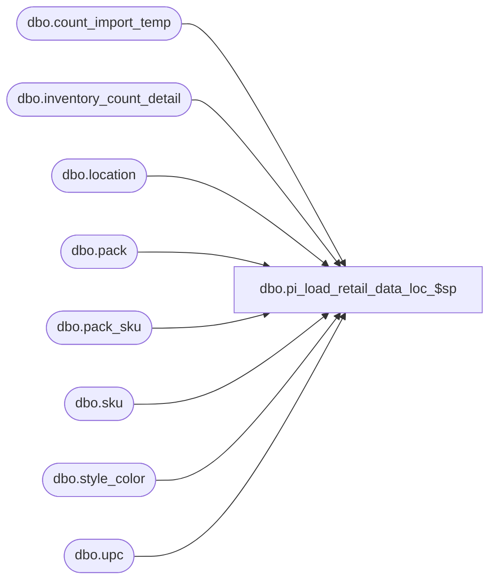

# dbo.pi_load_retail_data_loc_$sp

**Database:** me_01  
**Server:** bedrockdb02  

## Architecture Diagram



## Table Dependencies

| Referenced Table |
|---|
| dbo.count_import_temp |
| dbo.inventory_count_detail |
| dbo.location |
| dbo.pack |
| dbo.pack_sku |
| dbo.sku |
| dbo.style_color |
| dbo.upc |

## Stored Procedure Code

```sql
CREATE PROCEDURE dbo.pi_load_retail_data_loc_$sp

	(
		 @IclId AS DECIMAL (13, 0)
		,@DocId AS DECIMAL (12, 0)
		,@LocId AS SMALLINT 
		,@UpdateType AS SMALLINT
		,@MaxId AS DECIMAL (13, 0) OUTPUT -- FYI: No longer needed and should be removed at a later point
	)

AS

SET NOCOUNT ON

/*
Description: For the given location on the inventory control document, we want to find out the style/color/location/sku combinations for which retails have to be retrieved.
If the document is a beginning inventory document (@UpdateType = 3), then retails are retrieved based on the data in the "count_import_temp" and "inventory_count_detail" tables.
Otherwise, retails will be retrieved for data that has been frozen in the snapshot. This information is stored in the "#tt_frozen_retails" table.
The maximum id in this table is returned, so that retails can be retrieved in batches later on.
*/

DECLARE @JurisdictionId AS SMALLINT


SET @JurisdictionId = (SELECT L.jurisdiction_id FROM dbo.location L WHERE L.location_id = @LocId)


TRUNCATE TABLE #tt_frozen_retails


IF @UpdateType <> 3
BEGIN

	-- Retrieve style/color/location information for sku/locations in #tt_frozen_on_hand table
	INSERT INTO #tt_frozen_retails

		(
			 style_id
			,color_id
			,style_color_id
			,location_id
			,jurisdiction_id
			,sku_id
		)

	SELECT DISTINCT
		 sc.style_id
		,sc.color_id
		,sc.style_color_id
		,@LocId AS location_id
		,@JurisdictionId AS jurisdiction_id
		,k.sku_id
	FROM
		#tt_frozen_on_hand t
		INNER JOIN dbo.sku k ON k.sku_id = t.sku_id
		INNER JOIN dbo.style_color sc ON sc.style_color_id = k.style_color_id
	WHERE
		t.location_id = @LocId
			
END
ELSE BEGIN

	INSERT INTO #tt_frozen_on_hand

		(
			 sku_id
			,location_id
			,inventory_status_id
			,on_hand_units
			,on_hand_cost
			,on_hand_valuation_retail
			,on_hand_selling_retail
			,average_cost
			,average_cost_local
		)

	SELECT DISTINCT
		 u.sku_id
		,@LocId AS location_id
		,1 AS inventory_status_id
		,0 AS on_hand_units
		,0.000000 AS on_hand_cost
		,0.000000 AS on_hand_valuation_retail
		,0.000000 AS on_hand_selling_retail
		,c.cost AS average_cost
		,c.cost_local AS average_cost_local
	FROM
		dbo.count_import_temp c
		INNER JOIN dbo.location l ON l.location_code = c.location_code
		INNER JOIN dbo.upc u ON u.upc_number = c.upc_number
	WHERE
		l.location_id = @LocId


	INSERT INTO #tt_frozen_on_hand

		(
			 sku_id
			,location_id
			,inventory_status_id
			,on_hand_units
			,on_hand_cost
			,on_hand_valuation_retail
			,on_hand_selling_retail
			,average_cost
			,average_cost_local
		)

	SELECT DISTINCT
		 icd.sku_id
		,@LocId AS location_id
		,1 AS inventory_status_id
		,0 AS on_hand_units
		,0.000000 AS on_hand_cost
		,0.000000 AS on_hand_valuation_retail
		,0.000000 AS on_hand_selling_retail
		,icd.cost AS average_cost
		,icd.cost_local AS average_cost_local
	FROM
		dbo.inventory_count_detail icd
		LEFT JOIN #tt_frozen_on_hand t ON t.sku_id = icd.sku_id
	WHERE
		icd.inventory_control_loc_id = @IclId
		AND icd.inventory_control_id = @DocId
		AND t.sku_id IS NULL AND icd.pack_id IS NULL


	INSERT INTO #tt_pack_frozen_on_hand

		(
			 pack_id
			,location_id
			,on_hand_units
		)

	SELECT
		 u.pack_id
		,@LocId AS location_id
		,0 AS on_hand_units
	FROM
		dbo.count_import_temp c
		INNER JOIN dbo.location l ON l.location_code = c.location_code
		INNER JOIN dbo.upc u ON u.upc_number = c.upc_number
			AND u.pack_id IS NOT NULL
	WHERE
		l.location_id = @LocId


	INSERT INTO #tt_pack_frozen_on_hand

		(
			 pack_id
			,location_id
			,on_hand_units
		)

	SELECT
		 p.pack_id
		,@LocId AS location_id
		,0 AS on_hand_units
	FROM
		dbo.count_import_temp c
		INNER JOIN dbo.location l ON l.location_code = c.location_code
		INNER JOIN dbo.pack p ON p.pack_code = c.pack_code
		LEFT JOIN #tt_pack_frozen_on_hand t ON t.pack_id = p.pack_id
	WHERE
		l.location_id = @LocId
		AND t.pack_id IS NULL


	INSERT INTO #tt_pack_frozen_on_hand

		(
			 pack_id
			,location_id
			,on_hand_units
		)

	SELECT
		 icd.pack_id
		,@LocId AS location_id
		,0 AS on_hand_units
	FROM
		dbo.inventory_count_detail icd
		LEFT OUTER JOIN #tt_pack_frozen_on_hand t ON t.pack_id = icd.pack_id
	WHERE
		icd.inventory_control_loc_id = @IclId
		AND icd.inventory_control_id = @DocId
		AND t.pack_id IS NULL AND icd.sku_id IS NULL
				

	-- Explosion from packs...
	INSERT INTO #tt_frozen_on_hand

		(
			 sku_id
			,location_id
			,inventory_status_id
			,on_hand_units
			,on_hand_cost
			,on_hand_valuation_retail
			,on_hand_selling_retail
			,average_cost
			,average_cost_local
		)

	SELECT DISTINCT
		 ps.sku_id
		,@LocId AS location_id
		,1 AS inventory_status_id
		,0 AS on_hand_units
		,0.000000 AS on_hand_cost
		,0.000000 AS on_hand_valuation_retail
		,0.000000 AS on_hand_selling_retail
		,c.cost AS average_cost
		,c.cost_local AS average_cost_local
	FROM
		dbo.count_import_temp c
		INNER JOIN dbo.location l ON l.location_code = c.location_code
		INNER JOIN dbo.upc u ON u.upc_number = c.upc_number
			AND u.pack_id IS NOT NULL
		INNER JOIN dbo.pack_sku ps ON ps.pack_id = u.pack_id
		LEFT JOIN #tt_frozen_on_hand t ON t.sku_id = ps.sku_id
	WHERE
		l.location_id = @LocId
		AND t.sku_id IS NULL


	INSERT INTO #tt_frozen_on_hand

		(
			 sku_id
			,location_id
			,inventory_status_id
			,on_hand_units
			,on_hand_cost
			,on_hand_valuation_retail
			,on_hand_selling_retail
			,average_cost
			,average_cost_local
		)

	SELECT DISTINCT
		 ps.sku_id
		,@LocId AS location_id
		,1 AS inventory_status_id
		,0 AS on_hand_units
		,0.000000 AS on_hand_cost
		,0.000000 AS on_hand_valuation_retail
		,0.000000 AS on_hand_selling_retail
		,c.cost AS average_cost
		,c.cost_local average_cost_local
	FROM
		dbo.count_import_temp c
		INNER JOIN dbo.location l ON l.location_code = c.location_code
		INNER JOIN dbo.pack p ON p.pack_code = c.pack_code
		INNER JOIN dbo.pack_sku ps ON ps.pack_id = p.pack_id
		LEFT JOIN #tt_frozen_on_hand t ON t.sku_id = ps.sku_id
	WHERE
		l.location_id = @LocId
		AND t.sku_id IS NULL


	INSERT INTO #tt_frozen_on_hand

		(
			 sku_id
			,location_id
			,inventory_status_id
			,on_hand_units
			,on_hand_cost
			,on_hand_valuation_retail
			,on_hand_selling_retail
			,average_cost
			,average_cost_local
		)

	SELECT DISTINCT
		 ps.sku_id
		,@LocId AS location_id
		,1 AS inventory_status_id
		,0 AS on_hand_units
		,0.000000 AS on_hand_cost
		,0.000000 AS on_hand_valuation_retail
		,0.000000 AS on_hand_selling_retail
		,icd.cost AS average_cost
		,icd.cost_local AS average_cost_local
	FROM
		dbo.inventory_count_detail icd
		INNER JOIN dbo.pack_sku ps ON ps.pack_id = icd.pack_id
		LEFT JOIN #tt_frozen_on_hand t ON t.sku_id = ps.sku_id
	WHERE
		icd.inventory_control_loc_id = @IclId
		AND icd.inventory_control_id = @DocId
		AND t.sku_id IS NULL AND icd.pack_id IS NULL

		
	-- Retrieve style/color/location information for sku/locations in count_import_temp table and/or inventory_count_detail table
	INSERT INTO #tt_frozen_retails

		(
			 style_id
			,color_id
			,style_color_id
			,location_id
			,jurisdiction_id
			,sku_id
		)

	SELECT DISTINCT
		 sc.style_id
		,sc.color_id
		,sc.style_color_id
		,@LocId AS location_id
		,@JurisdictionId AS jurisdiction_id
		,k.sku_id
	FROM
		#tt_frozen_on_hand t
		INNER JOIN dbo.sku k ON k.sku_id = t.sku_id
		INNER JOIN dbo.style_color sc ON sc.style_color_id = k.style_color_id
	WHERE
		t.location_id = @LocId
		
END
```

