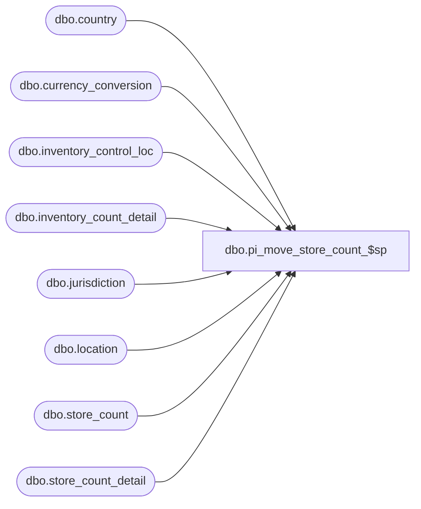

# dbo.pi_move_store_count_$sp

**Database:** me_01  
**Server:** bedrockdb02  

## Architecture Diagram



## Table Dependencies

| Referenced Table |
|---|
| dbo.country |
| dbo.currency_conversion |
| dbo.inventory_control_loc |
| dbo.inventory_count_detail |
| dbo.jurisdiction |
| dbo.location |
| dbo.store_count |
| dbo.store_count_detail |

## Stored Procedure Code

```sql
CREATE PROC [dbo].[pi_move_store_count_$sp] 
(
	@StoreCountId AS DECIMAL(12,0)
)
AS

/* 
Proc name: pi_move_store_count_$sp 
Description: Procedure called by IM WEB's Store Count to move the data from the store_count_detail table to the inventory_count_detail table for a given store count document

HISTORY: 
Date       	Name         	Def#	Desc
May 02,07   	Yves Rivest		Part of Merch 4.2 - IM WEB
March 19, 2010 Mike Estey  VS0458.UC159 - Maintain Store Counts (IM Web)
Aug. 11, 2010 	Feng Li		fix defect 118878 imweb store counts - home cost, local cost and selling retail are not properly calculated 
Aug. 31, 2010	Feng Li		fix defect 120436 imweb store counts - tot selling retail in ib inventory is not properly calculated for pseudo styles
4/2/2014	Ivan 	IMWEB 5.0: Store count-pseudostyle cost - wrong calculation, use pricing rate instead of purchasing
*/

/*--------------------------------------------------------------------------------------------------------------*/
/*--------------------------------------------------------------------------------------------------------------*/
-- Initialization work

	DECLARE @InvControlId AS DECIMAL(12,0)
	DECLARE @LocationId AS SMALLINT
	DECLARE @UpdateAction AS TINYINT
	DECLARE @ICLId AS DECIMAL(13,0)
	DECLARE @LastItemId AS DECIMAL(12,0)
	DECLARE @NewDetailCount AS INT
   DECLARE @count_date AS SMALLDATETIME -- VS0458.UC159 

	SELECT	@InvControlId = inventory_control_id,
		@LocationId = location_id,
		@UpdateAction = update_inventory_action,
      @count_date = count_date -- VS0458.UC159
	FROM	store_count 
	WHERE	store_count_id = @StoreCountId

-- VS0458.UC159 - Begin
-- Variable to store currency ids and exchange rate
DECLARE
	@to_currency_id SMALLINT
	, @exchange_rate FLOAT
	, @exchange_rate2 FLOAT

-- Variables to store error numbers and error messages
DECLARE 
	@line_id INT
	, @errno INT
	, @errmsg NVARCHAR(255)
   
-- Get the currency id for the location (@to_currency_id)

   SET @line_id = 410

   SELECT
      @to_currency_id = currency_id
   FROM
      country c
   INNER JOIN jurisdiction j ON c.country_id = j.country_id
   INNER JOIN location l ON j.jurisdiction_id = l.jurisdiction_id
   WHERE
      l.location_id = @LocationId

   SELECT @errno = @@error
   IF @errno <> 0
   BEGIN
      SELECT @errmsg = N'Failed to get the currency id for the location '
      GOTO error
   END
   
-- Get the purchasing exchange rate corresponding to the above currency ids

   SET @line_id = 430

   SELECT
      @exchange_rate = exchange_rate
   FROM
      currency_conversion 
   WHERE
      to_currency_id = @to_currency_id
      AND effective_from_date <= @count_date AND (effective_to_date >= @count_date OR effective_to_date IS NULL)
      AND currency_conversion_type = 1

   SELECT @errno = @@error
   IF @errno <> 0
   BEGIN
      SELECT @errmsg = N'Failed to get the exchange rate from currency_conversion '
      GOTO error
   END

   -- Get the pricing exchange rate corresponding to the above currency ids

   SET @line_id = 430

   SELECT
      @exchange_rate2 = exchange_rate
   FROM
      currency_conversion 
   WHERE
      to_currency_id = @to_currency_id
      AND effective_from_date <= @count_date AND (effective_to_date >= @count_date OR effective_to_date IS NULL)
      AND currency_conversion_type = 2

   SELECT @errno = @@error
   IF @errno <> 0
   BEGIN
      SELECT @errmsg = N'Failed to get the exchange rate from currency_conversion '
      GOTO error
   END

-- VS0458.UC159 - End


	IF @InvControlId IS NULL OR @LocationId IS NULL

		-- Store count Id is invalid or associated Inventory Control Id is NULL
		BEGIN
			RAISERROR (N'Specified store count id is invalid or associated inventory control id and/or location id is NULL', 16, 1)
		END

	ELSE
		BEGIN
			SELECT	@ICLId = inventory_control_loc_id,
				@LastItemId = last_item_id		
			FROM	inventory_control_loc
			WHERE	inventory_control_id = @InvControlId
				AND location_id = @LocationId
		
		
			IF @ICLId IS NULL
		
				-- No inventory control location found for the specified store count Id
				BEGIN
					RAISERROR (N'No inventory control location found for the specified store count Id', 16, 1)
				END
		
			ELSE
				BEGIN		
					-- Update SKUs already in the inventory_count_detail_table
					IF @UpdateAction = 1
						
						BEGIN
							-- Replace existing values
							-- VS0458.UC159 - added the total_retail_local and total_cost_local fields
							UPDATE	inventory_count_detail
							SET	inventory_count_detail.units_counted = sc.units_counted,
								inventory_count_detail.cost = sc.total_pseudo_cost,
								inventory_count_detail.total_retail = sc.total_pseudo_selling_retail,
								inventory_count_detail.total_valuation_retail = sc.total_pseudo_valuation_retail,
								inventory_count_detail.cost_local = sc.total_pseudo_cost_local
							FROM	(SELECT	sku_id,
									SUM(units_counted) as units_counted,
									SUM(total_pseudo_cost * @exchange_rate2) as total_pseudo_cost,
									SUM(total_pseudo_retail) as total_pseudo_selling_retail,
									SUM(total_pseudo_retail *  @exchange_rate2) as total_pseudo_valuation_retail,
									SUM(total_pseudo_cost) as total_pseudo_cost_local
								FROM	store_count_detail scd
								WHERE	store_count_id = @StoreCountId
								GROUP BY sku_id) sc
							WHERE	inventory_control_loc_id = @ICLId
								AND inventory_control_id = @InvControlId
								AND inventory_count_detail.sku_id = sc.sku_id
				
						END
					
					ELSE IF @UpdateAction = 0
						
						BEGIN
							-- Increment existing values
							-- VS0458.UC159 - added the total_retail_local and total_cost_local fields
							UPDATE	inventory_count_detail
							SET	inventory_count_detail.units_counted = inventory_count_detail.units_counted + sc.units_counted,
								inventory_count_detail.cost = inventory_count_detail.cost + sc.total_pseudo_cost,
								inventory_count_detail.total_retail = inventory_count_detail.total_retail + sc.total_pseudo_selling_retail,
								inventory_count_detail.total_valuation_retail = inventory_count_detail.total_valuation_retail + sc.total_pseudo_valuation_retail,
								inventory_count_detail.cost_local = inventory_count_detail.cost_local + sc.total_pseudo_cost_local
							FROM	(SELECT	sku_id,
									SUM(units_counted) as units_counted,
									SUM(total_pseudo_cost * @exchange_rate2) as total_pseudo_cost,
									SUM(total_pseudo_retail) as total_pseudo_selling_retail,
									SUM(total_pseudo_retail * @exchange_rate2) as total_pseudo_valuation_retail,
									SUM(total_pseudo_cost) as total_pseudo_cost_local
								FROM	store_count_detail scd
								WHERE	store_count_id = @StoreCountId
								GROUP BY sku_id) sc
							WHERE	inventory_control_loc_id = @ICLId
								AND inventory_control_id = @InvControlId
								AND inventory_count_detail.sku_id = sc.sku_id
				
						END
				
				
					-- Insert the store_count_details where the SKU is not currently found in inventory_count_detail
					-- VS0458.UC159 - added the total_retail_local and total_cost_local fields
					CREATE TABLE [#new_detail] (
						[inventory_control_id] DECIMAL(12, 0) NOT NULL,
						[inventory_control_loc_id] DECIMAL(13, 0) NOT NULL,
						[sku_id] DECIMAL(13, 0) NOT NULL ,
						[units_counted] INT NOT NULL,
						[total_pseudo_cost] DECIMAL(13,2) NULL,
						[total_pseudo_retail] DECIMAL(13,2) NULL,
						[total_pseudo_cost_local] DECIMAL(13,2) NULL,
						[total_pseudo_retail_local] DECIMAL(13,2) NULL,
						[detail_id] DECIMAL (13,0) identity)
				
				
					-- Use a temp table with identity to track the number of new rows
					-- This is needed to calculate the inventory_count_detail_id value 
					-- and to update the last_item_id in inventory_control_loc
					-- VS0458.UC159 - added the total_retail_local and total_cost_local fields
					INSERT INTO #new_detail (inventory_control_id,
								inventory_control_loc_id,
								sku_id,
								units_counted,
								total_pseudo_cost,
								total_pseudo_retail,
								total_pseudo_cost_local,
								total_pseudo_retail_local)
					SELECT 	@InvControlId,
						@ICLId,
						sku_id,
						SUM(units_counted),
						SUM(total_pseudo_cost * @exchange_rate2) as total_pseudo_cost,
						SUM(total_pseudo_retail * @exchange_rate2) as total_pseudo_retail,
						SUM(total_pseudo_cost) as total_pseudo_cost_local,
						SUM(total_pseudo_retail) as total_pseudo_retail_local
					FROM	store_count_detail
					WHERE	store_count_id = @StoreCountId
						AND sku_id NOT IN (	SELECT	sku_id
									FROM	inventory_count_detail
									WHERE	inventory_control_loc_id = @ICLId
										AND inventory_control_id = @InvControlId)
					GROUP BY sku_id
				
					-- Check if anything was added
					SELECT @NewDetailCount = COUNT(*) FROM #new_detail
				
					IF @NewDetailCount > 0
				
						BEGIN
				
							-- Add the rows to inventory_count_detail
							-- VS0458.UC159 - added the total_retail_local and total_cost_local fields
							INSERT INTO inventory_count_detail (	inventory_control_id,
												inventory_control_loc_id,
												inventory_count_detail_id,
												sku_id,
												units_counted,
												cost,
												total_retail,
												total_valuation_retail,
												cost_local)
														
							SELECT 	inventory_control_id,
								inventory_control_loc_id,
								(inventory_control_loc_id * 1000000) + @LastItemId + detail_id,
								sku_id,
								units_counted,
								total_pseudo_cost,
								total_pseudo_retail_local,
								total_pseudo_retail,
								total_pseudo_cost_local
							FROM	#new_detail
						
						
							-- Update the last_item_id in inventory_control_loc
							UPDATE	inventory_control_loc
							SET	last_item_id = (SELECT ISNULL(@LastItemId + MAX(#new_detail.detail_id), @LastItemId) FROM #new_detail)
							WHERE	inventory_control_loc_id = @ICLId
								AND inventory_control_id = @InvControlId
				
						END
				END
		END
return

error:   

	SET @errmsg = @errmsg
					+ N'(Line Id = ' + CONVERT(NVARCHAR(3), @line_id)
					+ N', Inventory Control Id = ' + CONVERT(NVARCHAR(12), @InvControlId)
					+ N', Location Id = ' + CONVERT(NVARCHAR(5), @LocationId) + N').'
    SET @errno = COALESCE(@errno, 0)
	RAISERROR (N'Message: %s   errno: %d', 16, 1, @errmsg, @errno)
	
	RETURN
```

