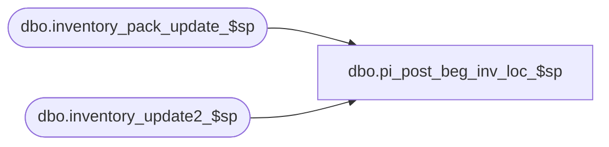

# dbo.pi_post_beg_inv_loc_$sp

**Database:** me_01  
**Server:** bedrockdb02  

## Architecture Diagram



## Table Dependencies

| Referenced Table |
|---|
| dbo.inventory_pack_update_$sp |
| dbo.inventory_update2_$sp |

## Stored Procedure Code

```sql
CREATE PROCEDURE [dbo].[pi_post_beg_inv_loc_$sp] 	
	( @DocNo AS NVARCHAR(20)
	, @DocDate AS SMALLDATETIME
	, @LocId AS SMALLINT
	, @IclId AS DECIMAL(13,0)
	, @DocId AS DECIMAL(12,0) )
AS

/*
Proc name: pi_post_beg_inv_loc_$sp 

Description: 

HISTORY:
Date       		Name         		Def#			Desc
November 22,2006   	Jacqueline Lin		80360			Ported over 3.0 def. 63923 - merch:im:physical inventory performance changes.    	
April 12, 2007		Jacqueline Lin		85321			im: pi: stored procs contain hardcoded collation statements
October 14, 2008	Pierrette Lemay		94572			Part of the trigger removal on ib_inventory.
Feb 1, 2010			Feng		multi-currency mod. 	add xxx_cost_local as needed. 
April 26, 2010		Feng		Increase precision from 2 to 6 for cost fields
April 11, 2011		Sameer Patel		126149			ib pack inventory total not updated
*/

BEGIN

	DECLARE @PseudoPSId AS SMALLINT
	EXEC dbo.sp_executesql
		N'SELECT @ParamPseudoPSId = pseudo_price_status_id FROM parameter_system'
		, N'@ParamPseudoPSId AS SMALLINT OUTPUT'
		, @ParamPseudoPSId = @PseudoPSId OUTPUT

	CREATE TABLE
		#tt_ib_inventory
			( [ib_inventory_id] [DECIMAL](12,0) IDENTITY (1,1) NOT NULL 
			, [sku_id] [DECIMAL](13,0) NOT NULL 
			, [location_id] [SMALLINT] NOT NULL 
			, [price_status_id] [SMALLINT] NOT NULL 
			, [transaction_date] [SMALLDATETIME] NOT NULL 
			, [transaction_type_code] [SMALLINT] NOT NULL 
			, [inventory_status_id] [SMALLINT] NOT NULL 
			, [other_location_id] [SMALLINT] NULL 
			, [transaction_reason_id] [SMALLINT] NULL 
			, [document_number] [NVARCHAR] (20) NULL -- Defect 85321: removal of hardcoded collation 
			, [transaction_units] [INT] NOT NULL 
			, [transaction_cost] [DECIMAL](18,6) NOT NULL 
			, [transaction_cost_local] [DECIMAL](18,6) NOT NULL 
			, [transaction_valuation_retail] [DECIMAL](14,2) NOT NULL 
			, [transaction_selling_retail] [DECIMAL](14,2) NOT NULL 
			, [price_change_type] [SMALLINT] NULL 
			, [units_affected] [INT] NULL )

	ALTER TABLE 
		#tt_ib_inventory 
	ADD PRIMARY KEY NONCLUSTERED
		( ib_inventory_id ) 

	ALTER TABLE 
		#tt_ib_inventory 
	ADD UNIQUE CLUSTERED
		( sku_id
		, location_id
		, transaction_date
		, ib_inventory_id ) 
		
	CREATE TABLE #tt_ib_pack_inventory 
		( [ib_pack_inventory_id] [decimal](12,0) IDENTITY(1,1) NOT NULL
		, [pack_id] [decimal](12,0) NOT NULL, [location_id] [smallint] NOT NULL
		, [transaction_date] [smalldatetime] NOT NULL
		, [transaction_type_code] [smallint] NOT NULL
		, [other_location_id] [smallint] NULL
		, [document_number] [nvarchar](20) NULL
		, [transaction_units] [int] NOT NULL DEFAULT(0)
		, [distribution_id] [bigint] NULL )

	ALTER TABLE 
		#tt_ib_pack_inventory 
	ADD PRIMARY KEY NONCLUSTERED
		( ib_pack_inventory_id ) 

	EXEC dbo.sp_executesql
		N'INSERT INTO
			#tt_ib_pack_inventory
				( pack_id
				, location_id
				, transaction_date
				, transaction_type_code
				, document_number
				, transaction_units )
		  SELECT
			pack_id,
			@ParamLocId location_id,
			@ParamDocDate transaction_date,
			1590 transaction_type_code,
			@ParamDocNo document_number,
			units_counted transaction_units
		  FROM
			inventory_count_detail
		  WHERE
			inventory_count_detail.inventory_control_loc_id = @ParamIclId
			AND inventory_count_detail.inventory_control_id = @ParamDocId
			AND inventory_count_detail.units_counted <> 0
			AND inventory_count_detail.pack_id IS NOT NULL'
		, N'@ParamDocNo AS NVARCHAR(20)
		  , @ParamDocDate AS SMALLDATETIME
		  , @ParamLocId AS SMALLINT
		  , @ParamIclId AS DECIMAL(13,0)
		  , @ParamDocId AS DECIMAL(12,0)'
		, @ParamDocNo = @DocNo
		, @ParamDocDate = @DocDate
		, @ParamLocId = @LocId
		, @ParamIclId = @IclId
		, @ParamDocId =  @DocId

	EXEC dbo.sp_executesql
		N'INSERT INTO
			#tt_ib_inventory
				( sku_id
				, location_id
				, inventory_status_id
				, price_status_id
				, transaction_type_code
				, document_number
				, transaction_date
				, transaction_units
				, transaction_cost
				, transaction_cost_local
				, transaction_valuation_retail
				, transaction_selling_retail )
		  SELECT
			sku_id
			, location_id
			, inventory_status_id
			, price_status_id
			, transaction_type_code
			, document_number
			, transaction_date
			, transaction_units
			, transaction_cost
			, transaction_cost_local
			, transaction_valuation_retail
			, transaction_selling_retail
		  FROM
			( SELECT
				sku_id
				, @ParamLocId location_id
				, 1 inventory_status_id
				, @ParamPseudoPSId price_status_id
				, 590 transaction_type_code
				, @ParamDocNo document_number
				, @ParamDocDate transaction_date
				, extended_units_counted transaction_units
				, cost transaction_cost
				, cost_local transaction_cost_local
				, total_valuation_retail transaction_valuation_retail
				, total_retail transaction_selling_retail
			  FROM
				inventory_count_detail
			  WHERE
				inventory_control_loc_id = @ParamIclId
				AND inventory_control_id = @ParamDocId
				AND extended_units_counted <> 0
				AND total_retail IS NOT NULL
			  UNION ALL
			  SELECT
				sku_id
				, @ParamLocId location_id
				, 1 inventory_status_id
				, price_status_id
				, 590 transaction_type_code
				, @ParamDocNo document_number
				, @ParamDocDate transaction_date
				, extended_units_counted transaction_units
				, extended_units_counted * COALESCE(cost, average_cost) transaction_cost
				, extended_units_counted * COALESCE(cost_local, average_cost_local) transaction_cost_local
				, extended_units_counted * valuation_unit_retail transaction_valuation_retail
				, extended_units_counted * selling_unit_retail transaction_selling_retail
			  FROM
				inventory_count_detail
			  WHERE
				inventory_control_loc_id = @ParamIclId
				AND inventory_control_id = @ParamDocId
				AND extended_units_counted <> 0
				AND total_retail IS NULL
				AND pack_id IS NULL ) T'
		, N'@ParamDocNo AS NVARCHAR(20)
		  , @ParamDocDate AS SMALLDATETIME
		  , @ParamLocId AS SMALLINT
		  , @ParamIclId AS DECIMAL(13,0)
		  , @ParamDocId AS DECIMAL(12,0)
		  , @ParamPseudoPSId AS SMALLINT'
		, @ParamDocNo = @DocNo
		, @ParamDocDate = @DocDate
		, @ParamLocId = @LocId
		, @ParamIclId = @IclId
		, @ParamDocId =  @DocId
		, @ParamPseudoPSId = @PseudoPSId
		
	EXEC dbo.sp_executesql
		N'EXEC ib_post_retro_retails_$sp 
			@ParamLocId
			, @ParamDocDate'
		, N'@ParamDocDate AS SMALLDATETIME
		  , @ParamLocId AS SMALLINT'
		, @ParamDocDate = @DocDate
		, @ParamLocId = @LocId	
	

/********************************* #94572 ********************************************/

	  EXEC inventory_update2_$sp 'SELECT sku_id, location_id, price_status_id,transaction_date,transaction_type_code,inventory_status_id,NULL,NULL,document_number,transaction_units,transaction_cost,transaction_cost_local,transaction_valuation_retail,
		transaction_selling_retail,price_change_type,units_affected FROM #tt_ib_inventory ORDER BY ib_inventory_id'
		
	  EXEC inventory_pack_update_$sp 'SELECT pack_id, location_id, transaction_date, document_number, 
			transaction_type_code, other_location_id, transaction_units, distribution_id FROM #tt_ib_pack_inventory ORDER BY ib_pack_inventory_id'	

/******************************************************************************************/


	EXEC dbo.sp_executesql
		N'UPDATE
			style_detail
		  SET
			total_inventory_units = total_inventory_units + oh_units_adj
		  FROM
			style_detail
			, ( SELECT
				style_id
				, SUM(extended_units_counted) oh_units_adj
			    FROM
				inventory_count_detail
				, sku
			    WHERE
				inventory_count_detail.sku_id = sku.sku_id
				AND inventory_count_detail.inventory_control_loc_id = @ParamIclId
				AND inventory_count_detail.inventory_control_id = @ParamDocId
			    GROUP BY
				style_id
			    HAVING
				SUM(extended_units_counted - total_oh_book_units) <> 0 ) T
		  WHERE
			T.style_id = style_detail.style_id'
		, N'@ParamIclId AS DECIMAL(13,0)
		, @ParamDocId AS DECIMAL(12,0)'
		, @ParamIclId = @IclId
		, @ParamDocId =  @DocId

END
```

