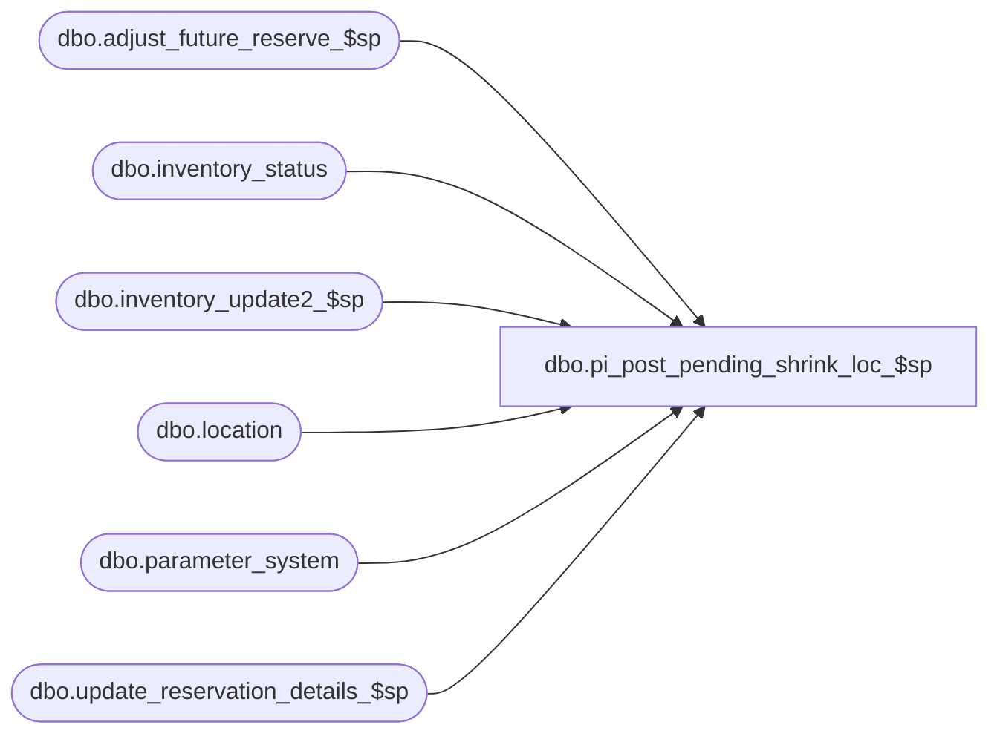

# dbo.pi_post_pending_shrink_loc_$sp

**Database:** me_01  
**Server:** bedrockdb02  

## Architecture Diagram



## Table Dependencies

| Referenced Table |
|---|
| dbo.adjust_future_reserve_$sp |
| dbo.inventory_status |
| dbo.inventory_update2_$sp |
| dbo.location |
| dbo.parameter_system |
| dbo.update_reservation_details_$sp |

## Stored Procedure Code

```sql
CREATE PROCEDURE [dbo].[pi_post_pending_shrink_loc_$sp]


    ( @DocNo AS NVARCHAR(20)
    , @DocDate AS SMALLDATETIME
    , @LocId AS SMALLINT
    , @IclId AS DECIMAL(13,0)
    , @DocId AS DECIMAL(12,0) )
AS

/*
Proc name: pi_post_pending_shrink_loc_$sp

Description:

HISTORY:
Date       		Name         		Def#			Desc
November 22,2006   	Jacqueline Lin		80360			Ported over 3.0 def. 63923 - merch:im:physical inventory performance changes.
November 23,2006	Jacqueline Lin		80360			Ported over 3.0 def. 64494 - merch:im:invalid comlumn errors when posting count against pending shrink
April 16, 2007		Jacqueline Lin		85452			im: pi: stored procs contain hardcoded collation statements
August 22, 2007		Sameer Patel		91003			incorrect shrink cost calculation when using chain average cost
December 20, 2007	Jacqueline Lin		1-3W7V7Z		IM: Physical Inventory: posting icd causing inbalance retail in ib_inventory
October 14, 2008	Pierrette Lemay		94572			Part of the trigger removal on ib_inventory.
Feb 2, 2010			Feng		multi-currency mod. 	add xxx_cost_local as needed.
                                                        Because xxx_cost_local fields are already set according to the system parameter ib_average_cost_location_level
                                                        in table inventory_count_detail, so just take it to calculate other fields for Chain/jurisdiction level.
                                                        No need to branch if ib_average_cost_location_level = jurisdiction.
April 26, 2010		Feng		Increase precision from 2 to 6 for cost fields
12/23/2015			Ivan Dimitrov		152886 - system is using the current retail to calculate the shrink instead of the on hand retail.
3/17/2016			Ivan Dimitrov		DMER-346 - Vestis: backdated transaction in ib_inventory
*/

BEGIN

  DECLARE @useFutureInventoryFlag as BIT
    DECLARE @PseudoPSId AS SMALLINT

  SELECT
    @useFutureInventoryFlag = use_future_inventory_flag,
    @PseudoPSId = pseudo_price_status_id
  FROM parameter_system

    -- Defect 1-3W7V7Z - need to pick up the valuation_date to be used later to populate IB with
    DECLARE @ValuationDate AS SMALLDATETIME
    EXEC dbo.sp_executesql
        N'SELECT @ParamValuationDate = valuation_date FROM inventory_control where document_no = @ParamDocNo'
        , N'@ParamValuationDate AS SMALLDATETIME OUTPUT
        , @ParamDocNo AS NVARCHAR(20)'
        , @ParamValuationDate = @ValuationDate OUTPUT
        , @ParamDocNo = @DocNo

    -- DEFECT 87883
    -- Retrieve the method of average cost calculation being used
    -- 1: average cost by location
    -- 2: average cost by chain
    DECLARE @AvgCostType AS SMALLINT
    EXEC sp_executesql
        N' SELECT @ParamAvgCostType = ib_average_cost_location_level FROM parameter_system'
        , N'@ParamAvgCostType AS SMALLINT OUTPUT'
        , @ParamAvgCostType = @AvgCostType OUTPUT

    CREATE TABLE
        #tt_ib_inventory
            ( [ib_inventory_id] [DECIMAL](12,0) IDENTITY (1,1) NOT NULL
            , [sku_id] [DECIMAL](13,0) NOT NULL
            , [location_id] [SMALLINT] NOT NULL
            , [price_status_id] [SMALLINT] NOT NULL
            , [transaction_date] [SMALLDATETIME] NOT NULL
            , [transaction_type_code] [SMALLINT] NOT NULL
            , [inventory_status_id] [SMALLINT] NOT NULL
            , [other_location_id] [SMALLINT] NULL
            , [transaction_reason_id] [SMALLINT] NULL
            , [document_number] [NVARCHAR] (20) NULL -- Defect 85452: removal of hardcoded collation
            , [transaction_units] [INT] NOT NULL
            , [transaction_cost] [DECIMAL](18,6) NOT NULL
            , [transaction_cost_local] [DECIMAL](18,6) NOT NULL
            , [transaction_valuation_retail] [DECIMAL](14,2) NOT NULL
            , [transaction_selling_retail] [DECIMAL](14,2) NOT NULL
            , [price_change_type] [SMALLINT] NULL
            , [units_affected] [INT] NULL )

    ALTER TABLE
        #tt_ib_inventory
    ADD PRIMARY KEY NONCLUSTERED
        ( ib_inventory_id )

    ALTER TABLE
        #tt_ib_inventory
    ADD UNIQUE CLUSTERED
        ( sku_id
        , location_id
        , transaction_date
        , ib_inventory_id )

    -- DEFECT 91003
    -- If method to retrieve average cost is by chain, then transaction_cost for shrink record will be (extended_units_counted - total_oh_book_units) * average_cost
    -- Otherwise calcuation should be (extended_units_counted + total_oh_in_transit_units) * average_cost - (total_oh_book_cost + total_oh_in_transit_cost)
    IF (@AvgCostType = 1)

      BEGIN

            EXEC dbo.sp_executesql
                N'INSERT INTO
                    #tt_ib_inventory
                        ( sku_id
                        , location_id
                        , inventory_status_id
                        , price_status_id
                        , transaction_type_code
                        , document_number
                        , transaction_date
                        , transaction_units
                        , transaction_cost
                        , transaction_cost_local
                        , transaction_valuation_retail
                        , transaction_selling_retail )
                  SELECT
                    sku_id
                    , location_id
                    , inventory_status_id
                    , price_status_id
                    , transaction_type_code
                    , document_number
                    , transaction_date
                    , transaction_units
                    , transaction_cost
                    , transaction_cost_local
                    , transaction_valuation_retail
                    , transaction_selling_retail
                  FROM
                    ( SELECT
                        0 insert_priority
                        , sku_id
                        , @ParamLocId location_id
                        , 4 inventory_status_id
                        , @ParamPseudoPSId price_status_id
                        , 501 transaction_type_code
                        , @ParamDocNo document_number
                        , @ParamDocDate transaction_date
                        , -COALESCE(discrepancy_units, 0) transaction_units
                        , -COALESCE(discrepancy_cost, 0) transaction_cost
                        , -COALESCE(discrepancy_cost_local, 0) transaction_cost_local
                        , -COALESCE(discrepancy_val_retail, 0) transaction_valuation_retail
                        , -COALESCE(discrepancy_sell_retail, 0) transaction_selling_retail
                      FROM
                        inventory_count_detail
                      WHERE
                        inventory_control_loc_id = @ParamIclId
                        AND inventory_control_id = @ParamDocId
                        AND ( COALESCE(discrepancy_units, 0) <> 0
                            OR COALESCE(discrepancy_cost, 0) <> 0
                            OR COALESCE(discrepancy_cost_local, 0) <> 0
                            OR COALESCE(discrepancy_val_retail, 0) <> 0
                            OR COALESCE(discrepancy_sell_retail, 0) <> 0 )
                        AND total_retail IS NOT NULL
                      UNION ALL
                      SELECT
                        0 insert_priority
                        , sku_id
                        , @ParamLocId location_id
                        , 7 inventory_status_id
                        , @ParamPseudoPSId price_status_id
                        , 501 transaction_type_code
                        , @ParamDocNo document_number
                        , @ParamDocDate transaction_date
                        , -COALESCE(pending_shrink_units, 0) transaction_units
                        , -COALESCE(pending_shrink_cost, 0) transaction_cost
                        , -COALESCE(pending_shrink_cost_local, 0) transaction_cost_local
                        , -COALESCE(pending_shrink_val_retail, 0) transaction_valuation_retail
                        , -COALESCE(pending_shrink_sell_retail, 0) transaction_selling_retail
                      FROM
                        inventory_count_detail
                      WHERE
                        inventory_control_loc_id = @ParamIclId
                        AND inventory_control_id = @ParamDocId
                        AND ( COALESCE(pending_shrink_units, 0) <> 0
                            OR COALESCE(pending_shrink_cost, 0) <> 0
                            OR COALESCE(pending_shrink_cost_local, 0) <> 0
                            OR COALESCE(pending_shrink_val_retail, 0) <> 0
                            OR COALESCE(pending_shrink_sell_retail, 0) <> 0 )
                        AND total_retail IS NOT NULL
                      UNION ALL
                      SELECT
                        0 insert_priority
                        , sku_id
                        , @ParamLocId location_id
                        , 4 inventory_status_id
                        , price_status_id
                        , 501 transaction_type_code
                        , @ParamDocNo document_number
                        , @ParamDocDate transaction_date
                        , -COALESCE(discrepancy_units, 0) transaction_units
                        , -COALESCE(discrepancy_cost, 0) transaction_cost
                        , -COALESCE(discrepancy_cost_local, 0) transaction_cost_local
                        , -COALESCE(discrepancy_val_retail, 0) transaction_valuation_retail
                        , -COALESCE(discrepancy_sell_retail, 0) transaction_selling_retail
                      FROM
                        inventory_count_detail
                      WHERE
                        inventory_control_loc_id = @ParamIclId
                        AND inventory_control_id = @ParamDocId
                        AND ( COALESCE(discrepancy_units, 0) <> 0
                            OR COALESCE(discrepancy_cost, 0) <> 0
                            OR COALESCE(discrepancy_cost_local, 0) <> 0
                            OR COALESCE(discrepancy_val_retail, 0) <> 0
                            OR COALESCE(discrepancy_sell_retail, 0) <> 0 )
                        AND total_retail IS NULL
                        AND pack_id IS NULL
                        AND (average_cost IS NOT NULL OR average_cost_local IS NOT NULL)
                      UNION ALL
                      SELECT
                        0 insert_priority
                        , sku_id
                        , @ParamLocId location_id
                        , 7 inventory_status_id
                        , price_status_id
                        , 501 transaction_type_code
                        , @ParamDocNo document_number
                        , @ParamDocDate transaction_date
                        , -COALESCE(pending_shrink_units, 0) transaction_units
                        , -COALESCE(pending_shrink_cost, 0) transaction_cost
                        , -COALESCE(pending_shrink_cost_local, 0) transaction_cost_local
                        , -COALESCE(pending_shrink_val_retail, 0) transaction_valuation_retail
            , -COALESCE(pending_shrink_sell_retail, 0) transaction_selling_retail
                      FROM
                        inventory_count_detail
                      WHERE
                        inventory_control_loc_id = @ParamIclId
                        AND inventory_control_id = @ParamDocId
                        AND ( COALESCE(pending_shrink_units, 0) <> 0
                            OR COALESCE(pending_shrink_cost, 0) <> 0
                            OR COALESCE(pending_shrink_cost_local, 0) <> 0
                            OR COALESCE(pending_shrink_val_retail, 0) <> 0
                            OR COALESCE(pending_shrink_sell_retail, 0) <> 0 )
                        AND total_retail IS NULL
                        AND pack_id IS NULL
                        AND (average_cost IS NOT NULL OR average_cost_local IS NOT NULL)
                      UNION ALL
                      SELECT
                        1 insert_priority
                        , sku_id
                        , @ParamLocId location_id
                        , 1 inventory_status_id
            , @ParamPseudoPSId price_status_id
                        , 501 transaction_type_code
                        , @ParamDocNo document_number
                        , @ParamDocDate transaction_date
                        , COALESCE(discrepancy_units, 0) transaction_units
                        , COALESCE(discrepancy_cost, 0) transaction_cost
                        , COALESCE(discrepancy_cost_local, 0) transaction_cost_local
                        , COALESCE(discrepancy_val_retail, 0) transaction_valuation_retail
                        , COALESCE(discrepancy_sell_retail, 0) transaction_selling_retail
                      FROM
                        inventory_count_detail
                      WHERE
                        inventory_control_loc_id = @ParamIclId
                        AND inventory_control_id = @ParamDocId
                        AND ( COALESCE(discrepancy_units, 0) <> 0
                            OR COALESCE(discrepancy_cost, 0) <> 0
                            OR COALESCE(discrepancy_cost_local, 0) <> 0
                            OR COALESCE(discrepancy_val_retail, 0) <> 0
                            OR COALESCE(discrepancy_sell_retail, 0) <> 0 )
                        AND total_retail IS NOT NULL
                      UNION ALL
                      SELECT
                        1 insert_priority
                        , sku_id
                        , @ParamLocId location_id
                        , 1 inventory_status_id
                        , @ParamPseudoPSId price_status_id
                        , 501 transaction_type_code
                        , @ParamDocNo document_number
                        , @ParamDocDate transaction_date
                        , COALESCE(pending_shrink_units, 0) transaction_units
                        , COALESCE(pending_shrink_cost, 0) transaction_cost
                        , COALESCE(pending_shrink_cost_local, 0) transaction_cost_local
                        , COALESCE(pending_shrink_val_retail, 0) transaction_valuation_retail
                        , COALESCE(pending_shrink_sell_retail, 0) transaction_selling_retail
                      FROM
                        inventory_count_detail
                      WHERE
                        inventory_control_loc_id = @ParamIclId
                        AND inventory_control_id = @ParamDocId
                        AND ( COALESCE(pending_shrink_units, 0) <> 0
                            OR COALESCE(pending_shrink_cost, 0) <> 0
                            OR COALESCE(pending_shrink_cost_local, 0) <> 0
                            OR COALESCE(pending_shrink_val_retail, 0) <> 0
                            OR COALESCE(pending_shrink_sell_retail, 0) <> 0 )
                        AND total_retail IS NOT NULL
                      UNION ALL
                      SELECT
                        1 insert_priority
                        , sku_id
                        , @ParamLocId location_id
                        , 1 inventory_status_id
                        , price_status_id
                        , 501 transaction_type_code
                 , @ParamDocNo document_number
                        , @ParamDocDate transaction_date
                        , COALESCE(discrepancy_units, 0) transaction_units
                        , COALESCE(discrepancy_cost, 0) transaction_cost
                        , COALESCE(discrepancy_cost_local, 0) transaction_cost_local
                        , COALESCE(discrepancy_val_retail, 0) transaction_valuation_retail
                        , COALESCE(discrepancy_sell_retail, 0) transaction_selling_retail
                      FROM
                        inventory_count_detail
                      WHERE
                        inventory_control_loc_id = @ParamIclId
                        AND inventory_control_id = @ParamDocId
                        AND ( COALESCE(discrepancy_units, 0) <> 0
                            OR COALESCE(discrepancy_cost, 0) <> 0
                            OR COALESCE(discrepancy_cost_local, 0) <> 0
                            OR COALESCE(discrepancy_val_retail, 0) <> 0
                            OR COALESCE(discrepancy_sell_retail, 0) <> 0 )
                        AND total_retail IS NULL
                        AND pack_id IS NULL
            AND (average_cost IS NOT NULL OR average_cost_local IS NOT NULL)
                      UNION ALL
                      SELECT
                        1 insert_priority
                        , sku_id
                        , @ParamLocId location_id
                        , 1 inventory_status_id
                        , price_status_id
                        , 501 transaction_type_code
                        , @ParamDocNo document_number
                        , @ParamDocDate transaction_date
                        , COALESCE(pending_shrink_units, 0) transaction_units
                        , COALESCE(pending_shrink_cost, 0) transaction_cost
                        , COALESCE(pending_shrink_cost_local, 0) transaction_cost_local
                        , COALESCE(pending_shrink_val_retail, 0) transaction_valuation_retail
                        , COALESCE(pending_shrink_sell_retail, 0) transaction_selling_retail
                  FROM
                        inventory_count_detail
                      WHERE
                        inventory_control_loc_id = @ParamIclId
                        AND inventory_control_id = @ParamDocId
                        AND ( COALESCE(pending_shrink_units, 0) <> 0
                            OR COALESCE(pending_shrink_cost, 0) <> 0
                            OR COALESCE(pending_shrink_cost_local, 0) <> 0
                            OR COALESCE(pending_shrink_val_retail, 0) <> 0
                            OR COALESCE(pending_shrink_sell_retail, 0) <> 0 )
                        AND total_retail IS NULL
                        AND pack_id IS NULL
                        AND (average_cost IS NOT NULL OR average_cost_local IS NOT NULL)
                      UNION ALL
                      SELECT
                        2 insert_priority
            , sku_id
                        , @ParamLocId location_id
                        , 1 inventory_status_id
                        , @ParamPseudoPSId price_status_id
                        , 501 transaction_type_code
                        , @ParamDocNo document_number
                        , @ParamDocDate transaction_date
                        , COALESCE(extended_units_counted, 0) - COALESCE(total_oh_book_units, 0) transaction_units
                        , cost - COALESCE(total_oh_book_cost, 0) transaction_cost
                        , cost_local - COALESCE(total_oh_book_cost_local, 0) transaction_cost_local
                        , COALESCE(total_valuation_retail, 0) - COALESCE(total_oh_book_val_retail, 0) transaction_valuation_retail
                        , COALESCE(total_retail, 0) - COALESCE(total_oh_book_sell_retail, 0) transaction_selling_retail
                      FROM
                        inventory_count_detail
                      WHERE
                        inventory_control_loc_id = @ParamIclId
                        AND inventory_control_id = @ParamDocId
                        AND ( (COALESCE(extended_units_counted, 0) - COALESCE(total_oh_book_units, 0)) <> 0
                            OR (cost - COALESCE(total_oh_book_cost, 0)) <> 0
                            OR (cost_local - COALESCE(total_oh_book_cost_local, 0)) <> 0
                            OR (COALESCE(total_retail, 0) - COALESCE(total_oh_book_sell_retail, 0)) <> 0 )
                        AND total_retail IS NOT NULL
                      UNION ALL
                      SELECT
                        2 insert_priority
                        , sku_id
                        , @ParamLocId location_id
                        , 1 inventory_status_id
                        , price_status_id
                        , 501 transaction_type_code
                        , @ParamDocNo document_number
                        , @ParamDocDate transaction_date
                        , COALESCE(extended_units_counted, 0) - COALESCE(total_oh_book_units, 0) transaction_units
                        , (COALESCE(extended_units_counted, 0) + COALESCE(total_oh_in_transit_units, 0)) * average_cost - (COALESCE(total_oh_book_cost, 0) + COALESCE(total_oh_in_transit_cost, 0)) transaction_cost
                        , (COALESCE(extended_units_counted, 0) + COALESCE(total_oh_in_transit_units, 0)) * average_cost_local - (COALESCE(total_oh_book_cost_local, 0) + COALESCE(total_oh_in_transit_cost_local, 0)) transaction_cost_local
                        , (COALESCE(extended_units_counted, 0) * COALESCE(valuation_unit_retail, 0)) - (COALESCE(total_oh_book_units, 0) * COALESCE(valuation_unit_retail, 0)) transaction_valuation_retail
                        , (COALESCE(extended_units_counted, 0) * COALESCE(selling_unit_retail, 0)) - (COALESCE(total_oh_book_units, 0) * COALESCE(selling_unit_retail, 0)) transaction_selling_retail
                      FROM
                        inventory_count_detail
                      WHERE
                        inventory_control_loc_id = @ParamIclId
                        AND inventory_control_id = @ParamDocId
                        AND ( (COALESCE(extended_units_counted, 0) - COALESCE(total_oh_book_units, 0)) <> 0
                            OR (COALESCE(extended_units_counted, 0) * average_cost - COALESCE(total_oh_book_cost, 0)) <> 0
                            OR (COALESCE(extended_units_counted, 0) * average_cost_local - COALESCE(total_oh_book_cost_local, 0)) <> 0 )
                        AND total_retail IS NULL
                        AND pack_id IS NULL
                        AND (average_cost IS NOT NULL OR average_cost_local IS NOT NULL)
                      UNION ALL
                      SELECT
                        3 insert_priority
                        , sku_id
                        , @ParamLocId location_id
                        , 7 inventory_status_id
                        , @ParamPseudoPSId price_status_id
                        , 501 transaction_type_code
                        , @ParamDocNo document_number
                        , @ParamDocDate transaction_date
                        , -(COALESCE(extended_units_counted, 0) - COALESCE(total_oh_book_units, 0)) transaction_units
                        , -(cost - COALESCE(total_oh_book_cost, 0)) transaction_cost
                        , -(cost_local - COALESCE(total_oh_book_cost_local, 0)) transaction_cost_local
                        , -(COALESCE(total_valuation_retail, 0) - COALESCE(total_oh_book_val_retail, 0)) transaction_valuation_retail
                        , -(COALESCE(total_retail, 0) - COALESCE(total_oh_book_sell_retail, 0)) transaction_selling_retail
                      FROM
                        inventory_count_detail
                      WHERE
                        inventory_control_loc_id = @ParamIclId
                        AND inventory_control_id = @ParamDocId
                        AND ( (COALESCE(extended_units_counted, 0) - COALESCE(total_oh_book_units, 0)) <> 0
                            OR (cost - COALESCE(total_oh_book_cost, 0)) <> 0
                            OR (cost_local - COALESCE(total_oh_book_cost_local, 0)) <> 0
                            OR (COALESCE(total_retail, 0) - COALESCE(total_oh_book_sell_retail, 0)) <> 0 )
                        AND total_retail IS NOT NULL
                      UNION ALL
                      SELECT
                        3 insert_priority
                       , sku_id
                        , @ParamLocId location_id
                        , 7 inventory_status_id
                        , price_status_id
                        , 501 transaction_type_code
                        , @ParamDocNo document_number
                        , @ParamDocDate transaction_date
                        , -(COALESCE(extended_units_counted, 0) - COALESCE(total_oh_book_units, 0)) transaction_units
                        , -((COALESCE(extended_units_counted, 0) + COALESCE(total_oh_in_transit_units, 0)) * average_cost - (COALESCE(total_oh_book_cost, 0) + COALESCE(total_oh_in_transit_cost, 0))) transaction_cost
                        , -((COALESCE(extended_units_counted, 0) + COALESCE(total_oh_in_transit_units, 0)) * average_cost_local - (COALESCE(total_oh_book_cost_local, 0) + COALESCE(total_oh_in_transit_cost_local, 0))) transaction_cost_local
                        , -((COALESCE(extended_units_counted, 0) * COALESCE(valuation_unit_retail, 0)) - (COALESCE(total_oh_book_units, 0) * COALESCE(valuation_unit_retail, 0))) transaction_valuation_retail
                        , -((COALESCE(extended_units_counted, 0) * COALESCE(selling_unit_retail, 0)) - (COALESCE(total_oh_book_units, 0) * COALESCE(selling_unit_retail, 0))) transaction_selling_retail
                      FROM
                        inventory_count_detail
                      WHERE
                        inventory_control_loc_id = @ParamIclId
                        AND inventory_control_id = @ParamDocId
                        AND ( (COALESCE(extended_units_counted, 0) - COALESCE(total_oh_book_units, 0)) <> 0
                            OR (COALESCE(extended_units_counted, 0) * average_cost - COALESCE(total_oh_book_cost, 0)) <> 0
                            OR (COALESCE(extended_units_counted, 0) * average_cost_local - COALESCE(total_oh_book_cost_local, 0)) <> 0)
                        AND total_retail IS NULL
                        AND pack_id IS NULL
                        AND (average_cost IS NOT NULL OR average_cost_local IS NOT NULL) ) T
                  ORDER BY
                    insert_priority'
                , N'@ParamDocNo AS NVARCHAR(20)
                  , @ParamDocDate AS SMALLDATETIME
                  , @ParamLocId AS SMALLINT
                , @ParamIclId AS DECIMAL(13,0)
                  , @ParamDocId AS DECIMAL(12,0)
                  , @ParamPseudoPSId AS SMALLINT'
                , @ParamDocNo = @DocNo
            , @ParamDocDate = @ValuationDate -- Defect 1-3W7V7Z - change @DocDate to @ValuationDate
                , @ParamLocId = @LocId
                , @ParamIclId = @IclId
                , @ParamDocId =  @DocId
                , @ParamPseudoPSId = @PseudoPSId

        END

    ELSE

        BEGIN

            EXEC dbo.sp_executesql
                N'INSERT INTO
                    #tt_ib_inventory
                        ( sku_id
                        , location_id
                        , inventory_status_id
                        , price_status_id
                        , transaction_type_code
                        , document_number
                        , transaction_date
                        , transaction_units
                        , transaction_cost
                        , transaction_cost_local
                        , transaction_valuation_retail
                        , transaction_selling_retail )
                  SELECT
                    sku_id
                    , location_id
                    , inventory_status_id
                    , price_status_id
                    , transaction_type_code
                    , document_number
                    , transaction_date
                    , transaction_units
                    , transaction_cost
                    , transaction_cost_local
                    , transaction_valuation_retail
                    , transaction_selling_retail
                  FROM
                    ( SELECT
                        0 insert_priority
                        , sku_id
                        , @ParamLocId location_id
                        , 4 inventory_status_id
                        , @ParamPseudoPSId price_status_id
                        , 501 transaction_type_code
                        , @ParamDocNo document_number
                        , @ParamDocDate transaction_date
                        , -COALESCE(discrepancy_units, 0) transaction_units
                        , -COALESCE(discrepancy_cost, 0) transaction_cost
                        , -COALESCE(discrepancy_cost_local, 0) transaction_cost_local
                        , -COALESCE(discrepancy_val_retail, 0) transaction_valuation_retail
            , -COALESCE(discrepancy_sell_retail, 0) transaction_selling_retail
                      FROM
                        inventory_count_detail
                      WHERE
                        inventory_control_loc_id = @ParamIclId
                        AND inventory_control_id = @ParamDocId
                        AND ( COALESCE(discrepancy_units, 0) <> 0
                            OR COALESCE(discrepancy_cost, 0) <> 0
                            OR COALESCE(discrepancy_cost_local, 0) <> 0
                            OR COALESCE(discrepancy_val_retail, 0) <> 0
                            OR COALESCE(discrepancy_sell_retail, 0) <> 0 )
                        AND total_retail IS NOT NULL
                      UNION ALL
                      SELECT
                        0 insert_priority
                        , sku_id
                        , @ParamLocId location_id
                        , 7 inventory_status_id
            , @ParamPseudoPSId price_status_id
                        , 501 transaction_type_code
                        , @ParamDocNo document_number
                        , @ParamDocDate transaction_date
                        , -COALESCE(pending_shrink_units, 0) transaction_units
                        , -COALESCE(pending_shrink_cost, 0) transaction_cost
                        , -COALESCE(pending_shrink_cost_local, 0) transaction_cost_local
                        , -COALESCE(pending_shrink_val_retail, 0) transaction_valuation_retail
                        , -COALESCE(pending_shrink_sell_retail, 0) transaction_selling_retail
                      FROM
                        inventory_count_detail
                      WHERE
                        inventory_control_loc_id = @ParamIclId
                        AND inventory_control_id = @ParamDocId
                        AND ( COALESCE(pending_shrink_units, 0) <> 0
                            OR COALESCE(pending_shrink_cost, 0) <> 0
                            OR COALESCE(pending_shrink_cost_local, 0) <> 0
                            OR COALESCE(pending_shrink_val_retail, 0) <> 0
                            OR COALESCE(pending_shrink_sell_retail, 0) <> 0 )
                        AND total_retail IS NOT NULL
                      UNION ALL
                      SELECT
                        0 insert_priority
                        , sku_id
                        , @ParamLocId location_id
                        , 4 inventory_status_id
                        , price_status_id
                        , 501 transaction_type_code
                        , @ParamDocNo document_number
                        , @ParamDocDate transaction_date
                        , -COALESCE(discrepancy_units, 0) transaction_units
                        , -COALESCE(discrepancy_cost, 0) transaction_cost
                        , -COALESCE(discrepancy_cost_local, 0) transaction_cost_local
                        , -COALESCE(discrepancy_val_retail, 0) transaction_valuation_retail
                        , -COALESCE(discrepancy_sell_retail, 0) transaction_selling_retail
                      FROM
                        inventory_count_detail
                      WHERE
                        inventory_control_loc_id = @ParamIclId
                        AND inventory_control_id = @ParamDocId
                        AND ( COALESCE(discrepancy_units, 0) <> 0
                            OR COALESCE(discrepancy_cost, 0) <> 0
                            OR COALESCE(discrepancy_cost_local, 0) <> 0
                            OR COALESCE(discrepancy_val_retail, 0) <> 0
                            OR COALESCE(discrepancy_sell_retail, 0) <> 0 )
                        AND total_retail IS NULL
                        AND pack_id IS NULL
                        AND (average_cost IS NOT NULL OR average_cost_local IS NOT NULL)
                      UNION ALL
                      SELECT
                        0 insert_priority
                        , sku_id
                        , @ParamLocId location_id
                        , 7 inventory_status_id
                        , price_status_id
                        , 501 transaction_type_code
                        , @ParamDocNo document_number
                        , @ParamDocDate transaction_date
                        , -COALESCE(pending_shrink_units, 0) transaction_units
                        , -COALESCE(pending_shrink_cost, 0) transaction_cost
                        , -COALESCE(pending_shrink_cost_local, 0) transaction_cost_local
                        , -COALESCE(pending_shrink_val_retail, 0) transaction_valuation_retail
                        , -COALESCE(pending_shrink_sell_retail, 0) transaction_selling_retail
                      FROM
                        inventory_count_detail
                      WHERE
                        inventory_control_loc_id = @ParamIclId
                        AND inventory_control_id = @ParamDocId
                        AND ( COALESCE(pending_shrink_units, 0) <> 0
                            OR COALESCE(pending_shrink_cost, 0) <> 0
                            OR COALESCE(pending_shrink_cost_local, 0) <> 0
                            OR COALESCE(pending_shrink_val_retail, 0) <> 0
                            OR COALESCE(pending_shrink_sell_retail, 0) <> 0 )
                        AND total_retail IS NULL
                        AND pack_id IS NULL
                        AND (average_cost IS NOT NULL OR average_cost_local IS NOT NULL)
                      UNION ALL
                      SELECT
                        1 insert_priority
                        , sku_id
                        , @ParamLocId location_id
                        , 1 inventory_status_id
                        , @ParamPseudoPSId price_status_id
                        , 501 transaction_type_code
                        , @ParamDocNo document_number
                        , @ParamDocDate transaction_date
                        , COALESCE(discrepancy_units, 0) transaction_units
                        , COALESCE(discrepancy_cost, 0) transaction_cost
                        , COALESCE(discrepancy_cost_local, 0) transaction_cost_local
                        , COALESCE(discrepancy_val_retail, 0) transaction_valuation_retail
                        , COALESCE(discrepancy_sell_retail, 0) transaction_selling_retail
                      FROM
                        inventory_count_detail
                      WHERE
                        inventory_control_loc_id = @ParamIclId
                        AND inventory_control_id = @ParamDocId
                        AND ( COALESCE(discrepancy_units, 0) <> 0
                            OR COALESCE(discrepancy_cost, 0) <> 0
                            OR COALESCE(discrepancy_cost_local, 0) <> 0
                            OR COALESCE(discrepancy_val_retail, 0) <> 0
                            OR COALESCE(discrepancy_sell_retail, 0) <> 0 )
                        AND total_retail IS NOT NULL
                      UNION ALL
                      SELECT
                        1 insert_priority
                        , sku_id
                        , @ParamLocId location_id
                        , 1 inventory_status_id
                        , @ParamPseudoPSId price_status_id
                        , 501 transaction_type_code
                        , @ParamDocNo document_number
                        , @ParamDocDate transaction_date
                        , COALESCE(pending_shrink_units, 0) transaction_units
                        , COALESCE(pending_shrink_cost, 0) transaction_cost
                        , COALESCE(pending_shrink_cost_local, 0) transaction_cost_local
                        , COALESCE(pending_shrink_val_retail, 0) transaction_valuation_retail
                        , COALESCE(pending_shrink_sell_retail, 0) transaction_selling_retail
                      FROM
                        inventory_count_detail
                      WHERE
                        inventory_control_loc_id = @ParamIclId
                        AND inventory_control_id = @ParamDocId
                        AND ( COALESCE(pending_shrink_units, 0) <> 0
                            OR COALESCE(pending_shrink_cost, 0) <> 0
                            OR COALESCE(pending_shrink_cost_local, 0) <> 0
                            OR COALESCE(pending_shrink_val_retail, 0) <> 0
                            OR COALESCE(pending_shrink_sell_retail, 0) <> 0 )
                        AND total_retail IS NOT NULL
                      UNION ALL
                      SELECT
                        1 insert_priority
                        , sku_id
                        , @ParamLocId location_id
                        , 1 inventory_status_id
                        , price_status_id
                        , 501 transaction_type_code
                        , @ParamDocNo document_number
                        , @ParamDocDate transaction_date
                        , COALESCE(discrepancy_units, 0) transaction_units
                        , COALESCE(discrepancy_cost, 0) transaction_cost
                        , COALESCE(discrepancy_cost_local, 0) transaction_cost_local
                        , COALESCE(discrepancy_val_retail, 0) transaction_valuation_retail
                        , COALESCE(discrepancy_sell_retail, 0) transaction_selling_retail
                      FROM
                        inventory_count_detail
                      WHERE
                        inventory_control_loc_id = @ParamIclId
                        AND inventory_control_id = @ParamDocId
                        AND ( COALESCE(discrepancy_units, 0) <> 0
                            OR COALESCE(discrepancy_cost, 0) <> 0
                            OR COALESCE(discrepancy_cost_local, 0) <> 0
                            OR COALESCE(discrepancy_val_retail, 0) <> 0
                            OR COALESCE(discrepancy_sell_retail, 0) <> 0 )
                        AND total_retail IS NULL
                        AND pack_id IS NULL
                        AND (average_cost IS NOT NULL OR average_cost_local IS NOT NULL)
                      UNION ALL
                      SELECT
                        1 insert_priority
                        , sku_id
                        , @ParamLocId location_id
                        , 1 inventory_status_id
                        , price_status_id
                        , 501 transaction_type_code
                        , @ParamDocNo document_number
                        , @ParamDocDate transaction_date
                        , COALESCE(pending_shrink_units, 0) transaction_units
                        , COALESCE(pending_shrink_cost, 0) transaction_cost
                        , COALESCE(pending_shrink_cost_local, 0) transaction_cost_local
                        , COALESCE(pending_shrink_val_retail, 0) transaction_valuation_retail
                        , COALESCE(pending_shrink_sell_retail, 0) transaction_selling_retail
                      FROM
                        inventory_count_detail
                      WHERE
                        inventory_control_loc_id = @ParamIclId
                        AND inventory_control_id = @ParamDocId
                        AND ( COALESCE(discrepancy_units, 0) <> 0
                            OR COALESCE(discrepancy_cost, 0) <> 0
                            OR COALESCE(discrepancy_cost_local, 0) <> 0
                            OR COALESCE(discrepancy_val_retail, 0) <> 0
                            OR COALESCE(discrepancy_sell_retail, 0) <> 0 )
                        AND total_retail IS NULL
                        AND pack_id IS NULL
                        AND (average_cost IS NOT NULL OR average_cost_local IS NOT NULL)
                      UNION ALL
                      SELECT
                        2 insert_priority
                        , sku_id
                        , @ParamLocId location_id
                        , 1 inventory_status_id
                        , @ParamPseudoPSId price_status_id
                        , 501 transaction_type_code
                        , @ParamDocNo document_number
                        , @ParamDocDate transaction_date
                        , COALESCE(extended_units_counted, 0) - COALESCE(total_oh_book_units, 0) transaction_units
                        , cost - COALESCE(total_oh_book_cost, 0) transaction_cost
                        , cost_local - COALESCE(total_oh_book_cost_local, 0) transaction_cost_local
                        , COALESCE(total_valuation_retail, 0) - COALESCE(total_oh_book_val_retail, 0) transaction_valuation_retail
                        , COALESCE(total_retail, 0) - COALESCE(total_oh_book_sell_retail, 0) transaction_selling_retail
                      FROM
                        inventory_count_detail
                      WHERE
                        inventory_control_loc_id = @ParamIclId
                        AND inventory_control_id = @ParamDocId
                        AND ( (COALESCE(extended_units_counted, 0) - COALESCE(total_oh_book_units, 0)) <> 0
                            OR (cost - COALESCE(total_oh_book_cost, 0)) <> 0
                            OR (cost_local - COALESCE(total_oh_book_cost_local, 0)) <> 0
                            OR (COALESCE(total_retail, 0) - COALESCE(total_oh_book_sell_retail, 0)) <> 0 )
                        AND total_retail IS NOT NULL
                      UNION ALL
                      SELECT
                        2 insert_priority
                        , sku_id
                        , @ParamLocId location_id
                        , 1 inventory_status_id
                        , price_status_id
                        , 501 transaction_type_code
                        , @ParamDocNo document_number
                        , @ParamDocDate transaction_date
                        , COALESCE(extended_units_counted, 0) - COALESCE(total_oh_book_units, 0) transaction_units
                        , (COALESCE(extended_units_counted, 0) - COALESCE(total_oh_book_units, 0)) * average_cost transaction_cost
                        , (COALESCE(extended_units_counted, 0) - COALESCE(total_oh_book_units, 0)) * average_cost_local transaction_cost_local
                        , (COALESCE(extended_units_counted, 0) * COALESCE(valuation_unit_retail, 0)) - (COALESCE(total_oh_book_units, 0) * COALESCE(valuation_unit_retail, 0)) transaction_valuation_retail
                        , (COALESCE(extended_units_counted, 0) * COALESCE(selling_unit_retail, 0)) - (COALESCE(total_oh_book_units, 0) * COALESCE(selling_unit_retail, 0)) transaction_selling_retail
                      FROM
                        inventory_count_detail
                      WHERE
                        inventory_control_loc_id = @ParamIclId
                        AND inventory_control_id = @ParamDocId
                        AND ( (COALESCE(extended_units_counted, 0) - COALESCE(total_oh_book_units, 0)) <> 0
                            OR (COALESCE(extended_units_counted, 0) * average_cost - COALESCE(total_oh_book_cost, 0)) <> 0
                            OR (COALESCE(extended_units_counted, 0) * average_cost_local - COALESCE(total_oh_book_cost_local, 0)) <> 0 )
                        AND total_retail IS NULL
                        AND pack_id IS NULL
                        AND (average_cost IS NOT NULL OR average_cost_local IS NOT NULL)
                      UNION ALL
                      SELECT
                        3 insert_priority
                        , sku_id
                        , @ParamLocId location_id
                        , 7 inventory_status_id
                        , @ParamPseudoPSId price_status_id
                        , 501 transaction_type_code
                        , @ParamDocNo document_number
                        , @ParamDocDate transaction_date
                        , -(COALESCE(extended_units_counted, 0) - COALESCE(total_oh_book_units, 0)) transaction_units
                        , -(cost - COALESCE(total_oh_book_cost, 0)) transaction_cost
                        , -(cost_local - COALESCE(total_oh_book_cost_local, 0)) transaction_cost_local
                        , -(COALESCE(total_valuation_retail, 0) - COALESCE(total_oh_book_val_retail, 0)) transaction_valuation_retail
                        , -(COALESCE(total_retail, 0) - COALESCE(total_oh_book_sell_retail, 0)) transaction_selling_retail
                      FROM
                        inventory_count_detail
                      WHERE
                        inventory_control_loc_id = @ParamIclId
                        AND inventory_control_id = @ParamDocId
                        AND ( (COALESCE(extended_units_counted, 0) - COALESCE(total_oh_book_units, 0)) <> 0
                            OR (cost - COALESCE(total_oh_book_cost, 0)) <> 0
                            OR (cost_local - COALESCE(total_oh_book_cost_local, 0)) <> 0
                            OR (COALESCE(total_retail, 0) - COALESCE(total_oh_book_sell_retail, 0)) <> 0 )
                        AND total_retail IS NOT NULL
                      UNION ALL
                      SELECT
                        3 insert_priority
                        , sku_id
                        , @ParamLocId location_id
                        , 7 inventory_status_id
                        , price_status_id
                        , 501 transaction_type_code
                        , @ParamDocNo document_number
                        , @ParamDocDate transaction_date
                        , -(COALESCE(extended_units_counted, 0) - COALESCE(total_oh_book_units, 0)) transaction_units
                        , -((COALESCE(extended_units_counted, 0) - COALESCE(total_oh_book_units, 0)) * average_cost) transaction_cost
                        , -((COALESCE(extended_units_counted, 0) - COALESCE(total_oh_book_units, 0)) * average_cost_local) transaction_cost_local
                        , -((COALESCE(extended_units_counted, 0) * COALESCE(valuation_unit_retail, 0)) - (COALESCE(total_oh_book_units, 0) * COALESCE(valuation_unit_retail, 0))) transaction_valuation_retail
                        , -((COALESCE(extended_units_counted, 0) * COALESCE(selling_unit_retail, 0)) - (COALESCE(total_oh_book_units, 0) * COALESCE(selling_unit_retail, 0))) transaction_selling_retail
                      FROM
                        inventory_count_detail
                      WHERE
                        inventory_control_loc_id = @ParamIclId
                        AND inventory_control_id = @ParamDocId
                        AND ( (COALESCE(extended_units_counted, 0) - COALESCE(total_oh_book_units, 0)) <> 0
                            OR (COALESCE(extended_units_counted, 0) * average_cost - COALESCE(total_oh_book_cost, 0)) <> 0
                            OR (COALESCE(extended_units_counted, 0) * average_cost_local - COALESCE(total_oh_book_cost_local, 0)) <> 0)
                        AND total_retail IS NULL
                        AND pack_id IS NULL
                        AND (average_cost IS NOT NULL OR average_cost_local IS NOT NULL) ) T
                  ORDER BY
             insert_priority'
                , N'@ParamDocNo AS NVARCHAR(20)
                  , @ParamDocDate AS SMALLDATETIME
                  , @ParamLocId AS SMALLINT
                  , @ParamIclId AS DECIMAL(13,0)
                  , @ParamDocId AS DECIMAL(12,0)
                  , @ParamPseudoPSId AS SMALLINT'
                , @ParamDocNo = @DocNo
            , @ParamDocDate = @ValuationDate -- Defect 1-3W7V7Z - change @DocDate to @ValuationDate
                , @ParamLocId = @LocId
                , @ParamIclId = @IclId
                , @ParamDocId =  @DocId
                , @ParamPseudoPSId = @PseudoPSId

        END

    EXEC dbo.sp_executesql
        N'EXEC ib_post_retro_retails_$sp
            @ParamLocId
            , @ParamDocDate'
        , N'@ParamDocDate AS SMALLDATETIME
          , @ParamLocId AS SMALLINT'
        , @ParamDocDate = @DocDate
        , @ParamLocId = @LocId


      EXEC inventory_update2_$sp N'SELECT sku_id, location_id,price_status_id,transaction_date,transaction_type_code,
        inventory_status_id,NULL,NULL,document_number,transaction_units,transaction_cost,transaction_cost_local,transaction_valuation_retail,
        transaction_selling_retail,price_change_type,units_affected FROM #tt_ib_inventory ORDER BY ib_inventory_id'

    -- Handle future reserve
  IF (@useFutureInventoryFlag = 1)
  BEGIN
      DECLARE @Available_Status_Id SMALLINT = (SELECT inventory_status_id FROM inventory_status WHERE inventory_status_code = '001')

      IF OBJECT_ID (N'tempdb.dbo.#temp_available_units_adjusted',  N'U') IS NOT NULL
        BEGIN

        DROP TABLE dbo.#temp_available_units_adjusted
      END

      CREATE TABLE dbo.#temp_available_units_adjusted
        (
          sku_id DECIMAL(13, 0)
          ,location_id SMALLINT
          ,available_units_adjusted INT
          ,PRIMARY KEY (sku_id, location_id)
        )

      INSERT INTO dbo.#temp_available_units_adjusted
        (
          sku_id
          ,location_id
          ,available_units_adjusted
        )
      SELECT
        T.sku_id
        ,T.location_id
        ,SUM(transaction_units) total_on_hand_units
      FROM
        #tt_ib_inventory T
      INNER JOIN location L ON L.location_id = T.location_id
      WHERE
        T.inventory_status_id = @Available_Status_Id
        AND L.warehouse_system_flag = 0
      GROUP BY
        T.sku_id
        ,T.location_id

      EXEC dbo.adjust_future_reserve_$sp

      IF OBJECT_ID (N'tempdb.dbo.#temp_reservation_details', N'U') IS NOT NULL
      BEGIN

        DROP TABLE dbo.#temp_reservation_details

      END

      CREATE TABLE dbo.#temp_reservation_details
        (
          sku_id DECIMAL(13,0)
          ,location_id SMALLINT
          ,quantity_reserved INT
        )

      EXEC dbo.adjust_future_reserve_$sp

      DECLARE @Future_Reserve_Type AS SMALLINT = 1
      DECLARE @Inventory_Control_Document_Type AS SMALLINT = 19

      EXEC dbo.update_reservation_details_$sp
        @Document_Number = @DocNo
        ,@Transaction_Type = @Future_Reserve_Type
        ,@Document_Type = @Inventory_Control_Document_Type

  END
END
```

