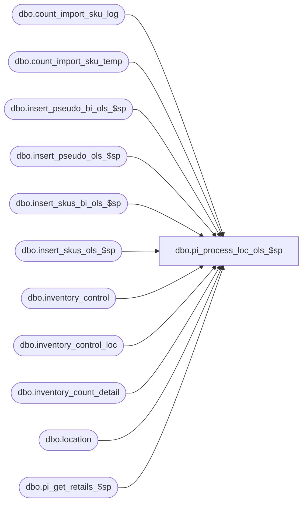

# dbo.pi_process_loc_ols_$sp

**Database:** me_01  
**Server:** bedrockdb02  

## Architecture Diagram



## Table Dependencies

| Referenced Table |
|---|
| dbo.count_import_sku_log |
| dbo.count_import_sku_temp |
| dbo.insert_pseudo_bi_ols_$sp |
| dbo.insert_pseudo_ols_$sp |
| dbo.insert_skus_bi_ols_$sp |
| dbo.insert_skus_ols_$sp |
| dbo.inventory_control |
| dbo.inventory_control_loc |
| dbo.inventory_count_detail |
| dbo.location |
| dbo.pi_get_retails_$sp |

## Stored Procedure Code

```sql
create proc [dbo].[pi_process_loc_ols_$sp] 

(
	@DocId AS DECIMAL(12,0), 
	@IclId AS DECIMAL(13,0), 
	@DocStatus AS SMALLINT,
	@UpdateStamp AS INT,
	@LocId AS SMALLINT,
	@IclStatus AS SMALLINT,
	@LastItemId AS DECIMAL(12,0),
	@WSFlag AS SMALLINT,
	@HierarchyLevelId AS INT,
	@ParentLevelId AS INT,
	@UpdateType AS SMALLINT,
	@DocDate AS SMALLDATETIME,
	@ValuationDate AS SMALLDATETIME,
	@ReplaceOrInc AS SMALLINT
)
AS

/* 
Proc name: pi_process_loc_ols_$sp 
Description: Procedure called during physical or beginning inventory for a given document and location		

HISTORY: 
Date       	Name         	Def#	Desc
Sept01,04   	Sameer Patel   	21616	Part of performance improvements for physical inventory
Feb 2, 2010		Feng		Multi-currency mod. Add fields cost_local, total_valuation_retail
*/

BEGIN

/*--------------------------------------------------------------------------------------------------------------*/
/*--------------------------------------------------------------------------------------------------------------*/
-- Initialization work

	DECLARE @JurisdictionId AS SMALLINT
	SELECT @JurisdictionId = jurisdiction_id FROM location where location_id = @LocId
	
/*--------------------------------------------------------------------------------------------------------------*/
/*--------------------------------------------------------------------------------------------------------------*/
-- The handling of regular skus, skus from pseudo-styles, and packs will be handled separately
-- Because all three can appear on the same document, 
	-- we must retrieve the new last_item_id each time before calling the next insert method

		/*--------------------------------------------------------------------------------------------------------------*/
		-- Regular skus
		IF @UpdateType <> 3

			BEGIN
				
				-- For actual shrink documents:
					-- Insert missing sku details
					-- Retrieve book quantities and calculate average costs			
				EXEC insert_skus_ols_$sp @DocId, @IclId, @LocId, @DocDate, @LastItemId, @HierarchyLevelId, @ParentLevelId, @ReplaceOrInc
				
			END

		ELSE IF @UpdateType = 3

			BEGIN

				-- For beginning inventory documents:
					-- Only need to update counts and costs
				EXEC insert_skus_bi_ols_$sp @DocId, @IclId, @LocId, @DocDate, @LastItemId, @HierarchyLevelId, @ParentLevelId, @ReplaceOrInc

			END

		/*--------------------------------------------------------------------------------------------------------------*/
		-- Retrieve the new last_item_id from the inventory_control_loc table
		-- Prior to the handling of pseudo styles

		DECLARE @NewLastItemId AS DECIMAL
		SELECT @NewLastItemId = last_item_id FROM inventory_control_loc WHERE inventory_control_id = @DocId AND inventory_control_loc_id = @IclId

		/*--------------------------------------------------------------------------------------------------------------*/
		-- Pseudo styles
		IF @UpdateType <> 3

			BEGIN
				
				-- For actual/pending shrink documents:
					-- Insert missing sku details
					-- Retrieve book quantities
				EXEC insert_pseudo_ols_$sp @DocId, @IclId, @LocId, @DocDate, @NewLastItemId, @HierarchyLevelId, @ParentLevelId, @ReplaceOrInc
				
			END

		ELSE IF @UpdateType = 3

			BEGIN

				-- For beginning inventory documents:
					-- Only need to update counts, costs and retails
				EXEC insert_pseudo_bi_ols_$sp @DocId, @IclId, @LocId, @DocDate, @NewLastItemId, @HierarchyLevelId, @ParentLevelId, @ReplaceOrInc

			END

		/*--------------------------------------------------------------------------------------------------------------*/

/*--------------------------------------------------------------------------------------------------------------*/
/*--------------------------------------------------------------------------------------------------------------*/
-- Retrieve retails for sku details

		IF @UpdateType <> 3

			BEGIN

				EXEC pi_get_retails_$sp @DocId, @IclId, @LocId, @JurisdictionId, @DocDate

			END

		ELSE
		
			BEGIN

				EXEC pi_get_retails_$sp @DocId, @IclId, @LocId, @JurisdictionId, @ValuationDate

			END

		/*--------------------------------------------------------------------------------------------------------------*/
		-- Update status of inventory control location
		UPDATE 
			inventory_control_loc 
		SET 
			state_no = 1,
			inv_control_loc_status = 13
		WHERE
			inventory_control_loc_id = @IclId

		IF @DocStatus = 1

			BEGIN

				-- Update status of inventory control document
				UPDATE
					inventory_control
				SET
					last_activity_date = getdate(),
					state_no = 1,
					document_status = 13,
					updatestamp = updatestamp + 1
				WHERE
					inventory_control_id = @DocId
					AND updatestamp = @UpdateStamp
			
			END
		/*--------------------------------------------------------------------------------------------------------------*/

/*--------------------------------------------------------------------------------------------------------------*/
/*--------------------------------------------------------------------------------------------------------------*/
-- If the count has been imported, update the count_import_sku_log

	IF @ReplaceOrInc <> 0
	
		BEGIN

			/*--------------------------------------------------------------------------------------------------------------*/
			-- Update count_import_sku_log
			INSERT INTO
				count_import_sku_log (inventory_control_id, location_id, sku_id, zone_label, units_counted, cost, cost_local, total_retail, total_valuation_retail, date_imported)
			SELECT
				@DocId inventory_control_id,
				@LocId location_id,
				count_import_sku_temp.sku_id,
				count_import_sku_temp.zone_label,
				count_import_sku_temp.units_counted,
				count_import_sku_temp.cost,
				count_import_sku_temp.cost_local,
				count_import_sku_temp.total_retail,
				count_import_sku_temp.total_valuation_retail,
				getdate() date_imported
			FROM
				count_import_sku_temp,
				inventory_count_detail
			WHERE
				count_import_sku_temp.sku_id = inventory_count_detail.sku_id
				AND inventory_count_detail.inventory_control_id = @DocId
				AND inventory_count_detail.inventory_control_loc_id = @IclId
				AND count_import_sku_temp.location_id = @LocId
				
			/*--------------------------------------------------------------------------------------------------------------*/
			-- Clean out count_import_sku_temp and leave ones that had a upc with no sku/pack id
			DELETE 
				count_import_sku_temp
			FROM
				count_import_sku_temp,
				(
					SELECT
						@LocId location_id,
						count_import_sku_temp.sku_id
					FROM
						count_import_sku_temp,
						inventory_count_detail
					WHERE
						count_import_sku_temp.sku_id = inventory_count_detail.sku_id
						AND inventory_count_detail.inventory_control_id = @DocId
						AND inventory_count_detail.inventory_control_loc_id = @IclId
						AND count_import_sku_temp.location_id = @LocId
				) T
			WHERE
				T.sku_id = count_import_sku_temp.sku_id
				AND T.location_id = count_import_sku_temp.location_id
				AND count_import_sku_temp.location_id = @LocId
			/*--------------------------------------------------------------------------------------------------------------*/

		END
/*--------------------------------------------------------------------------------------------------------------*/
/*--------------------------------------------------------------------------------------------------------------*/

END
```

