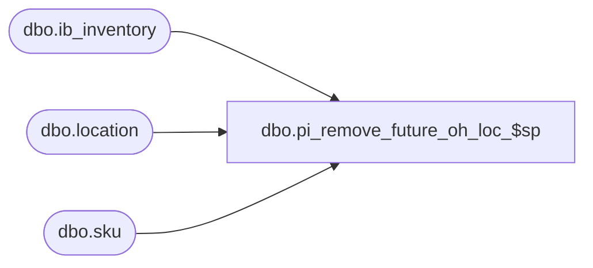

# dbo.pi_remove_future_oh_loc_$sp

**Database:** me_01  
**Server:** bedrockdb02  

## Architecture Diagram



## Table Dependencies

| Referenced Table |
|---|
| dbo.ib_inventory |
| dbo.location |
| dbo.sku |

## Stored Procedure Code

```sql
create proc [dbo].[pi_remove_future_oh_loc_$sp] 
	( @CountDate DATETIME
	, @LocId SMALLINT
	, @MaxId DECIMAL(13,0) )
WITH RECOMPILE
AS

-- R3 Version
/*
Proc name: pi_remove_future_oh_loc_$sp

Description: 

For the given location on the inventory control document, a snapshot of the ib_inventory_total table has been taken.
From this snapshot, remove any on hand with a transaction date greater than the count date on the inventory control document.
When querying ib_inventory, the ib_inventory_id must be less than or eqaul to the maximum ib_inventory_id passed in;
this was the id stored upon taking the valid snapshot.

HISTORY:
Date       		Name         		Def#			Desc
November 22,2006   	Jacqueline Lin		80360			Ported over 3.0 def. 63923 - merch:im:physical inventory performance changes. 
August 17 2007		Jacqueline Lin		87883			physical inv posts ib with wrong xaction cost when im default cost = average cost.
Feb. 29 2010		Feng			Multi-currency mod. 	add cost_local field, jurisdiction level insert, update
Dec 15, 2010	Ivan Dimitrov		123081		inventory count loading running for to a long time
*/

BEGIN

	DECLARE @AvgCostType AS SMALLINT
	DECLARE @JurisdictionId AS SMALLINT

	EXEC dbo.sp_executesql 
		N'TRUNCATE TABLE #tt_future_on_hand'
	EXEC dbo.sp_executesql
		N'TRUNCATE TABLE #tt_future_juris_on_hand'	

    -- DEFECT 87883
    -- Retrieve the method of average cost calculation being used
    -- 1: average cost by location
    -- 2: average cost by chain
	EXEC sp_executesql 
		N' SELECT @ParamAvgCostType = ib_average_cost_location_level FROM parameter_system' 
		, N'@ParamAvgCostType AS SMALLINT OUTPUT'
		, @ParamAvgCostType = @AvgCostType OUTPUT

	-- Retrieve any on hand from ib_inventory with a transaction date greater than the count date
	-- The ib_inventory_id should be less than or equal to the maximum ib_inventory_id passed in
	  INSERT INTO
			#tt_future_on_hand
				( sku_id
				, location_id
				, inventory_status_id
				, on_hand_units
				, on_hand_cost
				, on_hand_cost_local
				, on_hand_valuation_retail
				, on_hand_selling_retail)
		  SELECT
			#tt_frozen_on_hand.sku_id
			, #tt_frozen_on_hand.location_id
			, #tt_frozen_on_hand.inventory_status_id
			, COALESCE(SUM(transaction_units), 0) on_hand_units
			, COALESCE(SUM(transaction_cost), 0) on_hand_cost
			, COALESCE(SUM(transaction_cost_local), 0) on_hand_cost_local
			, COALESCE(SUM(transaction_valuation_retail), 0) on_hand_valuation_retail
			, COALESCE(SUM(transaction_selling_retail), 0) on_hand_selling_retail
		  FROM
			ib_inventory
			, #tt_frozen_on_hand
		  WHERE
			transaction_date > @CountDate			
			AND ib_inventory.location_id = @LocId
			AND ib_inventory_id <= @MaxId
			AND #tt_frozen_on_hand.sku_id = ib_inventory.sku_id
			AND #tt_frozen_on_hand.location_id = ib_inventory.location_id
			AND #tt_frozen_on_hand.inventory_status_id = ib_inventory.inventory_status_id 
		  GROUP BY
			#tt_frozen_on_hand.sku_id
			, #tt_frozen_on_hand.location_id
			, #tt_frozen_on_hand.inventory_status_id
		OPTION(RECOMPILE)

	-- Update the #tt_frozen_on_hand table by removing future on hand
		UPDATE
			#tt_frozen_on_hand
		  SET
			#tt_frozen_on_hand.on_hand_units = #tt_frozen_on_hand.on_hand_units - #tt_future_on_hand.on_hand_units
			, #tt_frozen_on_hand.on_hand_cost = #tt_frozen_on_hand.on_hand_cost - #tt_future_on_hand.on_hand_cost
			, #tt_frozen_on_hand.on_hand_cost_local = #tt_frozen_on_hand.on_hand_cost_local - #tt_future_on_hand.on_hand_cost_local
			, #tt_frozen_on_hand.on_hand_valuation_retail = #tt_frozen_on_hand.on_hand_valuation_retail - #tt_future_on_hand.on_hand_valuation_retail
			, #tt_frozen_on_hand.on_hand_selling_retail = #tt_frozen_on_hand.on_hand_selling_retail - #tt_future_on_hand.on_hand_selling_retail
		  FROM
			#tt_frozen_on_hand
			, #tt_future_on_hand
		  WHERE
			#tt_frozen_on_hand.sku_id = #tt_future_on_hand.sku_id
			AND #tt_frozen_on_hand.location_id = #tt_future_on_hand.location_id
			AND #tt_frozen_on_hand.inventory_status_id = #tt_future_on_hand.inventory_status_id
			OPTION(RECOMPILE)

    -- DEFECT 87883
    -- If method to retrieve average cost is by chain, then remove future on hand values for chain values
    IF (@AvgCostType = 2)

		BEGIN

            -- Retrieve any on hand from ib_inventory with a transaction date greater than the count date
	        -- The ib_inventory_id should be less than or equal to the maximum ib_inventory_id passed in
           	INSERT INTO
			        #tt_future_chain_on_hand
				        ( style_id
				        , chain_on_hand_units
				        , chain_on_hand_cost
						, chain_on_hand_cost_local )
		          SELECT
			        sku.style_id
			        , COALESCE(SUM(transaction_units), 0) chain_on_hand_units
					, COALESCE(SUM(transaction_cost), 0) chain_on_hand_cost
					, COALESCE(SUM(transaction_cost_local), 0) chain_on_hand_cost_local
		          FROM
			        ib_inventory
                    , sku
			        , #tt_frozen_chain_on_hand
		          WHERE
			        transaction_date > @CountDate
					AND ib_inventory_id <= @MaxId
			        AND sku.sku_id = ib_inventory.sku_id
			        AND #tt_frozen_chain_on_hand.style_id = sku.style_id
		          GROUP BY
			        sku.style_id
				  OPTION(RECOMPILE)
            -- Update the #tt_frozen_chain_on_hand table by removing future on hand
	        	UPDATE
			        #tt_frozen_chain_on_hand
		          SET
			        #tt_frozen_chain_on_hand.chain_on_hand_units = #tt_frozen_chain_on_hand.chain_on_hand_units - #tt_future_chain_on_hand.chain_on_hand_units
			        , #tt_frozen_chain_on_hand.chain_on_hand_cost = #tt_frozen_chain_on_hand.chain_on_hand_cost - #tt_future_chain_on_hand.chain_on_hand_cost
					, #tt_frozen_chain_on_hand.chain_on_hand_cost_local = #tt_frozen_chain_on_hand.chain_on_hand_cost_local - #tt_future_chain_on_hand.chain_on_hand_cost_local
		          FROM
			        #tt_frozen_chain_on_hand
			        , #tt_future_chain_on_hand
		          WHERE
			        #tt_frozen_chain_on_hand.style_id = #tt_future_chain_on_hand.style_id
				  OPTION(RECOMPILE)

		END
	ELSE IF (@AvgCostType = 3)
		BEGIN
			EXEC sp_executesql 
						N' SELECT @ParamJurisdictionId = jurisdiction_id FROM location WHERE location_id = @ParamLocId' 
						, N'@ParamJurisdictionId AS SMALLINT OUTPUT, @ParamLocId SMALLINT'
						, @ParamJurisdictionId = @JurisdictionId OUTPUT
						, @ParamLocId = @LocId
						
			INSERT INTO
                            #tt_future_juris_on_hand
                                ( style_id
								, jurisdiction_id
                                , juris_on_hand_units
                                , juris_on_hand_cost 
								, juris_on_hand_cost_local)
                          SELECT
                            sku.style_id
							, location.jurisdiction_id
                            , SUM(transaction_units) juris_on_hand_units
                            , SUM(transaction_cost) juris_on_hand_cost
							, SUM(transaction_cost_local) juris_on_hand_cost_local
                          FROM
                            sku
                            , ib_inventory
                            , #tt_sku
							, location
                          WHERE
                            transaction_date > @CountDate
							AND ib_inventory.sku_id = #tt_sku.sku_id
							AND ib_inventory_id <= @MaxId
                            AND #tt_sku.sku_id = sku.sku_id
							AND location.jurisdiction_id = @JurisdictionId
							AND location.location_id = ib_inventory.location_id
                          GROUP BY
							sku.style_id,
							location.jurisdiction_id
						  OPTION(RECOMPILE)
		        
			-- Update the #tt_frozen_juris_on_hand table by removing future juris on hand
	        	UPDATE
			        #tt_frozen_juris_on_hand
		          SET
			        #tt_frozen_juris_on_hand.juris_on_hand_units = #tt_frozen_juris_on_hand.juris_on_hand_units - #tt_future_juris_on_hand.juris_on_hand_units
			        , #tt_frozen_juris_on_hand.juris_on_hand_cost = #tt_frozen_juris_on_hand.juris_on_hand_cost - #tt_future_juris_on_hand.juris_on_hand_cost
					, #tt_frozen_juris_on_hand.juris_on_hand_cost_local = #tt_frozen_juris_on_hand.juris_on_hand_cost_local - #tt_future_juris_on_hand.juris_on_hand_cost_local
		          FROM
			        #tt_frozen_juris_on_hand
			        , #tt_future_juris_on_hand
		          WHERE
			        #tt_frozen_juris_on_hand.style_id = #tt_future_juris_on_hand.style_id
				  OPTION(RECOMPILE)

		END

END
```

