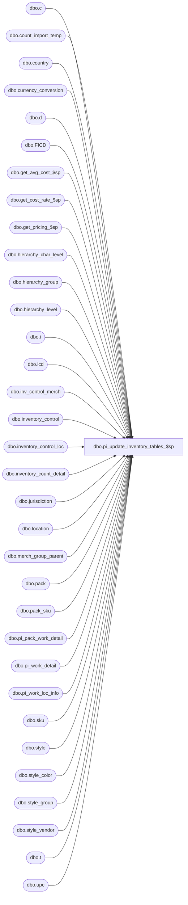

# dbo.pi_update_inventory_tables_$sp

**Database:** me_01  
**Server:** bedrockdb02  

## Architecture Diagram



## Table Dependencies

| Referenced Table |
|---|
| dbo.c |
| dbo.count_import_temp |
| dbo.country |
| dbo.currency_conversion |
| dbo.d |
| dbo.FICD |
| dbo.get_avg_cost_$sp |
| dbo.get_cost_rate_$sp |
| dbo.get_pricing_$sp |
| dbo.hierarchy_char_level |
| dbo.hierarchy_group |
| dbo.hierarchy_level |
| dbo.i |
| dbo.icd |
| dbo.inv_control_merch |
| dbo.inventory_control |
| dbo.inventory_control_loc |
| dbo.inventory_count_detail |
| dbo.jurisdiction |
| dbo.location |
| dbo.merch_group_parent |
| dbo.pack |
| dbo.pack_sku |
| dbo.pi_pack_work_detail |
| dbo.pi_work_detail |
| dbo.pi_work_loc_info |
| dbo.sku |
| dbo.style |
| dbo.style_color |
| dbo.style_group |
| dbo.style_vendor |
| dbo.t |
| dbo.upc |

## Stored Procedure Code

```sql
CREATE PROCEDURE [dbo].[pi_update_inventory_tables_$sp]

  (
     @IclId AS DECIMAL (13, 0)
    ,@DocId AS DECIMAL (12, 0)
    ,@LocId AS SMALLINT
    ,@LocCode AS NVARCHAR (20)
    ,@ReplaceOrIncrement AS SMALLINT
  )

AS

/*
Proc name: pi_update_inventory_tables_$sp

Description:

For the given inventory control document and location, insert and update inventory_count_detail and inventory_control_loc tables

HISTORY:
Date       			Name         		Def#			Desc
July 31, 2008		Sameer Patel		1-3Y350M		Re-relase of stored procedure (performance improvements, bug fixes, better error handling)
Aug 06, 2008		Sameer Patel		1-3Y350M		Re-named input parameters to math old ones. (Required for IM Web)
Aug 06, 2008		Jacqueline Lin		Mod 0429 		0429- Physical Inventory - Import by Pack Code
                            Fixed error handling for validating that costs are not submitted for documents of type Actual Shrink
Aug 16, 2008		Jacqueline Lin		105063			import of beginning inventory with cost not updating db.
Sept 29, 2008		Jacqueline Lin		105063			import of beginning inventory with cost not updating db. (fixed up the total_cost and total_retail calculation for importing pseudo style)
Jan 29, 2008		Sameer Patel		107477			unable to save after modifying inv count
                            (Removed original fix for 105063)
Mar 13, 2009		Sameer Patel		1-3ZKRA9		beginning inventory with cost, db table inventory_count_detail is not getting updated with the cost
Apr 01, 2009		Sameer Patel		1-3ZKRA9		beginning inventory with cost, db table inventory_count_detail is not getting updated with the cost
Aug 24, 2009	    Pierrette L.		1-4080TP		If the inventory file provided contains items that has no current inventory in IB there was a problem

Jan 26, 2010		Feng				115501			1) the exchange rate did not retrieved properly due to use
                            from location id = foreign location id -> @to_location_id which is parameter passed in.
                            So the @to_currency_id was assigned with home jurisdiction currency id and @from_currency_id was assigned with local currency id.
                            I removed @from_currency_id, set @to_currency_id correctly.
                            2) cost field is in home currency, no need to convert it. I removed the convertion with @exchange_rate.														units_counted and extended_units_counted were not the same at the end of the process.  This fix correct this situation.

Feb 4, 2010			Feng								Multi currency mod, add/set xxxx_cost_local, total_valuation_retail fields
Mar 25, 2010		Feng								multi-currency mod. fix the error message when psuedo style, at least one of cost (home, local), at least one of retail (home, local) must be provided
                            fix set cost, cost_local for importing pack if only one of them is provided
April 1, 2009		Sameer Patel		116910			segment 8000 does not break packs to eaches when inventory comes up from wm
April 1, 2009		Sameer Patel		116739			calculated ib transaction cost for beginning inventory count of pack skus is wrong
April 26, 2010		Feng								Increase precision from (14,2) or (18,6) to (18,6) for cost fields
May 4, 2010			Feng				117602			Merch 4.3.001 Beginning inventory cost default defect:
                            Import a beginning inventory count for any regular style from a home currency vendor. Use definition IMPDEF01 which does not include the cost home.
                            FRD states that IM should auto-set home unit cost = style's current vendor cost (rule IM00686.1.4.1).
                            IM sets home cost = last net final PO cost instead. By FRD rule, this is the wrong home cost for a beginning inventory count.
May 4, 2010			Feng				117603			Merch 4.3.001 Beginning inventory cost default defect with pack count import.
                            Import a beginning inventory count for a pack from a home vendor using definition IMPDEF09, no cost included.
                            FRD states that IM should auto-set home unit cost = pack style's current vendor cost.
                            IM does not auto-set a beginning inventory cost for the pack
May 5, 2010			Feng				117604			fix the issue of second import cost without provide cost, only provide retail, but the existing cost not been re-calculated (replace action)
Dec 7, 2010			Feng				123159			fix the issue of import beginning inventory count: increment option updates cost & cost_local incorrectly
May 15,2016			Ivan Dimitrov		DMER-915 - physical inventory average cost calculation is not accurate
*/

-----------------------------------------------------------------------------------------------------------------------------
--	Declarations / Sets: Declare And Set Variables
-----------------------------------------------------------------------------------------------------------------------------

DECLARE
   @inventory_control_loc_id AS DECIMAL(13,0)
  ,@inventory_control_id AS DECIMAL(12,0)
  ,@location_id AS SMALLINT
  ,@location_code AS NVARCHAR(20)
  ,@replace_or_increment AS SMALLINT
  ,@JurisdictionId AS SMALLINT


SET @inventory_control_loc_id = @IclId
SET @inventory_control_id = @DocId
SET @location_id = @LocId
SET @location_code = @LocCode
SET @replace_or_increment = @ReplaceOrIncrement
SET @JurisdictionId = (SELECT L.jurisdiction_id FROM dbo.location L WHERE L.location_id = @location_id)

-- Variables to store error numbers and error messages
DECLARE
   @line_id INT
  ,@errno INT
  ,@errmsg NVARCHAR (255)

SET @line_id = 0

-- Variable to store count of records in count_import_temp for the given location_code
DECLARE
  @records_counted INT

-- mod 0429 - addition of a pack code field
-- Temp Table to store count_import_temp_records specific to the given location_code
DECLARE @object_id INT

SELECT @object_id = object_id(N'tempdb..#count_import_temp')
IF NOT (@object_id IS NULL)
  DROP TABLE #count_import_temp

CREATE TABLE #count_import_temp
  ( count_import_temp_id DECIMAL(13,0) NOT NULL
  , location_code NVARCHAR(20) NOT NULL, upc_number NVARCHAR(14) NULL
  , sku_id DECIMAL(13,0) NULL, pack_id DECIMAL(13,0) NULL, style_type TINYINT NULL
  , warehouse_system_flag BIT NOT NULL
  , units_counted INT NOT NULL, cost DECIMAL(18,6) NULL,  cost_local DECIMAL(18,6) NULL, total_retail DECIMAL(14,2) NULL, total_valuation_retail DECIMAL(14,2) NULL
  , import_error NVARCHAR(120) NULL , pack_code NVARCHAR(20) NULL )

-- Temp Table to store inventory_count_detail records specific to the given inventory_control_loc_id and inventory_control_id
-- The given inventory_control_loc_id and inventory_control_id corresponds to a specific document/location combination
-- NOTE: The keep_flag column will be use later on to determine which records we insert/update and those that can be discarded
SELECT @object_id = object_id(N'tempdb..#inventory_count_detail')
IF NOT (@object_id IS NULL)
  DROP TABLE #inventory_count_detail

CREATE TABLE #inventory_count_detail
  ( inventory_count_detail_id DECIMAL(13,0) NULL
  , inventory_control_loc_id DECIMAL(13,0) NOT NULL, inventory_control_id DECIMAL(12,0) NOT NULL
  , pack_id DECIMAL(13,0) NULL, sku_id DECIMAL(13,0) NULL
  , units_counted INT DEFAULT(0) NOT NULL, book_pack_units INT NULL, extended_units_counted INT NULL
  , cost DECIMAL(18,6) NULL, cost_local DECIMAL(18,6) NULL, total_cost DECIMAL(18,6) NULL, total_cost_local DECIMAL(18,6) NULL
  , total_retail DECIMAL(14,2) NULL, total_valuation_retail DECIMAL(14,2) NULL
  , total_oh_book_units INT NULL, total_oh_book_cost DECIMAL(18,6) NULL, total_oh_book_cost_local DECIMAL(18,6) NULL, total_oh_book_val_retail DECIMAL(14,2) NULL, total_oh_book_sell_retail DECIMAL(14,2) NULL
  , total_oh_in_transit_units INT NULL, total_oh_in_transit_cost DECIMAL(18,6) NULL, total_oh_in_transit_cost_local DECIMAL(18,6) NULL, total_oh_in_tran_val_retail DECIMAL(14,2) NULL, total_oh_in_tran_sell_retail DECIMAL(14,2) NULL
  , discrepancy_units INT NULL, discrepancy_cost DECIMAL(18,6) NULL, discrepancy_cost_local DECIMAL(18,6) NULL, discrepancy_val_retail DECIMAL(14,2) NULL, discrepancy_sell_retail DECIMAL(14,2) NULL
  , pending_shrink_units INT NULL, pending_shrink_cost DECIMAL(18,6) NULL, pending_shrink_cost_local DECIMAL(18,6) NULL, pending_shrink_val_retail DECIMAL(14,2) NULL, pending_shrink_sell_retail DECIMAL(14,2) NULL
  , average_cost DECIMAL(18,6) NULL,  average_cost_local DECIMAL(18,6) NULL
  , valuation_unit_retail DECIMAL(14,2) NULL, selling_unit_retail DECIMAL(14,2) NULL, price_status_id SMALLINT NULL
  , keep_flag BIT DEFAULT (0) NOT NULL
  , UNIQUE (inventory_control_loc_id, inventory_control_id, pack_id, sku_id) )

SELECT @object_id = object_id(N'tempdb..#final_inventory_count_detail')
IF NOT (@object_id IS NULL)
  DROP TABLE #final_inventory_count_detail

CREATE TABLE #final_inventory_count_detail
  ( id INT IDENTITY(1,1) NOT NULL
  , inventory_count_detail_id DECIMAL(13,0) NULL
  , inventory_control_loc_id DECIMAL(13,0) NOT NULL, inventory_control_id DECIMAL(12,0) NOT NULL
  , pack_id DECIMAL(13,0) NULL, sku_id DECIMAL(13,0) NULL
  , units_counted INT DEFAULT(0) NOT NULL, book_pack_units INT NULL, extended_units_counted INT NULL
  , cost DECIMAL(18,6) NULL, cost_local DECIMAL(18,6) NULL, total_cost DECIMAL(18,6) NULL, total_cost_local DECIMAL(18,6) NULL
  , total_retail DECIMAL(14,2) NULL, total_valuation_retail DECIMAL(14,2) NULL
  , total_oh_book_units INT NULL, total_oh_book_cost DECIMAL(18,6) NULL, total_oh_book_cost_local DECIMAL(18,6) NULL, total_oh_book_val_retail DECIMAL(14,2) NULL, total_oh_book_sell_retail DECIMAL(14,2) NULL
  , total_oh_in_transit_units INT NULL, total_oh_in_transit_cost DECIMAL(18,6) NULL, total_oh_in_transit_cost_local DECIMAL(18,6) NULL, total_oh_in_tran_val_retail DECIMAL(14,2) NULL, total_oh_in_tran_sell_retail DECIMAL(14,2) NULL
  , discrepancy_units INT NULL, discrepancy_cost DECIMAL(18,6) NULL, discrepancy_cost_local DECIMAL(18,6) NULL, discrepancy_val_retail DECIMAL(14,2) NULL, discrepancy_sell_retail DECIMAL(14,2) NULL
  , pending_shrink_units INT NULL, pending_shrink_cost DECIMAL(18,6) NULL, pending_shrink_cost_local DECIMAL(18,6) NULL, pending_shrink_val_retail DECIMAL(14,2) NULL, pending_shrink_sell_retail DECIMAL(14,2) NULL
  , average_cost DECIMAL(18,6) NULL,  average_cost_local DECIMAL(18,6) NULL
  , valuation_unit_retail DECIMAL(14,2) NULL, selling_unit_retail DECIMAL(14,2) NULL, price_status_id SMALLINT NULL
  , keep_flag BIT DEFAULT (0) NOT NULL
  , UNIQUE (inventory_control_loc_id, inventory_control_id, pack_id, sku_id) )

-- Variables to store hierarchy_level_id and parent_level_id
-- These will help us determine at which merchandise level the document is being counted
-- Possible levels include: entreprise, merchandise group or style level
DECLARE
   @hierarchy_level_id INT
  ,@parent_level_id INT

-- Variable to store the last_item_id for the given inventory_control_loc_id and inventory_control_id
DECLARE
   @old_last_item_id DECIMAL(12,0)
  ,@new_last_item_id DECIMAL(12,0)

-- Temp Table to store information from count_import_temp for pseudo-styles
SELECT @object_id = object_id(N'tempdb..#pseudo_count_import_temp')
IF NOT (@object_id IS NULL)
  DROP TABLE #pseudo_count_import_temp

CREATE TABLE #pseudo_count_import_temp
  ( sku_id DECIMAL(13,0) NOT NULL
  , cost DECIMAL(18,6) NULL, cost_local DECIMAL(18,6) NULL, total_retail DECIMAL(14,2) NULL, total_valuation_retail DECIMAL(14,2) NULL
  , units_counted INT NOT NULL
  , PRIMARY KEY (sku_id) )

-- Temp Table to store information from count_import_temp for regular styles
SELECT @object_id = object_id(N'tempdb..#reg_count_import_temp')
IF NOT (@object_id IS NULL)
  DROP TABLE #reg_count_import_temp

CREATE TABLE #reg_count_import_temp
  ( sku_id DECIMAL(13,0) NOT NULL, cost DECIMAL(18,6) NULL, cost_local DECIMAL(18,6) NULL
  , units_counted INT NOT NULL
  , PRIMARY KEY (sku_id) )

-- Temp Table to store information from count_import_temp for packs
SELECT @object_id = object_id(N'tempdb..#pack_count_import_temp')
IF NOT (@object_id IS NULL)
  DROP TABLE #pack_count_import_temp

CREATE TABLE #pack_count_import_temp
  ( pack_id DECIMAL(13,0) NOT NULL, cost DECIMAL(18,6) NULL, cost_local DECIMAL(18,6) NULL
  , units_counted INT NOT NULL
  , PRIMARY KEY (pack_id) )

-- Variable to store count date, update type, and status of document/location
DECLARE
  @count_date SMALLDATETIME
  , @update_type SMALLINT
  , @inv_control_loc_status SMALLINT

-- Variable to store currency ids and exchange rate
DECLARE
  @to_currency_id SMALLINT
  , @exchange_rate FLOAT
  , @exchange_rate2 FLOAT

-- Variables to determine if there are any NULL costs or retails
DECLARE
  @null_cost_count INT

-- Variable for document status
DECLARE
  @document_status SMALLINT

-- Variables to store minimum and maximum ids from @master_data
DECLARE
  @max_retail_id INT
  , @batch_min_retail_id INT, @batch_max_retail_id INT
  , @batch_size INT, @jurisdiction_id SMALLINT

SET @batch_size = 2000

----------------------------------------------------------------------------------------------------------------------------------------------------------------------------------------------------------------------------
-- Determine whether or not we have an invalid location
-- If so, we don't have to do the rest of the work

SET @line_id = 10

IF (@location_id = 0)

  BEGIN

    SET @line_id = 20

    UPDATE c
    SET
      c.import_error = N'The location does not exist'
    FROM
      count_import_temp c
    WHERE
      c.location_code = @location_code

    SELECT @errno = @@error
    IF @errno <> 0
    BEGIN
      SELECT @errmsg = N'Failed to update count_import_temp with import errors '
      GOTO error
    END

    RETURN

  END

ELSE IF (@inventory_control_loc_id = 0)

  BEGIN

    SET @line_id = 30

    UPDATE c
    SET
      c.import_error = N'The location does not exist on the inventory control document'
    FROM
      count_import_temp c
    WHERE
      c.location_code = @location_code

    SELECT @errno = @@error
    IF @errno <> 0
    BEGIN
      SELECT @errmsg = N'Failed to update count_import_temp with import errors '
      GOTO error
    END

    RETURN

  END

----------------------------------------------------------------------------------------------------------------------------------------------------------------------------------------------------------------------------
-- Get the count date and document type of the document
/*
update type = 1 pending shrink
update type = 2 actual shrink
update type = 3 beginning inventory

*/
SET @line_id = 40

SELECT
  @count_date = count_date
  , @update_type = update_type
  , @inv_control_loc_status = inv_control_loc_status
FROM
  inventory_control_loc icl
INNER JOIN inventory_control ic ON icl.inventory_control_id = ic.inventory_control_id
WHERE
  icl.inventory_control_loc_id = @inventory_control_loc_id
  AND icl.inventory_control_id = @inventory_control_id

SELECT @errno = @@error
IF @errno <> 0
BEGIN
  SELECT @errmsg = N'Failed to get the count_date, update_type, and inv_control_loc_status from inventory_control '
  GOTO error
END

-- If the location has been posted, update the records in count_import_temp for this location with an error message
-- and exit procedure
/*
inv_control_loc_status = 	1	Preliminary
              13	Counted
              15	Posted
*/
IF @inv_control_loc_status = 15

  BEGIN

    SET @line_id = 50

    UPDATE c
    SET
      c.import_error = N'Counts for this location have already been posted'
    FROM
      count_import_temp c
    WHERE
      c.location_code = @location_code

    SELECT @errno = @@error
    IF @errno <> 0
    BEGIN
      SELECT @errmsg = N'Failed to update count_import_temp with import errors '
      GOTO error
    END

    RETURN

  END

----------------------------------------------------------------------------------------------------------------------------------------------------------------------------------------------------------------------------
-- Select count of records in count_import_temp for the given location_code

SET @line_id = 60

SELECT @records_counted = COUNT(*) FROM count_import_temp WHERE location_code = @location_code

SELECT @errno = @@error
IF @errno <> 0
BEGIN
  SELECT @errmsg = N'Failed to select record count from count_import_temp '
  GOTO error
END

IF @replace_or_increment <> 0

  BEGIN

    -- If no records have been counted for this location_code, exit the procedure
    IF @records_counted = 0
      RETURN

    -- Mod 0429 - adding pack_code in order to allow for import by pack_code
    -- Insert records into #count_import_temp table for given location code

    SET @line_id = 70

    INSERT INTO #count_import_temp
      ( count_import_temp_id
      , location_code, upc_number
      , sku_id, pack_id, style_type
      , warehouse_system_flag
      , units_counted, cost, cost_local, total_retail, total_valuation_retail
      , pack_code, import_error )
    SELECT
      c.count_import_temp_id
      , c.location_code, c.upc_number
      , k.sku_id, p.pack_id, COALESCE(s1.style_type, s2.style_type) style_type
      , l.warehouse_system_flag
      , c.units_counted, c.cost, c.cost_local, c.total_retail, c.total_valuation_retail
      , p.pack_code
      , CASE
        WHEN
          l.warehouse_system_flag = 0 AND p.pack_id IS NOT NULL AND c.pack_code IS NOT NULL
            THEN N'If a pack is entered, then the location must be a W/H Mgmt. warehouse'
        WHEN
          u1.upc_number IS NULL /*AND u2.upc_number IS NULL*/ AND l.warehouse_system_flag = 0 AND c.pack_code IS NULL
            THEN N'Upc does not exist'
        WHEN
          s1.style_type = 2 AND ( (c.cost IS NULL AND c.cost_local IS NULL) OR (c.total_retail IS NULL AND c.total_valuation_retail IS NULL) ) AND @update_type = 3 --begin inventory count
            THEN N'At least one Cost (home or local), one retail (home or local) must be provided for pseudo styles.'
        WHEN
          s1.style_type = 2 AND (c.total_retail IS NULL AND c.total_valuation_retail IS NULL) AND @update_type <> 3 --actual shrink or pending shrink count
            THEN N'At least one Retail (home or local) must be provided for pseudo styles.'
        WHEN
          COALESCE(s1.style_type, s2.style_type) = 1 AND (c.total_retail IS NOT NULL OR c.total_valuation_retail IS NOT NULL) AND @update_type = 3
            THEN N'Total Retail may only be entered for pseudo styles'
        WHEN
          COALESCE(s1.style_type, s2.style_type) = 1 AND (c.total_retail IS NOT NULL OR c.total_valuation_retail IS NOT NULL) AND @update_type <> 3
            THEN N'Total Cost and Total Retail may only be entered for pseudo styles'
        WHEN
          c.pack_code IS NOT NULL AND u1.upc_number IS NULL AND l.warehouse_system_flag = 1 AND p.pack_id IS NULL
            THEN N'Invalid Pack Code'
        WHEN
          COALESCE(s1.style_type, s2.style_type) = 1 AND (c.total_retail IS NOT NULL OR c.cost IS NOT NULL) AND @update_type <> 3
            THEN N'Total Cost and Total Retail may only be entered for pseudo styles'
        WHEN
          c.units_counted < 0 AND @update_type <> 3
            THEN N'If update type is either Pending Shrink or Actual Shrink, then count must be >= 0.'
        ELSE NULL END import_error
    FROM
      count_import_temp c
    INNER JOIN location l ON c.location_code = l.location_code
    LEFT OUTER JOIN ( upc u1
              INNER JOIN sku k ON u1.sku_id = k.sku_id
              INNER JOIN style s1 ON k.style_id = s1.style_id ) ON c.upc_number = u1.upc_number
    LEFT OUTER JOIN ( pack p
      INNER JOIN style s2 ON p.style_id = s2.style_id ) ON c.pack_code = p.pack_code

    /*LEFT OUTER JOIN ( upc u2
              INNER JOIN pack p ON u2.pack_id = p.pack_id
              INNER JOIN style s2 ON p.style_id = s2.style_id ) ON c.upc_number = u2.upc_number*/
    WHERE
      c.location_code = @location_code

    SELECT @errno = @@error
    IF @errno <> 0
    BEGIN
      SELECT @errmsg = N'Failed to insert into #count_import_temp '
      GOTO error
    END

    -- Update import_error column in #count_import_temp
    -- for sku/location combinations with different costs

    SET @line_id = 80

    UPDATE c
    SET
      import_error = N'The cost needs to remain the same for each sku/location combination in the import file'
    FROM
      #count_import_temp c
    INNER JOIN
      ( SELECT
        DISTINCT
          c1.sku_id, c1.location_code, c1.cost
        FROM
        #count_import_temp c1
        WHERE
        c1.pack_code IS NULL ) T ON c.sku_id = T.sku_id
    WHERE
      COALESCE(c.cost, 0) <> COALESCE(T.cost, 0)

    SELECT @errno = @@error
    IF @errno <> 0
    BEGIN
      SELECT @errmsg = N'Failed to update import_error in #count_import_temp for sku/location combinations with different costs '
      GOTO error
    END

/*** multi currency mod, add cost_local error*/
    UPDATE c
    SET
      import_error = N'The cost local needs to remain the same for each sku/location combination in the import file'
    FROM
      #count_import_temp c
    INNER JOIN
      ( SELECT
        DISTINCT
          c1.sku_id, c1.location_code, c1.cost, c1.cost_local
        FROM
        #count_import_temp c1
        WHERE
        c1.pack_code IS NULL ) T ON c.sku_id = T.sku_id AND c.cost_local = T.cost_local
    WHERE
      COALESCE(c.cost_local, 0) <> COALESCE(T.cost_local, 0)

    SELECT @errno = @@error
    IF @errno <> 0
    BEGIN
      SELECT @errmsg = N'Failed to update import_error in #count_import_temp for sku/location combinations with different local costs '
      GOTO error
    END

    -- Mod 0429 - added the cost error message to be affective for packs.
    -- Update import_error column in #count_import_temp
    -- for pack/location combinations with different costs

    SET @line_id = 90

    UPDATE c
    SET
      import_error = N'The cost needs to remain the same for each pack/location combination in the import file'
    FROM
      #count_import_temp c
    INNER JOIN
      ( SELECT
        DISTINCT
          c1.pack_code, c1.location_code, c1.cost
        FROM
        #count_import_temp c1
        WHERE
          c1.pack_code IS NOT NULL) T ON c.pack_code = T.pack_code
    WHERE
      COALESCE(c.cost, 0) <> COALESCE(T.cost, 0)

    SELECT @errno = @@error
    IF @errno <> 0
    BEGIN
      SELECT @errmsg = N'Failed to update import_error in #count_import_temp for pack/location combinations with different costs '
      GOTO error
    END

/*** multi currency mod, add cost_local error for each pack/location combination*/

    UPDATE c
    SET
      import_error = N'The cost local needs to remain the same for each pack/location combination in the import file'
    FROM
      #count_import_temp c
    INNER JOIN
      ( SELECT
        DISTINCT
          c1.pack_code, c1.location_code, c1.cost, c1.cost_local
        FROM
        #count_import_temp c1
        WHERE
          c1.pack_code IS NOT NULL) T ON c.pack_code = T.pack_code
    WHERE
      COALESCE(c.cost_local, 0) <> COALESCE(T.cost_local, 0)

    SELECT @errno = @@error
    IF @errno <> 0
    BEGIN
      SELECT @errmsg = N'Failed to update import_error in #count_import_temp for pack/location combinations with different local costs '
      GOTO error
    END

    --defect 123159 begin: if import action = increment, validate existing sku cost should equal to new import cost for regular style
    -- because of the limit of the field import_error = 120, do not cancate the previous error if there is, otherwise, will got db error
    IF @replace_or_increment = 2
    BEGIN
      UPDATE c
      SET
        import_error = N'Cost provided is different than cost previously provided for this sku/location.'
      FROM
        #count_import_temp c
      INNER JOIN inventory_count_detail d
      ON d.inventory_control_loc_id = @inventory_control_loc_id AND d.inventory_control_id = @inventory_control_id
      AND d.sku_id = c.sku_id AND ((d.cost IS NOT NULL AND c.cost IS NOT NULL AND d.cost <> c.cost) OR (d.cost_local IS NOT NULL AND c.cost_local IS NOT NULL AND d.cost_local <> c.cost_local) )
      AND c.style_type = 1 AND c.pack_id IS NULL

      SELECT @errno = @@error
      IF @errno <> 0
      BEGIN
        SELECT @errmsg = N'Failed to update import_error in #count_import_temp for cost provided is different than cost previously provided '
        GOTO error
      END

      UPDATE c
      SET
        import_error = N'Cost provided is different than cost previously provided for this pack/location.'
      FROM
        #count_import_temp c
      INNER JOIN inventory_count_detail d
      ON d.inventory_control_loc_id = @inventory_control_loc_id AND d.inventory_control_id = @inventory_control_id
      AND d.pack_id = c.pack_id AND ((d.cost IS NOT NULL AND c.cost IS NOT NULL AND d.cost <> c.cost) OR (d.cost_local IS NOT NULL AND c.cost_local IS NOT NULL AND d.cost_local <> c.cost_local) )
      AND c.pack_id IS NOT NULL

      SELECT @errno = @@error
      IF @errno <> 0
      BEGIN
        SELECT @errmsg = N'Failed to update import_error in #count_import_temp for cost provided is different than cost previously provided '
        GOTO error
      END
    END

    UPDATE i
    SET i.import_error = c.import_error
    FROM count_import_temp i
    INNER JOIN #count_import_temp c ON i.count_import_temp_id = c.count_import_temp_id
    --defect 123159 end
  END

----------------------------------------------------------------------------------------------------------------------------------------------------------------------------------------------------------------------------
-- If there are any records in inventory_count_detail for the given inventory_control_loc_id and inventory_control_id
-- insert them into our #inventory_count_detail table variable

SET @line_id = 100

INSERT INTO #inventory_count_detail
  ( inventory_count_detail_id
  , inventory_control_loc_id, inventory_control_id
  , pack_id, sku_id
  , units_counted, book_pack_units, extended_units_counted
  , cost, cost_local, total_cost, total_cost_local
  , total_retail, total_valuation_retail
  , total_oh_book_units, total_oh_book_cost, total_oh_book_cost_local, total_oh_book_val_retail, total_oh_book_sell_retail
  , total_oh_in_transit_units, total_oh_in_transit_cost, total_oh_in_transit_cost_local, total_oh_in_tran_val_retail, total_oh_in_tran_sell_retail
  , discrepancy_units, discrepancy_cost, discrepancy_cost_local, discrepancy_val_retail, discrepancy_sell_retail
  , pending_shrink_units, pending_shrink_cost, pending_shrink_cost_local, pending_shrink_val_retail, pending_shrink_sell_retail
  , average_cost, average_cost_local
  , valuation_unit_retail, selling_unit_retail, price_status_id
  , keep_flag )
SELECT
  inventory_count_detail_id
  , inventory_control_loc_id, inventory_control_id
  , pack_id, sku_id
  , units_counted, book_pack_units
  , CASE WHEN sku_id IS NOT NULL THEN units_counted ELSE NULL END extended_units_counted
  , cost, cost_local, total_cost, total_cost_local
  , total_retail, total_valuation_retail
  , total_oh_book_units, total_oh_book_cost, total_oh_book_cost_local, total_oh_book_val_retail, total_oh_book_sell_retail
  , total_oh_in_transit_units, total_oh_in_transit_cost, total_oh_in_transit_cost_local, total_oh_in_tran_val_retail, total_oh_in_tran_sell_retail
  , discrepancy_units, discrepancy_cost, discrepancy_cost_local, discrepancy_val_retail, discrepancy_sell_retail
  , pending_shrink_units, pending_shrink_cost, pending_shrink_cost_local, pending_shrink_val_retail, pending_shrink_sell_retail
  , average_cost, average_cost_local
  , valuation_unit_retail, selling_unit_retail, price_status_id
  , 1 keep_flag
FROM
  inventory_count_detail
WHERE
  inventory_control_loc_id = @inventory_control_loc_id AND inventory_control_id = @inventory_control_id
ORDER BY
  inventory_count_detail_id

SELECT @errno = @@error
IF @errno <> 0
BEGIN
  SELECT @errmsg = N'Failed to insert exisitng detail records into #inventory_count_detail '
  GOTO error
END

----------------------------------------------------------------------------------------------------------------------------------------------------------------------------------------------------------------------------
-- Retrieve the last_item_id for the given inventory_control_loc_id and inventory_control_id

SET @line_id = 110

SELECT @old_last_item_id = COALESCE(last_item_id, 0) FROM inventory_control_loc WHERE inventory_control_loc_id = @inventory_control_loc_id AND inventory_control_id = @inventory_control_id

SELECT @errno = @@error
IF @errno <> 0
BEGIN
  SELECT @errmsg = N'Failed to get the last_item_id from inventory_control_loc '
  GOTO error
END

----------------------------------------------------------------------------------------------------------------------------------------------------------------------------------------------------------------------------
-- Determine the merchandise level at which the document is being counted

SET @line_id = 120

SELECT
  @hierarchy_level_id = COALESCE(ic.hierarchy_level_id, 0), @parent_level_id = COALESCE(hl.parent_level_id, 0)
FROM
  inventory_control ic
LEFT OUTER JOIN hierarchy_level hl ON COALESCE(ic.hierarchy_level_id, 0) = COALESCE(hl.hierarchy_level_id, 0)
WHERE
  inventory_control_id = @inventory_control_id

SELECT @errno = @@error
IF @errno <> 0
BEGIN
  SELECT @errmsg = N'Failed to retrieve merchandise level at which the document is being counted '
  GOTO error
END

----------------------------------------------------------------------------------------------------------------------------------------------------------------------------------------------------------------------------
-- If the @hierarchy_level_id <> 0 and @parent_level_id = 0
-- then the count is being done at the entreprise level
-- Therefore, all skus and packs are valid.

IF (@hierarchy_level_id <> 0 AND @parent_level_id = 0)

  BEGIN

    SET @line_id = 130

    IF @update_type <> 3
    BEGIN

      INSERT INTO #inventory_count_detail
        ( inventory_control_loc_id, inventory_control_id
        , sku_id )
      SELECT
        @inventory_control_loc_id inventory_control_loc_id, @inventory_control_id inventory_control_id
        , k.sku_id
      FROM
        sku k
      LEFT OUTER JOIN #inventory_count_detail icd ON k.sku_id = icd.sku_id
      WHERE
        icd.sku_id IS NULL

    END
    ELSE
    BEGIN

      INSERT INTO #inventory_count_detail
        ( inventory_control_loc_id, inventory_control_id
        , sku_id )
      SELECT
        @inventory_control_loc_id inventory_control_loc_id, @inventory_control_id inventory_control_id
        , k.sku_id
      FROM
        pi_work_detail k
      LEFT OUTER JOIN #inventory_count_detail icd ON k.sku_id = icd.sku_id
                                AND k.inventory_control_loc_id = icd.inventory_control_loc_id
                                AND k.inventory_control_id = icd.inventory_control_id
      WHERE
        icd.sku_id IS NULL AND k.inventory_control_loc_id = @inventory_control_loc_id AND k.inventory_control_id = @inventory_control_id

    END


    SELECT @errno = @@error
    IF @errno <> 0
    BEGIN
      SELECT @errmsg = N'Failed to insert valid sku records into #inventory_count_detail (entreprise level count) '
    GOTO error
    END

    SET @line_id = 140

    IF @update_type <> 3
    BEGIN

      INSERT INTO #inventory_count_detail
        ( inventory_control_loc_id, inventory_control_id
        , pack_id )
      SELECT
        @inventory_control_loc_id inventory_control_loc_id, @inventory_control_id inventory_control_id
        , k.pack_id
      FROM
        pack k
      LEFT OUTER JOIN #inventory_count_detail icd ON k.pack_id = icd.pack_id
      WHERE
        icd.pack_id IS NULL

    END
    ELSE
    BEGIN

      INSERT INTO #inventory_count_detail
        ( inventory_control_loc_id, inventory_control_id
        , pack_id )
      SELECT
        @inventory_control_loc_id inventory_control_loc_id, @inventory_control_id inventory_control_id
        , k.pack_id
      FROM
        pi_pack_work_detail k
      LEFT OUTER JOIN #inventory_count_detail icd ON k.pack_id = icd.pack_id
                                AND k.inventory_control_loc_id = icd.inventory_control_loc_id
                                AND k.inventory_control_id = icd.inventory_control_id
      WHERE
        icd.pack_id IS NULL AND k.inventory_control_loc_id = @inventory_control_loc_id AND k.inventory_control_id = @inventory_control_id

    END


    SELECT @errno = @@error
    IF @errno <> 0
    BEGIN
      SELECT @errmsg = N'Failed to insert valid pack records into #inventory_count_detail (entreprise level count) '
      GOTO error
    END

  END

-- If the @hierarchy_level_id <> 0 and @parent_level_id <> 0
-- then the count is being done at the merchandise group level
-- Therefore, all skus and packs that are descendants of these hierarchy groups are valid
ELSE IF (@hierarchy_level_id <> 0 AND @parent_level_id <> 0)

  BEGIN

    SET @line_id = 150

    IF @update_type <> 3
    BEGIN

      INSERT INTO #inventory_count_detail
        ( inventory_control_loc_id, inventory_control_id
        , sku_id )
      SELECT
        @inventory_control_loc_id inventory_control_loc_id, @inventory_control_id inventory_control_id
        , k.sku_id
      FROM
        sku k
      INNER JOIN style_group sg ON k.style_id = sg.style_id
      INNER JOIN merch_group_parent mgp ON sg.hierarchy_group_id = mgp.hierarchy_group_id
      INNER JOIN inv_control_merch icm ON mgp.parent_hierarchy_group_id = icm.hierarchy_group_id AND icm.inventory_control_id = @inventory_control_id
      LEFT OUTER JOIN #inventory_count_detail icd ON k.sku_id = icd.sku_id
      WHERE
        icd.sku_id IS NULL

    END
    ELSE
    BEGIN

      INSERT INTO #inventory_count_detail
        ( inventory_control_loc_id, inventory_control_id
        , sku_id )
      SELECT
        @inventory_control_loc_id inventory_control_loc_id, @inventory_control_id inventory_control_id
        , k.sku_id
      FROM
        pi_work_detail k
      LEFT OUTER JOIN #inventory_count_detail icd ON k.sku_id = icd.sku_id
                                AND k.inventory_control_loc_id = icd.inventory_control_loc_id
                                AND k.inventory_control_id = icd.inventory_control_id
      WHERE
        icd.sku_id IS NULL AND k.inventory_control_loc_id = @inventory_control_loc_id AND k.inventory_control_id = @inventory_control_id

    END

    SELECT @errno = @@error
    IF @errno <> 0
    BEGIN
      SELECT @errmsg = N'Failed to insert valid sku records into #inventory_count_detail (merchandise group level count) '
      GOTO error
    END

    SET @line_id = 160

    IF @update_type <> 3
    BEGIN

      INSERT INTO #inventory_count_detail
        ( inventory_control_loc_id, inventory_control_id
        , pack_id )
      SELECT
        @inventory_control_loc_id inventory_control_loc_id, @inventory_control_id inventory_control_id
        , k.pack_id
      FROM
        pack k
      INNER JOIN style_group sg ON k.style_id = sg.style_id
      INNER JOIN merch_group_parent mgp ON sg.hierarchy_group_id = mgp.hierarchy_group_id
      INNER JOIN inv_control_merch icm ON mgp.parent_hierarchy_group_id = icm.hierarchy_group_id AND icm.inventory_control_id = @inventory_control_id
      LEFT OUTER JOIN #inventory_count_detail icd ON k.pack_id = icd.pack_id
      WHERE
        icd.pack_id IS NULL

    END
    ELSE
    BEGIN

      INSERT INTO #inventory_count_detail
        ( inventory_control_loc_id, inventory_control_id
        , pack_id )
      SELECT
        @inventory_control_loc_id inventory_control_loc_id, @inventory_control_id inventory_control_id
        , k.pack_id
      FROM
        pi_pack_work_detail k
      LEFT OUTER JOIN #inventory_count_detail icd ON k.pack_id = icd.pack_id
                                AND k.inventory_control_loc_id = icd.inventory_control_loc_id
                                AND k.inventory_control_id = icd.inventory_control_id
      WHERE
        icd.pack_id IS NULL AND k.inventory_control_loc_id = @inventory_control_loc_id AND k.inventory_control_id = @inventory_control_id

    END

    SELECT @errno = @@error
    IF @errno <> 0
    BEGIN
      SELECT @errmsg = N'Failed to insert valid pack records into #inventory_count_detail (merchandise group level count) '
      GOTO error
    END

    IF @replace_or_increment <> 0

      BEGIN

        SET @line_id = 170

        UPDATE c
        SET
          import_error = N'The UPC is valid but not for the merch level defined on the document'
        FROM
          #count_import_temp c
        LEFT OUTER JOIN #inventory_count_detail icd ON c.sku_id = icd.sku_id
        WHERE
          (c.sku_id IS NOT NULL AND icd.sku_id IS NULL)

        SELECT @errno = @@error
        IF @errno <> 0
        BEGIN
          SELECT @errmsg = N'Failed to update import_error in #count_import_temp for invalid upc numbers '
          GOTO error
        END

        -- Mod 0429 - fixed up the error message to ensure that it applies to this mod
        SET @line_id = 180

        UPDATE c
        SET
          import_error = N'The Pack Code is valid but not for the merch level defined on the document'
        FROM
          #count_import_temp c
        LEFT OUTER JOIN #inventory_count_detail icd ON c.pack_id = icd.pack_id
        WHERE
          (c.pack_id IS NOT NULL AND icd.pack_id IS NULL)

        SELECT @errno = @@error
        IF @errno <> 0
        BEGIN
          SELECT @errmsg = N'Failed to update import_error in #count_import_temp for invalid pack code '
          GOTO error
        END

      END

  END

-- If the @hierarchy_level_id = 0 and @parent_level_id = 0
-- then the count is being done at the style level
-- Therefore, all skus and packs that are descendants of these styles are valid
ELSE IF (@hierarchy_level_id = 0 AND @parent_level_id = 0)

  BEGIN

    SET @line_id = 190

    IF @update_type <> 3
    BEGIN

      INSERT INTO #inventory_count_detail
        ( inventory_control_loc_id, inventory_control_id
        , sku_id )
      SELECT
        @inventory_control_loc_id inventory_control_loc_id, @inventory_control_id inventory_control_id
        , k.sku_id
      FROM
        sku k
      INNER JOIN inv_control_merch icm ON k.style_id = icm.style_id AND icm.inventory_control_id = @inventory_control_id
      LEFT OUTER JOIN #inventory_count_detail icd ON k.sku_id = icd.sku_id
      WHERE
        icd.sku_id IS NULL

    END
    ELSE
    BEGIN

      INSERT INTO #inventory_count_detail
        ( inventory_control_loc_id, inventory_control_id
        , sku_id )
      SELECT
        @inventory_control_loc_id inventory_control_loc_id, @inventory_control_id inventory_control_id
        , k.sku_id
      FROM
        pi_work_detail k
      LEFT OUTER JOIN #inventory_count_detail icd ON k.sku_id = icd.sku_id
                                AND k.inventory_control_loc_id = icd.inventory_control_loc_id
                                AND k.inventory_control_id = icd.inventory_control_id
      WHERE
        icd.sku_id IS NULL AND k.inventory_control_loc_id = @inventory_control_loc_id AND k.inventory_control_id = @inventory_control_id

    END

    SELECT @errno = @@error
    IF @errno <> 0
    BEGIN
      SELECT @errmsg = N'Failed to insert valid sku records into #inventory_count_detail (style level count) '
      GOTO error
    END

    SET @line_id = 200

    IF @update_type <> 3
    BEGIN

      INSERT INTO #inventory_count_detail
        ( inventory_control_loc_id, inventory_control_id
        , pack_id )
      SELECT
        @inventory_control_loc_id inventory_control_loc_id, @inventory_control_id inventory_control_id
        , k.pack_id
      FROM
        pack k
      INNER JOIN inv_control_merch icm ON k.style_id = icm.style_id AND icm.inventory_control_id = @inventory_control_id
      LEFT OUTER JOIN #inventory_count_detail icd ON k.pack_id = icd.pack_id
      WHERE
        icd.pack_id IS NULL

    END
    ELSE
    BEGIN

      INSERT INTO #inventory_count_detail
        ( inventory_control_loc_id, inventory_control_id
        , pack_id )
      SELECT
        @inventory_control_loc_id inventory_control_loc_id, @inventory_control_id inventory_control_id
        , k.pack_id
      FROM
        pi_pack_work_detail k
      LEFT OUTER JOIN #inventory_count_detail icd ON k.pack_id = icd.pack_id
                                AND k.inventory_control_loc_id = icd.inventory_control_loc_id
                                AND k.inventory_control_id = icd.inventory_control_id
      WHERE
        icd.pack_id IS NULL AND k.inventory_control_loc_id = @inventory_control_loc_id AND k.inventory_control_id = @inventory_control_id

    END

    SELECT @errno = @@error
    IF @errno <> 0
    BEGIN
      SELECT @errmsg = N'Failed to insert valid pack records into #inventory_count_detail (style level count) '
      GOTO error
    END

    SET @line_id = 210

    IF @replace_or_increment <> 0

      BEGIN

        UPDATE c
        SET
          import_error = N'The UPC is valid but not for the styles defined on the document'
        FROM
          #count_import_temp c
        LEFT OUTER JOIN #inventory_count_detail icd ON c.sku_id = icd.sku_id
        WHERE
          (c.sku_id IS NOT NULL AND icd.sku_id IS NULL)

        SELECT @errno = @@error
        IF @errno <> 0
        BEGIN
          SELECT @errmsg = N'Failed to update import_error in #count_import_temp for invalid upc numbers '
          GOTO error
        END

        SET @line_id = 220

        UPDATE c
        SET
          import_error = N'The Pack Code is valid but not for the styles defined on the document'
        FROM
          #count_import_temp c
        LEFT OUTER JOIN #inventory_count_detail icd ON c.pack_id = icd.pack_id
        WHERE
          (c.pack_id IS NOT NULL AND icd.pack_id IS NULL)

        SELECT @errno = @@error
        IF @errno <> 0
        BEGIN
          SELECT @errmsg = N'Failed to update import_error in #count_import_temp for invalid pack code '
          GOTO error
        END

      END

  END

----------------------------------------------------------------------------------------------------------------------------------------------------------------------------------------------------------------------------
-- If @replace_or_increment = 0, then the document/location is either being counted through the UI
-- or a 'Recalculate count values' action has been called

IF @replace_or_increment = 0

  BEGIN

    SET @line_id = 230

    UPDATE icd
    SET
      icd.extended_units_counted = icd.units_counted + A.pack_sku_units
      , icd.cost = A.cost, icd.cost_local = A.cost_local
      , icd.keep_flag = 1
    FROM
      #inventory_count_detail icd
    INNER JOIN
      ( SELECT
        ps.sku_id, icd.cost, icd.cost_local
        , SUM(ps.sku_quantity * icd.units_counted) pack_sku_units
  FROM
        #inventory_count_detail icd
        INNER JOIN pack_sku ps ON icd.pack_id = ps.pack_id
        WHERE
        keep_flag = 1
        GROUP BY
        ps.sku_id, icd.cost, icd.cost_local ) A ON icd.sku_id = A.sku_id

    INSERT INTO #inventory_count_detail
      ( inventory_control_loc_id, inventory_control_id
      , sku_id, cost
      , extended_units_counted, keep_flag )
    SELECT
      @inventory_control_loc_id, @inventory_control_id
      , A.sku_id, A.cost
      , A.extended_units_counted, 1 keep_flag
    FROM
      ( SELECT
        ps.sku_id, icd.cost
        , SUM(ps.sku_quantity * icd.units_counted) extended_units_counted
        FROM
        #inventory_count_detail icd
        INNER JOIN pack_sku ps ON icd.pack_id = ps.pack_id
        WHERE
        keep_flag = 1
        GROUP BY
        ps.sku_id, icd.cost ) A
    LEFT OUTER JOIN #inventory_count_detail icd ON icd.sku_id = A.sku_id
    WHERE
      icd.sku_id IS NULL

    SELECT @errno = @@error
    IF @errno <> 0
    BEGIN
      SELECT @errmsg = N'Failed to update extended_units_counted column in #inventory_count_detail for skus from packs '
      GOTO error
    END

  END

-- If @replace_or_increment = 1, then the document/location is being counted from a file
-- Action = Replace counts

ELSE IF @replace_or_increment = 1

  BEGIN

    SET @line_id = 240

    INSERT INTO #pseudo_count_import_temp
      ( sku_id
      , cost, cost_local, total_retail,  total_valuation_retail
      , units_counted )
    SELECT
      c.sku_id
      , SUM(c.cost) cost, SUM(c.cost_local) cost_local, SUM(c.total_retail) total_retail, SUM(c.total_valuation_retail) total_valuation_retail
      , SUM(c.units_counted) units_counted
    FROM
      #count_import_temp c
    WHERE
      import_error IS NULL AND style_type = 2 AND pack_id IS NULL
    GROUP BY
      c.sku_id

    SELECT @errno = @@error
    IF @errno <> 0
    BEGIN
      SELECT @errmsg = N'Failed to insert into #pseudo_count_import_temp '
      GOTO error
    END

    SET @line_id = 250

    INSERT INTO #reg_count_import_temp
      ( sku_id, cost, cost_local
      , units_counted )
    SELECT
      c.sku_id, c.cost, c.cost_local
      , SUM(c.units_counted) units_counted
    FROM
      #count_import_temp c
    WHERE
      import_error IS NULL AND style_type = 1 AND pack_id IS NULL
    GROUP BY
      c.sku_id, c.cost, c.cost_local

    SELECT @errno = @@error
    IF @errno <> 0
    BEGIN
      SELECT @errmsg = N'Failed to insert into #reg_count_import_temp '
      GOTO error
    END

    SET @line_id = 260

    INSERT INTO #pack_count_import_temp
      ( pack_id
      , cost, cost_local
      , units_counted)
    SELECT
      c.pack_id, c.cost, c.cost_local
      , SUM(c.units_counted) units_counted
    FROM
      #count_import_temp c
    WHERE
      c.import_error IS NULL AND c.pack_id IS NOT NULL
    GROUP BY
      c.pack_id, c.cost, c.cost_local

    SELECT @errno = @@error
    IF @errno <> 0
    BEGIN
      SELECT @errmsg = N'Failed to insert into #pack_count_import_temp '
      GOTO error
    END

    SET @line_id = 270
-- fix the issue of second import cost without provide cost, only provide retail, but the existing cost not been re-calculated (replace action)
    UPDATE icd
    SET
      icd.units_counted = p.units_counted, icd.extended_units_counted = p.units_counted
      --, icd.cost = COALESCE(p.cost, icd.cost)
      , icd.cost = COALESCE(p.cost, null)
      , icd.total_retail = p.total_retail
      --, icd.cost_local = COALESCE(p.cost_local, icd.cost_local)
      , icd.cost_local = COALESCE(p.cost_local, null)
      , icd.total_valuation_retail = p.total_valuation_retail
      , icd.keep_flag = 1
    FROM
      #inventory_count_detail icd
    INNER JOIN #pseudo_count_import_temp p ON icd.sku_id = p.sku_id

    SELECT @errno = @@error
    IF @errno <> 0
    BEGIN
      SELECT @errmsg = N'Failed to update #inventory_count_detail with information from #pseudo_count_import_temp '
      GOTO error
    END

    SET @line_id = 280

    UPDATE icd
    SET
      icd.units_counted = p.units_counted, icd.extended_units_counted = p.units_counted
      --, icd.cost = COALESCE(p.cost, icd.cost)
      --, icd.cost_local = COALESCE(p.cost_local, icd.cost_local)
      , icd.cost = COALESCE(p.cost, null)
      , icd.cost_local = COALESCE(p.cost_local, null)
      , icd.keep_flag = 1
    FROM
      #inventory_count_detail icd
    INNER JOIN #reg_count_import_temp p ON icd.sku_id = p.sku_id

    SELECT @errno = @@error
    IF @errno <> 0
    BEGIN
      SELECT @errmsg = N'Failed to update #inventory_count_detail with information from #reg_count_import_temp '
      GOTO error
    END

    SET @line_id = 290

    UPDATE icd
    SET
      icd.units_counted = p.units_counted
      --, icd.cost = COALESCE(p.cost, icd.cost)
      --, icd.cost_local = COALESCE(p.cost_local, icd.cost_local)
      , icd.cost = COALESCE(p.cost, null)
      , icd.cost_local = COALESCE(p.cost_local, null)
      , icd.keep_flag = 1
    FROM
      #inventory_count_detail icd
    INNER JOIN #pack_count_import_temp p ON icd.pack_id = p.pack_id

    SELECT @errno = @@error
    IF @errno <> 0
    BEGIN
      SELECT @errmsg = N'Failed to update #inventory_count_detail with information from #pack_count_import_temp '
      GOTO error
    END

    SET @line_id = 300

    UPDATE icd
    SET
      icd.extended_units_counted = icd.units_counted + A.pack_sku_units
      , icd.cost = A.cost, icd.cost_local = A.cost_local
      , icd.keep_flag = 1
    FROM
      #inventory_count_detail icd
    INNER JOIN
      ( SELECT
        ps.sku_id, icd.cost, icd.cost_local
        , SUM(ps.sku_quantity * icd.units_counted) pack_sku_units
        FROM
        #inventory_count_detail icd
        INNER JOIN pack_sku ps ON icd.pack_id = ps.pack_id
        WHERE
        keep_flag = 1
        GROUP BY
        ps.sku_id, icd.cost, icd.cost_local ) A ON icd.sku_id = A.sku_id

    INSERT INTO #inventory_count_detail
      ( inventory_control_loc_id, inventory_control_id
      , sku_id, cost
      , extended_units_counted, keep_flag )
    SELECT
      @inventory_control_loc_id, @inventory_control_id
      , A.sku_id, A.cost
      , A.extended_units_counted, 1 keep_flag
    FROM
      ( SELECT
        ps.sku_id, icd.cost
        , SUM(ps.sku_quantity * icd.units_counted) extended_units_counted
        FROM
        #inventory_count_detail icd
        INNER JOIN pack_sku ps ON icd.pack_id = ps.pack_id
        WHERE
        keep_flag = 1
        GROUP BY
        ps.sku_id, icd.cost ) A
    LEFT OUTER JOIN #inventory_count_detail icd ON icd.sku_id = A.sku_id
    WHERE
      icd.sku_id IS NULL

    SELECT @errno = @@error
    IF @errno <> 0
    BEGIN
      SELECT @errmsg = N'Failed to update extended_units_counted column in #inventory_count_detail for skus from packs '
      GOTO error
    END

  END

-- If @replace_or_increment = 2, then the document/location is being counted from a file
-- Action = Increment counts

ELSE IF @replace_or_increment = 2

  BEGIN

    SET @line_id = 310

    INSERT INTO #pseudo_count_import_temp
      ( sku_id
      , cost, cost_local, total_retail, total_valuation_retail
      , units_counted )
    SELECT
      c.sku_id
      , SUM(c.cost) cost, SUM(c.cost_local) cost_local, SUM(c.total_retail) total_retail, SUM(c.total_valuation_retail) total_valuation_retail
      , SUM(c.units_counted) units_counted
    FROM
      #count_import_temp c
    WHERE
      import_error IS NULL AND style_type = 2 AND pack_id IS NULL
    GROUP BY
      c.sku_id

    SELECT @errno = @@error
    IF @errno <> 0
    BEGIN
      SELECT @errmsg = N'Failed to insert into #pseudo_count_import_temp '
      GOTO error
    END

    SET @line_id = 320

    INSERT INTO #reg_count_import_temp
      ( sku_id, cost, cost_local
      , units_counted )
    SELECT
      c.sku_id, c.cost, c.cost_local
      , SUM(c.units_counted) units_counted
    FROM
      #count_import_temp c
    WHERE
      import_error IS NULL AND style_type = 1 AND pack_id IS NULL
    GROUP BY
      c.sku_id, c.cost, c.cost_local

    SELECT @errno = @@error
    IF @errno <> 0
    BEGIN
      SELECT @errmsg = N'Failed to insert into #reg_count_import_temp '
      GOTO error
    END

    SET @line_id = 330

    INSERT INTO #pack_count_import_temp
      ( pack_id
      , cost, cost_local
      , units_counted )
    SELECT
      c.pack_id, c.cost, c.cost_local
      , SUM(c.units_counted) units_counted
    FROM
      #count_import_temp c
    WHERE
      c.import_error IS NULL AND c.pack_id IS NOT NULL
    GROUP BY
      c.pack_id, c.cost, c.cost_local

    SELECT @errno = @@error
    IF @errno <> 0
    BEGIN
      SELECT @errmsg = N'Failed to insert into #pack_count_import_temp '
      GOTO error
    END

    SET @line_id = 340

    UPDATE icd
    SET
      icd.units_counted = icd.units_counted + p.units_counted, icd.extended_units_counted = COALESCE(icd.extended_units_counted, 0) + p.units_counted
      , icd.cost = CASE WHEN icd.cost IS NOT NULL THEN icd.cost + p.cost
            ELSE p.cost END
      , icd.cost_local = CASE WHEN icd.cost_local IS NOT NULL THEN icd.cost_local + p.cost_local
            ELSE p.cost_local END
      , icd.total_retail = CASE WHEN icd.total_retail IS NOT NULL THEN icd.total_retail + p.total_retail
            ELSE p.total_retail END
      , icd.total_valuation_retail = CASE WHEN icd.total_valuation_retail IS NOT NULL THEN icd.total_valuation_retail + p.total_valuation_retail
            ELSE p.total_valuation_retail END
      , icd.keep_flag = 1
    FROM
      #inventory_count_detail icd
    INNER JOIN #pseudo_count_import_temp p ON icd.sku_id = p.sku_id

    SELECT @errno = @@error
    IF @errno <> 0
    BEGIN
      SELECT @errmsg = N'Failed to update #inventory_count_detail with information from #pseudo_count_import_temp '
      GOTO error
    END

    SET @line_id = 350

    UPDATE icd
    SET
      icd.units_counted = icd.units_counted + p.units_counted, icd.extended_units_counted = COALESCE(icd.extended_units_counted, 0) + p.units_counted
      , icd.cost = CASE WHEN icd.cost IS NOT NULL THEN icd.cost -- defect 123159 + p.cost
            ELSE p.cost END
      , icd.cost_local = CASE WHEN icd.cost_local IS NOT NULL THEN icd.cost_local -- defect 123159 + p.cost_local
            ELSE p.cost_local END
      , icd.keep_flag = 1
    FROM
      #inventory_count_detail icd
    INNER JOIN #reg_count_import_temp p ON icd.sku_id = p.sku_id

    SELECT @errno = @@error
    IF @errno <> 0
    BEGIN
      SELECT @errmsg = N'Failed to update #inventory_count_detail with information from #reg_count_import_temp '
      GOTO error
    END

    SET @line_id = 360

    UPDATE icd
    SET
      icd.units_counted = icd.units_counted + p.units_counted
      , icd.cost = CASE WHEN icd.cost IS NOT NULL THEN icd.cost -- defect 123159 + p.cost
            ELSE p.cost END
      , icd.cost_local = CASE WHEN icd.cost_local IS NOT NULL THEN icd.cost_local -- defect 123159 + p.cost_local
            ELSE p.cost_local END
      , icd.keep_flag = 1
    FROM
      #inventory_count_detail icd
    INNER JOIN #pack_count_import_temp p ON icd.pack_id = p.pack_id

    SELECT @errno = @@error
    IF @errno <> 0
    BEGIN
      SELECT @errmsg = N'Failed to update @inventory_count_detail with information from @pack_count_import_temp '
      GOTO error
    END

    SET @line_id = 370

    UPDATE icd
    SET
      icd.extended_units_counted = icd.units_counted + A.pack_sku_units
      , icd.cost = A.cost, icd.cost_local = A.cost_local
      , icd.keep_flag = 1
    FROM
      #inventory_count_detail icd
    INNER JOIN
      ( SELECT
        ps.sku_id, icd.cost, icd.cost_local
        , SUM(ps.sku_quantity * icd.units_counted) pack_sku_units
        FROM
        #inventory_count_detail icd
        INNER JOIN pack_sku ps ON icd.pack_id = ps.pack_id
        WHERE
        keep_flag = 1
        GROUP BY
        ps.sku_id, icd.cost, icd.cost_local ) A ON icd.sku_id = A.sku_id

    INSERT INTO #inventory_count_detail
      ( inventory_control_loc_id, inventory_control_id
      , sku_id, cost
      , extended_units_counted, keep_flag )
    SELECT
      @inventory_control_loc_id, @inventory_control_id
      , A.sku_id, A.cost
      , A.extended_units_counted, 1 keep_flag
    FROM
      ( SELECT
        ps.sku_id, icd.cost
        , SUM(ps.sku_quantity * icd.units_counted) extended_units_counted
        FROM
        #inventory_count_detail icd
        INNER JOIN pack_sku ps ON icd.pack_id = ps.pack_id
        WHERE
        keep_flag = 1
        GROUP BY
        ps.sku_id, icd.cost ) A
    LEFT OUTER JOIN #inventory_count_detail icd ON icd.sku_id = A.sku_id
    WHERE
      icd.sku_id IS NULL

    SELECT @errno = @@error
    IF @errno <> 0
    BEGIN
      SELECT @errmsg = N'Failed to update extended_units_counted column in @inventory_count_detail for skus from packs '
      GOTO error
    END

  END

-- make sure pseudo styles do not have null as total retail and / or cost so they can be differentiated
UPDATE t
SET total_cost = ISNULL(total_cost,0),
  total_retail = ISNULL( total_retail,0)
FROM #inventory_count_detail t, sku k, style s
where t.sku_id = k.sku_id
and k.style_id = s.style_id
and s.style_type = 2

----------------------------------------------------------------------------------------------------------------------------------------------------------------------------------------------------------------------------
-- Update #inventory_count_detail with information from pi_work_detail and pi_pack_work_detail

SET @line_id = 380

UPDATE icd
SET
  icd.total_oh_book_units = p.total_oh_book_units, icd.total_oh_book_cost = p.total_oh_book_cost, icd.total_oh_book_cost_local = p.total_oh_book_cost_local, icd.total_oh_book_val_retail = p.total_oh_book_val_retail, icd.total_oh_book_sell_retail = p.total_oh_book_sell_retail
  , icd.total_oh_in_transit_units = p.total_oh_in_transit_units, icd.total_oh_in_transit_cost = p.total_oh_in_transit_cost, icd.total_oh_in_transit_cost_local = p.total_oh_in_transit_cost_local, icd.total_oh_in_tran_val_retail = p.total_oh_in_tran_val_retail, icd.total_oh_in_tran_sell_retail = p.total_oh_in_tran_sell_retail
  , icd.discrepancy_units = p.discrepancy_units, icd.discrepancy_cost = p.discrepancy_cost, icd.discrepancy_cost_local = p.discrepancy_cost_local, icd.discrepancy_val_retail = p.discrepancy_val_retail, icd.discrepancy_sell_retail = p.discrepancy_sell_retail
  , icd.pending_shrink_units = p.pending_shrink_units, icd.pending_shrink_cost = p.pending_shrink_cost, icd.pending_shrink_cost_local = p.pending_shrink_cost_local, icd.pending_shrink_val_retail = p.pending_shrink_val_retail, icd.pending_shrink_sell_retail = p.pending_shrink_sell_retail
  , icd.average_cost = p.average_cost, icd.average_cost_local = p.average_cost_local
  , icd.valuation_unit_retail = p.valuation_unit_retail, icd.selling_unit_retail = p.selling_unit_retail, icd.price_status_id = p.price_status_id
  , icd.keep_flag = 1
FROM
  #inventory_count_detail icd
INNER JOIN pi_work_detail p ON icd.inventory_control_loc_id = p.inventory_control_loc_id
                    AND icd.inventory_control_id = p.inventory_control_id
                    AND icd.sku_id = p.sku_id
WHERE
  (( p.total_oh_book_units <> 0 OR p.total_oh_book_cost <> .000000 OR p.total_oh_book_cost_local <> .000000 OR p.total_oh_book_val_retail <> .000000 OR p.total_oh_book_sell_retail <> .000000
    OR p.total_oh_in_transit_units <> 0 OR p.total_oh_in_transit_cost <> .000000 OR p.total_oh_in_transit_cost_local <> .000000 OR p.total_oh_in_tran_val_retail <> .000000 OR p.total_oh_in_tran_sell_retail <> .000000
    OR p.discrepancy_units <> 0 OR p.discrepancy_cost <> .000000 OR p.discrepancy_cost_local <> .000000 OR p.discrepancy_val_retail <> .000000 OR p.discrepancy_sell_retail <> .000000
    OR p.pending_shrink_units <> 0 OR p.pending_shrink_cost <> .000000 OR p.pending_shrink_cost_local <> .000000 OR p.pending_shrink_val_retail <> .000000 OR p.pending_shrink_sell_retail <> .000000 ) OR icd.keep_flag = 1)

SELECT @errno = @@error
IF @errno <> 0
BEGIN
  SELECT @errmsg = N'Failed to update #inventory_count_detail with information from pi_work_detail '
  GOTO error
END

SET @line_id = 390

UPDATE icd
SET
  icd.book_pack_units = p.book_pack_units
  , icd.keep_flag = 1
FROM
  #inventory_count_detail icd
INNER JOIN pi_pack_work_detail p ON icd.inventory_control_loc_id = p.inventory_control_loc_id
                    AND icd.inventory_control_id = p.inventory_control_id
                    AND icd.pack_id = p.pack_id

SELECT @errno = @@error
IF @errno <> 0
BEGIN
  SELECT @errmsg = N'Failed to update book_pack_units column in #inventory_count_detail '
  GOTO error
END

----------------------------------------------------------------------------------------------------------------------------------------------------------------------------------------------------------------------------
-- Insert copy of detail data into a new table with new id to be generated
-- This id will later be use to insert data into the inventory_count_detail_table

SET @line_id = 400

--DELETE #inventory_count_detail WHERE keep_flag = 0
INSERT INTO #final_inventory_count_detail SELECT * FROM #inventory_count_detail WHERE keep_flag = 1

SELECT @errno = @@error
IF @errno <> 0
BEGIN
  SELECT @errmsg = N'Failed to insert from #final_inventory_count_detail '
  GOTO error
END

----------------------------------------------------------------------------------------------------------------------------------------------------------------------------------------------------------------------------
-- Get the currency id for the location (@to_currency_id)

SET @line_id = 410

SELECT
  @to_currency_id = currency_id
FROM
  country c
INNER JOIN jurisdiction j ON c.country_id = j.country_id
INNER JOIN location l ON j.jurisdiction_id = l.jurisdiction_id
WHERE
  l.location_id = @location_id

SELECT @errno = @@error
IF @errno <> 0
BEGIN
  SELECT @errmsg = N'Failed to get the currency id for the location '
  GOTO error
END

-- Get the purchasing exchange rate corresponding to the above currency ids

SET @line_id = 430

SELECT
  @exchange_rate = exchange_rate
FROM
  currency_conversion
WHERE
  to_currency_id = @to_currency_id
  AND effective_from_date <= @count_date AND (effective_to_date >= @count_date OR effective_to_date IS NULL)
  AND currency_conversion_type = 1

SELECT @errno = @@error
IF @errno <> 0
BEGIN
  SELECT @errmsg = N'Failed to get the exchange rate from currency_conversion '
  GOTO error
END

-- Get the pricing exchange rate corresponding to the above currency ids

SET @line_id = 430

SELECT
  @exchange_rate2 = exchange_rate
FROM
  currency_conversion
WHERE
  to_currency_id = @to_currency_id
  AND effective_from_date <= @count_date AND (effective_to_date >= @count_date OR effective_to_date IS NULL)
  AND currency_conversion_type = 2

SELECT @errno = @@error
IF @errno <> 0
BEGIN
  SELECT @errmsg = N'Failed to get the exchange rate from currency_conversion '
  GOTO error
END

----------------------------------------------------------------------------------------------------------------------------------------------------------------------------------------------------------------------------
-- Update columns for total_valuation_retail and cost in @inventory_count_detail

SET @line_id = 440

UPDATE #final_inventory_count_detail
SET
  total_valuation_retail = total_retail * @exchange_rate2
WHERE
  total_retail IS NOT NULL AND total_valuation_retail IS NULL AND pack_id IS NULL

SELECT @errno = @@error
IF @errno <> 0
BEGIN
  SELECT @errmsg = N'Failed to update the total_valuation_retail column in #final_inventory_count_detail '
  GOTO error
END

UPDATE #final_inventory_count_detail
SET
  total_retail = total_valuation_retail / @exchange_rate2
WHERE
  total_valuation_retail IS NOT NULL AND total_retail IS NULL AND pack_id IS NULL


SELECT @errno = @@error
IF @errno <> 0
BEGIN
  SELECT @errmsg = N'Failed to update the total_retail column in #final_inventory_count_detail '
  GOTO error
END

-- multi-currency mod, IM00687.3.4 is implemented below, no changes for cost calculation, only fix defect by replace / by * according FRD IM00687.3.4
-- add cost_local calculation
UPDATE #final_inventory_count_detail
  SET cost = cost_local * @exchange_rate
WHERE cost_local IS NOT NULL AND cost IS NULL

UPDATE #final_inventory_count_detail
  SET cost_local = cost / @exchange_rate
WHERE cost IS NOT NULL AND cost_local IS NULL

UPDATE #final_inventory_count_detail
SET
  cost = CASE WHEN (cost IS NULL AND (total_retail <> 0 AND total_oh_book_val_retail <> 0)) THEN (total_oh_book_cost / total_oh_book_val_retail) * (total_retail * @exchange_rate2)
          WHEN (cost IS NULL AND total_retail = 0) THEN 0
          WHEN (cost IS NOT NULL) THEN cost  END --this is cost in home currency, user entered from UI or import from text file
  , cost_local = CASE WHEN (cost_local IS NULL AND (total_retail <> 0 AND total_oh_book_sell_retail <> 0)) THEN (total_oh_book_cost_local / total_oh_book_sell_retail) * (total_retail)
          WHEN (cost_local IS NULL AND total_retail = 0) THEN 0
          WHEN (cost_local IS NOT NULL) THEN cost_local  END --this is cost in local currency, user entered from UI or import from text file
WHERE
  total_retail IS NOT NULL AND pack_id IS NULL


SELECT @errno = @@error
IF @errno <> 0
BEGIN
  SELECT @errmsg = N'Failed to update the total_valuation_retail and cost columns in #final_inventory_count_detail '
  GOTO error
END

-- multi-currency mod, IM00687.3.5 is implemented begin below
SET @line_id = 445
DECLARE @sku_imuPercent_temp TABLE
  ( sku_id DECIMAL(13,0) NOT NULL, imu_percent DECIMAL(14,2) NULL
  , PRIMARY KEY (sku_id) )

    INSERT INTO @sku_imuPercent_temp
      ( sku_id, imu_percent )
    SELECT
      d.sku_id, hg.goal_imu_percent as imu_percent
    FROM hierarchy_group hg, hierarchy_char_level hcl, style_group sg, merch_group_parent par, #final_inventory_count_detail d, sku, style s
    where hg.hierarchy_level_id = hcl.goal_imu_level_id
      and sg.hierarchy_group_id = par.hierarchy_group_id
      and par.parent_hierarchy_group_id = hg.hierarchy_group_id
      and par.hierarchy_level_id = hcl.goal_imu_level_id
      and s.style_type = 2 and s.style_id = sku.style_id
      and sku.style_id = sg.style_id
      and sku.sku_id = d.sku_id
      and d.pack_id IS NULL


    UPDATE #final_inventory_count_detail
    SET cost = (1 - t.imu_percent/100) * total_retail * @exchange_rate2
    FROM #final_inventory_count_detail d, @sku_imuPercent_temp t
    WHERE d.cost is null AND d.total_retail IS NOT NULL AND d.total_retail <> 0 AND d.pack_id IS NULL
    AND d.sku_id = t.sku_id

    UPDATE #final_inventory_count_detail
    SET cost_local = (1 - t.imu_percent/100) * total_retail
    FROM #final_inventory_count_detail d, @sku_imuPercent_temp t
    WHERE d.cost_local is null AND d.total_retail IS NOT NULL AND d.total_retail <> 0 AND d.pack_id IS NULL
    AND d.sku_id = t.sku_id

-- multi-currency mod, IM00687.3.5 is implemented end


-- Update total_cost column in #final_inventory_count_detail

SET @line_id = 450

UPDATE #final_inventory_count_detail
SET
  total_cost = cost
WHERE
  total_retail IS NOT NULL AND cost IS NOT NULL

SELECT @errno = @@error
IF @errno <> 0
BEGIN
  SELECT @errmsg = N'Failed to update the total_cost column in #final_inventory_count_detail '
  GOTO error
END

SET @line_id = 451

UPDATE #final_inventory_count_detail
SET
  total_cost_local = cost_local
WHERE
  total_retail IS NOT NULL AND cost_local IS NOT NULL

SELECT @errno = @@error
IF @errno <> 0
BEGIN
  SELECT @errmsg = N'Failed to update the total_cost_local column in #final_inventory_count_detail '
  GOTO error
END


----------------------------------------------------------------------------------------------------------------------------------------------------------------------------------------------------------------------------
-- Determine if there are any NULL costs

SET @line_id = 460

SELECT @null_cost_count = COUNT(1)
FROM #final_inventory_count_detail WHERE (average_cost IS NULL OR total_retail IS NULL OR cost IS NULL) --AND pack_id IS NULL

SELECT @errno = @@error
IF @errno <> 0
BEGIN
  SELECT @errmsg = N'Failed to get count of null average costs from #final_inventory_count_detail '
  GOTO error
END

IF (@null_cost_count <> 0)

  BEGIN

    SET @line_id = 470

    -- defect 117602
    UPDATE icd
    SET
      icd.cost = CASE WHEN (@update_type = 3 AND icd.cost IS NULL) THEN sv.current_cost * cc.exchange_rate ELSE NULL END
    FROM
      #final_inventory_count_detail icd
    INNER JOIN sku k ON icd.sku_id = k.sku_id
    INNER JOIN style_vendor sv ON k.style_id = sv.style_id AND sv.primary_vendor_flag = 1
    INNER JOIN currency_conversion cc ON sv.currency_id = cc.to_currency_id AND effective_from_date <= @count_date AND (effective_to_date >= @count_date OR effective_to_date IS NULL) AND currency_conversion_type = 1
    WHERE
      icd.cost IS NULL AND icd.pack_id IS NULL

    SELECT @errno = @@error
    IF @errno <> 0
    BEGIN
      SELECT @errmsg = N'Failed to set cost in #final_inventory_count_detail with current_cost from style_vendor '
      GOTO error
    END

    UPDATE icd
    SET
      icd.cost_local = CASE WHEN (@update_type = 3 AND icd.cost_local IS NULL) THEN icd.cost / @exchange_rate ELSE NULL END
    FROM
      #final_inventory_count_detail icd
    WHERE
      icd.cost_local IS NULL AND icd.pack_id IS NULL

    SELECT @errno = @@error
    IF @errno <> 0
    BEGIN
      SELECT @errmsg = N'Failed to set cost_local in #final_inventory_count_detail with current_cost from style_vendor '
      GOTO error
    END

    -- defect 117603
    UPDATE icd
    SET
      icd.cost = CASE WHEN (@update_type = 3 AND icd.cost IS NULL) THEN sv.current_cost * cc.exchange_rate ELSE NULL END
    FROM
      #final_inventory_count_detail icd
    INNER JOIN pack p ON p.pack_id = icd.pack_id
    INNER JOIN pack_sku pk ON p.pack_id = pk.pack_id
    INNER JOIN sku k ON pk.sku_id = k.sku_id
    INNER JOIN style_vendor sv ON k.style_id = sv.style_id AND sv.primary_vendor_flag = 1
    INNER JOIN currency_conversion cc ON sv.currency_id = cc.to_currency_id AND effective_from_date <= @count_date AND (effective_to_date >= @count_date OR effective_to_date IS NULL) AND currency_conversion_type = 1
    WHERE
      icd.cost IS NULL AND icd.pack_id IS NOT NULL

    SELECT @errno = @@error
    IF @errno <> 0
    BEGIN
      SELECT @errmsg = N'Failed to set cost in #final_inventory_count_detail with current_cost from style_vendor '
      GOTO error
    END

    UPDATE icd
    SET
      icd.cost_local = CASE WHEN (@update_type = 3 AND icd.cost_local IS NULL) THEN icd.cost / @exchange_rate ELSE NULL END
    FROM
      #final_inventory_count_detail icd
    WHERE
      icd.cost_local IS NULL AND icd.pack_id IS NOT NULL

    SELECT @errno = @@error
    IF @errno <> 0
    BEGIN
      SELECT @errmsg = N'Failed to set cost_local in #final_inventory_count_detail with current_cost from style_vendor '
      GOTO error
    END

    SET @line_id = 480


-----------------------------------------------------------------------------------------------------------------------------
--	Error Trapping: Check If Temp Table(s) Already Exist(s) And Drop If Applicable
-----------------------------------------------------------------------------------------------------------------------------

    IF OBJECT_ID (N'tempdb.dbo.#temp_avg_costs', N'U') IS NOT NULL
    BEGIN

      DROP TABLE dbo.#temp_avg_costs

    END


    IF OBJECT_ID (N'tempdb.dbo.#temp_cost_rates',  N'U') IS NOT NULL
    BEGIN

      DROP TABLE dbo.#temp_cost_rates

    END


    IF OBJECT_ID (N'tempdb.dbo.#temp_wrk_avg_cost_lookup', N'U') IS NOT NULL
    BEGIN

      DROP TABLE dbo.#temp_wrk_avg_cost_lookup

    END


    IF OBJECT_ID (N'tempdb.dbo.#temp_wrk_cost_rate_lookup',  N'U') IS NOT NULL
    BEGIN

      DROP TABLE dbo.#temp_wrk_cost_rate_lookup

    END


-----------------------------------------------------------------------------------------------------------------------------
--	Table Create: Create Table Shells
-----------------------------------------------------------------------------------------------------------------------------

    CREATE TABLE dbo.#temp_avg_costs

      (
         location_id SMALLINT NULL
        ,sku_id DECIMAL (13, 0) NULL
        ,avg_cost DECIMAL (18, 6) NULL
        ,avg_cost_local DECIMAL (18, 6) NULL
        ,sum_units int NULL
        ,sum_cost DECIMAL (18, 6) NULL
        ,sum_cost_local DECIMAL (18, 6) NULL
      )


    CREATE TABLE dbo.#temp_cost_rates

      (
         jurisdiction_id SMALLINT NULL
        ,transaction_date SMALLDATETIME NULL
        ,cost_rate FLOAT NULL
      )


    CREATE TABLE dbo.#temp_wrk_avg_cost_lookup

      (
         jurisdiction_id SMALLINT NULL
        ,location_id SMALLINT NULL
        ,style_id DECIMAL (12, 0) NULL
        ,sku_id DECIMAL (13, 0) NULL
      )


    CREATE TABLE dbo.#temp_wrk_cost_rate_lookup

      (
         jurisdiction_id SMALLINT NULL
        ,transaction_date SMALLDATETIME NULL
      )


-----------------------------------------------------------------------------------------------------------------------------
--	Table Update: Populate "#temp_wrk_cost_rate_lookup" Table
-----------------------------------------------------------------------------------------------------------------------------

    INSERT INTO dbo.#temp_wrk_cost_rate_lookup

      (
         jurisdiction_id
        ,transaction_date
      )

    SELECT
       @JurisdictionId AS jurisdiction_id
      ,@count_date AS transaction_date


-----------------------------------------------------------------------------------------------------------------------------
--	Call Procedure: Call "get_cost_rate_$sp" Procedure
-----------------------------------------------------------------------------------------------------------------------------

    EXEC dbo.get_cost_rate_$sp


-----------------------------------------------------------------------------------------------------------------------------
--	Table Update: Populate "#temp_wrk_avg_cost_lookup" Table
-----------------------------------------------------------------------------------------------------------------------------

    INSERT INTO dbo.#temp_wrk_avg_cost_lookup

      (
         jurisdiction_id
        ,location_id
        ,style_id
        ,sku_id
      )

    SELECT
       L.jurisdiction_id
      ,sqDLS.location_id
      ,SK.style_id
      ,sqDLS.sku_id
    FROM

      (
        SELECT DISTINCT
           ICL.location_id
          ,ICD.sku_id
        FROM
          dbo.inventory_count_detail ICD
          INNER JOIN dbo.inventory_control_loc ICL ON ICL.inventory_control_id = ICD.inventory_control_id
            AND ICL.inventory_control_loc_id = ICD.inventory_control_loc_id
            AND ICL.inventory_control_loc_id = @IclId
            AND ICL.inventory_control_id = @DocId
      ) sqDLS

      INNER JOIN dbo.location L ON L.location_id = sqDLS.location_id
      INNER JOIN dbo.sku SK ON SK.sku_id = sqDLS.sku_id


-----------------------------------------------------------------------------------------------------------------------------
--	Call Procedure: Call "get_avg_cost_$sp" Procedure
-----------------------------------------------------------------------------------------------------------------------------

    EXECUTE dbo.get_avg_cost_$sp

      @Date = @count_date


-----------------------------------------------------------------------------------------------------------------------------
--	Table Update: Update Average Cost Values
-----------------------------------------------------------------------------------------------------------------------------

    UPDATE
      FICD
    SET
       FICD.average_cost = ttAC.avg_cost
      ,FICD.average_cost_local = ttAC.avg_cost_local
    FROM
      #final_inventory_count_detail FICD
      INNER JOIN dbo.#temp_avg_costs ttAC ON ttAC.sku_id = FICD.sku_id


    SET @line_id = 481

    UPDATE icd
    SET
      icd.average_cost = sv.current_cost * cc.exchange_rate
    FROM
      #final_inventory_count_detail icd
    INNER JOIN sku k ON icd.sku_id = k.sku_id
    INNER JOIN style_vendor sv ON k.style_id = sv.style_id AND sv.primary_vendor_flag = 1
    INNER JOIN currency_conversion cc ON sv.currency_id = cc.to_currency_id AND effective_from_date <= @count_date AND (effective_to_date >= @count_date OR effective_to_date IS NULL) AND currency_conversion_type = 1
    WHERE
      icd.average_cost IS NULL AND icd.pack_id IS NULL

    SELECT @errno = @@error
    IF @errno <> 0
    BEGIN
      SELECT @errmsg = N'Failed to set average_cost in #final_inventory_count_detail with current_cost from style_vendor '
      GOTO error
    END

    UPDATE icd
    SET
      icd.average_cost_local = icd.average_cost / @exchange_rate
    FROM
      #final_inventory_count_detail icd
    WHERE
      icd.average_cost_local IS NULL AND icd.pack_id IS NULL

    SELECT @errno = @@error
    IF @errno <> 0
    BEGIN
      SELECT @errmsg = N'Failed to set average_cost_local in #inventory_count_detail with average_cost '
      GOTO error
    END

  END

----------------------------------------------------------------------------------------------------------------------------------------------------------------------------------------------------------------------------
-- Determine if there are any NULL retails

IF EXISTS (SELECT * FROM #final_inventory_count_detail WHERE price_status_id IS NULL AND total_retail IS NULL AND pack_id IS NULL)
BEGIN

-----------------------------------------------------------------------------------------------------------------------------
--	Error Trapping: Check If Temp Table(s) Already Exist(s) And Drop If Applicable
-----------------------------------------------------------------------------------------------------------------------------

  IF OBJECT_ID (N'tempdb.dbo.#temp_pi_prices', N'U') IS NOT NULL
  BEGIN

    DROP TABLE dbo.#temp_pi_prices

  END


  IF OBJECT_ID (N'tempdb.dbo.#temp_wrk_price_lookup', N'U') IS NOT NULL
  BEGIN

    DROP TABLE dbo.#temp_wrk_price_lookup

  END


-----------------------------------------------------------------------------------------------------------------------------
--	Table Create: Create Table Shells
-----------------------------------------------------------------------------------------------------------------------------

  CREATE TABLE dbo.#temp_pi_prices

    (
       location_id SMALLINT NULL
      ,sku_id DECIMAL (13, 0) NULL
      ,price_status_id SMALLINT NULL
      ,valuation_unit_retail DECIMAL (14, 2) NULL
      ,selling_unit_retail DECIMAL (14, 2) NULL
    )


  CREATE TABLE dbo.#temp_wrk_price_lookup

    (
       jurisdiction_id SMALLINT NULL
      ,location_id SMALLINT NULL
      ,style_id DECIMAL (12, 0) NULL
      ,color_id SMALLINT NULL
      ,style_color_id DECIMAL (13, 0) NULL
      ,sku_id DECIMAL (13, 0) NULL
    )


-----------------------------------------------------------------------------------------------------------------------------
--	Work Table For get_pricing
-----------------------------------------------------------------------------------------------------------------------------

  INSERT INTO dbo.#temp_wrk_price_lookup

    (
       jurisdiction_id
      ,location_id
      ,style_id
      ,color_id
      ,style_color_id
      ,sku_id
    )

  SELECT DISTINCT
     @JurisdictionId AS jurisdiction_id
    ,@location_id AS location_id
    ,SC.style_id
    ,SC.color_id
    ,SC.style_color_id
    ,FICD.sku_id
  FROM
    #final_inventory_count_detail FICD
    INNER JOIN dbo.sku SK ON SK.sku_id = FICD.sku_id
    INNER JOIN dbo.style_color SC ON SC.style_color_id = SK.style_color_id
  WHERE
    FICD.price_status_id IS NULL
    AND FICD.total_retail IS NULL
    AND FICD.pack_id IS NULL


  EXECUTE dbo.get_pricing_$sp

     @Date = @count_date
    ,@Exclude_NULL_Results = 1
    ,@Group_ID = NULL
    ,@Include_Exception_Color = 1
    ,@Include_Exception_Color_Location = 1
    ,@Include_Exception_Color_SKU = 1
    ,@Include_Exception_Color_SKU_Location = 1
    ,@Include_Exception_Location = 1
    ,@Include_Exception_None = 1
    ,@Output_All_Exception_Values = 0 -- Not Longer Used, Needs To Be Removed From Procedure And Application Code
    ,@Price_Change_ID = NULL
    ,@Results_To_Table = 0
    ,@Temp_Price_Flag = 0
    ,@Use_PC_Instruction_Mode = 0
    ,@Use_Start_Date = 0
    ,@Sales_Posting_Mode = NULL
    ,@Use_PI_Mode = 1


  UPDATE
    FICD
  SET
     FICD.price_status_id = ttPIP.price_status_id
    ,FICD.valuation_unit_retail = ttPIP.valuation_unit_retail
    ,FICD.selling_unit_retail = ttPIP.selling_unit_retail
  FROM
    #final_inventory_count_detail FICD
    INNER JOIN dbo.#temp_pi_prices ttPIP ON ttPIP.sku_id = FICD.sku_id

END


----------------------------------------------------------------------------------------------------------------------------------------------------------------------------------------------------------------------------

-- Finally we come to the real work
-- The following has to be done to complete the work:
  -- delete records that have been counted in count_import_temp leaving only rejected records
  -- update old inventory_count_detail records insert new ones
  -- for inventory_control_loc:
    -- update the last_ib_inventory_id and last_pack_ib_inventory_id columns by joining to pi_work_loc_info
    -- update the last_item_id
    -- set state_no = 1
    -- set inventory_control_loc_status = 13
  -- for inventory_control, if the document_status = 1:
    -- set the last_activity_date to getdtae()
    -- set state_no = 1
    -- set document_status = 13
    -- add 1 to the updatestamp

IF @replace_or_increment <> 0

  BEGIN

    -- Update records from count_import_temp with import errors

    SET @line_id = 660

    UPDATE c
    SET
      c.import_error = w.import_error
    FROM
      count_import_temp c
    INNER JOIN #count_import_temp w ON c.count_import_temp_id = w.count_import_temp_id
    WHERE
      w.import_error IS NOT NULL

    SELECT @errno = @@error
    IF @errno <> 0
    BEGIN
      SELECT @errmsg = N'Failed to update count_import_temp with import errors '
      GOTO error
    END

    -- Delete records from count_import_temp corresponding to counted skus

    SET @line_id = 670

    DELETE c
    FROM
      count_import_temp c
    INNER JOIN #count_import_temp w ON c.count_import_temp_id = w.count_import_temp_id
    WHERE
      w.import_error iS NULL


    SELECT @errno = @@error
    IF @errno <> 0
    BEGIN
      SELECT @errmsg = N'Failed to delete counted records from count_import_temp '
      GOTO error
    END

  END

-- Update inventory_count_detail records that already exist

SET @line_id = 680

UPDATE d
SET
  d.units_counted = s.units_counted, d.book_pack_units = s.book_pack_units, d.extended_units_counted = s.extended_units_counted
  , d.cost = s.cost, d.cost_local = s.cost_local, d.total_cost = s.total_cost, d.total_cost_local = s.total_cost_local
  , d.total_retail = s.total_retail, d.total_valuation_retail = s.total_valuation_retail
  , d.total_oh_book_units = s.total_oh_book_units, d.total_oh_book_cost = s.total_oh_book_cost, d.total_oh_book_cost_local = s.total_oh_book_cost_local, d.total_oh_book_val_retail = s.total_oh_book_val_retail, d.total_oh_book_sell_retail = s.total_oh_book_sell_retail
  , d.total_oh_in_transit_units = s.total_oh_in_transit_units, d.total_oh_in_transit_cost = s.total_oh_in_transit_cost, d.total_oh_in_transit_cost_local = s.total_oh_in_transit_cost_local, d.total_oh_in_tran_val_retail = s.total_oh_in_tran_val_retail, d.total_oh_in_tran_sell_retail = s.total_oh_in_tran_sell_retail
  , d.discrepancy_units = s.discrepancy_units, d.discrepancy_cost = s.discrepancy_cost, d.discrepancy_cost_local = s.discrepancy_cost_local, d.discrepancy_val_retail = s.discrepancy_val_retail, d.discrepancy_sell_retail = s.discrepancy_sell_retail
  , d.pending_shrink_units = s.pending_shrink_units, d.pending_shrink_cost = s.pending_shrink_cost, d.pending_shrink_cost_local = s.pending_shrink_cost_local, d.pending_shrink_val_retail = s.pending_shrink_val_retail, d.pending_shrink_sell_retail = s.pending_shrink_sell_retail
  , d.average_cost = s.average_cost, d.average_cost_local = s.average_cost_local
  , d.valuation_unit_retail = s.valuation_unit_retail, d.selling_unit_retail = s.selling_unit_retail, d.price_status_id = s.price_status_id
FROM
  inventory_count_detail d
INNER JOIN #final_inventory_count_detail s ON d.inventory_count_detail_id = s.inventory_count_detail_id

SELECT @errno = @@error
IF @errno <> 0
BEGIN
  SELECT @errmsg = N'Failed to update inventory_count_detail '
  GOTO error
END

-- Insert new inventory_count_detail records

SET @line_id = 690

INSERT INTO inventory_count_detail
  ( inventory_count_detail_id
  , inventory_control_loc_id, inventory_control_id
  , pack_id, sku_id
  , units_counted, book_pack_units, extended_units_counted
  , cost, cost_local, total_cost, total_cost_local
  , total_retail, total_valuation_retail
  , total_oh_book_units, total_oh_book_cost, total_oh_book_cost_local, total_oh_book_val_retail, total_oh_book_sell_retail
  , total_oh_in_transit_units, total_oh_in_transit_cost, total_oh_in_transit_cost_local, total_oh_in_tran_val_retail, total_oh_in_tran_sell_retail
  , discrepancy_units, discrepancy_cost, discrepancy_cost_local, discrepancy_val_retail, discrepancy_sell_retail
  , pending_shrink_units, pending_shrink_cost, pending_shrink_cost_local, pending_shrink_val_retail, pending_shrink_sell_retail
  , average_cost, average_cost_local
  , valuation_unit_retail, selling_unit_retail, price_status_id )
SELECT
  (@inventory_control_loc_id * 1000000) + @old_last_item_id + id inventory_count_detail_id
  , inventory_control_loc_id, inventory_control_id
  , pack_id, sku_id
  , units_counted, book_pack_units, extended_units_counted
  , cost, cost_local, total_cost, total_cost_local
  , total_retail, total_valuation_retail
  , total_oh_book_units, total_oh_book_cost, total_oh_book_cost_local, total_oh_book_val_retail, total_oh_book_sell_retail
  , total_oh_in_transit_units, total_oh_in_transit_cost, total_oh_in_transit_cost_local, total_oh_in_tran_val_retail, total_oh_in_tran_sell_retail
  , discrepancy_units, discrepancy_cost, discrepancy_cost_local, discrepancy_val_retail, discrepancy_sell_retail
  , pending_shrink_units, pending_shrink_cost, pending_shrink_cost_local, pending_shrink_val_retail, pending_shrink_sell_retail
  , average_cost, average_cost_local
  , valuation_unit_retail, selling_unit_retail, price_status_id
FROM
  #final_inventory_count_detail
WHERE
  inventory_count_detail_id IS NULL

SELECT @errno = @@error
IF @errno <> 0
BEGIN
  SELECT @errmsg = N'Failed to insert into inventory_count_detail '
  GOTO error
END

-- Get new last_item_id

SET @line_id = 700

-- SELECT @new_last_item_id = @old_last_item_id + COALESCE(MAX(inventory_count_detail_id), 0)  FROM #final_inventory_count_detail
SELECT @new_last_item_id = @old_last_item_id + COALESCE(MAX(id), 0)  FROM #final_inventory_count_detail

SELECT @errno = @@error
IF @errno <> 0
BEGIN
  SELECT @errmsg = N'Failed to select new_last_item_id from #final_inventory_count_detail '
  GOTO error
END

-- Update inventory_control_loc

SET @line_id = 710

--IF @new_last_item_id <> 0
--BEGIN

  UPDATE icl
  SET
    icl.last_item_id = @new_last_item_id, icl.state_no = 1, icl.inv_control_loc_status = 13
    , icl.last_ib_inventory_id = p.last_ib_inventory_id, icl.last_ib_pack_inventory_id = p.last_ib_pack_inventory_id
  FROM
    inventory_control_loc icl
  LEFT OUTER JOIN pi_work_loc_info p ON icl.inventory_control_loc_id = p.inventory_control_loc_id AND icl.inventory_control_id = p.inventory_control_id
  WHERE
    icl.inventory_control_loc_id = @inventory_control_loc_id AND icl.inventory_control_id = @inventory_control_id
    AND @new_last_item_id <> 0

  SELECT @errno = @@error
  IF @errno <> 0
  BEGIN
    SELECT @errmsg = N'Failed to update inventory_control_loc '
    GOTO error
  END
--END
-- Get the current status of the document

SET @line_id = 720

SELECT @document_status = document_status FROM inventory_control WHERE inventory_control_id = @inventory_control_id

SELECT @errno = @@error
IF @errno <> 0
BEGIN
  SELECT @errmsg = N'Failed to select document_status from inventory_control '
  GOTO error
END

-- Update inventory_control for the document if necessary

IF (@document_status = 1)

  BEGIN

    SET @line_id = 730

    UPDATE inventory_control
    SET
      last_activity_date = getdate(), state_no = 1
      , document_status = 13, updatestamp = updatestamp + 1
    WHERE
      inventory_control_id = @inventory_control_id
      AND @new_last_item_id <> 0

    SELECT @errno = @@error
    IF @errno <> 0
    BEGIN
      SELECT @errmsg = N'Failed to update inventory_control '
      GOTO error
    END

  END

RETURN

error:

  SET @errmsg = @errmsg
          + N'(Line Id = ' + CONVERT(NVARCHAR(3), @line_id)
          + N', Inventory Control Loc Id = ' + CONVERT(NVARCHAR(13), @inventory_control_loc_id)
          + N', Inventory Control Id = ' + CONVERT(NVARCHAR(12), @inventory_control_id)
          + N', Location Id = ' + CONVERT(NVARCHAR(5), @location_id)
          + N', Location Code = ' + @location_code
          + N', Replace Or Increment Variable = ' + CONVERT(NVARCHAR(1), @replace_or_increment) + N').'
    SET @errno = COALESCE(@errno, 0)
  RAISERROR (N'Message: %s   errno: %d', 16, 1, @errmsg, @errno)
  RETURN

;
```

