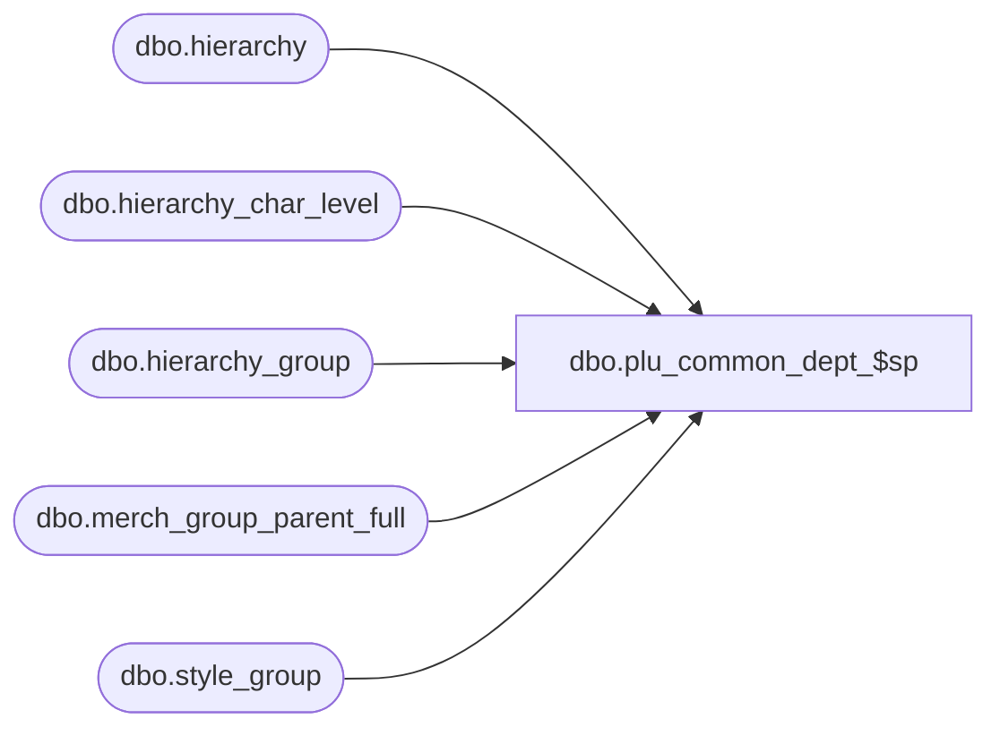

# dbo.plu_common_dept_$sp

**Database:** me_01  
**Server:** bedrockdb02  

## Architecture Diagram



## Table Dependencies

| Referenced Table |
|---|
| dbo.hierarchy |
| dbo.hierarchy_char_level |
| dbo.hierarchy_group |
| dbo.merch_group_parent_full |
| dbo.style_group |

## Stored Procedure Code

```sql
CREATE PROCEDURE [dbo].[plu_common_dept_$sp]
AS

DECLARE @line_id INT
		, @table_name NVARCHAR(30), @operation_name NVARCHAR(50)
		, @sql_err_num DECIMAL(38,0), @error_msg NVARCHAR(2000)
		, @error_severity SMALLINT, @error_state SMALLINT
		
/*
	Version		: 1.00
	Created		: Feb 2011
	Created by	: Sameer Patel
	Description	: Procedure called by Segment 1038 -- EDM & PROD to Price Look-Up File Generate (CRS)
				  Gets all department and department class records for styles requiring an update/resend
				  
	Call from C++ code:
		-- File: PLUFileDefCommonSQLServer.cpp
		-- Class: CPLUFileDefCommonSQLServer
		-- Function: LoadStyleResendFileDefs
	
HISTORY:
Date       		Name         	Def#		Desc
Feb 04,11		Sameer Patel	N/A			Initial Release
*/	

BEGIN TRY

	SET NOCOUNT ON
	
	-- Get department records for style colors in #all_style_color_resend
	-- From a CRS to Merch mapping point of view, the CRS departments are equivalent to Merch department groups
	-- In class UI, navigate to Prod->Hierarchy->Characteristic Level Defaults; look for POS department group no.

	SET @line_id = 10
	
	
	INSERT INTO #dept
		( dept_id, hierarchy_level_id
		, pos_dept_group_key )
	SELECT
		DISTINCT
			HierarchyGroup.hierarchy_group_id dept_id, HierarchyGroup.hierarchy_level_id
			, HierarchyGroup.pos_dept_group_key
	FROM
		#all_style_color_resend StyleColorResend
	INNER JOIN style_group StyleGroup ON StyleColorResend.style_id = StyleGroup.style_id
	INNER JOIN ( merch_group_parent_full DeptMerchGroupParent 
					INNER JOIN hierarchy_char_level HierarchyCharLevel ON DeptMerchGroupParent.parent_hierarchy_level_id = HierarchyCharLevel.pos_dept_group_key_level_id
					INNER JOIN hierarchy Hierarchy ON HierarchyCharLevel.hierarchy_id = Hierarchy.hierarchy_id
														AND Hierarchy.hierarchy_type = 1 AND Hierarchy.alternate_flag = 0 ) ON StyleGroup.hierarchy_group_id = DeptMerchGroupParent.hierarchy_group_id
	INNER JOIN hierarchy_group HierarchyGroup ON DeptMerchGroupParent.parent_hierarchy_group_id = HierarchyGroup.hierarchy_group_id
	
	-- Get all department class records
	-- From a CRS to Merch mapping point of view, the CRS department classes are equivalent to Merch departments
	-- In class UI, navigate to Prod->Hierarchy->Characteristic Level Defaults; look for POS department no.	

	SET @line_id = 20
	
	INSERT INTO #dept_class
		( dept_class_id, dept_id, hierarchy_level_id
		, pos_merch_group_key )
	SELECT
		DISTINCT
			HierarchyGroup.hierarchy_group_id dept_class_id, TempDept.dept_id, HierarchyGroup.hierarchy_level_id
			, HierarchyGroup.pos_merch_group_key
	FROM
		#all_style_color_resend StyleColorResend
	INNER JOIN style_group StyleGroup ON StyleColorResend.style_id = StyleGroup.style_id
	INNER JOIN ( merch_group_parent_full DeptClassMerchGroupParent 
					INNER JOIN hierarchy_char_level HierarchyCharLevel ON DeptClassMerchGroupParent.parent_hierarchy_level_id = HierarchyCharLevel.pos_merch_group_key_level_id
					INNER JOIN hierarchy Hierarchy ON HierarchyCharLevel.hierarchy_id = Hierarchy.hierarchy_id
														AND Hierarchy.hierarchy_type = 1 AND Hierarchy.alternate_flag = 0 ) ON StyleGroup.hierarchy_group_id = DeptClassMerchGroupParent.hierarchy_group_id
	INNER JOIN ( merch_group_parent_full DeptMerchGroupParent 
					INNER JOIN #dept TempDept ON TempDept.dept_id = DeptMerchGroupParent.parent_hierarchy_group_id
													AND TempDept.hierarchy_level_id = DeptMerchGroupParent.parent_hierarchy_level_id ) ON StyleGroup.hierarchy_group_id = DeptMerchGroupParent.hierarchy_group_id
	INNER JOIN hierarchy_group HierarchyGroup ON DeptClassMerchGroupParent.parent_hierarchy_group_id = HierarchyGroup.hierarchy_group_id

END TRY

BEGIN CATCH

	SELECT 
		@error_severity	= 16
		, @error_state = 1

	IF @line_id = 10
		SELECT  
			@table_name			= N'#dept'
			, @operation_name	= N'INSERT'
			, @sql_err_num		= ERROR_NUMBER()
			, @error_msg		= N'Line Id = ' + CAST(@line_id AS NVARCHAR(4)) + N' '
									+ N' Table Name = ' + @table_name + N' '
									+ N' Operation Name = ' + @operation_name + N' '
									+ N' SQL Error Number = ' + CAST(@sql_err_num AS NVARCHAR(38)) + N' '
									+ N' Error Message = ' + ERROR_MESSAGE()
									
	ELSE IF @line_id = 20
		SELECT  
			@table_name			= N'#dept_class'
			, @operation_name	= N'INSERT'
			, @sql_err_num		= ERROR_NUMBER()
			, @error_msg		= N'Line Id = ' + CAST(@line_id AS NVARCHAR(4)) + N' '
									+ N' Table Name = ' + @table_name + N' '
									+ N' Operation Name = ' + @operation_name + N' '
									+ N' SQL Error Number = ' + CAST(@sql_err_num AS NVARCHAR(38)) + N' '
									+ N' Error Message = ' + ERROR_MESSAGE()
			
	RAISERROR (@error_msg, @error_severity, @error_state)			

END CATCH
```

