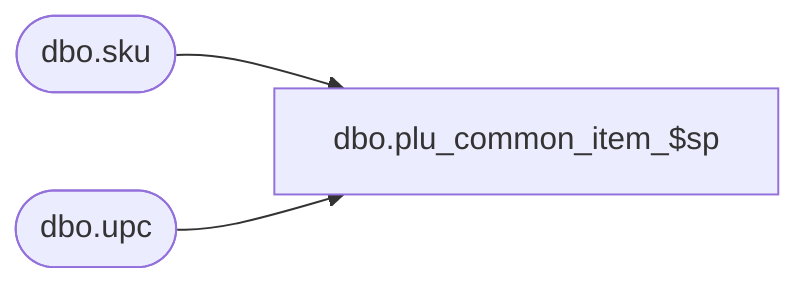

# dbo.plu_common_item_$sp

**Database:** me_01  
**Server:** bedrockdb02  

## Architecture Diagram



## Table Dependencies

| Referenced Table |
|---|
| dbo.sku |
| dbo.upc |

## Stored Procedure Code

```sql
CREATE PROCEDURE [dbo].[plu_common_item_$sp]
AS

DECLARE @line_id INT
		, @table_name NVARCHAR(30), @operation_name NVARCHAR(50)
		, @sql_err_num DECIMAL(38,0), @error_msg NVARCHAR(2000)
		, @error_severity SMALLINT, @error_state SMALLINT

/*
	Version		: 1.00
	Created		: Feb 2011
	Created by	: Sameer Patel
	Description	: Procedure called by Segment 1038 -- EDM & PROD to Price Look-Up File Generate (CRS)
				  Gets sku and upc information for records in #style table

	Call from C++ code:
		-- File: PLUFileDefCommonSQLServer.cpp
		-- Class: CPLUFileDefCommonSQLServer
		-- Function: LoadFullRegenFileDefs
					 LoadHGRegenFileDefs
					 LoadStyleResendFileDefs
					 LoadStyleUpdateFileDefs
					 LoadPromoFileDefs
					 LoadPriceFileDefs
					 LoadCancelPromoFileDefs

	-- NOTE: The temp table #item and #style exist

	IF NOT object_id('tempdb..#item') IS NULL
	DROP TABLE #item

	CREATE TABLE #item
		( sku_id DECIMAL(13), style_id DECIMAL(12), style_color_id DECIMAL(13)
		, upc_number NVARCHAR(14)
		, PRIMARY KEY (sku_id, style_id, style_color_id, upc_number) )

	IF NOT object_id('tempdb..#style') IS NULL
	DROP TABLE #style

	CREATE TABLE #style
		( style_id DECIMAL(12), style_color_id DECIMAL(13), color_id SMALLINT
		, dept_id INT, dept_class_id INT
		, style_type TINYINT
		, plu_key NVARCHAR(20)
		, description NVARCHAR(24)
		, retail_price DECIMAL(14,2), style_location_retail_price DECIMAL(14,2)
		, PRIMARY KEY (style_id, style_color_id, color_id, dept_class_id) )

*/

BEGIN TRY

	SET NOCOUNT ON

	SET @line_id = 10

	INSERT INTO #item
		( sku_id, style_id, style_color_id
		, upc_number )
	SELECT
		Sku.sku_id, Sku.style_id, Sku.style_color_id
		, Upc.upc_number
	FROM
		#style TempStyle
	INNER JOIN sku Sku ON TempStyle.style_color_id = Sku.style_color_id AND TempStyle.style_id = Sku.style_id
	INNER JOIN upc Upc ON Sku.sku_id = Upc.sku_id

END TRY

BEGIN CATCH

	SELECT
		@error_severity	= 16
		, @error_state = 1

	IF @line_id = 10
		SELECT
			@table_name			= N'#item'
			, @operation_name	= N'INSERT'
			, @sql_err_num		= ERROR_NUMBER()
			, @error_msg		= N'Line Id = ' + CAST(@line_id AS NVARCHAR(4)) + N' '
									+ N' Table Name = ' + @table_name + N' '
									+ N' Operation Name = ' + @operation_name + N' '
									+ N' SQL Error Number = ' + CAST(@sql_err_num AS NVARCHAR(38)) + N' '
									+ N' Error Message = ' + ERROR_MESSAGE()

	RAISERROR (@error_msg, @error_severity, @error_state)

END CATCH
```

