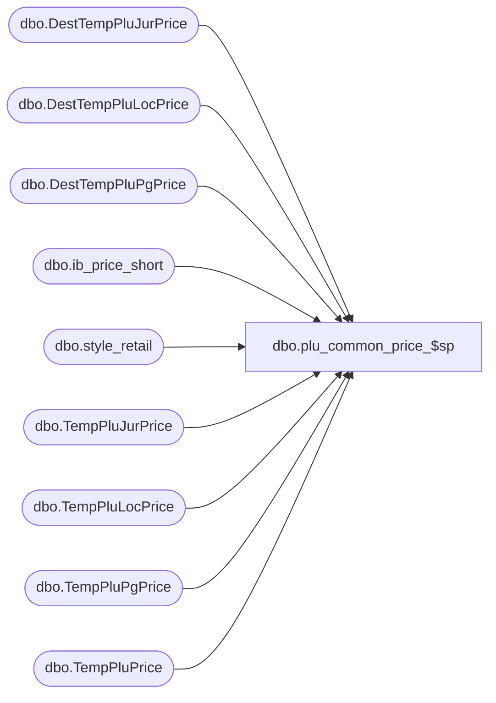

# dbo.plu_common_price_$sp

**Database:** me_01  
**Server:** bedrockdb02  

## Architecture Diagram



## Table Dependencies

| Referenced Table |
|---|
| dbo.DestTempPluJurPrice |
| dbo.DestTempPluLocPrice |
| dbo.DestTempPluPgPrice |
| dbo.ib_price_short |
| dbo.style_retail |
| dbo.TempPluJurPrice |
| dbo.TempPluLocPrice |
| dbo.TempPluPgPrice |
| dbo.TempPluPrice |

## Stored Procedure Code

```sql
CREATE PROCEDURE [dbo].[plu_common_price_$sp]
AS
			
DECLARE @line_id INT
		, @table_name NVARCHAR(30), @operation_name NVARCHAR(50)
		, @sql_err_num DECIMAL(38,0), @error_msg NVARCHAR(2000)
		, @error_severity SMALLINT, @error_state SMALLINT
		, @batch_size AS INT

SET @batch_size = 20


/*
	Version		: 1.00
	Created		: Feb 2011
	Created by	: Sameer Patel
	Description	: Procedure called by Segment 1038 -- EDM & PROD to Price Look-Up File Generate (CRS)
				  Retrieve prices for style colors in #style table
				  
	Call from C++ code:
		-- File: PLUFileDefCommonSQLServer.cpp
		-- Class: CPLUFileDefCommonSQLServer
		-- Function: LoadFullRegenFileDefs
					 LoadHGRegenFileDefs
					 LoadStyleResendFileDefs
					 LoadStyleUpdateFileDefs
					 LoadUPCFileDefs
					 LoadCancelPromoFileDefs
		
	-- NOTE: The temp table #style, #location, #jurisdiction, #pricing_group and #plu_price exist
	
	IF NOT object_id('tempdb..#plu_price') IS NULL
	DROP TABLE #plu_price

	CREATE TABLE #plu_price
		( location_id SMALLINT, style_id DECIMAL(12), style_color_id DECIMAL(13)
		, start_date SMALLDATETIME
		, retail_price DECIMAL(14,2), price_status_id SMALLINT, compare_at_retail DECIMAL(14,2)
		, PRIMARY KEY (location_id, style_id, style_color_id) )	
	
	IF NOT object_id('tempdb..#style') IS NULL
	DROP TABLE #style

	CREATE TABLE #style
		( style_id DECIMAL(12), style_color_id DECIMAL(13), color_id SMALLINT
		, dept_id INT, dept_class_id INT
		, style_type TINYINT
		, plu_key VARCHAR(20)
		, description VARCHAR(24)
		, retail_price DECIMAL(14,2)
		, PRIMARY KEY (style_id, style_color_id, color_id, dept_class_id) )		

	IF NOT object_id('tempdb..#location') IS NULL
	DROP TABLE #location

	CREATE TABLE #location
		( id SMALLINT IDENTITY(1,1)
		, location_id SMALLINT, jurisdiction_id SMALLINT, pricing_group_id SMALLINT
		, language_id INT, register_type_id TINYINT
		, PRIMARY KEY (location_id, jurisdiction_id, pricing_group_id) )
	
	IF NOT object_id('tempdb..#pricing_group') IS NULL
	DROP TABLE #pricing_group

	CREATE TABLE #pricing_group
		( id SMALLINT IDENTITY(1,1)
		, pricing_group_id SMALLINT, jurisdiction_id SMALLINT
		, PRIMARY KEY (pricing_group_id) )
	
	IF NOT object_id('tempdb..#jurisdiction') IS NULL
	DROP TABLE #jurisdiction

	CREATE TABLE #jurisdiction
		( id SMALLINT IDENTITY(1,1)
		, jurisdiction_id SMALLINT
		, PRIMARY KEY (jurisdiction_id) )
	
HISTORY:
Date       		Name         	Def#		Desc
Feb 04,11		Sameer Patel	N/A			Initial Release
Feb 21,11		Sameer Patel	N/A			Location exceptions appearing as zero in PLU.chg file (@line_id IN (160,210))
*/

DECLARE @min_jur_id SMALLINT, @max_jur_id SMALLINT
DECLARE @min_pg_id SMALLINT, @max_pg_id SMALLINT
DECLARE @min_loc_id SMALLINT, @max_loc_id SMALLINT

DECLARE @c_default_date SMALLDATETIME
SET @c_default_date = '1900-1-1'

DECLARE @current_date AS DATETIME
SET @current_date = CAST(FLOOR(CAST(GETDATE() AS FLOAT)) AS DATETIME)

BEGIN TRY

	SET NOCOUNT ON
	
	-- Get minimum and maximum ids from #jurisdiction table

	SET @line_id = 10
	
	SELECT 
		@min_jur_id = COALESCE(MIN(id), 0)
		, @max_jur_id = COALESCE(MAX(id), 0)
	FROM
		#jurisdiction
		
	-- Get minimum and maximum ids from #pricing_group table

	SET @line_id = 20
	
	SELECT 
		@min_pg_id = COALESCE(MIN(id), 0)
		, @max_pg_id = COALESCE(MAX(id), 0)
	FROM
		#pricing_group

	-- Get minimum and maximum ids from #location table
	
	SET @line_id = 30
	
	SELECT 
		@min_loc_id = COALESCE(MIN(id), 0)
		, @max_loc_id = COALESCE(MAX(id), 0)
	FROM
		#location		
		
	-- Return if there are no locations to regenerate		
	
	IF @max_loc_id = 0
		RETURN
		
	-- In the following three temp tables, please note the two columns start_date and max_start_date
	-- TODO: Explain
		
	-- Create a temp table to hold jurisdiction level prices
	
	SET @line_id = 40
	
	IF NOT object_id('tempdb..#plu_jur_price') IS NULL
	DROP TABLE #plu_jur_price

	CREATE TABLE #plu_jur_price
		( jurisdiction_id SMALLINT
		, style_id DECIMAL(12), style_color_id DECIMAL(13), color_id SMALLINT
		, start_date SMALLDATETIME
		, max_start_date SMALLDATETIME, ib_price_id DECIMAL(12), retail_price DECIMAL(14,2), price_status_id SMALLINT
		, PRIMARY KEY (jurisdiction_id, style_id, style_color_id, color_id, start_date) )
		
	-- Create a temp table to hold pricing group level prices

	SET @line_id = 50
	
	IF NOT object_id('tempdb..#plu_pg_price') IS NULL
	DROP TABLE #plu_pg_price

	CREATE TABLE #plu_pg_price
		( pricing_group_id SMALLINT, jurisdiction_id SMALLINT
		, style_id DECIMAL(12), style_color_id DECIMAL(13), color_id SMALLINT
		, start_date SMALLDATETIME
		, max_start_date SMALLDATETIME, ib_price_id DECIMAL(12), retail_price DECIMAL(14,2), price_status_id SMALLINT
		, PRIMARY KEY (pricing_group_id, jurisdiction_id, style_id, style_color_id, color_id, start_date) )
		
	-- Create a temp table to hold location level prices

	SET @line_id = 60
	
	IF NOT object_id('tempdb..#plu_loc_price') IS NULL
	DROP TABLE #plu_loc_price

	CREATE TABLE #plu_loc_price
		( location_id SMALLINT, jurisdiction_id SMALLINT
		, style_id DECIMAL(12), style_color_id DECIMAL(13), color_id SMALLINT
		, start_date SMALLDATETIME
		, max_start_date SMALLDATETIME, ib_price_id DECIMAL(12), retail_price DECIMAL(14,2), price_status_id SMALLINT
		, PRIMARY KEY (location_id, jurisdiction_id, style_id, style_color_id, color_id, start_date) )


-----------------------------------------------------------------------------------------------------------------------------
--	Jurisdiction
-----------------------------------------------------------------------------------------------------------------------------
	
	-- For each jurisdiction
	-- Get style/jurisdiction level current and future price
	
	WHILE (@min_jur_id <= @max_jur_id)
	BEGIN
	
		-- Insert an entry each style/color/jurisidiction
		-- determining the maximum start date in ib_price_short less than or equal to the current date
		
		SET @line_id = 70
		
		INSERT INTO #plu_jur_price
			( jurisdiction_id
			, style_id, style_color_id, color_id
			, start_date
			, max_start_date )
		SELECT
			TempJurisdiction.jurisdiction_id
			, TempStyle.style_id, TempStyle.style_color_id, TempStyle.color_id
			, @current_date start_date
			, MAX(IbPriceShort.start_date) start_date
		FROM
			#style TempStyle
		INNER JOIN #jurisdiction TempJurisdiction ON TempJurisdiction.id BETWEEN @min_jur_id AND @min_jur_id + @batch_size
		INNER JOIN ib_price_short IbPriceShort ON TempStyle.style_id = IbPriceShort.style_id AND TempJurisdiction.jurisdiction_id = IbPriceShort.jurisdiction_id 
													AND IbPriceShort.temp_price_flag = 0 AND IbPriceShort.start_date <= @current_date
													AND (IbPriceShort.color_id IS NULL OR TempStyle.color_id = IbPriceShort.color_id) 
													AND (IbPriceShort.pricing_group_id IS NULL AND IbPriceShort.location_id IS NULL)
		GROUP BY
			TempJurisdiction.jurisdiction_id
			, TempStyle.style_id, TempStyle.style_color_id, TempStyle.color_id
			
		-- Insert an entry each style/color/jurisidiction 
		-- for any future dates in ib_price_short
		
		SET @line_id = 80
		
		INSERT INTO #plu_jur_price
			( jurisdiction_id
			, style_id, style_color_id, color_id
			, start_date
			, max_start_date )
		SELECT
			DISTINCT
				TempJurisdiction.jurisdiction_id
				, TempStyle.style_id, TempStyle.style_color_id, TempStyle.color_id
				, IbPriceShort.start_date
				, IbPriceShort.start_date max_start_date
		FROM
			#style TempStyle
		INNER JOIN #jurisdiction TempJurisdiction ON TempJurisdiction.id BETWEEN @min_jur_id AND @min_jur_id + @batch_size
		INNER JOIN ib_price_short IbPriceShort ON TempStyle.style_id = IbPriceShort.style_id AND TempJurisdiction.jurisdiction_id = IbPriceShort.jurisdiction_id 
													AND IbPriceShort.temp_price_flag = 0 AND IbPriceShort.start_date > @current_date
													AND (IbPriceShort.color_id IS NULL OR TempStyle.color_id = IbPriceShort.color_id) 
													AND (IbPriceShort.pricing_group_id IS NULL AND IbPriceShort.location_id IS NULL)
			
		-- Insert an entry each style/color/jurisidiction 
		-- for any temporary markups or markdown cancellations in ib_price_short
		-- start_date = end_date for MU or MUC + 1
		
		SET @line_id = 90
		
		INSERT INTO #plu_jur_price
			( jurisdiction_id
			, style_id, style_color_id, color_id
			, start_date
			, max_start_date )
		SELECT
			TempJurisdiction.jurisdiction_id
			, TempStyle.style_id, TempStyle.style_color_id, TempStyle.color_id
			, DATEADD(day, 1, IbPriceShortMarkups.end_date)
			, MAX(IbPriceShort.start_date) start_date
		FROM
			#style TempStyle
		INNER JOIN #jurisdiction TempJurisdiction ON TempJurisdiction.id BETWEEN @min_jur_id AND @min_jur_id + @batch_size
		INNER JOIN ib_price_short IbPriceShortMarkups ON TempStyle.style_id = IbPriceShortMarkups.style_id AND TempJurisdiction.jurisdiction_id = IbPriceShortMarkups.jurisdiction_id
															AND IbPriceShortMarkups.temp_price_flag = 1 AND IbPriceShortMarkups.cancel_promo_flag = 0
															AND IbPriceShortMarkups.end_date > IbPriceShortMarkups.start_date AND IbPriceShortMarkups.end_date >= @current_date
															AND IbPriceShortMarkups.price_change_type IN (1,2) -- MU or MUC
		INNER JOIN ib_price_short IbPriceShort ON TempStyle.style_id = IbPriceShort.style_id AND TempJurisdiction.jurisdiction_id = IbPriceShort.jurisdiction_id 
													AND IbPriceShort.temp_price_flag = 0 AND IbPriceShort.start_date <= DATEADD(day, 1, IbPriceShortMarkups.end_date)
													AND (IbPriceShort.color_id IS NULL OR TempStyle.color_id = IbPriceShort.color_id) 
													AND (IbPriceShort.pricing_group_id IS NULL AND IbPriceShort.location_id IS NULL)
		LEFT OUTER JOIN #plu_jur_price TempPluJurPrice ON TempJurisdiction.jurisdiction_id = TempPluJurPrice.jurisdiction_id
															AND TempStyle.style_id = TempPluJurPrice.style_id AND TempStyle.style_color_id = TempPluJurPrice.style_color_id AND TempStyle.color_id = TempPluJurPrice.color_id
															AND DATEADD(day, 1, IbPriceShortMarkups.end_date) = TempPluJurPrice.start_date
		WHERE
			TempPluJurPrice.style_id IS NULL
		GROUP BY
			TempJurisdiction.jurisdiction_id
			, TempStyle.style_id, TempStyle.style_color_id, TempStyle.color_id
			, DATEADD(day, 1, IbPriceShortMarkups.end_date)
			
		-- Update #plu_jur_price with maximum ids from ib_price_short
		-- based on the primary key of #plu_jur_price (jurisdiction_id, style_id, style_color_id, color_id, start_date)
		-- and the max_start_date column

		SET @line_id = 100
		
		UPDATE DestTempPluJurPrice
		SET
			DestTempPluJurPrice.ib_price_id = SourceTempPluJurPrice.ib_price_id
		FROM
			#plu_jur_price DestTempPluJurPrice
		INNER JOIN
			( SELECT
				TempPluJurPrice.jurisdiction_id, TempPluJurPrice.style_id
				, TempPluJurPrice.style_color_id, TempPluJurPrice.color_id
				, TempPluJurPrice.start_date
				, MAX(IbPriceShort.ib_price_id) ib_price_id
			  FROM
				#plu_jur_price TempPluJurPrice
			  INNER JOIN #jurisdiction TempJurisdiction ON TempPluJurPrice.jurisdiction_id = TempJurisdiction.jurisdiction_id AND TempJurisdiction.id BETWEEN @min_jur_id AND @min_jur_id + @batch_size
			  INNER JOIN ib_price_short IbPriceShort ON IbPriceShort.style_id = TempPluJurPrice.style_id AND IbPriceShort.jurisdiction_id = TempJurisdiction.jurisdiction_id 
															AND IbPriceShort.temp_price_flag = 0 AND TempPluJurPrice.max_start_date = IbPriceShort.start_date
															AND (IbPriceShort.color_id IS NULL OR IbPriceShort.color_id = TempPluJurPrice.color_id) 
															AND (IbPriceShort.pricing_group_id IS NULL AND IbPriceShort.location_id IS NULL)
			  GROUP BY
				TempPluJurPrice.jurisdiction_id, TempPluJurPrice.style_id
				, TempPluJurPrice.style_color_id, TempPluJurPrice.color_id
				, TempPluJurPrice.start_date ) SourceTempPluJurPrice ON DestTempPluJurPrice.jurisdiction_id = SourceTempPluJurPrice.jurisdiction_id 
																			AND DestTempPluJurPrice.style_id = SourceTempPluJurPrice.style_id
																			AND DestTempPluJurPrice.style_color_id = SourceTempPluJurPrice.style_color_id 
																			AND DestTempPluJurPrice.color_id = SourceTempPluJurPrice.color_id
																			AND DestTempPluJurPrice.start_date = SourceTempPluJurPrice.start_date
																										
		-- Update #plu_jur_price with selling_retail_price and the price_status_id from ib_price_short
		-- based on ib_price_id column																										

		SET @line_id = 110
			  	
		UPDATE TempPluJurPrice
		SET
			TempPluJurPrice.retail_price = IbPriceShort.selling_retail_price, TempPluJurPrice.price_status_id = IbPriceShort.price_status_id
		FROM
			#plu_jur_price TempPluJurPrice
		INNER JOIN ib_price_short IbPriceShort ON TempPluJurPrice.ib_price_id = IbPriceShort.ib_price_id
		
		SET @min_jur_id = @min_jur_id + @batch_size + 1
		
	END


-----------------------------------------------------------------------------------------------------------------------------
--	Pricing Group
-----------------------------------------------------------------------------------------------------------------------------

	-- For each pricing group
	-- Get style/pricing group level current and future price
	
	WHILE (@min_pg_id <= @max_pg_id)
	BEGIN
	
		-- Insert an entry each style/color/jurisidiction/pricing group
		-- determining the maximum start date in ib_price_short less than or equal to the current date
		
		SET @line_id = 120
		
		INSERT INTO #plu_pg_price
			( pricing_group_id, jurisdiction_id
			, style_id, style_color_id, color_id
			, start_date
			, max_start_date )
		SELECT
			TempPricingGroup.pricing_group_id, TempPricingGroup.jurisdiction_id
			, TempStyle.style_id, TempStyle.style_color_id, TempStyle.color_id
			, @current_date start_date
			, MAX(IbPriceShort.start_date) start_date
		FROM
			#style TempStyle
		INNER JOIN #pricing_group TempPricingGroup ON TempPricingGroup.id BETWEEN @min_pg_id AND @min_pg_id + @batch_size
		INNER JOIN ib_price_short IbPriceShort ON TempStyle.style_id = IbPriceShort.style_id AND TempPricingGroup.jurisdiction_id = IbPriceShort.jurisdiction_id 
													AND IbPriceShort.temp_price_flag = 0 AND IbPriceShort.start_date <= @current_date
													AND (IbPriceShort.color_id IS NULL OR TempStyle.color_id = IbPriceShort.color_id) 
													AND (TempPricingGroup.pricing_group_id = IbPriceShort.pricing_group_id)
		GROUP BY
			TempPricingGroup.pricing_group_id, TempPricingGroup.jurisdiction_id
			, TempStyle.style_id, TempStyle.style_color_id, TempStyle.color_id
			
		-- Insert an entry each style/color/jurisidiction/pricing group 
		-- for any future dates in ib_price_short
		
		SET @line_id = 130
		
		INSERT INTO #plu_pg_price
			( pricing_group_id, jurisdiction_id
			, style_id, style_color_id, color_id
			, start_date
			, max_start_date )
		SELECT
			DISTINCT
				TempPricingGroup.pricing_group_id, TempPricingGroup.jurisdiction_id
				, TempStyle.style_id, TempStyle.style_color_id, TempStyle.color_id
				, IbPriceShort.start_date
				, IbPriceShort.start_date max_start_date
		FROM
			#style TempStyle
		INNER JOIN #pricing_group TempPricingGroup ON TempPricingGroup.id BETWEEN @min_pg_id AND @min_pg_id + @batch_size
		INNER JOIN ib_price_short IbPriceShort ON TempStyle.style_id = IbPriceShort.style_id AND TempPricingGroup.jurisdiction_id = IbPriceShort.jurisdiction_id 
													AND IbPriceShort.temp_price_flag = 0 AND IbPriceShort.start_date > @current_date
													AND (IbPriceShort.color_id IS NULL OR TempStyle.color_id = IbPriceShort.color_id) 
													AND (TempPricingGroup.pricing_group_id = IbPriceShort.pricing_group_id)
			
		-- Insert an entry each style/color/jurisidiction/pricing group  
		-- for any temporary markups or markdown cancellations in ib_price_short
		-- start_date = end_date for MU or MUC + 1
		
		SET @line_id = 140
		
		INSERT INTO #plu_pg_price
			( pricing_group_id, jurisdiction_id
			, style_id, style_color_id, color_id
			, start_date
			, max_start_date )
		SELECT
			TempPricingGroup.pricing_group_id, TempPricingGroup.jurisdiction_id
			, TempStyle.style_id, TempStyle.style_color_id, TempStyle.color_id
			, DATEADD(day, 1, IbPriceShortMarkups.end_date)
			, MAX(IbPriceShort.start_date) start_date
		FROM
			#style TempStyle
		INNER JOIN #pricing_group TempPricingGroup ON TempPricingGroup.id BETWEEN @min_pg_id AND @min_pg_id + @batch_size
		INNER JOIN ib_price_short IbPriceShortMarkups ON TempStyle.style_id = IbPriceShortMarkups.style_id AND TempPricingGroup.jurisdiction_id = IbPriceShortMarkups.jurisdiction_id
															AND IbPriceShortMarkups.temp_price_flag = 1 AND IbPriceShortMarkups.cancel_promo_flag = 0
															AND IbPriceShortMarkups.end_date > IbPriceShortMarkups.start_date AND IbPriceShortMarkups.end_date >= @current_date
															AND IbPriceShortMarkups.price_change_type IN (1,2) -- MU or MUC
		INNER JOIN ib_price_short IbPriceShort ON TempStyle.style_id = IbPriceShort.style_id AND TempPricingGroup.jurisdiction_id = IbPriceShort.jurisdiction_id 
													AND IbPriceShort.temp_price_flag = 0 AND IbPriceShort.start_date <= DATEADD(day, 1, IbPriceShortMarkups.end_date)
													AND (IbPriceShort.color_id IS NULL OR TempStyle.color_id = IbPriceShort.color_id) 
													AND (TempPricingGroup.pricing_group_id = IbPriceShort.pricing_group_id)
		GROUP BY
			TempPricingGroup.pricing_group_id, TempPricingGroup.jurisdiction_id
			, TempStyle.style_id, TempStyle.style_color_id, TempStyle.color_id
			, DATEADD(day, 1, IbPriceShortMarkups.end_date)
			
		-- Update #plu_pg_price with maximum ids from ib_price_short
		-- based on the primary key of #plu_pg_price (pricing_group_id, jurisdiction_id, style_id, style_color_id, color_id, start_date)
		-- and the max_start_date column

		SET @line_id = 150
		
		UPDATE DestTempPluPgPrice
		SET
			DestTempPluPgPrice.ib_price_id = SourceTempPluPgPrice.ib_price_id
		FROM
			#plu_pg_price DestTempPluPgPrice
		INNER JOIN
			( SELECT
				TempPluPgPrice.pricing_group_id, TempPluPgPrice.jurisdiction_id, TempPluPgPrice.style_id
				, TempPluPgPrice.style_color_id, TempPluPgPrice.color_id
				, TempPluPgPrice.start_date
				, MAX(IbPriceShort.ib_price_id) ib_price_id
			  FROM
				#plu_pg_price TempPluPgPrice
			  INNER JOIN #pricing_group TempPricingGroup ON TempPluPgPrice.pricing_group_id = TempPricingGroup.pricing_group_id AND TempPricingGroup.id BETWEEN @min_pg_id AND @min_pg_id + @batch_size
			  INNER JOIN ib_price_short IbPriceShort ON IbPriceShort.style_id = TempPluPgPrice.style_id AND IbPriceShort.jurisdiction_id = TempPricingGroup.jurisdiction_id 
															AND IbPriceShort.temp_price_flag = 0 AND TempPluPgPrice.max_start_date = IbPriceShort.start_date
															AND (IbPriceShort.color_id IS NULL OR IbPriceShort.color_id = TempPluPgPrice.color_id) 
															AND (TempPluPgPrice.pricing_group_id = IbPriceShort.pricing_group_id)
			  GROUP BY
				TempPluPgPrice.pricing_group_id, TempPluPgPrice.jurisdiction_id, TempPluPgPrice.style_id
				, TempPluPgPrice.style_color_id, TempPluPgPrice.color_id
				, TempPluPgPrice.start_date ) SourceTempPluPgPrice ON DestTempPluPgPrice.pricing_group_id = SourceTempPluPgPrice.pricing_group_id AND DestTempPluPgPrice.jurisdiction_id = SourceTempPluPgPrice.jurisdiction_id 
																		AND DestTempPluPgPrice.style_id = SourceTempPluPgPrice.style_id
																		AND DestTempPluPgPrice.style_color_id = SourceTempPluPgPrice.style_color_id 
																		AND DestTempPluPgPrice.color_id = SourceTempPluPgPrice.color_id
																		AND DestTempPluPgPrice.start_date = SourceTempPluPgPrice.start_date
																										
		-- Update #plu_pg_price with selling_retail_price and the price_status_id from ib_price_short
		-- based on ib_price_id column																										

		SET @line_id = 160
			  	
		UPDATE TempPluPgPrice
		SET
			TempPluPgPrice.retail_price = IbPriceShort.selling_retail_price, TempPluPgPrice.price_status_id = IbPriceShort.price_status_id
		FROM
			#plu_pg_price TempPluPgPrice
		INNER JOIN ib_price_short IbPriceShort ON TempPluPgPrice.ib_price_id = IbPriceShort.ib_price_id
		
		SET @min_pg_id = @min_pg_id + @batch_size + 1
		
	END


-----------------------------------------------------------------------------------------------------------------------------
--	Location
-----------------------------------------------------------------------------------------------------------------------------

	-- For each location
	-- Get style/location level current and future price

	WHILE (@min_loc_id <= @max_loc_id)
	BEGIN
	
		-- Insert an entry each style/color/jurisidiction/location
		-- determining the maximum start date in ib_price_short less than or equal to the current date
		
		SET @line_id = 170
		
		INSERT INTO #plu_loc_price
			( location_id, jurisdiction_id
			, style_id, style_color_id, color_id
			, start_date
			, max_start_date )
		SELECT
			TempLocation.location_id, TempLocation.jurisdiction_id
			, TempStyle.style_id, TempStyle.style_color_id, TempStyle.color_id
			, @current_date start_date
			, MAX(IbPriceShort.start_date) start_date
		FROM
			#style TempStyle
		INNER JOIN #location TempLocation ON TempLocation.id BETWEEN @min_loc_id AND @min_loc_id + @batch_size
		INNER JOIN ib_price_short IbPriceShort ON TempStyle.style_id = IbPriceShort.style_id AND TempLocation.jurisdiction_id = IbPriceShort.jurisdiction_id 
													AND IbPriceShort.temp_price_flag = 0 AND IbPriceShort.start_date <= @current_date
													AND (IbPriceShort.color_id IS NULL OR TempStyle.color_id = IbPriceShort.color_id) 
													AND (TempLocation.location_id = IbPriceShort.location_id)
		GROUP BY
			TempLocation.location_id, TempLocation.jurisdiction_id
			, TempStyle.style_id, TempStyle.style_color_id, TempStyle.color_id
			
		-- Insert an entry each style/color/jurisidiction/location
		-- for any future dates in ib_price_short
		
		SET @line_id = 180
		
		INSERT INTO #plu_loc_price
			( location_id, jurisdiction_id
			, style_id, style_color_id, color_id
			, start_date
			, max_start_date )
		SELECT
			DISTINCT
				TempLocation.location_id, TempLocation.jurisdiction_id
				, TempStyle.style_id, TempStyle.style_color_id, TempStyle.color_id
				, IbPriceShort.start_date
				, IbPriceShort.start_date max_start_date
		FROM
			#style TempStyle
		INNER JOIN #location TempLocation ON TempLocation.id BETWEEN @min_loc_id AND @min_loc_id + @batch_size
		INNER JOIN ib_price_short IbPriceShort ON TempStyle.style_id = IbPriceShort.style_id AND TempLocation.jurisdiction_id = IbPriceShort.jurisdiction_id 
													AND IbPriceShort.temp_price_flag = 0 AND IbPriceShort.start_date > @current_date
													AND (IbPriceShort.color_id IS NULL OR TempStyle.color_id = IbPriceShort.color_id) 
													AND (TempLocation.location_id = IbPriceShort.location_id)
			
		-- Insert an entry each style/color/jurisidiction/location  
		-- for any temporary markups or markdown cancellations in ib_price_short
		-- start_date = end_date for MU or MUC + 1
		
		SET @line_id = 190
		
		INSERT INTO #plu_loc_price
			( location_id, jurisdiction_id
			, style_id, style_color_id, color_id
			, start_date
			, max_start_date )
		SELECT
			TempLocation.location_id, TempLocation.jurisdiction_id
			, TempStyle.style_id, TempStyle.style_color_id, TempStyle.color_id
			, DATEADD(day, 1, IbPriceShortMarkups.end_date)
			, MAX(IbPriceShort.start_date) start_date
		FROM
			#style TempStyle
		INNER JOIN #location TempLocation ON TempLocation.id BETWEEN @min_loc_id AND @min_loc_id + @batch_size
		INNER JOIN ib_price_short IbPriceShortMarkups ON TempStyle.style_id = IbPriceShortMarkups.style_id AND TempLocation.jurisdiction_id = IbPriceShortMarkups.jurisdiction_id
															AND IbPriceShortMarkups.temp_price_flag = 1 AND IbPriceShortMarkups.cancel_promo_flag = 0
															AND IbPriceShortMarkups.end_date > IbPriceShortMarkups.start_date AND IbPriceShortMarkups.end_date >= @current_date
															AND IbPriceShortMarkups.price_change_type IN (1,2) -- MU or MUC
		INNER JOIN ib_price_short IbPriceShort ON TempStyle.style_id = IbPriceShort.style_id AND TempLocation.jurisdiction_id = IbPriceShort.jurisdiction_id 
													AND IbPriceShort.temp_price_flag = 0 AND IbPriceShort.start_date <= DATEADD(day, 1, IbPriceShortMarkups.end_date)
													AND (IbPriceShort.color_id IS NULL OR TempStyle.color_id = IbPriceShort.color_id) 
													AND (TempLocation.location_id = IbPriceShort.location_id)
		GROUP BY
			TempLocation.location_id, TempLocation.jurisdiction_id
			, TempStyle.style_id, TempStyle.style_color_id, TempStyle.color_id
			, DATEADD(day, 1, IbPriceShortMarkups.end_date)
			
		-- Update #plu_loc_price with maximum ids from ib_price_short
		-- based on the primary key of #plu_loc_price (location_id, jurisdiction_id, style_id, style_color_id, color_id, start_date)
		-- and the max_start_date column

		SET @line_id = 200
		
		UPDATE DestTempPluLocPrice
		SET
			DestTempPluLocPrice.ib_price_id = SourceTempPluLocPrice.ib_price_id
		FROM
			#plu_loc_price DestTempPluLocPrice
		INNER JOIN
			( SELECT
				TempPluLocPrice.location_id, TempPluLocPrice.jurisdiction_id, TempPluLocPrice.style_id
				, TempPluLocPrice.style_color_id, TempPluLocPrice.color_id
				, TempPluLocPrice.start_date
				, MAX(IbPriceShort.ib_price_id) ib_price_id
			  FROM
				#plu_loc_price TempPluLocPrice
			  INNER JOIN #location TempLocation ON TempPluLocPrice.location_id = TempLocation.location_id AND TempLocation.id BETWEEN @min_loc_id AND @min_loc_id + @batch_size
			  INNER JOIN ib_price_short IbPriceShort ON IbPriceShort.style_id = TempPluLocPrice.style_id AND IbPriceShort.jurisdiction_id = TempLocation.jurisdiction_id 
															AND IbPriceShort.temp_price_flag = 0 AND TempPluLocPrice.max_start_date = IbPriceShort.start_date
															AND (IbPriceShort.color_id IS NULL OR IbPriceShort.color_id = TempPluLocPrice.color_id) 
															AND (TempPluLocPrice.location_id = IbPriceShort.location_id)
			  GROUP BY
				TempPluLocPrice.location_id, TempPluLocPrice.jurisdiction_id, TempPluLocPrice.style_id
				, TempPluLocPrice.style_color_id, TempPluLocPrice.color_id
				, TempPluLocPrice.start_date ) SourceTempPluLocPrice ON DestTempPluLocPrice.location_id = SourceTempPluLocPrice.location_id AND DestTempPluLocPrice.jurisdiction_id = SourceTempPluLocPrice.jurisdiction_id 
																		AND DestTempPluLocPrice.style_id = SourceTempPluLocPrice.style_id
																		AND DestTempPluLocPrice.style_color_id = SourceTempPluLocPrice.style_color_id 
																		AND DestTempPluLocPrice.color_id = SourceTempPluLocPrice.color_id
																		AND DestTempPluLocPrice.start_date = SourceTempPluLocPrice.start_date
																										
		-- Update #plu_loc_price with selling_retail_price and the price_status_id from ib_price_short
		-- based on ib_price_id column																										

		SET @line_id = 210
			  	
		UPDATE TempPluLocPrice
		SET
			TempPluLocPrice.retail_price = IbPriceShort.selling_retail_price, TempPluLocPrice.price_status_id = IbPriceShort.price_status_id
		FROM
			#plu_loc_price TempPluLocPrice
		INNER JOIN ib_price_short IbPriceShort ON TempPluLocPrice.ib_price_id = IbPriceShort.ib_price_id

-----------------------------------------------------------------------------------------------------------------------------
--	#plu_price
-----------------------------------------------------------------------------------------------------------------------------
		
		-- Now we finally get to insert into #plu_price
		-- We should have an entry for every ordered style color/start date combination in #plu_jur_price
		-- We are not guaranteed to have entries in #plu_pg_price and #plu_loc_price since there may or may not be price exceptions
		-- To insert the location level price, the max_start_date and ib_price_id have to be greater than or equal to those at the pricing group and jurisdiction levels
		-- To insert the pricing group level price, the max_start_date and ib_price_id have to be greater than or equal to those at the location and jurisdiction levels
		-- To insert the jurisdiction level price, the max_start_date and ib_price_id have to be greater than or equal to those at the location and pricing group levels
		
		SET @line_id = 220
		
		INSERT INTO #plu_price
			( location_id, style_id, style_color_id
			, start_date )
		SELECT
			TempLocation.location_id, TempPluJurPrice.style_id, TempPluJurPrice.style_color_id
			, TempPluJurPrice.start_date
		FROM
			#plu_jur_price TempPluJurPrice
		INNER JOIN #location TempLocation ON TempLocation.id BETWEEN @min_loc_id AND @min_loc_id + @batch_size
			AND TempPluJurPrice.jurisdiction_id = TempLocation.jurisdiction_id
		
		SET @line_id = 221
		
		INSERT INTO #plu_price
			( location_id, style_id, style_color_id
			, start_date )
		SELECT
			TempLocation.location_id, TempPluPgPrice.style_id, TempPluPgPrice.style_color_id
			, TempPluPgPrice.start_date
		FROM
			#plu_pg_price TempPluPgPrice
		INNER JOIN #location TempLocation ON TempLocation.id BETWEEN @min_loc_id AND @min_loc_id + @batch_size
			AND TempPluPgPrice.pricing_group_id = TempLocation.pricing_group_id
		LEFT OUTER JOIN #plu_price TempPluPrice ON TempLocation.location_id = TempPluPrice.location_id 
																	AND TempPluPgPrice.style_id = TempPluPrice.style_id AND TempPluPgPrice.style_color_id = TempPluPrice.style_color_id
																	AND TempPluPgPrice.start_date = TempPluPrice.start_date
		WHERE
			TempPluPrice.start_date IS NULL	
		
		SET @line_id = 222
	
		INSERT INTO #plu_price
			( location_id, style_id, style_color_id
			, start_date )
		SELECT
			TempLocation.location_id, TempPluLocPrice.style_id, TempPluLocPrice.style_color_id
			, TempPluLocPrice.start_date
		FROM
			#plu_loc_price TempPluLocPrice
		INNER JOIN #location TempLocation ON TempLocation.id BETWEEN @min_loc_id AND @min_loc_id + @batch_size
			AND TempPluLocPrice.location_id = TempLocation.location_id
		LEFT OUTER JOIN #plu_price TempPluPrice ON TempLocation.location_id = TempPluPrice.location_id 
																	AND TempPluLocPrice.style_id = TempPluPrice.style_id AND TempPluLocPrice.style_color_id = TempPluPrice.style_color_id
																	AND TempPluLocPrice.start_date = TempPluPrice.start_date
		WHERE
			TempPluPrice.start_date IS NULL		
		
		SET @line_id = 223																	

		UPDATE TempPluPrice
		SET 
			TempPluPrice.retail_price = CASE
													WHEN (COALESCE(TempPluLocPrice.max_start_date, @c_default_date) >= COALESCE(TempPluJurPrice.max_start_date, @c_default_date) AND COALESCE(TempPluLocPrice.ib_price_id, -1) >= COALESCE(TempPluJurPrice.ib_price_id, -1)) 
															AND (COALESCE(TempPluLocPrice.max_start_date, @c_default_date) >= COALESCE(TempPluPgPrice.max_start_date, @c_default_date) AND COALESCE(TempPluLocPrice.ib_price_id, -1) >= COALESCE(TempPluPgPrice.ib_price_id, -1))
														THEN TempPluLocPrice.retail_price
													WHEN (COALESCE(TempPluPgPrice.max_start_date, @c_default_date) >= COALESCE(TempPluJurPrice.max_start_date, @c_default_date) AND COALESCE(TempPluPgPrice.ib_price_id, -1) >= COALESCE(TempPluJurPrice.ib_price_id, -1)) 
															AND (COALESCE(TempPluPgPrice.max_start_date, @c_default_date) >= COALESCE(TempPluLocPrice.max_start_date, @c_default_date) AND COALESCE(TempPluPgPrice.ib_price_id, -1) >= COALESCE(TempPluLocPrice.ib_price_id, -1))
														THEN TempPluPgPrice.retail_price
													ELSE
														TempPluJurPrice.retail_price
												 END
			, TempPluPrice.price_status_id = CASE
															WHEN (COALESCE(TempPluLocPrice.max_start_date, @c_default_date) >= COALESCE(TempPluJurPrice.max_start_date, @c_default_date) AND COALESCE(TempPluLocPrice.ib_price_id, -1) >= COALESCE(TempPluJurPrice.ib_price_id, -1)) 
																	AND (COALESCE(TempPluLocPrice.max_start_date, @c_default_date) >= COALESCE(TempPluPgPrice.max_start_date, @c_default_date) AND COALESCE(TempPluLocPrice.ib_price_id, -1) >= COALESCE(TempPluPgPrice.ib_price_id, -1))
																THEN TempPluLocPrice.price_status_id
															WHEN (COALESCE(TempPluPgPrice.max_start_date, @c_default_date) >= COALESCE(TempPluJurPrice.max_start_date, @c_default_date) AND COALESCE(TempPluPgPrice.ib_price_id, -1) >= COALESCE(TempPluJurPrice.ib_price_id, -1)) 
																	AND (COALESCE(TempPluPgPrice.max_start_date, @c_default_date) >= COALESCE(TempPluLocPrice.max_start_date, @c_default_date) AND COALESCE(TempPluPgPrice.ib_price_id, -1) >= COALESCE(TempPluLocPrice.ib_price_id, -1))
																THEN TempPluPgPrice.price_status_id
															ELSE
																TempPluJurPrice.price_status_id
														END
			, TempPluPrice.compare_at_retail = StyleRetail.compare_at_retail
		FROM
			#plu_price TempPluPrice
		INNER JOIN #location TempLocation ON TempLocation.id BETWEEN @min_loc_id AND @min_loc_id + @batch_size
			AND TempPluPrice.location_id = TempLocation.location_id
		LEFT OUTER JOIN #plu_jur_price TempPluJurPrice ON TempLocation.jurisdiction_id = TempPluJurPrice.jurisdiction_id
																			AND TempPluPrice.style_id = TempPluJurPrice.style_id AND TempPluPrice.style_color_id = TempPluJurPrice.style_color_id
																			AND TempPluPrice.start_date = TempPluJurPrice.start_date
		LEFT OUTER JOIN #plu_pg_price TempPluPgPrice ON TempLocation.pricing_group_id = TempPluPgPrice.pricing_group_id
																			AND TempPluPrice.style_id = TempPluPgPrice.style_id AND TempPluPrice.style_color_id = TempPluPgPrice.style_color_id
																			AND TempPluPrice.start_date = TempPluPgPrice.start_date
		LEFT OUTER JOIN #plu_loc_price TempPluLocPrice ON TempLocation.location_id = TempPluLocPrice.location_id
																			AND TempPluPrice.style_id = TempPluLocPrice.style_id AND TempPluPrice.style_color_id = TempPluLocPrice.style_color_id
																			AND TempPluPrice.start_date = TempPluLocPrice.start_date
		INNER JOIN style_retail StyleRetail ON TempPluPrice.style_id = StyleRetail.style_id AND TempLocation.jurisdiction_id = StyleRetail.jurisdiction_id	

		-- Pseudo styles have no prices in ib_price, we want to make sure there is an entry for them in #plu_price

		SET @line_id = 230
		
		INSERT INTO #plu_price
			( location_id, style_id, style_color_id )
		SELECT
			TempLocation.location_id, TempStyle.style_id, TempStyle.style_color_id
		FROM
			#style TempStyle
		INNER JOIN #location TempLocation ON TempLocation.id BETWEEN @min_loc_id AND @min_loc_id + @batch_size
		WHERE
			TempStyle.style_type = 2
		
		TRUNCATE TABLE #plu_loc_price		
												
		SET @min_loc_id = @min_loc_id + @batch_size + 1
		
	END

	BEGIN
        EXECUTE (N'CREATE NONCLUSTERED INDEX [IX_tprice_idx] ON dbo.#plu_price (location_id,[style_id],[style_color_id]) INCLUDE ([start_date],[retail_price],[compare_at_retail])')
	END

-----------------------------------------------------------------------------------------------------------------------------
--	
-----------------------------------------------------------------------------------------------------------------------------

END TRY

BEGIN CATCH

	SELECT 
		@error_severity	= 16
		, @error_state = 1

	IF @line_id = 10
		SELECT  
			@table_name			= N'#jurisdiction'
			, @operation_name	= N'SELECT'
			, @sql_err_num		= ERROR_NUMBER()
			, @error_msg		= N'Line Id = ' + CAST(@line_id AS NVARCHAR(4)) + N' '
									+ N' Table Name = ' + @table_name + N' '
									+ N' Operation Name = ' + @operation_name + N' '
									+ N' SQL Error Number = ' + CAST(@sql_err_num AS NVARCHAR(38)) + N' '
									+ N' Error Message = ' + ERROR_MESSAGE()

	ELSE IF @line_id = 20
		SELECT  
			@table_name			= N'#pricing_group'
			, @operation_name	= N'SELECT'
			, @sql_err_num		= ERROR_NUMBER()
			, @error_msg		= N'Line Id = ' + CAST(@line_id AS NVARCHAR(4)) + N' '
									+ N' Table Name = ' + @table_name + N' '
									+ N' Operation Name = ' + @operation_name + N' '
									+ N' SQL Error Number = ' + CAST(@sql_err_num AS NVARCHAR(38)) + N' '
									+ N' Error Message = ' + ERROR_MESSAGE()

	ELSE IF @line_id = 30
		SELECT  
			@table_name			= N'#location'
			, @operation_name	= N'SELECT'
			, @sql_err_num		= ERROR_NUMBER()
			, @error_msg		= N'Line Id = ' + CAST(@line_id AS NVARCHAR(4)) + N' '
									+ N' Table Name = ' + @table_name + N' '
									+ N' Operation Name = ' + @operation_name + N' '
									+ N' SQL Error Number = ' + CAST(@sql_err_num AS NVARCHAR(38)) + N' '
									+ N' Error Message = ' + ERROR_MESSAGE()

	ELSE IF @line_id = 40
		SELECT  
			@table_name			= N'#plu_jur_price'
			, @operation_name	= N'CREATE TABLE'
			, @sql_err_num		= ERROR_NUMBER()
			, @error_msg		= N'Line Id = ' + CAST(@line_id AS NVARCHAR(4)) + N' '
									+ N' Table Name = ' + @table_name + N' '
									+ N' Operation Name = ' + @operation_name + N' '
									+ N' SQL Error Number = ' + CAST(@sql_err_num AS NVARCHAR(38)) + N' '
									+ N' Error Message = ' + ERROR_MESSAGE()

	ELSE IF @line_id = 50
		SELECT  
			@table_name			= N'#plu_pg_price'
			, @operation_name	= N'CREATE TABLE'
			, @sql_err_num		= ERROR_NUMBER()
			, @error_msg		= N'Line Id = ' + CAST(@line_id AS NVARCHAR(4)) + N' '
									+ N' Table Name = ' + @table_name + N' '
									+ N' Operation Name = ' + @operation_name + N' '
									+ N' SQL Error Number = ' + CAST(@sql_err_num AS NVARCHAR(38)) + N' '
									+ N' Error Message = ' + ERROR_MESSAGE()

	ELSE IF @line_id = 60
		SELECT  
			@table_name			= N'#plu_loc_price'
			, @operation_name	= N'CREATE TABLE'
			, @sql_err_num		= ERROR_NUMBER()
			, @error_msg		= N'Line Id = ' + CAST(@line_id AS NVARCHAR(4)) + N' '
									+ N' Table Name = ' + @table_name + N' '
									+ N' Operation Name = ' + @operation_name + N' '
									+ N' SQL Error Number = ' + CAST(@sql_err_num AS NVARCHAR(38)) + N' '
									+ N' Error Message = ' + ERROR_MESSAGE()

	ELSE IF @line_id = 70
		SELECT  
			@table_name			= N'#plu_jur_price'
			, @operation_name	= N'INSERT - max_start_date (current)'
			, @sql_err_num		= ERROR_NUMBER()
			, @error_msg		= N'Line Id = ' + CAST(@line_id AS NVARCHAR(4)) + N' '
									+ N' Table Name = ' + @table_name + N' '
									+ N' Operation Name = ' + @operation_name + N' '
									+ N' SQL Error Number = ' + CAST(@sql_err_num AS NVARCHAR(38)) + N' '
									+ N' Error Message = ' + ERROR_MESSAGE()

	ELSE IF @line_id = 80
		SELECT  
			@table_name			= N'#plu_jur_price'
			, @operation_name	= N'INSERT - max_start_date (future)'
			, @sql_err_num		= ERROR_NUMBER()
			, @error_msg		= N'Line Id = ' + CAST(@line_id AS NVARCHAR(4)) + N' '
									+ N' Table Name = ' + @table_name + N' '
									+ N' Operation Name = ' + @operation_name + N' '
									+ N' SQL Error Number = ' + CAST(@sql_err_num AS NVARCHAR(38)) + N' '
									+ N' Error Message = ' + ERROR_MESSAGE()

	ELSE IF @line_id = 90
		SELECT  
			@table_name			= N'#plu_jur_price'
			, @operation_name	= N'INSERT - max_start_date (temp markups)'
			, @sql_err_num		= ERROR_NUMBER()
			, @error_msg		= N'Line Id = ' + CAST(@line_id AS NVARCHAR(4)) + N' '
									+ N' Table Name = ' + @table_name + N' '
									+ N' Operation Name = ' + @operation_name + N' '
									+ N' SQL Error Number = ' + CAST(@sql_err_num AS NVARCHAR(38)) + N' '
									+ N' Error Message = ' + ERROR_MESSAGE()

	ELSE IF @line_id = 100
		SELECT  
			@table_name			= N'#plu_jur_price'
			, @operation_name	= N'UPDATE - ib_price_id'
			, @sql_err_num		= ERROR_NUMBER()
			, @error_msg		= N'Line Id = ' + CAST(@line_id AS NVARCHAR(4)) + N' '
									+ N' Table Name = ' + @table_name + N' '
									+ N' Operation Name = ' + @operation_name + N' '
									+ N' SQL Error Number = ' + CAST(@sql_err_num AS NVARCHAR(38)) + N' '
									+ N' Error Message = ' + ERROR_MESSAGE()

	ELSE IF @line_id = 110
		SELECT  
			@table_name			= N'#plu_jur_price'
			, @operation_name	= N'UPDATE - retail_price, price_status_id'
			, @sql_err_num		= ERROR_NUMBER()
			, @error_msg		= N'Line Id = ' + CAST(@line_id AS NVARCHAR(4)) + N' '
									+ N' Table Name = ' + @table_name + N' '
									+ N' Operation Name = ' + @operation_name + N' '
									+ N' SQL Error Number = ' + CAST(@sql_err_num AS NVARCHAR(38)) + N' '
									+ N' Error Message = ' + ERROR_MESSAGE()

	ELSE IF @line_id = 120
		SELECT  
			@table_name			= N'#plu_pg_price'
			, @operation_name	= N'INSERT - max_start_date (current)'
			, @sql_err_num		= ERROR_NUMBER()
			, @error_msg		= N'Line Id = ' + CAST(@line_id AS NVARCHAR(4)) + N' '
									+ N' Table Name = ' + @table_name + N' '
									+ N' Operation Name = ' + @operation_name + N' '
									+ N' SQL Error Number = ' + CAST(@sql_err_num AS NVARCHAR(38)) + N' '
									+ N' Error Message = ' + ERROR_MESSAGE()

	ELSE IF @line_id = 130
		SELECT  
			@table_name			= N'#plu_pg_price'
			, @operation_name	= N'INSERT - max_start_date (future)'
			, @sql_err_num		= ERROR_NUMBER()
			, @error_msg		= N'Line Id = ' + CAST(@line_id AS NVARCHAR(4)) + N' '
									+ N' Table Name = ' + @table_name + N' '
									+ N' Operation Name = ' + @operation_name + N' '
									+ N' SQL Error Number = ' + CAST(@sql_err_num AS NVARCHAR(38)) + N' '
									+ N' Error Message = ' + ERROR_MESSAGE()

	ELSE IF @line_id = 140
		SELECT  
			@table_name			= N'#plu_pg_price'
			, @operation_name	= N'INSERT - max_start_date (temp markups)'
			, @sql_err_num		= ERROR_NUMBER()
			, @error_msg		= N'Line Id = ' + CAST(@line_id AS NVARCHAR(4)) + N' '
									+ N' Table Name = ' + @table_name + N' '
									+ N' Operation Name = ' + @operation_name + N' '
									+ N' SQL Error Number = ' + CAST(@sql_err_num AS NVARCHAR(38)) + N' '
									+ N' Error Message = ' + ERROR_MESSAGE()

	ELSE IF @line_id = 150
		SELECT  
			@table_name			= N'#plu_pg_price'
			, @operation_name	= N'UPDATE - ib_price_id'
			, @sql_err_num		= ERROR_NUMBER()
			, @error_msg		= N'Line Id = ' + CAST(@line_id AS NVARCHAR(4)) + N' '
									+ N' Table Name = ' + @table_name + N' '
									+ N' Operation Name = ' + @operation_name + N' '
									+ N' SQL Error Number = ' + CAST(@sql_err_num AS NVARCHAR(38)) + N' '
									+ N' Error Message = ' + ERROR_MESSAGE()

	ELSE IF @line_id = 160
		SELECT  
			@table_name			= N'#plu_pg_price'
			, @operation_name	= N'UPDATE - retail_price, price_status_id'
			, @sql_err_num		= ERROR_NUMBER()
			, @error_msg		= N'Line Id = ' + CAST(@line_id AS NVARCHAR(4)) + N' '
									+ N' Table Name = ' + @table_name + N' '
									+ N' Operation Name = ' + @operation_name + N' '
									+ N' SQL Error Number = ' + CAST(@sql_err_num AS NVARCHAR(38)) + N' '
									+ N' Error Message = ' + ERROR_MESSAGE()

	ELSE IF @line_id = 170
		SELECT  
			@table_name			= N'#plu_loc_price'
			, @operation_name	= N'INSERT - max_start_date (current)'
			, @sql_err_num		= ERROR_NUMBER()
			, @error_msg		= N'Line Id = ' + CAST(@line_id AS NVARCHAR(4)) + N' '
									+ N' Table Name = ' + @table_name + N' '
									+ N' Operation Name = ' + @operation_name + N' '
									+ N' SQL Error Number = ' + CAST(@sql_err_num AS NVARCHAR(38)) + N' '
									+ N' Error Message = ' + ERROR_MESSAGE()

	ELSE IF @line_id = 180
		SELECT  
			@table_name			= N'#plu_loc_price'
			, @operation_name	= N'INSERT - max_start_date (future)'
			, @sql_err_num		= ERROR_NUMBER()
			, @error_msg		= N'Line Id = ' + CAST(@line_id AS NVARCHAR(4)) + N' '
									+ N' Table Name = ' + @table_name + N' '
									+ N' Operation Name = ' + @operation_name + N' '
									+ N' SQL Error Number = ' + CAST(@sql_err_num AS NVARCHAR(38)) + N' '
									+ N' Error Message = ' + ERROR_MESSAGE()

	ELSE IF @line_id = 190
		SELECT  
			@table_name			= N'#plu_loc_price'
			, @operation_name	= N'INSERT - max_start_date (temp markups)'
			, @sql_err_num		= ERROR_NUMBER()
			, @error_msg		= N'Line Id = ' + CAST(@line_id AS NVARCHAR(4)) + N' '
									+ N' Table Name = ' + @table_name + N' '
									+ N' Operation Name = ' + @operation_name + N' '
									+ N' SQL Error Number = ' + CAST(@sql_err_num AS NVARCHAR(38)) + N' '
									+ N' Error Message = ' + ERROR_MESSAGE()

	ELSE IF @line_id = 200
		SELECT  
			@table_name			= N'#plu_loc_price'
			, @operation_name	= N'UPDATE - ib_price_id'
			, @sql_err_num		= ERROR_NUMBER()
			, @error_msg		= N'Line Id = ' + CAST(@line_id AS NVARCHAR(4)) + N' '
									+ N' Table Name = ' + @table_name + N' '
									+ N' Operation Name = ' + @operation_name + N' '
									+ N' SQL Error Number = ' + CAST(@sql_err_num AS NVARCHAR(38)) + N' '
									+ N' Error Message = ' + ERROR_MESSAGE()

	ELSE IF @line_id = 210
		SELECT  
			@table_name			= N'#plu_loc_price'
			, @operation_name	= N'UPDATE - retail_price, price_status_id'
			, @sql_err_num		= ERROR_NUMBER()
			, @error_msg		= N'Line Id = ' + CAST(@line_id AS NVARCHAR(4)) + N' '
									+ N' Table Name = ' + @table_name + N' '
									+ N' Operation Name = ' + @operation_name + N' '
									+ N' SQL Error Number = ' + CAST(@sql_err_num AS NVARCHAR(38)) + N' '
									+ N' Error Message = ' + ERROR_MESSAGE()

	ELSE IF @line_id = 220
		SELECT  
			@table_name			= N'#plu_price'
			, @operation_name	= N'INSERT - jurisdiction'
			, @sql_err_num		= ERROR_NUMBER()
			, @error_msg		= N'Line Id = ' + CAST(@line_id AS NVARCHAR(4)) + N' '
									+ N' Table Name = ' + @table_name + N' '
									+ N' Operation Name = ' + @operation_name + N' '
									+ N' SQL Error Number = ' + CAST(@sql_err_num AS NVARCHAR(38)) + N' '
									+ N' Error Message = ' + ERROR_MESSAGE()

	ELSE IF @line_id = 221
		SELECT  
			@table_name			= N'#plu_price'
			, @operation_name	= N'INSERT - pricing group'
			, @sql_err_num		= ERROR_NUMBER()
			, @error_msg		= N'Line Id = ' + CAST(@line_id AS NVARCHAR(4)) + N' '
									+ N' Table Name = ' + @table_name + N' '
									+ N' Operation Name = ' + @operation_name + N' '
									+ N' SQL Error Number = ' + CAST(@sql_err_num AS NVARCHAR(38)) + N' '
									+ N' Error Message = ' + ERROR_MESSAGE()

	ELSE IF @line_id = 222
		SELECT  
			@table_name			= N'#plu_price'
			, @operation_name	= N'INSERT - location'
			, @sql_err_num		= ERROR_NUMBER()
			, @error_msg		= N'Line Id = ' + CAST(@line_id AS NVARCHAR(4)) + N' '
									+ N' Table Name = ' + @table_name + N' '
									+ N' Operation Name = ' + @operation_name + N' '
									+ N' SQL Error Number = ' + CAST(@sql_err_num AS NVARCHAR(38)) + N' '
									+ N' Error Message = ' + ERROR_MESSAGE()

	ELSE IF @line_id = 223
		SELECT  
			@table_name			= N'#plu_price'
			, @operation_name	= N'UPDATE'
			, @sql_err_num		= ERROR_NUMBER()
			, @error_msg		= N'Line Id = ' + CAST(@line_id AS NVARCHAR(4)) + N' '
									+ N' Table Name = ' + @table_name + N' '
									+ N' Operation Name = ' + @operation_name + N' '
									+ N' SQL Error Number = ' + CAST(@sql_err_num AS NVARCHAR(38)) + N' '
									+ N' Error Message = ' + ERROR_MESSAGE()

	ELSE IF @line_id = 230
		SELECT  
			@table_name			= N'#plu_price'
			, @operation_name	= N'INSERT - pseudo styles'
			, @sql_err_num		= ERROR_NUMBER()
			, @error_msg		= N'Line Id = ' + CAST(@line_id AS NVARCHAR(4)) + N' '
									+ N' Table Name = ' + @table_name + N' '
									+ N' Operation Name = ' + @operation_name + N' '
									+ N' SQL Error Number = ' + CAST(@sql_err_num AS NVARCHAR(38)) + N' '
									+ N' Error Message = ' + ERROR_MESSAGE()
			
	RAISERROR (@error_msg, @error_severity, @error_state)			

END CATCH
```

