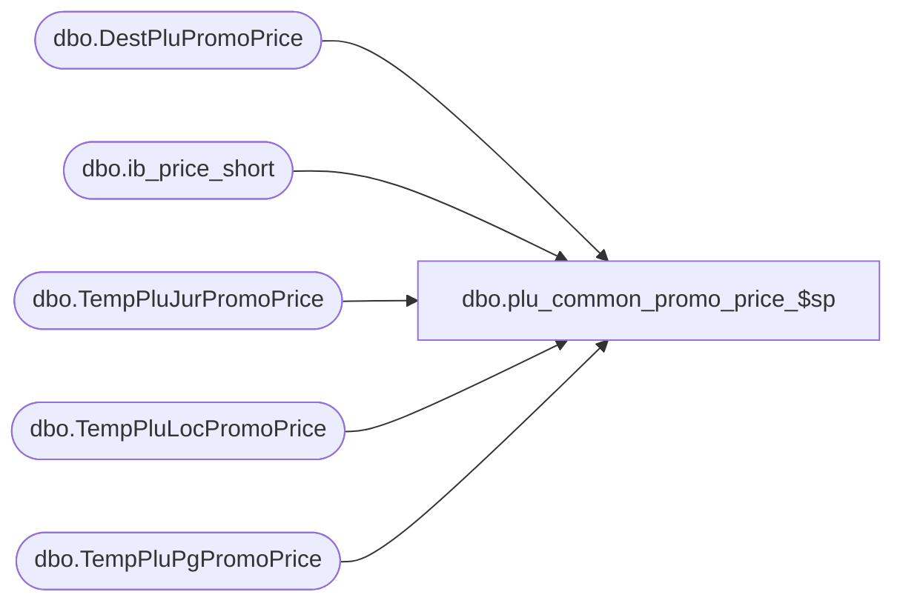

# dbo.plu_common_promo_price_$sp

**Database:** me_01  
**Server:** bedrockdb02  

## Architecture Diagram



## Table Dependencies

| Referenced Table |
|---|
| dbo.DestPluPromoPrice |
| dbo.ib_price_short |
| dbo.TempPluJurPromoPrice |
| dbo.TempPluLocPromoPrice |
| dbo.TempPluPgPromoPrice |

## Stored Procedure Code

```sql
CREATE PROCEDURE [dbo].[plu_common_promo_price_$sp]
AS
			
DECLARE @line_id INT
		, @table_name NVARCHAR(30), @operation_name NVARCHAR(50)
		, @sql_err_num DECIMAL(38,0), @error_msg NVARCHAR(2000)
		, @error_severity SMALLINT, @error_state SMALLINT
		, @batch_size AS INT


SET @batch_size = 20

		
/*
	Version		: 1.00
	Created		: Feb 2011
	Created by	: Sameer Patel
	Description	: Procedure called by Segment 1038 -- EDM & PROD to Price Look-Up File Generate (CRS)
				  Retrieve promo prices for style colors in #style table
				  
	Call from C++ code:
		-- File: PLUFileDefCommonSQLServer.cpp
		-- Class: CPLUFileDefCommonSQLServer
		-- Function: LoadFullRegenFileDefs
					 LoadHGRegenFileDefs
					 LoadStyleResendFileDefs
					 LoadStyleUpdateFileDefs
					 LoadUPCFileDefs
		
	-- NOTE: The temp table #style, #location, #jurisdiction, #pricing_group and #plu_promo_price exist
	
	IF NOT object_id('tempdb..#plu_promo_price') IS NULL
	DROP TABLE #plu_promo_price

	CREATE TABLE #plu_promo_price
		( location_id SMALLINT, style_id DECIMAL(12), style_color_id DECIMAL(13)
		, start_date VARCHAR(8), end_date VARCHAR(8)
		, sale_price VARCHAR(10)
		, PRIMARY KEY (location_id, style_id, style_color_id, start_date, end_date) )
	
	IF NOT object_id('tempdb..#style') IS NULL
	DROP TABLE #style

	CREATE TABLE #style
		( style_id DECIMAL(12), style_color_id DECIMAL(13), color_id SMALLINT
		, dept_id INT, dept_class_id INT
		, style_type TINYINT
		, plu_key VARCHAR(20)
		, description VARCHAR(24)
		, retail_price DECIMAL(14,2)
		, PRIMARY KEY (style_id, style_color_id, color_id, dept_class_id) )		

	IF NOT object_id('tempdb..#location') IS NULL
	DROP TABLE #location

	CREATE TABLE #location
		( id SMALLINT IDENTITY(1,1)
		, location_id SMALLINT, jurisdiction_id SMALLINT, pricing_group_id SMALLINT
		, language_id INT, register_type_id TINYINT
		, PRIMARY KEY (location_id, jurisdiction_id, pricing_group_id) )
	
	IF NOT object_id('tempdb..#pricing_group') IS NULL
	DROP TABLE #pricing_group

	CREATE TABLE #pricing_group
		( id SMALLINT IDENTITY(1,1)
		, pricing_group_id SMALLINT, jurisdiction_id SMALLINT
		, PRIMARY KEY (pricing_group_id) )
	
	IF NOT object_id('tempdb..#jurisdiction') IS NULL
	DROP TABLE #jurisdiction

	CREATE TABLE #jurisdiction
		( id SMALLINT IDENTITY(1,1)
		, jurisdiction_id SMALLINT
		, PRIMARY KEY (jurisdiction_id) )
	
HISTORY:
Date       		Name         	Def#		Desc
Feb 04,11		Sameer Patel	N/A			Initial Release
*/

DECLARE @min_jur_id SMALLINT, @max_jur_id SMALLINT
DECLARE @min_pg_id SMALLINT, @max_pg_id SMALLINT
DECLARE @min_loc_id SMALLINT, @max_loc_id SMALLINT

DECLARE @c_default_date SMALLDATETIME
SET @c_default_date = '1900-1-1'

DECLARE @current_date AS DATETIME
SET @current_date = CAST(FLOOR(CAST(GETDATE() AS FLOAT)) AS DATETIME)

BEGIN TRY

	SET NOCOUNT ON
	
	-- Get minimum and maximum ids from #jurisdiction table

	SET @line_id = 10
	
	SELECT 
		@min_jur_id = COALESCE(MIN(id), 0)
		, @max_jur_id = COALESCE(MAX(id), 0)
	FROM
		#jurisdiction
		
	-- Get minimum and maximum ids from #pricing_group table

	SET @line_id = 20
	
	SELECT 
		@min_pg_id = COALESCE(MIN(id), 0)
		, @max_pg_id = COALESCE(MAX(id), 0)
	FROM
		#pricing_group

	-- Get minimum and maximum ids from #location table
	
	SET @line_id = 30
	
	SELECT 
		@min_loc_id = COALESCE(MIN(id), 0)
		, @max_loc_id = COALESCE(MAX(id), 0)
	FROM
		#location		
		
	-- Return if there are no locations to regenerate		
	
	IF @max_loc_id = 0
		RETURN
		
	-- TODO: Explain
		
	-- Create a temp table to hold jurisdiction level prices
	
	SET @line_id = 40
	
	IF NOT object_id('tempdb..#plu_jur_promo_price') IS NULL
	DROP TABLE #plu_jur_promo_price
	
	CREATE TABLE #plu_jur_promo_price
		( document_number NVARCHAR(20)
		, jurisdiction_id SMALLINT
		, style_id DECIMAL(12), style_color_id DECIMAL(13), color_id SMALLINT
		, ib_price_id DECIMAL(12)
		, sale_price DECIMAL(14,2), start_date SMALLDATETIME, end_date SMALLDATETIME
		, price_change_type SMALLINT
		, PRIMARY KEY (document_number, jurisdiction_id, style_id, style_color_id, color_id) )
		
	-- Create a temp table to hold pricing group level prices		

	SET @line_id = 50
	
	IF NOT object_id('tempdb..#plu_pg_promo_price') IS NULL
	DROP TABLE #plu_pg_promo_price
	
	CREATE TABLE #plu_pg_promo_price
		( document_number NVARCHAR(20)
		, pricing_group_id SMALLINT, jurisdiction_id SMALLINT
		, style_id DECIMAL(12), style_color_id DECIMAL(13), color_id SMALLINT
		, ib_price_id DECIMAL(12)
		, sale_price DECIMAL(14,2), start_date SMALLDATETIME, end_date SMALLDATETIME
		, price_change_type SMALLINT
		, PRIMARY KEY (document_number, pricing_group_id, jurisdiction_id, style_id, style_color_id, color_id) )
		
	-- Create a temp table to hold location level prices

	SET @line_id = 60
	
	IF NOT object_id('tempdb..#plu_loc_promo_price') IS NULL
	DROP TABLE #plu_loc_promo_price
	
	CREATE TABLE #plu_loc_promo_price
		( document_number NVARCHAR(20)
		, location_id SMALLINT, jurisdiction_id SMALLINT
		, style_id DECIMAL(12), style_color_id DECIMAL(13), color_id SMALLINT
		, ib_price_id DECIMAL(12)
		, sale_price DECIMAL(14,2), start_date SMALLDATETIME, end_date SMALLDATETIME
		, price_change_type SMALLINT
		, PRIMARY KEY (document_number, location_id, jurisdiction_id, style_id, style_color_id, color_id) )
	
	-- For each jurisdiction
	-- Get style/jurisdiction level current and future price
	
	WHILE (@min_jur_id <= @max_jur_id)
	BEGIN
	
		-- Insert an entry each style/color/jurisidiction/document number
		-- determining the maximum ib_price in ib_price_short 
		-- where the end_date is gretaer than or equal to the current date

		SET @line_id = 70
		
		INSERT INTO #plu_jur_promo_price
			( document_number
			, jurisdiction_id
			, style_id, style_color_id, color_id
			, ib_price_id )
		SELECT
			N'XXXXX' document_number
			, TempJurisdiction.jurisdiction_id
			, TempStyle.style_id, TempStyle.style_color_id, TempStyle.color_id
			, MAX(IbPriceShort.ib_price_id) ib_price_id
		FROM
			#style TempStyle
		INNER JOIN #jurisdiction TempJurisdiction ON TempJurisdiction.id BETWEEN @min_jur_id AND @min_jur_id + @batch_size
		INNER JOIN ib_price_short IbPriceShort ON TempStyle.style_id = IbPriceShort.style_id AND TempJurisdiction.jurisdiction_id = IbPriceShort.jurisdiction_id
													AND (IbPriceShort.color_id IS NULL OR TempStyle.color_id = IbPriceShort.color_id)
													AND (IbPriceShort.pricing_group_id IS NULL AND IbPriceShort.location_id IS NULL)
		WHERE
			IbPriceShort.cancel_promo_flag = 0 AND IbPriceShort.temp_price_flag = 1
			AND IbPriceShort.end_date > IbPriceShort.start_date AND IbPriceShort.end_date >= @current_date
		GROUP BY
			TempJurisdiction.jurisdiction_id
			, TempStyle.style_id, TempStyle.style_color_id, TempStyle.color_id
																										
		-- Update #plu_jur_promo_price with selling_retail_price, start_date, end_date and price_change_type from ib_price_short
		-- based on ib_price_id column

		SET @line_id = 80
			  	
		UPDATE TempPluJurPromoPrice
		SET
			TempPluJurPromoPrice.sale_price = IbPriceShort.selling_retail_price
			, TempPluJurPromoPrice.start_date = IbPriceShort.start_date, TempPluJurPromoPrice.end_date = IbPriceShort.end_date
			, TempPluJurPromoPrice.price_change_type = IbPriceShort.price_change_type
		FROM
			#plu_jur_promo_price TempPluJurPromoPrice
		INNER JOIN ib_price_short IbPriceShort ON TempPluJurPromoPrice.ib_price_id = IbPriceShort.ib_price_id
		
		SET @min_jur_id = @min_jur_id + @batch_size + 1
		
	END
	
	-- For each pricing group
	-- Get style/pricing group level current and future price
	
	WHILE (@min_pg_id <= @max_pg_id)
	BEGIN
	
		-- Insert an entry each style/color/jurisidiction/pricing group/document number
		-- determining the maximum ib_price in ib_price_short 
		-- where the end_date is gretaer than or equal to the current date

		SET @line_id = 90
		
		INSERT INTO #plu_pg_promo_price
			( document_number
			, pricing_group_id, jurisdiction_id
			, style_id, style_color_id, color_id
			, ib_price_id )
		SELECT
			N'XXXXX' document_number
			, TempPricingGroup.pricing_group_id, TempPricingGroup.jurisdiction_id
			, TempStyle.style_id, TempStyle.style_color_id, TempStyle.color_id
			, MAX(IbPriceShort.ib_price_id) ib_price_id
		FROM
			#style TempStyle
		INNER JOIN #pricing_group TempPricingGroup ON TempPricingGroup.id BETWEEN @min_pg_id AND @min_pg_id + @batch_size
		INNER JOIN ib_price_short IbPriceShort ON TempStyle.style_id = IbPriceShort.style_id AND TempPricingGroup.jurisdiction_id = IbPriceShort.jurisdiction_id
													AND (IbPriceShort.color_id IS NULL OR TempStyle.color_id = IbPriceShort.color_id)
													AND (TempPricingGroup.pricing_group_id = IbPriceShort.pricing_group_id)
		WHERE
			IbPriceShort.cancel_promo_flag = 0 AND IbPriceShort.temp_price_flag = 1
			AND IbPriceShort.end_date > IbPriceShort.start_date AND IbPriceShort.end_date >= @current_date
		GROUP BY
			TempPricingGroup.pricing_group_id, TempPricingGroup.jurisdiction_id
			, TempStyle.style_id, TempStyle.style_color_id, TempStyle.color_id
																										
		-- Update #plu_pg_promo_price with selling_retail_price, start_date, end_date and price_change_type from ib_price_short
		-- based on ib_price_id column

		SET @line_id = 100
			  	
		UPDATE TempPluPgPromoPrice
		SET
			TempPluPgPromoPrice.sale_price = IbPriceShort.selling_retail_price
			, TempPluPgPromoPrice.start_date = IbPriceShort.start_date, TempPluPgPromoPrice.end_date = IbPriceShort.end_date
			, TempPluPgPromoPrice.price_change_type = IbPriceShort.price_change_type
		FROM
			#plu_pg_promo_price TempPluPgPromoPrice
		INNER JOIN ib_price_short IbPriceShort ON TempPluPgPromoPrice.ib_price_id = IbPriceShort.ib_price_id
		
		SET @min_pg_id = @min_pg_id + @batch_size + 1
		
	END
	
	-- For each location
	-- Get style/location level current and future price
	
	WHILE (@min_loc_id <= @max_loc_id)
	BEGIN
	
		-- Insert an entry each style/color/jurisidiction/location/document number
		-- determining the maximum ib_price in ib_price_short 
		-- where the end_date is gretaer than or equal to the current date

		SET @line_id = 110
		
		INSERT INTO #plu_loc_promo_price
			( document_number
			, location_id, jurisdiction_id
			, style_id, style_color_id, color_id
			, ib_price_id )
		SELECT
			N'XXXXX' document_number
			, TempLocation.location_id, TempLocation.jurisdiction_id
			, TempStyle.style_id, TempStyle.style_color_id, TempStyle.color_id
			, MAX(IbPriceShort.ib_price_id) ib_price_id
		FROM
			#style TempStyle
		INNER JOIN #location TempLocation ON TempLocation.id BETWEEN @min_loc_id AND @min_loc_id + @batch_size
		INNER JOIN ib_price_short IbPriceShort ON TempStyle.style_id = IbPriceShort.style_id AND TempLocation.jurisdiction_id = IbPriceShort.jurisdiction_id
													AND (IbPriceShort.color_id IS NULL OR TempStyle.color_id = IbPriceShort.color_id)
													AND (TempLocation.location_id = IbPriceShort.location_id)
		WHERE
			IbPriceShort.cancel_promo_flag = 0 AND IbPriceShort.temp_price_flag = 1
			AND IbPriceShort.end_date > IbPriceShort.start_date AND IbPriceShort.end_date >= @current_date
		GROUP BY
			TempLocation.location_id, TempLocation.jurisdiction_id
			, TempStyle.style_id, TempStyle.style_color_id, TempStyle.color_id
																										
		-- Update #plu_loc_promo_price with selling_retail_price, start_date, end_date and price_change_type from ib_price_short
		-- based on ib_price_id column

		SET @line_id = 120
			  	
		UPDATE TempPluLocPromoPrice
		SET
			TempPluLocPromoPrice.sale_price = IbPriceShort.selling_retail_price
			, TempPluLocPromoPrice.start_date = IbPriceShort.start_date, TempPluLocPromoPrice.end_date = IbPriceShort.end_date
			, TempPluLocPromoPrice.price_change_type = IbPriceShort.price_change_type
		FROM
			#plu_loc_promo_price TempPluLocPromoPrice
		INNER JOIN ib_price_short IbPriceShort ON TempPluLocPromoPrice.ib_price_id = IbPriceShort.ib_price_id
		
		-- Now we finally get to insert into #plu_promo_price
		-- We're going to have to do this in two steps because none of the three tables we built are guaranteed to have an entry
		-- for a particular document_number, location_id, style_id, style_color_id
		
		SET @line_id = 130
	
		INSERT INTO #plu_promo_price
			( document_number
			, location_id, style_id, style_color_id )
		SELECT
			DISTINCT
				SourcePluPromoPrice.document_number
				, SourcePluPromoPrice.location_id, SourcePluPromoPrice.style_id, SourcePluPromoPrice.style_color_id
		FROM
			( SELECT
				TempPluJurPromoPrice.document_number
				, TempLocation.location_id, TempPluJurPromoPrice.style_id, TempPluJurPromoPrice.style_color_id
			  FROM
			  	#plu_jur_promo_price TempPluJurPromoPrice
			  INNER JOIN #location TempLocation ON TempLocation.id BETWEEN @min_loc_id AND @min_loc_id + @batch_size 
			  											AND TempPluJurPromoPrice.jurisdiction_id = TempLocation.jurisdiction_id
			  UNION ALL
			  SELECT
				TempPluPgPromoPrice.document_number
				, TempLocation.location_id, TempPluPgPromoPrice.style_id, TempPluPgPromoPrice.style_color_id
			  FROM
			  	#plu_pg_promo_price TempPluPgPromoPrice
			  INNER JOIN #location TempLocation ON TempLocation.id BETWEEN @min_loc_id AND @min_loc_id + @batch_size
			  											AND TempPluPgPromoPrice.jurisdiction_id = TempLocation.jurisdiction_id
			  											AND TempPluPgPromoPrice.pricing_group_id = TempLocation.pricing_group_id
			  UNION ALL
			  SELECT
				TempLocPromoPrice.document_number
				, TempLocPromoPrice.location_id, TempLocPromoPrice.style_id, TempLocPromoPrice.style_color_id
			  FROM
			  	#plu_loc_promo_price TempLocPromoPrice ) SourcePluPromoPrice
				
		
		-- Now we should have an entry for every document_number, location_id, style_id, style_color_id combination in #plu_promo_price
		-- To insert the location level price, the max_start_date and ib_price_id have to be greater than or equal to those at the pricing group and jurisdiction levels
		-- To insert the pricing group level price, the max_start_date and ib_price_id have to be greater than or equal to those at the location and jurisdiction levels
		-- To insert the jurisdiction level price, the max_start_date and ib_price_id have to be greater than or equal to those at the location and pricing group levels
		
		SET @line_id = 140
		
		UPDATE DestPluPromoPrice
		SET
			DestPluPromoPrice.sale_price = SourcePluPromoPrice.sale_price
			, DestPluPromoPrice.start_date = SourcePluPromoPrice.start_date, DestPluPromoPrice.end_date = SourcePluPromoPrice.end_date
			, DestPluPromoPrice.price_change_type = SourcePluPromoPrice.price_change_type
		FROM
			#plu_promo_price DestPluPromoPrice
		INNER JOIN 
			( SELECT
				TempPluPromoPrice.document_number
				, TempPluPromoPrice.location_id, TempPluPromoPrice.style_id, TempPluPromoPrice.style_color_id
				, CASE
					WHEN COALESCE(TempPluLocPromoPrice.ib_price_id, -1) >= COALESCE(TempPluJurPromoPrice.ib_price_id, -1) AND COALESCE(TempPluLocPromoPrice.ib_price_id, -1) >= COALESCE(TempPluPgPromoPrice.ib_price_id, -1)
						THEN TempPluLocPromoPrice.sale_price
					WHEN COALESCE(TempPluPgPromoPrice.ib_price_id, -1) >= COALESCE(TempPluJurPromoPrice.ib_price_id, -1) AND COALESCE(TempPluPgPromoPrice.ib_price_id, -1) >= COALESCE(TempPluLocPromoPrice.ib_price_id, -1)
						THEN TempPluPgPromoPrice.sale_price
					ELSE
						TempPluJurPromoPrice.sale_price
				  END sale_price
				, CASE
					WHEN COALESCE(TempPluLocPromoPrice.ib_price_id, -1) >= COALESCE(TempPluJurPromoPrice.ib_price_id, -1) AND COALESCE(TempPluLocPromoPrice.ib_price_id, -1) >= COALESCE(TempPluPgPromoPrice.ib_price_id, -1)
						THEN TempPluLocPromoPrice.start_date
					WHEN COALESCE(TempPluPgPromoPrice.ib_price_id, -1) >= COALESCE(TempPluJurPromoPrice.ib_price_id, -1) AND COALESCE(TempPluPgPromoPrice.ib_price_id, -1) >= COALESCE(TempPluLocPromoPrice.ib_price_id, -1)
						THEN TempPluPgPromoPrice.start_date
					ELSE
						TempPluJurPromoPrice.start_date
				  END start_date
				, CASE
					WHEN COALESCE(TempPluLocPromoPrice.ib_price_id, -1) >= COALESCE(TempPluJurPromoPrice.ib_price_id, -1) AND COALESCE(TempPluLocPromoPrice.ib_price_id, -1) >= COALESCE(TempPluPgPromoPrice.ib_price_id, -1)
						THEN TempPluLocPromoPrice.end_date
					WHEN COALESCE(TempPluPgPromoPrice.ib_price_id, -1) >= COALESCE(TempPluJurPromoPrice.ib_price_id, -1) AND COALESCE(TempPluPgPromoPrice.ib_price_id, -1) >= COALESCE(TempPluLocPromoPrice.ib_price_id, -1)
						THEN TempPluPgPromoPrice.end_date
					ELSE
						TempPluJurPromoPrice.end_date
				  END end_date
				, CASE
					WHEN COALESCE(TempPluLocPromoPrice.ib_price_id, -1) >= COALESCE(TempPluJurPromoPrice.ib_price_id, -1) AND COALESCE(TempPluLocPromoPrice.ib_price_id, -1) >= COALESCE(TempPluPgPromoPrice.ib_price_id, -1)
						THEN TempPluLocPromoPrice.price_change_type
					WHEN COALESCE(TempPluPgPromoPrice.ib_price_id, -1) >= COALESCE(TempPluJurPromoPrice.ib_price_id, -1) AND COALESCE(TempPluPgPromoPrice.ib_price_id, -1) >= COALESCE(TempPluLocPromoPrice.ib_price_id, -1)
						THEN TempPluPgPromoPrice.price_change_type
					ELSE
						TempPluJurPromoPrice.price_change_type
				  END price_change_type
			  FROM
			  	#plu_promo_price TempPluPromoPrice
			  INNER JOIN #location TempLocation ON TempLocation.id BETWEEN @min_loc_id AND @min_loc_id + @batch_size
				AND TempPluPromoPrice.location_id = TempLocation.location_id
			  LEFT OUTER JOIN #plu_jur_promo_price TempPluJurPromoPrice ON TempPluPromoPrice.document_number = TempPluJurPromoPrice.document_number
			  												AND TempPluPromoPrice.style_id = TempPluJurPromoPrice.style_id AND TempPluPromoPrice.style_color_id = TempPluJurPromoPrice.style_color_id
			  												AND TempLocation.jurisdiction_id = TempPluJurPromoPrice.jurisdiction_id
			  LEFT OUTER JOIN #plu_pg_promo_price TempPluPgPromoPrice ON TempPluPromoPrice.document_number = TempPluPgPromoPrice.document_number
			  												AND TempPluPromoPrice.style_id = TempPluPgPromoPrice.style_id AND TempPluPromoPrice.style_color_id = TempPluPgPromoPrice.style_color_id
			  												AND TempLocation.jurisdiction_id = TempPluPgPromoPrice.jurisdiction_id AND TempLocation.pricing_group_id = TempPluPgPromoPrice.pricing_group_id
			  												--AND TempLocation.jurisdiction_id = TempPluJurPromoPrice.jurisdiction_id
			  LEFT OUTER JOIN #plu_loc_promo_price TempPluLocPromoPrice ON TempPluPromoPrice.document_number = TempPluLocPromoPrice.document_number
			  												AND TempPluPromoPrice.style_id = TempPluLocPromoPrice.style_id AND TempPluPromoPrice.style_color_id = TempPluLocPromoPrice.style_color_id
			  												AND TempLocation.jurisdiction_id = TempPluLocPromoPrice.jurisdiction_id AND TempLocation.location_id = TempPluLocPromoPrice.location_id ) SourcePluPromoPrice ON DestPluPromoPrice.document_number = SourcePluPromoPrice.document_number
			  																																																						AND DestPluPromoPrice.location_id = SourcePluPromoPrice.location_id		
			  																																																						AND DestPluPromoPrice.style_id = SourcePluPromoPrice.style_id AND DestPluPromoPrice.style_color_id = SourcePluPromoPrice.style_color_id

		TRUNCATE TABLE #plu_loc_promo_price
												
		SET @min_loc_id = @min_loc_id + @batch_size + 1
		
	END

	BEGIN
        EXECUTE (N'CREATE NONCLUSTERED INDEX [IX_tpromo_idx] ON dbo.#plu_promo_price (location_id, style_id, style_color_id, price_change_type) INCLUDE ([start_date],[end_date],[sale_price])')
	END

END TRY

BEGIN CATCH

	SELECT 
		@error_severity	= 16
		, @error_state = 1

	IF @line_id = 10
		SELECT  
			@table_name			= N'#jurisdiction'
			, @operation_name	= N'SELECT'
			, @sql_err_num		= ERROR_NUMBER()
			, @error_msg		= N'Line Id = ' + CAST(@line_id AS NVARCHAR(4)) + N' '
									+ N' Table Name = ' + @table_name + N' '
									+ N' Operation Name = ' + @operation_name + N' '
									+ N' SQL Error Number = ' + CAST(@sql_err_num AS NVARCHAR(38)) + N' '
									+ N' Error Message = ' + ERROR_MESSAGE()

	ELSE IF @line_id = 20
		SELECT  
			@table_name			= N'#pricing_group'
			, @operation_name	= N'SELECT'
			, @sql_err_num		= ERROR_NUMBER()
			, @error_msg		= N'Line Id = ' + CAST(@line_id AS NVARCHAR(4)) + N' '
									+ N' Table Name = ' + @table_name + N' '
									+ N' Operation Name = ' + @operation_name + N' '
									+ N' SQL Error Number = ' + CAST(@sql_err_num AS NVARCHAR(38)) + N' '
									+ N' Error Message = ' + ERROR_MESSAGE()

	ELSE IF @line_id = 30
		SELECT  
			@table_name			= N'#location'
			, @operation_name	= N'SELECT'
			, @sql_err_num		= ERROR_NUMBER()
			, @error_msg		= N'Line Id = ' + CAST(@line_id AS NVARCHAR(4)) + N' '
									+ N' Table Name = ' + @table_name + N' '
									+ N' Operation Name = ' + @operation_name + N' '
									+ N' SQL Error Number = ' + CAST(@sql_err_num AS NVARCHAR(38)) + N' '
									+ N' Error Message = ' + ERROR_MESSAGE()

	ELSE IF @line_id = 40
		SELECT  
			@table_name			= N'#plu_jur_promo_price'
			, @operation_name	= N'CREATE TABLE'
			, @sql_err_num		= ERROR_NUMBER()
			, @error_msg		= N'Line Id = ' + CAST(@line_id AS NVARCHAR(4)) + N' '
									+ N' Table Name = ' + @table_name + N' '
									+ N' Operation Name = ' + @operation_name + N' '
									+ N' SQL Error Number = ' + CAST(@sql_err_num AS NVARCHAR(38)) + N' '
									+ N' Error Message = ' + ERROR_MESSAGE()

	ELSE IF @line_id = 50
		SELECT  
			@table_name			= N'#plu_pg_promo_price'
			, @operation_name	= N'CREATE TABLE'
			, @sql_err_num		= ERROR_NUMBER()
			, @error_msg		= N'Line Id = ' + CAST(@line_id AS NVARCHAR(4)) + N' '
									+ N' Table Name = ' + @table_name + N' '
									+ N' Operation Name = ' + @operation_name + N' '
									+ N' SQL Error Number = ' + CAST(@sql_err_num AS NVARCHAR(38)) + N' '
									+ N' Error Message = ' + ERROR_MESSAGE()

	ELSE IF @line_id = 60
		SELECT  
			@table_name			= N'#plu_loc_promo_price'
			, @operation_name	= N'CREATE TABLE'
			, @sql_err_num		= ERROR_NUMBER()
			, @error_msg		= N'Line Id = ' + CAST(@line_id AS NVARCHAR(4)) + N' '
									+ N' Table Name = ' + @table_name + N' '
									+ N' Operation Name = ' + @operation_name + N' '
									+ N' SQL Error Number = ' + CAST(@sql_err_num AS NVARCHAR(38)) + N' '
									+ N' Error Message = ' + ERROR_MESSAGE()

	ELSE IF @line_id = 70
		SELECT  
			@table_name			= N'#plu_jur_promo_price'
			, @operation_name	= N'UPDATE - ib_price_id'
			, @sql_err_num		= ERROR_NUMBER()
			, @error_msg		= N'Line Id = ' + CAST(@line_id AS NVARCHAR(4)) + N' '
									+ N' Table Name = ' + @table_name + N' '
									+ N' Operation Name = ' + @operation_name + N' '
									+ N' SQL Error Number = ' + CAST(@sql_err_num AS NVARCHAR(38)) + N' '
									+ N' Error Message = ' + ERROR_MESSAGE()

	ELSE IF @line_id = 80
		SELECT  
			@table_name			= N'#plu_jur_promo_price'
			, @operation_name	= N'UPDATE - sale_price'
			, @sql_err_num		= ERROR_NUMBER()
			, @error_msg		= N'Line Id = ' + CAST(@line_id AS NVARCHAR(4)) + N' '
									+ N' Table Name = ' + @table_name + N' '
									+ N' Operation Name = ' + @operation_name + N' '
									+ N' SQL Error Number = ' + CAST(@sql_err_num AS NVARCHAR(38)) + N' '
									+ N' Error Message = ' + ERROR_MESSAGE()

	ELSE IF @line_id = 90
		SELECT  
			@table_name			= N'#plu_pg_promo_price'
			, @operation_name	= N'UPDATE - ib_price_id'
			, @sql_err_num		= ERROR_NUMBER()
			, @error_msg		= N'Line Id = ' + CAST(@line_id AS NVARCHAR(4)) + N' '
									+ N' Table Name = ' + @table_name + N' '
									+ N' Operation Name = ' + @operation_name + N' '
									+ N' SQL Error Number = ' + CAST(@sql_err_num AS NVARCHAR(38)) + N' '
									+ N' Error Message = ' + ERROR_MESSAGE()

	ELSE IF @line_id = 100
		SELECT  
			@table_name			= N'#plu_pg_promo_price'
			, @operation_name	= N'UPDATE - sale_price'
			, @sql_err_num		= ERROR_NUMBER()
			, @error_msg		= N'Line Id = ' + CAST(@line_id AS NVARCHAR(4)) + N' '
									+ N' Table Name = ' + @table_name + N' '
									+ N' Operation Name = ' + @operation_name + N' '
									+ N' SQL Error Number = ' + CAST(@sql_err_num AS NVARCHAR(38)) + N' '
									+ N' Error Message = ' + ERROR_MESSAGE()

	ELSE IF @line_id = 110
		SELECT  
			@table_name			= N'#plu_loc_promo_price'
			, @operation_name	= N'UPDATE - ib_price_id'
			, @sql_err_num		= ERROR_NUMBER()
			, @error_msg		= N'Line Id = ' + CAST(@line_id AS NVARCHAR(4)) + N' '
									+ N' Table Name = ' + @table_name + N' '
									+ N' Operation Name = ' + @operation_name + N' '
									+ N' SQL Error Number = ' + CAST(@sql_err_num AS NVARCHAR(38)) + N' '
									+ N' Error Message = ' + ERROR_MESSAGE()

	ELSE IF @line_id = 120
		SELECT  
			@table_name			= N'#plu_loc_promo_price'
			, @operation_name	= N'UPDATE - sale_price'
			, @sql_err_num		= ERROR_NUMBER()
			, @error_msg		= N'Line Id = ' + CAST(@line_id AS NVARCHAR(4)) + N' '
									+ N' Table Name = ' + @table_name + N' '
									+ N' Operation Name = ' + @operation_name + N' '
									+ N' SQL Error Number = ' + CAST(@sql_err_num AS NVARCHAR(38)) + N' '
									+ N' Error Message = ' + ERROR_MESSAGE()

	ELSE IF @line_id = 130
		SELECT  
			@table_name			= N'#plu_promo_price'
			, @operation_name	= N'INSERT'
			, @sql_err_num		= ERROR_NUMBER()
			, @error_msg		= N'Line Id = ' + CAST(@line_id AS NVARCHAR(4)) + N' '
									+ N' Table Name = ' + @table_name + N' '
									+ N' Operation Name = ' + @operation_name + N' '
									+ N' SQL Error Number = ' + CAST(@sql_err_num AS NVARCHAR(38)) + N' '
									+ N' Error Message = ' + ERROR_MESSAGE()

	ELSE IF @line_id = 140
		SELECT  
			@table_name			= N'#plu_promo_price'
			, @operation_name	= N'UPDATE'
			, @sql_err_num		= ERROR_NUMBER()
			, @error_msg		= N'Line Id = ' + CAST(@line_id AS NVARCHAR(4)) + N' '
									+ N' Table Name = ' + @table_name + N' '
									+ N' Operation Name = ' + @operation_name + N' '
									+ N' SQL Error Number = ' + CAST(@sql_err_num AS NVARCHAR(38)) + N' '
									+ N' Error Message = ' + ERROR_MESSAGE()
			
	RAISERROR (@error_msg, @error_severity, @error_state)			

END CATCH
```

