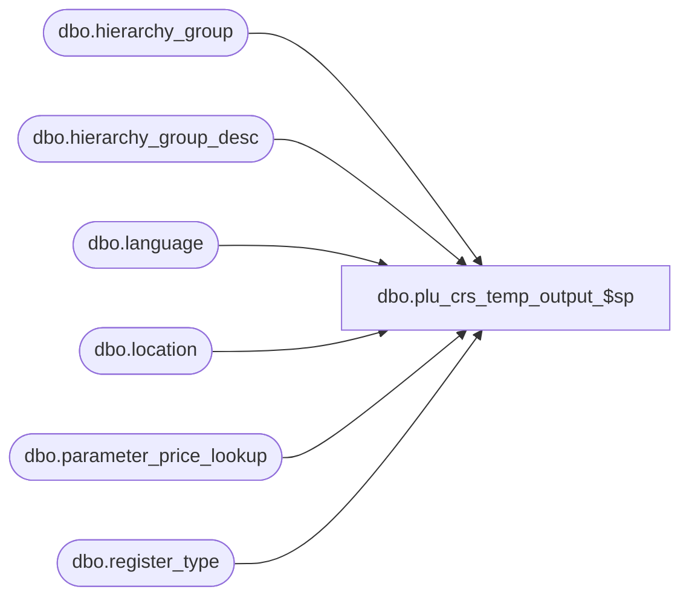

# dbo.plu_crs_temp_output_$sp

**Database:** me_01  
**Server:** bedrockdb02  

## Architecture Diagram



## Table Dependencies

| Referenced Table |
|---|
| dbo.hierarchy_group |
| dbo.hierarchy_group_desc |
| dbo.language |
| dbo.location |
| dbo.parameter_price_lookup |
| dbo.register_type |

## Stored Procedure Code

```sql
CREATE PROCEDURE [dbo].[plu_crs_temp_output_$sp]
(@send_dept BIT, @send_style BIT, @send_item BIT)
AS

DECLARE @line_id INT
		, @table_name NVARCHAR(30), @operation_name NVARCHAR(50)
		, @sql_err_num DECIMAL(38,0), @error_msg NVARCHAR(2000)
		, @error_severity SMALLINT, @error_state SMALLINT
		, @batch_size AS INT


SET @batch_size = 20


DECLARE
	@c_CRS_add_action NVARCHAR(1)
	, @c_CRS_delete_action NVARCHAR(1), @c_CRS_change_action NVARCHAR(1)
	, @c_CRS_sale_action NVARCHAR(1), @c_CRS_chg_field_action NVARCHAR(1)

SET @c_CRS_add_action = N'1'
SET @c_CRS_delete_action = N'2'
SET @c_CRS_change_action = N'3'
SET @c_CRS_sale_action = N'4'
SET @c_CRS_chg_field_action = N'5'

DECLARE
	@c_CRS_order_dept INT, @c_CRS_order_dept_class INT
	, @c_CRS_order_style INT, @c_CRS_order_style_promo INT, @c_CRS_order_style_modify INT
	, @c_CRS_order_item INT, @c_CRS_order_item_promo INT, @c_CRS_order_item_modify INT
	, @c_CRS_order_alt INT

SET @c_CRS_order_dept = 10
SET @c_CRS_order_dept_class = 20
SET @c_CRS_order_style = 30
SET @c_CRS_order_style_modify = 40
SET @c_CRS_order_style_promo = 50
SET @c_CRS_order_item = 60
SET @c_CRS_order_item_modify = 70
SET @c_CRS_order_item_promo = 80
SET @c_CRS_order_alt = 90

DECLARE
	@c_CRS_dept_record NVARCHAR(2)
	, @c_CRS_dept_class_record NVARCHAR(2)
	, @c_CRS_dept_tax_flag NVARCHAR(2)

SET @c_CRS_dept_record = N'03'
SET @c_CRS_dept_class_record = N'04'
SET @c_CRS_dept_tax_flag = REPLICATE(N' ', 2)

DECLARE
	@c_CRS_style_record NVARCHAR(2)
	, @c_CRS_item_record NVARCHAR(2)
	, @c_CRS_alt_record NVARCHAR(2)

SET @c_CRS_style_record = N'08'
SET @c_CRS_item_record = N'01'
SET @c_CRS_alt_record = N'02'

DECLARE
	@c_CRS_retail_price NVARCHAR(10), @c_CRS_original_price NVARCHAR(10), @c_CRS_compare_retail_price NVARCHAR(10), @c_CRS_package_price NVARCHAR(10)
	, @c_CRS_sale_price NVARCHAR(10)
	, @c_CRS_dt_sale_begins NVARCHAR(8), @c_CRS_dt_sale_ends NVARCHAR(8)
	, @c_CRS_tm_sale_begins NVARCHAR(8), @c_CRS_tm_sale_ends NVARCHAR(8)
	, @c_CRS_incentive_ind NVARCHAR(1), @c_CRS_style_tax_code NVARCHAR(2)
	, @c_CRS_not_in_use_3 NVARCHAR(3), @c_CRS_not_in_use_29 NVARCHAR(29)
	, @c_CRS_sugg_text_ind NVARCHAR(1)

SET @c_CRS_retail_price = REPLICATE(N'0', 10)
SET @c_CRS_original_price = REPLICATE(N'0', 10)
SET @c_CRS_compare_retail_price = REPLICATE(N'0', 10)
SET @c_CRS_package_price = REPLICATE(N'0', 10)
SET @c_CRS_sale_price = REPLICATE(N'0', 10)
SET @c_CRS_dt_sale_begins = REPLICATE(N' ', 8)
SET @c_CRS_dt_sale_ends = REPLICATE(N' ', 8)
SET @c_CRS_tm_sale_begins = REPLICATE(N' ', 8)
SET @c_CRS_tm_sale_ends = REPLICATE(N' ', 8)
SET @c_CRS_incentive_ind = N'0'
SET @c_CRS_style_tax_code = REPLICATE(N' ', 2)
SET @c_CRS_not_in_use_3 = REPLICATE(N'0', 3)
SET @c_CRS_not_in_use_29 = REPLICATE(N' ', 29)
SET @c_CRS_sugg_text_ind = N'0'

DECLARE
	@c_CRS_item_type NVARCHAR(5), @c_CRS_item_cost NVARCHAR(10)
	, @c_CRS_activate_date NVARCHAR(8), @c_CRS_deactivate_date NVARCHAR(8)
	, @c_CRS_taxable_ind NVARCHAR(1)
	, @c_CRS_comparative_price NVARCHAR(10), @c_CRS_lwst_price_lxdays NVARCHAR(10)
	, @c_CRS_emp_disc_code NVARCHAR(2), @c_CRS_max_disc_prcnt NVARCHAR(5)
	, @c_CRS_sales_tax_ovrd NVARCHAR(1), @c_CRS_suggested_sell_ind NVARCHAR(1), @c_CRS_fee_ind NVARCHAR(1)
	, @c_CRS_not_in_use_24 NVARCHAR(24), @c_CRS_not_in_use_5 NVARCHAR(5)
	, @c_CRS_raincheck_avail NVARCHAR(1)
	, @c_CRS_not_disc_by_item NVARCHAR(1), @c_CRS_not_disc_by_tran NVARCHAR(1)
	, @c_CRS_avail_spec_order NVARCHAR(1), @c_CRS_avail_send_sale NVARCHAR(1), @c_CRS_add_input_ind NVARCHAR(1)
	, @c_CRS_not_in_use_10 NVARCHAR(10)
	, @c_CRS_min_qty_ind NVARCHAR(1), @c_CRS_minimum_qty NVARCHAR(10)
	, @c_CRS_max_qty_ind NVARCHAR(1), @c_CRS_maximum_qty NVARCHAR(10)
	, @c_CRS_item_lock_qty NVARCHAR(10), @c_CRS_qty_on_hand NVARCHAR(10), @c_CRS_qty_on_order NVARCHAR(10)
	, @c_CRS_wardrobe_ind NVARCHAR(1), @c_CRS_form_type NVARCHAR(2)
	, @c_CRS_not_in_use_8 NVARCHAR(8)
	, @c_CRS_ship_fee_amount NVARCHAR(10), @c_CRS_pickup NVARCHAR(1)
	, @c_CRS_avail_in_package NVARCHAR(1), @c_CRS_send_carrier_code NVARCHAR(8)
	, @c_CRS_not_in_use_4 NVARCHAR(4)
	, @c_CRS_ship_from_dc_only NVARCHAR(1), @c_CRS_weight_of_item NVARCHAR(10)


SET @c_CRS_item_type = REPLICATE(N'0', 5)
SET @c_CRS_item_cost = REPLICATE(N'0', 10)
SET @c_CRS_activate_date = REPLICATE(N' ', 8)
SET @c_CRS_deactivate_date = REPLICATE(N' ', 8)
SET @c_CRS_taxable_ind = N'1'
SET @c_CRS_comparative_price = REPLICATE(N'0', 10)
SET @c_CRS_lwst_price_lxdays = REPLICATE(N'0', 10)
SET @c_CRS_emp_disc_code = REPLICATE(N' ', 2)
SET @c_CRS_max_disc_prcnt = REPLICATE(N'0', 5)
SET @c_CRS_sales_tax_ovrd = N'1'
SET @c_CRS_suggested_sell_ind = N'0'
SET @c_CRS_fee_ind = N'0'
SET @c_CRS_not_in_use_24 = REPLICATE(N' ', 24)
SET @c_CRS_not_in_use_5 = REPLICATE(N' ', 5)
SET @c_CRS_raincheck_avail = N'0'
SET @c_CRS_not_disc_by_item = N'0'
SET @c_CRS_not_disc_by_tran = N'0'
SET @c_CRS_avail_spec_order = N'0'
SET @c_CRS_avail_send_sale = N'1'
SET @c_CRS_add_input_ind = N'0'
SET @c_CRS_not_in_use_10 = REPLICATE(N' ', 10)
SET @c_CRS_min_qty_ind = N'0'
SET @c_CRS_minimum_qty = REPLICATE(N'0', 10)
SET @c_CRS_max_qty_ind = N'0'
SET @c_CRS_maximum_qty = REPLICATE(N'0', 10)
SET @c_CRS_item_lock_qty = REPLICATE(N'0', 10)
SET @c_CRS_qty_on_hand = REPLICATE(N'0', 10)
SET @c_CRS_qty_on_order = REPLICATE(N'0', 10)
SET @c_CRS_wardrobe_ind = N'0'
SET @c_CRS_form_type = REPLICATE(N'0', 2)
SET @c_CRS_not_in_use_8 = REPLICATE(N'0', 8)
SET @c_CRS_ship_fee_amount = REPLICATE(N'0', 10)
SET @c_CRS_pickup = N'0'
SET @c_CRS_avail_in_package = N'0'
SET @c_CRS_send_carrier_code = REPLICATE(N'0', 8)
SET @c_CRS_not_in_use_4 = REPLICATE(N' ', 4)
SET @c_CRS_ship_from_dc_only = N'0'
SET @c_CRS_weight_of_item = REPLICATE(N'0', 10)

DECLARE
	@c_CRS_number_type NVARCHAR(8)
	, @c_CRS_additional_data_1 NVARCHAR(30), @c_CRS_additional_data_2 NVARCHAR(30), @c_CRS_additional_data_3 NVARCHAR(30), @c_CRS_additional_data_4 NVARCHAR(30)
	, @c_CRS_not_in_use_20 NVARCHAR(20)

SET @c_CRS_number_type = CONVERT(NCHAR(8), RIGHT(N'1', 8) + REPLICATE(N' ', 8 - LEN(LEFT(N' ', 8))))
SET @c_CRS_additional_data_1 = CONVERT(NCHAR(30), LEFT(N' ', 30) + REPLICATE(N' ', 30 - LEN(LEFT(N' ', 30))))
SET @c_CRS_additional_data_2 = CONVERT(NCHAR(30), LEFT(N' ', 30) + REPLICATE(N' ', 30 - LEN(LEFT(N' ', 30))))
SET @c_CRS_additional_data_3 = CONVERT(NCHAR(30), LEFT(N' ', 30) + REPLICATE(N' ', 30 - LEN(LEFT(N' ', 30))))
SET @c_CRS_additional_data_4 = CONVERT(NCHAR(30), LEFT(N' ', 30) + REPLICATE(N' ', 30 - LEN(LEFT(N' ', 30))))
SET @c_CRS_not_in_use_20 = CONVERT(NCHAR(20), LEFT(N' ', 20) + REPLICATE(N' ', 20 - LEN(LEFT(N' ', 20))))

DECLARE @min_loc_id SMALLINT, @max_loc_id SMALLINT, @count INT

DECLARE @current_date AS DATETIME
SET @current_date = CAST(FLOOR(CAST(GETDATE() AS FLOAT)) AS DATETIME)

BEGIN TRY

	SET NOCOUNT ON

	-- Get minimum and maximum ids from #location table

	SET @line_id = 10

	SELECT
		@min_loc_id = COALESCE(MIN(id), 0)
		, @max_loc_id = COALESCE(MAX(id), 0)
	FROM
		#location

	-- Return if there are no locations to generate

	IF @max_loc_id = 0
		RETURN

	-- For each location
	-- Populate ##plu_temp_output table

	WHILE (@min_loc_id <= @max_loc_id)
	BEGIN

		IF OBJECT_ID (N'tempdb.dbo.#temp_crs_values', N'U') IS NOT NULL
		BEGIN

			DROP TABLE dbo.#temp_crs_values

		END


		SELECT
			 TempLocation.id AS location_id
			,(CASE
				WHEN RT.register_code = N'CRS' THEN REPLICATE(N' ', 2) -- original CRS version supported
				ELSE REPLICATE(N' ', 25) -- CRS version 3.2.5
				END) AS CRS_luxury_tax_code
			,(CASE
				WHEN RT.register_code = N'CRS' THEN REPLICATE(N' ', 2) -- original CRS version supported
				ELSE REPLICATE(N' ', 25) -- CRS version 3.2.5
				END) AS CRS_tax_rate_code
			,(CASE
				WHEN RT.register_code = N'CRS' THEN N'' -- original CRS version supported
				ELSE REPLICATE(N' ', 25) -- CRS version 3.2.5
				END) AS CRS_tax_rate_code_2
			,(CASE
				WHEN RT.register_code = N'CRS' THEN N'' -- original CRS version supported
				ELSE N'0' -- CRS version 3.2.5
				END) AS CRS_taxabale_indicator_2
			,(CASE
				WHEN RT.register_code = N'CRS' THEN N'' -- original CRS version supported
				ELSE N'1' -- CRS version 3.2.5
				END) AS CRS_return_indicator
			,(CASE
				WHEN RT.register_code = N'CRS325' THEN N'0' -- CRS version 3.2.5
				ELSE N'' -- earlier than CRS version 3.2.4
				END) AS CRS_frac_qty_indicator
		INTO
			dbo.#temp_crs_values

		FROM
			dbo.register_type RT
			INNER JOIN #location TempLocation ON TempLocation.id BETWEEN @min_loc_id AND @min_loc_id + @batch_size
			INNER JOIN dbo.location LocHeader ON RT.register_type_id = LocHeader.register_type_id
				AND TempLocation.location_id = LocHeader.location_id


		-- Only send department records if @send_dept = 1

		IF @send_dept = 1
		BEGIN

			-- Insert department records into temp output table

			SET @line_id = 20

			INSERT INTO ##plu_temp_output
				( location_id
				, row_data
				, export_order )
			SELECT
				TempLocation.location_id
				, @c_CRS_dept_record + @c_CRS_change_action
					+ CONVERT(NCHAR(4), LEFT(TempDept.pos_dept_group_key, 4) + REPLICATE(N' ', 4 - LEN(LEFT(TempDept.pos_dept_group_key, 4))))
					+ LEFT( CASE
								WHEN Language.default_desc_language_flag = 1 THEN HierarchyGroup.hierarchy_group_label
								ELSE COALESCE(HierarchyGroupDesc.hierarchy_group_label, HierarchyGroup.hierarchy_group_label)
							END + REPLICATE(N' ', 24), 24)
				, @c_CRS_order_dept
			FROM
				#dept TempDept
			INNER JOIN hierarchy_group HierarchyGroup ON TempDept.dept_id = HierarchyGroup.hierarchy_group_id
			INNER JOIN #location TempLocation ON TempLocation.id BETWEEN @min_loc_id AND @min_loc_id + @batch_size
			INNER JOIN language Language ON TempLocation.language_id = Language.language_id
			LEFT OUTER JOIN hierarchy_group_desc HierarchyGroupDesc ON HierarchyGroup.hierarchy_group_id = HierarchyGroupDesc.hierarchy_group_id
																			AND Language.language_id = HierarchyGroupDesc.language_id

			-- Insert department class records into temp output table

			SET @line_id = 30

			INSERT INTO ##plu_temp_output
				( location_id
				, row_data
				, export_order )
			SELECT
				TempLocation.location_id
				, @c_CRS_dept_class_record + @c_CRS_change_action
					+ CONVERT(NCHAR(4), LEFT(TempDeptClass.pos_merch_group_key, 4) + REPLICATE(N' ', 4 - LEN(LEFT(TempDeptClass.pos_merch_group_key, 4))))
					+ CONVERT(NCHAR(4), LEFT(TempDept.pos_dept_group_key, 4) + REPLICATE(N' ', 4 - LEN(LEFT(TempDept.pos_dept_group_key, 4))))
					+ LEFT( CASE
								WHEN Language.default_desc_language_flag = 1 THEN HierarchyGroup.hierarchy_group_label
								ELSE COALESCE(HierarchyGroupDesc.hierarchy_group_label, HierarchyGroup.hierarchy_group_label)
							END + REPLICATE(N' ', 24), 24 )
					+ @c_CRS_dept_tax_flag
				, @c_CRS_order_dept_class
			FROM
				#dept_class TempDeptClass
			INNER JOIN #dept TempDept ON TempDeptClass.dept_id = TempDept.dept_id
			INNER JOIN hierarchy_group HierarchyGroup ON TempDeptClass.dept_class_id = HierarchyGroup.hierarchy_group_id
			INNER JOIN #location TempLocation ON TempLocation.id BETWEEN @min_loc_id AND @min_loc_id + @batch_size
			INNER JOIN language Language ON TempLocation.language_id = Language.language_id
			LEFT OUTER JOIN hierarchy_group_desc HierarchyGroupDesc ON HierarchyGroup.hierarchy_group_id = HierarchyGroupDesc.hierarchy_group_id
																			AND Language.language_id = HierarchyGroupDesc.language_id

		END -- @send_dept = 1

		-- Only send style records if @send_style = 1

		IF @send_style = 1
		BEGIN
			-- Insert style add/change records into temp output table

			SET @line_id = 40

			INSERT INTO ##plu_temp_output
				( location_id
				, row_data
				, export_order )
                  SELECT
                        DISTINCT
                              TempLocation.location_id
                              , @c_CRS_style_record + @c_CRS_change_action
                                    + CASE
                                                WHEN TempStyle.plu_key LIKE N'[A-Z]%' THEN REPLICATE(N' ', 24 - LEN(RIGHT(TempStyle.plu_key, 24))) + RIGHT(TempStyle.plu_key, 24)
                                                ELSE LEFT(RIGHT(REPLICATE(N'0', ParameterPriceLookup.item_no_lookup_length) + TempStyle.plu_key, ParameterPriceLookup.item_no_lookup_length) + REPLICATE(N' ', 24), 24)
                                      END
                                    + LEFT(SUBSTRING(TempStylePluDescription.plu_desc, 1, 24) + REPLICATE(N' ', 24), 24)
                                    + CONVERT(NCHAR(4), LEFT(TempDeptClass.pos_merch_group_key, 4) + REPLICATE(N' ', 4 - LEN(LEFT(TempDeptClass.pos_merch_group_key, 4))))
                                    + CONVERT(NCHAR(4), LEFT(TempDept.pos_dept_group_key, 4) + REPLICATE(N' ', 4 - LEN(LEFT(TempDept.pos_dept_group_key, 4))))
                                    + @c_CRS_retail_price + @c_CRS_original_price + @c_CRS_package_price + @c_CRS_sale_price
                                    + @c_CRS_dt_sale_begins + @c_CRS_dt_sale_ends + @c_CRS_tm_sale_begins + @c_CRS_tm_sale_ends
                                    + @c_CRS_incentive_ind + @c_CRS_style_tax_code
                                    + @c_CRS_not_in_use_3 + @c_CRS_not_in_use_29 + @c_CRS_sugg_text_ind
                              , @c_CRS_order_style_modify
			FROM
				#style TempStyle
			CROSS JOIN parameter_price_lookup ParameterPriceLookup
			INNER JOIN #location TempLocation ON TempLocation.id BETWEEN @min_loc_id AND @min_loc_id + @batch_size
			INNER JOIN #style_plu_description TempStylePluDescription ON TempStyle.style_id = TempStylePluDescription.style_id
																			AND TempLocation.language_id = TempStylePluDescription.language_id
			INNER JOIN #dept_class TempDeptClass ON TempStyle.dept_class_id = TempDeptClass.dept_class_id AND TempStyle.dept_id = TempDeptClass.dept_id
			INNER JOIN #dept TempDept ON TempDeptClass.dept_id = TempDept.dept_id
			WHERE
				EXISTS
					(
						SELECT 1
						FROM
							#plu_ownership TempPluOwnership
						WHERE
							TempStyle.style_id = TempPluOwnership.style_id
							AND TempLocation.location_id = TempPluOwnership.location_id
					)
				AND
					(
						EXISTS
							(
								SELECT 1
								FROM
									 #style_color_all_locations TempStyleColorAllLocations
								WHERE
									TempStyle.style_id = TempStyleColorAllLocations.style_id
									AND TempStyle.style_color_id = TempStyleColorAllLocations.style_color_id
							)
						OR EXISTS
							(
								SELECT 1
								FROM
									#style_color_locations TempStyleColorLocations
								WHERE
									TempStyle.style_id = TempStyleColorLocations.style_id
									AND TempStyle.style_color_id = TempStyleColorLocations.style_color_id
									AND TempLocation.location_id = TempStyleColorLocations.location_id
							)
					)

		END -- @send_style = 1

		-- Only send item records if @send_item = 1

		IF @send_item = 1
		BEGIN

			-- Insert item add/change records into temp output table

			SET @line_id = 70

         INSERT INTO ##plu_temp_output
               ( location_id
               , row_data
               , export_order )
         SELECT
               TempLocation.location_id
               , @c_CRS_item_record + @c_CRS_change_action
                     + CASE SIGN(ParameterPriceLookup.item_no_lookup_length - LEN(CONVERT( NVARCHAR(20), TempItem.sku_id )))
                           WHEN 1 THEN REPLICATE(N'0', ParameterPriceLookup.item_no_lookup_length - LEN(CONVERT( NVARCHAR(20), TempItem.sku_id )))
                           ELSE N'' END +
                       CONVERT( NVARCHAR(20), TempItem.sku_id ) +
                       REPLICATE(N' ', 24 - CASE SIGN(ParameterPriceLookup.item_no_lookup_length - LEN(CONVERT( NVARCHAR(20), TempItem.sku_id )))
                           WHEN 1 THEN ParameterPriceLookup.item_no_lookup_length
                           ELSE LEN(CONVERT( NVARCHAR(20), TempItem.sku_id )) END) +
                     + CONVERT(NCHAR(4), LEFT(TempDept.pos_dept_group_key, 4) + REPLICATE(N' ', 4 - LEN(LEFT(TempDept.pos_dept_group_key, 4))))
                     + CONVERT(NCHAR(4), LEFT(TempDeptClass.pos_merch_group_key, 4) + REPLICATE(N' ', 4 - LEN(LEFT(TempDeptClass.pos_merch_group_key, 4))))
                     + ttCV.CRS_luxury_tax_code
-- Style Number
                     + CASE
                                 WHEN TempStyle.plu_key LIKE N'[A-Z]%' THEN  TempStyle.plu_key + REPLICATE(N' ', 24 - LEN(TempStyle.plu_key))
                                 ELSE LEFT(RIGHT(REPLICATE(N'0', ParameterPriceLookup.item_no_lookup_length) + TempStyle.plu_key, ParameterPriceLookup.item_no_lookup_length) + REPLICATE(N' ', 24), 24)
                       END
                     + ttCV.CRS_tax_rate_code + @c_CRS_item_type + @c_CRS_item_cost
                           + @c_CRS_activate_date + @c_CRS_deactivate_date
                     + LEFT(SUBSTRING(TempStylePluDescription.plu_desc, 1, 24) + REPLICATE(N' ', 24), 24)
                     + @c_CRS_taxable_ind
                     + RIGHT(REPLICATE(N'0', 10) + CAST(FLOOR(COALESCE(TempPluPrice.retail_price, 0)*100) AS VARCHAR), 10)
                           + @c_CRS_original_price + RIGHT(REPLICATE(N'0', 10) + CAST(FLOOR(COALESCE(TempPluPrice.compare_at_retail, 0)*100) AS VARCHAR), 10) + @c_CRS_package_price + @c_CRS_lwst_price_lxdays
                     + @c_CRS_sale_price
                           + COALESCE(REPLACE(CONVERT(VARCHAR, TempPluPrice.start_date, 101),N'/',N''), @c_CRS_dt_sale_begins) + @c_CRS_dt_sale_ends
                           + @c_CRS_tm_sale_begins + @c_CRS_tm_sale_ends
                     + @c_CRS_emp_disc_code + @c_CRS_max_disc_prcnt
                           + @c_CRS_sales_tax_ovrd + @c_CRS_incentive_ind + @c_CRS_suggested_sell_ind + @c_CRS_fee_ind
                     + @c_CRS_not_in_use_24 + @c_CRS_not_in_use_5
                     + TempStyleParameters.validate_sale
                     + @c_CRS_raincheck_avail + @c_CRS_not_disc_by_item + @c_CRS_not_disc_by_tran
                     + TempStyleParameters.allow_layaways
                     + @c_CRS_avail_spec_order + @c_CRS_avail_send_sale + @c_CRS_add_input_ind
                     + @c_CRS_not_in_use_10 + @c_CRS_not_in_use_5
                     + @c_CRS_min_qty_ind + @c_CRS_minimum_qty
                     + @c_CRS_max_qty_ind + @c_CRS_maximum_qty + @c_CRS_item_lock_qty
                     + @c_CRS_qty_on_hand + @c_CRS_qty_on_order + @c_CRS_wardrobe_ind + @c_CRS_form_type
                     + @c_CRS_not_in_use_8
                     + @c_CRS_ship_fee_amount + @c_CRS_pickup + @c_CRS_avail_in_package + @c_CRS_send_carrier_code
                     + @c_CRS_not_in_use_4
                     + @c_CRS_ship_from_dc_only + @c_CRS_weight_of_item
                     + ttCV.CRS_tax_rate_code_2 + ttCV.CRS_taxabale_indicator_2 + ttCV.CRS_return_indicator + ttCV.CRS_frac_qty_indicator
               , @c_CRS_order_item_modify
         FROM
				#style TempStyle
			CROSS JOIN parameter_price_lookup ParameterPriceLookup
			INNER JOIN #location TempLocation ON TempLocation.id BETWEEN @min_loc_id AND @min_loc_id + @batch_size
			INNER JOIN #style_plu_description TempStylePluDescription ON TempStyle.style_id = TempStylePluDescription.style_id
																			AND TempLocation.language_id = TempStylePluDescription.language_id
			INNER JOIN #dept_class TempDeptClass ON TempStyle.dept_class_id = TempDeptClass.dept_class_id AND TempStyle.dept_id = TempDeptClass.dept_id
			INNER JOIN #dept TempDept ON TempDeptClass.dept_id = TempDept.dept_id
			INNER JOIN #plu_price TempPluPrice ON TempStyle.style_id = TempPluPrice.style_id AND TempStyle.style_color_id = TempPluPrice.style_color_id
													AND TempLocation.location_id = TempPluPrice.location_id
			INNER JOIN #style_parameters TempStyleParameters ON TempStyle.style_id = TempStyleParameters.style_id AND TempLocation.location_id = TempStyleParameters.location_id
			INNER JOIN
				(
					SELECT DISTINCT
						 TempItem.sku_id
						,TempItem.style_id
						,TempItem.style_color_id
					FROM
						#item TempItem
				) TempItem ON TempStyle.style_id = TempItem.style_id AND TempStyle.style_color_id = TempItem.style_color_id
			INNER JOIN dbo.#temp_crs_values ttCV ON ttCV.location_id = TempLocation.id
			WHERE
				EXISTS
					(
						SELECT 1
						FROM
							#plu_ownership TempPluOwnership
						WHERE
							TempStyle.style_id = TempPluOwnership.style_id
							AND TempLocation.location_id = TempPluOwnership.location_id
					)
				AND
					(
						EXISTS
							(
								SELECT 1
								FROM
									 #style_color_all_locations TempStyleColorAllLocations
								WHERE
									TempStyle.style_id = TempStyleColorAllLocations.style_id
									AND TempStyle.style_color_id = TempStyleColorAllLocations.style_color_id
							)
						OR EXISTS
							(
								SELECT 1
								FROM
									#style_color_locations TempStyleColorLocations
								WHERE
									TempStyle.style_id = TempStyleColorLocations.style_id
									AND TempStyle.style_color_id = TempStyleColorLocations.style_color_id
									AND TempLocation.location_id = TempStyleColorLocations.location_id
							)
					)

                  -- Insert item promo records into temp output table

                  -- Markups in CRS have to be treated as Item Modify records
                  -- Markups don't work if they appear as Item Sale Records

         SET @line_id = 80

         INSERT INTO ##plu_temp_output
               ( location_id
               , row_data
               , export_order )
         SELECT
               TempLocation.location_id
               , @c_CRS_item_record + @c_CRS_change_action
                     + CASE SIGN(ParameterPriceLookup.item_no_lookup_length - LEN(CONVERT( NVARCHAR(20), TempItem.sku_id )))
                           WHEN 1 THEN REPLICATE(N'0', ParameterPriceLookup.item_no_lookup_length - LEN(CONVERT( NVARCHAR(20), TempItem.sku_id )))
                           ELSE N'' END +
                       CONVERT( NVARCHAR(20), TempItem.sku_id ) +
                       REPLICATE(N' ', 24 - CASE SIGN(ParameterPriceLookup.item_no_lookup_length - LEN(CONVERT( NVARCHAR(20), TempItem.sku_id )))
                           WHEN 1 THEN ParameterPriceLookup.item_no_lookup_length
                           ELSE LEN(CONVERT( NVARCHAR(20), TempItem.sku_id )) END) +
                     + CONVERT(NCHAR(4), LEFT(TempDept.pos_dept_group_key, 4) + REPLICATE(N' ', 4 - LEN(LEFT(TempDept.pos_dept_group_key, 4))))
                     + CONVERT(NCHAR(4), LEFT(TempDeptClass.pos_merch_group_key, 4) + REPLICATE(N' ', 4 - LEN(LEFT(TempDeptClass.pos_merch_group_key, 4))))
                     + ttCV.CRS_luxury_tax_code
                     + CASE
                                 WHEN TempStyle.plu_key LIKE N'[A-Z]%' THEN  TempStyle.plu_key + REPLICATE(N' ', 24 - LEN(TempStyle.plu_key))
                                 ELSE LEFT(RIGHT(REPLICATE(N'0', ParameterPriceLookup.item_no_lookup_length) + TempStyle.plu_key, ParameterPriceLookup.item_no_lookup_length) + REPLICATE(N' ', 24), 24)
                       END
                     + ttCV.CRS_tax_rate_code + @c_CRS_item_type + @c_CRS_item_cost
                           + @c_CRS_activate_date + @c_CRS_deactivate_date
                     + LEFT(SUBSTRING(TempStylePluDescription.plu_desc, 1, 24) + REPLICATE(N' ', 24), 24)
                     + @c_CRS_taxable_ind
                     + RIGHT(REPLICATE(N'0', 10) + CAST(FLOOR(COALESCE(TempPluPromoPrice.sale_price, 0)*100) AS VARCHAR), 10)
                           + @c_CRS_original_price + RIGHT(REPLICATE(N'0', 10) + CAST(FLOOR(COALESCE(TempPluPrice.compare_at_retail, 0)*100) AS VARCHAR), 10) + @c_CRS_package_price + @c_CRS_lwst_price_lxdays
                     + @c_CRS_sale_price
                           + COALESCE(REPLACE(CONVERT(VARCHAR, TempPluPromoPrice.start_date, 101),N'/',N''), @c_CRS_dt_sale_begins) + COALESCE(REPLACE(CONVERT(VARCHAR, TempPluPromoPrice.end_date, 101),N'/',N''), @c_CRS_dt_sale_ends)
                           + @c_CRS_tm_sale_begins + @c_CRS_tm_sale_ends
                     + @c_CRS_emp_disc_code + @c_CRS_max_disc_prcnt
                           + @c_CRS_sales_tax_ovrd + @c_CRS_incentive_ind + @c_CRS_suggested_sell_ind + @c_CRS_fee_ind
                     + @c_CRS_not_in_use_24 + @c_CRS_not_in_use_5
                     + TempStyleParameters.validate_sale
                     + @c_CRS_raincheck_avail + @c_CRS_not_disc_by_item + @c_CRS_not_disc_by_tran
                     + TempStyleParameters.allow_layaways
                     + @c_CRS_avail_spec_order + @c_CRS_avail_send_sale + @c_CRS_add_input_ind
                     + @c_CRS_not_in_use_10 + @c_CRS_not_in_use_5
                     + @c_CRS_min_qty_ind + @c_CRS_minimum_qty
                     + @c_CRS_max_qty_ind + @c_CRS_maximum_qty + @c_CRS_item_lock_qty
                     + @c_CRS_qty_on_hand + @c_CRS_qty_on_order + @c_CRS_wardrobe_ind + @c_CRS_form_type
                     + @c_CRS_not_in_use_8
                     + @c_CRS_ship_fee_amount + @c_CRS_pickup + @c_CRS_avail_in_package + @c_CRS_send_carrier_code
                     + @c_CRS_not_in_use_4
                     + @c_CRS_ship_from_dc_only + @c_CRS_weight_of_item
                     + ttCV.CRS_tax_rate_code_2 + ttCV.CRS_taxabale_indicator_2 + ttCV.CRS_return_indicator + ttCV.CRS_frac_qty_indicator
               , @c_CRS_order_item_modify
			FROM
				#style TempStyle
			CROSS JOIN parameter_price_lookup ParameterPriceLookup
			INNER JOIN #location TempLocation ON TempLocation.id BETWEEN @min_loc_id AND @min_loc_id + @batch_size
			INNER JOIN #style_plu_description TempStylePluDescription ON TempStyle.style_id = TempStylePluDescription.style_id
																			AND TempLocation.language_id = TempStylePluDescription.language_id
			INNER JOIN #dept_class TempDeptClass ON TempStyle.dept_class_id = TempDeptClass.dept_class_id AND TempStyle.dept_id = TempDeptClass.dept_id
			INNER JOIN #dept TempDept ON TempDeptClass.dept_id = TempDept.dept_id
			INNER JOIN #plu_ownership TempPluOwnership ON TempStyle.style_id = TempPluOwnership.style_id AND TempLocation.location_id = TempPluOwnership.location_id
			INNER JOIN #plu_price TempPluPrice ON TempStyle.style_id = TempPluPrice.style_id AND TempStyle.style_color_id = TempPluPrice.style_color_id
													AND TempLocation.location_id = TempPluPrice.location_id
			INNER JOIN #plu_promo_price TempPluPromoPrice ON TempStyle.style_id = TempPluPromoPrice.style_id AND TempStyle.style_color_id = TempPluPromoPrice.style_color_id
																AND TempLocation.location_id = TempPluPromoPrice.location_id
																AND TempPluPromoPrice.price_change_type IN (1,2)
			INNER JOIN #style_parameters TempStyleParameters ON TempStyle.style_id = TempStyleParameters.style_id AND TempLocation.location_id = TempStyleParameters.location_id
			INNER JOIN
				(
					SELECT DISTINCT
						 TempItem.sku_id
						,TempItem.style_id
						,TempItem.style_color_id
					FROM
						#item TempItem
				) TempItem ON TempStyle.style_id = TempItem.style_id AND TempStyle.style_color_id = TempItem.style_color_id
						AND TempPluPromoPrice.price_change_type IN (1,2)
			INNER JOIN dbo.#temp_crs_values ttCV ON ttCV.location_id = TempLocation.id
			LEFT OUTER JOIN #style_color_all_locations TempStyleColorAllLocations ON TempStyle.style_id = TempStyleColorAllLocations.style_id AND TempStyle.style_color_id = TempStyleColorAllLocations.style_color_id
			LEFT OUTER JOIN #style_color_locations TempStyleColorLocations ON TempStyle.style_id = TempStyleColorLocations.style_id AND TempStyle.style_color_id = TempStyleColorLocations.style_color_id
																				AND TempLocation.location_id = TempStyleColorLocations.location_id
			WHERE
				TempStyleColorAllLocations.style_color_id IS NOT NULL OR TempStyleColorLocations.style_color_id IS NOT NULL

			-- Insert item sale records into temp output table

			SET @line_id = 90

         INSERT INTO ##plu_temp_output
               ( location_id
               , row_data
               , export_order )
         SELECT
               TempLocation.location_id
               , @c_CRS_item_record + @c_CRS_sale_action
                     + CASE SIGN(ParameterPriceLookup.item_no_lookup_length - LEN(CONVERT( NVARCHAR(20), TempItem.sku_id )))
                           WHEN 1 THEN REPLICATE(N'0', ParameterPriceLookup.item_no_lookup_length - LEN(CONVERT( NVARCHAR(20), TempItem.sku_id )))
                           ELSE N'' END +
                       CONVERT( NVARCHAR(20), TempItem.sku_id ) +
                       REPLICATE(N' ', 24 - CASE SIGN(ParameterPriceLookup.item_no_lookup_length - LEN(CONVERT( NVARCHAR(20), TempItem.sku_id )))
                           WHEN 1 THEN ParameterPriceLookup.item_no_lookup_length
                           ELSE LEN(CONVERT( NVARCHAR(20), TempItem.sku_id )) END) +
                     + CONVERT(NCHAR(4), LEFT(TempDept.pos_dept_group_key, 4) + REPLICATE(N' ', 4 - LEN(LEFT(TempDept.pos_dept_group_key, 4))))
                     + CONVERT(NCHAR(4), LEFT(TempDeptClass.pos_merch_group_key, 4) + REPLICATE(N' ', 4 - LEN(LEFT(TempDeptClass.pos_merch_group_key, 4))))
                     + ttCV.CRS_luxury_tax_code
                     + CASE
                                 WHEN TempStyle.plu_key LIKE N'[A-Z]%' THEN  TempStyle.plu_key + REPLICATE(N' ', 24 - LEN(TempStyle.plu_key))
                                 ELSE LEFT(RIGHT(REPLICATE(N'0', ParameterPriceLookup.item_no_lookup_length) + TempStyle.plu_key, ParameterPriceLookup.item_no_lookup_length) + REPLICATE(N' ', 24), 24)
                       END
                     + ttCV.CRS_tax_rate_code + @c_CRS_item_type + @c_CRS_item_cost
                           + @c_CRS_activate_date + @c_CRS_deactivate_date
                     + LEFT(SUBSTRING(TempStylePluDescription.plu_desc, 1, 24) + REPLICATE(N' ', 24), 24)
                     + @c_CRS_taxable_ind
                     + @c_CRS_retail_price + @c_CRS_original_price + @c_CRS_compare_retail_price + @c_CRS_package_price + @c_CRS_lwst_price_lxdays
                     + RIGHT(REPLICATE(N'0', 10) + CAST(FLOOR(TempPluPromoPrice.sale_price*100) AS VARCHAR), 10)
                           + REPLACE(CONVERT(VARCHAR, TempPluPromoPrice.start_date, 101),N'/',N'') + REPLACE(CONVERT(VARCHAR, TempPluPromoPrice.end_date, 101),N'/',N'')
                           + @c_CRS_tm_sale_begins + @c_CRS_tm_sale_ends
                     + @c_CRS_emp_disc_code + @c_CRS_max_disc_prcnt
                           + @c_CRS_sales_tax_ovrd + @c_CRS_incentive_ind + @c_CRS_suggested_sell_ind + @c_CRS_fee_ind
                     + @c_CRS_not_in_use_24 + @c_CRS_not_in_use_5
                     + TempStyleParameters.validate_sale
                     + @c_CRS_raincheck_avail + @c_CRS_not_disc_by_item + @c_CRS_not_disc_by_tran
                     + TempStyleParameters.allow_layaways
                     + @c_CRS_avail_spec_order + @c_CRS_avail_send_sale + @c_CRS_add_input_ind
                     + @c_CRS_not_in_use_10 + @c_CRS_not_in_use_5
                     + @c_CRS_min_qty_ind + @c_CRS_minimum_qty
                     + @c_CRS_max_qty_ind + @c_CRS_maximum_qty + @c_CRS_item_lock_qty
                     + @c_CRS_qty_on_hand + @c_CRS_qty_on_order + @c_CRS_wardrobe_ind + @c_CRS_form_type
                     + @c_CRS_not_in_use_8
                     + @c_CRS_ship_fee_amount + @c_CRS_pickup + @c_CRS_avail_in_package + @c_CRS_send_carrier_code
                     + @c_CRS_not_in_use_4
                     + @c_CRS_ship_from_dc_only + @c_CRS_weight_of_item
                     + ttCV.CRS_tax_rate_code_2 + ttCV.CRS_taxabale_indicator_2 + ttCV.CRS_return_indicator + ttCV.CRS_frac_qty_indicator
               , @c_CRS_order_item_modify
			FROM
				#plu_promo_price TempPluPromoPrice
			INNER JOIN #location TempLocation ON TempLocation.location_id = TempPluPromoPrice.location_id AND TempLocation.id BETWEEN @min_loc_id AND @min_loc_id + @batch_size
			INNER JOIN dbo.#temp_crs_values ttCV ON ttCV.location_id = TempLocation.id
			INNER JOIN #style TempStyle ON TempStyle.style_id = TempPluPromoPrice.style_id AND TempStyle.style_color_id = TempPluPromoPrice.style_color_id
			INNER JOIN #style_plu_description TempStylePluDescription ON TempStyle.style_id = TempStylePluDescription.style_id
																			AND TempLocation.language_id = TempStylePluDescription.language_id
			INNER JOIN #dept_class TempDeptClass ON TempStyle.dept_class_id = TempDeptClass.dept_class_id AND TempStyle.dept_id = TempDeptClass.dept_id
			INNER JOIN #dept TempDept ON TempDeptClass.dept_id = TempDept.dept_id
			INNER JOIN #style_parameters TempStyleParameters ON TempStyle.style_id = TempStyleParameters.style_id AND TempLocation.location_id = TempStyleParameters.location_id
--			INNER JOIN #plu_price TempPluPrice ON TempStyle.style_id = TempPluPrice.style_id AND TempStyle.style_color_id = TempPluPrice.style_color_id
--													AND TempLocation.location_id = TempPluPrice.location_id
			INNER JOIN
				(
					SELECT DISTINCT
						 TempItem.sku_id
						,TempItem.style_id
						,TempItem.style_color_id
					FROM
						#item TempItem
				) TempItem ON TempStyle.style_id = TempItem.style_id AND TempStyle.style_color_id = TempItem.style_color_id
			CROSS JOIN parameter_price_lookup ParameterPriceLookup
			WHERE
				EXISTS
					(
						SELECT 1
						FROM
							#plu_ownership TempPluOwnership
						WHERE
							TempStyle.style_id = TempPluOwnership.style_id
							AND TempLocation.location_id = TempPluOwnership.location_id
					)
				AND
					(
						EXISTS
							(
								SELECT 1
								FROM
									 #style_color_all_locations TempStyleColorAllLocations
								WHERE
									TempStyle.style_id = TempStyleColorAllLocations.style_id
									AND TempStyle.style_color_id = TempStyleColorAllLocations.style_color_id
							)
						OR EXISTS
							(
								SELECT 1
								FROM
									#style_color_locations TempStyleColorLocations
								WHERE
									TempStyle.style_id = TempStyleColorLocations.style_id
									AND TempStyle.style_color_id = TempStyleColorLocations.style_color_id
									AND TempLocation.location_id = TempStyleColorLocations.location_id
							)
					)

			-- Insert alternate records into temp output table

			SET @line_id = 100

			INSERT INTO ##plu_temp_output
				( location_id
				, row_data
				, export_order )
			SELECT
				TempLocation.location_id
				, @c_CRS_alt_record + @c_CRS_add_action
					+ CASE SIGN(ParameterPriceLookup.upc_no_lookup_length - LEN(TempItem.upc_number))
						WHEN 1 THEN REPLICATE(N'0', ParameterPriceLookup.upc_no_lookup_length - LEN(TempItem.upc_number))
						ELSE N'' END +
					  TempItem.upc_number +
					  REPLICATE(N' ', 24 - CASE SIGN(ParameterPriceLookup.upc_no_lookup_length - LEN(TempItem.upc_number))
						WHEN 1 THEN ParameterPriceLookup.upc_no_lookup_length
						ELSE LEN(TempItem.upc_number) END) +
					+ @c_CRS_number_type
					+ CASE SIGN(ParameterPriceLookup.item_no_lookup_length - LEN(CONVERT( NVARCHAR(20), TempItem.sku_id )))
						WHEN 1 THEN REPLICATE(N'0', ParameterPriceLookup.item_no_lookup_length - LEN(CONVERT( NVARCHAR(20), TempItem.sku_id )))
						ELSE N'' END +
					  CONVERT( NVARCHAR(20), TempItem.sku_id ) +
					  REPLICATE(N' ', 24 - CASE SIGN(ParameterPriceLookup.item_no_lookup_length - LEN(CONVERT( NVARCHAR(20), TempItem.sku_id )))
						WHEN 1 THEN ParameterPriceLookup.item_no_lookup_length
						ELSE LEN(CONVERT( NVARCHAR(20), TempItem.sku_id )) END) +
					+ @c_CRS_additional_data_1 + @c_CRS_additional_data_2 + @c_CRS_additional_data_3 + @c_CRS_additional_data_4
					+ @c_CRS_not_in_use_20
				, @c_CRS_order_alt
			FROM
				#item TempItem
			CROSS JOIN parameter_price_lookup ParameterPriceLookup
			INNER JOIN #location TempLocation ON TempLocation.id BETWEEN @min_loc_id AND @min_loc_id + @batch_size
			WHERE
				EXISTS
					(
						SELECT 1
						FROM
							#plu_ownership TempPluOwnership
						WHERE
							TempItem.style_id = TempPluOwnership.style_id
							AND TempLocation.location_id = TempPluOwnership.location_id
					)
				AND
					(
						EXISTS
							(
								SELECT 1
								FROM
									 #style_color_all_locations TempStyleColorAllLocations
								WHERE
									TempItem.style_id = TempStyleColorAllLocations.style_id
									AND TempItem.style_color_id = TempStyleColorAllLocations.style_color_id
							)
						OR EXISTS
							(
								SELECT 1
								FROM
									#style_color_locations TempStyleColorLocations
								WHERE
									TempItem.style_id = TempStyleColorLocations.style_id
									AND TempItem.style_color_id = TempStyleColorLocations.style_color_id
									AND TempLocation.location_id = TempStyleColorLocations.location_id
							)
					)


		END -- @send_item = 1

		--------------------------------------------------------------------------------------------------------------------------------------------------------------------
		--------------------------------------------------------------------------------------------------------------------------------------------------------------------

		SET @min_loc_id = @min_loc_id + @batch_size + 1

	END

	-- Truncate temp tables for use in future queues

	SET @line_id = 130

	TRUNCATE TABLE #location

	--, @send_style BIT, @send_item BIT

	IF (@send_dept = 1)
	BEGIN

		SET @line_id = 160

		TRUNCATE TABLE #dept

		SET @line_id = 170

		TRUNCATE TABLE #dept_class

		SET @line_id = 180

		TRUNCATE TABLE #dept_parameters

	END

	IF (@send_style = 1 OR @send_item = 1)
	BEGIN

		SET @line_id = 140

		TRUNCATE TABLE #jurisdiction

		SET @line_id = 150

		TRUNCATE TABLE #pricing_group

		SET @line_id = 190

		TRUNCATE TABLE #style

		SET @line_id = 200

		TRUNCATE TABLE #plu_ownership

		SET @line_id = 210

		TRUNCATE TABLE #plu_price

		SET @line_id = 220

		TRUNCATE TABLE #plu_promo_price

		SET @line_id = 230

		TRUNCATE TABLE #style_parameters

		SET @line_id = 240

		TRUNCATE TABLE #item

	END

END TRY

BEGIN CATCH

	SELECT
		@error_severity	= 16
		, @error_state = 1

	IF @line_id = 10
		SELECT
			@table_name			= N'#location'
			, @operation_name	= N'SELECT'
			, @sql_err_num		= ERROR_NUMBER()
			, @error_msg		= N'Line Id = ' + CAST(@line_id AS NVARCHAR(4)) + N' '
									+ N' Table Name = ' + @table_name + N' '
									+ N' Operation Name = ' + @operation_name + N' '
									+ N' SQL Error Number = ' + CAST(@sql_err_num AS NVARCHAR(38)) + N' '
									+ N' Error Message = ' + ERROR_MESSAGE()

	ELSE IF @line_id = 20
		SELECT
			@table_name			= N'##plu_temp_output'
			, @operation_name	= N'INSERT - department records'
			, @sql_err_num		= ERROR_NUMBER()
			, @error_msg		= N'Line Id = ' + CAST(@line_id AS NVARCHAR(4)) + N' '
									+ N' Table Name = ' + @table_name + N' '
									+ N' Operation Name = ' + @operation_name + N' '
									+ N' SQL Error Number = ' + CAST(@sql_err_num AS NVARCHAR(38)) + N' '
									+ N' Error Message = ' + ERROR_MESSAGE()

	ELSE IF @line_id = 30
		SELECT
			@table_name			= N'##plu_temp_output'
			, @operation_name	= N'INSERT - department class records'
			, @sql_err_num		= ERROR_NUMBER()
			, @error_msg		= N'Line Id = ' + CAST(@line_id AS NVARCHAR(4)) + N' '
									+ N' Table Name = ' + @table_name + N' '
									+ N' Operation Name = ' + @operation_name + N' '
									+ N' SQL Error Number = ' + CAST(@sql_err_num AS NVARCHAR(38)) + N' '
									+ N' Error Message = ' + ERROR_MESSAGE()

	ELSE IF @line_id = 40
		SELECT
			@table_name			= N'##plu_temp_output'
			, @operation_name	= N'INSERT - style change/add records'
			, @sql_err_num		= ERROR_NUMBER()
			, @error_msg		= N'Line Id = ' + CAST(@line_id AS NVARCHAR(4)) + N' '
									+ N' Table Name = ' + @table_name + N' '
									+ N' Operation Name = ' + @operation_name + N' '
									+ N' SQL Error Number = ' + CAST(@sql_err_num AS NVARCHAR(38)) + N' '
									+ N' Error Message = ' + ERROR_MESSAGE()

	ELSE IF @line_id = 50
		SELECT
			@table_name			= N'##plu_temp_output'
			, @operation_name	= N'INSERT - style markup records'
			, @sql_err_num		= ERROR_NUMBER()
			, @error_msg		= N'Line Id = ' + CAST(@line_id AS NVARCHAR(4)) + N' '
									+ N' Table Name = ' + @table_name + N' '
									+ N' Operation Name = ' + @operation_name + N' '
									+ N' SQL Error Number = ' + CAST(@sql_err_num AS NVARCHAR(38)) + N' '
									+ N' Error Message = ' + ERROR_MESSAGE()

	ELSE IF @line_id = 60
		SELECT
			@table_name			= N'##plu_temp_output'
			, @operation_name	= N'INSERT - style sale records'
			, @sql_err_num		= ERROR_NUMBER()
			, @error_msg		= N'Line Id = ' + CAST(@line_id AS NVARCHAR(4)) + N' '
									+ N' Table Name = ' + @table_name + N' '
									+ N' Operation Name = ' + @operation_name + N' '
									+ N' SQL Error Number = ' + CAST(@sql_err_num AS NVARCHAR(38)) + N' '
									+ N' Error Message = ' + ERROR_MESSAGE()

	ELSE IF @line_id = 70
		SELECT
			@table_name			= N'##plu_temp_output'
			, @operation_name	= N'INSERT - item markup records'
			, @sql_err_num		= ERROR_NUMBER()
			, @error_msg		= N'Line Id = ' + CAST(@line_id AS NVARCHAR(4)) + N' '
									+ N' Table Name = ' + @table_name + N' '
									+ N' Operation Name = ' + @operation_name + N' '
									+ N' SQL Error Number = ' + CAST(@sql_err_num AS NVARCHAR(38)) + N' '
									+ N' Error Message = ' + ERROR_MESSAGE()

	ELSE IF @line_id = 80
		SELECT
			@table_name			= N'##plu_temp_output'
			, @operation_name	= N'INSERT - item change/add records'
			, @sql_err_num		= ERROR_NUMBER()
			, @error_msg		= N'Line Id = ' + CAST(@line_id AS NVARCHAR(4)) + N' '
									+ N' Table Name = ' + @table_name + N' '
									+ N' Operation Name = ' + @operation_name + N' '
									+ N' SQL Error Number = ' + CAST(@sql_err_num AS NVARCHAR(38)) + N' '
									+ N' Error Message = ' + ERROR_MESSAGE()

	ELSE IF @line_id = 90
		SELECT
			@table_name			= N'##plu_temp_output'
			, @operation_name	= N'INSERT - item sale records'
			, @sql_err_num		= ERROR_NUMBER()
			, @error_msg		= N'Line Id = ' + CAST(@line_id AS NVARCHAR(4)) + N' '
									+ N' Table Name = ' + @table_name + N' '
									+ N' Operation Name = ' + @operation_name + N' '
									+ N' SQL Error Number = ' + CAST(@sql_err_num AS NVARCHAR(38)) + N' '
									+ N' Error Message = ' + ERROR_MESSAGE()

	ELSE IF @line_id = 100
		SELECT
			@table_name			= N'##plu_temp_output'
			, @operation_name	= N'INSERT - alternate records'
			, @sql_err_num		= ERROR_NUMBER()
			, @error_msg		= N'Line Id = ' + CAST(@line_id AS NVARCHAR(4)) + N' '
									+ N' Table Name = ' + @table_name + N' '
									+ N' Operation Name = ' + @operation_name + N' '
									+ N' SQL Error Number = ' + CAST(@sql_err_num AS NVARCHAR(38)) + N' '
									+ N' Error Message = ' + ERROR_MESSAGE()

	ELSE IF @line_id = 130
		SELECT
			@table_name			= N'#location'
			, @operation_name	= N'TRUNCATE TABLE'
			, @sql_err_num		= ERROR_NUMBER()
			, @error_msg		= N'Line Id = ' + CAST(@line_id AS NVARCHAR(4)) + N' '
									+ N' Table Name = ' + @table_name + N' '
									+ N' Operation Name = ' + @operation_name + N' '
									+ N' SQL Error Number = ' + CAST(@sql_err_num AS NVARCHAR(38)) + N' '
									+ N' Error Message = ' + ERROR_MESSAGE()

	ELSE IF @line_id = 140
		SELECT
			@table_name			= N'#jurisdiction'
			, @operation_name	= N'TRUNCATE TABLE'
			, @sql_err_num		= ERROR_NUMBER()
			, @error_msg		= N'Line Id = ' + CAST(@line_id AS NVARCHAR(4)) + N' '
									+ N' Table Name = ' + @table_name + N' '
									+ N' Operation Name = ' + @operation_name + N' '
									+ N' SQL Error Number = ' + CAST(@sql_err_num AS NVARCHAR(38)) + N' '
									+ N' Error Message = ' + ERROR_MESSAGE()

	ELSE IF @line_id = 150
		SELECT
			@table_name			= N'#pricing_group'
			, @operation_name	= N'TRUNCATE TABLE'
			, @sql_err_num		= ERROR_NUMBER()
			, @error_msg		= N'Line Id = ' + CAST(@line_id AS NVARCHAR(4)) + N' '
									+ N' Table Name = ' + @table_name + N' '
									+ N' Operation Name = ' + @operation_name + N' '
									+ N' SQL Error Number = ' + CAST(@sql_err_num AS NVARCHAR(38)) + N' '
									+ N' Error Message = ' + ERROR_MESSAGE()

	ELSE IF @line_id = 160
		SELECT
			@table_name			= N'#dept'
			, @operation_name	= N'TRUNCATE TABLE'
			, @sql_err_num		= ERROR_NUMBER()
			, @error_msg		= N'Line Id = ' + CAST(@line_id AS NVARCHAR(4)) + N' '
									+ N' Table Name = ' + @table_name + N' '
									+ N' Operation Name = ' + @operation_name + N' '
									+ N' SQL Error Number = ' + CAST(@sql_err_num AS NVARCHAR(38)) + N' '
									+ N' Error Message = ' + ERROR_MESSAGE()

	ELSE IF @line_id = 170
		SELECT
			@table_name			= N'#dept_class'
			, @operation_name	= N'TRUNCATE TABLE'
			, @sql_err_num		= ERROR_NUMBER()
			, @error_msg		= N'Line Id = ' + CAST(@line_id AS NVARCHAR(4)) + N' '
									+ N' Table Name = ' + @table_name + N' '
									+ N' Operation Name = ' + @operation_name + N' '
									+ N' SQL Error Number = ' + CAST(@sql_err_num AS NVARCHAR(38)) + N' '
									+ N' Error Message = ' + ERROR_MESSAGE()

	ELSE IF @line_id = 180
		SELECT
			@table_name			= N'#dept_parameters'
			, @operation_name	= N'TRUNCATE TABLE'
			, @sql_err_num		= ERROR_NUMBER()
			, @error_msg		= N'Line Id = ' + CAST(@line_id AS NVARCHAR(4)) + N' '
									+ N' Table Name = ' + @table_name + N' '
									+ N' Operation Name = ' + @operation_name + N' '
									+ N' SQL Error Number = ' + CAST(@sql_err_num AS NVARCHAR(38)) + N' '
									+ N' Error Message = ' + ERROR_MESSAGE()

	ELSE IF @line_id = 190
		SELECT
			@table_name			= N'#style'
			, @operation_name	= N'TRUNCATE TABLE'
			, @sql_err_num		= ERROR_NUMBER()
			, @error_msg		= N'Line Id = ' + CAST(@line_id AS NVARCHAR(4)) + N' '
									+ N' Table Name = ' + @table_name + N' '
									+ N' Operation Name = ' + @operation_name + N' '
									+ N' SQL Error Number = ' + CAST(@sql_err_num AS NVARCHAR(38)) + N' '
									+ N' Error Message = ' + ERROR_MESSAGE()

	ELSE IF @line_id = 200
		SELECT
			@table_name			= N'#plu_ownership'
			, @operation_name	= N'TRUNCATE TABLE'
			, @sql_err_num		= ERROR_NUMBER()
			, @error_msg		= N'Line Id = ' + CAST(@line_id AS NVARCHAR(4)) + N' '
									+ N' Table Name = ' + @table_name + N' '
									+ N' Operation Name = ' + @operation_name + N' '
									+ N' SQL Error Number = ' + CAST(@sql_err_num AS NVARCHAR(38)) + N' '
									+ N' Error Message = ' + ERROR_MESSAGE()

	ELSE IF @line_id = 210
		SELECT
			@table_name			= N'#plu_price'
			, @operation_name	= N'TRUNCATE TABLE'
			, @sql_err_num		= ERROR_NUMBER()
			, @error_msg		= N'Line Id = ' + CAST(@line_id AS NVARCHAR(4)) + N' '
									+ N' Table Name = ' + @table_name + N' '
									+ N' Operation Name = ' + @operation_name + N' '
									+ N' SQL Error Number = ' + CAST(@sql_err_num AS NVARCHAR(38)) + N' '
									+ N' Error Message = ' + ERROR_MESSAGE()

	ELSE IF @line_id = 220
		SELECT
			@table_name			= N'#plu_promo_price'
			, @operation_name	= N'TRUNCATE TABLE'
			, @sql_err_num		= ERROR_NUMBER()
			, @error_msg		= N'Line Id = ' + CAST(@line_id AS NVARCHAR(4)) + N' '
									+ N' Table Name = ' + @table_name + N' '
									+ N' Operation Name = ' + @operation_name + N' '
									+ N' SQL Error Number = ' + CAST(@sql_err_num AS NVARCHAR(38)) + N' '
									+ N' Error Message = ' + ERROR_MESSAGE()

	ELSE IF @line_id = 230
		SELECT
			@table_name			= N'#style_parameters'
			, @operation_name	= N'TRUNCATE TABLE'
			, @sql_err_num		= ERROR_NUMBER()
			, @error_msg		= N'Line Id = ' + CAST(@line_id AS NVARCHAR(4)) + N' '
									+ N' Table Name = ' + @table_name + N' '
									+ N' Operation Name = ' + @operation_name + N' '
									+ N' SQL Error Number = ' + CAST(@sql_err_num AS NVARCHAR(38)) + N' '
									+ N' Error Message = ' + ERROR_MESSAGE()

	ELSE IF @line_id = 230
		SELECT
			@table_name			= N'#item'
			, @operation_name	= N'TRUNCATE TABLE'
			, @sql_err_num		= ERROR_NUMBER()
			, @error_msg		= N'Line Id = ' + CAST(@line_id AS NVARCHAR(4)) + N' '
									+ N' Table Name = ' + @table_name + N' '
									+ N' Operation Name = ' + @operation_name + N' '
									+ N' SQL Error Number = ' + CAST(@sql_err_num AS NVARCHAR(38)) + N' '
									+ N' Error Message = ' + ERROR_MESSAGE()

	RAISERROR (@error_msg, @error_severity, @error_state)

END CATCH
```

