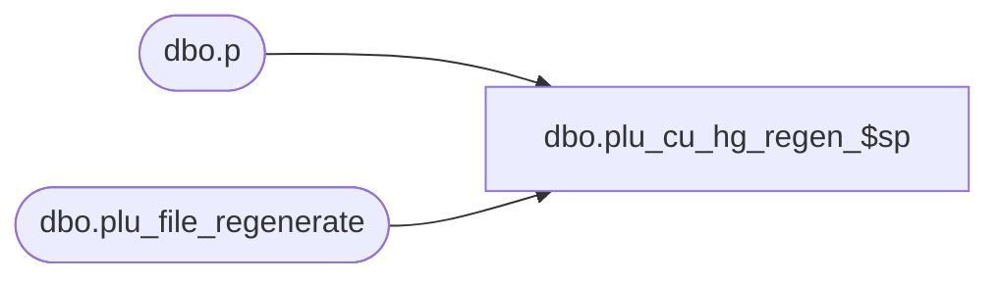

# dbo.plu_cu_hg_regen_$sp

**Database:** me_01  
**Server:** bedrockdb02  

## Architecture Diagram



## Table Dependencies

| Referenced Table |
|---|
| dbo.p |
| dbo.plu_file_regenerate |

## Stored Procedure Code

```sql
CREATE PROCEDURE [dbo].[plu_cu_hg_regen_$sp]
AS
			
DECLARE @line_id INT
		, @table_name NVARCHAR(30), @operation_name NVARCHAR(50)
		, @sql_err_num DECIMAL(38,0), @error_msg NVARCHAR(2000)
		, @error_severity SMALLINT, @error_state SMALLINT

BEGIN TRY

	SET NOCOUNT ON

	SET @line_id = 10
	
	DELETE p
	FROM
		plu_file_regenerate p
	INNER JOIN #all_hg_regen r ON p.location_id = r.location_id AND p.hierarchy_group_id = r.hierarchy_group_id

END TRY

BEGIN CATCH

	SELECT 
		@error_severity	= 16
		, @error_state = 1

	IF @line_id = 10
		SELECT  
			@table_name			= N'plu_file_regenerate'
			, @operation_name	= N'DELETE'
			, @sql_err_num		= ERROR_NUMBER()
			, @error_msg		= N'Line Id = ' + CAST(@line_id AS NVARCHAR(4)) + N' '
									+ N' Table Name = ' + @table_name + N' '
									+ N' Operation Name = ' + @operation_name + N' '
									+ N' SQL Error Number = ' + CAST(@sql_err_num AS NVARCHAR(38)) + N' '
									+ N' Error Message = ' + ERROR_MESSAGE()
			
	RAISERROR (@error_msg, @error_severity, @error_state)			

END CATCH
```

