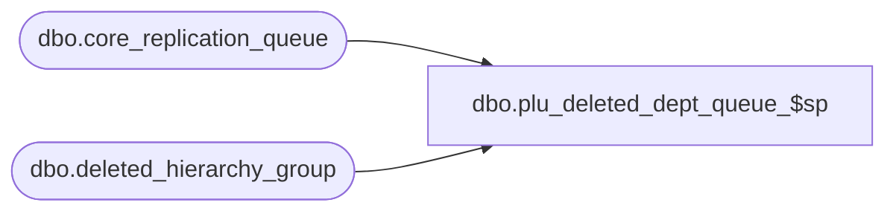

# dbo.plu_deleted_dept_queue_$sp

**Database:** me_01  
**Server:** bedrockdb02  

## Architecture Diagram



## Table Dependencies

| Referenced Table |
|---|
| dbo.core_replication_queue |
| dbo.deleted_hierarchy_group |

## Stored Procedure Code

```sql
CREATE PROCEDURE [dbo].[plu_deleted_dept_queue_$sp]
( @start_queue_id DECIMAL(12), @end_queue_id DECIMAL(12) )
AS
			
DECLARE @line_id INT
		, @table_name NVARCHAR(30), @operation_name NVARCHAR(50)
		, @sql_err_num DECIMAL(38,0), @error_msg NVARCHAR(2000)
		, @error_severity SMALLINT, @error_state SMALLINT

BEGIN TRY

	SET NOCOUNT ON

	SET @line_id = 10
	
	INSERT INTO #all_delete_department
		( hierarchy_group_id )
	SELECT
		d.hierarchy_group_id
	FROM
		core_replication_queue q
	INNER JOIN deleted_hierarchy_group d ON q.entity_id = d.hierarchy_group_id
	WHERE
		q.core_replication_queue_id > @start_queue_id AND q.core_replication_queue_id <= @end_queue_id
		AND q.entity_code = 203 AND q.replication_action = N'D'

END TRY

BEGIN CATCH

	SELECT 
		@error_severity	= 16
		, @error_state = 1

	IF @line_id = 10
		SELECT  
			@table_name			= N'#all_delete_department'
			, @operation_name	= N'INSERT'
			, @sql_err_num		= ERROR_NUMBER()
			, @error_msg		= N'Line Id = ' + CAST(@line_id AS NVARCHAR(4)) + N' '
									+ N' Table Name = ' + @table_name + N' '
									+ N' Operation Name = ' + @operation_name + N' '
									+ N' SQL Error Number = ' + CAST(@sql_err_num AS NVARCHAR(38)) + N' '
									+ N' Error Message = ' + ERROR_MESSAGE()
			
	RAISERROR (@error_msg, @error_severity, @error_state)			

END CATCH
```

