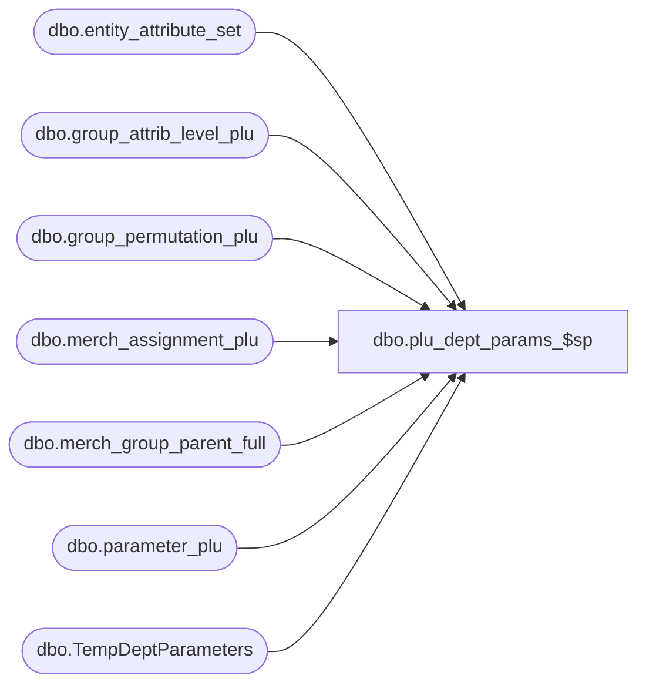

# dbo.plu_dept_params_$sp

**Database:** me_01  
**Server:** bedrockdb02  

## Architecture Diagram



## Table Dependencies

| Referenced Table |
|---|
| dbo.entity_attribute_set |
| dbo.group_attrib_level_plu |
| dbo.group_permutation_plu |
| dbo.merch_assignment_plu |
| dbo.merch_group_parent_full |
| dbo.parameter_plu |
| dbo.TempDeptParameters |

## Stored Procedure Code

```sql
CREATE PROCEDURE [dbo].[plu_dept_params_$sp]
AS
			
DECLARE @line_id INT
		, @table_name NVARCHAR(30), @operation_name NVARCHAR(50)
		, @sql_err_num DECIMAL(38,0), @error_msg NVARCHAR(2000)
		, @error_severity SMALLINT, @error_state SMALLINT
		
/*
	Version		: 1.00
	Created		: Feb 2011
	Created by	: Sameer Patel
	Description	: Procedure called by Segment 1038 -- EDM & PROD to Price Look-Up File Generate (CRS)
				  Get PLU department parameters for department classes in #dept_params table
				  
	Call from C++ code:
		-- File: PLUFileDefCommonSQLServer.cpp
		-- Class: CPLUFileDefCommonSQLServer
		-- Function: LoadFullRegenFileDefs
					 LoadHGRegenFileDefs
					 LoadDepartmentFileDefs
					 LoadStyleResendFileDefs
					 LoadStyleUpdateFileDefs
					 LoadUPCFileDefs
					 LoadPromoFileDefs
					 LoadPriceFileDefs
					 LoadCancelPromoFileDefs
					 
	-- NOTE: The way PLU parameters are set up in the DB is rather confusing
	-- I used the custom PLU code to create this stored procedure; 
	-- the retrieval of department parameters is common to package and custom code which is why I used it
	-- As the PLU setup becomes clearer, I will update the comments within this procedure.
		
	-- NOTE: The temp tables #dept_parameters, #dept_class, #location, and #plu_group_param exist
	
	IF NOT object_id(N'tempdb..#dept_parameters') IS NULL
	DROP TABLE #dept_parameters

	CREATE TABLE #dept_parameters
		( location_id SMALLINT, dept_class_id INT
		, verify_price NVARCHAR(5), qty_required NVARCHAR(10), returnable NVARCHAR(1), discountable NVARCHAR(1)
		, allow_employee_discount NVARCHAR(1), allow_layaways NVARCHAR(1), prompt_id NVARCHAR(12)
		, coalition_tax_code_id NVARCHAR(12), limited_qty NVARCHAR(3), generate_coupon_id NVARCHAR(12), commission_id NVARCHAR(12)
		, user_flag_1 NVARCHAR(10), user_flag_2 NVARCHAR(10), user_flag_3 NVARCHAR(10), user_flag_4 NVARCHAR(10)
		, tax_table_1 NVARCHAR(1), tax_table_2 NVARCHAR(1), tax_table_3 NVARCHAR(1), tax_table_4 NVARCHAR(1)
		, tax_table_5 NVARCHAR(1), tax_table_6 NVARCHAR(1), tax_table_7 NVARCHAR(1), tax_table_8 NVARCHAR(1)
		, tax_table_9 NVARCHAR(1), tax_table_10 NVARCHAR(1), tax_table_11 NVARCHAR(1), tax_table_12 NVARCHAR(1)
		, tax_table_13 NVARCHAR(1), tax_table_14 NVARCHAR(1), tax_table_15 NVARCHAR(1), tax_table_16 NVARCHAR(1)
		, photo NVARCHAR(255), wave NVARCHAR(255), prompt_form_name NVARCHAR(40), quantity_key_allowed NVARCHAR(1)
		, print_additional_copy NVARCHAR(1), print_retail NVARCHAR(1), print_suggested_retail NVARCHAR(1)
		, validate_sale NVARCHAR(1), allow_zero_price NVARCHAR(1), linked_item_grp_id NVARCHAR(10), prompt_additional_data NVARCHAR(1)
		, PRIMARY KEY (location_id, dept_class_id) )
	
	IF NOT object_id(N'tempdb..#dept') IS NULL
	DROP TABLE #dept

	CREATE TABLE #dept
		( dept_id INT, hierarchy_level_id INT
		, pos_dept_group_key NVARCHAR(10)
		, dept_no NVARCHAR(4)
		, description NVARCHAR(40)
		, UNIQUE (dept_id) )
	
	IF NOT object_id(N'tempdb..#dept') IS NULL
	DROP TABLE #dept_class

	CREATE TABLE #dept_class
		( dept_class_id INT, dept_id INT, hierarchy_level_id INT
		, pos_merch_group_key INT
		, description NVARCHAR(40)
		, UNIQUE (dept_class_id, dept_id) )
		
	IF NOT object_id(N'tempdb..#plu_group_param') IS NULL
	DROP TABLE #plu_group_param

	CREATE TABLE #plu_group_param
		( group_permutation_plu_id DECIMAL(12), parameter_plu_id TINYINT
		, parameter_plu NVARCHAR(255)
		, PRIMARY KEY (group_permutation_plu_id, parameter_plu_id) )	

	IF NOT object_id(N'tempdb..#location') IS NULL
	DROP TABLE #location

	CREATE TABLE #location
		( id SMALLINT IDENTITY(1,1)
		, location_id SMALLINT, jurisdiction_id SMALLINT, pricing_group_id SMALLINT
		, language_id INT, register_type_id TINYINT
		, PRIMARY KEY (location_id, jurisdiction_id, pricing_group_id) )
	
HISTORY:
Date       		Name         	Def#		Desc
Feb 04,11		Sameer Patel	N/A			Initial Release
Oct 21,11		Sameer Patel	130642		unable to set flags in crs retail store plu file (fields 256 257)
Oct 21,11		Sameer Patel	130644		Ported defect 130642 to 5.0
*/	

DECLARE @min_loc_id SMALLINT, @max_loc_id SMALLINT

BEGIN TRY

	SET NOCOUNT ON

	-- Get minimum and maximum ids from #location table
	
	SET @line_id = 10
	
	SELECT 
		@min_loc_id = COALESCE(MIN(id), 0)
		, @max_loc_id = COALESCE(MAX(id), 0)
	FROM
		#location
		
	-- Return if there are no locations to generate
	
	IF @max_loc_id = 0
		RETURN
	
	-- Create work table to set up department parameter retrieval

	SET @line_id = 20
	
	IF NOT object_id(N'tempdb..#dept_params_temp') IS NULL
	DROP TABLE #dept_params_temp

	CREATE TABLE #dept_params_temp
		( location_id SMALLINT, dept_class_id INT, parameter_plu_id TINYINT
		, parameter_plu NVARCHAR(255)
		, PRIMARY KEY (location_id, dept_class_id, parameter_plu_id) )
											
	-- For each location		
	-- First insert into #dept_params_temp and then populate #dept_parameters with parameters by department
	
	WHILE (@min_loc_id <= @max_loc_id)
	BEGIN

		-- The PLU parameters set up in MERCH is rather confusing
		-- This SQL was built using the custom PLU code but is essentially whaty old PLU use to do in C++ objects
		
		SET @line_id = 30
		
		INSERT INTO #dept_params_temp
			( location_id, dept_class_id, parameter_plu_id
			, parameter_plu )
		SELECT 
			TempLocation.location_id, TempDeptClass.dept_class_id, TempPluGroupParam.parameter_plu_id
			, TempPluGroupParam.parameter_plu
		FROM #dept_class TempDeptClass
		INNER JOIN merch_group_parent_full MerchGroupParentFull ON TempDeptClass.dept_class_id = MerchGroupParentFull.hierarchy_group_id
		INNER JOIN group_attrib_level_plu GroupAttribLevelPlu ON MerchGroupParentFull.parent_hierarchy_level_id = GroupAttribLevelPlu.hierarchy_level_id
		INNER JOIN group_permutation_plu GroupPermutationPlu ON GroupAttribLevelPlu.parameter_group_plu_id = GroupPermutationPlu.parameter_group_plu_id
		INNER JOIN merch_assignment_plu MerchAssignmentPlu ON GroupAttribLevelPlu.parameter_group_plu_id = MerchAssignmentPlu.parameter_group_plu_id
																AND MerchGroupParentFull.parent_hierarchy_group_id = MerchAssignmentPlu.hierarchy_group_id
																AND GroupPermutationPlu.group_permutation_plu_id = MerchAssignmentPlu.group_permutation_plu_id
		INNER JOIN #location TempLocation ON TempLocation.id = @min_loc_id
		INNER JOIN entity_attribute_set EntityAttributeSet ON EntityAttributeSet.parent_id = TempLocation.location_id AND EntityAttributeSet.parent_type = 2
																AND MerchAssignmentPlu.attribute_set_id = EntityAttributeSet.attribute_set_id AND GroupAttribLevelPlu.attribute_id = EntityAttributeSet.attribute_id
		INNER JOIN parameter_plu ParameterPlu ON GroupPermutationPlu.parameter_group_plu_id = ParameterPlu.parameter_group_plu_id
		INNER JOIN #plu_group_param TempPluGroupParam ON GroupPermutationPlu.group_permutation_plu_id = TempPluGroupParam.group_permutation_plu_id
															AND ParameterPlu.parameter_plu_id = TempPluGroupParam.parameter_plu_id
										
		SET @line_id = 40
										
		INSERT INTO #dept_parameters
			( location_id, dept_class_id )
		SELECT
			TempLocation.location_id, TempDeptClass.dept_class_id
		FROM
			#dept_class TempDeptClass
		INNER JOIN #location TempLocation ON TempLocation.id = @min_loc_id
		
		SET @line_id = 50
		
		UPDATE TempDeptParameters
		SET 
			TempDeptParameters.verify_price = t2.parameter_plu, TempDeptParameters.qty_required = t12.parameter_plu, TempDeptParameters.returnable = t8.parameter_plu, TempDeptParameters.discountable = t7.parameter_plu
			, TempDeptParameters.allow_employee_discount = t10.parameter_plu, TempDeptParameters.allow_layaways = t9.parameter_plu, TempDeptParameters.prompt_id = t15.parameter_plu
			, TempDeptParameters.coalition_tax_code_id = t16.parameter_plu, TempDeptParameters.limited_qty = t17.parameter_plu, TempDeptParameters.generate_coupon_id = t18.parameter_plu, TempDeptParameters.commission_id = t19.parameter_plu
			, TempDeptParameters.user_flag_1 = t22.parameter_plu, TempDeptParameters.user_flag_2 = t23.parameter_plu, TempDeptParameters.user_flag_3 = t24.parameter_plu, TempDeptParameters.user_flag_4 = t25.parameter_plu
			, TempDeptParameters.tax_table_1 = t29.parameter_plu, TempDeptParameters.tax_table_2 = t28.parameter_plu, TempDeptParameters.tax_table_3 = t30.parameter_plu, TempDeptParameters.tax_table_4 = t31.parameter_plu
			, TempDeptParameters.tax_table_5 = t32.parameter_plu, TempDeptParameters.tax_table_6 = t33.parameter_plu, TempDeptParameters.tax_table_7 = t34.parameter_plu, TempDeptParameters.tax_table_8 = t35.parameter_plu
			, TempDeptParameters.tax_table_9 = t36.parameter_plu, TempDeptParameters.tax_table_10 = t37.parameter_plu, TempDeptParameters.tax_table_11 = t38.parameter_plu, TempDeptParameters.tax_table_12 = t39.parameter_plu
			, TempDeptParameters.tax_table_13 = t40.parameter_plu, TempDeptParameters.tax_table_14 = t41.parameter_plu, TempDeptParameters.tax_table_15 = t42.parameter_plu, TempDeptParameters.tax_table_16 = t43.parameter_plu
			, TempDeptParameters.photo = t20.parameter_plu, TempDeptParameters.wave = t21.parameter_plu, TempDeptParameters.prompt_form_name = t1.parameter_plu, TempDeptParameters.quantity_key_allowed = t11.parameter_plu
			, TempDeptParameters.print_additional_copy = t3.parameter_plu, TempDeptParameters.print_retail = t4.parameter_plu, TempDeptParameters.print_suggested_retail = t5.parameter_plu
			, TempDeptParameters.validate_sale = t6.parameter_plu, TempDeptParameters.allow_zero_price = t13.parameter_plu, TempDeptParameters.linked_item_grp_id = t26.parameter_plu, TempDeptParameters.prompt_additional_data = t27.parameter_plu
		FROM #dept_parameters TempDeptParameters
		INNER JOIN #location TempLocation ON TempDeptParameters.location_id = TempLocation.location_id AND TempLocation.id = @min_loc_id
		LEFT OUTER JOIN #dept_params_temp t1 ON TempDeptParameters.location_id = t1.location_id AND TempDeptParameters.dept_class_id = t1.dept_class_id AND t1.parameter_plu_id = 1
		LEFT OUTER JOIN #dept_params_temp t2 ON TempDeptParameters.location_id = t2.location_id AND TempDeptParameters.dept_class_id = t2.dept_class_id AND t2.parameter_plu_id = 2
		LEFT OUTER JOIN #dept_params_temp t3 ON TempDeptParameters.location_id = t3.location_id AND TempDeptParameters.dept_class_id = t3.dept_class_id AND t3.parameter_plu_id = 3
		LEFT OUTER JOIN #dept_params_temp t4 ON TempDeptParameters.location_id = t4.location_id AND TempDeptParameters.dept_class_id = t4.dept_class_id AND t4.parameter_plu_id = 4
		LEFT OUTER JOIN #dept_params_temp t5 ON TempDeptParameters.location_id = t5.location_id AND TempDeptParameters.dept_class_id = t5.dept_class_id AND t5.parameter_plu_id = 5
		LEFT OUTER JOIN #dept_params_temp t6 ON TempDeptParameters.location_id = t6.location_id AND TempDeptParameters.dept_class_id = t6.dept_class_id AND t6.parameter_plu_id = 6
		LEFT OUTER JOIN #dept_params_temp t7 ON TempDeptParameters.location_id = t7.location_id AND TempDeptParameters.dept_class_id = t7.dept_class_id AND t7.parameter_plu_id = 7
		LEFT OUTER JOIN #dept_params_temp t8 ON TempDeptParameters.location_id = t8.location_id AND TempDeptParameters.dept_class_id = t8.dept_class_id AND t8.parameter_plu_id = 8
		LEFT OUTER JOIN #dept_params_temp t9 ON TempDeptParameters.location_id = t9.location_id AND TempDeptParameters.dept_class_id = t9.dept_class_id AND t9.parameter_plu_id = 9
		LEFT OUTER JOIN #dept_params_temp t10 ON TempDeptParameters.location_id = t10.location_id AND TempDeptParameters.dept_class_id = t10.dept_class_id AND t10.parameter_plu_id = 10
		LEFT OUTER JOIN #dept_params_temp t11 ON TempDeptParameters.location_id = t11.location_id AND TempDeptParameters.dept_class_id = t11.dept_class_id AND t11.parameter_plu_id = 11
		LEFT OUTER JOIN #dept_params_temp t12 ON TempDeptParameters.location_id = t12.location_id AND TempDeptParameters.dept_class_id = t12.dept_class_id AND t12.parameter_plu_id = 12
		LEFT OUTER JOIN #dept_params_temp t13 ON TempDeptParameters.location_id = t13.location_id AND TempDeptParameters.dept_class_id = t13.dept_class_id AND t13.parameter_plu_id = 13
		LEFT OUTER JOIN #dept_params_temp t14 ON TempDeptParameters.location_id = t14.location_id AND TempDeptParameters.dept_class_id = t14.dept_class_id AND t14.parameter_plu_id = 14
		LEFT OUTER JOIN #dept_params_temp t15 ON TempDeptParameters.location_id = t15.location_id AND TempDeptParameters.dept_class_id = t15.dept_class_id AND t15.parameter_plu_id = 15
		LEFT OUTER JOIN #dept_params_temp t16 ON TempDeptParameters.location_id = t16.location_id AND TempDeptParameters.dept_class_id = t16.dept_class_id AND t16.parameter_plu_id = 16
		LEFT OUTER JOIN #dept_params_temp t17 ON TempDeptParameters.location_id = t17.location_id AND TempDeptParameters.dept_class_id = t17.dept_class_id AND t17.parameter_plu_id = 17
		LEFT OUTER JOIN #dept_params_temp t18 ON TempDeptParameters.location_id = t18.location_id AND TempDeptParameters.dept_class_id = t18.dept_class_id AND t18.parameter_plu_id = 18
		LEFT OUTER JOIN #dept_params_temp t19 ON TempDeptParameters.location_id = t19.location_id AND TempDeptParameters.dept_class_id = t19.dept_class_id AND t19.parameter_plu_id = 19
		LEFT OUTER JOIN #dept_params_temp t20 ON TempDeptParameters.location_id = t20.location_id AND TempDeptParameters.dept_class_id = t20.dept_class_id AND t20.parameter_plu_id = 20
		LEFT OUTER JOIN #dept_params_temp t21 ON TempDeptParameters.location_id = t21.location_id AND TempDeptParameters.dept_class_id = t21.dept_class_id AND t21.parameter_plu_id = 21
		LEFT OUTER JOIN #dept_params_temp t22 ON TempDeptParameters.location_id = t22.location_id AND TempDeptParameters.dept_class_id = t22.dept_class_id AND t22.parameter_plu_id = 22
		LEFT OUTER JOIN #dept_params_temp t23 ON TempDeptParameters.location_id = t23.location_id AND TempDeptParameters.dept_class_id = t23.dept_class_id AND t23.parameter_plu_id = 23
		LEFT OUTER JOIN #dept_params_temp t24 ON TempDeptParameters.location_id = t24.location_id AND TempDeptParameters.dept_class_id = t24.dept_class_id AND t24.parameter_plu_id = 24
		LEFT OUTER JOIN #dept_params_temp t25 ON TempDeptParameters.location_id = t25.location_id AND TempDeptParameters.dept_class_id = t25.dept_class_id AND t25.parameter_plu_id = 25
		LEFT OUTER JOIN #dept_params_temp t26 ON TempDeptParameters.location_id = t26.location_id AND TempDeptParameters.dept_class_id = t26.dept_class_id AND t26.parameter_plu_id = 26
		LEFT OUTER JOIN #dept_params_temp t27 ON TempDeptParameters.location_id = t27.location_id AND TempDeptParameters.dept_class_id = t27.dept_class_id AND t27.parameter_plu_id = 27
		LEFT OUTER JOIN #dept_params_temp t28 ON TempDeptParameters.location_id = t28.location_id AND TempDeptParameters.dept_class_id = t28.dept_class_id AND t28.parameter_plu_id = 28
		LEFT OUTER JOIN #dept_params_temp t29 ON TempDeptParameters.location_id = t29.location_id AND TempDeptParameters.dept_class_id = t29.dept_class_id AND t29.parameter_plu_id = 29
		LEFT OUTER JOIN #dept_params_temp t30 ON TempDeptParameters.location_id = t30.location_id AND TempDeptParameters.dept_class_id = t30.dept_class_id AND t30.parameter_plu_id = 30
		LEFT OUTER JOIN #dept_params_temp t31 ON TempDeptParameters.location_id = t31.location_id AND TempDeptParameters.dept_class_id = t31.dept_class_id AND t31.parameter_plu_id = 31
		LEFT OUTER JOIN #dept_params_temp t32 ON TempDeptParameters.location_id = t32.location_id AND TempDeptParameters.dept_class_id = t32.dept_class_id AND t32.parameter_plu_id = 32
		LEFT OUTER JOIN #dept_params_temp t33 ON TempDeptParameters.location_id = t33.location_id AND TempDeptParameters.dept_class_id = t33.dept_class_id AND t33.parameter_plu_id = 33
		LEFT OUTER JOIN #dept_params_temp t34 ON TempDeptParameters.location_id = t34.location_id AND TempDeptParameters.dept_class_id = t34.dept_class_id AND t34.parameter_plu_id = 34
		LEFT OUTER JOIN #dept_params_temp t35 ON TempDeptParameters.location_id = t35.location_id AND TempDeptParameters.dept_class_id = t35.dept_class_id AND t35.parameter_plu_id = 35
		LEFT OUTER JOIN #dept_params_temp t36 ON TempDeptParameters.location_id = t36.location_id AND TempDeptParameters.dept_class_id = t36.dept_class_id AND t36.parameter_plu_id = 36
		LEFT OUTER JOIN #dept_params_temp t37 ON TempDeptParameters.location_id = t37.location_id AND TempDeptParameters.dept_class_id = t37.dept_class_id AND t37.parameter_plu_id = 37
		LEFT OUTER JOIN #dept_params_temp t38 ON TempDeptParameters.location_id = t38.location_id AND TempDeptParameters.dept_class_id = t38.dept_class_id AND t38.parameter_plu_id = 38
		LEFT OUTER JOIN #dept_params_temp t39 ON TempDeptParameters.location_id = t39.location_id AND TempDeptParameters.dept_class_id = t39.dept_class_id AND t39.parameter_plu_id = 39
		LEFT OUTER JOIN #dept_params_temp t40 ON TempDeptParameters.location_id = t40.location_id AND TempDeptParameters.dept_class_id = t40.dept_class_id AND t40.parameter_plu_id = 40
		LEFT OUTER JOIN #dept_params_temp t41 ON TempDeptParameters.location_id = t41.location_id AND TempDeptParameters.dept_class_id = t41.dept_class_id AND t41.parameter_plu_id = 41
		LEFT OUTER JOIN #dept_params_temp t42 ON TempDeptParameters.location_id = t42.location_id AND TempDeptParameters.dept_class_id = t42.dept_class_id AND t42.parameter_plu_id = 42
		LEFT OUTER JOIN #dept_params_temp t43 ON TempDeptParameters.location_id = t43.location_id AND TempDeptParameters.dept_class_id = t43.dept_class_id AND t43.parameter_plu_id = 43
		
		TRUNCATE TABLE #dept_params_temp
		
		SET @min_loc_id = @min_loc_id + 1
		
	END

END TRY

BEGIN CATCH

	SELECT 
		@error_severity	= 16
		, @error_state = 1

	IF @line_id = 10
		SELECT  
			@table_name			= N'#location'
			, @operation_name	= N'SELECT'
			, @sql_err_num		= ERROR_NUMBER()
			, @error_msg		= N'Line Id = ' + CAST(@line_id AS NVARCHAR(4)) + N' '
									+ N' Table Name = ' + @table_name + N' '
									+ N' Operation Name = ' + @operation_name + N' '
									+ N' SQL Error Number = ' + CAST(@sql_err_num AS NVARCHAR(38)) + N' '
									+ N' Error Message = ' + ERROR_MESSAGE()

	ELSE IF @line_id = 20
		SELECT  
			@table_name			= N'#dept_params_temp'
			, @operation_name	= N'CREATE TABLE'
			, @sql_err_num		= ERROR_NUMBER()
			, @error_msg		= N'Line Id = ' + CAST(@line_id AS NVARCHAR(4)) + N' '
									+ N' Table Name = ' + @table_name + N' '
									+ N' Operation Name = ' + @operation_name + N' '
									+ N' SQL Error Number = ' + CAST(@sql_err_num AS NVARCHAR(38)) + N' '
									+ N' Error Message = ' + ERROR_MESSAGE()

	ELSE IF @line_id = 30
		SELECT  
			@table_name			= N'#dept_params_temp'
			, @operation_name	= N'INSERT'
			, @sql_err_num		= ERROR_NUMBER()
			, @error_msg		= N'Line Id = ' + CAST(@line_id AS NVARCHAR(4)) + N' '
									+ N' Table Name = ' + @table_name + N' '
									+ N' Operation Name = ' + @operation_name + N' '
									+ N' SQL Error Number = ' + CAST(@sql_err_num AS NVARCHAR(38)) + N' '
									+ N' Error Message = ' + ERROR_MESSAGE()

	ELSE IF @line_id = 40
		SELECT  
			@table_name			= N'#dept_parameters'
			, @operation_name	= N'INSERT'
			, @sql_err_num		= ERROR_NUMBER()
			, @error_msg		= N'Line Id = ' + CAST(@line_id AS NVARCHAR(4)) + N' '
									+ N' Table Name = ' + @table_name + N' '
									+ N' Operation Name = ' + @operation_name + N' '
									+ N' SQL Error Number = ' + CAST(@sql_err_num AS NVARCHAR(38)) + N' '
									+ N' Error Message = ' + ERROR_MESSAGE()

	ELSE IF @line_id = 50
		SELECT  
			@table_name			= N'#dept_parameters'
			, @operation_name	= N'UPDATE'
			, @sql_err_num		= ERROR_NUMBER()
			, @error_msg		= N'Line Id = ' + CAST(@line_id AS NVARCHAR(4)) + N' '
									+ N' Table Name = ' + @table_name + N' '
									+ N' Operation Name = ' + @operation_name + N' '
									+ N' SQL Error Number = ' + CAST(@sql_err_num AS NVARCHAR(38)) + N' '
									+ N' Error Message = ' + ERROR_MESSAGE()
			
	RAISERROR (@error_msg, @error_severity, @error_state)			

END CATCH
```

