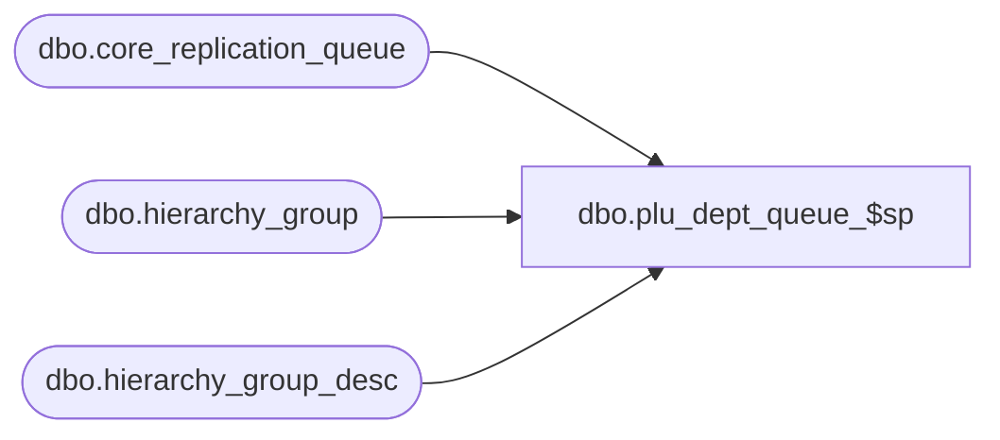

# dbo.plu_dept_queue_$sp

**Database:** me_01  
**Server:** bedrockdb02  

## Architecture Diagram



## Table Dependencies

| Referenced Table |
|---|
| dbo.core_replication_queue |
| dbo.hierarchy_group |
| dbo.hierarchy_group_desc |

## Stored Procedure Code

```sql
CREATE PROCEDURE [dbo].[plu_dept_queue_$sp]
( @start_queue_id DECIMAL(12), @end_queue_id DECIMAL(12) )
AS
			
DECLARE @line_id INT
		, @table_name NVARCHAR(30), @operation_name NVARCHAR(50)
		, @sql_err_num DECIMAL(38,0), @error_msg NVARCHAR(2000)
		, @error_severity SMALLINT, @error_state SMALLINT
		
/*
	Version		: 1.00
	Created		: Feb 2011
	Created by	: Sameer Patel
	Description	: Procedure called by Segment 1038 -- EDM & PROD to Price Look-Up File Generate (CRS)
				  Determines what style colors to send to PLU
				  based on what is in the CRQ greater than @start_queue_id and less than @end_queue_id
				  
	Call from C++ code:
		-- File: PLUQueueDefDepartment.cpp
		-- Class: CPLUQueueDefDepartment
		-- Function: FullQueueSQLServer
	
HISTORY:
Date       		Name         	Def#		Desc
Feb 04,11		Sameer Patel	N/A			Initial Release
*/

BEGIN TRY

	SET NOCOUNT ON

	-- Insert a resend entry
	-- for main merchandise group inserts or updates

	SET @line_id = 10
	
	INSERT INTO #all_department
		( hierarchy_group_id )
	SELECT
		DISTINCT
			HierarchyGroup.hierarchy_group_id
	FROM
		core_replication_queue CoreReplicationQueue
	INNER JOIN hierarchy_group HierarchyGroup ON CoreReplicationQueue.entity_id = HierarchyGroup.hierarchy_group_id
	WHERE
		CoreReplicationQueue.core_replication_queue_id > @start_queue_id AND CoreReplicationQueue.core_replication_queue_id <= @end_queue_id
		AND CoreReplicationQueue.entity_code = 203 AND CoreReplicationQueue.replication_action IN (N'I', N'U')

	-- Insert a resend entry
	-- for main merchandise group description inserts or updates

	SET @line_id = 20
	
	INSERT INTO #all_department
		( hierarchy_group_id )
	SELECT
		DISTINCT
			HierarchyGroupDesc.hierarchy_group_id
	FROM
		core_replication_queue CoreReplicationQueue
	INNER JOIN hierarchy_group_desc HierarchyGroupDesc ON CoreReplicationQueue.entity_id = HierarchyGroupDesc.hierarchy_group_id
	LEFT OUTER JOIN #all_department Department ON Department.hierarchy_group_id = HierarchyGroupDesc.hierarchy_group_id
	WHERE
		CoreReplicationQueue.core_replication_queue_id > @start_queue_id AND CoreReplicationQueue.core_replication_queue_id <= @end_queue_id
		AND CoreReplicationQueue.entity_code = 272 AND CoreReplicationQueue.replication_action IN (N'I', N'U')
		AND Department.hierarchy_group_id IS NULL

	-- Insert a resend entry
	-- for main merchandise group description deletes

	SET @line_id = 30
	
	INSERT INTO #all_department
		( hierarchy_group_id )
	SELECT
		DISTINCT
			CoreReplicationQueue.other_entity_id
	FROM
		core_replication_queue CoreReplicationQueue
	LEFT OUTER JOIN #all_department Department ON Department.hierarchy_group_id = CoreReplicationQueue.other_entity_id
	WHERE
		CoreReplicationQueue.core_replication_queue_id > @start_queue_id AND CoreReplicationQueue.core_replication_queue_id <= @end_queue_id
		AND CoreReplicationQueue.entity_code = 272 AND CoreReplicationQueue.replication_action IN (N'D')
		AND Department.hierarchy_group_id IS NULL

END TRY

BEGIN CATCH

	SELECT 
		@error_severity	= 16
		, @error_state = 1

	IF @line_id = 10
		SELECT  
			@table_name			= N'#all_department'
			, @operation_name	= N'INSERT - hierarchy_group'
			, @sql_err_num		= ERROR_NUMBER()
			, @error_msg		= N'Line Id = ' + CAST(@line_id AS NVARCHAR(4)) + N' '
									+ N' Table Name = ' + @table_name + N' '
									+ N' Operation Name = ' + @operation_name + N' '
									+ N' SQL Error Number = ' + CAST(@sql_err_num AS NVARCHAR(38)) + N' '
									+ N' Error Message = ' + ERROR_MESSAGE()

	ELSE IF @line_id = 20
		SELECT  
			@table_name			= N'#all_department'
			, @operation_name	= N'INSERT - hierarchy_group_desc (I,U)'
			, @sql_err_num		= ERROR_NUMBER()
			, @error_msg		= N'Line Id = ' + CAST(@line_id AS NVARCHAR(4)) + N' '
									+ N' Table Name = ' + @table_name + N' '
									+ N' Operation Name = ' + @operation_name + N' '
									+ N' SQL Error Number = ' + CAST(@sql_err_num AS NVARCHAR(38)) + N' '
									+ N' Error Message = ' + ERROR_MESSAGE()

	ELSE IF @line_id = 30
		SELECT   
			@table_name			= N'#all_department'
			, @operation_name	= N'INSERT - hierarchy_group_desc (D)'
			, @sql_err_num		= ERROR_NUMBER()
			, @error_msg		= N'Line Id = ' + CAST(@line_id AS NVARCHAR(4)) + N' '
									+ N' Table Name = ' + @table_name + N' '
									+ N' Operation Name = ' + @operation_name + N' '
									+ N' SQL Error Number = ' + CAST(@sql_err_num AS NVARCHAR(38)) + N' '
									+ N' Error Message = ' + ERROR_MESSAGE()
			
	RAISERROR (@error_msg, @error_severity, @error_state)			

END CATCH
```

