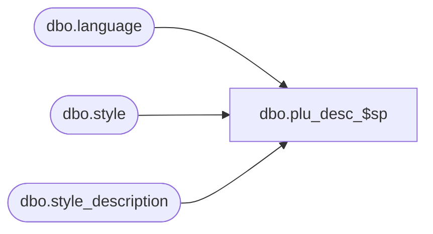

# dbo.plu_desc_$sp

**Database:** me_01  
**Server:** bedrockdb02  

## Architecture Diagram



## Table Dependencies

| Referenced Table |
|---|
| dbo.language |
| dbo.style |
| dbo.style_description |

## Stored Procedure Code

```sql
CREATE PROCEDURE [dbo].[plu_desc_$sp]
AS
			
DECLARE @line_id INT
		, @table_name NVARCHAR(30), @operation_name NVARCHAR(50)
		, @sql_err_num DECIMAL(38,0), @error_msg NVARCHAR(2000)
		, @error_severity SMALLINT, @error_state SMALLINT
		
/*
	Version		: 1.00
	Created		: Feb 2011
	Created by	: Sameer Patel
	Description	: Procedure called by Segment 1038 -- EDM & PROD to Price Look-Up File Generate (CRS)
				  Gets plu descriptions for all styles
				  
	Call from C++ code:
		-- File: PLUFileDefGlobalSQLServer.cpp
		-- Class: CPLUFileDefGlobalSQLServer
		-- Function: LoadFileDefs
		
	-- NOTE: The temp table #style_plu_description exists
		
	IF NOT object_id('tempdb..#style_plu_description') IS NULL
	DROP TABLE #style_plu_description

	CREATE TABLE #style_plu_description
		( language_id INT, style_id DECIMAL(12)
		, plu_desc NVARCHAR(40)
		, PRIMARY KEY (language_id, style_id) )
	
HISTORY:
Date       		Name         	Def#		Desc
Feb 04,11		Sameer Patel	N/A			Initial Release
*/	

BEGIN TRY

	SET NOCOUNT ON
	
	-- Get plu descrption for all styles/lanuages
	-- If default_desc_language_flag = 1, then the plu description comes from the style table
	-- Otherwise, we will try to get it from the style_description and default to the plu description in the style table
	-- if the entry in the style_description table does not exist
	
	SET @line_id = 10
	
	INSERT INTO #style_plu_description 
		( language_id, style_id 
		, plu_desc )
	SELECT
		Language.language_id, Style.style_id
		, CASE
				WHEN Language.default_desc_language_flag = 1 THEN Style.plu_desc
				ELSE COALESCE(StyleDescription.plu_desc, Style.plu_desc)
		  END plu_desc
	FROM
		style Style
	CROSS JOIN language Language
	LEFT OUTER JOIN style_description StyleDescription ON Style.style_id = StyleDescription.style_id AND Language.language_id = StyleDescription.language_id
	
	RETURN

END TRY

BEGIN CATCH

	SELECT 
		@error_severity	= 16
		, @error_state = 1

	IF @line_id = 10
		SELECT  
			@table_name			= N'#style_plu_description'
			, @operation_name	= N'INSERT'
			, @sql_err_num		= ERROR_NUMBER()
			, @error_msg		= N'Line Id = ' + CAST(@line_id AS NVARCHAR(4)) + N' '
									+ N' Table Name = ' + @table_name + N' '
									+ N' Operation Name = ' + @operation_name + N' '
									+ N' SQL Error Number = ' + CAST(@sql_err_num AS NVARCHAR(38)) + N' '
									+ N' Error Message = ' + ERROR_MESSAGE()
			
	RAISERROR (@error_msg, @error_severity, @error_state)			

END CATCH
```

