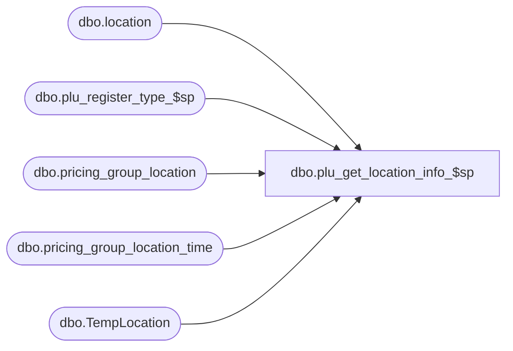

# dbo.plu_get_location_info_$sp

**Database:** me_01  
**Server:** bedrockdb02  

## Architecture Diagram



## Table Dependencies

| Referenced Table |
|---|
| dbo.location |
| dbo.plu_register_type_$sp |
| dbo.pricing_group_location |
| dbo.pricing_group_location_time |
| dbo.TempLocation |

## Stored Procedure Code

```sql
CREATE PROCEDURE [dbo].[plu_get_location_info_$sp]
AS

DECLARE @line_id INT
		, @table_name NVARCHAR(30), @operation_name NVARCHAR(50)
		, @sql_err_num DECIMAL(38,0), @error_msg NVARCHAR(2000)
		, @error_severity SMALLINT, @error_state SMALLINT

/*
	Version		: 1.00
	Created		: Feb 2011
	Created by	: Sameer Patel
	Description	: Procedure called by other stored procedures to get location information for a list of locations

	Call from Stored procedures:
		-- plu_regen_location_$sp
		-- plu_hg_regen_location_$sp
		-- plu_common_location_$sp

	-- NOTE: The temp table #location exists and is poulated with location ids

	IF NOT object_id('tempdb..#location') IS NULL
	DROP TABLE #location

	CREATE TABLE #location
		( id SMALLINT IDENTITY(1,1)
		, location_id SMALLINT, jurisdiction_id SMALLINT, pricing_group_id SMALLINT
		, language_id INT, register_type_id TINYINT
		, PRIMARY KEY (location_id, jurisdiction_id, pricing_group_id) )

HISTORY:
Date       		Name         	Def#		Desc
Feb 04,11		Sameer Patel	N/A			Initial Release
*/

DECLARE @current_date AS DATETIME
SET @current_date = CAST(FLOOR(CAST(GETDATE() AS FLOAT)) AS DATETIME)

BEGIN TRY

	SET NOCOUNT ON

	SET @line_id = 10

	-- Get register_type_id and activation_days_number from register_type table for CRS register_type
	DECLARE
		@CRS_register_code NVARCHAR(6) -- input parameter
		, @CRS_register_type_id TINYINT, @lookup_days INT, @future_price_manag_flag BIT -- output parameters
	SET @CRS_register_code = N'CRS'
	EXEC plu_register_type_$sp @CRS_register_code, @CRS_register_type_id OUTPUT, @lookup_days OUTPUT, @future_price_manag_flag OUTPUT

	SET @line_id = 20

	-- Update the following information for each location:
		-- jurisdiction_id
		-- pricing_group_id
		-- language_id
	UPDATE TempLocation
	SET
		TempLocation.jurisdiction_id = Location.jurisdiction_id
		, TempLocation.pricing_group_id = COALESCE(PricingGroupLocationTime.pricing_group_id, COALESCE(PricingGroupLocation.pricing_group_id, -1))
		, TempLocation.language_id = Location.language_id
	FROM
		#location TempLocation
	INNER JOIN location Location ON TempLocation.location_id = Location.location_id AND Location.register_type_id = @CRS_register_type_id AND Location.generate_plu_file_flag = 1 AND Location.active_flag = 1
	LEFT OUTER JOIN pricing_group_location_time PricingGroupLocationTime ON PricingGroupLocationTime.location_id = Location.location_id
														AND ((DATEADD(day, @lookup_days, @current_date) >= PricingGroupLocationTime.begin_date AND PricingGroupLocationTime.end_date IS NULL)
																OR (DATEADD(day, @lookup_days, @current_date) BETWEEN PricingGroupLocationTime.begin_date AND PricingGroupLocationTime.end_date))
	LEFT OUTER JOIN pricing_group_location PricingGroupLocation ON Location.location_id = PricingGroupLocation.location_id

	SET @line_id = 30

	SET @CRS_register_code = N'CRS325'
	EXEC plu_register_type_$sp @CRS_register_code, @CRS_register_type_id OUTPUT, @lookup_days OUTPUT, @future_price_manag_flag OUTPUT

	SET @line_id = 40

	-- Update the following information for each location:
		-- jurisdiction_id
		-- pricing_group_id
		-- language_id
	UPDATE TempLocation
	SET
		TempLocation.jurisdiction_id = Location.jurisdiction_id
		, TempLocation.pricing_group_id = COALESCE(PricingGroupLocationTime.pricing_group_id, COALESCE(PricingGroupLocation.pricing_group_id, -1))
		, TempLocation.language_id = Location.language_id
	FROM
		#location TempLocation
	INNER JOIN location Location ON TempLocation.location_id = Location.location_id AND Location.register_type_id = @CRS_register_type_id AND Location.generate_plu_file_flag = 1 AND Location.active_flag = 1
	LEFT OUTER JOIN pricing_group_location_time PricingGroupLocationTime ON PricingGroupLocationTime.location_id = Location.location_id
														AND ((DATEADD(day, @lookup_days, @current_date) >= PricingGroupLocationTime.begin_date AND PricingGroupLocationTime.end_date IS NULL)
																OR (DATEADD(day, @lookup_days, @current_date) BETWEEN PricingGroupLocationTime.begin_date AND PricingGroupLocationTime.end_date))
	LEFT OUTER JOIN pricing_group_location PricingGroupLocation ON Location.location_id = PricingGroupLocation.location_id

	-- Remove any locations which are not valid for PLU generation
	-- Any locations that have jurisdiction_id = NULL

	SET @line_id = 50

	SET @CRS_register_code = N'CRS323'
	EXEC plu_register_type_$sp @CRS_register_code, @CRS_register_type_id OUTPUT, @lookup_days OUTPUT, @future_price_manag_flag OUTPUT

	-- Update the following information for each location:
		-- jurisdiction_id
		-- pricing_group_id
		-- language_id
	UPDATE TempLocation
	SET
		TempLocation.jurisdiction_id = Location.jurisdiction_id
		, TempLocation.pricing_group_id = COALESCE(PricingGroupLocationTime.pricing_group_id, COALESCE(PricingGroupLocation.pricing_group_id, -1))
		, TempLocation.language_id = Location.language_id
	FROM
		#location TempLocation
	INNER JOIN location Location ON TempLocation.location_id = Location.location_id AND Location.register_type_id = @CRS_register_type_id AND Location.generate_plu_file_flag = 1 AND Location.active_flag = 1
	LEFT OUTER JOIN pricing_group_location_time PricingGroupLocationTime ON PricingGroupLocationTime.location_id = Location.location_id
														AND ((DATEADD(day, @lookup_days, @current_date) >= PricingGroupLocationTime.begin_date AND PricingGroupLocationTime.end_date IS NULL)
																OR (DATEADD(day, @lookup_days, @current_date) BETWEEN PricingGroupLocationTime.begin_date AND PricingGroupLocationTime.end_date))
	LEFT OUTER JOIN pricing_group_location PricingGroupLocation ON Location.location_id = PricingGroupLocation.location_id

	DELETE #location WHERE jurisdiction_id IS NULL

END TRY

BEGIN CATCH

	SELECT
		@error_severity	= 16
		, @error_state = 1

	IF @line_id = 10
		SELECT
			@table_name			= N'register_type'
			, @operation_name	= N'EXEC plu_register_type_$sp'
			, @sql_err_num		= ERROR_NUMBER()
			, @error_msg		= N'Line Id = ' + CAST(@line_id AS NVARCHAR(4)) + N' '
									+ N' Table Name = ' + @table_name + N' '
									+ N' Operation Name = ' + @operation_name + N' '
									+ N' SQL Error Number = ' + CAST(@sql_err_num AS NVARCHAR(38)) + N' '
									+ N' Error Message = ' + ERROR_MESSAGE()

	ELSE IF @line_id = 20
		SELECT
			@table_name			= N'#location'
			, @operation_name	= N'UPDATE'
			, @sql_err_num		= ERROR_NUMBER()
			, @error_msg		= N'Line Id = ' + CAST(@line_id AS NVARCHAR(4)) + N' '
									+ N' Table Name = ' + @table_name + N' '
									+ N' Operation Name = ' + @operation_name + N' '
									+ N' SQL Error Number = ' + CAST(@sql_err_num AS NVARCHAR(38)) + N' '
									+ N' Error Message = ' + ERROR_MESSAGE()

	ELSE IF @line_id = 30
		SELECT
			@table_name			= N'#location'
			, @operation_name	= N'DELETE'
			, @sql_err_num		= ERROR_NUMBER()
			, @error_msg		= N'Line Id = ' + CAST(@line_id AS NVARCHAR(4)) + N' '
									+ N' Table Name = ' + @table_name + N' '
									+ N' Operation Name = ' + @operation_name + N' '
									+ N' SQL Error Number = ' + CAST(@sql_err_num AS NVARCHAR(38)) + N' '
									+ N' Error Message = ' + ERROR_MESSAGE()

	RAISERROR (@error_msg, @error_severity, @error_state)

END CATCH
```

