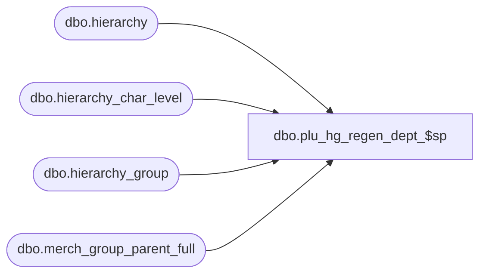

# dbo.plu_hg_regen_dept_$sp

**Database:** me_01  
**Server:** bedrockdb02  

## Architecture Diagram



## Table Dependencies

| Referenced Table |
|---|
| dbo.hierarchy |
| dbo.hierarchy_char_level |
| dbo.hierarchy_group |
| dbo.merch_group_parent_full |

## Stored Procedure Code

```sql
CREATE PROCEDURE [dbo].[plu_hg_regen_dept_$sp]
AS

DECLARE @line_id INT
		, @table_name NVARCHAR(30), @operation_name NVARCHAR(50)
		, @sql_err_num DECIMAL(38,0), @error_msg NVARCHAR(2000)
		, @error_severity SMALLINT, @error_state SMALLINT
		
/*
	Version		: 1.00
	Created		: Feb 2011
	Created by	: Sameer Patel
	Description	: Procedure called by Segment 1038 -- EDM & PROD to Price Look-Up File Generate (CRS)
				  Gets all department and department class records for hierarchy groups being regenerated
				  These will go to all locations that require a regenerate
				  
	Call from C++ code:
		-- File: PLUFileDefCommonSQLServer.cpp
		-- Class: CPLUFileDefCommonSQLServer
		-- Function: LoadFullHGRegenFileDefs
	
HISTORY:
Date       		Name         	Def#		Desc
Feb 04,11		Sameer Patel	N/A   		Initial Release
Aug 22,11		Yan Ding	129247		Should be able to renerate any merch group level
Oct 21,11		Sameer Patel	130642		unable to set flags in crs retail store plu file (fields 256 257)
Ocat 21,11		Sameer Patel	130644		Ported defect 130642 to 5.0
*/

BEGIN TRY

	SET NOCOUNT ON
	
	-- Gets all department and department class records for hierarchy groups being regenerated
	-- From a CRS to Merch mapping point of view, the CRS departments are equivalent to Merch department groups
	-- In class UI, navigate to Prod->Hierarchy->Characteristic Level Defaults; look for POS department group no.

	SET @line_id = 10
	
	INSERT INTO #dept
		(dept_id, hierarchy_level_id, pos_dept_group_key )
	SELECT DISTINCT hg.hierarchy_group_id dept_id, hg.hierarchy_level_id, hg.pos_dept_group_key
	FROM #all_hg_regen ahr
	INNER JOIN hierarchy_char_level hcl
		ON hcl.hierarchy_char_level_id = 1
	INNER JOIN merch_group_parent_full mgpf
		ON (ahr.hierarchy_group_id = mgpf.parent_hierarchy_group_id AND
			mgpf.hierarchy_level_id = hcl.pos_dept_group_key_level_id) OR
		   (ahr.hierarchy_group_id = mgpf.hierarchy_group_id AND
			mgpf.parent_hierarchy_level_id = hcl.pos_dept_group_key_level_id)
	INNER JOIN hierarchy_group hg
		ON hg.hierarchy_level_id = hcl.pos_dept_group_key_level_id
		AND (ahr.hierarchy_group_id = mgpf.parent_hierarchy_group_id AND
			 mgpf.hierarchy_level_id = hcl.pos_dept_group_key_level_id AND
			 mgpf.hierarchy_group_id = hg.hierarchy_group_id) OR
			(ahr.hierarchy_group_id = mgpf.hierarchy_group_id AND
			 mgpf.parent_hierarchy_level_id = hcl.pos_dept_group_key_level_id AND
			 mgpf.parent_hierarchy_group_id = hg.hierarchy_group_id)
	INNER JOIN hierarchy h
		ON hg.hierarchy_id = h.hierarchy_id
		AND h.hierarchy_type = 1
		AND h.alternate_flag = 0
	LEFT OUTER JOIN #all_regenerate ar
		ON ar.location_id = ahr.location_id
	WHERE ar.location_id IS NULL
	
	-- Gets all department and department class records for hierarchy groups being regenerated
	-- From a CRS to Merch mapping point of view, the CRS department classes are equivalent to Merch departments
	-- In class UI, navigate to Prod->Hierarchy->Characteristic Level Defaults; look for POS department no.	

	SET @line_id = 20
	
	INSERT INTO #dept_class
		(dept_class_id, dept_id, hierarchy_level_id, pos_merch_group_key )
	SELECT DISTINCT hg.hierarchy_group_id dept_class_id, d.dept_id, hg.hierarchy_level_id, hg.pos_merch_group_key
	FROM #all_hg_regen ahr
	INNER JOIN hierarchy_char_level hcl
		ON hcl.hierarchy_char_level_id = 1
	INNER JOIN merch_group_parent_full mgpf
		ON (ahr.hierarchy_group_id = mgpf.parent_hierarchy_group_id AND
			mgpf.hierarchy_level_id = hcl.pos_merch_group_key_level_id) OR
		   (ahr.hierarchy_group_id = mgpf.hierarchy_group_id AND
			mgpf.parent_hierarchy_level_id = hcl.pos_merch_group_key_level_id)
	INNER JOIN hierarchy_group hg
		ON hg.hierarchy_level_id = hcl.pos_merch_group_key_level_id
		AND (ahr.hierarchy_group_id = mgpf.parent_hierarchy_group_id AND
			 mgpf.hierarchy_level_id = hcl.pos_merch_group_key_level_id AND
			 mgpf.hierarchy_group_id = hg.hierarchy_group_id) OR
			(ahr.hierarchy_group_id = mgpf.hierarchy_group_id AND
			 mgpf.parent_hierarchy_level_id = hcl.pos_merch_group_key_level_id AND
			 mgpf.parent_hierarchy_group_id = hg.hierarchy_group_id)
	INNER JOIN merch_group_parent_full mgpf2
		ON hg.hierarchy_group_id = mgpf2.hierarchy_group_id
		AND mgpf2.parent_hierarchy_level_id = hcl.pos_dept_group_key_level_id
	INNER JOIN #dept d
		ON mgpf2.parent_hierarchy_group_id = d.dept_id
	INNER JOIN hierarchy h
		ON hg.hierarchy_id = h.hierarchy_id
		AND h.hierarchy_type = 1
		AND h.alternate_flag = 0
	LEFT OUTER JOIN #all_regenerate ar
		ON ar.location_id = ahr.location_id
	WHERE ar.location_id IS NULL

END TRY

BEGIN CATCH

	SELECT 
		@error_severity	= 16
		, @error_state = 1

	IF @line_id = 10
		SELECT  
			@table_name			= N'#dept'
			, @operation_name	= N'INSERT'
			, @sql_err_num		= ERROR_NUMBER()
			, @error_msg		= N'Line Id = ' + CAST(@line_id AS NVARCHAR(4)) + N' '
									+ N' Table Name = ' + @table_name + N' '
									+ N' Operation Name = ' + @operation_name + N' '
									+ N' SQL Error Number = ' + CAST(@sql_err_num AS NVARCHAR(38)) + N' '
									+ N' Error Message = ' + ERROR_MESSAGE()
									
	ELSE IF @line_id = 20
		SELECT  
			@table_name			= N'#dept_class'
			, @operation_name	= N'INSERT'
			, @sql_err_num		= ERROR_NUMBER()
			, @error_msg		= N'Line Id = ' + CAST(@line_id AS NVARCHAR(4)) + N' '
									+ N' Table Name = ' + @table_name + N' '
									+ N' Operation Name = ' + @operation_name + N' '
									+ N' SQL Error Number = ' + CAST(@sql_err_num AS NVARCHAR(38)) + N' '
									+ N' Error Message = ' + ERROR_MESSAGE()
			
	RAISERROR (@error_msg, @error_severity, @error_state)			

END CATCH
```

