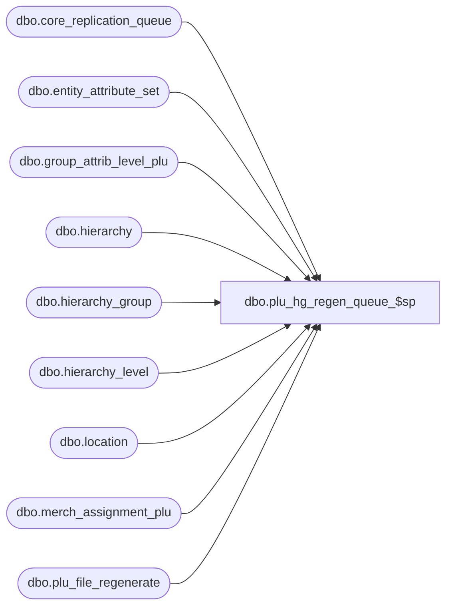

# dbo.plu_hg_regen_queue_$sp

**Database:** me_01  
**Server:** bedrockdb02  

## Architecture Diagram



## Table Dependencies

| Referenced Table |
|---|
| dbo.core_replication_queue |
| dbo.entity_attribute_set |
| dbo.group_attrib_level_plu |
| dbo.hierarchy |
| dbo.hierarchy_group |
| dbo.hierarchy_level |
| dbo.location |
| dbo.merch_assignment_plu |
| dbo.plu_file_regenerate |

## Stored Procedure Code

```sql
CREATE PROCEDURE [dbo].[plu_hg_regen_queue_$sp]
( @start_queue_id DECIMAL(12), @end_queue_id DECIMAL(12) )
AS
			
DECLARE @line_id INT
		, @table_name NVARCHAR(30), @operation_name NVARCHAR(50)
		, @sql_err_num DECIMAL(38,0), @error_msg NVARCHAR(2000)
		, @error_severity SMALLINT, @error_state SMALLINT
		
/*
	Version		: 1.00
	Created		: Feb 2011
	Created by	: Sameer Patel
	Description	: Procedure called by Segment 1038 -- EDM & PROD to Price Look-Up File Generate (CRS)
				  Determines what locations require a CRS PLU regenerate 
				  based on what is in the CRQ greater than @start_queue_id and less than @end_queue_id
				  
	Call from C++ code:
		-- File: PLUQueueDefHGRegenerate.cpp
		-- Class: CPLUQueueDefHGRegenerate
		-- Function: FullQueueSQLServer
	
HISTORY:
Date       		Name         	Def#		Desc
Feb 04,11		Sameer Patel	N/A			Initial Release
*/	

BEGIN TRY

	SET NOCOUNT ON

	-- Insert a hierarchy group regenerate entry
	-- if there is an entry for the location in the plu_file_regenerate at the levels 
	-- lower than the Merchandise Entreprise hierarchy level

	SET @line_id = 10

	INSERT INTO #all_hg_regen
		( register_type_id, location_id
		, hierarchy_group_id )
	SELECT DISTINCT
		Location.register_type_id, Location.location_id
		, PluFileRegenerate.hierarchy_group_id
	FROM
		core_replication_queue CoreReplicationQueue
	INNER JOIN plu_file_regenerate PluFileRegenerate ON CoreReplicationQueue.entity_id = PluFileRegenerate.plu_file_regenerate_id
	INNER JOIN location Location ON PluFileRegenerate.location_id = Location.location_id AND Location.generate_plu_file_flag = 1
	INNER JOIN hierarchy_group HierarchyGroup ON PluFileRegenerate.hierarchy_group_id = HierarchyGroup.hierarchy_group_id
	INNER JOIN hierarchy_level HierarchyLevel ON HierarchyGroup.hierarchy_level_id = HierarchyLevel.hierarchy_level_id AND HierarchyLevel.parent_level_id IS NOT NULL
	INNER JOIN hierarchy Hierarchy ON HierarchyLevel.hierarchy_id = Hierarchy.hierarchy_id AND Hierarchy.hierarchy_type = 1 AND Hierarchy.alternate_flag = 0 AND Hierarchy.active_flag = 1
	LEFT OUTER JOIN #all_regenerate TempRegenerate ON Location.location_id = TempRegenerate.location_id
	WHERE
		CoreReplicationQueue.core_replication_queue_id > @start_queue_id AND CoreReplicationQueue.core_replication_queue_id <= @end_queue_id
		AND CoreReplicationQueue.entity_code = 913 AND CoreReplicationQueue.replication_action = N'I'
		AND TempRegenerate.location_id IS NULL

	-- Insert a hierarchy group regenerate entry
	-- for merch assignment plu updates

	SET @line_id = 20

	INSERT INTO #all_hg_regen
		( register_type_id, location_id
		, hierarchy_group_id )
	SELECT DISTINCT
		Location.register_type_id, Location.location_id
		, MerchAssignmentPlu.hierarchy_group_id
	FROM
		core_replication_queue CoreReplicationQueue
	INNER JOIN merch_assignment_plu MerchAssignmentPlu ON CoreReplicationQueue.entity_id = MerchAssignmentPlu.merch_assignment_plu_id
	INNER JOIN group_attrib_level_plu GroupAttribLevelPlu ON MerchAssignmentPlu.parameter_group_plu_id = GroupAttribLevelPlu.parameter_group_plu_id
	INNER JOIN entity_attribute_set EntityAttributeSet ON GroupAttribLevelPlu.attribute_id = EntityAttributeSet.attribute_id AND MerchAssignmentPlu.attribute_set_id = EntityAttributeSet.attribute_set_id
											AND EntityAttributeSet.parent_type = 2
	INNER JOIN location Location ON EntityAttributeSet.parent_id = Location.location_id AND Location.generate_plu_file_flag = 1 AND Location.location_status_id <> 6
	LEFT OUTER JOIN #all_regenerate TempRegenerate ON Location.location_id = TempRegenerate.location_id
	LEFT OUTER JOIN #all_hg_regen TempHGRegenerate ON Location.location_id = TempHGRegenerate.location_id AND MerchAssignmentPlu.hierarchy_group_id = TempHGRegenerate.hierarchy_group_id
	WHERE
		CoreReplicationQueue.core_replication_queue_id > @start_queue_id AND CoreReplicationQueue.core_replication_queue_id <= @end_queue_id
		AND CoreReplicationQueue.entity_code = 910 AND CoreReplicationQueue.replication_action = N'U'
		AND TempRegenerate.location_id IS NULL AND TempHGRegenerate.location_id IS NULL
	
END TRY

BEGIN CATCH

	SELECT 
		@error_severity	= 16
		, @error_state = 1

	IF @line_id = 10
		SELECT  
			@table_name			= N'#all_hg_regen'
			, @operation_name	= N'INSERT - plu file regenerate'
			, @sql_err_num		= ERROR_NUMBER()
			, @error_msg		= N'Line Id = ' + CAST(@line_id AS NVARCHAR(4)) + N' '
									+ N' Table Name = ' + @table_name + N' '
									+ N' Operation Name = ' + @operation_name + N' '
									+ N' SQL Error Number = ' + CAST(@sql_err_num AS NVARCHAR(38)) + N' '
									+ N' Error Message = ' + ERROR_MESSAGE()

	ELSE IF @line_id = 20
		SELECT  
			@table_name			= N'#all_hg_regen'
			, @operation_name	= N'INSERT - merch assignment plu'
			, @sql_err_num		= ERROR_NUMBER()
			, @error_msg		= N'Line Id = ' + CAST(@line_id AS NVARCHAR(4)) + N' '
									+ N' Table Name = ' + @table_name + N' '
									+ N' Operation Name = ' + @operation_name + N' '
									+ N' SQL Error Number = ' + CAST(@sql_err_num AS NVARCHAR(38)) + N' '
									+ N' Error Message = ' + ERROR_MESSAGE()
			
	RAISERROR (@error_msg, @error_severity, @error_state)			

END CATCH
```

