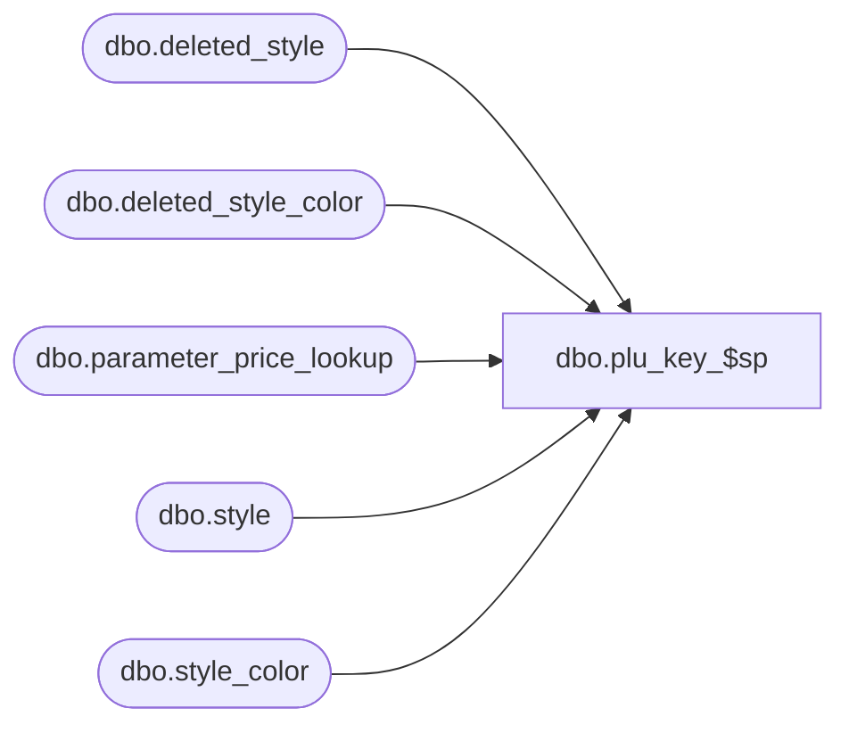

# dbo.plu_key_$sp

**Database:** me_01  
**Server:** bedrockdb02  

## Architecture Diagram



## Table Dependencies

| Referenced Table |
|---|
| dbo.deleted_style |
| dbo.deleted_style_color |
| dbo.parameter_price_lookup |
| dbo.style |
| dbo.style_color |

## Stored Procedure Code

```sql
CREATE PROCEDURE [dbo].[plu_key_$sp]
AS
			
DECLARE @line_id INT
		, @table_name NVARCHAR(30), @operation_name NVARCHAR(50)
		, @sql_err_num DECIMAL(38,0), @error_msg NVARCHAR(2000)
		, @error_severity SMALLINT, @error_state SMALLINT
		
/*
	Version		: 1.00
	Created		: Feb 2011
	Created by	: Sameer Patel
	Description	: Procedure called by Segment 1038 -- EDM & PROD to Price Look-Up File Generate (CRS)
				  Gets all style id, style color ids, and their corresponding plu_key based on the parameter in parameter_price_lookup
				  
				  If parameter_price_lookup.plu_key = 1, then the plu key is style_color_id
				  If parameter_price_lookup.plu_key = 2, then the plu key is style_code
				  
	Call from C++ code:
		-- File: PLUFileDefGlobalSQLServer.cpp
		-- Class: CPLUFileDefGlobalSQLServer
		-- Function: LoadFileDefs
		
	-- NOTE: The temp table #tb_plu_key exists
		
	IF NOT object_id('tempdb..#tb_plu_key') IS NULL
	DROP TABLE #tb_plu_key

	CREATE TABLE #tb_plu_key
		( style_id DECIMAL(12), style_color_id DECIMAL(13)
		, plu_key NVARCHAR(20)
		, PRIMARY KEY (style_id, style_color_id) )	
	
HISTORY:
Date       		Name         	Def#		Desc
Feb 04,11		Sameer Patel	N/A			Initial Release
*/	

BEGIN TRY

	SET NOCOUNT ON
	
	-- Populate #tb_plu_key table with existing styles and style colors

	SET @line_id = 10
	
	INSERT INTO #tb_plu_key 
		( style_id, style_color_id 
		, plu_key ) 
	SELECT 
		Style.style_id, StyleColor.style_color_id
		, CASE
			WHEN ParameterPriceLookup.plu_key = 2 THEN Style.style_code
			ELSE CONVERT( NVARCHAR(20), StyleColor.style_color_id )
		  END
	FROM
		style Style
	CROSS JOIN parameter_price_lookup ParameterPriceLookup
	INNER JOIN style_color StyleColor ON Style.style_id = StyleColor.style_id
	
	-- Populate #tb_plu_key table with deleted style colors for existing styles

	SET @line_id = 20
	
	INSERT INTO #tb_plu_key 
		( style_id, style_color_id 
		, plu_key ) 
	SELECT 
		Style.style_id, DeletedStyleColor.style_color_id
		, CASE
			WHEN ParameterPriceLookup.plu_key = 2 THEN Style.style_code
			ELSE CONVERT( NVARCHAR(20), DeletedStyleColor.style_color_id )
		  END
	FROM
		style Style
	CROSS JOIN parameter_price_lookup ParameterPriceLookup
	INNER JOIN deleted_style_color DeletedStyleColor ON Style.style_id = DeletedStyleColor.style_id
	
	-- Populate #tb_plu_key table with deleted styles

	SET @line_id = 30
	
	INSERT INTO #tb_plu_key 
		( style_id, style_color_id 
		, plu_key )
	SELECT 
		DeletedStyle.style_id, DeletedStyleColor.style_color_id
		, CASE
			WHEN ParameterPriceLookup.plu_key = 2 THEN DeletedStyle.style_code
			ELSE CONVERT( NVARCHAR(20), DeletedStyleColor.style_color_id )
		  END
	FROM
		deleted_style DeletedStyle
	CROSS JOIN parameter_price_lookup ParameterPriceLookup
	INNER JOIN deleted_style_color DeletedStyleColor ON DeletedStyle.style_id = DeletedStyleColor.style_id

END TRY

BEGIN CATCH

	SELECT 
		@error_severity	= 16
		, @error_state = 1

	IF @line_id = 10
		SELECT  
			@table_name			= N'#plu_key'
			, @operation_name	= N'INSERT'
			, @sql_err_num		= ERROR_NUMBER()
			, @error_msg		= N'Line Id = ' + CAST(@line_id AS NVARCHAR(4)) + N' '
									+ N' Table Name = ' + @table_name + N' '
									+ N' Operation Name = ' + @operation_name + N' '
									+ N' SQL Error Number = ' + CAST(@sql_err_num AS NVARCHAR(38)) + N' '
									+ N' Error Message = ' + ERROR_MESSAGE()

	ELSE IF @line_id = 20
		SELECT  
			@table_name			= N'#plu_key'
			, @operation_name	= N'INSERT - deleted style color'
			, @sql_err_num		= ERROR_NUMBER()
			, @error_msg		= N'Line Id = ' + CAST(@line_id AS NVARCHAR(4)) + N' '
									+ N' Table Name = ' + @table_name + N' '
									+ N' Operation Name = ' + @operation_name + N' '
									+ N' SQL Error Number = ' + CAST(@sql_err_num AS NVARCHAR(38)) + N' '
									+ N' Error Message = ' + ERROR_MESSAGE()

	ELSE IF @line_id = 30
		SELECT  
			@table_name			= N'#plu_key'
			, @operation_name	= N'INSERT - deleted style'
			, @sql_err_num		= ERROR_NUMBER()
			, @error_msg		= N'Line Id = ' + CAST(@line_id AS NVARCHAR(4)) + N' '
									+ N' Table Name = ' + @table_name + N' '
									+ N' Operation Name = ' + @operation_name + N' '
									+ N' SQL Error Number = ' + CAST(@sql_err_num AS NVARCHAR(38)) + N' '
									+ N' Error Message = ' + ERROR_MESSAGE()
			
	RAISERROR (@error_msg, @error_severity, @error_state)			

END CATCH
```

