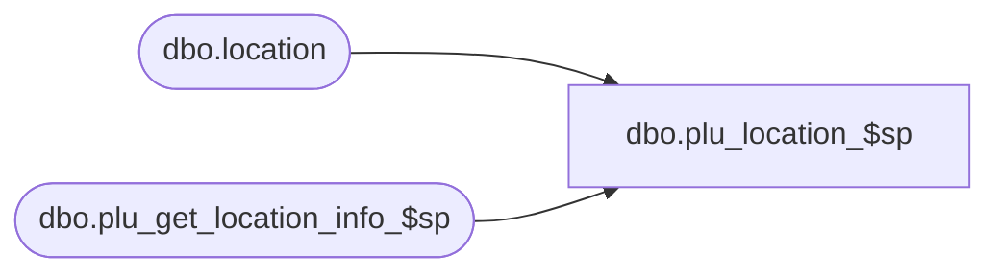

# dbo.plu_location_$sp

**Database:** me_01  
**Server:** bedrockdb02  

## Architecture Diagram



## Table Dependencies

| Referenced Table |
|---|
| dbo.location |
| dbo.plu_get_location_info_$sp |

## Stored Procedure Code

```sql
CREATE PROCEDURE [dbo].[plu_location_$sp]
(@source_type TINYINT)
AS
			
DECLARE @line_id INT
		, @table_name NVARCHAR(30), @operation_name NVARCHAR(50)
		, @sql_err_num DECIMAL(38,0), @error_msg NVARCHAR(2000)
		, @error_severity SMALLINT, @error_state SMALLINT
		
/*
	Version		: 1.00
	Created		: Feb 2011
	Created by	: Sameer Patel
	Description	: Procedure called by Segment 1038 -- EDM & PROD to Price Look-Up File Generate (CRS)
				  Populate a temp table of locations that will be regenerated
				  
	Call from C++ code:
		-- File: PLUFileDefCommonSQLServer.cpp
		-- Class: CPLUFileDefCommonSQLServer
		-- Function: LoadFullRegenFileDefs
		
	The #location temp table will be used in future procedures when retrieving permanent/promo prices 
	as well as language specific descriptions.  This work is done by location which is why we have an identity column on this table
	for the purposes of looping.
	
	Possible source types (temp tables from which I select locations:
		-- #all_regenerate
		-- #all_hg_regen
		-- location
		
	-- NOTE: The temp table #location exists

	IF NOT object_id('tempdb..#location') IS NULL
	DROP TABLE #location

	CREATE TABLE #location
		( id SMALLINT IDENTITY(1,1)
		, location_id SMALLINT, jurisdiction_id SMALLINT, pricing_group_id SMALLINT
		, language_id INT, register_type_id TINYINT
		, PRIMARY KEY (location_id, jurisdiction_id, pricing_group_id) )
	
HISTORY:
Date       		Name         	Def#		Desc
Feb 04,11		Sameer Patel	N/A			Initial Release
*/	

DECLARE @current_date AS DATETIME
SET @current_date = CAST(FLOOR(CAST(GETDATE() AS FLOAT)) AS DATETIME)

BEGIN TRY

	SET NOCOUNT ON
	
	IF @source_type = 0 -- #all_regenerate
	BEGIN
	
		-- Populate #location tables with locations requiring a full regenerate

		SET @line_id = 10

		INSERT INTO #location
			( location_id )
		SELECT
			DISTINCT
				TempRegenerate.location_id
		FROM
			#all_regenerate TempRegenerate
			
	END
	
	ELSE IF @source_type = 1 -- #all_hg_regen
	BEGIN
	
		-- Populate #location tables with locations requiring a full regenerate

		SET @line_id = 20

		INSERT INTO #location
			( location_id )
		SELECT
			DISTINCT
				TempHGRegenerate.location_id
		FROM
			#all_hg_regen TempHGRegenerate
			
	END
	
	ELSE IF @source_type = 2 -- location
	BEGIN
	
		-- Populate #location tables with locations requiring a full regenerate

		SET @line_id = 30

		INSERT INTO #location
			( location_id )
		SELECT
			Location.location_id
		FROM
			location Location
		LEFT OUTER JOIN #all_regenerate TempRegenerate ON Location.location_id = TempRegenerate.location_id
		LEFT OUTER JOIN #all_hg_regen TempHGRegenerate ON Location.location_id = TempHGRegenerate.location_id
		WHERE
			TempRegenerate.location_id IS NULL AND TempHGRegenerate.location_id IS NULL
			
	END
	
	-- Update the following information for each location using procedure plu_get_location_info_$sp:
		-- jurisdiction_id
		-- pricing_group_id
		-- language_id
	
	SET @line_id = 40
	
	EXEC plu_get_location_info_$sp

   BEGIN
         EXECUTE (N'CREATE NONCLUSTERED INDEX [IX_tloc_idx] ON dbo.#location (jurisdiction_id) INCLUDE (location_id)')
   END

END TRY

BEGIN CATCH

	SELECT 
		@error_severity	= 16
		, @error_state = 1

	IF @line_id = 10
		SELECT    
			@table_name			= N'#location'
			, @operation_name	= N'INSERT -- full regenerate'
			, @sql_err_num		= ERROR_NUMBER()
			, @error_msg		= N'Line Id = ' + CAST(@line_id AS NVARCHAR(4)) + N' '
									+ N' Table Name = ' + @table_name + N' '
									+ N' Operation Name = ' + @operation_name + N' '
									+ N' SQL Error Number = ' + CAST(@sql_err_num AS NVARCHAR(38)) + N' '
									+ N' Error Message = ' + ERROR_MESSAGE()

	ELSE IF @line_id = 20
		SELECT    
			@table_name			= N'#location'
			, @operation_name	= N'INSERT -- hg regenerate'
			, @sql_err_num		= ERROR_NUMBER()
			, @error_msg		= N'Line Id = ' + CAST(@line_id AS NVARCHAR(4)) + N' '
									+ N' Table Name = ' + @table_name + N' '
									+ N' Operation Name = ' + @operation_name + N' '
									+ N' SQL Error Number = ' + CAST(@sql_err_num AS NVARCHAR(38)) + N' '
									+ N' Error Message = ' + ERROR_MESSAGE()

	ELSE IF @line_id = 30
		SELECT    
			@table_name			= N'#location'
			, @operation_name	= N'INSERT -- all valid locations'
			, @sql_err_num		= ERROR_NUMBER()
			, @error_msg		= N'Line Id = ' + CAST(@line_id AS NVARCHAR(4)) + N' '
									+ N' Table Name = ' + @table_name + N' '
									+ N' Operation Name = ' + @operation_name + N' '
									+ N' SQL Error Number = ' + CAST(@sql_err_num AS NVARCHAR(38)) + N' '
									+ N' Error Message = ' + ERROR_MESSAGE()

	ELSE IF @line_id = 40
		SELECT  
			@table_name			= N'#location'
			, @operation_name	= N'EXEC plu_get_location_info_$sp'
			, @sql_err_num		= ERROR_NUMBER()
			, @error_msg		= N'Line Id = ' + CAST(@line_id AS NVARCHAR(4)) + N' '
									+ N' Table Name = ' + @table_name + N' '
									+ N' Operation Name = ' + @operation_name + N' '
									+ N' SQL Error Number = ' + CAST(@sql_err_num AS NVARCHAR(38)) + N' '
									+ N' Error Message = ' + ERROR_MESSAGE()
			
	RAISERROR (@error_msg, @error_severity, @error_state)			

END CATCH
```

