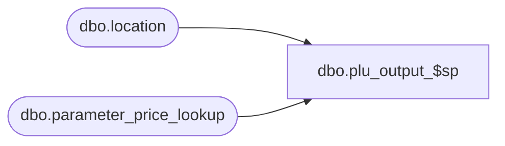

# dbo.plu_output_$sp

**Database:** me_01  
**Server:** bedrockdb02  

## Architecture Diagram



## Table Dependencies

| Referenced Table |
|---|
| dbo.location |
| dbo.parameter_price_lookup |

## Stored Procedure Code

```sql
CREATE PROCEDURE [dbo].[plu_output_$sp]
	( @server_name NVARCHAR(20)
	, @user_name NVARCHAR(20)
	, @password NVARCHAR(20))
AS
BEGIN

/*
HISTORY:
Date       		Name         	Def#		Desc
Oct 25,2011		Sameer Patel	130707		carters plu file folder and document structure needs to mirror their 4.1 environment
Oct 25,2011		Sameer Patel	130708		Ported defect 130707 to 5.0
Mar 28,2011		Sameer Patel	134073		ported defect 133983 to 5.0
*/

	DECLARE @c_CRS_file_name NVARCHAR(12) 
	SET @c_CRS_file_name = N'plu.chg'

	DECLARE 
		@error_msg NVARCHAR(2000), @line_id SMALLINT
		, @location_id SMALLINT, @file_name NVARCHAR(256)
		, @location_folder_name NVARCHAR(256)
		, @polling_folder NVARCHAR(256)
		, @backup_folder_name NVARCHAR(256)
		, @location_code NVARCHAR(20)
		, @tmp_file_name NVARCHAR(256)
		, @bcpCommand NVARCHAR(2000), @crs_file_flag BIT
		, @mkdirCommand NVARCHAR(2000)
		, @moveCopyCommand NVARCHAR(2000)
	
	SELECT @line_id = 10,
		 @crs_file_flag = 0;
		 
	BEGIN TRY
	
		SET NOCOUNT ON
		
		-- Do not execute the rest of the procedure if ##plu_temp_output has not been created
		DECLARE @object_id INTEGER
		SELECT @object_id = object_id(N'tempdb..##plu_temp_output')
		
		IF (@object_id IS NULL)
			RETURN
		
		-- Get currrent timestamp in the follwing format: yymmddhhmm	
		DECLARE @current_timestamp NVARCHAR(20)
		SELECT @current_timestamp = SUBSTRING(REPLACE(CONVERT(NVARCHAR, GETDATE(), 11), N'/', N'') 
															+ REPLACE(CONVERT(NVARCHAR, GETDATE(), 108), N':', N''), 1, 10)

		-- Set up a cursor that will loop through any distinct location in our output table
		DECLARE crs_file CURSOR FOR
		SELECT DISTINCT location_id FROM ##plu_temp_output-- WHERE row_data IS NOT NULL
		ORDER BY location_id

		OPEN crs_file
		SET @crs_file_flag = 1

		-- Perform the first fetch.
		FETCH NEXT FROM crs_file INTO @location_id;

		-- Check @@FETCH_STATUS to see if there are any more rows to fetch.
		WHILE @@FETCH_STATUS = 0
		BEGIN

			SELECT
				@file_name = param.main_directory 
									+ N'\' + CONVERT(NVARCHAR, l.location_id) + N'_' + l.location_name 
									+ N'\' + RIGHT(REPLICATE(N'0', 4) + CAST(l.polling_reference AS NVARCHAR), 4) + N'.' + @c_CRS_file_name + N'.' + @current_timestamp
				, @location_folder_name = param.main_directory 
														+ N'\' + CONVERT(NVARCHAR, l.location_id) + N'_' + l.location_name
				, @polling_folder = param.main_directory + N'\Polling'
				, @backup_folder_name = param.backup_directory_pipeline 
												+ N'\' + CONVERT(NVARCHAR, l.location_id) + N'_' + l.location_name 
				, @location_code = l.location_code
			FROM
				location l
			CROSS JOIN parameter_price_lookup param
			WHERE
				l.location_id = @location_id

			SET @mkdirCommand = N'if not exist "' + @backup_folder_name
									+ N'" mkdir "' + @backup_folder_name + N'"'
			EXEC master..xp_cmdshell @mkdirCommand
			
			SET @mkdirCommand = N'if not exist "' + @polling_folder
									+ N'" mkdir "' + @polling_folder + N'"'	
			EXEC master..xp_cmdshell @mkdirCommand
			
			SET @mkdirCommand = N'if not exist "' + @location_folder_name
									+ N'" mkdir "' + @location_folder_name + N'"'
			EXEC master..xp_cmdshell @mkdirCommand	
						
			SET @bcpCommand = N'bcp "SELECT row_data FROM ##plu_temp_output WHERE location_id = ' + CAST(@location_id AS NVARCHAR) + N' AND LEN(row_data) > 0 ORDER BY export_order, temp_output_id" queryout '
			SET @bcpCommand = @bcpCommand + N'"' + @file_name + N'"' + N' -c -U' + @user_name + N' -P' + @password + N' -S' + @server_name
			
			-- PRINT @bcpCommand
			-- This is executed as long as the previous fetch succeeds.
			SELECT 		@bcpCommand
			EXEC master..xp_cmdshell @bcpCommand
			
			SET @moveCopyCommand = N'copy /y "' + @file_name + N'" "' + @polling_folder
			EXEC master..xp_cmdshell @moveCopyCommand
			
			SET @moveCopyCommand = N'move /y "' + @file_name + N'" "' + @backup_folder_name
			EXEC master..xp_cmdshell @moveCopyCommand
			
			SET @file_name = NULL;
			SET @bcpCommand = NULL;
			SET @mkdirCommand = NULL;
			SET @moveCopyCommand = NULL;
			
		   FETCH NEXT FROM crs_file INTO @location_id;
		   
		END

		CLOSE crs_file;
		DEALLOCATE crs_file;
		SET @crs_file_flag = 0;
		
		TRUNCATE TABLE ##plu_temp_output

	END TRY

	BEGIN CATCH		
		IF (@crs_file_flag = 1)
		BEGIN
			CLOSE crs_file;
			DEALLOCATE crs_file;
		 END
		 	
		SET @error_msg = N'Error in procedure plu_output_$sp, line : ' + CAST(@line_id AS NVARCHAR(3)) + N' SQL Server error is : ' + CAST(ERROR_NUMBER() AS NVARCHAR) + N' ' + ERROR_MESSAGE()
		
		RAISERROR (@error_msg, -- Message text.
               16, -- Severity.
               1) -- State.
	END CATCH
END
```

