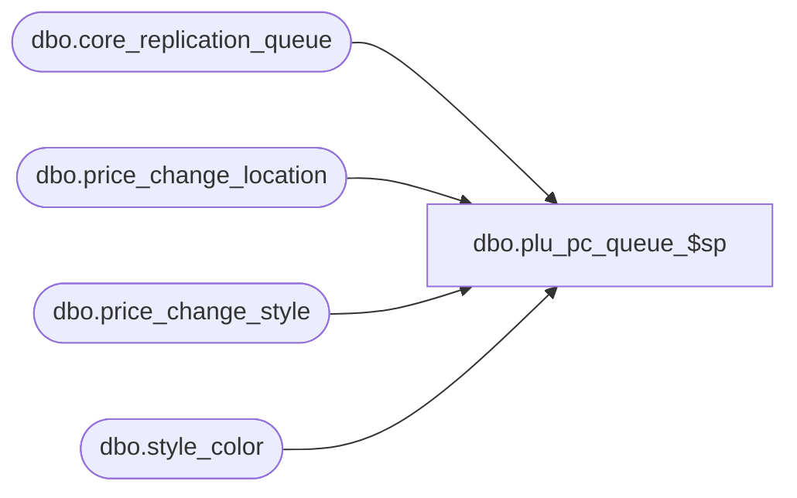

# dbo.plu_pc_queue_$sp

**Database:** me_01  
**Server:** bedrockdb02  

## Architecture Diagram



## Table Dependencies

| Referenced Table |
|---|
| dbo.core_replication_queue |
| dbo.price_change_location |
| dbo.price_change_style |
| dbo.style_color |

## Stored Procedure Code

```sql
CREATE PROCEDURE [dbo].[plu_pc_queue_$sp]
( @start_queue_id DECIMAL(12), @end_queue_id DECIMAL(12) )
AS
			
DECLARE @line_id INT
		, @table_name NVARCHAR(30), @operation_name NVARCHAR(50)
		, @sql_err_num DECIMAL(38,0), @error_msg NVARCHAR(2000)
		, @error_severity SMALLINT, @error_state SMALLINT
		
/*
	Version		: 1.00
	Created		: Feb 2011
	Created by	: Sameer Patel
	Description	: Procedure called by Segment 1038 -- EDM & PROD to Price Look-Up File Generate (CRS)
				  Determines what style colors to send to PLU
				  based on what is in the CRQ greater than @start_queue_id and less than @end_queue_id
				  
	Call from C++ code:
		-- File: PLUQueueDefStyleColorResend.cpp
		-- Class: CPLUQueueDefStyleColorResend
		-- Function: FullQueueSQLServer
		
	We're going to use entity code 931 instead of 915
	Price changes and promos essentially are style color resends, so we could essentially use the same queue (temp table)
	
HISTORY:
Date       		Name         	Def#		Desc
Feb 04,11		Sameer Patel	N/A			Initial Release
*/	

BEGIN TRY

	SET NOCOUNT ON
	
	SET @line_id = 10
	
	INSERT INTO #style_color_locations
		( style_id, style_color_id, color_id
		, location_id )
	SELECT
		DISTINCT
			StyleColor.style_id, StyleColor.style_color_id, StyleColor.color_id
			, PriceChangeLocation.location_id
	FROM
		core_replication_queue CoreReplicationQueue
	INNER JOIN price_change_style PriceChangeStyle ON CoreReplicationQueue.entity_id = PriceChangeStyle.price_change_id
	INNER JOIN price_change_location PriceChangeLocation ON CoreReplicationQueue.entity_id = PriceChangeLocation.price_change_id
	INNER JOIN style_color StyleColor ON PriceChangeStyle.style_id = StyleColor.style_id
	LEFT OUTER JOIN #all_style_color_resend StyleColorResend ON StyleColor.style_color_id = StyleColorResend.style_color_id
	WHERE
		CoreReplicationQueue.core_replication_queue_id > @start_queue_id AND CoreReplicationQueue.core_replication_queue_id <= @end_queue_id
		AND CoreReplicationQueue.entity_code = 931 AND CoreReplicationQueue.replication_action IN (N'I', N'U', N'C')
		AND StyleColorResend.style_color_id IS NULL

	-- Insert a resend entry
	-- for styles on price changes
	
	SET @line_id = 20		
	
	INSERT INTO #all_style_color_resend
		( style_id, style_color_id
		, color_id )
	SELECT
		DISTINCT
			style_id, style_color_id
			, color_id
	FROM
		#style_color_locations

END TRY

BEGIN CATCH

	SELECT 
		@error_severity	= 16
		, @error_state = 1

	IF @line_id = 10
		SELECT  
			@table_name			= N'#style_color_locations'
			, @operation_name	= N'INSERT'
			, @sql_err_num		= ERROR_NUMBER()
			, @error_msg		= N'Line Id = ' + CAST(@line_id AS NVARCHAR(4)) + N' '
									+ N' Table Name = ' + @table_name + N' '
									+ N' Operation Name = ' + @operation_name + N' '
									+ N' SQL Error Number = ' + CAST(@sql_err_num AS NVARCHAR(38)) + N' '
									+ N' Error Message = ' + ERROR_MESSAGE()

	ELSE IF @line_id = 20
		SELECT  
			@table_name			= N'#all_style_color_resend'
			, @operation_name	= N'INSERT - price change'
			, @sql_err_num		= ERROR_NUMBER()
			, @error_msg		= N'Line Id = ' + CAST(@line_id AS NVARCHAR(4)) + N' '
									+ N' Table Name = ' + @table_name + N' '
									+ N' Operation Name = ' + @operation_name + N' '
									+ N' SQL Error Number = ' + CAST(@sql_err_num AS NVARCHAR(38)) + N' '
									+ N' Error Message = ' + ERROR_MESSAGE()
			
	RAISERROR (@error_msg, @error_severity, @error_state)			

END CATCH
```

