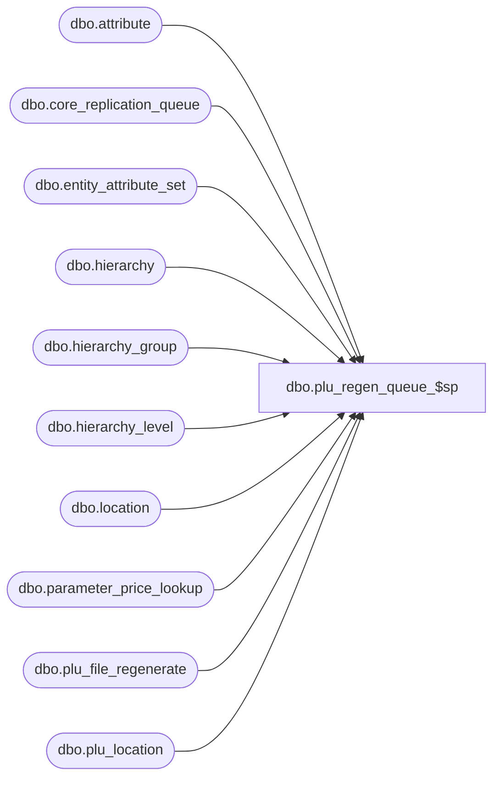

# dbo.plu_regen_queue_$sp

**Database:** me_01  
**Server:** bedrockdb02  

## Architecture Diagram



## Table Dependencies

| Referenced Table |
|---|
| dbo.attribute |
| dbo.core_replication_queue |
| dbo.entity_attribute_set |
| dbo.hierarchy |
| dbo.hierarchy_group |
| dbo.hierarchy_level |
| dbo.location |
| dbo.parameter_price_lookup |
| dbo.plu_file_regenerate |
| dbo.plu_location |

## Stored Procedure Code

```sql
CREATE PROCEDURE [dbo].[plu_regen_queue_$sp]
( @start_queue_id DECIMAL(12), @end_queue_id DECIMAL(12) )
AS
			
DECLARE @line_id INT
		, @table_name NVARCHAR(30), @operation_name NVARCHAR(50)
		, @sql_err_num DECIMAL(38,0), @error_msg NVARCHAR(2000)
		, @error_severity SMALLINT, @error_state SMALLINT
		
/*
	Version		: 1.00
	Created		: Feb 2011
	Created by	: Sameer Patel
	Description	: Procedure called by Segment 1038 -- EDM & PROD to Price Look-Up File Generate (CRS)
				  Determines what locations require a CRS PLU regenerate 
				  based on what is in the CRQ greater than @start_queue_id and less than @end_queue_id
				  
	Call from C++ code:
		-- File: PLUQueueDefFullTempRegenerate.cpp
		-- Class: CPLUQueueDefFullTempRegenerate
		-- Function: FullQueueSQLServer
	
HISTORY:
Date       		Name         	Def#		Desc
Feb 04,11		Sameer Patel	N/A			Initial Release
*/			

BEGIN TRY

	SET NOCOUNT ON

	-- Insert a regenerate entry
	-- if the plu ownership attribute for this location has been changed

	SET @line_id = 10
	
	INSERT INTO #all_regenerate
		( register_type_id, location_id )
	SELECT 
		DISTINCT Location.register_type_id
		, Location.location_id 
	FROM 
		core_replication_queue CoreReplicationQueue
		, location Location
		, entity_attribute_set EntityAttributeSet
		, attribute StyleAttribute
		, attribute LocationAttribute
		, parameter_price_lookup ParametePriceLookup
	WHERE
		CoreReplicationQueue.core_replication_queue_id > @start_queue_id AND CoreReplicationQueue.core_replication_queue_id <= @end_queue_id
		AND CoreReplicationQueue.entity_code = 511 AND CoreReplicationQueue.replication_action = N'U'
		AND EntityAttributeSet.entity_attribute_set_id = CoreReplicationQueue.entity_id
		AND EntityAttributeSet.parent_type = 2 
		AND EntityAttributeSet.parent_id = Location.location_id 
		AND EntityAttributeSet.attribute_id = LocationAttribute.attribute_id 
		AND (LocationAttribute.attribute_id = ParametePriceLookup.shared_attribute_id  
					OR StyleAttribute.attribute_id = ParametePriceLookup.shared_attribute_id)
		AND StyleAttribute.parent_type = 1
		AND Location.generate_plu_file_flag = 1 AND Location.active_flag = 1
		AND LocationAttribute.parent_type = 2
		AND StyleAttribute.attribute_code = LocationAttribute.attribute_code

	-- Insert a regenerate entry
	-- if the location has been created or updated and the location has not already generated a PLU file

	SET @line_id = 20
	
	INSERT INTO #all_regenerate
		( register_type_id, location_id )
	SELECT
		DISTINCT Location.register_type_id, Location.location_id
	FROM
		core_replication_queue CoreReplicationQueue
	INNER JOIN location Location ON CoreReplicationQueue.entity_id = Location.location_id AND Location.generate_plu_file_flag = 1 AND Location.active_flag = 1
	LEFT OUTER JOIN plu_location PluLocation ON Location.location_id = PluLocation.location_id
	LEFT OUTER JOIN #all_regenerate TempRegenerate ON Location.location_id = TempRegenerate.location_id
	WHERE
		CoreReplicationQueue.core_replication_queue_id > @start_queue_id AND CoreReplicationQueue.core_replication_queue_id <= @end_queue_id
		AND CoreReplicationQueue.entity_code = 101 AND CoreReplicationQueue.replication_action IN (N'I', N'U')
		AND PluLocation.location_id IS NULL AND TempRegenerate.location_id IS NULL

	-- Insert a regenerate entry
	-- if location reopened
	-- if register_type_id is changed
	-- if location reopened

	SET @line_id = 30
	
	INSERT INTO #all_regenerate
		( register_type_id, location_id )
	SELECT
		DISTINCT Location.register_type_id, Location.location_id
	FROM
		core_replication_queue CoreReplicationQueue
	INNER JOIN location Location ON CoreReplicationQueue.entity_id = Location.location_id AND Location.generate_plu_file_flag = 1 AND Location.active_flag = 1
	INNER JOIN plu_location PluLocation ON Location.location_id = PluLocation.location_id
	LEFT OUTER JOIN #all_regenerate TempRegenerate ON Location.location_id = TempRegenerate.location_id
	WHERE
		CoreReplicationQueue.core_replication_queue_id > @start_queue_id AND CoreReplicationQueue.core_replication_queue_id <= @end_queue_id
		AND CoreReplicationQueue.entity_code = 101 AND CoreReplicationQueue.replication_action IN (N'I', N'U')
		AND ( Location.generate_plu_file_flag != PluLocation.generate_plu_file_flag
					OR Location.register_type_id != PluLocation.register_type_id
					OR (Location.location_status_id IN (4,5) AND PluLocation.location_status_id IN (4,5)) )
		AND TempRegenerate.location_id IS NULL

	-- Insert a regenerate entry
	-- if there is an entry for the location in the plu_file_regenerate at the Merchandise Entreprise hierarchy level

	SET @line_id = 40
	
	INSERT INTO #all_regenerate
		( register_type_id, location_id )
	SELECT
		DISTINCT Location.register_type_id, Location.location_id
	FROM
		core_replication_queue CoreReplicationQueue
	INNER JOIN plu_file_regenerate PluFileTempRegenerate ON CoreReplicationQueue.entity_id = PluFileTempRegenerate.plu_file_regenerate_id
	INNER JOIN location Location ON PluFileTempRegenerate.location_id = Location.location_id AND Location.generate_plu_file_flag = 1 AND Location.active_flag = 1
	INNER JOIN hierarchy_group HierarchyGroup ON PluFileTempRegenerate.hierarchy_group_id = HierarchyGroup.hierarchy_group_id
	INNER JOIN hierarchy_level HierarchyLevel ON HierarchyGroup.hierarchy_level_id = HierarchyLevel.hierarchy_level_id AND HierarchyLevel.parent_level_id IS NULL
	INNER JOIN hierarchy Hierarchy ON HierarchyLevel.hierarchy_id = Hierarchy.hierarchy_id AND Hierarchy.hierarchy_type = 1 AND Hierarchy.alternate_flag = 0 AND Hierarchy.active_flag = 1
	LEFT OUTER JOIN #all_regenerate TempRegenerate ON Location.location_id = TempRegenerate.location_id
	WHERE
		CoreReplicationQueue.core_replication_queue_id > @start_queue_id AND CoreReplicationQueue.core_replication_queue_id <= @end_queue_id
		AND CoreReplicationQueue.entity_code = 913 AND CoreReplicationQueue.replication_action IN (N'I')
		AND TempRegenerate.location_id IS NULL
	

END TRY

BEGIN CATCH

	SELECT 
		@error_severity	= 16
		, @error_state = 1

	IF @line_id = 10
		SELECT  
			@table_name			= N'#all_regenerate'
			, @operation_name	= N'INSERT - regen plu ownership'
			, @sql_err_num		= ERROR_NUMBER()
			, @error_msg		= N'Line Id = ' + CAST(@line_id AS NVARCHAR(4)) + N' '
									+ N' Table Name = ' + @table_name + N' '
									+ N' Operation Name = ' + @operation_name + N' '
									+ N' SQL Error Number = ' + CAST(@sql_err_num AS NVARCHAR(38)) + N' '
									+ N' Error Message = ' + ERROR_MESSAGE()

	ELSE IF @line_id = 20
		SELECT  
			@table_name			= N'#all_regenerate'
			, @operation_name	= N'INSERT - location insert/update'
			, @sql_err_num		= ERROR_NUMBER()
			, @error_msg		= N'Line Id = ' + CAST(@line_id AS NVARCHAR(4)) + N' '
									+ N' Table Name = ' + @table_name + N' '
									+ N' Operation Name = ' + @operation_name + N' '
									+ N' SQL Error Number = ' + CAST(@sql_err_num AS NVARCHAR(38)) + N' '
									+ N' Error Message = ' + ERROR_MESSAGE()

	ELSE IF @line_id = 30
		SELECT  
			@table_name			= N'#all_regenerate'
			, @operation_name	= N'INSERT - flag/reg/reopen'
			, @sql_err_num		= ERROR_NUMBER()
			, @error_msg		= N'Line Id = ' + CAST(@line_id AS NVARCHAR(4)) + N' '
									+ N' Table Name = ' + @table_name + N' '
									+ N' Operation Name = ' + @operation_name + N' '
									+ N' SQL Error Number = ' + CAST(@sql_err_num AS NVARCHAR(38)) + N' '
									+ N' Error Message = ' + ERROR_MESSAGE()

	ELSE IF @line_id = 40
		SELECT  
			@table_name			= N'#all_regenerate'
			, @operation_name	= N'INSERT - plu file regenerate'
			, @sql_err_num		= ERROR_NUMBER()
			, @error_msg		= N'Line Id = ' + CAST(@line_id AS NVARCHAR(4)) + N' '
									+ N' Table Name = ' + @table_name + N' '
									+ N' Operation Name = ' + @operation_name + N' '
									+ N' SQL Error Number = ' + CAST(@sql_err_num AS NVARCHAR(38)) + N' '
									+ N' Error Message = ' + ERROR_MESSAGE()
			
	RAISERROR (@error_msg, @error_severity, @error_state)			

END CATCH
```

