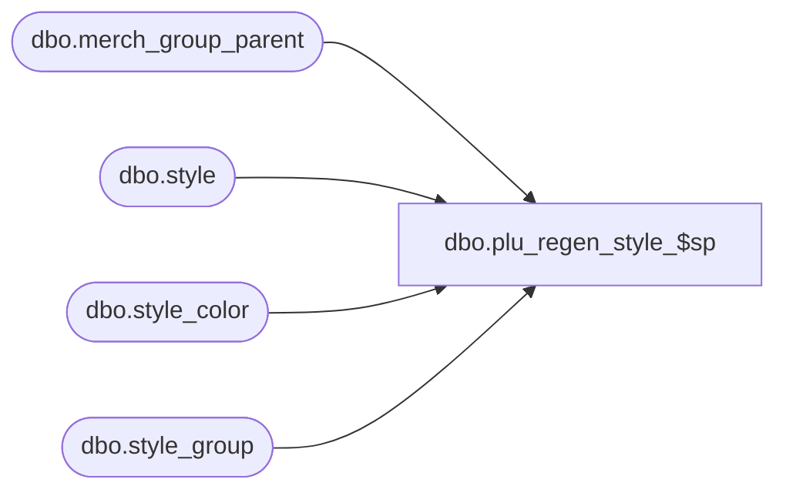

# dbo.plu_regen_style_$sp

**Database:** me_01  
**Server:** bedrockdb02  

## Architecture Diagram



## Table Dependencies

| Referenced Table |
|---|
| dbo.merch_group_parent |
| dbo.style |
| dbo.style_color |
| dbo.style_group |

## Stored Procedure Code

```sql
CREATE PROCEDURE [dbo].[plu_regen_style_$sp]
AS

DECLARE @line_id INT
		, @table_name NVARCHAR(30), @operation_name NVARCHAR(50)
		, @sql_err_num DECIMAL(38,0), @error_msg NVARCHAR(2000)
		, @error_severity SMALLINT, @error_state SMALLINT
		
/*
	Version		: 1.00
	Created		: Feb 2011
	Created by	: Sameer Patel
	Description	: Procedure called by Segment 1038 -- EDM & PROD to Price Look-Up File Generate (CRS)
				  Gets all ordered style records
				  These will go to all locations that require a regenerate
				  
	Call from C++ code:
		-- File: PLUFileDefCommonSQLServer.cpp
		-- Class: CPLUFileDefCommonSQLServer
		-- Function: LoadFullRegenFileDefs
		
	-- NOTE: The temp table #style, #dept, #dept_class and #tb_plu_key exist
	
	IF NOT object_id('tempdb..#style') IS NULL
	DROP TABLE #style

	CREATE TABLE #style
		( style_id DECIMAL(12), style_color_id DECIMAL(13), color_id SMALLINT
		, dept_id INT, dept_class_id INT
		, style_type TINYINT
		, plu_key NVARCHAR(20)
		, description NVARCHAR(24)
		, retail_price DECIMAL(14,2), style_location_retail_price DECIMAL(14,2)
		, PRIMARY KEY (style_id, style_color_id, color_id, dept_class_id) )
	
	IF NOT object_id('tempdb..#dept') IS NULL
	DROP TABLE #dept

	CREATE TABLE #dept
		( hierarchy_group_id INT, hierarchy_level_id INT
		, pos_dept_group_key NVARCHAR(10)
		, dept_no NVARCHAR(4)
		, description NVARCHAR(40)
		, PRIMARY KEY (hierarchy_group_id) )
	
	IF NOT object_id('tempdb..#dept') IS NULL
	DROP TABLE #dept_class

	CREATE TABLE #dept_class
		( hierarchy_group_id INT, hierarchy_level_id INT
		, pos_merch_group_key INT
		, description NVARCHAR(40)
		, PRIMARY KEY (hierarchy_group_id) )
		
	IF NOT object_id('tempdb..#tb_plu_key') IS NULL
	DROP TABLE #tb_plu_key

	CREATE TABLE #tb_plu_key
		( style_id DECIMAL(12), style_color_id DECIMAL(13)
		, plu_key NVARCHAR(20)
		, PRIMARY KEY (style_id, style_color_id) )		
	
HISTORY:
Date       		Name         		Def#		Desc
Feb 04,11		Sameer Patel		N/A		Initial Release
June 27, 2011	Pierrette Lemay	127696	If the table is not empty when this procedure runs then we could get:
														Cannot insert duplicate key in object 'dbo.#style_color_locations'
July 19, 2011	Sameer Patel		128576	Undid fix for defect 127696
														segment 1038 errors on regenerate
														/* 
														The following error appears in the CRSFileGen.err log after running segment 1038: 
														07/19/11 11:29:43 : Error Encountered in SQL : EXEC plu_regen_style_$sp 
														07/19/11 11:29:43 : Error code: 80040e14(IDispatch error #3092) Description: [Microsoft OLE DB Provider for SQL Server]Line Id = 20 Table Name = #style_color_locations Operation Name = INSERT - regen SQL Error Number = 2627 Error Message = Violation of PRIMARY KEY constraint 'PK__#style_c__B452D42B3587F3E0'. Cannot insert duplicate key in object 'dbo.#style_color_locations'. 

														This error occurred while testing a regenerate scenario; however, the error actually occurs because of a regenerate and price change entry in the core replication queue within the range of IDs that the segment processed. 
														*/
*/

BEGIN TRY

	SET NOCOUNT ON

	-- Gets all ordered style records
	-- Join to existing temp tables #dept and #dept_class to get department and department class
	
	SET @line_id = 10	
	
	INSERT INTO #style
		( style_id, style_color_id, color_id
		, dept_id, dept_class_id
		, style_type
		, plu_key )
	SELECT
		DISTINCT
			PluKey.style_id, PluKey.style_color_id, StyleColor.color_id
			, DeptClass.dept_id, DeptClass.dept_class_id dept_class_id
			, Style.style_type
			, PluKey.plu_key
	FROM
		style Style
	INNER JOIN style_group StyleGroup ON Style.style_id = StyleGroup.style_id AND StyleGroup.main_group_flag = 1
	INNER JOIN ( merch_group_parent DeptClassMerchGroupParent 
					INNER JOIN #dept_class DeptClass ON DeptClassMerchGroupParent.parent_hierarchy_group_id = DeptClass.dept_class_id
															AND DeptClassMerchGroupParent.hierarchy_level_id = DeptClass.hierarchy_level_id ) ON StyleGroup.hierarchy_group_id = DeptClassMerchGroupParent.hierarchy_group_id
	INNER JOIN #tb_plu_key PluKey ON Style.style_id = PluKey.style_id
	INNER JOIN style_color StyleColor ON PluKey.style_color_id = StyleColor.style_color_id AND PluKey.style_id = StyleColor.style_id
	WHERE
		Style.style_status >= 3
		
	-- We need an entry for all styles in #style
	-- for the locations being regenerated
	
	SET @line_id = 20
	
	INSERT INTO #style_color_locations
		( style_id, style_color_id, color_id
		, location_id )
	SELECT
		DISTINCT
			TempStyle.style_id, TempStyle.style_color_id, TempStyle.color_id
			, TempRegenerate.location_id
	FROM
		#style TempStyle
	CROSS JOIN #all_regenerate TempRegenerate
	LEFT OUTER JOIN #style_color_locations TempStyleColorLocations ON TempStyle.style_id = TempStyleColorLocations.style_id AND TempStyle.style_color_id = TempStyleColorLocations.style_color_id
																		AND TempRegenerate.location_id = TempStyleColorLocations.location_id
	WHERE
		TempStyleColorLocations.style_color_id IS NULL
	
	SET @line_id = 30
	
	INSERT INTO #style_color_locations
		( style_id, style_color_id, color_id
		, location_id )
	SELECT
		DISTINCT
			TempStyle.style_id, TempStyle.style_color_id, TempStyle.color_id
			, TempHGRegenerate.location_id
	FROM
		#style TempStyle
	CROSS JOIN #all_hg_regen TempHGRegenerate
	LEFT OUTER JOIN #style_color_locations TempStyleColorLocations ON TempStyle.style_id = TempStyleColorLocations.style_id AND TempStyle.style_color_id = TempStyleColorLocations.style_color_id
																		AND TempHGRegenerate.location_id = TempStyleColorLocations.location_id
	WHERE
		TempStyleColorLocations.style_color_id IS NULL
		
END TRY

BEGIN CATCH

	SELECT 
		@error_severity	= 16
		, @error_state = 1

	IF @line_id = 10
		SELECT  
			@table_name			= N'#style'
			, @operation_name	= N'INSERT'
			, @sql_err_num		= ERROR_NUMBER()
			, @error_msg		= N'Line Id = ' + CAST(@line_id AS NVARCHAR(4)) + N' '
									+ N' Table Name = ' + @table_name + N' '
									+ N' Operation Name = ' + @operation_name + N' '
									+ N' SQL Error Number = ' + CAST(@sql_err_num AS NVARCHAR(38)) + N' '
									+ N' Error Message = ' + ERROR_MESSAGE()

	ELSE IF @line_id = 20
		SELECT  
			@table_name			= N'#style_color_locations'
			, @operation_name	= N'INSERT - regen'
			, @sql_err_num		= ERROR_NUMBER()
			, @error_msg		= N'Line Id = ' + CAST(@line_id AS NVARCHAR(4)) + N' '
									+ N' Table Name = ' + @table_name + N' '
									+ N' Operation Name = ' + @operation_name + N' '
									+ N' SQL Error Number = ' + CAST(@sql_err_num AS NVARCHAR(38)) + N' '
									+ N' Error Message = ' + ERROR_MESSAGE()

	ELSE IF @line_id = 30
		SELECT  
			@table_name			= N'#style_color_locations'
			, @operation_name	= N'INSERT - hg regen'
			, @sql_err_num		= ERROR_NUMBER()
			, @error_msg		= N'Line Id = ' + CAST(@line_id AS NVARCHAR(4)) + N' '
									+ N' Table Name = ' + @table_name + N' '
									+ N' Operation Name = ' + @operation_name + N' '
									+ N' SQL Error Number = ' + CAST(@sql_err_num AS NVARCHAR(38)) + N' '
									+ N' Error Message = ' + ERROR_MESSAGE()
			
	RAISERROR (@error_msg, @error_severity, @error_state)			

END CATCH
```

