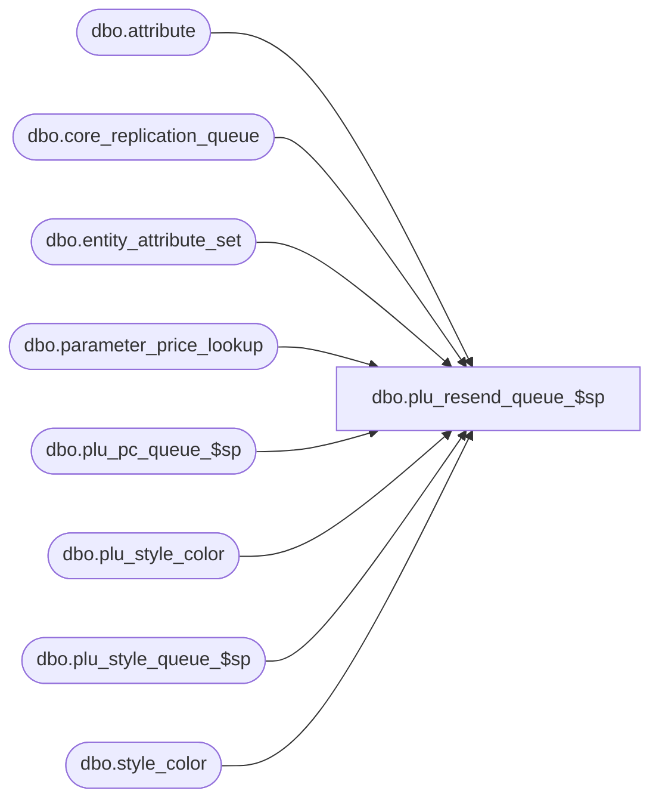

# dbo.plu_resend_queue_$sp

**Database:** me_01  
**Server:** bedrockdb02  

## Architecture Diagram



## Table Dependencies

| Referenced Table |
|---|
| dbo.attribute |
| dbo.core_replication_queue |
| dbo.entity_attribute_set |
| dbo.parameter_price_lookup |
| dbo.plu_pc_queue_$sp |
| dbo.plu_style_color |
| dbo.plu_style_queue_$sp |
| dbo.style_color |

## Stored Procedure Code

```sql
CREATE PROCEDURE [dbo].[plu_resend_queue_$sp]
( @start_queue_id DECIMAL(12), @end_queue_id DECIMAL(12) )
AS
			
DECLARE @line_id INT
		, @table_name NVARCHAR(30), @operation_name NVARCHAR(50)
		, @sql_err_num DECIMAL(38,0), @error_msg NVARCHAR(2000)
		, @error_severity SMALLINT, @error_state SMALLINT
		
/*
	Version		: 1.00
	Created		: Feb 2011
	Created by	: Sameer Patel
	Description	: Procedure called by Segment 1038 -- EDM & PROD to Price Look-Up File Generate (CRS)
				  Determines what style colors to send to PLU
				  based on what is in the CRQ greater than @start_queue_id and less than @end_queue_id
				  
	Call from C++ code:
		-- File: PLUQueueDefStyleColorResend.cpp
		-- Class: CPLUQueueDefStyleColorResend
		-- Function: FullQueueSQLServer
	
HISTORY:
Date       		Name         	Def#		Desc
Feb 04,11		Sameer Patel	N/A			Initial Release
*/	
		
DECLARE @style_shared_attribute_code NVARCHAR(6)

BEGIN TRY

	SET NOCOUNT ON

	SET @line_id = 5
	
	SELECT 
		@style_shared_attribute_code = a.attribute_code 
	FROM 
		attribute a
	INNER JOIN parameter_price_lookup param ON a.attribute_id = param.shared_attribute_id

	-- Insert a resend entry
	-- if there is a 925 entry for a style in the CRQ

	SET @line_id = 10
	
	INSERT INTO #all_style_color_resend
		( style_id, style_color_id
		, color_id )
	SELECT
		DISTINCT
			StyleColor.style_id, StyleColor.style_color_id
			, StyleColor.color_id
	FROM
		core_replication_queue CoreReplicationQueue
	INNER JOIN style_color StyleColor ON CoreReplicationQueue.entity_id = StyleColor.style_id
	WHERE
		CoreReplicationQueue.core_replication_queue_id > @start_queue_id AND CoreReplicationQueue.core_replication_queue_id <= @end_queue_id
		AND CoreReplicationQueue.entity_code = 925 AND CoreReplicationQueue.replication_action = N'I'

	-- Insert a resend entry
	-- if there is a 311 entry for a style color in the CRQ
	-- and if it does not already exist in plu_style_color

	SET @line_id = 20
	
	INSERT INTO #all_style_color_resend
		( style_id, style_color_id
		, color_id )
	SELECT
		DISTINCT
			StyleColor.style_id, StyleColor.style_color_id
			, StyleColor.color_id
	FROM
		core_replication_queue CoreReplicationQueue
	INNER JOIN style_color StyleColor ON CoreReplicationQueue.entity_id = StyleColor.style_color_id
	LEFT OUTER JOIN plu_style_color PluStyleColor ON StyleColor.style_color_id = PluStyleColor.style_color_id
	LEFT OUTER JOIN #all_style_color_resend StyleColorResend ON StyleColor.style_color_id = StyleColorResend.style_color_id
	WHERE
		CoreReplicationQueue.core_replication_queue_id > @start_queue_id AND CoreReplicationQueue.core_replication_queue_id <= @end_queue_id
		AND CoreReplicationQueue.entity_code = 311 AND CoreReplicationQueue.replication_action = N'I'
		AND PluStyleColor.style_color_id IS NULL AND StyleColorResend.style_color_id IS NULL

	-- Insert a resend entry
	-- if ownsership attribute for a style color has changed

	SET @line_id = 30
	
	INSERT INTO #all_style_color_resend
		( style_id, style_color_id
		, color_id )
	SELECT
		DISTINCT
			StyleColor.style_id, StyleColor.style_color_id
			, StyleColor.color_id
	FROM
		core_replication_queue CoreReplicationQueue
	INNER JOIN entity_attribute_set EntityAttributeSet ON CoreReplicationQueue.entity_id = EntityAttributeSet.attribute_set_id AND EntityAttributeSet.parent_type = 2
	INNER JOIN style_color StyleColor ON EntityAttributeSet.parent_id = StyleColor.style_id
	INNER JOIN attribute Attribute ON EntityAttributeSet.attribute_id = Attribute.attribute_id AND Attribute.parent_type = 1 
								AND Attribute.attribute_code = @style_shared_attribute_code
	LEFT OUTER JOIN #all_style_color_resend StyleColorResend ON StyleColor.style_color_id = StyleColorResend.style_color_id
	WHERE
		CoreReplicationQueue.core_replication_queue_id > @start_queue_id AND CoreReplicationQueue.core_replication_queue_id <= @end_queue_id
		AND CoreReplicationQueue.entity_code = 512 AND CoreReplicationQueue.replication_action = N'U'
		AND StyleColorResend.style_color_id IS NULL

	-- Handle style update queue

	SET @line_id = 40
	
	EXEC plu_style_queue_$sp @start_queue_id, @end_queue_id

	-- Handle price change queue (promos or permanents)

	SET @line_id = 50
	
	EXEC plu_pc_queue_$sp @start_queue_id, @end_queue_id

END TRY

BEGIN CATCH

	SELECT 
		@error_severity	= 16
		, @error_state = 1

	IF @line_id = 5
		SELECT  
			@table_name			= N'@style_shared_attribute_code'
			, @operation_name	= N'SELECT'
			, @sql_err_num		= ERROR_NUMBER()
			, @error_msg		= N'Line Id = ' + CAST(@line_id AS NVARCHAR(4)) + N' '
									+ N' Table Name = ' + @table_name + N' '
									+ N' Operation Name = ' + @operation_name + N' '
									+ N' SQL Error Number = ' + CAST(@sql_err_num AS NVARCHAR(38)) + N' '
									+ N' Error Message = ' + ERROR_MESSAGE()

	ELSE IF @line_id = 10
		SELECT  
			@table_name			= N'#all_style_color_resend'
			, @operation_name	= N'INSERT - style resend'
			, @sql_err_num		= ERROR_NUMBER()
			, @error_msg		= N'Line Id = ' + CAST(@line_id AS NVARCHAR(4)) + N' '
									+ N' Table Name = ' + @table_name + N' '
									+ N' Operation Name = ' + @operation_name + N' '
									+ N' SQL Error Number = ' + CAST(@sql_err_num AS NVARCHAR(38)) + N' '
									+ N' Error Message = ' + ERROR_MESSAGE()

	ELSE IF @line_id = 20
		SELECT  
			@table_name			= N'#all_style_color_resend'
			, @operation_name	= N'INSERT - style color insert'
			, @sql_err_num		= ERROR_NUMBER()
			, @error_msg		= N'Line Id = ' + CAST(@line_id AS NVARCHAR(4)) + N' '
									+ N' Table Name = ' + @table_name + N' '
									+ N' Operation Name = ' + @operation_name + N' '
									+ N' SQL Error Number = ' + CAST(@sql_err_num AS NVARCHAR(38)) + N' '
									+ N' Error Message = ' + ERROR_MESSAGE()

	ELSE IF @line_id = 30
		SELECT   
			@table_name			= N'#all_style_color_resend'
			, @operation_name	= N'INSERT - ownership change'
			, @sql_err_num		= ERROR_NUMBER()
			, @error_msg		= N'Line Id = ' + CAST(@line_id AS NVARCHAR(4)) + N' '
									+ N' Table Name = ' + @table_name + N' '
									+ N' Operation Name = ' + @operation_name + N' '
									+ N' SQL Error Number = ' + CAST(@sql_err_num AS NVARCHAR(38)) + N' '
									+ N' Error Message = ' + ERROR_MESSAGE()

	ELSE IF @line_id = 40
		SELECT   
			@table_name			= N'#all_style_color_resend'
			, @operation_name	= N'EXEC - plu_style_queue_$sp'
			, @sql_err_num		= ERROR_NUMBER()
			, @error_msg		= N'Line Id = ' + CAST(@line_id AS NVARCHAR(4)) + N' '
									+ N' Table Name = ' + @table_name + N' '
									+ N' Operation Name = ' + @operation_name + N' '
									+ N' SQL Error Number = ' + CAST(@sql_err_num AS NVARCHAR(38)) + N' '
									+ N' Error Message = ' + ERROR_MESSAGE()

	ELSE IF @line_id = 50
		SELECT   
			@table_name			= N'#all_style_color_resend'
			, @operation_name	= N'EXEC - plu_pc_queue_$sp'
			, @sql_err_num		= ERROR_NUMBER()
			, @error_msg		= N'Line Id = ' + CAST(@line_id AS NVARCHAR(4)) + N' '
									+ N' Table Name = ' + @table_name + N' '
									+ N' Operation Name = ' + @operation_name + N' '
									+ N' SQL Error Number = ' + CAST(@sql_err_num AS NVARCHAR(38)) + N' '
									+ N' Error Message = ' + ERROR_MESSAGE()
			
	RAISERROR (@error_msg, @error_severity, @error_state)			

END CATCH
```

