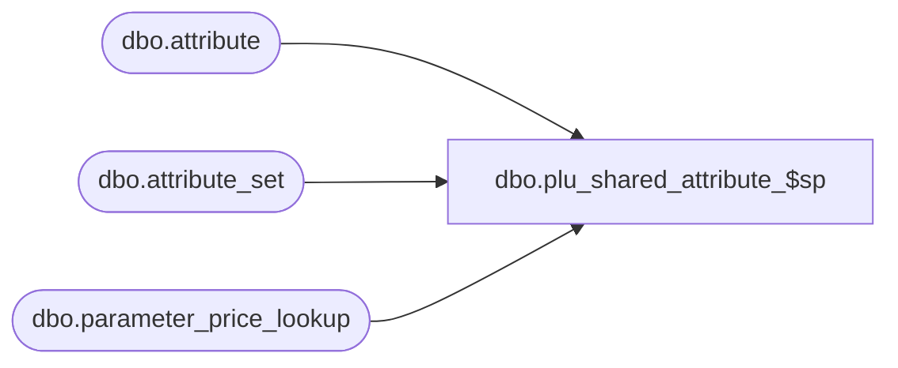

# dbo.plu_shared_attribute_$sp

**Database:** me_01  
**Server:** bedrockdb02  

## Architecture Diagram



## Table Dependencies

| Referenced Table |
|---|
| dbo.attribute |
| dbo.attribute_set |
| dbo.parameter_price_lookup |

## Stored Procedure Code

```sql
CREATE PROCEDURE [dbo].[plu_shared_attribute_$sp]
AS
			
DECLARE @line_id INT
		, @table_name NVARCHAR(30), @operation_name NVARCHAR(50)
		, @sql_err_num DECIMAL(38,0), @error_msg NVARCHAR(2000)
		, @error_severity SMALLINT, @error_state SMALLINT
		
/*
	Version		: 1.00
	Created		: Feb 2011
	Created by	: Sameer Patel
	Description	: Procedure called by Segment 1038 -- EDM & PROD to Price Look-Up File Generate (CRS)
				  Single row table with location and style ownership attributes and attribute sets
				  
	Call from C++ code:
		-- File: PLUFileDefGlobalSQLServer.cpp
		-- Class: CPLUFileDefGlobalSQLServer
		-- Function: LoadFileDefs
		
	-- NOTE: The temp table #plu_shared_attribute exists
		
	IF NOT object_id('tempdb..#plu_shared_attribute') IS NULL
	DROP TABLE #plu_shared_attribute

	CREATE TABLE #plu_shared_attribute
		( location_attribute_id DECIMAL(12), location_attribute_set_id DECIMAL(12)
		, style_attribute_id DECIMAL(12), style_attribute_set_id DECIMAL(12) )
	
HISTORY:
Date       		Name         	Def#		Desc
Feb 04,11		Sameer Patel	N/A			Initial Release
*/	

BEGIN TRY

	SET NOCOUNT ON

	-- Single row table with location and style ownership attributes and attribute sets
	
	SET @line_id = 10
	
	INSERT INTO #plu_shared_attribute 
		( location_attribute_id, location_attribute_set_id 
		, style_attribute_id, style_attribute_set_id )
	SELECT
		LocationAttribute.attribute_id, LocationAttributeSet.attribute_set_id 
		, StyleAttribute.attribute_id, StyleAttributeSet.attribute_set_id
	FROM
		parameter_price_lookup ParameterPriceLookup
		, attribute LocationAttribute, attribute StyleAttribute  
		, attribute_set StyleAttributeSet, attribute_set LocationAttributeSet  
	WHERE
		StyleAttribute.parent_type = 1 AND LocationAttribute.parent_type = 2  
		AND LocationAttribute.attribute_code = StyleAttribute.attribute_code 
		AND LocationAttributeSet.attribute_set_code = StyleAttributeSet.attribute_set_code 
		AND ( (LocationAttributeSet.attribute_id = ParameterPriceLookup.shared_attribute_id AND LocationAttribute.attribute_id = ParameterPriceLookup.shared_attribute_id  
					AND LocationAttribute.attribute_id = LocationAttributeSet.attribute_id
					AND LocationAttribute.parent_type = 2) 
				OR (StyleAttributeSet.attribute_id = ParameterPriceLookup.shared_attribute_id AND StyleAttribute.attribute_id = ParameterPriceLookup.shared_attribute_id
						AND StyleAttribute.attribute_id = StyleAttributeSet.attribute_id
						AND StyleAttribute.parent_type = 1) )
		AND StyleAttributeSet.attribute_id = StyleAttribute.attribute_id
		AND LocationAttributeSet.attribute_id = LocationAttribute.attribute_id

END TRY

BEGIN CATCH

	SELECT 
		@error_severity	= 16
		, @error_state = 1

	IF @line_id = 10
		SELECT  
			@table_name			= N'#plu_shared_attribute'
			, @operation_name	= N'INSERT'
			, @sql_err_num		= ERROR_NUMBER()
			, @error_msg		= N'Line Id = ' + CAST(@line_id AS NVARCHAR(4)) + N' '
									+ N' Table Name = ' + @table_name + N' '
									+ N' Operation Name = ' + @operation_name + N' '
									+ N' SQL Error Number = ' + CAST(@sql_err_num AS NVARCHAR(38)) + N' '
									+ N' Error Message = ' + ERROR_MESSAGE()
			
	RAISERROR (@error_msg, @error_severity, @error_state)			

END CATCH
```

