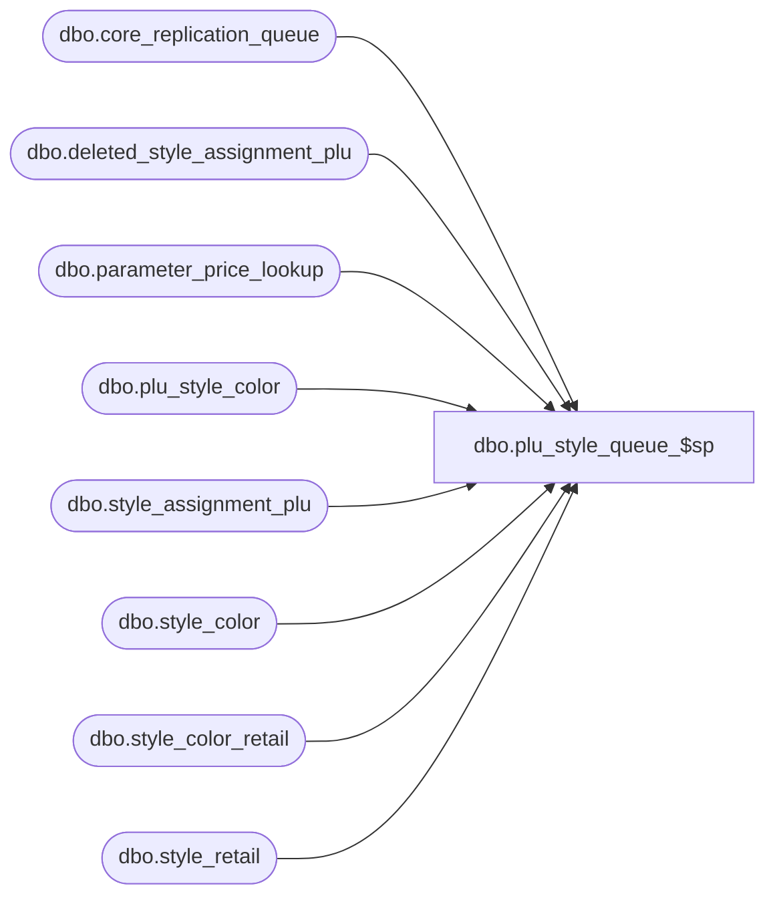

# dbo.plu_style_queue_$sp

**Database:** me_01  
**Server:** bedrockdb02  

## Architecture Diagram



## Table Dependencies

| Referenced Table |
|---|
| dbo.core_replication_queue |
| dbo.deleted_style_assignment_plu |
| dbo.parameter_price_lookup |
| dbo.plu_style_color |
| dbo.style_assignment_plu |
| dbo.style_color |
| dbo.style_color_retail |
| dbo.style_retail |

## Stored Procedure Code

```sql
CREATE PROCEDURE [dbo].[plu_style_queue_$sp]
( @start_queue_id DECIMAL(12), @end_queue_id DECIMAL(12) )
AS
			
DECLARE @line_id INT
		, @table_name NVARCHAR(30), @operation_name NVARCHAR(50)
		, @sql_err_num DECIMAL(38,0), @error_msg NVARCHAR(2000)
		, @error_severity SMALLINT, @error_state SMALLINT
		
/*
	Version		: 1.00
	Created		: Feb 2011
	Created by	: Sameer Patel
	Description	: Procedure called by Segment 1038 -- EDM & PROD to Price Look-Up File Generate (CRS)
				  Determines what style colors to send to PLU
				  based on what is in the CRQ greater than @start_queue_id and less than @end_queue_id
				  
	Call from C++ code:
		-- File: PLUQueueDefStyleColorResend.cpp
		-- Class: CPLUQueueDefStyleColorResend
		-- Function: FullQueueSQLServer
	
HISTORY:
Date       		Name         	Def#		Desc
Feb 04,11		Sameer Patel	N/A			Initial Release
*/	

BEGIN TRY

	SET NOCOUNT ON

	-- Insert a resend entry
	-- for style inserts or updates
	
	SET @line_id = 10
	
	INSERT INTO #all_style_color_resend
		( style_id, style_color_id
		, color_id )
	SELECT
		DISTINCT
			StyleColor.style_id, StyleColor.style_color_id
			, StyleColor.color_id
	FROM
		core_replication_queue CoreReplicationQueue
	INNER JOIN style_color StyleColor ON CoreReplicationQueue.entity_id = StyleColor.style_id
	LEFT OUTER JOIN #all_style_color_resend StyleColorResend ON StyleColor.style_color_id = StyleColorResend.style_color_id
	WHERE
		CoreReplicationQueue.core_replication_queue_id > @start_queue_id AND CoreReplicationQueue.core_replication_queue_id <= @end_queue_id
		AND CoreReplicationQueue.entity_code = 301 AND CoreReplicationQueue.replication_action IN (N'I', N'U')
		AND StyleColorResend.style_color_id IS NULL

	-- Insert a resend entry
	-- for style retail updates

	SET @line_id = 20
	
	INSERT INTO #all_style_color_resend
		( style_id, style_color_id
		, color_id )
	SELECT
		DISTINCT
			StyleColor.style_id, StyleColor.style_color_id
			, StyleColor.color_id
	FROM
		core_replication_queue CoreReplicationQueue
	INNER JOIN style_retail StyleRetail ON CoreReplicationQueue.entity_id = StyleRetail.style_retail_id 
	INNER JOIN style_color StyleColor ON StyleRetail.style_id = StyleColor.style_id
	CROSS JOIN parameter_price_lookup ParameterPriceLookup
	LEFT OUTER JOIN plu_style_color PluStyleColor ON StyleColor.style_color_id = PluStyleColor.style_color_id
	LEFT OUTER JOIN #all_style_color_resend StyleColorResend ON StyleColor.style_color_id = StyleColorResend.style_color_id AND StyleColor.style_id = StyleColorResend.style_id
	WHERE
		CoreReplicationQueue.core_replication_queue_id > @start_queue_id AND CoreReplicationQueue.core_replication_queue_id <= @end_queue_id
		AND CoreReplicationQueue.entity_code = 316 AND CoreReplicationQueue.replication_action IN (N'I', N'U')
		AND (ParameterPriceLookup.use_mix_match_flag = 1 OR PluStyleColor.style_color_id IS NULL)
		AND StyleColorResend.style_color_id IS NULL

	-- Insert a resend entry
	-- for style color updates

	SET @line_id = 30
	
	INSERT INTO #all_style_color_resend
		( style_id, style_color_id
		, color_id )
	SELECT
		DISTINCT
			StyleColor.style_id, StyleColor.style_color_id
			, StyleColor.color_id
	FROM
		core_replication_queue CoreReplicationQueue
	INNER JOIN style_color StyleColor ON CoreReplicationQueue.entity_id = StyleColor.style_color_id
	LEFT OUTER JOIN plu_style_color PluStyleColor ON StyleColor.style_color_id = PluStyleColor.style_color_id
	LEFT OUTER JOIN #all_style_color_resend StyleColorResend ON StyleColor.style_color_id = StyleColorResend.style_color_id
	CROSS JOIN parameter_price_lookup ParameterPriceLookup
	WHERE
		CoreReplicationQueue.core_replication_queue_id > @start_queue_id AND CoreReplicationQueue.core_replication_queue_id <= @end_queue_id
		AND CoreReplicationQueue.entity_code = 311 AND CoreReplicationQueue.replication_action IN (N'I', N'U')
		AND (ParameterPriceLookup.use_mix_match_flag = 1 OR PluStyleColor.style_color_id IS NULL)
		AND StyleColorResend.style_color_id IS NULL

	-- Insert a resend entry
	-- for style color retail updates

	SET @line_id = 40
	
	INSERT INTO #all_style_color_resend
		( style_id, style_color_id
		, color_id )
	SELECT
		DISTINCT
			StyleColor.style_id, StyleColor.style_color_id
			, StyleColor.color_id
	FROM
		core_replication_queue CoreReplicationQueue
	INNER JOIN style_color_retail StyleColorRetail ON CoreReplicationQueue.entity_id = StyleColorRetail.style_color_retail_id 
	INNER JOIN style_color StyleColor ON StyleColorRetail.style_color_id = StyleColor.style_color_id
	CROSS JOIN parameter_price_lookup ParameterPriceLookup
	LEFT OUTER JOIN plu_style_color PluStyleColor ON StyleColor.style_color_id = PluStyleColor.style_color_id
	LEFT OUTER JOIN #all_style_color_resend StyleColorResend ON StyleColor.style_color_id = StyleColorResend.style_color_id AND StyleColor.style_id = StyleColorResend.style_id
	WHERE
		CoreReplicationQueue.core_replication_queue_id > @start_queue_id AND CoreReplicationQueue.core_replication_queue_id <= @end_queue_id
		AND CoreReplicationQueue.entity_code = 316 AND CoreReplicationQueue.replication_action IN (N'I', N'U')
		AND (ParameterPriceLookup.use_mix_match_flag = 1 OR PluStyleColor.style_color_id IS NULL)
		AND StyleColorResend.style_color_id IS NULL

	-- Insert a resend entry
	-- for style assignment plu updates

	SET @line_id = 50
	
	INSERT INTO #all_style_color_resend
		( style_id, style_color_id
		, color_id )
	SELECT
		DISTINCT
			StyleColor.style_id, StyleColor.style_color_id
			, StyleColor.color_id
	FROM
		core_replication_queue CoreReplicationQueue
	INNER JOIN style_assignment_plu StyleAssignmentPlu ON CoreReplicationQueue.entity_id = StyleAssignmentPlu.style_assignment_plu_id AND StyleAssignmentPlu.location_id IS NULL
	INNER JOIN style_color StyleColor ON StyleAssignmentPlu.style_id = StyleColor.style_id
	LEFT OUTER JOIN #all_style_color_resend StyleColorResend ON StyleColor.style_color_id = StyleColorResend.style_color_id AND StyleColor.style_id = StyleColorResend.style_id
	WHERE
		CoreReplicationQueue.core_replication_queue_id > @start_queue_id AND CoreReplicationQueue.core_replication_queue_id <= @end_queue_id
		AND CoreReplicationQueue.entity_code = 911 AND CoreReplicationQueue.replication_action IN (N'I', N'U')
		AND StyleColorResend.style_color_id IS NULL

	-- Insert a resend entry
	-- for style assignment plu deletes

	SET @line_id = 60
	
	INSERT INTO #all_style_color_resend
		( style_id, style_color_id
		, color_id )
	SELECT
		DISTINCT
			StyleColor.style_id, StyleColor.style_color_id
			, StyleColor.color_id
	FROM
		core_replication_queue CoreReplicationQueue
	INNER JOIN deleted_style_assignment_plu DeletedStyleAssignmentPlu ON CoreReplicationQueue.entity_id = DeletedStyleAssignmentPlu.style_assignment_plu_id AND DeletedStyleAssignmentPlu.location_id IS NULL
	INNER JOIN style_color StyleColor ON DeletedStyleAssignmentPlu.style_id = StyleColor.style_id
	LEFT OUTER JOIN #all_style_color_resend StyleColorResend ON StyleColor.style_color_id = StyleColorResend.style_color_id AND StyleColor.style_id = StyleColorResend.style_id
	WHERE
		CoreReplicationQueue.core_replication_queue_id > @start_queue_id AND CoreReplicationQueue.core_replication_queue_id <= @end_queue_id
		AND CoreReplicationQueue.entity_code = 911 AND CoreReplicationQueue.replication_action = N'D'
		AND StyleColorResend.style_color_id IS NULL
		
	-- For any entry in #all_style_color_resend at this point
	-- They should be going to all locations
	-- Insert an entry for each othese style colors into #style_color_all_location

	SET @line_id = 70
	
	INSERT INTO #style_color_all_locations
		( style_id, style_color_id, color_id )
	SELECT
		style_id, style_color_id, color_id
	FROM
		#all_style_color_resend

END TRY

BEGIN CATCH

	SELECT 
		@error_severity	= 16
		, @error_state = 1
		
	IF @line_id = 10
		SELECT   
			@table_name			= N'#all_style_color_resend'
			, @operation_name	= N'INSERT - style update'
			, @sql_err_num		= ERROR_NUMBER()
			, @error_msg		= N'Line Id = ' + CAST(@line_id AS NVARCHAR(4)) + N' '
									+ N' Table Name = ' + @table_name + N' '
									+ N' Operation Name = ' + @operation_name + N' '
									+ N' SQL Error Number = ' + CAST(@sql_err_num AS NVARCHAR(38)) + N' '
									+ N' Error Message = ' + ERROR_MESSAGE()

	ELSE IF @line_id = 20
		SELECT   
			@table_name			= N'#all_style_color_resend'
			, @operation_name	= N'INSERT - style retail update'
			, @sql_err_num		= ERROR_NUMBER()
			, @error_msg		= N'Line Id = ' + CAST(@line_id AS NVARCHAR(4)) + N' '
									+ N' Table Name = ' + @table_name + N' '
									+ N' Operation Name = ' + @operation_name + N' '
									+ N' SQL Error Number = ' + CAST(@sql_err_num AS NVARCHAR(38)) + N' '
									+ N' Error Message = ' + ERROR_MESSAGE()

	ELSE IF @line_id = 30
		SELECT   
			@table_name			= N'#all_style_color_resend'
			, @operation_name	= N'INSERT - style color update'
			, @sql_err_num		= ERROR_NUMBER()
			, @error_msg		= N'Line Id = ' + CAST(@line_id AS NVARCHAR(4)) + N' '
									+ N' Table Name = ' + @table_name + N' '
									+ N' Operation Name = ' + @operation_name + N' '
									+ N' SQL Error Number = ' + CAST(@sql_err_num AS NVARCHAR(38)) + N' '
									+ N' Error Message = ' + ERROR_MESSAGE()

	ELSE IF @line_id = 40
		SELECT   
			@table_name			= N'#all_style_color_resend'
			, @operation_name	= N'INSERT - style color retail update'
			, @sql_err_num		= ERROR_NUMBER()
			, @error_msg		= N'Line Id = ' + CAST(@line_id AS NVARCHAR(4)) + N' '
									+ N' Table Name = ' + @table_name + N' '
									+ N' Operation Name = ' + @operation_name + N' '
									+ N' SQL Error Number = ' + CAST(@sql_err_num AS NVARCHAR(38)) + N' '
									+ N' Error Message = ' + ERROR_MESSAGE()

	ELSE IF @line_id = 50
		SELECT  
			@table_name			= N'#all_style_color_resend'
			, @operation_name	= N'INSERT - style assignment plu'
			, @sql_err_num		= ERROR_NUMBER()
			, @error_msg		= N'Line Id = ' + CAST(@line_id AS NVARCHAR(4)) + N' '
									+ N' Table Name = ' + @table_name + N' '
									+ N' Operation Name = ' + @operation_name + N' '
									+ N' SQL Error Number = ' + CAST(@sql_err_num AS NVARCHAR(38)) + N' '
									+ N' Error Message = ' + ERROR_MESSAGE()

	ELSE IF @line_id = 60
		SELECT  
			@table_name			= N'#all_style_color_resend'
			, @operation_name	= N'INSERT - deleted style assignment plu'
			, @sql_err_num		= ERROR_NUMBER()
			, @error_msg		= N'Line Id = ' + CAST(@line_id AS NVARCHAR(4)) + N' '
									+ N' Table Name = ' + @table_name + N' '
									+ N' Operation Name = ' + @operation_name + N' '
									+ N' SQL Error Number = ' + CAST(@sql_err_num AS NVARCHAR(38)) + N' '
									+ N' Error Message = ' + ERROR_MESSAGE()

	ELSE IF @line_id = 70
		SELECT  
			@table_name			= N'#style_color_all_locations'
			, @operation_name	= N'INSERT'
			, @sql_err_num		= ERROR_NUMBER()
			, @error_msg		= N'Line Id = ' + CAST(@line_id AS NVARCHAR(4)) + N' '
									+ N' Table Name = ' + @table_name + N' '
									+ N' Operation Name = ' + @operation_name + N' '
									+ N' SQL Error Number = ' + CAST(@sql_err_num AS NVARCHAR(38)) + N' '
									+ N' Error Message = ' + ERROR_MESSAGE()
			
	RAISERROR (@error_msg, @error_severity, @error_state)			

END CATCH
```

