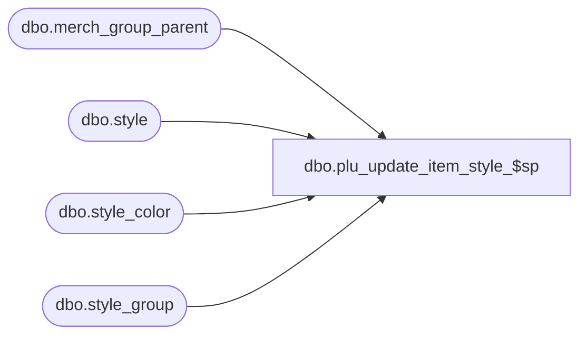

# dbo.plu_update_item_style_$sp

**Database:** me_01  
**Server:** bedrockdb02  

## Architecture Diagram



## Table Dependencies

| Referenced Table |
|---|
| dbo.merch_group_parent |
| dbo.style |
| dbo.style_color |
| dbo.style_group |

## Stored Procedure Code

```sql
CREATE PROCEDURE [dbo].[plu_update_item_style_$sp]
AS

DECLARE @line_id INT
		, @table_name NVARCHAR(30), @operation_name NVARCHAR(50)
		, @sql_err_num DECIMAL(38,0), @error_msg NVARCHAR(2000)
		, @error_severity SMALLINT, @error_state SMALLINT
		
/*
	Version		: 1.00
	Created		: Feb 2011
	Created by	: Sameer Patel
	Description	: Procedure called by Segment 1038 -- EDM & PROD to Price Look-Up File Generate (CRS)
				  Gets all ordered style records for upcs requiring an update/resend
				  These will go to all locations that require a regenerate
				  
	Call from C++ code:
		-- File: PLUFileDefCommonSQLServer.cpp
		-- Class: CPLUFileDefCommonSQLServer
		-- Function: LoadUPCFileDefs	
	
HISTORY:
Date       		Name         	Def#		Desc
Feb 04,11		Sameer Patel	N/A			Initial Release
*/

BEGIN TRY

	SET NOCOUNT ON

	SET @line_id = 10
	
	INSERT INTO #style
		( style_id, style_color_id, color_id
		, dept_id, dept_class_id
		, style_type
		, plu_key )
	SELECT
		DISTINCT
			PluKey.style_id, PluKey.style_color_id, StyleColor.color_id
			, DeptClass.dept_id, DeptClass.dept_class_id dept_class_id
			, Style.style_type
			, PluKey.plu_key
	FROM
		#all_upc Upc
	INNER JOIN style Style ON Upc.style_id = Style.style_id
	INNER JOIN style_group StyleGroup ON Style.style_id = StyleGroup.style_id AND StyleGroup.main_group_flag = 1
	INNER JOIN ( merch_group_parent DeptClassMerchGroupParent 
					INNER JOIN #dept_class DeptClass ON DeptClassMerchGroupParent.parent_hierarchy_group_id = DeptClass.dept_class_id
															AND DeptClassMerchGroupParent.hierarchy_level_id = DeptClass.hierarchy_level_id ) ON StyleGroup.hierarchy_group_id = DeptClassMerchGroupParent.hierarchy_group_id
	INNER JOIN #tb_plu_key PluKey ON Upc.style_id = PluKey.style_id AND Upc.style_color_id = PluKey.style_color_id
	INNER JOIN style_color StyleColor ON PluKey.style_color_id = StyleColor.style_color_id AND PluKey.style_id = StyleColor.style_id
	WHERE
		Style.style_status >= 3
		
	-- For any entry in #all_style_color_resend at this point
	-- They should be going to all locations
	-- Insert an entry for each othese style colors into #style_color_all_location

	SET @line_id = 20
	
	INSERT INTO #style_color_all_locations
		( style_id, style_color_id, color_id )
	SELECT
		TempStyle.style_id, TempStyle.style_color_id, TempStyle.color_id
	FROM
		#style TempStyle
	LEFT OUTER JOIN #style_color_all_locations TempStyleColorAllLocations ON TempStyle.style_id = TempStyleColorAllLocations.style_id AND TempStyle.style_color_id = TempStyleColorAllLocations.style_color_id
	WHERE
		TempStyleColorAllLocations.style_color_id IS NULL
		
END TRY

BEGIN CATCH

	SELECT 
		@error_severity	= 16
		, @error_state = 1

	IF @line_id = 10
		SELECT  
			@table_name			= N'#style'
			, @operation_name	= N'INSERT'
			, @sql_err_num		= ERROR_NUMBER()
			, @error_msg		= N'Line Id = ' + CAST(@line_id AS NVARCHAR(4)) + N' '
									+ N' Table Name = ' + @table_name + N' '
									+ N' Operation Name = ' + @operation_name + N' '
									+ N' SQL Error Number = ' + CAST(@sql_err_num AS NVARCHAR(38)) + N' '
									+ N' Error Message = ' + ERROR_MESSAGE()

	ELSE IF @line_id = 20
		SELECT  
			@table_name			= N'#style_color_all_locations'
			, @operation_name	= N'INSERT'
			, @sql_err_num		= ERROR_NUMBER()
			, @error_msg		= N'Line Id = ' + CAST(@line_id AS NVARCHAR(4)) + N' '
									+ N' Table Name = ' + @table_name + N' '
									+ N' Operation Name = ' + @operation_name + N' '
									+ N' SQL Error Number = ' + CAST(@sql_err_num AS NVARCHAR(38)) + N' '
									+ N' Error Message = ' + ERROR_MESSAGE()
			
	RAISERROR (@error_msg, @error_severity, @error_state)			

END CATCH
```

