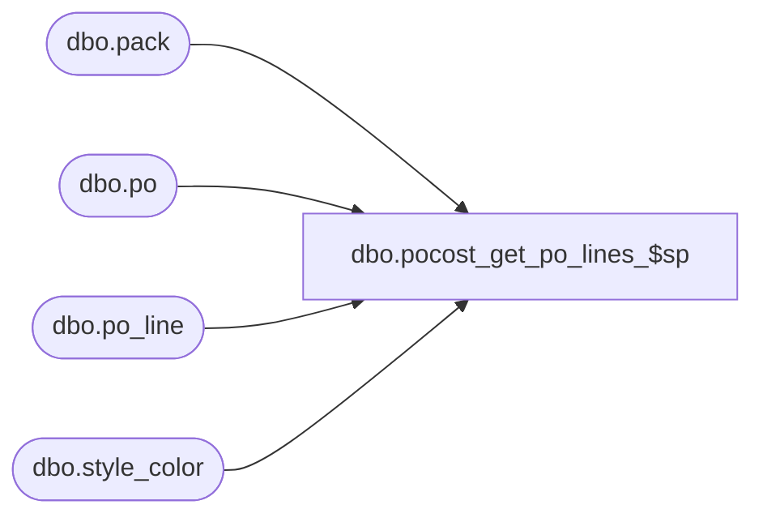

# dbo.pocost_get_po_lines_$sp

**Database:** me_01  
**Server:** bedrockdb02  

## Architecture Diagram



## Table Dependencies

| Referenced Table |
|---|
| dbo.pack |
| dbo.po |
| dbo.po_line |
| dbo.style_color |

## Stored Procedure Code

```sql
CREATE PROCEDURE [dbo].[pocost_get_po_lines_$sp]
AS

DECLARE @line_id INT
		, @table_name NVARCHAR(30), @operation_name NVARCHAR(50)
		, @sql_err_num DECIMAL(38,0), @error_msg NVARCHAR(2000)
		, @error_severity SMALLINT, @error_state SMALLINT
		
/*
	Version		: 1.00
	Created		: Jan 2011
	Created by	: Sameer Patel
	Description	: Procedure called by Nsb.Purchasing.PoCostModsProcess.exe. 
				  Populate po line information in #po_line_info
				  Retrieves records from #po_line_info
				  
	Call from C# code:
		-- File: PoCostMods.cs
		-- Class: POCostModsProcess
		-- Function: RetrievePOLineInfoList
		
	-- Assume that the temp table #po_line_info has been created
	-- NOTE: The temp tables #style_vendor_info and #valid_style_vendor still exist

	DECLARE @object_id INTEGER
	SELECT @object_id = object_id('#po_line_info')
	IF NOT (@object_id IS NULL)
		DROP TABLE #po_line_info
	CREATE TABLE #po_line_info
		( file_line_number INT, style_id DECIMAL(12), vendor_id DECIMAL(12)
		, style_type TINYINT
		, po_id DECIMAL(12), po_no NVARCHAR(20)
		, po_line_id SMALLINT, line_no DECIMAL(13)
		, new_cost DECIMAL(14,2)
		, UNIQUE (po_id, po_line_id) )	
			
	-- There are 2 insert statements per po line type (one for style color lines and the other for packs lines)
	-- The final statement is a select statement returning the contents of the temp table
	
HISTORY:
Date       		Name         	Def#		Desc
Jan 17,11		Sameer Patel	N/A			Initial Release
Jan 20,11		Sameer Patel	N/A			Modified INSERTs to not include records in #valid_style_vendor where update_failed = 0	
Jan 24,11		Sameer Patel	N/A			Modified the joins to PO table to include vendor_id 
Jan 27,11		Sameer Patel	N/A			Added an additional INSERT to handle case of pseudo-styles without vendors (@line_id = 15)
Feb 15,11		Sameer Patel	N/A			Fixed unique key constraint error for pseudo-styles with vendors (@line_id = 15)
*/		
		
BEGIN TRY
		
	-- Populate style color po lines
	-- This SQL assumes that the style (regular or pseudo) has a vendor
	
	SET @line_id = 10
	
	INSERT INTO #po_line_info
		( file_line_number, style_id, vendor_id
		, style_type
		, po_id, po_no
		, po_line_id, line_no
		, new_cost )
	SELECT
		ValidStyleVendor.file_line_number, ValidStyleVendor.style_id, ValidStyleVendor.vendor_id
		, ValidStyleVendor.style_type
		, PO.po_id, PO.po_no
		, POLine.po_line_id, POLine.line_no
		, ValidStyleVendor.new_cost
	FROM
	  	#valid_style_vendor ValidStyleVendor
	INNER JOIN style_color StyleColor ON ValidStyleVendor.style_id = StyleColor.style_id
	INNER JOIN po_line POLine ON StyleColor.style_color_id = POLine.style_color_id
	INNER JOIN po PO ON ValidStyleVendor.vendor_id = PO.vendor_id AND POLine.po_id = PO.po_id AND PO.po_status <> 5
	WHERE
	  	ValidStyleVendor.new_cost <> POLine.first_cost
	  	AND ValidStyleVendor.update_failed = 0
	  	
	-- Populate style color po lines
	-- This SQL is only for pseudo-styles that don't have vendors
	-- Because of this, we can't join to the po table on vendor_id
	
	SET @line_id = 15
	
	INSERT INTO #po_line_info
		( file_line_number, style_id, vendor_id
		, style_type
		, po_id, po_no
		, po_line_id, line_no
		, new_cost )
	SELECT
		ValidStyleVendor.file_line_number, ValidStyleVendor.style_id, ValidStyleVendor.vendor_id
		, ValidStyleVendor.style_type
		, PO.po_id, PO.po_no
		, POLine.po_line_id, POLine.line_no
		, ValidStyleVendor.new_cost
	FROM
	  	#valid_style_vendor ValidStyleVendor
	INNER JOIN style_color StyleColor ON ValidStyleVendor.style_id = StyleColor.style_id
	INNER JOIN po_line POLine ON StyleColor.style_color_id = POLine.style_color_id
	INNER JOIN po PO ON POLine.po_id = PO.po_id AND PO.po_status <> 5
	LEFT OUTER JOIN #po_line_info POLineInfo ON POLine.po_id = POLineInfo.po_id AND POLine.po_line_id = POLineInfo.po_line_id
	WHERE
	  	ValidStyleVendor.new_cost <> POLine.first_cost
	  	AND ValidStyleVendor.style_type = 2
	  	AND ValidStyleVendor.update_failed = 0
	  	AND POLineInfo.file_line_number IS NULL 
	  	
	-- Populate pack po lines
	  	
	SET @line_id = 20	  	
	  
	INSERT INTO #po_line_info
		( file_line_number, style_id, vendor_id
		, style_type
		, po_id, po_no
		, po_line_id, line_no
		, new_cost )
	SELECT
		ValidStyleVendor.file_line_number, ValidStyleVendor.style_id, ValidStyleVendor.vendor_id
		, ValidStyleVendor.style_type
		, PO.po_id, PO.po_no
		, POLine.po_line_id, POLine.line_no
		, ValidStyleVendor.new_cost
	FROM
	  	#valid_style_vendor ValidStyleVendor
	INNER JOIN pack Pack ON ValidStyleVendor.style_id = Pack.style_id
	INNER JOIN po_line POLine ON Pack.pack_id = POLine.pack_id
	INNER JOIN po PO ON ValidStyleVendor.vendor_id = PO.vendor_id AND  POLine.po_id = PO.po_id AND PO.po_status <> 5
	WHERE
	  	ValidStyleVendor.new_cost <> POLine.first_cost
	  	AND ValidStyleVendor.update_failed = 0
	  	
	-- Select all records from #po_line_info
	  	
	SET @line_id = 30 
	
	SELECT
		file_line_number, style_id, vendor_id
		, style_type
		, po_id, po_no
		, po_line_id, line_no
		, new_cost
	FROM
		#po_line_info
	ORDER BY
		po_id, po_line_id
	
	RETURN

END TRY

BEGIN CATCH

	SELECT 
		@error_severity	= 16
		, @error_state = 1

	IF @line_id = 10
		SELECT  
			@table_name			= N'#po_line_info'
			, @operation_name	= N'INSERT -- regular and pseudo-styles with vendors'
			, @sql_err_num		= ERROR_NUMBER()
			, @error_msg		= N'Line Id = ' + CAST(@line_id AS NVARCHAR(4)) + N' '
									+ N' Table Name = ' + @table_name + N' '
									+ N' Operation Name = ' + @operation_name + N' '
									+ N' SQL Error Number = ' + CAST(@sql_err_num AS NVARCHAR(38)) + N' '
									+ N' Error Message = ' + ERROR_MESSAGE()

	ELSE IF @line_id = 15
		SELECT  
			@table_name			= N'#po_line_info'
			, @operation_name	= N'INSERT -- pseudo-styles without vendors'
			, @sql_err_num		= ERROR_NUMBER()
			, @error_msg		= N'Line Id = ' + CAST(@line_id AS NVARCHAR(4)) + N' '
									+ N' Table Name = ' + @table_name + N' '
									+ N' Operation Name = ' + @operation_name + N' '
									+ N' SQL Error Number = ' + CAST(@sql_err_num AS NVARCHAR(38)) + N' '
									+ N' Error Message = ' + ERROR_MESSAGE()

	ELSE IF @line_id = 20
		SELECT  
			@table_name			= N'#po_line_info'
			, @operation_name	= N'INSERT -- pack lines'
			, @sql_err_num		= ERROR_NUMBER()
			, @error_msg		= N'Line Id = ' + CAST(@line_id AS NVARCHAR(4)) + N' '
									+ N' Table Name = ' + @table_name + N' '
									+ N' Operation Name = ' + @operation_name + N' '
									+ N' SQL Error Number = ' + CAST(@sql_err_num AS NVARCHAR(38)) + N' '
									+ N' Error Message = ' + ERROR_MESSAGE()

	ELSE IF @line_id = 30
		SELECT  
			@table_name			= N'#po_line_info'
			, @operation_name	= N'SELECT'
			, @sql_err_num		= ERROR_NUMBER()
			, @error_msg		= N'Line Id = ' + CAST(@line_id AS NVARCHAR(4)) + N' '
									+ N' Table Name = ' + @table_name + N' '
									+ N' Operation Name = ' + @operation_name + N' '
									+ N' SQL Error Number = ' + CAST(@sql_err_num AS NVARCHAR(38)) + N' '
									+ N' Error Message = ' + ERROR_MESSAGE()
			
	RAISERROR (@error_msg, @error_severity, @error_state)	

END CATCH
```

