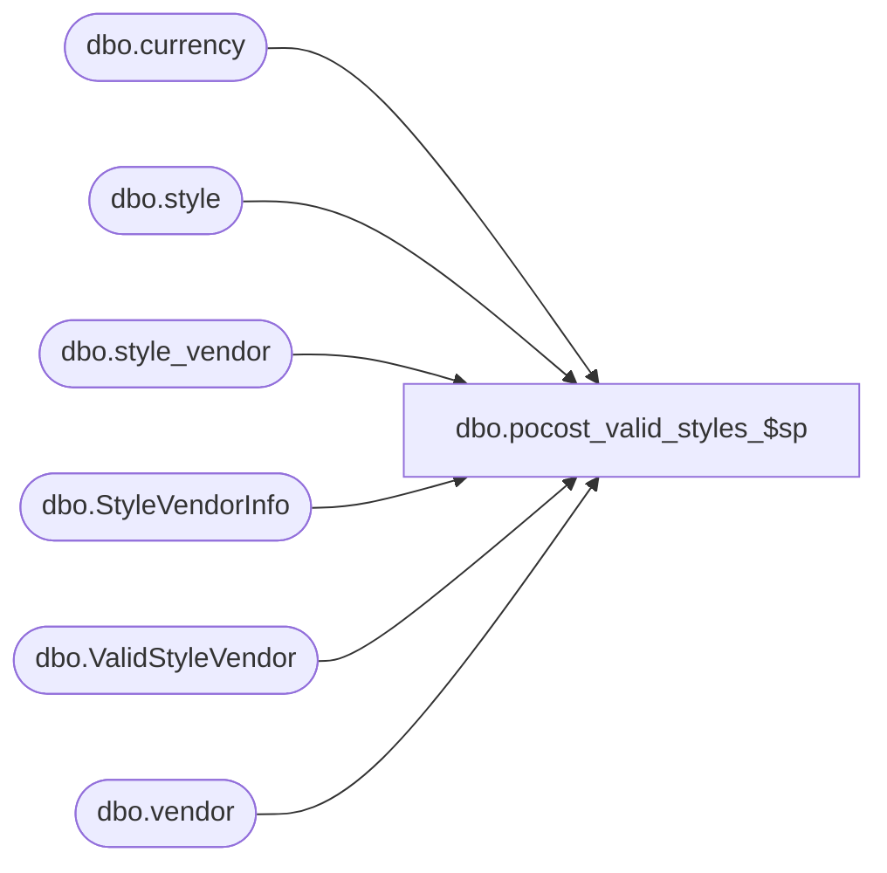

# dbo.pocost_valid_styles_$sp

**Database:** me_01  
**Server:** bedrockdb02  

## Architecture Diagram



## Table Dependencies

| Referenced Table |
|---|
| dbo.currency |
| dbo.style |
| dbo.style_vendor |
| dbo.StyleVendorInfo |
| dbo.ValidStyleVendor |
| dbo.vendor |

## Stored Procedure Code

```sql
CREATE PROCEDURE [dbo].[pocost_valid_styles_$sp]
AS

DECLARE @line_id INT
		, @table_name NVARCHAR(30), @operation_name NVARCHAR(50)
		, @sql_err_num DECIMAL(38,0), @error_msg NVARCHAR(2000)
		, @error_severity SMALLINT, @error_state SMALLINT
		
/*
	Version		: 1.00
	Created		: Jan 2011
	Created by	: Sameer Patel
	Description	: Procedure called by Nsb.Purchasing.PoCostModsProcess.exe. 
				  Updates and returns invalid style records in #style_vendor_info
				  Populates #valid_style_vendor table with valid style records
				  
	Call from C# code:
		-- File: PoCostMods.cs
		-- Class: POCostModsProcess
		-- Function: BulkInsertStyleInfoList
		
	-- Assume that the temp table #style_vendor_info has been created and populated with contents of po cost import file
	-- Assume that the temp table #valid_style_vendor has been created

	DECLARE @object_id INTEGER
	SELECT @object_id = object_id('#style_vendor_info')
	IF NOT (@object_id IS NULL)
		DROP TABLE #style_vendor_info
	CREATE TABLE #style_vendor_info
		( file_line_number INT
		, style_code NVARCHAR(20)
		, vendor_code NVARCHAR(20), vendor_style NVARCHAR(40)
		, record_type SMALLINT
		, new_cost DECIMAL(14,2)
		, is_valid BIT
		, current_cost DECIMAL(14,2)
		, UNIQUE (style_code, vendor_code, vendor_style) )
		
	SELECT @object_id = object_id('#valid_style_vendor')
	IF NOT (@object_id IS NULL)
		DROP TABLE #valid_style_vendor
	CREATE TABLE #valid_style_vendor
		( id INT IDENTITY(1,1)
		, file_line_number INT
		, style_id DECIMAL(12), style_code NVARCHAR(20), style_type TINYINT, style_status SMALLINT, long_desc NVARCHAR(120)
		, style_vendor_id DECIMAL(13), vendor_id DECIMAL(12), vendor_code NVARCHAR(20), vendor_style NVARCHAR(40), primary_vendor_flag BIT
		, currency_id DECIMAL(12), currency_code NVARCHAR(3)
		, current_cost DECIMAL(14,2), new_cost DECIMAL(14,2)
		, update_failed BIT DEFAULT (0)
		, PRIMARY KEY (id)
		, UNIQUE (style_id, vendor_id, style_vendor_id) )
	
HISTORY:
Date       		Name         	Def#		Desc
Jan 17,11		Sameer Patel	N/A			Initial Release
Jan 20,11		Sameer Patel	N/A			Added SELECT of invalid	styles (@line_id = 50)
Jan 21,11		Sameer Patel	N/A			Added record type 4: vendor code and style code (@line_id = 40, @line_id = 45)
											Modified UPDATE and INSERT for record type 3 (@line_id = 30, @line_id = 35)
Jan 26,11		Sameer Patel	N/A			Make sure records with record type 0 are invalid (@line_id = 5)											
Feb 15,11		Sameer Patel	N/A			Join currency table to vendor table instead of style_vendor table (@line_id = 45)
Mar 03,11		Sameer Patel	125279		Take into account duplicate style vendors (not the same record type) (@line_id IN (13,15,23,25,33,35,43,45))
												
*/		
		
BEGIN TRY
		
-----------------------------------------------------------------------------------------------------------------------------------------------------------------------------		
-----------------------------------------------------------------------------------------------------------------------------------------------------------------------------

-- Record type 0: definitely invalid
	
	SET @line_id = 5
	
	UPDATE StyleVendorInfo
	SET 
		StyleVendorInfo.is_valid = 0
	FROM
		#style_vendor_info StyleVendorInfo
	WHERE
		StyleVendorInfo.record_type = 0

-----------------------------------------------------------------------------------------------------------------------------------------------------------------------------		
-----------------------------------------------------------------------------------------------------------------------------------------------------------------------------

-- Record type 1: style code only

	-- Validate whether or not style_code in #style_vendor_info reprsents a valid style_code in the style table
	-- Set is_valid = 0 if the style_code in #style_vendor_info does not exist in style table
	
	SET @line_id = 10
	
	UPDATE StyleVendorInfo
	SET 
		StyleVendorInfo.is_valid = 0
	FROM
		#style_vendor_info StyleVendorInfo
	LEFT OUTER JOIN style Style ON StyleVendorInfo.style_code = Style.style_code 
	WHERE
		Style.style_id IS NULL AND StyleVendorInfo.record_type = 1
		
	-- The C# code will address duplicates of the same record type
	-- But we need to account for duplicates if the record type are not the same
	-- EG. Line 1: style A, vendor B; Line 2: Vendor style AB, vendor B representing style A
	
	SET @line_id = 13
	
	UPDATE ValidStyleVendor
	SET
		ValidStyleVendor.new_cost = StyleVendorInfo.new_cost
	FROM	
		#style_vendor_info StyleVendorInfo
	INNER JOIN style Style ON StyleVendorInfo.style_code = Style.style_code
	LEFT OUTER JOIN ( style_vendor StyleVendor 
						INNER JOIN vendor Vendor ON StyleVendor.vendor_id = Vendor.vendor_id
						INNER JOIN currency Currency ON StyleVendor.currency_id = Currency.currency_id ) ON Style.style_id = StyleVendor.style_id 
																												AND StyleVendor.primary_vendor_flag = 1
	INNER JOIN #valid_style_vendor ValidStyleVendor	ON Style.style_id = ValidStyleVendor.style_id AND StyleVendor.vendor_id = StyleVendor.vendor_id
															AND StyleVendor.style_vendor_id = ValidStyleVendor.style_vendor_id																									
	WHERE
		StyleVendorInfo.record_type = 1 AND StyleVendorInfo.is_valid = 1
		AND StyleVendorInfo.file_line_number > ValidStyleVendor.file_line_number
		
	-- Insert valid records into #valid_style_vendor getting other required fields from style, style_vendor and currency tables
	-- We will retrieve vendor information for the primary vendor since we only have the style_code for record type 1
	-- There is a LEFT OUTER JOIN on the style_vendor table because pseudo-styles may or may not have an entry in style_vendor
	
	SET @line_id = 15
	
	INSERT INTO #valid_style_vendor
		( file_line_number
		, style_id, style_code, style_type, style_status, long_desc
		, style_vendor_id, vendor_id, vendor_code, vendor_style, primary_vendor_flag
		, currency_id, currency_code
		, current_cost, new_cost )
	SELECT
		StyleVendorInfo.file_line_number
		, Style.style_id, Style.style_code, Style.style_type, Style.style_status, Style.long_desc
		, StyleVendor.style_vendor_id, Vendor.vendor_id, Vendor.vendor_code, StyleVendor.vendor_style, StyleVendor.primary_vendor_flag
		, Currency.currency_id, Currency.currency_code
		, StyleVendor.current_cost, StyleVendorInfo.new_cost
	FROM
		#style_vendor_info StyleVendorInfo
	INNER JOIN style Style ON StyleVendorInfo.style_code = Style.style_code
	LEFT OUTER JOIN ( style_vendor StyleVendor 
						INNER JOIN vendor Vendor ON StyleVendor.vendor_id = Vendor.vendor_id
						INNER JOIN currency Currency ON StyleVendor.currency_id = Currency.currency_id ) ON Style.style_id = StyleVendor.style_id 
																												AND StyleVendor.primary_vendor_flag = 1
	LEFT OUTER JOIN #valid_style_vendor ValidStyleVendor ON Style.style_id = ValidStyleVendor.style_id AND StyleVendor.vendor_id = StyleVendor.vendor_id
																AND StyleVendor.style_vendor_id = ValidStyleVendor.style_vendor_id
	WHERE
		StyleVendorInfo.record_type = 1 AND StyleVendorInfo.is_valid = 1
		AND ValidStyleVendor.style_vendor_id IS NULL
		
-----------------------------------------------------------------------------------------------------------------------------------------------------------------------------		
-----------------------------------------------------------------------------------------------------------------------------------------------------------------------------
	
-- Record type 2: vendor code and vendor style

	-- Validate whether or not vendor_code and vendor_style in #style_vendor_info reprsents a valid vendor_code and vendor_style in the vendor and style_vendor tables
	-- Set is_valid = 0 if the vendor_code/vendor_style in #style_vendor_info does not exist in style_vendor and vendor tables
	
	SET @line_id = 20
		
	UPDATE StyleVendorInfo
	SET 
		StyleVendorInfo.is_valid = 0
	FROM
		#style_vendor_info StyleVendorInfo
	LEFT OUTER JOIN ( style_vendor StyleVendor
						INNER JOIN vendor Vendor ON StyleVendor.vendor_id = Vendor.vendor_id ) ON StyleVendorInfo.vendor_code = Vendor.vendor_code 
																										AND StyleVendorInfo.vendor_style = StyleVendor.vendor_style 
	WHERE
		StyleVendor.style_id IS NULL AND StyleVendorInfo.record_type = 2
		
	-- The C# code will address duplicates of the same record type
	-- But we need to account for duplicates if the record type are not the same
	-- EG. Line 1: style A, vendor B; Line 2: Vendor style AB, vendor B representing style A
	
	SET @line_id = 23
	
	UPDATE ValidStyleVendor
	SET
		ValidStyleVendor.new_cost = StyleVendorInfo.new_cost
	FROM
		#style_vendor_info StyleVendorInfo
	INNER JOIN ( style_vendor StyleVendor 
						INNER JOIN vendor Vendor ON StyleVendor.vendor_id = Vendor.vendor_id
						INNER JOIN currency Currency ON StyleVendor.currency_id = Currency.currency_id ) ON StyleVendorInfo.vendor_code = Vendor.vendor_code 
																												AND StyleVendorInfo.vendor_style = StyleVendor.vendor_style
	INNER JOIN style Style ON StyleVendor.style_id = Style.style_id
	INNER JOIN #valid_style_vendor ValidStyleVendor	ON Style.style_id = ValidStyleVendor.style_id AND StyleVendor.vendor_id = StyleVendor.vendor_id
															AND StyleVendor.style_vendor_id = ValidStyleVendor.style_vendor_id																									
	WHERE
		StyleVendorInfo.record_type = 2 AND StyleVendorInfo.is_valid = 1
		AND StyleVendorInfo.file_line_number > ValidStyleVendor.file_line_number
		
	-- Insert valid records into #valid_style_vendor getting other required fields from style, style_vendor and currency tables
	
	SET @line_id = 25
	
	INSERT INTO #valid_style_vendor
		( file_line_number
		, style_id, style_code, style_type, style_status, long_desc
		, style_vendor_id, vendor_id, vendor_code, vendor_style, primary_vendor_flag
		, currency_id, currency_code
		, current_cost, new_cost )
	SELECT
		StyleVendorInfo.file_line_number
		, Style.style_id, Style.style_code, Style.style_type, Style.style_status, Style.long_desc
		, StyleVendor.style_vendor_id, Vendor.vendor_id, Vendor.vendor_code, StyleVendor.vendor_style, StyleVendor.primary_vendor_flag
		, Currency.currency_id, Currency.currency_code
		, StyleVendor.current_cost, StyleVendorInfo.new_cost
	FROM
		#style_vendor_info StyleVendorInfo
	INNER JOIN ( style_vendor StyleVendor 
						INNER JOIN vendor Vendor ON StyleVendor.vendor_id = Vendor.vendor_id
						INNER JOIN currency Currency ON StyleVendor.currency_id = Currency.currency_id ) ON StyleVendorInfo.vendor_code = Vendor.vendor_code 
																												AND StyleVendorInfo.vendor_style = StyleVendor.vendor_style
	INNER JOIN style Style ON StyleVendor.style_id = Style.style_id
	LEFT OUTER JOIN #valid_style_vendor ValidStyleVendor ON Style.style_id = ValidStyleVendor.style_id AND StyleVendor.vendor_id = StyleVendor.vendor_id
																AND StyleVendor.style_vendor_id = ValidStyleVendor.style_vendor_id
	WHERE
		StyleVendorInfo.record_type = 2 AND StyleVendorInfo.is_valid = 1
		AND ValidStyleVendor.style_vendor_id IS NULL
		
-----------------------------------------------------------------------------------------------------------------------------------------------------------------------------		
-----------------------------------------------------------------------------------------------------------------------------------------------------------------------------

-- Record type 3: style code, vendor code and vendor style

	-- Validate whether or not vendor_code and vendor_style in #style_vendor_info reprsents a valid vendor_code and vendor_style in the vendor and style_vendor tables
	-- and that style_code in #style_vendor_info reprsents a valid style_code in the style table
	-- Set is_valid = 0 if the vendor_code/vendor_style in #style_vendor_info does not exist in style_vendor and vendor tables
	-- or if the style_code in #style_vendor_info does not exist in style table
	
	SET @line_id = 30
	
	UPDATE StyleVendorInfo
	SET 
		StyleVendorInfo.is_valid = 0
	FROM
		#style_vendor_info StyleVendorInfo
	LEFT OUTER JOIN style Style ON StyleVendorInfo.style_code = Style.style_code
	LEFT OUTER JOIN vendor Vendor ON StyleVendorInfo.vendor_code = Vendor.vendor_code
	LEFT OUTER JOIN style_vendor StyleVendor ON Style.style_id = StyleVendor.style_id AND Vendor.vendor_id = StyleVendor.vendor_id
													AND StyleVendorInfo.vendor_style = StyleVendor.vendor_style
	WHERE
		StyleVendor.style_id IS NULL AND StyleVendorInfo.record_type = 3
		
	-- The C# code will address duplicates of the same record type
	-- But we need to account for duplicates if the record type are not the same
	-- EG. Line 1: style A, vendor B; Line 2: Vendor style AB, vendor B representing style A
	
	SET @line_id = 33
	
	UPDATE ValidStyleVendor
	SET
		ValidStyleVendor.new_cost = StyleVendorInfo.new_cost
	FROM
		#style_vendor_info StyleVendorInfo
	INNER JOIN style Style ON StyleVendorInfo.style_code = Style.style_code
	INNER JOIN vendor Vendor ON StyleVendorInfo.vendor_code = Vendor.vendor_code 
	INNER JOIN style_vendor StyleVendor ON Style.style_id = StyleVendor.style_id AND Vendor.vendor_id = StyleVendor.vendor_id
												AND StyleVendorInfo.vendor_style = StyleVendor.vendor_style
	INNER JOIN currency Currency ON StyleVendor.currency_id = Currency.currency_id
	INNER JOIN #valid_style_vendor ValidStyleVendor	ON Style.style_id = ValidStyleVendor.style_id AND StyleVendor.vendor_id = StyleVendor.vendor_id
															AND StyleVendor.style_vendor_id = ValidStyleVendor.style_vendor_id																									
	WHERE
		StyleVendorInfo.record_type = 3 AND StyleVendorInfo.is_valid = 1
		AND StyleVendorInfo.file_line_number > ValidStyleVendor.file_line_number
		
	-- Insert valid records into #valid_style_vendor getting other required fields from style, style_vendor and currency tables
	
	SET @line_id = 35
	
	INSERT INTO #valid_style_vendor
		( file_line_number
		, style_id, style_code, style_type, style_status, long_desc
		, style_vendor_id, vendor_id, vendor_code, vendor_style, primary_vendor_flag
		, currency_id, currency_code
		, current_cost, new_cost )
	SELECT
		StyleVendorInfo.file_line_number
		, Style.style_id, Style.style_code, Style.style_type, Style.style_status, Style.long_desc
		, StyleVendor.style_vendor_id, Vendor.vendor_id, Vendor.vendor_code, StyleVendor.vendor_style, StyleVendor.primary_vendor_flag
		, Currency.currency_id, Currency.currency_code
		, StyleVendor.current_cost, StyleVendorInfo.new_cost
	FROM
		#style_vendor_info StyleVendorInfo
	INNER JOIN style Style ON StyleVendorInfo.style_code = Style.style_code
	INNER JOIN vendor Vendor ON StyleVendorInfo.vendor_code = Vendor.vendor_code 
	INNER JOIN style_vendor StyleVendor ON Style.style_id = StyleVendor.style_id AND Vendor.vendor_id = StyleVendor.vendor_id
												AND StyleVendorInfo.vendor_style = StyleVendor.vendor_style
	INNER JOIN currency Currency ON StyleVendor.currency_id = Currency.currency_id
	LEFT OUTER JOIN #valid_style_vendor ValidStyleVendor ON Style.style_id = ValidStyleVendor.style_id AND StyleVendor.vendor_id = StyleVendor.vendor_id
																AND StyleVendor.style_vendor_id = ValidStyleVendor.style_vendor_id
	WHERE
		StyleVendorInfo.record_type = 3 AND StyleVendorInfo.is_valid = 1
		AND ValidStyleVendor.style_vendor_id IS NULL
		
-----------------------------------------------------------------------------------------------------------------------------------------------------------------------------		
------------------------------------------------------------------------------------------------------------------------------------------------------------------------------- Record type 3: style code, vendor code and vendor style

-- Record type 4: style code and vendor code

	-- Validate whether or not vendor_code and style_code in #style_vendor_info reprsents a valid vendor_code and style_code in the vendor and style tables
	-- Set is_valid = 0 if the vendor_code/style_code in #style_vendor_info does not exist in style and vendor tables
	
	SET @line_id = 40
	
	UPDATE StyleVendorInfo
	SET 
		StyleVendorInfo.is_valid = 0
	FROM
		#style_vendor_info StyleVendorInfo
	LEFT OUTER JOIN style Style ON StyleVendorInfo.style_code = Style.style_code
	LEFT OUTER JOIN vendor Vendor ON StyleVendorInfo.vendor_code = Vendor.vendor_code
	LEFT OUTER JOIN style_vendor StyleVendor ON Style.style_id = StyleVendor.style_id AND Vendor.vendor_id = StyleVendor.vendor_id
	WHERE
		StyleVendor.style_id IS NULL AND StyleVendorInfo.record_type = 4
		
	-- The C# code will address duplicates of the same record type
	-- But we need to account for duplicates if the record type are not the same
	-- EG. Line 1: style A, vendor B; Line 2: Vendor style AB, vendor B representing style A
	
	SET @line_id = 43
	
	UPDATE ValidStyleVendor
	SET
		ValidStyleVendor.new_cost = StyleVendorInfo.new_cost
	FROM
		#style_vendor_info StyleVendorInfo
	INNER JOIN style Style ON StyleVendorInfo.style_code = Style.style_code
	INNER JOIN vendor Vendor ON StyleVendorInfo.vendor_code = Vendor.vendor_code 
	INNER JOIN style_vendor StyleVendor ON Style.style_id = StyleVendor.style_id AND Vendor.vendor_id = StyleVendor.vendor_id
	INNER JOIN currency Currency ON Vendor.currency_id = Currency.currency_id
	INNER JOIN #valid_style_vendor ValidStyleVendor	ON Style.style_id = ValidStyleVendor.style_id AND StyleVendor.vendor_id = StyleVendor.vendor_id
															AND StyleVendor.style_vendor_id = ValidStyleVendor.style_vendor_id																									
	WHERE
		StyleVendorInfo.record_type = 3 AND StyleVendorInfo.is_valid = 1
		AND StyleVendorInfo.file_line_number > ValidStyleVendor.file_line_number
		
	-- Insert valid records into #valid_style_vendor getting other required fields from style, style_vendor and currency tables
	
	SET @line_id = 45
	
	INSERT INTO #valid_style_vendor
		( file_line_number
		, style_id, style_code, style_type, style_status, long_desc
		, style_vendor_id, vendor_id, vendor_code, vendor_style, primary_vendor_flag
		, currency_id, currency_code
		, current_cost, new_cost )
	SELECT
		StyleVendorInfo.file_line_number
		, Style.style_id, Style.style_code, Style.style_type, Style.style_status, Style.long_desc
		, StyleVendor.style_vendor_id, Vendor.vendor_id, Vendor.vendor_code, StyleVendor.vendor_style, StyleVendor.primary_vendor_flag
		, Currency.currency_id, Currency.currency_code
		, StyleVendor.current_cost, StyleVendorInfo.new_cost
	FROM
		#style_vendor_info StyleVendorInfo
	INNER JOIN style Style ON StyleVendorInfo.style_code = Style.style_code
	INNER JOIN vendor Vendor ON StyleVendorInfo.vendor_code = Vendor.vendor_code 
	INNER JOIN style_vendor StyleVendor ON Style.style_id = StyleVendor.style_id AND Vendor.vendor_id = StyleVendor.vendor_id
	INNER JOIN currency Currency ON Vendor.currency_id = Currency.currency_id
	LEFT OUTER JOIN #valid_style_vendor ValidStyleVendor ON Style.style_id = ValidStyleVendor.style_id AND StyleVendor.vendor_id = StyleVendor.vendor_id
																AND StyleVendor.style_vendor_id = ValidStyleVendor.style_vendor_id
	WHERE
		StyleVendorInfo.record_type = 4 AND StyleVendorInfo.is_valid = 1
		AND ValidStyleVendor.style_vendor_id IS NULL
		
-----------------------------------------------------------------------------------------------------------------------------------------------------------------------------		
-----------------------------------------------------------------------------------------------------------------------------------------------------------------------------
	
	-- Select invalid records from #style_vendor_info
	  	
	SET @line_id = 50 
	
	SELECT
		file_line_number
	FROM
		#style_vendor_info StyleVendorInfo
	WHERE
		is_valid = 0
	ORDER BY
		file_line_number
	
	RETURN

END TRY

BEGIN CATCH

	SELECT 
		@error_severity	= 16
		, @error_state = 1

	IF @line_id = 5
		SELECT  
			@table_name			= N'#style_vendor_info'
			, @operation_name	= N'UPDATE -- record type 0'
			, @sql_err_num		= ERROR_NUMBER()
			, @error_msg		= N'Line Id = ' + CAST(@line_id AS NVARCHAR(4)) + N' '
									+ N' Table Name = ' + @table_name + N' '
									+ N' Operation Name = ' + @operation_name + N' '
									+ N' SQL Error Number = ' + CAST(@sql_err_num AS NVARCHAR(38)) + N' '
									+ N' Error Message = ' + ERROR_MESSAGE()

	ELSE IF @line_id = 10
		SELECT  
			@table_name			= N'#style_vendor_info'
			, @operation_name	= N'UPDATE -- record type 1'
			, @sql_err_num		= ERROR_NUMBER()
			, @error_msg		= N'Line Id = ' + CAST(@line_id AS NVARCHAR(4)) + N' '
									+ N' Table Name = ' + @table_name + N' '
									+ N' Operation Name = ' + @operation_name + N' '
									+ N' SQL Error Number = ' + CAST(@sql_err_num AS NVARCHAR(38)) + N' '
									+ N' Error Message = ' + ERROR_MESSAGE()

	ELSE IF @line_id = 15
		SELECT  
			@table_name			= N'#valid_style_vendor'
			, @operation_name	= N'INSERT -- record type 1'
			, @sql_err_num		= ERROR_NUMBER()
			, @error_msg		= N'Line Id = ' + CAST(@line_id AS NVARCHAR(4)) + N' '
									+ N' Table Name = ' + @table_name + N' '
									+ N' Operation Name = ' + @operation_name + N' '
									+ N' SQL Error Number = ' + CAST(@sql_err_num AS NVARCHAR(38)) + N' '
									+ N' Error Message = ' + ERROR_MESSAGE()

	ELSE IF @line_id = 20
		SELECT  
			@table_name			= N'#style_vendor_info'
			, @operation_name	= N'UPDATE -- record type 2'
			, @sql_err_num		= ERROR_NUMBER()
			, @error_msg		= N'Line Id = ' + CAST(@line_id AS NVARCHAR(4)) + N' '
									+ N' Table Name = ' + @table_name + N' '
									+ N' Operation Name = ' + @operation_name + N' '
									+ N' SQL Error Number = ' + CAST(@sql_err_num AS NVARCHAR(38)) + N' '
									+ N' Error Message = ' + ERROR_MESSAGE()

	ELSE IF @line_id = 25
		SELECT  
			@table_name			= N'#valid_style_vendor'
			, @operation_name	= N'INSERT -- record type 2'
			, @sql_err_num		= ERROR_NUMBER()
			, @error_msg		= N'Line Id = ' + CAST(@line_id AS NVARCHAR(4)) + N' '
									+ N' Table Name = ' + @table_name + N' '
									+ N' Operation Name = ' + @operation_name + N' '
									+ N' SQL Error Number = ' + CAST(@sql_err_num AS NVARCHAR(38)) + N' '
									+ N' Error Message = ' + ERROR_MESSAGE()

	ELSE IF @line_id = 30
		SELECT  
			@table_name			= N'#style_vendor_info'
			, @operation_name	= N'UPDATE -- record type 3'
			, @sql_err_num		= ERROR_NUMBER()
			, @error_msg		= N'Line Id = ' + CAST(@line_id AS NVARCHAR(4)) + N' '
									+ N' Table Name = ' + @table_name + N' '
									+ N' Operation Name = ' + @operation_name + N' '
									+ N' SQL Error Number = ' + CAST(@sql_err_num AS NVARCHAR(38)) + N' '
									+ N' Error Message = ' + ERROR_MESSAGE()

	ELSE IF @line_id = 35
		SELECT  
			@table_name			= N'#valid_style_vendor'
			, @operation_name	= N'INSERT -- record type 3'
			, @sql_err_num		= ERROR_NUMBER()
			, @error_msg		= N'Line Id = ' + CAST(@line_id AS NVARCHAR(4)) + N' '
									+ N' Table Name = ' + @table_name + N' '
									+ N' Operation Name = ' + @operation_name + N' '
									+ N' SQL Error Number = ' + CAST(@sql_err_num AS NVARCHAR(38)) + N' '
									+ N' Error Message = ' + ERROR_MESSAGE()

	ELSE IF @line_id = 40
		SELECT  
			@table_name			= N'#style_vendor_info'
			, @operation_name	= N'UPDATE -- record type 4'
			, @sql_err_num		= ERROR_NUMBER()
			, @error_msg		= N'Line Id = ' + CAST(@line_id AS NVARCHAR(4)) + N' '
									+ N' Table Name = ' + @table_name + N' '
									+ N' Operation Name = ' + @operation_name + N' '
									+ N' SQL Error Number = ' + CAST(@sql_err_num AS NVARCHAR(38)) + N' '
									+ N' Error Message = ' + ERROR_MESSAGE()

	ELSE IF @line_id = 45
		SELECT  
			@table_name			= N'#valid_style_vendor'
			, @operation_name	= N'INSERT -- record type 4'
			, @sql_err_num		= ERROR_NUMBER()
			, @error_msg		= N'Line Id = ' + CAST(@line_id AS NVARCHAR(4)) + N' '
									+ N' Table Name = ' + @table_name + N' '
									+ N' Operation Name = ' + @operation_name + N' '
									+ N' SQL Error Number = ' + CAST(@sql_err_num AS NVARCHAR(38)) + N' '
									+ N' Error Message = ' + ERROR_MESSAGE()

	ELSE IF @line_id = 50
		SELECT  
			@table_name			= N'#style_vendor_info'
			, @operation_name	= N'SELECT'
			, @sql_err_num		= ERROR_NUMBER()
			, @error_msg		= N'Line Id = ' + CAST(@line_id AS NVARCHAR(4)) + N' '
									+ N' Table Name = ' + @table_name + N' '
									+ N' Operation Name = ' + @operation_name + N' '
									+ N' SQL Error Number = ' + CAST(@sql_err_num AS NVARCHAR(38)) + N' '
									+ N' Error Message = ' + ERROR_MESSAGE()
			
	RAISERROR (@error_msg, @error_severity, @error_state)	

END CATCH
```

