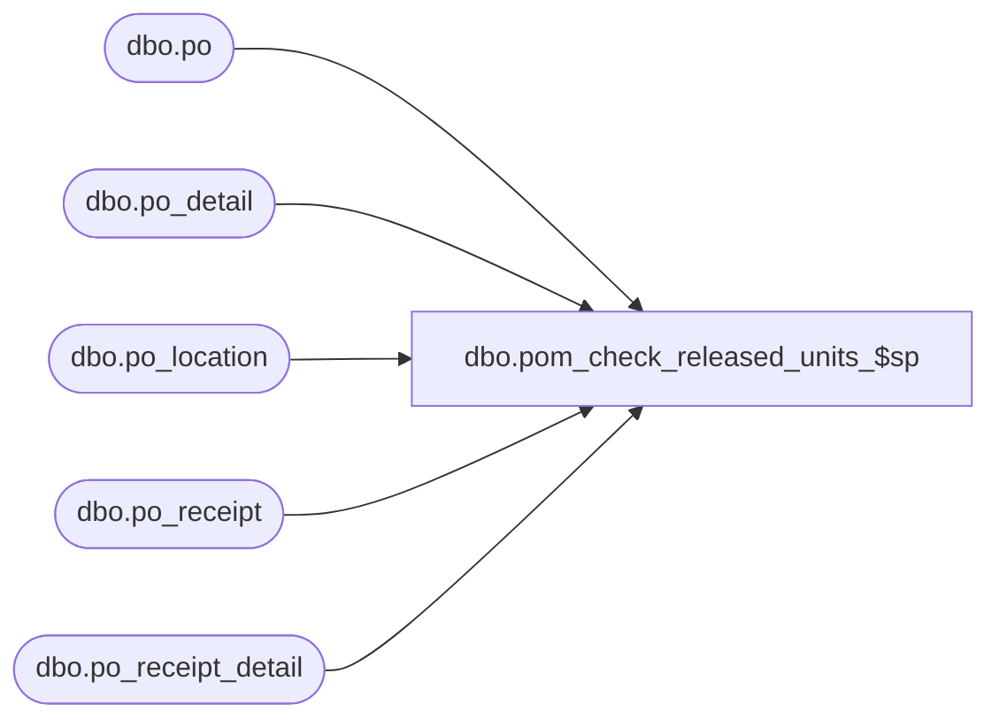

# dbo.pom_check_released_units_$sp

**Database:** me_01  
**Server:** bedrockdb02  

## Architecture Diagram



## Table Dependencies

| Referenced Table |
|---|
| dbo.po |
| dbo.po_detail |
| dbo.po_location |
| dbo.po_receipt |
| dbo.po_receipt_detail |

## Stored Procedure Code

```sql
CREATE PROCEDURE dbo.pom_check_released_units_$sp

	(
		 @blanket_po_number AS NVARCHAR (20)
		,@po_id AS DECIMAL (12, 0)
	)

AS

--	Description: This procedure checks the released units for a blanket po, called by OrderRetriever::CheckReleasedUnits
--	Object GUID: 4DC6DE1A-33A1-4B5A-BD86-915BF05CF070

-----------------------------------------------------------------------------------------------------------------------------
--	Error Trapping: Check If Temp Table(s) Already Exist(s) And Drop If Applicable
-----------------------------------------------------------------------------------------------------------------------------

IF OBJECT_ID (N'tempdb..#temp_pom_check_released_units', N'U') IS NOT NULL
BEGIN

	DROP TABLE #temp_pom_check_released_units

END


-----------------------------------------------------------------------------------------------------------------------------
--	Table Creation: Create Temp Table
-----------------------------------------------------------------------------------------------------------------------------

CREATE TABLE #temp_pom_check_released_units

	(
		 sku_id DECIMAL (13, 0)
		,pack_id DECIMAL (12, 0)
		,units INT
		,total_ordered_pseudo_cost DECIMAL (13, 2)
		,total_ordered_pseudo_retail DECIMAL (13, 2)
	)


-----------------------------------------------------------------------------------------------------------------------------
--	Table Update: Insert Data Into Temp Table (Pass 1)
-----------------------------------------------------------------------------------------------------------------------------

INSERT INTO #temp_pom_check_released_units

	(
		 sku_id
		,pack_id
		,units
		,total_ordered_pseudo_cost
		,total_ordered_pseudo_retail
	)

SELECT
	 A.sku_id
	,NULL AS pack_id
	,- (CASE
			WHEN B.units_all > A.units_filtered THEN A.units_filtered
			WHEN B.units_filtered <= A.units_all THEN B.units_filtered
			END) AS units
	,NULL AS total_ordered_pseudo_cost
	,NULL AS total_ordered_pseudo_retail
FROM

	(
		SELECT
			 po.po_id
			,pr.location_id
			,prd.sku_id
			,SUM (CASE
					WHEN td.sku_id IS NOT NULL THEN ISNULL (prd.units_received, 0) + ISNULL (prd.units_damaged, 0)
					END) AS units_filtered
			,SUM (ISNULL (prd.units_received, 0) + ISNULL (prd.units_damaged, 0)) AS units_all
		FROM
			dbo.po
			INNER JOIN dbo.po_receipt pr ON pr.po_id = po.po_id
				AND pr.document_status NOT IN (1, 7)
			INNER JOIN dbo.po_receipt_detail prd ON prd.po_receipt_id = pr.po_receipt_id
			LEFT JOIN

				(
					SELECT DISTINCT
						pd.sku_id
					FROM
						dbo.po_detail pd
					WHERE
						pd.po_id = @po_id
						AND pd.pack_id IS NULL
				) td ON td.sku_id = prd.sku_id

		WHERE
			po.po_status = 5
			AND po.blanket_po_number = @blanket_po_number
		GROUP BY
			 po.po_id
			,pr.location_id
			,prd.sku_id
	) A

	INNER JOIN

		(
			SELECT
				 po.po_id
				,pl.location_id
				,pd.sku_id
				,SUM (CASE
						WHEN td.sku_id IS NOT NULL THEN pd.ordered_units
						END) AS units_filtered
				,SUM (pd.ordered_units) AS units_all
			FROM
				dbo.po
				INNER JOIN dbo.po_detail pd ON pd.po_id = po.po_id
					AND pd.sku_id IS NOT NULL
				INNER JOIN dbo.po_location pl ON pl.po_id = pd.po_id
					AND pl.po_location_id = pd.po_location_id
				LEFT JOIN

					(
						SELECT DISTINCT
							pd.sku_id
						FROM
							dbo.po_detail pd
						WHERE
							pd.po_id = @po_id
							AND pd.pack_id IS NULL
					) td ON td.sku_id = pd.sku_id

			WHERE
				po.blanket_po_number = @blanket_po_number
			GROUP BY
				 po.po_id
				,pl.location_id
				,pd.sku_id
		) B ON B.po_id = A.po_id AND B.location_id = A.location_id AND B.sku_id = A.sku_id AND (B.units_all > A.units_filtered OR B.units_filtered < A.units_all)


-----------------------------------------------------------------------------------------------------------------------------
--	Table Update: Insert Data Into Temp Table (Pass 2)
-----------------------------------------------------------------------------------------------------------------------------

INSERT INTO #temp_pom_check_released_units

	(
		 sku_id
		,pack_id
		,units
		,total_ordered_pseudo_cost
		,total_ordered_pseudo_retail
	)

SELECT
	 NULL AS sku_id
	,A.pack_id
	,- (CASE
			WHEN B.units_all > A.units_filtered THEN A.units_filtered
			WHEN B.units_filtered <= A.units_all THEN B.units_filtered
			END) AS units
	,NULL AS total_ordered_pseudo_cost
	,NULL AS total_ordered_pseudo_retail
FROM

	(
		SELECT
			 po.po_id
			,pr.location_id
			,prd.pack_id
			,SUM (CASE
					WHEN td.pack_id IS NOT NULL THEN ISNULL (prd.units_received, 0) + ISNULL (prd.units_damaged, 0)
					END) AS units_filtered
			,SUM (ISNULL (prd.units_received, 0) + ISNULL (prd.units_damaged, 0)) AS units_all
		FROM
			dbo.po
			INNER JOIN dbo.po_receipt pr ON pr.po_id = po.po_id
				AND pr.document_status NOT IN (1, 7)
			INNER JOIN dbo.po_receipt_detail prd ON prd.po_receipt_id = pr.po_receipt_id
			LEFT JOIN

				(
					SELECT DISTINCT
						pd.pack_id
					FROM
						dbo.po_detail pd
					WHERE
						pd.po_id = @po_id
						AND pd.sku_id IS NULL
				) td ON td.pack_id = prd.pack_id

		WHERE
			po.po_status = 5
			AND po.blanket_po_number = @blanket_po_number
		GROUP BY
			 po.po_id
			,pr.location_id
			,prd.pack_id
	) A

	INNER JOIN

		(
			SELECT
				 po.po_id
				,pl.location_id
				,pd.pack_id
				,SUM (CASE
						WHEN td.pack_id IS NOT NULL THEN pd.ordered_units
						END) AS units_filtered
				,SUM (pd.ordered_units) AS units_all
			FROM
				dbo.po
				INNER JOIN dbo.po_detail pd ON pd.po_id = po.po_id
					AND pd.pack_id IS NOT NULL
				INNER JOIN dbo.po_location pl ON pl.po_id = pd.po_id
					AND pl.po_location_id = pd.po_location_id
				LEFT JOIN

					(
						SELECT DISTINCT
							pd.pack_id
						FROM
							dbo.po_detail pd
						WHERE
							pd.po_id = @po_id
							AND pd.sku_id IS NULL
					) td ON td.pack_id = pd.pack_id

			WHERE
				po.blanket_po_number = @blanket_po_number
			GROUP BY
				 po.po_id
				,pl.location_id
				,pd.pack_id
		) B ON B.po_id = A.po_id AND B.location_id = A.location_id AND B.pack_id = A.pack_id AND (B.units_all > A.units_filtered OR B.units_filtered < A.units_all)


-----------------------------------------------------------------------------------------------------------------------------
--	Main Query: Return Any Exceptions
-----------------------------------------------------------------------------------------------------------------------------

SELECT
	 ttPCRU.sku_id
	,NULL AS pack_id
	,SUM (ttPCRU.units) AS remaining_units
	,0 AS ordered_pseudo_cost_balance
	,0 AS ordered_pseudo_retail_balance
FROM
	#temp_pom_check_released_units ttPCRU
WHERE
	ttPCRU.sku_id IS NOT NULL
GROUP BY
	ttPCRU.sku_id
HAVING
	SUM (ttPCRU.units) < 0

UNION ALL

SELECT
	 NULL AS sku_id
	,ttPCRU.pack_id
	,SUM (ttPCRU.units) AS remaining_units
	,0 AS ordered_pseudo_cost_balance
	,0 AS ordered_pseudo_retail_balance
FROM
	#temp_pom_check_released_units ttPCRU
WHERE
	ttPCRU.pack_id IS NOT NULL
GROUP BY
	ttPCRU.pack_id
HAVING
	SUM (ttPCRU.units) < 0

UNION ALL

SELECT
	 ttPCRU.sku_id
	,NULL AS pack_id
	,0 AS remaining_units
	,SUM (ttPCRU.total_ordered_pseudo_cost) AS ordered_pseudo_cost_balance
	,0 AS ordered_pseudo_retail_balance
FROM
	#temp_pom_check_released_units ttPCRU
WHERE
	ttPCRU.total_ordered_pseudo_cost IS NOT NULL
GROUP BY
	ttPCRU.sku_id
HAVING
	SUM (ttPCRU.total_ordered_pseudo_cost) < 0

UNION ALL

SELECT
	 ttPCRU.sku_id
	,NULL AS pack_id
	,0 AS remaining_units
	,0 AS ordered_pseudo_cost_balance
	,SUM (ttPCRU.total_ordered_pseudo_retail) AS ordered_pseudo_retail_balance
FROM
	#temp_pom_check_released_units ttPCRU
WHERE
	ttPCRU.total_ordered_pseudo_retail IS NOT NULL
GROUP BY
	ttPCRU.sku_id
HAVING
	SUM (ttPCRU.total_ordered_pseudo_retail) < 0


-----------------------------------------------------------------------------------------------------------------------------
--	Cleanup: Drop Any Remaining Temp Tables
-----------------------------------------------------------------------------------------------------------------------------

IF OBJECT_ID (N'tempdb..#temp_pom_check_released_units', N'U') IS NOT NULL
BEGIN

	DROP TABLE #temp_pom_check_released_units

END
```

