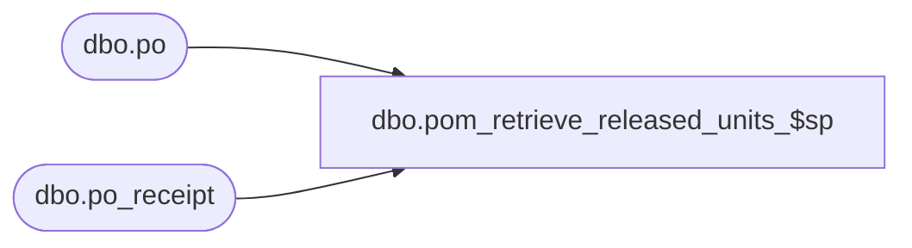

# dbo.pom_retrieve_released_units_$sp

**Database:** me_01  
**Server:** bedrockdb02  

## Architecture Diagram



## Table Dependencies

| Referenced Table |
|---|
| dbo.po |
| dbo.po_receipt |

## Stored Procedure Code

```sql
CREATE PROCEDURE dbo.pom_retrieve_released_units_$sp

	(
		 @po_id AS DECIMAL (12, 0)
		,@use_pack_id AS BIT
		,@use_sku_id AS BIT
	)

AS

--	Description: This procedure retrieves the released units for a blanket po, called by OrderRetriever::RetrieveReleasedUnits
--	Object GUID: 919D44E5-4FDC-4E8F-84A7-884FE01A7DB2

-----------------------------------------------------------------------------------------------------------------------------
--	Declarations / Sets: Declare And Set Variables
-----------------------------------------------------------------------------------------------------------------------------

DECLARE @has_canceled AS BIT
DECLARE @has_open AS BIT
DECLARE @sql_string AS NVARCHAR (4000)


SET @has_canceled = 0
SET @has_open = 0
SET @sql_string = N''


IF EXISTS

	(
		SELECT
			*
		FROM
			dbo.po po1
			INNER JOIN dbo.po po2 ON po2.po_no = po1.blanket_po_number
				AND po2.po_id = @po_id
			INNER JOIN dbo.po_receipt pr ON pr.po_id = po1.po_id
				AND pr.document_status NOT IN (1, 7)
		WHERE
			po1.po_status = 5
	)

BEGIN

	SET @has_canceled = 1

END


IF EXISTS

	(
		SELECT
			*
		FROM
			dbo.po po1
			INNER JOIN dbo.po po2 ON po2.po_no = po1.blanket_po_number
				AND po2.po_id = @po_id
			INNER JOIN dbo.po_receipt pr ON pr.po_id = po1.po_id
				AND pr.document_status NOT IN (1, 7)
		WHERE
			po1.po_status = 4
			AND po1.approval_status NOT IN (1, 3, 7)
	)

BEGIN

	SET @has_open = 1

END


-----------------------------------------------------------------------------------------------------------------------------
--	Dynamic-SQL: Build SQL String
-----------------------------------------------------------------------------------------------------------------------------

SET @sql_string = @sql_string +

	N'
		SELECT
			 B.sku_id
			,B.pack_id
			,B.location_id
			,B.po_line_id
			,SUM (B.units) AS units
			,SUM (B.open_units) AS open_units
			,SUM (B.units_received) AS units_received
		FROM

			(
				SELECT
					 pd.sku_id
					,pd.pack_id
					,plo1.location_id
					,pl1.po_line_id
					,SUM (pd.ordered_units) AS units
					,SUM (CASE
							WHEN po2.po_status = 4 AND po2.approval_status IN (1, 3, 7) THEN pd.ordered_units
							ELSE 0
							END) AS open_units
					,0 AS units_received
				FROM
					dbo.po po1
					INNER JOIN dbo.po po2 ON po2.blanket_po_number = po1.po_no
						AND po2.po_status <> 5
					INNER JOIN dbo.po_line pl1 ON pl1.po_id = po1.po_id
					INNER JOIN dbo.po_line pl2 ON pl2.po_id = po2.po_id
						AND pl2.blanket_po_line_no = pl1.line_no
					INNER JOIN dbo.po_location plo1 ON plo1.po_id = po1.po_id
					INNER JOIN dbo.po_location plo2 ON plo2.po_id = po2.po_id
					INNER JOIN dbo.po_detail pd ON pd.po_id = po2.po_id
						AND pd.po_line_id = pl2.po_line_id
						AND pd.po_location_id = plo2.po_location_id
	'

	+

	(CASE
		WHEN @use_sku_id = 1 AND @use_pack_id = 1 THEN N''
		WHEN @use_sku_id = 1 THEN N'AND pd.pack_id IS NULL'
		WHEN @use_pack_id = 1 THEN N'AND pd.sku_id IS NULL'
		END)

	+

	N'
		WHERE
			po1.po_id = @po_id
		GROUP BY
			 pd.sku_id
			,pd.pack_id
			,plo1.location_id
			,pl1.po_line_id
	'


IF (@has_canceled = 1 OR @has_open = 1)
BEGIN

	SET @sql_string = @sql_string +

		N'
			UNION ALL

			SELECT
				 A.sku_id
				,A.pack_id
				,A.location_id
				,A.po_line_id
				,A.units
				,A.units AS open_units
				,A.units_received
			FROM

				(
					SELECT
						 pd.sku_id
						,pd.pack_id
						,plo1.location_id
						,pl1.po_line_id
						,
		'

		+

		(CASE
			WHEN @has_canceled = 1 AND @has_open = 1 THEN

				N'
					(CASE
						WHEN po2.po_status = 5 THEN
				'

			ELSE N''
			END)

		+

		(CASE
			WHEN @has_canceled = 1 THEN

				N'
					(CASE
						WHEN pd.ordered_units <= SUM (ISNULL (prd.units_received, 0) + ISNULL (prd.units_damaged, 0)) THEN pd.ordered_units
						ELSE SUM (ISNULL (prd.units_received, 0) + ISNULL (prd.units_damaged, 0))
						END)
				'

			ELSE N'0'
			END)

		+

		(CASE
			WHEN @has_canceled = 1 AND @has_open = 1 THEN

				N'
					ELSE 0
					END)
				'

			ELSE N''
			END)

		+ N' AS units
			,
		'

		+

		(CASE
			WHEN @has_canceled = 1 AND @has_open = 1 THEN

				N'
					SUM (CASE
							WHEN po2.po_status = 4 THEN ISNULL (prd.units_received, 0) + ISNULL (prd.units_damaged, 0)
							ELSE 0
							END)
				'

			WHEN @has_open = 1 THEN N'SUM (ISNULL (prd.units_received, 0) + ISNULL (prd.units_damaged, 0))'
			ELSE N'0'
			END)

		+ N' AS units_received
			FROM
				dbo.po po1
				INNER JOIN dbo.po po2 ON po2.blanket_po_number = po1.po_no
					AND
					(
		'

		+

		(CASE
			WHEN @has_open = 1 THEN

				N'
					(
						po2.po_status = 4
						AND po2.approval_status NOT IN (1, 3, 7)
					)
				'

			ELSE N''
			END)

		+

		(CASE
			WHEN @has_open = 1 AND @has_canceled = 1 THEN

				N'
					OR
				'

			ELSE N''
			END)

		+

		(CASE
			WHEN @has_canceled = 1 THEN

				N'
					(
						po2.po_status = 5
					)
				'

			ELSE N''
			END)

		+

		N'
				)
			INNER JOIN dbo.po_line pl1 ON pl1.po_id = po1.po_id
			INNER JOIN dbo.po_line pl2 ON pl2.po_id = po2.po_id
				AND pl2.blanket_po_line_no = pl1.line_no
			INNER JOIN dbo.po_location plo1 ON plo1.po_id = po1.po_id
			INNER JOIN dbo.po_location plo2 ON plo2.po_id = po2.po_id
			INNER JOIN dbo.po_detail pd ON pd.po_id = po2.po_id
				AND pd.po_line_id = pl2.po_line_id
				AND pd.po_location_id = plo2.po_location_id
		'

		+

		(CASE
			WHEN @use_sku_id = 1 AND @use_pack_id = 1 THEN N''
			WHEN @use_sku_id = 1 THEN N'AND pd.pack_id IS NULL'
			WHEN @use_pack_id = 1 THEN N'AND pd.sku_id IS NULL'
			END)

		+

		N'
				INNER JOIN dbo.po_receipt pr ON pr.po_id = po2.po_id
					AND pr.location_id = plo2.location_id
					AND pr.document_status NOT IN (1, 7)
				INNER JOIN dbo.po_receipt_detail prd ON prd.po_receipt_id = pr.po_receipt_id
					AND prd.sku_id = pd.sku_id
			WHERE
				po1.po_id = @po_id
			GROUP BY
				 pd.sku_id
				,pd.pack_id
				,plo1.location_id
				,pl1.po_line_id
		'

		+

		(CASE
			WHEN @has_canceled = 1 AND @has_open = 1 THEN N',po2.po_status'
			ELSE N''
			END)

		+

		N'
					,pd.ordered_units
					,po2.po_id
					,plo2.location_id
			) A
		'

END


SET @sql_string = @sql_string +

	N'
			) B

		GROUP BY
			 B.sku_id
			,B.pack_id
			,B.location_id
			,B.po_line_id
	'


-----------------------------------------------------------------------------------------------------------------------------
--	Main Query: Final Display / Output
-----------------------------------------------------------------------------------------------------------------------------

EXECUTE sys.sp_executesql

	 @sql_string
	,N'
		@po_id AS DECIMAL (12, 0)
	  '
	,@po_id
```

