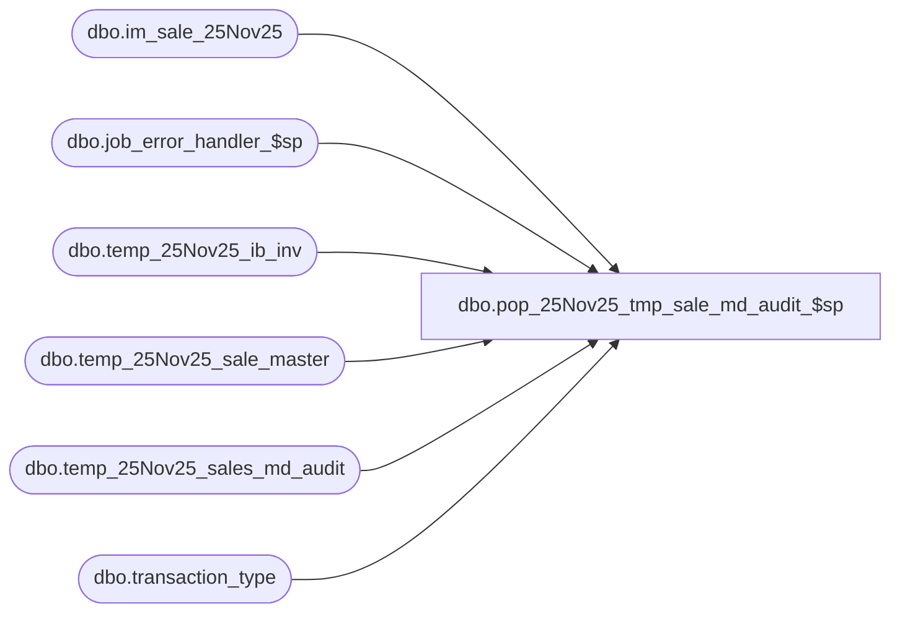

# dbo.pop_25Nov25_tmp_sale_md_audit_$sp

**Database:** me_01  
**Server:** bedrockdb02  

## Architecture Diagram



## Table Dependencies

| Referenced Table |
|---|
| dbo.im_sale_25Nov25 |
| dbo.job_error_handler_$sp |
| dbo.temp_25Nov25_ib_inv |
| dbo.temp_25Nov25_sale_master |
| dbo.temp_25Nov25_sales_md_audit |
| dbo.transaction_type |

## Stored Procedure Code

```sql
CREATE PROCEDURE [dbo].[pop_25Nov25_tmp_sale_md_audit_$sp]
	(@job_id INT
	, @min_im_sale_number DECIMAL(24,0)
	, @max_im_sale_number DECIMAL(24,0)
	, @min_location_id SMALLINT
	, @max_location_id SMALLINT
	, @debug_flag BIT)

AS

/*
	Version		: 1.00
	Created		: 2007/04/24
	Created by	: Pierrette Lemay
	Description	: This procedure is part of the Sales Posting process and is called by post_sales_batch_$sp.
			  It's called after populate_temp_ib_inventory_$sp in the process because it's using the content
			  of temp_ib_inventory as an input in order to store the sales markdown audit information by job.
			  The content of this table is used later in the process to update sales_markdown_audit.

	History: Updated for Enterprise Selling (January 2010)				  		  
*/

BEGIN
	-- c_sale_type, c_return_type, c_layaway_pickup_type
	DECLARE @c_sale_type SMALLINT, @c_discount_type	 SMALLINT, @c_available	TINYINT, @c_return_type	SMALLINT,
			@c_psc_type SMALLINT, @c_promo_type SMALLINT, @c_layaway_pickup_type SMALLINT, @line_id SMALLINT,
			@c_job_type	TINYINT, @proc_name	 NVARCHAR(30), @sql_err_num DECIMAL(38,0), @table_name NVARCHAR(30), 
			@operation_name	NVARCHAR(30), @error_msg	NVARCHAR(2000), @job_type TINYINT, @c_true BIT, @c_false BIT,
			@n_retry TINYINT, @delay NCHAR(8), @return_flag BIT, @c_exchange_rate_diff SMALLINT, @c_cust_order_promo SMALLINT,
			@c_cust_order_sale SMALLINT, @c_cust_order_return SMALLINT, @c_cust_order_discount SMALLINT

	SELECT   @job_type			= 1
			, @proc_name			= N'populate_tmp_sale_md_audit_$sp'
			, @c_false				= 0
			, @c_true				= 1
			, @c_sale_type			= 600
			, @c_discount_type		= 601
			, @c_cust_order_discount = 603
			, @c_cust_order_sale	= 605
			, @c_return_type		= 610
			, @c_cust_order_return	= 615
			, @c_available			= 1
			, @c_psc_type			= 710
			, @c_promo_type			= 701
			, @c_cust_order_promo	= 703
			, @c_layaway_pickup_type = 622
			, @c_exchange_rate_diff = 640
			, @n_retry				= 0
			, @delay				= N'00:00:05'

	BEGIN TRY
		SET @line_id = 10

		BEGIN TRAN
		INSERT INTO temp_25Nov25_sales_md_audit 
			( job_id
			, transaction_no
			, register
			, location_id
			, upc_number
			, sku_id
			, style_id
			, color_id
			, transaction_date
			, transaction_line
			, transaction_type
			, units_affected
			, sold_price_valuation
			, sold_price_selling
			, tax_amount_valuation
			, tax_amount_selling
			, price_override_flag
			, promo_md_valuation
			, promo_md_selling
			, pos_md_override_valuation
			, pos_md_override_selling
			, pos_md_variance_valuation
			, pos_md_variance_selling
			, pos_discount_amount_valuation
			, pos_discount_amount_selling
			, exchange_rate_difference) 
		SELECT  DISTINCT @job_id
				, s.transaction_no
				, s.register
				, s.location_id
				, s.upc_number
				, m.sku_id
				, m.style_id
				, m.color_id
				, m.transaction_date
				, s.transaction_line
				, SUBSTRING(t.transaction_type_desc, 1, 20)
				, s.units
				, s.sold_at_price * m.exchange_rate sold_price_valuation
				, s.sold_at_price  sold_price_selling
				, NULL tax_amount_valuation
				, NULL tax_amount_selling
				, s.price_override
				, 0 promo_md_valuation
				, 0 promo_md_selling
				, 0 pos_md_override_valuation
				, 0 pos_md_override_selling
				, 0 pos_md_variance_valuation
				, 0 pos_md_variance_selling
				, 0 pos_discount_amount_valuation
				, 0 pos_discount_amount_selling
				, 0 exchange_rate_difference
		FROM temp_25Nov25_ib_inv i, temp_25Nov25_sale_master m, im_sale_25Nov25 s, transaction_type t
		WHERE i.job_id = @job_id
		AND i.location_id BETWEEN @min_location_id AND @max_location_id
		AND i.sale_md_audit_flag = 1
		-- join temp_ib_inventory with temp_sale_master on sku, location and transaction_date
		AND m.job_id = @job_id
		AND i.job_id = m.job_id
		AND m.location_id BETWEEN @min_location_id AND @max_location_id
		AND i.sku_id = m.sku_id
		AND i.location_id = m.location_id
		AND i.transaction_date = m.transaction_date
		-- join temp_ib_inventory with im_sale on transaction_date, transaction_no, sku_id, location_id
		AND s.im_sale_number BETWEEN @min_im_sale_number AND @max_im_sale_number
		AND s.location_id BETWEEN @min_location_id AND @max_location_id
		AND i.transaction_date = s.transaction_date
		AND i.transaction_no = s.transaction_no
		AND i.transaction_line = s.transaction_line
		AND i.sku_id = s.sku_id
		AND i.location_id = s.location_id
		-- join temp_sale_master with im_sale s on transaction_date, location_id, style_id and sku_id
		AND m.transaction_date = s.transaction_date
		AND m.location_id = s.location_id
		AND m.style_id = s.style_id
		AND m.sku_id = s.sku_id
		AND s.aw_transaction_type IN (@c_sale_type, @c_return_type, @c_layaway_pickup_type)
		-- join im_sale with transaction_type
		AND s.aw_transaction_type = t.transaction_type_code
		UNION 
		SELECT  DISTINCT @job_id
				, s.transaction_no
				, s.register
				, CASE WHEN s.credit_originating_store = 0 THEN s.location_id
					   ELSE s.originating_location_id
				  END location_id
				, s.upc_number
				, m.sku_id
				, m.style_id
				, m.color_id
				, m.transaction_date
				, s.transaction_line
				, SUBSTRING(t.transaction_type_desc, 1, 20)
				, s.units
				, s.sold_at_price * m.exchange_rate sold_price_valuation
				, s.sold_at_price  sold_price_selling
				, NULL tax_amount_valuation
				, NULL tax_amount_selling
				, s.price_override
				, 0 promo_md_valuation
				, 0 promo_md_selling
				, 0 pos_md_override_valuation
				, 0 pos_md_override_selling
				, 0 pos_md_variance_valuation
				, 0 pos_md_variance_selling
				, 0 pos_discount_amount_valuation
				, 0 pos_discount_amount_selling
				, 0 exchange_rate_difference
		FROM temp_25Nov25_ib_inv i, temp_25Nov25_sale_master m, im_sale_25Nov25 s, transaction_type t
		WHERE i.job_id = @job_id
		--AND i.location_id BETWEEN @min_location_id AND @max_location_id
		AND i.sale_md_audit_flag = 1
		-- join temp_ib_inventory with temp_sale_master on sku, location and transaction_date
		AND m.job_id = @job_id
		AND i.job_id = m.job_id
		--AND m.location_id BETWEEN @min_location_id AND @max_location_id
		AND i.sku_id = m.sku_id
		AND i.location_id = m.location_id
		AND i.transaction_date = m.transaction_date
		-- join temp_ib_inventory with im_sale on transaction_date, transaction_no, sku_id, location_id
		AND s.im_sale_number BETWEEN @min_im_sale_number AND @max_im_sale_number
		--AND s.location_id BETWEEN @min_location_id AND @max_location_id
		AND i.transaction_date = s.transaction_date
		AND i.transaction_no = s.transaction_no
		AND i.transaction_line = s.transaction_line
		AND i.sku_id = s.sku_id
		AND (i.location_id = s.location_id OR i.location_id = s.originating_location_id)
		-- join temp_sale_master with im_sale s on transaction_date, location_id, style_id and sku_id
		AND m.transaction_date = s.transaction_date
		AND (m.location_id = s.location_id OR m.location_id = s.originating_location_id)
		AND m.style_id = s.style_id
		AND m.sku_id = s.sku_id
		AND s.aw_transaction_type IN (@c_cust_order_sale, @c_cust_order_return)
		-- join im_sale with transaction_type
		AND s.aw_transaction_type = t.transaction_type_code
		ORDER BY s.transaction_no, s.transaction_line

		COMMIT TRAN


		SET @line_id = 20

		UPDATE STATISTICS temp_25Nov25_sales_md_audit


		SELECT @line_id = 30
			  , @n_retry = 0

		update_promo:
		BEGIN TRY
			-- UPDATE temp_sales_markdown_audit: set promo field 
			-- Implement a retry to prevent contention on the table
			BEGIN TRAN

			UPDATE t
			SET promo_md_valuation = I.valuation_retail
				, promo_md_selling = I.selling_retail
			FROM temp_25Nov25_sales_md_audit t, 
				( SELECT job_id, transaction_no, transaction_line, location_id, sku_id,
							SUM(transaction_valuation_retail) valuation_retail, 
							SUM(transaction_selling_retail) selling_retail
					 FROM temp_25Nov25_ib_inv 
					 WHERE job_id = @job_id 
					 AND transaction_type_code IN (@c_promo_type, @c_cust_order_promo)
					 AND sale_md_audit_flag = 1
					 GROUP BY job_id, transaction_no, transaction_line, location_id, sku_id ) I
			WHERE t.job_id = @job_id
			AND t.job_id = I.job_id
				-- join temp_sales_markdown_audit with temp_ib_inventory on transaction_no,transaction_line, sku_id, location_id,  
			AND t.transaction_no = I.transaction_no
			AND t.transaction_line = I.transaction_line
			AND t.location_id = I.location_id
			AND t.sku_id = I.sku_id

			COMMIT TRAN


		END TRY
		BEGIN CATCH
			-- Test if the transaction is uncommittable
			IF (XACT_STATE()) = -1
				ROLLBACK TRANSACTION
			-- Test if the transaction is active and valid.
			IF (XACT_STATE()) = 1
				COMMIT TRANSACTION
		
			SET @n_retry = @n_retry + 1

			IF @n_retry <= 3 
			BEGIN	
				WAITFOR DELAY @delay
				GOTO update_promo
			END
			ELSE
				RAISERROR (N'Error: transaction failed in job #%i after 3 retry because of ', -- Message text.
						16, -- Severity.
						1, -- State.
						@job_id)
		END CATCH
		SELECT @line_id = 40,
			   @n_retry = 0

		variance_no_over:
		-- UPDATE temp_sales_markdown_audit: set variance fields when no price_override

		BEGIN TRY
			BEGIN TRAN 

			UPDATE t
			SET pos_md_override_valuation = 0
				, pos_md_override_selling = 0
				, pos_md_variance_valuation = I.valuation_retail 
				, pos_md_variance_selling   = I.selling_retail
			FROM temp_25Nov25_sales_md_audit t,
					( SELECT job_id, transaction_no, transaction_line, location_id, sku_id,
							SUM(transaction_valuation_retail) valuation_retail, 
							SUM(transaction_selling_retail) selling_retail
					 FROM temp_25Nov25_ib_inv 
					 WHERE job_id = @job_id 
					 AND transaction_type_code IN (@c_discount_type, @c_cust_order_discount)
					 AND sale_md_audit_flag = 1
					 GROUP BY job_id, transaction_no, transaction_line, location_id, sku_id ) I
			WHERE t.job_id = @job_id
			AND t.price_override_flag = 0
			AND t.job_id = I.job_id
			AND t.transaction_no = I.transaction_no
			AND t.transaction_line = I.transaction_line
			AND t.location_id = I.location_id 
			AND t.sku_id = I.sku_id

			COMMIT TRAN

		END TRY
		BEGIN CATCH
			-- Test if the transaction is uncommittable
			IF (XACT_STATE()) = -1
				ROLLBACK TRANSACTION
			-- Test if the transaction is active and valid.
			IF (XACT_STATE()) = 1
				COMMIT TRANSACTION
		
			SET @n_retry = @n_retry + 1

			IF @n_retry <= 3 
			BEGIN	
				WAITFOR DELAY @delay
				GOTO variance_no_over
			END
			ELSE
				RAISERROR (N'Error: transaction failed in job #%i after 3 retry because of ', -- Message text.
						16, -- Severity.
						1, -- State.
						@job_id)
		END CATCH

		SELECT @line_id = 50,
			   @n_retry = 0

		-- UPDATE temp_sales_markdown_audit: set variance fields when price_override
		variance_price_over:
		BEGIN TRY
			BEGIN TRAN

			UPDATE t
			SET pos_md_override_valuation = I.valuation_retail 
					, pos_md_override_selling = I.selling_retail
					, pos_md_variance_valuation = 0
					, pos_md_variance_selling = 0
			FROM temp_25Nov25_sales_md_audit t,
					( SELECT job_id, transaction_no, transaction_line, location_id, sku_id,
							SUM(transaction_valuation_retail) valuation_retail, 
							SUM(transaction_selling_retail) selling_retail
					 FROM temp_25Nov25_ib_inv 
					 WHERE job_id = @job_id 
					 AND transaction_type_code IN (@c_discount_type, @c_cust_order_discount)
					 AND sale_md_audit_flag = 1
					 GROUP BY job_id, transaction_no, transaction_line, location_id, sku_id ) I
			WHERE t.job_id = @job_id
			AND t.price_override_flag = 1
			AND t.job_id = I.job_id
			AND t.transaction_no = I.transaction_no
			AND t.transaction_line = I.transaction_line
			AND t.location_id = I.location_id 
			AND t.sku_id = I.sku_id
	
			COMMIT TRAN

 
		END TRY
		BEGIN CATCH
			-- Test if the transaction is uncommittable
			IF (XACT_STATE()) = -1
				ROLLBACK TRANSACTION
			-- Test if the transaction is active and valid.
			IF (XACT_STATE()) = 1
				COMMIT TRANSACTION
		
			SET @n_retry = @n_retry + 1

			IF @n_retry <= 3 
			BEGIN	
				WAITFOR DELAY @delay
				GOTO variance_price_over
			END
			ELSE
				RAISERROR (N'Error: transaction failed in job #%i after 3 retry because of ', -- Message text.
						16, -- Severity.
						1, -- State.
						@job_id)
		END CATCH

		SELECT @line_id = 60,
			   @n_retry = 0

		update_discount:
		BEGIN TRY
			-- UPDATE #tt_sales_markdown_audit: set discount fields

			BEGIN TRAN

			UPDATE t
			SET pos_discount_amount_valuation = IB.transaction_valuation_retail
				, pos_discount_amount_selling = IB.transaction_selling_retail
			FROM temp_25Nov25_sales_md_audit t, 
				( SELECT job_id, transaction_no, transaction_line, location_id, sku_id,
					SUM(transaction_valuation_retail) transaction_valuation_retail, 
					SUM(transaction_selling_retail) transaction_selling_retail
				FROM temp_25Nov25_ib_inv 
				WHERE job_id = @job_id
				AND transaction_type_code IN (@c_discount_type, @c_cust_order_discount)
				AND sale_md_audit_flag = 0
				GROUP BY job_id, transaction_no, transaction_line, location_id, sku_id )IB
			WHERE t.job_id = @job_id
			AND t.job_id = IB.job_id
			AND t.transaction_no = IB.transaction_no
			AND t.transaction_line = IB.transaction_line 
			AND t.location_id = IB.location_id
			AND t.sku_id = IB.sku_id

			COMMIT TRAN


		END TRY
		BEGIN CATCH
			-- Test if the transaction is uncommittable
			IF (XACT_STATE()) = -1
				ROLLBACK TRANSACTION
			-- Test if the transaction is active and valid.
			IF (XACT_STATE()) = 1
				COMMIT TRANSACTION
		
			SET @n_retry = @n_retry + 1

			IF @n_retry <= 3 
			BEGIN	
				WAITFOR DELAY @delay
				GOTO update_discount
			END
			ELSE
				RAISERROR (N'Error: transaction failed in job #%i after 3 retry because of ', -- Message text.
						16, -- Severity.
						1, -- State.
						@job_id)
		END CATCH

		SELECT @line_id = 70,
			   @n_retry = 0

		update_ex_rate:
		BEGIN TRY

			BEGIN TRAN

			UPDATE a
			SET a.exchange_rate_difference = I.valuation_retail
			FROM temp_25Nov25_sales_md_audit a,
					( SELECT job_id, transaction_no, transaction_line, location_id, sku_id,
							SUM(transaction_valuation_retail) valuation_retail
					 FROM temp_25Nov25_ib_inv 
					 WHERE job_id = @job_id 
					 AND transaction_type_code = @c_exchange_rate_diff
					 GROUP BY job_id, transaction_no, transaction_line, location_id, sku_id ) I
			WHERE a.job_id = @job_id
			-- join temp_sales_markdown_audit with temp_ib_inventory on job_id, transaction_no, transaction_line, location_id, sku_id
			AND a.job_id = I.job_id
			AND a.transaction_no = I.transaction_no
			AND a.transaction_line = I.transaction_line
			AND a.location_id = I.location_id 
			AND a.sku_id = I.sku_id

			COMMIT TRAN
			

		END TRY
		BEGIN CATCH
			-- Test if the transaction is uncommittable
			IF (XACT_STATE()) = -1
				ROLLBACK TRANSACTION
			-- Test if the transaction is active and valid.
			IF (XACT_STATE()) = 1
				COMMIT TRANSACTION
		
			SET @n_retry = @n_retry + 1

			IF @n_retry <= 3 
			BEGIN	
				WAITFOR DELAY @delay
				GOTO update_ex_rate
			END
			ELSE
				RAISERROR (N'Error: transaction failed in job #%i after 3 retry because of ', -- Message text.
						16, -- Severity.
						1, -- State.
						@job_id)
		END CATCH

	END TRY
	BEGIN CATCH
		-- Test if the transaction is uncommittable
		IF (XACT_STATE()) = -1
			ROLLBACK TRANSACTION

		-- Test if the transaction is active and valid.
		IF (XACT_STATE()) = 1
			COMMIT TRANSACTION
		
		IF @line_id = 10
			SELECT    @table_name		= N'temp_sales_markdown_audit'
					, @operation_name	= N'INSERT'
					, @error_msg		= ERROR_MESSAGE()
					, @sql_err_num		= ERROR_NUMBER()
		ELSE IF @line_id = 20
			SELECT    @table_name		= N'temp_sales_markdown_audit'
					, @operation_name	= N'UPDATE STATISTICS'
					, @error_msg		= ERROR_MESSAGE()
					, @sql_err_num		= ERROR_NUMBER()
		ELSE 
			SELECT    @table_name		= N'temp_sales_markdown_audit'
					, @operation_name	= N'UPDATE'
					, @error_msg		= @error_msg + ERROR_MESSAGE()
					, @sql_err_num		= ERROR_NUMBER()

		EXEC job_error_handler_$sp
					@c_job_type 
					, @job_id 
					, @proc_name 
					, @line_id 
					, @sql_err_num 
					, @table_name 
					, @operation_name 
					, @error_msg 
					, @c_true
	END CATCH
END
```

