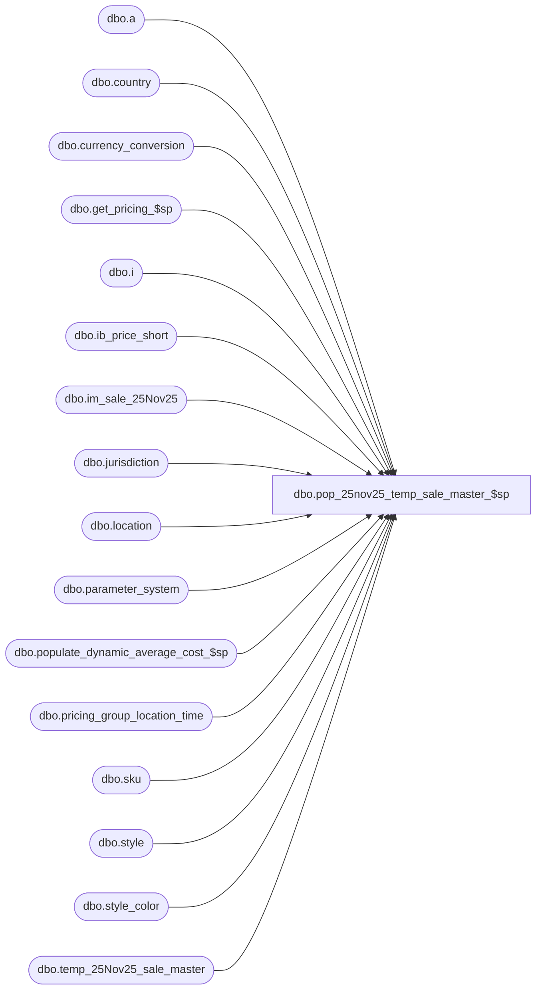

# dbo.pop_25nov25_temp_sale_master_$sp

**Database:** me_01  
**Server:** bedrockdb02  

## Architecture Diagram



## Table Dependencies

| Referenced Table |
|---|
| dbo.a |
| dbo.country |
| dbo.currency_conversion |
| dbo.get_pricing_$sp |
| dbo.i |
| dbo.ib_price_short |
| dbo.im_sale_25Nov25 |
| dbo.jurisdiction |
| dbo.location |
| dbo.parameter_system |
| dbo.populate_dynamic_average_cost_$sp |
| dbo.pricing_group_location_time |
| dbo.sku |
| dbo.style |
| dbo.style_color |
| dbo.temp_25Nov25_sale_master |

## Stored Procedure Code

```sql
CREATE PROCEDURE [dbo].[pop_25nov25_temp_sale_master_$sp]

   @job_id AS INT
  ,@min_im_sale_number AS DECIMAL (24, 0)
  ,@max_im_sale_number AS DECIMAL (24, 0)
  ,@min_location_id AS SMALLINT
  ,@max_location_id AS SMALLINT
  ,@job_debug_flag AS BIT

AS

SET NOCOUNT ON

/*
Description: This procedure is part of the Sales Posting process and is called by post_sales_batch_$sp.  It gets the pricing information by job and stores
it in temp_sale_master. The content of this table is used by populate_temp_ib_inventory_$sp to determine if the procedure  needs to generate a variance, a promo,
and additional discount, a price status change...

History:
9/30/2015	Ivan Dimitrov		142445 - transactions type 602 cause duplicate key error in #temp_average_cost
9/30/2015	Ivan Dimitrov		143201 - Sale-customer order transaction 605 does not pick the cost from the virtual transfer when calculating average cost
12/18/2015	Ivan Dimitrov		152315 - Virtual Transfer and ES sale cost calculations when using fixed average cost
*/

-----------------------------------------------------------------------------------------------------------------------------
--	Declarations / Sets: Declare And Set Variables
-----------------------------------------------------------------------------------------------------------------------------

DECLARE
   @app_name AS NVARCHAR (5)
  ,@avg_cost_level AS TINYINT
  ,@c_avg_cost_by_chain AS TINYINT
  ,@c_avg_cost_by_jurisdiction AS TINYINT
  ,@c_avg_cost_by_location AS TINYINT
  ,@c_false AS BIT
  ,@c_true AS BIT
  ,@crs_sale_flag AS BIT
  ,@curr_transaction_date AS SMALLDATETIME
  ,@Date AS SMALLDATETIME
  ,@error_msg AS NVARCHAR (4000)
  ,@ib_average_cost_type AS NCHAR (1)
  ,@job_type AS TINYINT
  ,@line_id AS SMALLINT
  ,@operation_name AS NVARCHAR (30)
  ,@proc_name AS NVARCHAR (30)
  ,@sql_err_num AS DECIMAL (38, 0)
  ,@status AS INT
  ,@style_count AS INT
  ,@table_name AS NVARCHAR (30)


SELECT
   @app_name = N'MERCH'
  ,@avg_cost_level = PS.ib_average_cost_location_level
  ,@c_avg_cost_by_chain = 2
  ,@c_avg_cost_by_jurisdiction = 3
  ,@c_avg_cost_by_location = 1
  ,@c_false = 0
  ,@c_true = 1
  ,@crs_sale_flag = 0
  ,@Date = GETDATE ()
  ,@ib_average_cost_type = PS.ib_average_cost_type
  ,@job_type = 1
  ,@line_id = 10
  ,@proc_name = OBJECT_NAME (@@PROCID)
  ,@status = 0
  ,@style_count = 0
FROM
  dbo.parameter_system PS


-----------------------------------------------------------------------------------------------------------------------------
--	Error Trapping: Check If Temp Table(s) Already Exist(s) And Drop If Applicable
-----------------------------------------------------------------------------------------------------------------------------

IF OBJECT_ID (N'tempdb..#pseudo_style_cost', N'U') IS NOT NULL
BEGIN

  DROP TABLE #pseudo_style_cost

END


IF OBJECT_ID (N'tempdb..#style_goal_imu', N'U') IS NOT NULL
BEGIN

  DROP TABLE #style_goal_imu

END


IF OBJECT_ID (N'tempdb..#temp_avg_cost_pseudo_style', N'U') IS NOT NULL
BEGIN

  DROP TABLE #temp_avg_cost_pseudo_style

END


IF OBJECT_ID (N'tempdb..#temp_current_retail', N'U') IS NOT NULL
BEGIN

  DROP TABLE #temp_current_retail

END


IF OBJECT_ID (N'tempdb..#temp_effective_retail', N'U') IS NOT NULL
BEGIN

  DROP TABLE #temp_effective_retail

END


IF OBJECT_ID (N'tempdb..#temp_fixed_average_cost', N'U') IS NOT NULL
BEGIN

  DROP TABLE #temp_fixed_average_cost

END


IF OBJECT_ID (N'tempdb..#temp_issued_retail', N'U') IS NOT NULL
BEGIN

  DROP TABLE #temp_issued_retail

END


IF OBJECT_ID (N'tempdb..#temp_item_retail_price', N'U') IS NOT NULL
BEGIN

  DROP TABLE #temp_item_retail_price

END


IF OBJECT_ID (N'tempdb..#temp_promo_retail', N'U') IS NOT NULL
BEGIN

  DROP TABLE #temp_promo_retail

END


IF OBJECT_ID (N'tempdb.dbo.#temp_wrk_price_lookup', N'U') IS NOT NULL
BEGIN

  DROP TABLE dbo.#temp_wrk_price_lookup

END


-----------------------------------------------------------------------------------------------------------------------------
--	Table Create: Create Table Shells
-----------------------------------------------------------------------------------------------------------------------------

CREATE TABLE #pseudo_style_cost

  (
     style_id DECIMAL (12, 0) NOT NULL
    ,location_id SMALLINT NOT NULL
    ,transaction_date SMALLDATETIME NOT NULL
    ,cost_rate FLOAT NOT NULL
    ,pseudo_price_status_id SMALLINT NOT NULL
    ,avg_tot_val_retail_sold DECIMAL (16, 4) NULL
    ,avg_total_val_retail_sold DECIMAL (14, 2) NOT NULL
    ,avg_total_selling_retail_sold DECIMAL (14, 2) NOT NULL
    ,sku_id DECIMAL (13, 0) NULL
  )


CREATE TABLE #style_goal_imu

  (
     style_id DECIMAL (12, 0) NOT NULL
    ,goal_imu_level_id INT NOT NULL
    ,goal_imu_percent DECIMAL (5, 2) NULL
    ,hierarchy_level_id INT NOT NULL
    ,hierarchy_group_id INT NOT NULL
  )


CREATE TABLE #temp_avg_cost_pseudo_style

  (
     style_id DECIMAL (12, 0) NOT NULL
    ,location_id SMALLINT NOT NULL
    ,transaction_date SMALLDATETIME NOT NULL
    ,avg_tot_val_retail_sold DECIMAL (16, 4) NULL
    ,avg_tot_selling_retail_sold DECIMAL (16, 4) NULL
  )


CREATE TABLE #temp_current_retail

  (
     jurisdiction_id SMALLINT NOT NULL
    ,location_id SMALLINT NOT NULL
    ,style_id DECIMAL (12, 0) NOT NULL
    ,style_color_id DECIMAL (13, 0) NOT NULL
    ,color_id SMALLINT NOT NULL
    ,price_status_id SMALLINT NOT NULL
    ,valuation_unit_retail DECIMAL (14, 2) NOT NULL
    ,selling_unit_retail DECIMAL (14, 2) NOT NULL
    ,document_number NVARCHAR (20)
    ,effective_date SMALLDATETIME
    ,price_change_type SMALLINT
    ,sku_id DECIMAL (13, 0) NULL
  )


CREATE TABLE #temp_effective_retail

  (
     transaction_date SMALLDATETIME NOT NULL
    ,jurisdiction_id SMALLINT NOT NULL
    ,location_id SMALLINT NOT NULL
    ,style_id DECIMAL (12, 0) NOT NULL
    ,style_color_id DECIMAL (13, 0) NOT NULL
    ,color_id SMALLINT NOT NULL
    ,price_status_id SMALLINT NOT NULL
    ,valuation_unit_retail DECIMAL (14, 2) NOT NULL
    ,selling_unit_retail DECIMAL (14, 2) NOT NULL
    ,sku_id DECIMAL (13, 0) NULL
  )


CREATE TABLE #temp_fixed_average_cost

  (
     style_id DECIMAL (12, 0) NOT NULL
    ,location_id SMALLINT NOT NULL
    ,transaction_date SMALLDATETIME NOT NULL
    ,style_type TINYINT NOT NULL
    ,jurisdiction_id SMALLINT NOT NULL
    ,cost_rate FLOAT NULL
    ,avg_tot_val_retail_sold DECIMAL (16, 4) NULL
    ,avg_tot_selling_retail_sold DECIMAL (16, 4) NULL
  )


CREATE TABLE #temp_issued_retail

  (
     transaction_date SMALLDATETIME NOT NULL
    ,jurisdiction_id SMALLINT NOT NULL
    ,location_id SMALLINT NOT NULL
    ,style_id DECIMAL (12, 0) NOT NULL
    ,style_color_id DECIMAL (13, 0) NOT NULL
    ,color_id SMALLINT NOT NULL
    ,price_status_id SMALLINT NOT NULL
    ,valuation_retail_price DECIMAL (14, 2) NOT NULL
    ,selling_retail_price DECIMAL (14, 2) NOT NULL
    ,sku_id DECIMAL (13, 0) NULL
  )


CREATE TABLE #temp_item_retail_price

  (
     style_id DECIMAL (12, 0) NOT NULL
    ,style_type TINYINT NOT NULL
    ,location_id SMALLINT NOT NULL
    ,jurisdiction_id SMALLINT NOT NULL
    ,transaction_date SMALLDATETIME NOT NULL
    ,cost_rate FLOAT NULL
    ,total_sold_at_price DECIMAL (16, 4) NOT NULL
    ,total_units INT NOT NULL
    ,sku_id DECIMAL (13, 0) NULL
  )


CREATE TABLE #temp_promo_retail

  (
     transaction_date SMALLDATETIME NOT NULL
    ,jurisdiction_id SMALLINT NOT NULL
    ,location_id SMALLINT NOT NULL
    ,style_id DECIMAL (12, 0) NOT NULL
    ,style_color_id DECIMAL (13, 0) NOT NULL
    ,color_id SMALLINT NOT NULL
    ,price_status_id SMALLINT NOT NULL
    ,valuation_retail_price DECIMAL (14, 2) NOT NULL
    ,selling_retail_price DECIMAL (14, 2) NOT NULL
    ,sku_id DECIMAL (13, 0) NULL
  )


CREATE TABLE dbo.#temp_wrk_price_lookup

  (
     jurisdiction_id SMALLINT NULL
    ,location_id SMALLINT NULL
    ,style_id DECIMAL (12, 0) NULL
    ,color_id SMALLINT NULL
    ,style_color_id DECIMAL (13, 0) NULL
    ,sku_id DECIMAL (13, 0) NULL
  )


BEGIN TRY

  SET @line_id = 20

-----------------------------------------------------------------------------------------------------------------------------
--	Data Population: Populate "#temp_item_retail_price"
-----------------------------------------------------------------------------------------------------------------------------

-- im_sale contains all the transactions currently posted, we need to calculate and store the pricing information for the transactions that belong to
-- the current batch and for the transactions that will be credited to the originate location id because the price of an item could be different from
-- one location to another. So,  populate #temp_item_retail_price for transactions to apply to im_sale.location_id

  INSERT INTO #temp_item_retail_price

    (
       style_id
      ,style_type
      ,location_id
      ,jurisdiction_id
      ,transaction_date
      ,total_sold_at_price
      ,total_units
      ,sku_id
    )

  SELECT
     s.style_id
    ,s.style_type
    ,i.location_id
    ,l.jurisdiction_id
    ,i.transaction_date
    ,SUM (i.sold_at_price * i.units) AS total_sold_at_price
    ,SUM (i.units) AS total_units
    ,i.sku_id
  FROM
    dbo.im_sale_25Nov25 i
    INNER JOIN dbo.style s ON s.style_id = i.style_id
    INNER JOIN dbo.location l ON l.location_id = i.location_id
  WHERE
    i.im_sale_number BETWEEN @min_im_sale_number AND @max_im_sale_number
    AND i.location_id BETWEEN @min_location_id AND @max_location_id
    AND i.aw_transaction_type IN (600, 605, 610, 615, 620, 621, 622) -- Don't Sum The Discounts
  GROUP BY
     s.style_id
    ,s.style_type
    ,i.location_id
    ,l.jurisdiction_id
    ,i.transaction_date
    ,i.sku_id
  HAVING
    SUM (i.units) <> 0


-----------------------------------------------------------------------------------------------------------------------------
--	Data Population: Populate "#temp_item_retail_price"
-----------------------------------------------------------------------------------------------------------------------------

-- populate #temp_item_retail_price for Customer Order transactions where credit_originating_store is ON
-- For ES pseudo styles is not supported so it is safe to allow SUM (units) = 0

  INSERT INTO #temp_item_retail_price

    (
        style_id
      ,style_type
      ,location_id
      ,jurisdiction_id
      ,transaction_date
      ,total_sold_at_price
      ,total_units
      ,sku_id
    )

  SELECT
      s.style_id
    ,s.style_type
    ,i.originating_location_id
    ,l.jurisdiction_id
    ,i.transaction_date
    ,SUM (i.sold_at_price * i.units) AS total_sold_at_price
    ,SUM (i.units) AS total_units
    ,i.sku_id
  FROM
      dbo.im_sale_25Nov25 i
    ,dbo.style s
    ,location l
  WHERE
    i.im_sale_number BETWEEN @min_im_sale_number AND @max_im_sale_number
    AND i.location_id BETWEEN @min_location_id AND @max_location_id
    AND i.aw_transaction_type IN (605, 615)
    AND i.credit_originating_store = 1
    AND i.style_id = s.style_id
    AND i.originating_location_id = l.location_id
    AND i.location_id <> i.originating_location_id
    AND EXISTS
      (
        SELECT *
        FROM
          location l2
        WHERE
          l2.location_id = i.location_id
      )
    AND NOT EXISTS

      (
        SELECT
          *
        FROM
          #temp_item_retail_price tt
        WHERE
          tt.sku_id = i.sku_id --make sure this sku/location/transaction_date combination does not exist
          AND tt.location_id = i.originating_location_id
          AND tt.transaction_date = i.transaction_date
      )

    GROUP BY
        s.style_id
      ,s.style_type
      ,i.originating_location_id
      ,l.jurisdiction_id
      ,i.transaction_date
      ,i.sku_id
    HAVING
      SUM (i.units) <> 0


-----------------------------------------------------------------------------------------------------------------------------
--	If sku_id was modified in SA GUI....
-----------------------------------------------------------------------------------------------------------------------------

  -- If sku_id was modified in SA GUI then I might have SUM(units) = 0 but for 2 skus that belong to the same style_id/location_id/transaction_date
  -- if this is the case then I need to get retail information only for one of them because the retail information is the same for these transactions

  INSERT INTO #temp_item_retail_price

    (
       style_id
      ,style_type
      ,location_id
      ,jurisdiction_id
      ,transaction_date
      ,total_sold_at_price
      ,total_units
      ,sku_id
    )

  SELECT
     i.style_id
    ,s.style_type
    ,i.location_id
    ,l.jurisdiction_id
    ,i.transaction_date
    ,SUM (i.sold_at_price * i.units) AS total_sold_at_price
    ,SUM (units) AS total_units
    ,i.sku_id
  FROM
     dbo.im_sale_25Nov25 i
    ,dbo.style s
    ,dbo.location l
    ,(
      SELECT
         ix.style_id
        ,ix.location_id
        ,ix.transaction_date
        ,SUM (ix.units) AS total_units
        ,ix.sku_id
      FROM
        dbo.im_sale_25Nov25 ix WITH (NOLOCK)
      WHERE
        ix.im_sale_number BETWEEN @min_im_sale_number AND @max_im_sale_number
        AND ix.location_id BETWEEN @min_location_id AND @max_location_id
        AND ix.aw_transaction_type IN (600, 605, 610, 615, 620, 621, 622) -- Don't Sum The Discounts
      GROUP BY
         ix.style_id
        ,ix.location_id
        ,ix.transaction_date
        ,ix.sku_id
      HAVING
        SUM (ix.units) = 0
       ) T
  WHERE
    i.im_sale_number BETWEEN @min_im_sale_number AND @max_im_sale_number
    AND i.location_id BETWEEN @min_location_id AND @max_location_id
    AND i.style_id = T.style_id
    AND T.style_id = s.style_id
    AND T.sku_id = i.sku_id
    AND i.location_id = T.location_id
    AND T.location_id = l.location_id
    AND i.transaction_date = T.transaction_date
    AND i.units > 0
  GROUP BY
     i.style_id
    ,s.style_type
    ,i.location_id
    ,l.jurisdiction_id
    ,i.transaction_date
    ,i.sku_id


-----------------------------------------------------------------------------------------------------------------------------
--	update cost rate that will be required later in the calculation of the transaction_cost_local
-----------------------------------------------------------------------------------------------------------------------------

  UPDATE
    i
  SET
    cost_rate = cc.exchange_rate
  FROM
     #temp_item_retail_price i
    ,jurisdiction j
    ,country co
    ,currency_conversion cc
  WHERE
    i.jurisdiction_id = j.jurisdiction_id
    AND j.country_id = co.country_id
    AND co.currency_id = cc.to_currency_id
    AND cc.currency_conversion_type = 1
    AND cc.effective_from_date <= i.transaction_date
    AND
    (
      cc.effective_to_date >= i.transaction_date
      OR cc.effective_to_date IS NULL
    )


-----------------------------------------------------------------------------------------------------------------------------
--	Table #temp_average_cost will be populated in the below proc called
-----------------------------------------------------------------------------------------------------------------------------


  EXECUTE dbo.populate_dynamic_average_cost_$sp

       @job_id
      ,@job_debug_flag


  CREATE UNIQUE CLUSTERED INDEX #temp_average_cost_$ndx ON #temp_average_cost (location_id, sku_id, transaction_date)


-----------------------------------------------------------------------------------------------------------------------------
--	Work Table For get_pricing gets populated with regular styles only (no pseudos)
-----------------------------------------------------------------------------------------------------------------------------

  INSERT INTO dbo.#temp_wrk_price_lookup

    (
       jurisdiction_id
      ,location_id
      ,style_id
      ,color_id
      ,style_color_id
      ,sku_id
    )

  SELECT DISTINCT
     ttIRP.jurisdiction_id
    ,ttIRP.location_id
    ,ttIRP.style_id
    ,SC.color_id
    ,SC.style_color_id
    ,ttIRP.sku_id
  FROM
    #temp_item_retail_price ttIRP
    INNER JOIN dbo.sku SK ON SK.sku_id = ttIRP.sku_id
    INNER JOIN dbo.style_color SC ON SC.style_color_id = SK.style_color_id
    INNER JOIN dbo.style S on SC.style_id = S.style_id
  WHERE S.style_type=1

-----------------------------------------------------------------------------------------------------------------------------
--	Populate #temp_issued_retail
-----------------------------------------------------------------------------------------------------------------------------

  EXECUTE dbo.get_pricing_$sp

     @Date = '2025-11-22 00:00:00'
    ,@Exclude_NULL_Results = 1
    ,@Group_ID = NULL
    ,@Include_Exception_Color = 1
    ,@Include_Exception_Color_Location = 1
    ,@Include_Exception_Color_SKU = 1
    ,@Include_Exception_Color_SKU_Location = 1
    ,@Include_Exception_Location = 1
    ,@Include_Exception_None = 1
    ,@Output_All_Exception_Values = 0 -- Not Longer Used, Needs To Be Removed From Procedure And Application Code
    ,@Price_Change_ID = NULL
    ,@Results_To_Table = 0
    ,@Temp_Price_Flag = 0
    ,@Use_PC_Instruction_Mode = 0
    ,@Use_Start_Date = 1
    ,@Sales_Posting_Mode = 3 -- Issued


-----------------------------------------------------------------------------------------------------------------------------
--	Populate #temp_effective_retail
-----------------------------------------------------------------------------------------------------------------------------

  EXECUTE dbo.get_pricing_$sp

     @Date = '2025-11-22 00:00:00'
    ,@Exclude_NULL_Results = 1
    ,@Group_ID = NULL
    ,@Include_Exception_Color = 1
    ,@Include_Exception_Color_Location = 1
    ,@Include_Exception_Color_SKU = 1
    ,@Include_Exception_Color_SKU_Location = 1
    ,@Include_Exception_Location = 1
    ,@Include_Exception_None = 1
    ,@Output_All_Exception_Values = 0 -- Not Longer Used, Needs To Be Removed From Procedure And Application Code
    ,@Price_Change_ID = NULL
    ,@Results_To_Table = 0
    ,@Temp_Price_Flag = 0
    ,@Use_PC_Instruction_Mode = 0
    ,@Use_Start_Date = 0
    ,@Sales_Posting_Mode = 2 -- Effective


-----------------------------------------------------------------------------------------------------------------------------
--	Populate #temp_promo_retail
-----------------------------------------------------------------------------------------------------------------------------

  EXECUTE dbo.get_pricing_$sp

     @Date = '2025-11-22 00:00:00'
    ,@Exclude_NULL_Results = 1
    ,@Group_ID = NULL
    ,@Include_Exception_Color = 1
    ,@Include_Exception_Color_Location = 1
    ,@Include_Exception_Color_SKU = 1
    ,@Include_Exception_Color_SKU_Location = 1
    ,@Include_Exception_Location = 1
    ,@Include_Exception_None = 1
    ,@Output_All_Exception_Values = 0 -- Not Longer Used, Needs To Be Removed From Procedure And Application Code
    ,@Price_Change_ID = NULL
    ,@Results_To_Table = 0
    ,@Temp_Price_Flag = 1
    ,@Use_PC_Instruction_Mode = 0
    ,@Use_Start_Date = 0
    ,@Sales_Posting_Mode = 4 -- Promo

-----------------------------------------------------------------------------------------------------------------------------
--	Get Current Prices
-----------------------------------------------------------------------------------------------------------------------------

  EXECUTE dbo.get_pricing_$sp

     @Date = @Date
    ,@Exclude_NULL_Results = 0
    ,@Group_ID = NULL
    ,@Include_Exception_Color = 1
    ,@Include_Exception_Color_Location = 1
    ,@Include_Exception_Color_SKU = 1
    ,@Include_Exception_Color_SKU_Location = 1
    ,@Include_Exception_Location = 1
    ,@Include_Exception_None = 1
    ,@Output_All_Exception_Values = 0 -- Not Longer Used, Needs To Be Removed From Procedure And Application Code
    ,@Price_Change_ID = NULL
    ,@Results_To_Table = 0
    ,@Temp_Price_Flag = 0
    ,@Use_PC_Instruction_Mode = 0
    ,@Use_Start_Date = 0
    ,@Sales_Posting_Mode = 1 -- Current


-----------------------------------------------------------------------------------------------------------------------------
--	Create indexes on the temporary tables before using them
-----------------------------------------------------------------------------------------------------------------------------

  CREATE UNIQUE CLUSTERED INDEX #temp_issued_retail_$ndx ON #temp_issued_retail
    (transaction_date, location_id, sku_id)

  CREATE UNIQUE CLUSTERED INDEX #temp_current_retail_$ndx ON #temp_current_retail
    (location_id, sku_id)

  CREATE UNIQUE CLUSTERED INDEX #temp_effective_retail_$ndx ON #temp_effective_retail
    (transaction_date, location_id, sku_id)

  CREATE UNIQUE CLUSTERED INDEX #temp_promo_retail_$ndx ON #temp_promo_retail
    (transaction_date, location_id, sku_id)


  BEGIN TRANSACTION

    INSERT INTO dbo.temp_25Nov25_sale_master

      (
         job_id
        ,transaction_date
        ,location_id
        ,jurisdiction_id
        ,sku_id
        ,style_id
        ,style_color_id
        ,color_id
        ,curr_price_status_id
        ,curr_prm_val_unit_retail
        ,curr_prm_sel_unit_retail
        ,curr_eff_document_number
        ,curr_effective_date
        ,curr_price_change_type
        ,price_status_id
        ,valuation_unit_retail
        ,selling_unit_retail
        ,start_price_status_id
        ,start_val_unit_retail
        ,start_sel_unit_retail
        ,prm_price_status_id
        ,prm_valuation_unit_retail
        ,prm_selling_unit_retail
        ,average_cost
        ,average_cost_local
        ,exchange_rate
      )

    SELECT DISTINCT
       @job_id
      ,ttIRP.transaction_date
      ,ttIRP.location_id
      ,ttIRP.jurisdiction_id
      ,SK.sku_id
      ,ttIRP.style_id
      ,SK.style_color_id
      ,SC.color_id
      ,ttCR.price_status_id -- current date
      ,ttCR.valuation_unit_retail
      ,ttCR.selling_unit_retail
      ,ttCR.document_number
      ,ttCR.effective_date
      ,ttCR.price_change_type
      ,ttER.price_status_id -- sales transaction date / per transaction date
      ,ttER.valuation_unit_retail
      ,ttER.selling_unit_retail
      ,ttIR.price_status_id AS start_price_status_id -- sales transaction date using start date / per transaction date
      ,ttIR.valuation_retail_price AS start_val_unit_retail
      ,ttIR.selling_retail_price AS start_sel_unit_retail
      ,ttPR.price_status_id -- sales transaction date using temp price flag / per transaction date
      ,ttPR.valuation_retail_price
      ,ttPR.selling_retail_price
      ,ttAC.average_cost
      ,ttAC.average_cost_local
      ,CC.exchange_rate
    FROM
      #temp_item_retail_price ttIRP
      INNER JOIN #temp_average_cost ttAC ON ttAC.sku_id = ttIRP.sku_id
        AND ttAC.location_id = ttIRP.location_id
        AND ttAC.transaction_date = ttIRP.transaction_date
      INNER JOIN dbo.im_sale_25Nov25 IMS ON ttIRP.sku_id = IMS.sku_id
        AND ttIRP.transaction_date = IMS.transaction_date
        AND IMS.im_sale_number BETWEEN @min_im_sale_number AND @max_im_sale_number
        AND IMS.location_id BETWEEN @min_location_id AND @max_location_id
      INNER JOIN dbo.sku SK ON IMS.sku_id = SK.sku_id
      INNER JOIN dbo.style_color SC ON SK.style_color_id = SC.style_color_id

      LEFT JOIN #temp_current_retail ttCR ON ttIRP.sku_id = ttCR.sku_id
        AND ttIRP.location_id = ttCR.location_id
      LEFT JOIN #temp_effective_retail ttER ON ttIRP.sku_id = ttER.sku_id
        AND ttIRP.location_id = ttER.location_id
        AND ttIRP.transaction_date = ttER.transaction_date
      LEFT JOIN #temp_promo_retail ttPR ON ttIRP.sku_id = ttPR.sku_id
        AND ttIRP.location_id = ttPR.location_id
        AND ttIRP.transaction_date = ttPR.transaction_date
      LEFT JOIN #temp_issued_retail ttIR ON ttIRP.sku_id = ttIR.sku_id
        AND ttIRP.location_id = ttIR.location_id
        AND ttIRP.transaction_date = ttIR.transaction_date
      LEFT JOIN dbo.jurisdiction J ON j.jurisdiction_id = ttIR.jurisdiction_id
      LEFT JOIN dbo.country C ON C.country_id = J.country_id
      LEFT JOIN dbo.currency_conversion CC ON CC.to_currency_id = C.currency_id
        AND CC.currency_conversion_type = 2
        AND CC.effective_from_date <= ttIR.transaction_date
        AND
        (
          CC.effective_to_date >= ttIR.transaction_date
          OR CC.effective_to_date IS NULL
        )
    WHERE
      NOT EXISTS

        (
          SELECT
            *
          FROM
            dbo.temp_25Nov25_sale_master TSM
          WHERE
            TSM.job_id = @job_id
            AND TSM.transaction_date = ttIRP.transaction_date
            AND TSM.location_id = ttIRP.location_id
            AND TSM.sku_id = ttIRP.sku_id
        )


  IF @@ROWCOUNT = 0
  RAISERROR (N'Error: no row inserted in temp_sale_master for job #%i. ', -- Message text.
            16, -- Severity.
            1, -- State.
            @job_id)

  COMMIT TRANSACTION


  -- If there was pseudo style in the batch those rows in temp_sale_master only have an average_cost
  -- we need to add a price status and exchange_rate in order to use this information when
  -- transactions will be inserted in ib_inventory.

  IF EXISTS (SELECT * FROM temp_25Nov25_sale_master WHERE job_id = @job_id AND exchange_rate IS NULL)
  BEGIN

    SET @line_id = 130;

    BEGIN TRANSACTION

      UPDATE
        t
      SET
         t.price_status_id = p.pseudo_price_status_id
        ,t.exchange_rate = cc.exchange_rate
      FROM
         temp_25Nov25_sale_master t
        ,jurisdiction j
        ,country co
        ,currency_conversion cc
        ,parameter_system p
      WHERE
        t.job_id = @job_id
        AND t.exchange_rate IS NULL
        AND t.jurisdiction_id = j.jurisdiction_id
        AND j.country_id = co.country_id
        AND co.currency_id = cc.to_currency_id
        AND cc.currency_conversion_type = 2
        AND cc.effective_from_date <= t.transaction_date
        AND
        (
          cc.effective_to_date >= t.transaction_date
          OR cc.effective_to_date IS NULL
        )

    COMMIT TRANSACTION

  END

  IF EXISTS (SELECT * FROM temp_25Nov25_sale_master WHERE job_id = @job_id AND start_sel_unit_retail IS NULL)
  BEGIN

    SET @line_id = 140;
      -- if the issue retail informations were not populated by the INSERT where we were looking to the
      -- MAX(ib_price_id) prior the transaction date
      -- then we UPDATE the columns related to the issue retail using the
      -- MIN(ib_price_id) in the future past the transaction_date.
      -- The process assumes that all transactions have the issue retail information in temp_sale_master.

    BEGIN TRANSACTION

    UPDATE
      s
    SET
       s.start_price_status_id = i.price_status_id
      ,s.start_val_unit_retail = i.valuation_retail_price
      ,s.start_sel_unit_retail = i.selling_retail_price
      ,s.exchange_rate = cc.exchange_rate
    FROM temp_25Nov25_sale_master s, ib_price_short i, jurisdiction j, country co, currency_conversion cc,
      ( SELECT MASTER.jurisdiction_id
          , MASTER.transaction_date
          , MASTER.location_id
          , MASTER.pricing_group_id
          , MASTER.sku_id
          , MASTER.style_color_id
          , MASTER.style_id
          , MASTER.color_id
          , MIN(ib_price_short.ib_price_id) ib_price_id
        FROM ( SELECT M.jurisdiction_id
            , M.transaction_date
            , M.location_id
            , M.pricing_group_id
            , M.sku_id
            , M.style_color_id
            , M.style_id
            , M.color_id
            , MIN(ib_price_short.start_date) start_date
            FROM ib_price_short
            , ( SELECT DISTINCT t.jurisdiction_id
              , t.transaction_date
              , t.location_id
              , pricing_group_id
              , t.sku_id
              , t.style_color_id
              , t.style_id
              , t.color_id
              FROM temp_25Nov25_sale_master t
              LEFT OUTER JOIN pricing_group_location_time p
                ON (t.location_id = p.location_id
                  AND ( (t.transaction_date >= p.begin_date
                    AND p.end_date IS NULL)
                          OR (t.transaction_date BETWEEN p.begin_date AND p.end_date) )
                  )
              WHERE t.job_id = @job_id
              AND t.start_sel_unit_retail IS NULL
              ) M
            WHERE
            -- only want permanent prices, nothing on promo
            ib_price_short.temp_price_flag = 0
            -- effective date must be set and less than or equal to v_transaction_date
            AND ib_price_short.start_date > M.transaction_date
            AND ib_price_short.start_date IS NOT NULL
            -- join ib_price_short and temp_ib_price_master on jurisdiction_id and style_id
            AND ib_price_short.jurisdiction_id = M.jurisdiction_id
            AND ib_price_short.style_id = M.style_id
            AND ( -- chain excecptions
                ( ib_price_short.location_id IS NULL
                AND ib_price_short.pricing_group_id IS NULL
                AND ib_price_short.color_id IS NULL )
                -- chain color exceptions
                OR ( ib_price_short.location_id IS NULL
                AND ib_price_short.pricing_group_id IS NULL
                AND ib_price_short.color_id = M.color_id )
                -- pricing group exceptions
                OR ( ib_price_short.location_id IS NULL
                  AND ib_price_short.pricing_group_id = M.pricing_group_id
                  AND ib_price_short.color_id IS NULL )
                -- pricing group color exceptions
                OR ( ib_price_short.location_id IS NULL
                  AND ib_price_short.pricing_group_id = M.pricing_group_id
                  AND ib_price_short.color_id = M.color_id )
                -- location exceptions
                OR ( ib_price_short.location_id = M.location_id
                  AND ib_price_short.pricing_group_id IS NULL
                  AND ib_price_short.color_id IS NULL )
                -- location color exceptions
                OR ( ib_price_short.location_id = M.location_id
                  AND ib_price_short.pricing_group_id IS NULL
                  AND ib_price_short.color_id = M.color_id ) )
            GROUP BY
            M.jurisdiction_id
            , M.transaction_date
            , M.location_id
            , M.pricing_group_id
            , M.sku_id
            , M.style_color_id
            , M.style_id
            , M.color_id ) MASTER
          , ib_price_short
          WHERE
          ib_price_short.temp_price_flag = 0
          AND ib_price_short.start_date = MASTER.start_date
          AND ib_price_short.jurisdiction_id = MASTER.jurisdiction_id
          AND ib_price_short.style_id = MASTER.style_id
          AND ( -- chain excecptions
              ( ib_price_short.location_id IS NULL
              AND ib_price_short.pricing_group_id IS NULL
              AND ib_price_short.color_id IS NULL )
              -- chain color exceptions
              OR ( ib_price_short.location_id IS NULL
              AND ib_price_short.pricing_group_id IS NULL
              AND ib_price_short.color_id = MASTER.color_id )
              -- pricing group exceptions
              OR ( ib_price_short.location_id IS NULL
                AND ib_price_short.pricing_group_id = MASTER.pricing_group_id
                AND ib_price_short.color_id IS NULL )
              -- pricing group color exceptions
              OR ( ib_price_short.location_id IS NULL
                AND ib_price_short.pricing_group_id = MASTER.pricing_group_id
                AND ib_price_short.color_id = MASTER.color_id )
              -- location exceptions
              OR ( ib_price_short.location_id = MASTER.location_id
                AND ib_price_short.pricing_group_id IS NULL
                AND ib_price_short.color_id IS NULL )
              -- location color exceptions
              OR ( ib_price_short.location_id = MASTER.location_id
                AND ib_price_short.pricing_group_id IS NULL
                AND ib_price_short.color_id = MASTER.color_id ) )
          GROUP BY
          MASTER.jurisdiction_id
          , MASTER.transaction_date
          , MASTER.location_id
          , MASTER.pricing_group_id
          , MASTER.sku_id
          , MASTER.style_color_id
          , MASTER.style_id
          , MASTER.color_id ) T
    WHERE s.job_id = @job_id
    AND start_sel_unit_retail IS NULL
    AND i.ib_price_id		= T.ib_price_id
    AND s.transaction_date	= T.transaction_date
    AND s.location_id		= T.location_id
        AND s.sku_id			= T.sku_id
        AND s.style_id			= T.style_id
        AND s.style_color_id	= T.style_color_id
        AND s.color_id			= T.color_id
    AND T.jurisdiction_id = j.jurisdiction_id
    AND j.country_id	  = co.country_id
    AND co.currency_id	  = cc.to_currency_id
    AND cc.currency_conversion_type = 2
    AND cc.effective_from_date <= T.transaction_date
    AND (cc.effective_to_date  >= T.transaction_date
        OR cc.effective_to_date IS NULL);

    COMMIT TRANSACTION

  END


  IF EXISTS (SELECT * FROM temp_25Nov25_sale_master WHERE job_id = @job_id AND selling_unit_retail IS NULL)
  BEGIN

      SET @line_id = 150
      -- if the effective retail informations were not populated by the INSERT where we were looking to the
      -- MAX(ib_price_id) prior the transaction date
      -- then we UPDATE the columns related to the effective retail using the
      -- MIN(ib_price_id) in the future past the transaction_date.
      -- The process assumes that all transactions have the effective retail information in temp_sale_master.

    BEGIN TRANSACTION

    UPDATE s
    SET s.price_status_id		= i.price_status_id,
      s.valuation_unit_retail = i.valuation_retail_price,
      s.selling_unit_retail	= i.selling_retail_price
    FROM temp_25Nov25_sale_master s, ib_price_short i,
      ( SELECT MASTER.jurisdiction_id
          , MASTER.transaction_date
        , MASTER.location_id
        , MASTER.pricing_group_id
        , MASTER.sku_id
        , MASTER.style_color_id
        , MASTER.style_id
        , MASTER.color_id
        , MIN(ib_price_short.ib_price_id) ib_price_id
        FROM ( SELECT M.jurisdiction_id
          , M.transaction_date
          , M.location_id
          , M.pricing_group_id
          , M.sku_id
          , M.style_color_id
          , M.style_id
          , M.color_id
          , MIN(ib_price_short.effective_date) effective_date
          FROM
          ib_price_short
          , ( SELECT DISTINCT t.jurisdiction_id
            , t.transaction_date
            , t.location_id
            , pricing_group_id
            , t.sku_id
            , t.style_color_id
            , t.style_id
            , t.color_id
          FROM temp_25Nov25_sale_master t
            LEFT OUTER JOIN pricing_group_location_time
              ON (t.location_id = pricing_group_location_time.location_id
                AND ( (t.transaction_date >= pricing_group_location_time.begin_date
                      AND pricing_group_location_time.end_date IS NULL)
                      OR
                      (t.transaction_date BETWEEN pricing_group_location_time.begin_date
                      AND pricing_group_location_time.end_date) )
                      )
          WHERE t.job_id = @job_id
          AND t.selling_unit_retail IS NULL
          ) M
          WHERE
          -- only want permanent prices, nothing on promo
          ib_price_short.temp_price_flag = 0
          -- effective date must be set and less than or equal to v_transaction_date
          AND ib_price_short.effective_date > M.transaction_date
          AND ib_price_short.effective_date IS NOT NULL
          -- join ib_price_short and temp_ib_price_master on jurisdiction_id and style_id
          AND ib_price_short.jurisdiction_id = M.jurisdiction_id
          AND ib_price_short.style_id = M.style_id
          AND ( -- chain excecptions
              ( ib_price_short.location_id IS NULL
              AND ib_price_short.pricing_group_id IS NULL
              AND ib_price_short.color_id IS NULL )
              -- chain color exceptions
              OR ( ib_price_short.location_id IS NULL
              AND ib_price_short.pricing_group_id IS NULL
              AND ib_price_short.color_id = M.color_id )
              -- pricing group exceptions
              OR ( ib_price_short.location_id IS NULL
                AND ib_price_short.pricing_group_id = M.pricing_group_id
                AND ib_price_short.color_id IS NULL )
              -- pricing group color exceptions
              OR ( ib_price_short.location_id IS NULL
                AND ib_price_short.pricing_group_id = M.pricing_group_id
                AND ib_price_short.color_id = M.color_id )
              -- location exceptions
              OR ( ib_price_short.location_id = M.location_id
                AND ib_price_short.pricing_group_id IS NULL
                AND ib_price_short.color_id IS NULL )
              -- location color exceptions
              OR ( ib_price_short.location_id = M.location_id
                AND ib_price_short.pricing_group_id IS NULL
                AND ib_price_short.color_id = M.color_id ) )
          GROUP BY
            M.jurisdiction_id
            , M.transaction_date
            , M.location_id
            , M.pricing_group_id
            , M.sku_id
            , M.style_color_id
            , M.style_id
            , M.color_id ) MASTER
        , ib_price_short
        WHERE
        ib_price_short.temp_price_flag = 0
        AND ib_price_short.effective_date = MASTER.effective_date
        AND ib_price_short.jurisdiction_id = MASTER.jurisdiction_id
        AND ib_price_short.style_id = MASTER.style_id
        AND ( -- chain excecptions
            ( ib_price_short.location_id IS NULL
            AND ib_price_short.pricing_group_id IS NULL
            AND ib_price_short.color_id IS NULL )
            -- chain color exceptions
            OR ( ib_price_short.location_id IS NULL
            AND ib_price_short.pricing_group_id IS NULL
            AND ib_price_short.color_id = MASTER.color_id )
            -- pricing group exceptions
            OR ( ib_price_short.location_id IS NULL
              AND ib_price_short.pricing_group_id = MASTER.pricing_group_id
              AND ib_price_short.color_id IS NULL )
            -- pricing group color exceptions
            OR ( ib_price_short.location_id IS NULL
              AND ib_price_short.pricing_group_id = MASTER.pricing_group_id
              AND ib_price_short.color_id = MASTER.color_id )
            -- location exceptions
            OR ( ib_price_short.location_id = MASTER.location_id
              AND ib_price_short.pricing_group_id IS NULL
              AND ib_price_short.color_id IS NULL )
            -- location color exceptions
            OR ( ib_price_short.location_id = MASTER.location_id
              AND ib_price_short.pricing_group_id IS NULL
              AND ib_price_short.color_id = MASTER.color_id ) )
        GROUP BY
          MASTER.jurisdiction_id
          , MASTER.transaction_date
          , MASTER.location_id
          , MASTER.pricing_group_id
          , MASTER.sku_id
          , MASTER.style_color_id
          , MASTER.style_id
          , MASTER.color_id ) T
    WHERE
      s.job_id = @job_id
      AND s.location_id BETWEEN @min_location_id and @max_location_id
      AND selling_unit_retail IS NULL
      AND i.ib_price_id		= T.ib_price_id
      AND s.transaction_date	= T.transaction_date
      AND s.location_id		= T.location_id
      AND s.sku_id			= T.sku_id
      AND s.style_id			= T.style_id
      AND s.style_color_id	= T.style_color_id
      AND s.color_id			= T.color_id

    COMMIT TRANSACTION

  END


  -- The sales posting process doesn't expect to have average cost fields not set (0 is a correct value).
  IF EXISTS (SELECT * FROM temp_25Nov25_sale_master WHERE average_cost IS NULL)
  BEGIN

    SET @line_id = 160
    -- Update average cost for pseudo styles has been done earlier in the process but
    -- for regular styles we needed permanent retail price and the issue retail price to do the calculation
    -- that uses the style goal IMU% method.

    BEGIN TRANSACTION

      UPDATE
        a
      SET
         a.average_cost = (1 - (i.goal_imu_percent / 100)) * COALESCE (a.valuation_unit_retail, a.start_val_unit_retail)
        ,a.average_cost_local = (1 - (i.goal_imu_percent / 100)) * COALESCE (a.selling_unit_retail, a.start_sel_unit_retail)
      FROM
         temp_25Nov25_sale_master a
        ,#temp_item_retail_price b
        ,#style_goal_imu i
      WHERE
        a.average_cost IS NULL
        AND b.style_type = 1
        AND a.style_id = b.style_id
        AND a.location_id = b.location_id
        AND a.transaction_date = b.transaction_date
        AND b.style_id = i.style_id

    COMMIT TRANSACTION

  END

  SET @line_id = 170
  IF EXISTS (SELECT * FROM temp_25Nov25_sale_master WHERE job_id = @job_id AND average_cost IS NULL)
      RAISERROR (N'Error: Job #%i contains transactions for which there is no average cost.', -- Message text.
          16, -- Severity.
          1, -- State.
          @job_id)


END TRY
BEGIN CATCH

  IF @@TRANCOUNT > 0
  BEGIN

    ROLLBACK TRANSACTION

  END

  IF @line_id = 10
    SELECT  @table_name			= N'#temp_item_retail_price'
        , @operation_name	= N'CREATE'
        , @error_msg		= ERROR_MESSAGE()
        , @sql_err_num		= ERROR_NUMBER()
  ELSE IF @line_id BETWEEN 20	AND 23
    SELECT  @table_name			= N'#temp_item_retail_price'
        , @operation_name	= N'INSERT'
        , @error_msg		= ERROR_MESSAGE()
        , @sql_err_num		= ERROR_NUMBER()
  ELSE IF @line_id = 24
    SELECT  @table_name			= N'#temp_item_retail_price'
        , @operation_name	= N'UPDATE'
        , @error_msg		= ERROR_MESSAGE()
        , @sql_err_num		= ERROR_NUMBER()
  ELSE IF @line_id = 30
    SELECT  @table_name			= N'#temp_average_cost'
        , @operation_name	= N'INSERT'
        , @error_msg		= ERROR_MESSAGE()
        , @sql_err_num		= ERROR_NUMBER()
  ELSE IF @line_id = 35
    SELECT  @table_name			= N'#temp_fixed_average_cost'
        , @operation_name	= N'INSERT'
        , @error_msg		= ERROR_MESSAGE()
        , @sql_err_num		= ERROR_NUMBER()
  ELSE IF @line_id = 36
    SELECT  @table_name			= N'populate_fixed_average_cost_by_location_$sp'
        , @operation_name	= N'EXECUTE'
        , @error_msg		= ERROR_MESSAGE()
        , @sql_err_num		= ERROR_NUMBER()
  ELSE IF @line_id = 37
    SELECT  @table_name			= N'#temp_average_cost'
        , @operation_name	= N'INSERT'
        , @error_msg		= ERROR_MESSAGE()
        , @sql_err_num		= ERROR_NUMBER()
  ELSE IF @line_id = 38
    SELECT  @table_name			= N'#temp_average_cost_pseudo_style'
        , @operation_name	= N'INSERT'
        , @error_msg		= ERROR_MESSAGE()
        , @sql_err_num		= ERROR_NUMBER()
  ELSE IF @line_id = 39
    SELECT  @table_name			= N'pop_fixed_avg_cost_for_pseudo_style_$sp'
        , @operation_name	= N'EXECUTE'
        , @error_msg		= ERROR_MESSAGE()
        , @sql_err_num		= ERROR_NUMBER()
  ELSE IF @line_id = 40
    SELECT  @table_name			= N'#temp_average_cost'
        , @operation_name	= N'INSERT'
        , @error_msg		= ERROR_MESSAGE()
        , @sql_err_num		= ERROR_NUMBER()
  ELSE IF @line_id = 45
    SELECT  @table_name			= N'calculate_dynamic_average_cost_$sp'
        , @operation_name	= N'EXECUTE'
        , @error_msg		= ERROR_MESSAGE()
        , @sql_err_num		= ERROR_NUMBER()
  ELSE IF @line_id = 50
    SELECT  @table_name			= N'#temp_average_cost_$ndx'
        , @operation_name	= N'CREATE INDEX'
        , @error_msg		= ERROR_MESSAGE()
        , @sql_err_num		= ERROR_NUMBER()
  ELSE IF @line_id = 55
    SELECT  @table_name			= N'#temp_issued_retail'
        , @operation_name	= N'CREATE'
        , @error_msg		= ERROR_MESSAGE()
        , @sql_err_num		= ERROR_NUMBER()
  ELSE IF @line_id = 56
    SELECT  @table_name			= N'#temp_pg_location'
        , @operation_name	= N'CREATE'
        , @error_msg		= ERROR_MESSAGE()
        , @sql_err_num		= ERROR_NUMBER()
  ELSE IF @line_id = 60
    SELECT  @table_name			= N'crs_sale_date'
        , @operation_name	= N'OPEN CURSOR'
        , @error_msg		= ERROR_MESSAGE()
        , @sql_err_num		= ERROR_NUMBER()
  ELSE IF @line_id BETWEEN 61 AND 69
    SELECT  @table_name			= N'#temp_issued_retail'
        , @operation_name	= N'INSERT'
        , @sql_err_num		= ERROR_NUMBER()
        , @error_msg		= ERROR_MESSAGE()
  ELSE IF @line_id BETWEEN 70 AND 79
    SELECT  @table_name			= N'#temp_current_retail'
        , @operation_name	= N'INSERT'
        , @sql_err_num		= ERROR_NUMBER()
        , @error_msg		= ERROR_MESSAGE()
  ELSE IF @line_id BETWEEN 80 AND 89
    SELECT  @table_name			= N'#temp_effective_retail'
        , @operation_name	= N'INSERT'
        , @error_msg		= ERROR_MESSAGE()
        , @sql_err_num		= ERROR_NUMBER()
  ELSE IF @line_id BETWEEN 90 AND 109
    SELECT  @table_name			= N'#temp_promo_retail'
        , @operation_name	= N'INSERT'
        , @sql_err_num		= ERROR_NUMBER()
        , @error_msg		= ERROR_MESSAGE()
  ELSE IF @line_id = 110
    SELECT  @table_name			= N'#temp_*_retail'
        , @operation_name	= N'CREATE INDEX'
        , @sql_err_num		= ERROR_NUMBER()
        , @error_msg		= ERROR_MESSAGE()
  ELSE IF @line_id = 120
    SELECT  @table_name			= N'temp_sale_master'
        , @operation_name	= N'INSERT'
        , @error_msg		= ERROR_MESSAGE()
        , @sql_err_num		= ERROR_NUMBER()
  ELSE IF (@line_id BETWEEN 125 AND 160)
    SELECT  @table_name			= N'temp_sale_master'
        , @operation_name	= N'UPDATE'
        , @error_msg		= ERROR_MESSAGE()
        , @sql_err_num		= ERROR_NUMBER()
  ELSE IF (@line_id = 170)
    SELECT  @table_name			= N'temp_sale_master'
        , @operation_name	= N'SELECT'
        , @error_msg		= ERROR_MESSAGE()
        , @sql_err_num		= ERROR_NUMBER()


END CATCH
```

