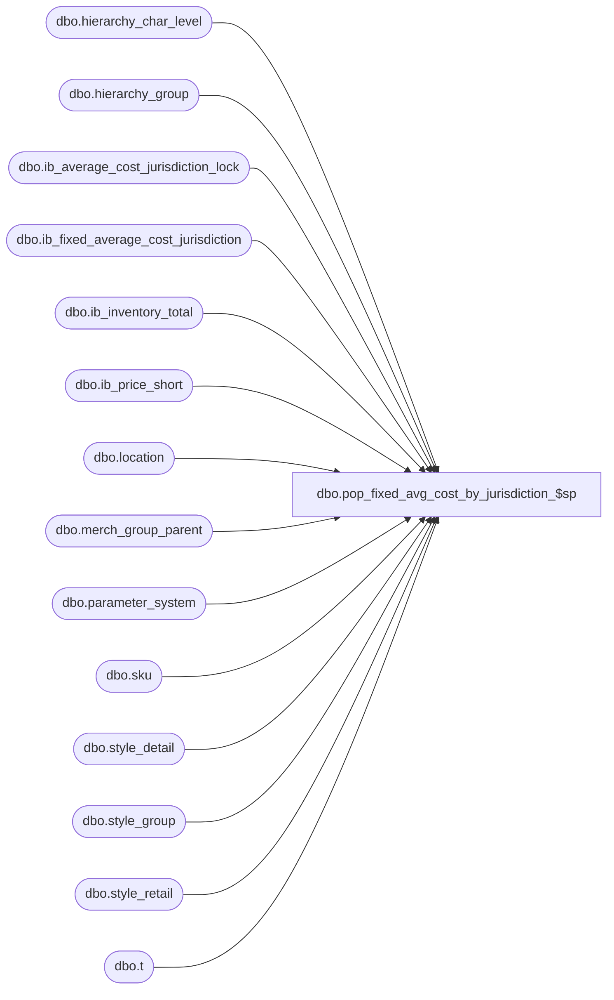

# dbo.pop_fixed_avg_cost_by_jurisdiction_$sp

**Database:** me_01  
**Server:** bedrockdb02  

## Architecture Diagram



## Table Dependencies

| Referenced Table |
|---|
| dbo.hierarchy_char_level |
| dbo.hierarchy_group |
| dbo.ib_average_cost_jurisdiction_lock |
| dbo.ib_fixed_average_cost_jurisdiction |
| dbo.ib_inventory_total |
| dbo.ib_price_short |
| dbo.location |
| dbo.merch_group_parent |
| dbo.parameter_system |
| dbo.sku |
| dbo.style_detail |
| dbo.style_group |
| dbo.style_retail |
| dbo.t |

## Stored Procedure Code

```sql
CREATE PROCEDURE [dbo].[pop_fixed_avg_cost_by_jurisdiction_$sp]
	(@identifier NVARCHAR(5),
	@status INT OUTPUT)
AS

/*
	Version		: 1.00
	Created		: 2012/03/06
	Created by	: Pierrette Lemay
	Description	: This procedure is called when parameter_system.ib_average_cost_type is set to 'F'.
				This procedure populates table ib_fixed_average_cost_jurisdiction for the occurrence of REGULAR style/jurisdiction/date included in a
				temporary table loaded by the calling procedure. This temporary table should be called #temp_fixed_average_cost.
				There should be only one instance of this procedure running at the same time in order to avoid deadlocks and
				insert duplicate entries in ib_fixed_average_cost_jurisdiction.
				This procedure supports 2 methods for calculation of average cost: chain and jurisdiction.
				Make sure when calling this procedure the amount of distinct combination of style/jurisdiction/date is relatively low,
				worst case scenario < 5000, best case scenario: around 1000.
				The caller of this procedure should provide an identifier that could either be 'BI' or 'MERCH' and a lock will be acquired
				by the procedure and will return a status to the caller.
				This procedure receive as an IN parameter an identifier of the application calling this stored procedure;
				the second parameter is an output parameter that specifies one of the possible status:
				0  : Initial state i.e unable to get the current value of the user currently locking table ib_fixed_avg_cost_by_jurisdiction
				100: The procedure is currently locked by another user.
				110: The procedure returned before completion.
				120: The procedure completed successfully.
	History: 1.0
	3/31/2014 Ivan D.  	Bug 52404 - sales posting - ib_inventory is not updated with the right cost when it should be using goal IMU%
	10/14/2015 Ivan D.	144440 - Sales posting not calculating average cost correctly when on hand cost is 0, units > 0

	Call from Stored Procedures:
		-- prep_fixed_avg_cost_calculation_$sp

	-- NOTE: The temp table #temp_fixed_average_cost exists and is poulated by the calling procedure
	CREATE TABLE #temp_fixed_average_cost
		( style_id DECIMAL(12,0) NOT NULL
		, jurisdiction_id SMALLINT NOT NULL
		, transaction_date SMALLDATETIME NOT NULL
		, cost_rate float NULL
		, avg_tot_val_retail_sold DECIMAL(16,4) NULL
		, avg_tot_selling_retail_sold DECIMAL(16,4) NULL);
*/

BEGIN
	DECLARE @sql_err_num DECIMAL(38,0), @error_msg NVARCHAR(4000), @c_avg_cost_by_chain TINYINT,
		@c_avg_cost_by_jurisdiction TINYINT, @avg_cost_param TINYINT, @multi_sales_jurisdiction_flag BIT, @cleanup_days SMALLINT,
		@floor_date SMALLDATETIME, @currently_locked_by NVARCHAR(3);

	SELECT @status = 0
		, @multi_sales_jurisdiction_flag = multi_sales_jurisdiction_flag
		, @c_avg_cost_by_chain = 2
		, @c_avg_cost_by_jurisdiction = 3
		, @avg_cost_param = ib_average_cost_location_level
		, @cleanup_days = ib_average_cost_cleanup_days
	FROM parameter_system;

	IF NOT object_id(N'tempdb..#temp_ib_average_cost') IS NULL
		DROP TABLE #temp_ib_average_cost;

	CREATE TABLE #temp_ib_average_cost
		( style_id DECIMAL(12,0) NOT NULL
		, jurisdiction_id SMALLINT NOT NULL
		, transaction_date SMALLDATETIME NOT NULL
		, average_cost DECIMAL(18,6) NULL
		, average_cost_local DECIMAL(18,6) NULL);

	IF NOT object_id(N'tempdb..#new_style_cost_using_IMU') IS NULL
		DROP TABLE #new_style_cost_using_IMU;

	CREATE TABLE #new_style_cost_using_IMU
		( style_id DECIMAL(12,0) NOT NULL
		, jurisdiction_id SMALLINT NOT NULL
		, transaction_date SMALLDATETIME NOT NULL
		, goal_imu_level_id INT NULL
		, hierarchy_level_id INT NULL
		, hierarchy_group_id INT NULL
		, goal_imu_percent DECIMAL(5,2) NULL
		, average_cost DECIMAL(18,6) NULL
		, average_cost_local DECIMAL(18,6) NULL);

	IF NOT object_id(N'tempdb..#temp_effective_retail_jurisdiction') IS NULL
		DROP TABLE #temp_effective_retail_jurisdiction;

	CREATE TABLE #temp_effective_retail_jurisdiction
		( style_id DECIMAL(12,0) NOT NULL
		, jurisdiction_id SMALLINT NOT NULL
		, transaction_date SMALLDATETIME NOT NULL
		, valuation_retail_price DECIMAL(14,2) NOT NULL
		, selling_retail_price DECIMAL(14,2) NOT NULL);

	IF NOT object_id(N'tempdb..#temp_effective_retail_chain') IS NULL
		DROP TABLE #temp_effective_retail_chain;

	CREATE TABLE #temp_effective_retail_chain
		( style_id DECIMAL(12,0) NOT NULL
		, transaction_date SMALLDATETIME NOT NULL
		, valuation_retail_price DECIMAL(14,2) NOT NULL
		, selling_retail_price DECIMAL(14,2) NOT NULL);

	IF NOT object_id(N'tempdb..#temp_issued_retail_jurisdiction') IS NULL
		DROP TABLE #temp_issued_retail_jurisdiction;

	CREATE TABLE #temp_issued_retail_jurisdiction
		( style_id DECIMAL(12,0) NOT NULL
		, jurisdiction_id SMALLINT NOT NULL
		, transaction_date SMALLDATETIME NOT NULL
		, valuation_retail_price DECIMAL(14,2) NOT NULL
		, selling_retail_price DECIMAL(14,2) NOT NULL);

	IF NOT object_id(N'tempdb..#temp_issued_retail_chain') IS NULL
		DROP TABLE #temp_issued_retail_chain;

	CREATE TABLE #temp_issued_retail_chain
		( style_id DECIMAL(12,0) NOT NULL
		, transaction_date SMALLDATETIME NOT NULL
		, valuation_retail_price DECIMAL(14,2) NOT NULL
		, selling_retail_price DECIMAL(14,2) NOT NULL);

	IF NOT object_id(N'tempdb..#temp_style_retail_jurisdiction') IS NULL
		DROP TABLE #temp_style_retail_jurisdiction;

	CREATE TABLE #temp_style_retail_jurisdiction
		( style_id DECIMAL(12,0) NOT NULL
		, jurisdiction_id SMALLINT NOT NULL
		, transaction_date SMALLDATETIME NOT NULL
		, valuation_retail_price DECIMAL(14,2) NOT NULL
		, selling_retail_price DECIMAL(14,2) NOT NULL);

	IF NOT object_id(N'tempdb..#temp_style_retail_chain') IS NULL
		DROP TABLE #temp_style_retail_chain;

	CREATE TABLE #temp_style_retail_chain
		( style_id DECIMAL(12,0) NOT NULL
		, transaction_date SMALLDATETIME NOT NULL
		, valuation_retail_price DECIMAL(14,2) NOT NULL
		, selling_retail_price DECIMAL(14,2) NOT NULL);

	BEGIN TRY
		-- Check if this process locked: to be done later
		SELECT @currently_locked_by = locking_application FROM ib_average_cost_jurisdiction_lock;

		IF (@currently_locked_by IS NULL)
		BEGIN
			UPDATE ib_average_cost_jurisdiction_lock WITH (HOLDLOCK) SET locking_application = @identifier;
			SET @status = 110;
		END
		ELSE
		BEGIN
			SET @status = 100;
			RETURN;
		END

		-- Need to insert a row into ib_average_cost for each row contained in the #temp_ib_average_cost
		-- This procedure should process rapidly as it doesn't support being called from multiple threads/processe.
		-- First validation: if one row from the temporary table exists in ib_fixed_average_cost then remove it from the temp table.
		DELETE t
		FROM #temp_fixed_average_cost t
		WHERE EXISTS (SELECT 1 FROM dbo.ib_fixed_average_cost_jurisdiction i
				  WHERE i.style_id = t.style_id
				  AND i.jurisdiction_id = t.jurisdiction_id
				  AND i.transaction_date = t.transaction_date);

		-- Populate #temp_ib_average_cost with cost and cost_local
		IF (@multi_sales_jurisdiction_flag = 1)
		BEGIN
			IF ( @avg_cost_param = @c_avg_cost_by_chain)
				-- populate first #temp_ib_average_cost for all jurisdictions in the chain
				INSERT INTO #temp_ib_average_cost
					( style_id
					, jurisdiction_id
					, transaction_date
					, average_cost
					, average_cost_local)
				SELECT t.style_id
					 , t.jurisdiction_id
					 , t.transaction_date
					 , CASE WHEN ( ISNULL(SUM(ib_inventory_total.total_on_hand_units), 0) > 0
	  							  AND
								  ISNULL(SUM(ib_inventory_total.total_on_hand_cost), 0) >= 0 )
							THEN ISNULL(SUM(ib_inventory_total.total_on_hand_cost), 0) /
								 ISNULL(SUM(ib_inventory_total.total_on_hand_units), 0)
	        				ELSE
								style_detail.last_net_final_po_cost
							END average_cost
					, CASE	WHEN ( ISNULL(SUM(ib_inventory_total.total_on_hand_units), 0) > 0
	  							  AND
								  ISNULL(SUM(ib_inventory_total.total_on_hand_cost), 0) >= 0 )
							THEN ( ISNULL(SUM(ib_inventory_total.total_on_hand_cost), 0) /
								   ISNULL(SUM(ib_inventory_total.total_on_hand_units), 0) )
								   /
								   t.cost_rate
	        			   ELSE
								style_detail.last_net_final_po_cost/t.cost_rate
						END average_cost_local
				FROM #temp_fixed_average_cost t
				JOIN style_detail ON ( t.style_id = style_detail.style_id )
				JOIN sku ON (sku.style_id = t.style_id)
				LEFT OUTER JOIN ib_inventory_total ON ( ib_inventory_total.sku_id = sku.sku_id)
				GROUP BY t.style_id, t.jurisdiction_id, t.transaction_date, t.cost_rate, style_detail.last_net_final_po_cost;

			ELSE IF ( @avg_cost_param = @c_avg_cost_by_jurisdiction)
				-- populate first #temp_ib_average_cost for the jurisdiction requested
				INSERT INTO #temp_ib_average_cost
					( style_id
					, jurisdiction_id
					, transaction_date
					, average_cost
					, average_cost_local)
				SELECT t.style_id
					 , t.jurisdiction_id
					 , t.transaction_date
					 , CASE	WHEN ( ISNULL(SUM(ib_inventory_total.total_on_hand_units), 0) > 0
								  AND
								  ISNULL(SUM(ib_inventory_total.total_on_hand_cost), 0) >= 0 )
							THEN (SUM(ib_inventory_total.total_on_hand_cost) / SUM(ib_inventory_total.total_on_hand_units))
							ELSE style_detail.last_net_final_po_cost
							END average_cost
					, CASE	WHEN ( ISNULL(SUM(ib_inventory_total.total_on_hand_units), 0) > 0
  								  AND
								  ISNULL(SUM(ib_inventory_total.total_on_hand_cost_local), 0) >= 0 )
							THEN (SUM(ib_inventory_total.total_on_hand_cost_local) / SUM(ib_inventory_total.total_on_hand_units))
        					ELSE style_detail.last_net_final_po_cost/t.cost_rate -- convert the value from home to local currency
							END average_cost_local
				FROM #temp_fixed_average_cost t
				JOIN style_detail WITH (NOLOCK) ON ( t.style_id = style_detail.style_id )
				JOIN sku WITH (NOLOCK) ON (sku.style_id = t.style_id)
				JOIN location l WITH (NOLOCK) ON (t.jurisdiction_id = l.jurisdiction_id)
				LEFT OUTER JOIN ib_inventory_total WITH (NOLOCK) ON ( ib_inventory_total.sku_id = sku.sku_id
												   AND ib_inventory_total.location_id = l.location_id )
				GROUP BY t.style_id, t.jurisdiction_id, t.transaction_date, t.cost_rate, style_detail.last_net_final_po_cost;
			ELSE
				RAISERROR (N'Error: Invalid system parameter value for average cost level. ', -- Message text.
					16, -- Severity.
					1); -- State.
		END
		ELSE
		BEGIN
			 -- @multi_sales_jurisdiction_flag is OFF: average_cost and average_cost_local are the same
			INSERT INTO #temp_ib_average_cost
				(  style_id
				, jurisdiction_id
				, transaction_date
				, average_cost
				, average_cost_local)
			SELECT t.style_id
				 , t.jurisdiction_id
				 , t.transaction_date
				 , CASE WHEN ( ISNULL(SUM(ib_inventory_total.total_on_hand_units), 0) > 0
							  AND
							  ISNULL(SUM(ib_inventory_total.total_on_hand_cost), 0) >= 0 )
						THEN (SUM(ib_inventory_total.total_on_hand_cost) / SUM(ib_inventory_total.total_on_hand_units))
    					ELSE style_detail.last_net_final_po_cost
				  END average_cost
				, CASE	WHEN ( ISNULL(SUM(ib_inventory_total.total_on_hand_units), 0) > 0
							  AND
							  ISNULL(SUM(ib_inventory_total.total_on_hand_cost), 0) >= 0 )
						THEN (SUM(ib_inventory_total.total_on_hand_cost) / SUM(ib_inventory_total.total_on_hand_units))
    					ELSE style_detail.last_net_final_po_cost
				  END average_cost_local
			FROM #temp_fixed_average_cost t
			JOIN style_detail WITH (NOLOCK) ON ( t.style_id = style_detail.style_id )
			JOIN sku WITH (NOLOCK) ON (sku.style_id = t.style_id)
			LEFT OUTER JOIN ib_inventory_total WITH (NOLOCK) ON ( ib_inventory_total.sku_id = sku.sku_id)
			GROUP BY t.style_id, t.jurisdiction_id, t.transaction_date, t.cost_rate, style_detail.last_net_final_po_cost;
		END

		-- *** At this point if all the styles don't have a cost because ***
		-- there was no transaction in IB yet and style doesn't have a last_net_final_cost
		-- then style's goal IMU% from its merchandise group is used
		IF EXISTS (SELECT 1 FROM #temp_fixed_average_cost a
				   WHERE EXISTS (SELECT 1 FROM #temp_ib_average_cost b
									WHERE a.style_id = b.style_id
								    AND a.jurisdiction_id = b.jurisdiction_id
								    AND a.transaction_date = b.transaction_date
								    AND (b.average_cost IS NULL OR b.average_cost_local IS NULL) ))
		BEGIN
			-- INSERT into a temp table these new style/location/date for which we don't have a cost at this point
			INSERT INTO #new_style_cost_using_IMU
				 (style_id, jurisdiction_id, transaction_date, goal_imu_level_id, hierarchy_level_id, hierarchy_group_id, goal_imu_percent)
			SELECT DISTINCT a.style_id, a.jurisdiction_id, a.transaction_date, hcl.goal_imu_level_id, hg.hierarchy_level_id, hg.hierarchy_group_id, hg.goal_imu_percent
			FROM #temp_fixed_average_cost a, style_group sg, hierarchy_group hg, hierarchy_char_level hcl
			WHERE a.style_id = sg.style_id
			AND sg.hierarchy_group_id = hg.hierarchy_group_id
			AND hcl.hierarchy_id = hg.hierarchy_id
			AND EXISTS (SELECT 1 FROM #temp_ib_average_cost b
									WHERE a.style_id = b.style_id
								    AND a.jurisdiction_id = b.jurisdiction_id
								    AND a.transaction_date = b.transaction_date
								    AND (b.average_cost IS NULL OR b.average_cost_local IS NULL));
			UPDATE t
			SET t.goal_imu_percent = hg.goal_imu_percent
			FROM #new_style_cost_using_IMU t, merch_group_parent par, hierarchy_group hg
			WHERE t.goal_imu_percent IS NULL
			AND par.hierarchy_level_id = t.goal_imu_level_id
			AND par.hierarchy_group_id = t.hierarchy_group_id
			AND par.parent_hierarchy_group_id = hg.hierarchy_group_id;

			-- REGULAR styles calculation:
			-- Average cost in home currency = (1-(Goal IMU% / 100)) * Valuation Retail (effective or original valuation retail)
			-- Average cost in location currency = (1-(Goal IMU% / 100)) * Selling Retail (effective or original selling retail)
			-- We need to calculate first the current retail for the styles that have the average cost not set at this point
			-- We have to ignore the color exceptions and some other exeptions depending the way the average cost parameter is configure in parameter_system

			IF ( @avg_cost_param = @c_avg_cost_by_chain)
			BEGIN
				-- Calculation of retail for the style/date by chain
				INSERT INTO #temp_effective_retail_chain
					(style_id, transaction_date, valuation_retail_price, selling_retail_price)
				SELECT U.style_id, U.transaction_date, s.valuation_retail_price, s.selling_retail_price
				FROM ib_price_short s WITH (NOLOCK),
					( SELECT T.style_id, T.transaction_date, MAX(ib.ib_price_id) ib_price_id
					FROM ib_price_short ib WITH (NOLOCK),
					  ( SELECT t.style_id, t.transaction_date, MAX(i.effective_date) effective_date
						FROM ib_price_short i WITH (NOLOCK), #new_style_cost_using_IMU t
						WHERE i.style_id = t.style_id
							-- effective date must be set and less than or equal than transaction date
						AND i.effective_date IS NOT NULL
						AND i.effective_date <= t.transaction_date
						-- only want permanent prices, nothing on promo
						AND i.temp_price_flag = 0
						-- we don't want exception
						AND i.color_id IS NULL
						AND i.location_id IS NULL
						AND i.pricing_group_id IS NULL
						GROUP BY t.style_id, t.transaction_date ) T
					WHERE ib.temp_price_flag = 0
					AND ib.effective_date = T.effective_date
					AND ib.style_id = T.style_id
					GROUP BY T.style_id, T.transaction_date ) U
				WHERE s.ib_price_id = U.ib_price_id;

				-- Calculation of Issue retail
				INSERT INTO #temp_issued_retail_chain
					(style_id, transaction_date, valuation_retail_price, selling_retail_price)
				SELECT U.style_id, U.transaction_date, i.valuation_retail_price, i.selling_retail_price
				FROM ib_price_short i WITH (NOLOCK),
					( SELECT T.style_id
						, T.transaction_date
						, MAX(ib_price_short.ib_price_id) ib_price_id
					  FROM ib_price_short WITH(NOLOCK),
						 ( SELECT DISTINCT t.style_id
								, t.transaction_date
								, MAX(i.start_date) start_date
							FROM ib_price_short i WITH (NOLOCK), #new_style_cost_using_IMU t
							WHERE -- start date must be set and less than or equal to @curr_transaction_date
								i.start_date <= t.transaction_date
							AND i.start_date IS NOT NULL
							-- join ib_price_short and #temp_ib_price_master on jurisdiction_id and style_id
							AND i.style_id = t.style_id
							-- only want permanent prices, nothing on promo
							AND i.temp_price_flag = 0
							-- we don't want exception
							AND i.color_id IS NULL
							AND i.location_id IS NULL
							AND i.pricing_group_id IS NULL
							GROUP BY t.style_id, t.transaction_date )	T
					WHERE ib_price_short.temp_price_flag = 0
					AND ib_price_short.start_date = T.start_date
					AND ib_price_short.style_id = T.style_id
					GROUP BY T.style_id, T.transaction_date ) U
				WHERE i.ib_price_id = U.ib_price_id;

				-- we might not have any entries in ib_price, take the prices from style_retail
				INSERT INTO #temp_style_retail_chain
					(style_id, transaction_date, valuation_retail_price, selling_retail_price)
				SELECT t.style_id, t.transaction_date, i.original_valuation_retail, i.original_selling_retail
				FROM style_retail i WITH(NOLOCK),
					 #new_style_cost_using_IMU t
							WHERE  i.style_id = t.style_id
							AND i.jurisdiction_id = t.jurisdiction_id


				-- Now INSERT INTO #temp_ib_average_cost.average_cost using IMU%
				UPDATE t
				SET average_cost = (1-(n.goal_imu_percent / 100)) * COALESCE(e.valuation_retail_price, i.valuation_retail_price, stc.valuation_retail_price)
				FROM #temp_ib_average_cost t
				JOIN #new_style_cost_using_IMU n
					ON t.style_id = n.style_id
					AND t.transaction_date = n.transaction_date
				LEFT OUTER JOIN #temp_style_retail_chain stc
					ON n.style_id = stc.style_id
					AND n.transaction_date = stc.transaction_date
				LEFT OUTER JOIN #temp_issued_retail_chain i
					ON  n.style_id = i.style_id
					AND n.transaction_date = i.transaction_date
				LEFT OUTER JOIN #temp_effective_retail_chain e
					ON  n.style_id = e.style_id
					AND n.transaction_date = e.transaction_date
					AND i.style_id = e.style_id
					AND i.transaction_date = e.transaction_date
				WHERE t.average_cost IS NULL;

				UPDATE t
				SET average_cost_local = average_cost / i.cost_rate
				FROM #temp_ib_average_cost t, #temp_fixed_average_cost i
				WHERE t.average_cost_local IS NULL
				AND t.style_id = i.style_id
				AND t.jurisdiction_id = i.jurisdiction_id
				AND t.transaction_date = i.transaction_date;
			END
			ELSE
			BEGIN
				-- Calculation of retail for the style/jurisdiction/date
				INSERT INTO #temp_effective_retail_jurisdiction
					(style_id, jurisdiction_id, transaction_date, valuation_retail_price, selling_retail_price)
				SELECT U.style_id, U.jurisdiction_id, U.transaction_date, s.valuation_retail_price, s.selling_retail_price
				FROM ib_price_short s WITH (NOLOCK),
					( SELECT T.style_id, T.jurisdiction_id, T.transaction_date, MAX(ib.ib_price_id) ib_price_id
					FROM ib_price_short ib WITH (NOLOCK),
					  ( SELECT t.style_id, t.jurisdiction_id, t.transaction_date, MAX(i.effective_date) effective_date
						FROM ib_price_short i WITH (NOLOCK), #new_style_cost_using_IMU t
						WHERE i.style_id = t.style_id
						AND i.jurisdiction_id = t.jurisdiction_id
							-- effective date must be set and less than or equal than transaction date
						AND i.effective_date IS NOT NULL
						AND i.effective_date <= t.transaction_date
						-- only want permanent prices, nothing on promo
						AND i.temp_price_flag = 0
						-- we don't want exception
						AND i.color_id IS NULL
						AND i.location_id IS NULL
						AND i.pricing_group_id IS NULL
						GROUP BY t.style_id, t.jurisdiction_id, t.transaction_date ) T
					WHERE ib.temp_price_flag = 0
					AND ib.effective_date = T.effective_date
					AND ib.jurisdiction_id = T.jurisdiction_id
					AND ib.style_id = T.style_id
					GROUP BY T.style_id, T.jurisdiction_id, T.transaction_date ) U
				WHERE s.ib_price_id = U.ib_price_id;

				-- Calculation of Issue retail
				INSERT INTO #temp_issued_retail_jurisdiction
					(style_id, jurisdiction_id, transaction_date, valuation_retail_price, selling_retail_price)
				SELECT U.style_id, U.jurisdiction_id, U.transaction_date, i.valuation_retail_price, i.selling_retail_price
				FROM ib_price_short i WITH (NOLOCK),
					( SELECT T.style_id
						, T.jurisdiction_id
						, T.transaction_date
						, MAX(ib_price_short.ib_price_id) ib_price_id
					  FROM ib_price_short WITH(NOLOCK),
						 ( SELECT DISTINCT t.style_id
								, t.jurisdiction_id
								, t.transaction_date
								, MAX(i.start_date) start_date
							FROM ib_price_short i WITH (NOLOCK), #new_style_cost_using_IMU t
							WHERE -- start date must be set and less than or equal to @curr_transaction_date
								i.start_date <= t.transaction_date
							AND i.start_date IS NOT NULL
							-- join ib_price_short and #temp_ib_price_master on jurisdiction_id and style_id
							AND i.jurisdiction_id = t.jurisdiction_id
							AND i.style_id = t.style_id
							-- only want permanent prices, nothing on promo
							AND i.temp_price_flag = 0
							-- we don't want exception
							AND i.color_id IS NULL
							AND i.location_id IS NULL
							AND i.pricing_group_id IS NULL
							GROUP BY t.style_id, t.jurisdiction_id, t.transaction_date )	T
					WHERE ib_price_short.temp_price_flag = 0
					AND ib_price_short.start_date = T.start_date
					AND ib_price_short.jurisdiction_id = T.jurisdiction_id
					AND ib_price_short.style_id = T.style_id
					GROUP BY T.style_id, T.jurisdiction_id, T.transaction_date ) U
				WHERE i.ib_price_id = U.ib_price_id;

				-- we might not have any entries in ib_price, take the prices from style_retail
				INSERT INTO #temp_style_retail_jurisdiction
					(style_id, transaction_date, jurisdiction_id, valuation_retail_price, selling_retail_price)
				SELECT t.style_id, t.transaction_date, t.jurisdiction_id, i.original_valuation_retail, i.original_selling_retail
				FROM style_retail i WITH(NOLOCK),
					 #new_style_cost_using_IMU t
							WHERE i.jurisdiction_id = t.jurisdiction_id
							AND i.style_id = t.style_id


				-- Now INSERT INTO #temp_ib_average_cost.average_cost using IMU%
				UPDATE t
				SET average_cost = (1-(n.goal_imu_percent / 100)) * COALESCE(e.valuation_retail_price, i.valuation_retail_price, srj.valuation_retail_price),
					average_cost_local = (1-(n.goal_imu_percent / 100)) * COALESCE(e.selling_retail_price, i.selling_retail_price, srj.selling_retail_price)
				FROM #temp_ib_average_cost t
				JOIN #new_style_cost_using_IMU n
					ON t.style_id = n.style_id
					AND t.jurisdiction_id  = n.jurisdiction_id
					AND t.transaction_date = n.transaction_date
				LEFT OUTER JOIN #temp_style_retail_jurisdiction srj
					ON n.style_id = srj.style_id
					AND n.jurisdiction_id  = srj.jurisdiction_id
					AND n.transaction_date = srj.transaction_date
				LEFT OUTER JOIN #temp_issued_retail_jurisdiction i
					ON  n.style_id = i.style_id
					AND n.jurisdiction_id  = i.jurisdiction_id
					AND n.transaction_date = i.transaction_date
				LEFT OUTER JOIN #temp_effective_retail_jurisdiction e
					ON  n.style_id = e.style_id
					AND n.jurisdiction_id  = e.jurisdiction_id
					AND n.transaction_date = e.transaction_date
					AND i.style_id		 = e.style_id
					AND i.jurisdiction_id	 = e.jurisdiction_id
					AND i.transaction_date = e.transaction_date
				WHERE (n.average_cost IS NULL OR n.average_cost_local IS NULL);
			END
		END

		-- Insert into the target table
		INSERT INTO ib_fixed_average_cost_jurisdiction
			( style_id
			, jurisdiction_id
			, transaction_date
			, average_cost
			, average_cost_local)
		SELECT style_id
			, jurisdiction_id
			, transaction_date
			, average_cost
			, average_cost_local
		FROM #temp_ib_average_cost t
		WHERE NOT EXISTS (SELECT 1 FROM ib_fixed_average_cost_jurisdiction i WITH(NOLOCK)
						   WHERE i.style_id = t.style_id
						   AND i.jurisdiction_id = t.jurisdiction_id
						   AND i.transaction_date = t.transaction_date);

		-- Cleanup ib_fixed average_cost according the value of parameter_system.ib_average_cost_cleanup_days
		-- Find the floor date that correspong totay's date - @cleanup_days
		SELECT @floor_date = DATEADD(day, - @cleanup_days, CONVERT(DATE, GETDATE(), 101))

		BEGIN TRAN

		DELETE ib_fixed_average_cost_jurisdiction
		WHERE transaction_date < @floor_date;

		COMMIT TRAN

		UPDATE ib_average_cost_jurisdiction_lock SET locking_application = NULL WHERE locking_application = @identifier;
		SET @status = 120;
	END TRY
	BEGIN CATCH

	IF @@TRANCOUNT > 0
		ROLLBACK TRAN;

	UPDATE ib_average_cost_jurisdiction_lock SET locking_application = NULL;

	SET @status = 110;

	SET @error_msg = N'Error in procedure pop_fixed_avg_cost_by_jurisdiction_$sp: ' + CAST(ERROR_NUMBER() AS NVARCHAR) + N' ' + ERROR_MESSAGE();
	RAISERROR (@error_msg, 16, 1);

	END CATCH
END
```

