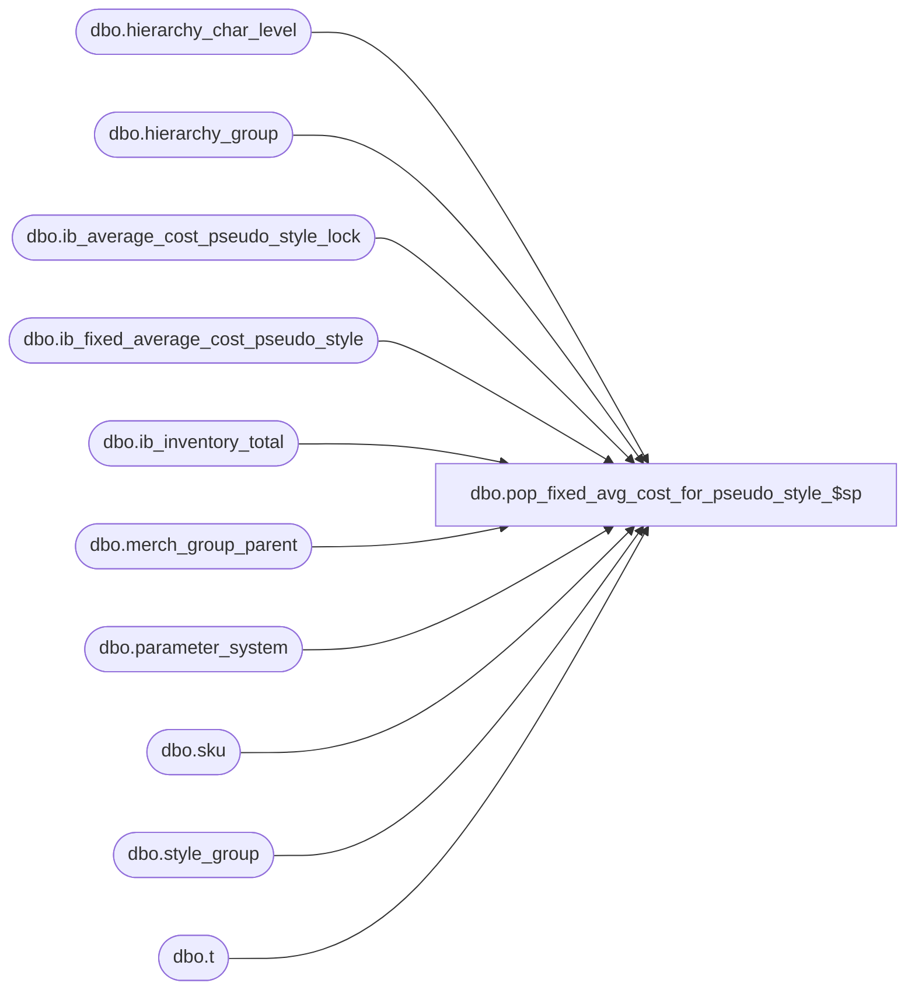

# dbo.pop_fixed_avg_cost_for_pseudo_style_$sp

**Database:** me_01  
**Server:** bedrockdb02  

## Architecture Diagram



## Table Dependencies

| Referenced Table |
|---|
| dbo.hierarchy_char_level |
| dbo.hierarchy_group |
| dbo.ib_average_cost_pseudo_style_lock |
| dbo.ib_fixed_average_cost_pseudo_style |
| dbo.ib_inventory_total |
| dbo.merch_group_parent |
| dbo.parameter_system |
| dbo.sku |
| dbo.style_group |
| dbo.t |

## Stored Procedure Code

```sql
CREATE PROCEDURE [dbo].[pop_fixed_avg_cost_for_pseudo_style_$sp]
	(@identifier NVARCHAR(5),
	@status INT OUTPUT)
AS

/*
	Version		: 1.00
	Created		: 2012/03/06
	Created by	: Pierrette Lemay
	Description	: This procedure is called when parameter_system.ib_average_cost_type is set to 'F'. 
				This procedure populates table ib_fixed_average_cost_pseudo_style for the occurrence of PSEUDO style/location/date included in a
				temporary table created and populated by the caller procedure.
				This procedure receive as an IN parameter an identifier of the application calling this stored procedure; 
				the second parameter is an output parameter that specifies one of the possible status:
				0  : Initial state i.e unable to get the current value of the user currently locking table ib_fixed_avg_cost_by_jurisdiction
				100: The procedure is currently locked by another user.
				110: The procedure returned before completion.
				120: The procedure completed successfully.
	History: 1.0
     		10/5/2013 - Ivan D. 52264 - Posting sale for Pseudostyle raising an error  in manager.log when posting sales in in the past
	
	Call from Stored Procedures:
		-- prep_fixed_avg_cost_calculation_$sp
		-- populate_temp_sale_master_$sp
		
	-- NOTE: The temp table #temp_fixed_average_cost exists and is poulated by the calling procedure
	CREATE TABLE #temp_avg_cost_pseudo_style
		( style_id DECIMAL(12,0) NOT NULL
		, location_id SMALLINT NOT NULL
		, transaction_date SMALLDATETIME NOT NULL
		, avg_tot_val_retail_sold DECIMAL(16,4) NULL
		, avg_tot_selling_retail_sold DECIMAL(16,4) NULL);
*/
BEGIN
	
	DECLARE @error_msg NVARCHAR(4000), @cleanup_days SMALLINT, @floor_date SMALLDATETIME, @currently_locked_by NVARCHAR(5), @avg_cost_level TINYINT;

	SELECT @status = 0,  
		@cleanup_days = ib_average_cost_cleanup_days,
		@avg_cost_level = ib_average_cost_location_level
	FROM parameter_system;
	
	IF NOT object_id(N'tempdb..#temp_ib_average_cost_pseudo_style') IS NULL
		DROP TABLE #temp_ib_average_cost_pseudo_style;
		
	CREATE TABLE #temp_ib_average_cost_pseudo_style
		( style_id DECIMAL(12,0) NOT NULL
		, location_id SMALLINT NOT NULL
		, transaction_date SMALLDATETIME NOT NULL
		, average_cost DECIMAL(18,6) NULL
		, average_cost_local DECIMAL(18,6) NULL);
	
	IF NOT object_id(N'tempdb..#new_pseudo_style_cost_using_IMU') IS NULL
		DROP TABLE #new_pseudo_style_cost_using_IMU;
		
	CREATE TABLE #new_pseudo_style_cost_using_IMU 
		( style_id DECIMAL(12,0) NOT NULL
		, location_id SMALLINT NOT NULL
		, transaction_date SMALLDATETIME NOT NULL
		, goal_imu_level_id INT NULL
		, hierarchy_level_id INT NULL
		, hierarchy_group_id INT NULL
		, goal_imu_percent DECIMAL(5,2) NULL
		, average_cost DECIMAL(18,6) NULL
		, average_cost_local DECIMAL(18,6) NULL);
	
	BEGIN TRY
		-- Check if this process locked
		SELECT @currently_locked_by = locking_application FROM ib_average_cost_pseudo_style_lock WITH (NOLOCK); 	
		
		-- When average cost is calculated at the location level, the lock is acquired before the work by thread
		IF (@avg_cost_level = 1) 
		BEGIN
			IF (@currently_locked_by <> @identifier)
			BEGIN
				SET @status = 100;
				RETURN; 
			END
		END
		ELSE
		BEGIN
			IF (@currently_locked_by IS NULL)
			BEGIN
				UPDATE ib_average_cost_pseudo_style_lock WITH (HOLDLOCK) SET locking_application = @identifier;
				SET @status = 110;	
			END
			ELSE
			BEGIN
				SET @status = 100;
				RETURN; 
			END
		END

		INSERT INTO #temp_ib_average_cost_pseudo_style
			( style_id, location_id, transaction_date, average_cost, average_cost_local)	
		SELECT t.style_id, t.location_id, t.transaction_date,
			  CASE WHEN ( ISNULL(SUM(ib_inventory_total.total_on_hand_valuation_retail), 0) > 0
						  AND 
						  ISNULL(SUM(ib_inventory_total.total_on_hand_cost), 0) > 0 )
				   THEN t.avg_tot_val_retail_sold * ( SUM(ib_inventory_total.total_on_hand_cost) / 
													 SUM(ib_inventory_total.total_on_hand_valuation_retail))
			  END average_cost,
			  CASE  WHEN ( ISNULL(SUM(ib_inventory_total.total_on_hand_selling_retail), 0) > 0
						   AND 
						   ISNULL(SUM(ib_inventory_total.total_on_hand_cost_local), 0) > 0 )
				THEN t.avg_tot_selling_retail_sold * ( SUM(ib_inventory_total.total_on_hand_cost_local) / 
														 SUM(ib_inventory_total.total_on_hand_selling_retail))
			  END average_cost_local
		FROM #temp_avg_cost_pseudo_style t
		JOIN sku WITH (NOLOCK) ON (sku.style_id = t.style_id)
		LEFT OUTER JOIN ib_inventory_total WITH (NOLOCK) ON ( ib_inventory_total.sku_id = sku.sku_id
									   AND ib_inventory_total.location_id = t.location_id )
		GROUP BY t.style_id, t.location_id, t.transaction_date, t.avg_tot_val_retail_sold, t.avg_tot_selling_retail_sold;
		
		-- *** At this point if all the styles don't have a cost because ***
		-- there was no transaction in IB yet and style doesn't have a last_net_final_cost
		-- then style's goal IMU% from its merchandise group is used
		IF EXISTS (SELECT 1 FROM #temp_avg_cost_pseudo_style a
				   WHERE EXISTS (SELECT 1 FROM #temp_ib_average_cost_pseudo_style b
									WHERE a.style_id = b.style_id
								    AND a.location_id = b.location_id
								    AND a.transaction_date = b.transaction_date
								    AND (b.average_cost IS NULL OR b.average_cost_local IS NULL) ))
		BEGIN
	
			-- INSERT into a temp table these new style/location/date for which we don't have a cost at this point
			INSERT INTO #new_pseudo_style_cost_using_IMU 
				 (style_id, location_id, transaction_date, goal_imu_level_id, hierarchy_level_id, hierarchy_group_id, goal_imu_percent)
			SELECT DISTINCT a.style_id, a.location_id, a.transaction_date, hcl.goal_imu_level_id, hg.hierarchy_level_id, hg.hierarchy_group_id, hg.goal_imu_percent
			FROM #temp_avg_cost_pseudo_style a, style_group sg, hierarchy_group hg, hierarchy_char_level hcl
			WHERE a.style_id = sg.style_id 
			AND sg.hierarchy_group_id = hg.hierarchy_group_id
			AND hcl.hierarchy_id = hg.hierarchy_id
			AND EXISTS (SELECT 1 FROM #temp_ib_average_cost_pseudo_style b
									WHERE a.style_id = b.style_id
								    AND a.location_id = b.location_id
								    AND a.transaction_date = b.transaction_date
								    AND (b.average_cost IS NULL OR b.average_cost_local IS NULL));		   
			UPDATE t
			SET t.goal_imu_percent = hg.goal_imu_percent
			FROM #new_pseudo_style_cost_using_IMU t, merch_group_parent par, hierarchy_group hg 
			WHERE t.goal_imu_percent IS NULL 
			AND par.hierarchy_level_id = t.goal_imu_level_id
			AND par.hierarchy_group_id = t.hierarchy_group_id
			AND par.parent_hierarchy_group_id = hg.hierarchy_group_id;
			
			UPDATE t
			SET average_cost = (1 - (n.goal_imu_percent / 100)) * f.avg_tot_val_retail_sold,
				average_cost_local = (1 - (n.goal_imu_percent / 100)) * f.avg_tot_selling_retail_sold
			FROM #temp_ib_average_cost_pseudo_style t, #new_pseudo_style_cost_using_IMU n, #temp_avg_cost_pseudo_style f
			WHERE t.style_id = n.style_id
			AND t.location_id = n.location_id
			AND t.transaction_date = n.transaction_date	 
			AND n.style_id = f.style_id
			AND n.location_id = f.location_id
			AND n.transaction_date = f.transaction_date;
		END
		
		BEGIN TRAN
		
		INSERT INTO ib_fixed_average_cost_pseudo_style
			( style_id 
			, location_id
			, transaction_date
			, average_cost
			, average_cost_local)
		SELECT DISTINCT t.style_id 
			, t.location_id
			, t.transaction_date
			, t.average_cost
			, t.average_cost_local
		FROM #temp_ib_average_cost_pseudo_style t
		WHERE t.average_cost IS NOT NULL
		AND NOT EXISTS (SELECT 1 FROM ib_fixed_average_cost_pseudo_style i WITH(NOLOCK)
						   WHERE i.style_id = t.style_id
						   AND i.location_id = t.location_id
						   AND i.transaction_date = t.transaction_date);
		
		COMMIT TRAN			
		
		IF (@avg_cost_level <> 1) 
		BEGIN
			-- Before returning remove the lock this procedure is holding.
			UPDATE ib_average_cost_pseudo_style_lock SET locking_application = NULL WHERE locking_application = @identifier; 
		END
		
		SET @status = 120;
	END TRY
	BEGIN CATCH
		
		IF @@TRANCOUNT > 0
			ROLLBACK TRAN;
			
		IF (@avg_cost_level <> 1) 
			UPDATE ib_average_cost_pseudo_style_lock SET locking_application = NULL WHERE locking_application = @identifier; 
		
		SET @status = 110;
			
		SET @error_msg = N'Error in procedure pop_fixed_avg_cost_for_pseudo_style_$sp: ' + CAST(ERROR_NUMBER() AS NVARCHAR) + N' ' + ERROR_MESSAGE();
		RAISERROR (@error_msg, 16, 1);

	END CATCH
END
```

