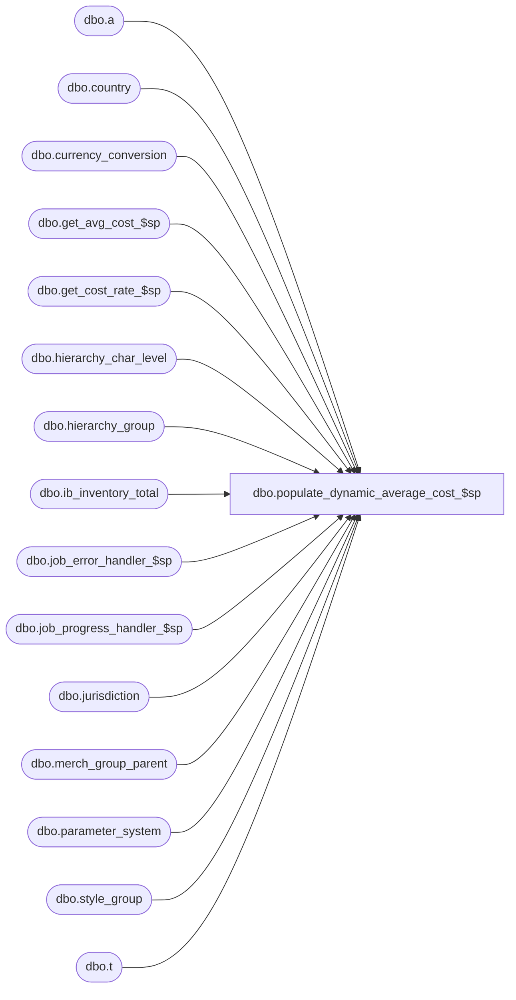

# dbo.populate_dynamic_average_cost_$sp

**Database:** me_01  
**Server:** bedrockdb02  

## Architecture Diagram



## Table Dependencies

| Referenced Table |
|---|
| dbo.a |
| dbo.country |
| dbo.currency_conversion |
| dbo.get_avg_cost_$sp |
| dbo.get_cost_rate_$sp |
| dbo.hierarchy_char_level |
| dbo.hierarchy_group |
| dbo.ib_inventory_total |
| dbo.job_error_handler_$sp |
| dbo.job_progress_handler_$sp |
| dbo.jurisdiction |
| dbo.merch_group_parent |
| dbo.parameter_system |
| dbo.style_group |
| dbo.t |

## Stored Procedure Code

```sql
CREATE PROCEDURE dbo.populate_dynamic_average_cost_$sp

	(
		 @job_id AS INT
		,@job_debug_flag AS BIT
	)

AS

/*
	Version		: 1.00
	Created		: 2012/03/06
	Created by	: Pierrette Lemay
	Description	: This procedure is part of the Sales Posting process and is only called when parameter_system.ib_average_cost_type is set to 'D'.
			It populates #temp_average_cost table which is created by the called procedure populate_temp_sale_master_$sp.
			It receives as an in parameter a job_id and a flag that determines if the procedure will logged step in job_debug table.	
	History: 
	9/30/2015   143201 - Sale-customer order transaction 605 does not pick the cost from the virtual transfer when calculating average cost
	
	Call from Stored Procedures:
		-- populate_temp_sale_master_$sp

		
	-- NOTE: 
	-- Table #temp_item_retail_price exists, it was created and populated in populate_temp_sale_master_$sp
	CREATE TABLE #temp_item_retail_price
		  ( style_id decimal(12,0) NOT NULL,
			style_type tinyint NOT NULL,
			location_id smallint NOT NULL,
			jurisdiction_id smallint NOT NULL,
			transaction_date smalldatetime NOT NULL,
			cost_rate float NULL,
			total_sold_at_price decimal(16,4) NOT NULL,
			total_units int NOT NULL);

	-- Table #temp_average_cost exists and was created in populate_temp_sale_master_$sp and will poulated by this procedure
	CREATE TABLE #temp_average_cost
		( style_id DECIMAL(12,0) NOT NULL
		, location_id SMALLINT NOT NULL
		, transaction_date SMALLDATETIME NOT NULL
		, average_cost DECIMAL(18,6) NULL
		, average_cost_local DECIMAL(18,6) NULL);
	
*/
BEGIN
	DECLARE @line_id SMALLINT, @job_type TINYINT, @proc_name NVARCHAR(30), @sql_err_num DECIMAL(38,0), 
			@table_name	 NVARCHAR(30), @operation_name NVARCHAR(30), @error_msg NVARCHAR(4000), @c_true BIT, @c_false BIT, 
			@c_avg_cost_by_location TINYINT, @c_avg_cost_by_chain TINYINT, @c_avg_cost_by_jurisdiction TINYINT, 
			@avg_cost_param TINYINT, @multi_sales_jurisdiction_flag BIT

	SELECT   @job_type		= 1
			, @proc_name	= N'populate_dynamic_average_cost_$sp'
			, @c_false		= 0
			, @c_true		= 1
			, @line_id		= 10
			, @c_avg_cost_by_location = 1
			, @c_avg_cost_by_chain = 2
			, @c_avg_cost_by_jurisdiction = 3
			, @avg_cost_param = ib_average_cost_location_level
			, @multi_sales_jurisdiction_flag = multi_sales_jurisdiction_flag
	FROM dbo.parameter_system
	
	BEGIN TRY

		IF OBJECT_ID (N'tempdb.dbo.#temp_wrk_cost_rate_lookup',  N'U') IS NOT NULL
		BEGIN

			DROP TABLE dbo.#temp_wrk_cost_rate_lookup

		END

		CREATE TABLE dbo.#temp_wrk_cost_rate_lookup

			(
				jurisdiction_id SMALLINT NULL
				,transaction_date SMALLDATETIME NULL
			)

		IF OBJECT_ID (N'tempdb.dbo.#temp_cost_rates',  N'U') IS NOT NULL
		BEGIN

			DROP TABLE dbo.#temp_cost_rates

		END

		CREATE TABLE dbo.#temp_cost_rates

			(
				 jurisdiction_id SMALLINT NULL
				,transaction_date SMALLDATETIME NULL
				,cost_rate FLOAT NULL
			)


		INSERT INTO dbo.#temp_wrk_cost_rate_lookup

			(
				jurisdiction_id
				,transaction_date
			)

		SELECT DISTINCT
				jurisdiction_id
				,GETDATE () AS transaction_date
		FROM
			dbo.#temp_item_retail_price


		EXEC dbo.get_cost_rate_$sp


		IF OBJECT_ID (N'tempdb.dbo.#temp_wrk_avg_cost_lookup',  N'U') IS NOT NULL
		BEGIN

			DROP TABLE dbo.#temp_wrk_avg_cost_lookup

		END

		CREATE TABLE dbo.#temp_wrk_avg_cost_lookup

			(
				 jurisdiction_id SMALLINT NULL
				,location_id SMALLINT NULL
				,style_id DECIMAL (12, 0) NULL
				,sku_id DECIMAL (13, 0) NULL
			)

		IF OBJECT_ID (N'tempdb.dbo.#temp_avg_costs',  N'U') IS NOT NULL
		BEGIN

			DROP TABLE dbo.#temp_avg_costs

		END

		CREATE TABLE dbo.#temp_avg_costs

			(
				 location_id SMALLINT NULL
				,sku_id DECIMAL (13, 0) NULL
				,avg_cost DECIMAL (14, 2) NULL
				,avg_cost_local DECIMAL (14, 2) NULL
				,sum_units int NULL
				,sum_cost DECIMAL (18, 6) NULL
				,sum_cost_local DECIMAL (18, 6) NULL
			)

		INSERT INTO dbo.#temp_wrk_avg_cost_lookup

			(
				 jurisdiction_id
				,location_id
				,style_id
				,sku_id
			)

		SELECT DISTINCT
				 jurisdiction_id
				,location_id
				,style_id
				,sku_id
		FROM
			dbo.#temp_item_retail_price

		EXECUTE dbo.get_avg_cost_$sp

		INSERT INTO dbo.#temp_average_cost

			( 
				 location_id
				,style_id
				,sku_id
				,transaction_date
				,average_cost
				,average_cost_local
				,sum_units
				,sum_cost
				,sum_cost_local
			)

		SELECT
			 ttIRP.location_id
			,ttIRP.style_id
			,ttIRP.sku_id
			,ttIRP.transaction_date
			,ttAC.avg_cost AS average_cost
			,ttAC.avg_cost_local AS average_cost_local
			,ttAC.sum_units
			,ttAC.sum_cost
			,ttAC.sum_cost_local
		FROM
			dbo.#temp_item_retail_price ttIRP
			INNER JOIN dbo.#temp_avg_costs ttAC ON ttAC.location_id = ttIRP.location_id
				AND ttAC.sku_id = ttIRP.sku_id
		WHERE
			ttIRP.style_type = 1 -- Regular


		-- The calculation of the average cost is different for pseudo styles, the formula is: 
		-- Average Total Valuation retail sold * (location's total OH Home cost / location's total OH valuation retail)

		IF EXISTS (SELECT * FROM #temp_item_retail_price WHERE style_type = 2)
		BEGIN
			-- populate #pseudo_style_cost for pseudo styles
			SET @line_id = 30

			INSERT INTO #pseudo_style_cost 
				(style_id, location_id, transaction_date, cost_rate, pseudo_price_status_id, 
				avg_total_val_retail_sold, avg_total_selling_retail_sold, sku_id)
			SELECT i.style_id, i.location_id, i.transaction_date, i.cost_rate, p.pseudo_price_status_id,	
					(i.total_sold_at_price/i.total_units) * cc.exchange_rate avg_total_val_retail_sold,
					(i.total_sold_at_price/i.total_units) avg_total_selling_retail_sold
					,i.sku_id
			FROM #temp_item_retail_price i, jurisdiction j, country co, currency_conversion cc, parameter_system p
			WHERE i.style_type = 2 -- Pseud+o
			AND i.jurisdiction_id = j.jurisdiction_id
			AND j.country_id = co.country_id 
			AND co.currency_id = cc.to_currency_id 
			AND cc.currency_conversion_type = 2 
			AND cc.effective_from_date <= i.transaction_date
			AND (cc.effective_to_date >= i.transaction_date
				OR cc.effective_to_date IS NULL)

			-- Log progress if job_params.debug_flag is true OR job_header.debug_flag is true
			EXEC job_progress_handler_$sp @job_type, @job_id, @proc_name, @line_id, @job_debug_flag;

			SET @line_id = 40
			IF (@multi_sales_jurisdiction_flag = 1)
				INSERT INTO #temp_average_cost
					( location_id
					, style_id
					, transaction_date
					, average_cost
					, average_cost_local
					,sku_id)	
				SELECT t.location_id, t.style_id, t.transaction_date
					, CASE WHEN ( ISNULL(SUM(ib_inventory_total.total_on_hand_valuation_retail), 0) > 0
							  AND 
							  ISNULL(SUM(ib_inventory_total.total_on_hand_cost), 0) > 0 )
						   THEN t.avg_total_val_retail_sold * ( SUM(ib_inventory_total.total_on_hand_cost) / 
															 SUM(ib_inventory_total.total_on_hand_valuation_retail))
					  END average_cost 
					, CASE  WHEN ( ISNULL(SUM(ib_inventory_total.total_on_hand_selling_retail), 0) > 0
							  AND 
							  ISNULL(SUM(ib_inventory_total.total_on_hand_cost_local), 0) > 0 )
						THEN t.avg_total_selling_retail_sold * ( SUM(ib_inventory_total.total_on_hand_cost_local) / 
																 SUM(ib_inventory_total.total_on_hand_selling_retail))
					  END average_cost_local
					  ,t.sku_id
				FROM #pseudo_style_cost t
				LEFT OUTER JOIN ib_inventory_total WITH (NOLOCK) ON ( ib_inventory_total.sku_id = t.sku_id
											   AND ib_inventory_total.location_id = t.location_id )
				GROUP BY t.location_id, t.style_id, t.transaction_date, t.avg_total_val_retail_sold, t.avg_total_selling_retail_sold,t.sku_id;
			ELSE
				INSERT INTO #temp_average_cost
					( location_id
					, style_id
					, transaction_date
					, average_cost
					, average_cost_local
					,sku_id)	
				SELECT t.location_id, t.style_id, t.transaction_date
					, CASE WHEN ( ISNULL(SUM(ib_inventory_total.total_on_hand_valuation_retail), 0) > 0
							  AND 
							  ISNULL(SUM(ib_inventory_total.total_on_hand_cost), 0) > 0 )
					   THEN t.avg_total_val_retail_sold * ( SUM(ib_inventory_total.total_on_hand_cost) / 
															SUM(ib_inventory_total.total_on_hand_valuation_retail))
					  END average_cost 
					, CASE  WHEN ( ISNULL(SUM(ib_inventory_total.total_on_hand_valuation_retail), 0) > 0
							  AND 
							  ISNULL(SUM(ib_inventory_total.total_on_hand_cost), 0) > 0 )
					   THEN t.avg_total_val_retail_sold * ( SUM(ib_inventory_total.total_on_hand_cost) / 
															SUM(ib_inventory_total.total_on_hand_valuation_retail))
					  END average_cost_local
					  ,t.sku_id
				FROM #pseudo_style_cost t
								LEFT OUTER JOIN ib_inventory_total WITH (NOLOCK) ON ( ib_inventory_total.sku_id = t.sku_id
											   AND ib_inventory_total.location_id = t.location_id )
				GROUP BY t.location_id, t.style_id, t.transaction_date, t.avg_total_val_retail_sold, t.avg_total_selling_retail_sold, t.sku_id;

			-- Log progress if job_params.debug_flag is true OR job_header.debug_flag is true
			EXEC job_progress_handler_$sp @job_type, @job_id, @proc_name, @line_id, @job_debug_flag;
		END

		-- It's possible that it's the first time a style sold and there is no data in ib_inventory total AND style_detail for regular styles
		IF EXISTS (SELECT 1 FROM #temp_average_cost WHERE average_cost IS NULL)
		BEGIN
			SET @line_id = 50;
			
			-- Retrieve the goal imu percent
			INSERT INTO #style_goal_imu 
				(style_id, goal_imu_level_id, goal_imu_percent, hierarchy_level_id, hierarchy_group_id)
			SELECT t.style_id, hcl.goal_imu_level_id, hg.goal_imu_percent, hg.hierarchy_level_id, hg.hierarchy_group_id 
			FROM #temp_average_cost t, style_group sg, hierarchy_group hg, hierarchy_char_level hcl
			WHERE t.average_cost IS NULL
			AND t.style_id = sg.style_id 
			AND sg.hierarchy_group_id = hg.hierarchy_group_id
			AND hcl.hierarchy_id = hg.hierarchy_id;

			-- Log progress if job_params.debug_flag is true OR job_header.debug_flag is true
			EXEC job_progress_handler_$sp @job_type, @job_id, @proc_name, @line_id, @job_debug_flag;

			SET @line_id = 60;
			UPDATE t
			SET t.goal_imu_percent = hg.goal_imu_percent
			FROM #style_goal_imu t, merch_group_parent par, hierarchy_group hg 
			WHERE t.goal_imu_percent IS NULL 
			AND par.hierarchy_level_id = t.goal_imu_level_id
			AND par.hierarchy_group_id = t.hierarchy_group_id
			AND par.parent_hierarchy_group_id = hg.hierarchy_group_id

			-- Log progress if job_params.debug_flag is true OR job_header.debug_flag is true
			EXEC job_progress_handler_$sp @job_type, @job_id, @proc_name, @line_id, @job_debug_flag;

			SET @line_id = 70 
			-- Update for pseudo style
			-- The Update for regular styles will come later because we need the permanent retail price and the issue retail price
			-- in order to calculate the average cost using the style's goal IMU%
			 IF object_id(N'tempdb..#pseudo_style_cost') IS NOT NULL
			 BEGIN
				UPDATE a
				SET a.average_cost = (1 - (i.goal_imu_percent / 100)) * c.avg_total_val_retail_sold,
					a.average_cost_local = (1 - (i.goal_imu_percent / 100)) * c.avg_total_selling_retail_sold
				FROM #temp_average_cost a, #pseudo_style_cost c, #style_goal_imu i
				WHERE a.style_id = c.style_id
				AND a.location_id = c.location_id
				AND a.average_cost IS NULL
				AND a.style_id = i.style_id

				-- Log progress if job_params.debug_flag is true OR job_header.debug_flag is true
				EXEC job_progress_handler_$sp @job_type, @job_id, @proc_name, @line_id, @job_debug_flag;
			END
		END

	END TRY
	BEGIN CATCH
		
		IF @line_id = 10	
			SELECT  @table_name			= N'#temp_average_cost'
					, @operation_name	= N'INSERT'
					, @error_msg		= ERROR_MESSAGE()
					, @sql_err_num		= ERROR_NUMBER()
		ELSE IF @line_id = 20
			SELECT  @table_name			= N'#temp_average_cost'
					, @operation_name	= N'INSERT'
					, @error_msg		= ERROR_MESSAGE()
					, @sql_err_num		= ERROR_NUMBER()
		ELSE IF @line_id = 30 
			SELECT  @table_name			= N'#pseudo_style_cost'
					, @operation_name	= N'INSERT'
					, @error_msg		= ERROR_MESSAGE()
					, @sql_err_num		= ERROR_NUMBER()
		ELSE IF @line_id = 40
			SELECT  @table_name			= N'#temp_average_cost'
					, @operation_name	= N'INSERT'
					, @error_msg		= ERROR_MESSAGE()
					, @sql_err_num		= ERROR_NUMBER()
		ELSE IF @line_id = 50
			SELECT  @table_name			= N'#style_goal_imu'
					, @operation_name	= N'INSERT'
					, @error_msg		= ERROR_MESSAGE()
					, @sql_err_num		= ERROR_NUMBER()
		ELSE IF @line_id = 60
			SELECT  @table_name			= N'#style_goal_imu'
					, @operation_name	= N'UPDATE'
					, @error_msg		= ERROR_MESSAGE()
					, @sql_err_num		= ERROR_NUMBER()
		ELSE IF (@line_id = 70) 
			SELECT  @table_name			= N'#temp_average_cost'
					, @operation_name	= N'UPDATE'
					, @error_msg		= ERROR_MESSAGE()
					, @sql_err_num		= ERROR_NUMBER()

		EXEC job_error_handler_$sp
					@job_type 
					, @job_id 
					, @proc_name 
					, @line_id 
					, @sql_err_num 
					, @table_name 
					, @operation_name 
					, @error_msg 
					, @c_true

	END CATCH

END
```

