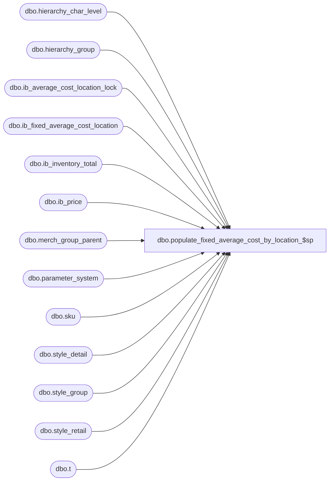

# dbo.populate_fixed_average_cost_by_location_$sp

**Database:** me_01  
**Server:** bedrockdb02  

## Architecture Diagram



## Table Dependencies

| Referenced Table |
|---|
| dbo.hierarchy_char_level |
| dbo.hierarchy_group |
| dbo.ib_average_cost_location_lock |
| dbo.ib_fixed_average_cost_location |
| dbo.ib_inventory_total |
| dbo.ib_price |
| dbo.merch_group_parent |
| dbo.parameter_system |
| dbo.sku |
| dbo.style_detail |
| dbo.style_group |
| dbo.style_retail |
| dbo.t |

## Stored Procedure Code

```sql
CREATE PROCEDURE [dbo].[populate_fixed_average_cost_by_location_$sp]
	(@identifier NVARCHAR(5),
	@status INT OUTPUT)
AS

/*
	Version		: 1.00
	Created		: 2012/03/06
	Created by	: Pierrette Lemay
	Description	: This procedure is called when parameter_system.ib_average_cost_type is set to 'F' AND ib_average_cost_location_level is set by location (1).
					It populates ib_fixed_average_cost_location for the occurrence of REGULAR style/location/date included in a temporary table loaded by the calling procedure.
					This temporary table should be called #temp_fixed_average_cost.
					Make sure when calling this procedure the amount of distinct combination of style/location/date is relatively low,
					worst case scenario < 5000, best case scenario: around 1000.
					Before having called this procedure, a lock should have been acquired by the caller: this procedure verifies if the identifier
					received as an IN parameter is really the one that holds the lock and has the right running this procedure.
					The second parameter is an output parameter that descrobes the result of the execution:
					0  : Initial state i.e unable to get the current value of the user currently locking table ib_fixed_avg_cost_by_jurisdiction
					100: The procedure is currently locked by another user.
					110: The procedure returned before completion.
					120: The procedure completed successfully.
	History: 1.0

	3/31/2014 Ivan D.  	Bug 52404 - sales posting - ib_inventory is not updated with the right cost when it should be using goal IMU%
			  Ivan D.	140344 - Sales not flowing into Merch segment 3100. Duplicate key when using Fixed average cost
	10/14/2015 Ivan D.	144440 - Sales posting not calculating average cost correctly when on hand cost is 0, units > 0 
	12/10/2015	Ivan	151586 - Sales posting error: Duplicate key found for #temp_average_cost
	12/18/2015	Ivan Dimitrov		152315 - Virtual Transfer and ES sale cost calculations when using fixed average cost
	
	Call from Stored Procedures:
		-- populate_temp_sale_master_$sp

	-- NOTE: The temp table #temp_fixed_average_cost exists and is poulated by the calling procedure
	CREATE TABLE #temp_fixed_average_cost
		( style_id DECIMAL(12,0) NOT NULL
		, location_id SMALLINT NOT NULL
		, transaction_date SMALLDATETIME NOT NULL
		, jurisdiction_id SMALLINT NOT NULL
		, cost_rate float NULL
		, avg_tot_val_retail_sold DECIMAL(16,4) NULL
		, avg_tot_selling_retail_sold DECIMAL(16,4) NULL);
*/

BEGIN
	DECLARE @sql_err_num DECIMAL(38,0), @error_msg NVARCHAR(4000), @c_avg_cost_by_location TINYINT, @c_avg_cost_by_chain TINYINT,
		@c_avg_cost_by_jurisdiction TINYINT, @avg_cost_param TINYINT, @multi_sales_jurisdiction_flag BIT, @cleanup_days SMALLINT,
		@floor_date SMALLDATETIME, @currently_locked_by NVARCHAR(5);

	SELECT   @c_avg_cost_by_location = 1
			, @c_avg_cost_by_chain = 2
			, @c_avg_cost_by_jurisdiction = 3
			, @avg_cost_param = ib_average_cost_location_level
			, @multi_sales_jurisdiction_flag = multi_sales_jurisdiction_flag
			, @cleanup_days = ib_average_cost_cleanup_days
	FROM parameter_system;

	IF NOT object_id(N'tempdb..#temp_ib_average_cost') IS NULL
		DROP TABLE #temp_ib_average_cost;

	CREATE TABLE #temp_ib_average_cost
		( style_id DECIMAL(12,0) NOT NULL
		, location_id SMALLINT NOT NULL
		, transaction_date SMALLDATETIME NOT NULL
		, average_cost DECIMAL(18,6) NULL
		, average_cost_local DECIMAL(18,6) NULL);

	IF NOT object_id(N'tempdb..#new_style_cost_using_IMU') IS NULL
		DROP TABLE #new_style_cost_using_IMU;

	CREATE TABLE #new_style_cost_using_IMU
		( style_id DECIMAL(12,0) NOT NULL
		, location_id SMALLINT NOT NULL
		, transaction_date SMALLDATETIME NOT NULL
		, jurisdiction_id SMALLINT NOT NULL
		, goal_imu_level_id INT NULL
		, hierarchy_level_id INT NULL
		, hierarchy_group_id INT NULL
		, goal_imu_percent DECIMAL(5,2) NULL
		, average_cost DECIMAL(18,6) NULL
		, average_cost_local DECIMAL(18,6) NULL);

	IF NOT object_id(N'tempdb..#temp_effective_retail_pfc') IS NULL
		DROP TABLE #temp_effective_retail_pfc;

	CREATE TABLE #temp_effective_retail_pfc
		( style_id DECIMAL(12,0) NOT NULL
		, location_id SMALLINT NOT NULL
		, transaction_date SMALLDATETIME NOT NULL
		, jurisdiction_id SMALLINT NOT NULL
		, valuation_retail_price DECIMAL(14,2) NOT NULL
		, selling_retail_price DECIMAL(14,2) NOT NULL);

	IF NOT object_id(N'tempdb..#temp_issued_retail_pfc') IS NULL
		DROP TABLE #temp_issued_retail_pfc;

	CREATE TABLE #temp_issued_retail_pfc
		( style_id DECIMAL(12,0) NOT NULL
		, location_id SMALLINT NOT NULL
		, transaction_date SMALLDATETIME NOT NULL
		, jurisdiction_id SMALLINT NOT NULL
		, valuation_retail_price DECIMAL(14,2) NOT NULL
		, selling_retail_price DECIMAL(14,2) NOT NULL);

	CREATE TABLE #temp_style_retail
		( style_id DECIMAL(12,0) NOT NULL
		, location_id SMALLINT NOT NULL
		, transaction_date SMALLDATETIME NOT NULL
		, jurisdiction_id SMALLINT NOT NULL
		, valuation_retail_price DECIMAL(14,2) NOT NULL
		, selling_retail_price DECIMAL(14,2) NOT NULL);

	BEGIN TRY
		-- Check if this process locked for the current identifier
		SELECT @currently_locked_by = locking_application FROM ib_average_cost_location_lock WITH (NOLOCK);

		IF (@currently_locked_by <> @identifier)
		BEGIN
			SET @status = 100;
			RETURN;
		END

		-- Need to insert a row into ib_average_cost for each row contained in the #temp_ib_average_cost
		-- This procedure should process rapidly as it doesn't support being called from multiple threads/processe.
		-- First validation: if one row from the temporary table exists in ib_fixed_average_cost then remove it from the temp table.
		DELETE t
		FROM #temp_fixed_average_cost t
		WHERE EXISTS (SELECT 1 FROM dbo.ib_fixed_average_cost_location i
				  WHERE i.style_id = t.style_id
				  AND i.location_id = t.location_id
				  AND i.transaction_date = t.transaction_date);

		-- Populate #temp_ib_average_cost with cost and cost_local for regular styles
		INSERT INTO #temp_ib_average_cost
			( style_id
			, location_id
			, transaction_date
			, average_cost
			, average_cost_local)
		SELECT t.style_id
			 , t.location_id
			 , t.transaction_date
			 , CASE WHEN ( ISNULL(SUM(ib_inventory_total.total_on_hand_units), 0) > 0
						  AND
						  ISNULL(SUM(ib_inventory_total.total_on_hand_cost), 0) >= 0 )
					THEN (SUM(ib_inventory_total.total_on_hand_cost) / SUM(ib_inventory_total.total_on_hand_units))
    				ELSE style_detail.last_net_final_po_cost
				END average_cost
			, CASE WHEN ( ISNULL(SUM(ib_inventory_total.total_on_hand_units), 0) > 0
						  AND
						  ISNULL(SUM(ib_inventory_total.total_on_hand_cost_local), 0) >= 0 )
					THEN (SUM(ib_inventory_total.total_on_hand_cost_local) / SUM(ib_inventory_total.total_on_hand_units))
    			   ELSE style_detail.last_net_final_po_cost/t.cost_rate -- convert the value from home to local currency
			  END average_cost_local
		FROM #temp_fixed_average_cost t
		JOIN style_detail WITH (NOLOCK) ON ( t.style_id = style_detail.style_id )
		JOIN sku WITH (NOLOCK) ON (sku.style_id = t.style_id)
		LEFT OUTER JOIN ib_inventory_total WITH (NOLOCK) ON ( ib_inventory_total.sku_id = sku.sku_id
										   AND ib_inventory_total.location_id = t.location_id )
		GROUP BY t.style_id, t.location_id, t.transaction_date, t.cost_rate, style_detail.last_net_final_po_cost;

		-- *** At this point if all the styles don't have a cost because ***
		-- there was no transaction in IB yet and style doesn't have a last_net_final_cost
		-- then style's goal IMU% from its merchandise group is used
		IF EXISTS (SELECT 1 FROM #temp_fixed_average_cost a
				   WHERE EXISTS (SELECT 1 FROM #temp_ib_average_cost b
									WHERE a.style_id = b.style_id
								    AND a.location_id = b.location_id
								    AND a.transaction_date = b.transaction_date
								    AND (b.average_cost IS NULL OR b.average_cost_local IS NULL) ))
		BEGIN
			-- INSERT into a temp table these new style/location/date for which we don't have a cost at this point
			INSERT INTO #new_style_cost_using_IMU
				 (style_id, location_id, transaction_date, jurisdiction_id, goal_imu_level_id, hierarchy_level_id, hierarchy_group_id, goal_imu_percent)
			SELECT DISTINCT a.style_id, a.location_id, a.transaction_date, a.jurisdiction_id, hcl.goal_imu_level_id, hg.hierarchy_level_id, hg.hierarchy_group_id, hg.goal_imu_percent
			FROM #temp_fixed_average_cost a, style_group sg, hierarchy_group hg, hierarchy_char_level hcl
			WHERE a.style_id = sg.style_id
			AND sg.hierarchy_group_id = hg.hierarchy_group_id
			AND hcl.hierarchy_id = hg.hierarchy_id
			AND EXISTS (SELECT 1 FROM #temp_ib_average_cost b
									WHERE a.style_id = b.style_id
								    AND a.location_id = b.location_id
								    AND a.transaction_date = b.transaction_date
								    AND (b.average_cost IS NULL OR b.average_cost_local IS NULL));

			UPDATE t
			SET t.goal_imu_percent = hg.goal_imu_percent
			FROM #new_style_cost_using_IMU t, merch_group_parent par, hierarchy_group hg
			WHERE t.goal_imu_percent IS NULL
			AND par.hierarchy_level_id = t.goal_imu_level_id
			AND par.hierarchy_group_id = t.hierarchy_group_id
			AND par.parent_hierarchy_group_id = hg.hierarchy_group_id;

			-- REGULAR styles calculation:
			-- Average cost in home currency = (1-(Goal IMU% / 100)) * Valuation Retail (current or original valuation retail)
			-- Average cost in location currency = (1-(Goal IMU% / 100)) * Selling Retail (current or original selling retail)

			-- We need to calculate first the current retail for the styles that have the average cost not set at this point
			-- We have to ignore the color exceptions and some other exeptions depending the way the average cost parameter is configure in parameter_system
			-- Calculation of Effective Retail, ignore color exceptions.

			INSERT INTO #temp_effective_retail_pfc
					(style_id, location_id, transaction_date,  jurisdiction_id, valuation_retail_price, selling_retail_price)
			 SELECT U.style_id, U.location_id, U.transaction_date, U.jurisdiction_id, s.valuation_retail_price, s.selling_retail_price
				FROM ib_price s WITH(NOLOCK),
					( SELECT T.style_id, T.location_id, T.jurisdiction_id, T.transaction_date, MAX(ib.ib_price_id) ib_price_id
					FROM ib_price ib WITH(NOLOCK),
					  ( SELECT t.style_id, t.location_id, t.transaction_date, t.jurisdiction_id, MAX(i.effective_date) effective_date
						FROM ib_price i WITH(NOLOCK), #new_style_cost_using_IMU t
						WHERE i.style_id = t.style_id
						AND i.jurisdiction_id = t.jurisdiction_id
						-- effective date must be set and less than or equal than transaction date
						AND i.effective_date IS NOT NULL
						AND i.effective_date <= t.transaction_date
						-- only want permanent prices, nothing on promo
						AND i.temp_price_flag = 0
						AND ( -- chain excecptions
							( i.location_id IS NULL
								AND i.pricing_group_id IS NULL
								AND i.color_id IS NULL )
							-- location exceptions
							OR ( i.location_id = t.location_id
							   AND i.color_id IS NULL ) )
						GROUP BY t.style_id, t.location_id, t.transaction_date, t.jurisdiction_id ) T
					WHERE ib.style_id = T.style_id
					AND ib.effective_date = T.effective_date
					AND ib.jurisdiction_id = T.jurisdiction_id
					AND ib.temp_price_flag = 0
					AND ( -- chain excecptions
							( ib.location_id IS NULL
								AND ib.pricing_group_id IS NULL
								AND ib.color_id IS NULL )
							-- location exceptions
							OR ( ib.location_id = t.location_id
							   AND ib.color_id IS NULL ) )
					GROUP BY T.style_id, T.location_id, T.transaction_date, T.jurisdiction_id ) U
				WHERE s.ib_price_id = U.ib_price_id;

				INSERT INTO #temp_issued_retail_pfc
					(style_id, location_id, transaction_date, jurisdiction_id, valuation_retail_price, selling_retail_price)
				SELECT U.style_id, U.location_id, U.transaction_date, U.jurisdiction_id, i.valuation_retail_price, i.selling_retail_price
				FROM ib_price i WITH(NOLOCK),
					( SELECT T.style_id
						, T.location_id
						, T.transaction_date
						, T.jurisdiction_id
						, MAX(ib.ib_price_id) ib_price_id
					  FROM ib_price ib WITH(NOLOCK),
						 ( SELECT DISTINCT t.style_id
								, t.location_id
								, t.transaction_date
								, t.jurisdiction_id
								, MAX(i.start_date) start_date
							FROM ib_price i WITH(NOLOCK), #new_style_cost_using_IMU t
							WHERE -- start date must be set and less than or equal to @curr_transaction_date
								i.start_date <= t.transaction_date
							AND i.start_date IS NOT NULL
							AND i.jurisdiction_id = t.jurisdiction_id
							AND i.style_id = t.style_id
							-- only want permanent prices, nothing on promo
							AND i.temp_price_flag = 0
							AND ( -- chain excecptions
								( i.location_id IS NULL
									AND i.pricing_group_id IS NULL
									AND i.color_id IS NULL )
								-- location exceptions
								OR ( i.location_id = t.location_id
									AND i.color_id IS NULL ) )
							GROUP BY t.style_id, t.location_id, t.transaction_date, t.jurisdiction_id )	T
					WHERE ib.style_id = T.style_id
					AND ib.jurisdiction_id = T.jurisdiction_id
					AND ib.start_date = T.start_date
					AND ib.temp_price_flag = 0
					AND ( -- chain excecptions
						( ib.location_id IS NULL
							AND ib.pricing_group_id IS NULL
							AND ib.color_id IS NULL )
						-- location exceptions
						OR ( ib.location_id = T.location_id
							AND ib.color_id IS NULL ) )
					GROUP BY T.style_id, T.location_id, T.transaction_date, T.jurisdiction_id ) U
				WHERE i.ib_price_id = U.ib_price_id;

				-- we might not have any entries in ib_price, take the prices from style_retail
				INSERT INTO #temp_style_retail
					(style_id, location_id, transaction_date, jurisdiction_id, valuation_retail_price, selling_retail_price)
				SELECT t.style_id, t.location_id, t.transaction_date, t.jurisdiction_id, i.original_valuation_retail, i.original_selling_retail
				FROM style_retail i WITH(NOLOCK),
					 #new_style_cost_using_IMU t
							WHERE i.jurisdiction_id = t.jurisdiction_id
							AND i.style_id = t.style_id


			-- Now INSERT INTO #temp_ib_average_cost.average_cost using IMU%
			UPDATE t
			SET average_cost = (1-(n.goal_imu_percent / 100)) * COALESCE(#temp_effective_retail_pfc.valuation_retail_price, #temp_issued_retail_pfc.valuation_retail_price, tst.valuation_retail_price),
				average_cost_local = (1-(n.goal_imu_percent / 100)) * COALESCE(#temp_effective_retail_pfc.selling_retail_price, #temp_issued_retail_pfc.selling_retail_price, tst.selling_retail_price)
			FROM #temp_ib_average_cost t
			JOIN #new_style_cost_using_IMU n
				ON t.style_id = n.style_id
				AND t.location_id = n.location_id
				AND t.transaction_date = n.transaction_date
			LEFT OUTER JOIN #temp_style_retail tst
				ON n.style_id = tst.style_id
				AND n.location_id = tst.location_id
				AND n.transaction_date = tst.transaction_date
			LEFT OUTER JOIN #temp_issued_retail_pfc
				ON  n.style_id	= #temp_issued_retail_pfc.style_id
				AND n.location_id = #temp_issued_retail_pfc.location_id
				AND n.transaction_date	  = #temp_issued_retail_pfc.transaction_date
			LEFT OUTER JOIN #temp_effective_retail_pfc
				ON  n.style_id		= #temp_effective_retail_pfc.style_id
				AND n.location_id   = #temp_effective_retail_pfc.location_id
				AND n.transaction_date = #temp_effective_retail_pfc.transaction_date
				AND #temp_issued_retail_pfc.style_id		 = #temp_effective_retail_pfc.style_id
				AND #temp_issued_retail_pfc.location_id		 = #temp_effective_retail_pfc.location_id
				AND #temp_issued_retail_pfc.transaction_date = #temp_effective_retail_pfc.transaction_date;
		END

		BEGIN TRAN
		-- need to get exclusive lock on ib_fixed_average_cost_location to avoid duplicate entries
		
		SELECT TOP 1 * from ib_fixed_average_cost_location (TABLOCKX)
		
		INSERT INTO ib_fixed_average_cost_location
			( style_id
			, location_id
			, transaction_date
			, average_cost
			, average_cost_local)
		SELECT DISTINCT t.style_id
			, t.location_id
			, t.transaction_date
			, t.average_cost
			, t.average_cost_local
		FROM #temp_ib_average_cost t
		WHERE t.average_cost IS NOT NULL
		AND NOT EXISTS (SELECT 1 FROM ib_fixed_average_cost_location i
						   WHERE i.style_id = t.style_id
						   AND i.location_id = t.location_id
						   AND i.transaction_date = t.transaction_date);

		COMMIT TRAN


		SET @status = 120;

	END TRY
	BEGIN CATCH

	IF @@TRANCOUNT > 0
		ROLLBACK TRAN;

	SET @status = 110;

	SET @error_msg = N'Error in procedure populate_fixed_average_cost_by_location_$sp: ' + CAST(ERROR_NUMBER() AS NVARCHAR) + N' ' + ERROR_MESSAGE();
	RAISERROR (@error_msg, 16, 1);

	END CATCH
END
```

