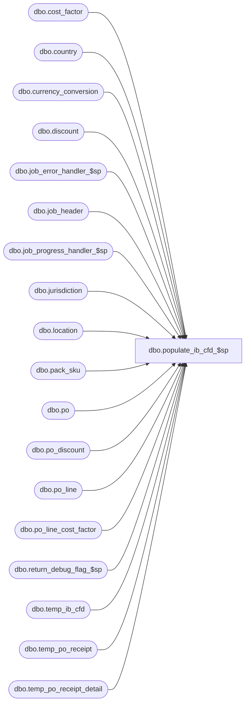

# dbo.populate_ib_cfd_$sp

**Database:** me_01  
**Server:** bedrockdb02  

## Architecture Diagram



## Table Dependencies

| Referenced Table |
|---|
| dbo.cost_factor |
| dbo.country |
| dbo.currency_conversion |
| dbo.discount |
| dbo.job_error_handler_$sp |
| dbo.job_header |
| dbo.job_progress_handler_$sp |
| dbo.jurisdiction |
| dbo.location |
| dbo.pack_sku |
| dbo.po |
| dbo.po_discount |
| dbo.po_line |
| dbo.po_line_cost_factor |
| dbo.return_debug_flag_$sp |
| dbo.temp_ib_cfd |
| dbo.temp_po_receipt |
| dbo.temp_po_receipt_detail |

## Stored Procedure Code

```sql
CREATE PROCEDURE [dbo].[populate_ib_cfd_$sp]
	(@job_id INT)

AS

/*
	Version		: 1.00
	Created		: 2007/04/24
	Created by	: Pierrette Lemay
	Description	: This procedure is part of the ASN import, it's called by import_asn_batch_$sp when 
				  parameter_im.gen_po_receipt_for_asn_flag is set. Some po_receipt documents were created previously
				  for the currently processed job in step #2 with state_no 2 for auto receive vendor. 
				  When the po_receipt has state_no = 2:
								style_status was updated (in step #3), 
								transactions (200) were created in ib_inventory (in step #4) 
								transactions (110 and 115) were created in ib_on_order (in step #5) 
				  In step #3, there will be transactions added to ib_cost_factor_discount using the content of the temporary table temp_ib_cfd.
				  This temporary table is populated in this procedure with: 
								transaction 290 for cost factors 
								transaction 292 for discounts
				  temp_ib_cfd will also be used in step #6 to create imat_receipt_discount rows when IMAT is installed according parameter_system.

	Date		developer	defect/description
	2014/07/25	Feng		ME5.0.FT62701.Wholesale Integration (In-transit inventory) UC008 – Generate ASN Receipts - ASN Import Via Pipeline  & XML Coding	 
							table po_receipt: added shipped_date, track_in_transit_flag, discrepancy_posted
							table po_receipt_detail: added units_shipped
							vendor table asn_auto_receive_flag does not used anymore, which has been replaced by track_in_transit_flag and combined with asn_auto_generate_po_rcpt_status (1-Preliminary, 2-Shipped, 3-Received)
							if track_in_transit_flag = false, asn_auto_generate_po_rcpt_status could only have value 1 (Preliminary) or 3 (Received).
							Therefore for the cases for updating IB, cost and last activity date of PO Receipt auto generated with Shipped status will follow the Received status, need to: 
							1) add field shipped_date, state_no in table temp_po_receipt_net_cost, variable table #temp_pg_location
							2) replace asn_auto_receive_flag with the combination of track_in_transit_flag and asn_auto_generate_po_rcpt_status.
							3) add scenaria for Shipped PO Receipt when update IB with transaction code = 202
				
				  
*/

BEGIN
	DECLARE @line_id SMALLINT, @job_type TINYINT, @proc_name NVARCHAR(30), @sql_err_num DECIMAL(38,0),
			@table_name NVARCHAR(30), @operation_name NVARCHAR(30), @error_msg NVARCHAR(2000), @debug_flag BIT,
			@job_debug_flag BIT, @c_true BIT, @c_false BIT,  @crs_discount_flag BIT,  @sequence SMALLINT, 
			@discount_id SMALLINT, @pct_amt SMALLINT, @calculate_on SMALLINT;
	
	SELECT @job_type		= 10
		, @proc_name		= N'populate_ib_cfd_$sp'
		, @c_false			= 0
		, @c_true			= 1
		, @line_id			= 10
		, @crs_discount_flag = 0;
	
	IF NOT object_id(N'tempdb..#cost_rate') IS NULL
		DROP TABLE #cost_rate;
		
	CREATE TABLE #cost_rate
		( po_receipt_id DECIMAL(12,0) NOT NULL
		, location_id SMALLINT NOT NULL
		, receive_date SMALLDATETIME NOT NULL
		, shipped_date SMALLDATETIME NULL
		, state_no INT NOT NULL
		, cost_rate FLOAT NULL);
		
	IF NOT object_id(N'tempdb..#temp_cost_factor') IS NULL
		DROP TABLE #temp_cost_factor;
			
	CREATE TABLE #temp_cost_factor
		( po_id DECIMAL(12,0) NOT NULL
		, receive_date SMALLDATETIME NOT NULL
		, shipped_date SMALLDATETIME NULL
		, state_no INT NOT NULL
		, location_id SMALLINT NOT NULL
		, po_line_id SMALLINT NOT NULL
		, factor_amount FLOAT NOT NULL
		, cost_factor_id SMALLINT NOT NULL);

	IF NOT object_id(N'tempdb..#temp_discount') IS NULL
		DROP TABLE #temp_discount;
		
	CREATE TABLE #temp_discount
		( po_id DECIMAL(12,0) NOT NULL
		, sequence SMALLINT NOT NULL
		, discount_id SMALLINT NOT NULL
		, pct_amt SMALLINT NOT NULL
		, discount_value FLOAT NOT NULL
		, calculate_on SMALLINT NOT NULL
		, reflect_in_discount_cost_flag BIT NOT NULL);
		
	IF NOT object_id(N'tempdb..#temp_po_line_discount') IS NULL
		DROP TABLE #temp_po_line_discount;
		
	CREATE TABLE #temp_po_line_discount
		( po_receipt_id DECIMAL(12,0) NOT NULL
		, po_id DECIMAL(12,0) NOT NULL
		, po_line_id SMALLINT NOT NULL
		, discount_id SMALLINT NOT NULL
		, sequence SMALLINT NOT NULL
		, gross_cost DECIMAL(18,6) NOT NULL
		, net_cost DECIMAL(18,6) NOT NULL
		, balance DECIMAL(18,6) NOT NULL
		, discount_value FLOAT NOT NULL)
 
	BEGIN TRY
		-- Get parameters associates to the current job
		SELECT @job_debug_flag = debug_flag
		FROM job_header
		WHERE job_id = @job_id
		AND job_type = @job_type

		-- Log progress if job_params.debug_flag is true 
		EXEC return_debug_flag_$sp @job_type, @debug_flag OUT
		IF (@debug_flag = @c_true OR @job_debug_flag = @c_true)
			EXEC job_progress_handler_$sp @job_type, @job_id, @proc_name, @line_id 	

		-- Populate temp tables related to cost_factors
		SET @line_id = 20

		INSERT INTO #temp_cost_factor
			(po_id, location_id, receive_date, shipped_date, state_no, po_line_id, cost_factor_id, factor_amount)		
		SELECT DISTINCT r.po_id, r.location_id, r.receive_date, r.shipped_date, r.state_no, d.po_line_id, c.cost_factor_id, 
			CASE WHEN f.currency_indicator = 1 THEN f.factor_amount * po.exchange_rate
				ELSE f.factor_amount
			END factor_amount
		FROM temp_po_receipt r, temp_po_receipt_detail d, cost_factor c, po, po_line_cost_factor f
		WHERE r.job_id = @job_id
		AND r.state_no = 2
		AND r.receive_date IS NOT NULL
		AND r.job_id = d.job_id
		AND r.po_receipt_id = d.po_receipt_id
		AND r.po_id = po.po_id
		AND r.po_id = f.po_id 
		AND d.po_line_id = f.po_line_id
		AND c.cost_factor_id = f.cost_factor_id;

		-- Log progress if job_params.debug_flag is true 
		EXEC return_debug_flag_$sp @job_type, @debug_flag OUT
		IF (@debug_flag = @c_true OR @job_debug_flag = @c_true)
			EXEC job_progress_handler_$sp @job_type, @job_id, @proc_name, @line_id;	

		-- Populate temp tables related to cost_factors
		SET @line_id = 21

		INSERT INTO #temp_cost_factor
			(po_id, location_id, receive_date, shipped_date, state_no, po_line_id, cost_factor_id, factor_amount)		
		SELECT DISTINCT r.po_id, r.location_id, r.receive_date, r.shipped_date, r.state_no, d.po_line_id, c.cost_factor_id, 
			CASE WHEN f.currency_indicator = 1 THEN f.factor_amount * po.exchange_rate
				ELSE f.factor_amount
			END factor_amount
		FROM temp_po_receipt r, temp_po_receipt_detail d, cost_factor c, po, po_line_cost_factor f
		WHERE r.job_id = @job_id
		AND r.state_no = 8
		AND r.shipped_date IS NOT NULL
		AND r.job_id = d.job_id
		AND r.po_receipt_id = d.po_receipt_id
		AND r.po_id = po.po_id
		AND r.po_id = f.po_id 
		AND d.po_line_id = f.po_line_id
		AND c.cost_factor_id = f.cost_factor_id;

		-- Log progress if job_params.debug_flag is true 
		EXEC return_debug_flag_$sp @job_type, @debug_flag OUT
		IF (@debug_flag = @c_true OR @job_debug_flag = @c_true)
			EXEC job_progress_handler_$sp @job_type, @job_id, @proc_name, @line_id;	

		SET @line_id = 30;
			
		INSERT INTO #cost_rate
			(po_receipt_id, location_id, receive_date, shipped_date, state_no, cost_rate)
		SELECT r.po_receipt_id, r.location_id, r.receive_date, r.shipped_date, r.state_no, cc.exchange_rate
		FROM temp_po_receipt r, location l, jurisdiction j, country co, currency_conversion cc
		WHERE r.job_id = @job_id
		AND r.state_no = 2
		AND r.receive_date IS NOT NULL
		AND r.location_id = l.location_id
		AND l.jurisdiction_id = j.jurisdiction_id
		AND j.country_id = co.country_id 
		AND co.currency_id = cc.to_currency_id 
		AND cc.currency_conversion_type = 1
		AND cc.effective_from_date <= r.receive_date
		AND (cc.effective_to_date >= r.receive_date
			OR cc.effective_to_date IS NULL);

		-- Log progress if job_params.debug_flag is true 
		EXEC return_debug_flag_$sp @job_type, @debug_flag OUT
		IF (@debug_flag = @c_true OR @job_debug_flag = @c_true)
			EXEC job_progress_handler_$sp @job_type, @job_id, @proc_name, @line_id;	
		
		SET @line_id = 31;
			
		INSERT INTO #cost_rate
			(po_receipt_id, location_id, receive_date, shipped_date, state_no, cost_rate)
		SELECT r.po_receipt_id, r.location_id, r.receive_date, r.shipped_date, r.state_no, cc.exchange_rate
		FROM temp_po_receipt r, location l, jurisdiction j, country co, currency_conversion cc
		WHERE r.job_id = @job_id
		AND r.state_no = 8
		AND r.shipped_date IS NOT NULL
		AND r.location_id = l.location_id
		AND l.jurisdiction_id = j.jurisdiction_id
		AND j.country_id = co.country_id 
		AND co.currency_id = cc.to_currency_id 
		AND cc.currency_conversion_type = 1
		AND cc.effective_from_date <= r.shipped_date
		AND (cc.effective_to_date >= r.shipped_date
			OR cc.effective_to_date IS NULL);

		-- Log progress if job_params.debug_flag is true 
		EXEC return_debug_flag_$sp @job_type, @debug_flag OUT
		IF (@debug_flag = @c_true OR @job_debug_flag = @c_true)
			EXEC job_progress_handler_$sp @job_type, @job_id, @proc_name, @line_id;	
				
		SET @line_id = 40;
		-- Loose items
		INSERT INTO temp_ib_cfd
			(job_id, sku_id, location_id, transaction_date, document_number, transaction_type_code, cost_factor_discount_id,
			extended_cost, extended_cost_local)
		SELECT DISTINCT @job_id, d.sku_id, r.location_id, r.receive_date, r.document_no, 290, t.cost_factor_id,
			SUM(d.units_received) * t.factor_amount, 
			SUM(d.units_received) * (t.factor_amount/c.cost_rate) 
		FROM temp_po_receipt r, temp_po_receipt_detail d, #temp_cost_factor t, #cost_rate c
		WHERE r.job_id = @job_id
		AND r.state_no = 2
		AND r.receive_date IS NOT NULL
		AND r.job_id = d.job_id
		AND r.po_receipt_id = d.po_receipt_id
		AND d.pack_id IS NULL
		AND r.po_id = t.po_id 
		AND r.location_id = t.location_id
		AND d.po_line_id = t.po_line_id
		AND r.po_receipt_id = c.po_receipt_id
		AND r.location_id = c.location_id
		GROUP BY d.sku_id, r.location_id, r.receive_date, r.document_no, t.cost_factor_id, t.factor_amount, c.cost_rate;

		-- Log progress if job_params.debug_flag is true 
		EXEC return_debug_flag_$sp @job_type, @debug_flag OUT
		IF (@debug_flag = @c_true OR @job_debug_flag = @c_true)
			EXEC job_progress_handler_$sp @job_type, @job_id, @proc_name, @line_id;	
		
		SET @line_id = 41;
		-- Loose items
		INSERT INTO temp_ib_cfd
			(job_id, sku_id, location_id, transaction_date, document_number, transaction_type_code, cost_factor_discount_id,
			extended_cost, extended_cost_local)
		SELECT DISTINCT @job_id, d.sku_id, r.location_id, r.shipped_date, r.document_no, 290, t.cost_factor_id,
			SUM(d.units_shipped) * t.factor_amount, 
			SUM(d.units_shipped) * (t.factor_amount/c.cost_rate) 
		FROM temp_po_receipt r, temp_po_receipt_detail d, #temp_cost_factor t, #cost_rate c
		WHERE r.job_id = @job_id
		AND r.state_no = 8
		AND r.shipped_date IS NOT NULL
		AND r.job_id = d.job_id
		AND r.po_receipt_id = d.po_receipt_id
		AND d.pack_id IS NULL
		AND r.po_id = t.po_id 
		AND r.location_id = t.location_id
		AND d.po_line_id = t.po_line_id
		AND r.po_receipt_id = c.po_receipt_id
		AND r.location_id = c.location_id
		GROUP BY d.sku_id, r.location_id, r.shipped_date, r.document_no, t.cost_factor_id, t.factor_amount, c.cost_rate;

		-- Log progress if job_params.debug_flag is true 
		EXEC return_debug_flag_$sp @job_type, @debug_flag OUT
		IF (@debug_flag = @c_true OR @job_debug_flag = @c_true)
			EXEC job_progress_handler_$sp @job_type, @job_id, @proc_name, @line_id;	

		SET @line_id = 50;	
		-- pack items
		INSERT INTO temp_ib_cfd
			(job_id, sku_id, location_id, transaction_date, transaction_type_code, document_number, cost_factor_discount_id,
			extended_cost, extended_cost_local)
		SELECT DISTINCT @job_id, ps.sku_id, r.location_id, r.receive_date, 290, r.document_no, t.cost_factor_id,
			( ps.sku_quantity * SUM(d.units_received) ) * t.factor_amount, 
			( ps.sku_quantity * SUM(d.units_received) ) * (t.factor_amount/c.cost_rate) 
		FROM temp_po_receipt r, temp_po_receipt_detail d, #temp_cost_factor t, pack_sku ps, #cost_rate c
		WHERE r.job_id = @job_id
		AND r.state_no = 2
		AND r.receive_date IS NOT NULL
		AND r.job_id = d.job_id
		AND r.po_receipt_id = d.po_receipt_id
		AND d.sku_id IS NULL
		AND d.pack_id = ps.pack_id
		AND r.po_id = t.po_id 
		AND r.location_id = t.location_id
		AND d.po_line_id = t.po_line_id
		AND r.po_receipt_id = c.po_receipt_id
		AND r.location_id = c.location_id
		GROUP BY ps.sku_id, r.location_id, r.receive_date, r.document_no, t.cost_factor_id, t.factor_amount, ps.sku_quantity, c.cost_rate;
	
		-- Log progress if job_params.debug_flag is true 
		EXEC return_debug_flag_$sp @job_type, @debug_flag OUT
		IF (@debug_flag = @c_true OR @job_debug_flag = @c_true)
			EXEC job_progress_handler_$sp @job_type, @job_id, @proc_name, @line_id;	
					
		SET @line_id = 51;	
		-- pack items
		INSERT INTO temp_ib_cfd
			(job_id, sku_id, location_id, transaction_date, transaction_type_code, document_number, cost_factor_discount_id,
			extended_cost, extended_cost_local)
		SELECT DISTINCT @job_id, ps.sku_id, r.location_id, r.shipped_date, 290, r.document_no, t.cost_factor_id,
			( ps.sku_quantity * SUM(d.units_shipped) ) * t.factor_amount, 
			( ps.sku_quantity * SUM(d.units_shipped) ) * (t.factor_amount/c.cost_rate) 
		FROM temp_po_receipt r, temp_po_receipt_detail d, #temp_cost_factor t, pack_sku ps, #cost_rate c
		WHERE r.job_id = @job_id
		AND r.state_no = 8
		AND r.shipped_date IS NOT NULL
		AND r.job_id = d.job_id
		AND r.po_receipt_id = d.po_receipt_id
		AND d.sku_id IS NULL
		AND d.pack_id = ps.pack_id
		AND r.po_id = t.po_id 
		AND r.location_id = t.location_id
		AND d.po_line_id = t.po_line_id
		AND r.po_receipt_id = c.po_receipt_id
		AND r.location_id = c.location_id
		GROUP BY ps.sku_id, r.location_id, r.shipped_date, r.document_no, t.cost_factor_id, t.factor_amount, ps.sku_quantity, c.cost_rate;
	
		-- Log progress if job_params.debug_flag is true 
		EXEC return_debug_flag_$sp @job_type, @debug_flag OUT
		IF (@debug_flag = @c_true OR @job_debug_flag = @c_true)
			EXEC job_progress_handler_$sp @job_type, @job_id, @proc_name, @line_id;	
					
		-- Populate temp tables related to discounts
		SET @line_id = 60
		
		INSERT INTO #temp_discount
			(po_id, sequence, discount_id, pct_amt, discount_value, calculate_on, reflect_in_discount_cost_flag)
		SELECT c.po_id, c.sequence, d.discount_id, c.pct_amt, c.discount_value, c.calculate_on, c.reflect_in_discount_cost_flag
		FROM temp_po_receipt r, po_discount c, discount d
		WHERE r.job_id = @job_id
		AND r.state_no IN (2, 8) -- 2= received status, 8 = shipped status
		AND r.po_id = c.po_id 
		AND c.discount_id = d.discount_id 
		AND d.reflect_in_net_cost_flag = 1 
		ORDER BY c.sequence

		-- Log progress if job_params.debug_flag is true 
		EXEC return_debug_flag_$sp @job_type, @debug_flag OUT
		IF (@debug_flag = @c_true OR @job_debug_flag = @c_true)
			EXEC job_progress_handler_$sp @job_type, @job_id, @proc_name, @line_id;			
		
		SET @line_id = 70
		-- Initialize #temp_po_line_discount_ sequence will be 0 
		INSERT INTO #temp_po_line_discount
			(po_receipt_id, po_id, po_line_id, discount_id, sequence, gross_cost, net_cost, balance, discount_value)		
		SELECT DISTINCT r.po_receipt_id, pl.po_id, pl.po_line_id, t.discount_id, 0, 
			pl.first_cost * po.exchange_rate as gross_cost, pl.first_cost * po.exchange_rate as net_cost, 
			pl.first_cost * po.exchange_rate as balance, 0
		FROM temp_po_receipt r, temp_po_receipt_detail rd, po WITH (NOLOCK), po_line pl WITH (NOLOCK), #temp_discount t
		WHERE r.job_id = @job_id
		AND r.state_no IN (2, 8)
		AND r.job_id = rd.job_id
		AND r.po_receipt_id = rd.po_receipt_id
		AND r.po_id = po.po_id 
		AND r.po_id = pl.po_id
		AND rd.po_line_id = pl.po_line_id
		AND pl.po_id = t.po_id
		ORDER BY pl.po_id, pl.po_line_id, t.discount_id;

		-- Log progress if job_params.debug_flag is true 
		EXEC return_debug_flag_$sp @job_type, @debug_flag OUT
		IF (@debug_flag = @c_true OR @job_debug_flag = @c_true)
			EXEC job_progress_handler_$sp @job_type, @job_id, @proc_name, @line_id;
	
		SET @line_id = 80;
						
		DECLARE crs_discount CURSOR FOR
		SELECT DISTINCT sequence, discount_id, pct_amt, calculate_on
		FROM #temp_discount
		ORDER BY sequence;

		OPEN crs_discount;
		SET @crs_discount_flag = 1;
		
		-- Log progress if job_params.debug_flag is true 
		EXEC return_debug_flag_$sp @job_type, @debug_flag OUT
		IF (@debug_flag = @c_true OR @job_debug_flag = @c_true)
			EXEC job_progress_handler_$sp @job_type, @job_id, @proc_name, @line_id;	

		FETCH NEXT FROM crs_discount INTO @sequence, @discount_id, @pct_amt, @calculate_on

		WHILE @@FETCH_STATUS = 0
		BEGIN
			SET @line_id = 90;
			
			IF (@pct_amt = 1)
			BEGIN
				-- Calculation done on Gross Cost
				IF (@calculate_on = 1)
					INSERT INTO #temp_po_line_discount
						(po_receipt_id, po_id, po_line_id, discount_id, sequence, gross_cost, net_cost, balance, discount_value)		
					SELECT DISTINCT tl.po_receipt_id, tl.po_id, tl.po_line_id, @discount_id, td.sequence, tl.gross_cost,
						CASE WHEN td.reflect_in_discount_cost_flag = 1 THEN tl.net_cost - ((tl.gross_cost * td.discount_value) / 100)
							ELSE tl.net_cost
						END net_cost,
						tl.balance - ((tl.gross_cost * td.discount_value) / 100) as balance,
						(tl.gross_cost * td.discount_value) / 100 as discount_value
					FROM #temp_discount td WITH (NOLOCK), #temp_po_line_discount tl WITH (NOLOCK)
					WHERE td.sequence = @sequence
					AND td.discount_id = @discount_id
					AND td.pct_amt = 1
					AND td.calculate_on = 1
					AND tl.po_id = td.po_id
					AND tl.sequence = @sequence - 1;
				ELSE IF (@calculate_on = 2)
					INSERT INTO #temp_po_line_discount
						(po_receipt_id, po_id, po_line_id, discount_id, sequence, gross_cost, net_cost, balance, discount_value)		
					SELECT DISTINCT tl.po_receipt_id, tl.po_id, tl.po_line_id, @discount_id, td.sequence, tl.gross_cost,
						CASE WHEN td.reflect_in_discount_cost_flag = 1 THEN tl.net_cost - ((tl.net_cost * td.discount_value) / 100)
							ELSE tl.net_cost
						END net_cost,
						tl.balance - ((tl.net_cost * td.discount_value) / 100) as balance,
						(tl.net_cost * td.discount_value) / 100 as discount_value
					FROM #temp_discount td WITH (NOLOCK), #temp_po_line_discount tl WITH (NOLOCK)
					WHERE td.sequence = @sequence
					AND td.discount_id = @discount_id
					AND td.pct_amt = @pct_amt
					AND td.calculate_on = 2
					AND tl.po_id = td.po_id
					AND tl.sequence = @sequence - 1;
				ELSE IF (@calculate_on = 3)
					INSERT INTO #temp_po_line_discount
						(po_receipt_id, po_id, po_line_id, discount_id, sequence, gross_cost, net_cost, balance, discount_value)		
					SELECT DISTINCT tl.po_receipt_id, tl.po_id, tl.po_line_id, @discount_id, td.sequence, tl.gross_cost,
						CASE WHEN td.reflect_in_discount_cost_flag = 1 THEN tl.net_cost - ((tl.balance * td.discount_value) / 100)
							ELSE tl.net_cost
						END net_cost,
						tl.balance - ((tl.balance * td.discount_value) / 100) as balance,
						(tl.balance * td.discount_value) / 100 as discount_value
					FROM #temp_discount td WITH (NOLOCK), #temp_po_line_discount tl WITH (NOLOCK)
					WHERE td.sequence = @sequence
					AND td.discount_id = @discount_id
					AND td.pct_amt = @pct_amt
					AND td.calculate_on = 3
					AND tl.po_id = td.po_id
					AND tl.sequence =  @sequence - 1;
			END
			IF (@pct_amt = 2)
				INSERT INTO #temp_po_line_discount
					(po_receipt_id, po_id, po_line_id, discount_id, sequence, gross_cost, net_cost, balance, discount_value)		
				SELECT DISTINCT tl.po_receipt_id, tl.po_id, tl.po_line_id, @discount_id, td.sequence, tl.gross_cost,
					CASE WHEN td.reflect_in_discount_cost_flag = 1 THEN tl.net_cost - td.discount_value
						ELSE tl.net_cost
					END net_cost,
					(tl.balance - td.discount_value) as balance,
					td.discount_value 
				FROM #temp_discount td WITH (NOLOCK), #temp_po_line_discount tl WITH (NOLOCK)
				WHERE td.sequence = @sequence
				AND td.discount_id = @discount_id
				AND td.pct_amt = 2
				AND tl.po_id = td.po_id
				AND tl.sequence = @sequence - 1;
				
			-- Log progress if job_params.debug_flag is true 
			EXEC return_debug_flag_$sp @job_type, @debug_flag OUT
			IF (@debug_flag = @c_true OR @job_debug_flag = @c_true)
				EXEC job_progress_handler_$sp @job_type, @job_id, @proc_name, @line_id;	
			
			FETCH NEXT FROM crs_discount INTO @sequence, @discount_id, @pct_amt, @calculate_on
		END;
		
		CLOSE crs_discount
		DEALLOCATE crs_discount
		SET @crs_discount_flag = 0
		
	
		SET @line_id = 100;
			
		INSERT INTO temp_ib_cfd
			(job_id, sku_id, location_id, transaction_date, transaction_type_code, document_number,
			cost_factor_discount_id, extended_cost, extended_cost_local)
		SELECT @job_id, rd.sku_id, r.location_id, r.receive_date, 292, r.document_no, t.discount_id,
			SUM(rd.units_received) * t.discount_value AS extended_cost, 
			SUM(rd.units_received) * (t.discount_value / c.cost_rate) AS extended_cost_local
		FROM temp_po_receipt r, temp_po_receipt_detail rd, #temp_po_line_discount t, #cost_rate c
		WHERE r.job_id = @job_id
		AND r.state_no = 2
		AND r.receive_date IS NOT NULL
		AND r.job_id = rd.job_id
		AND r.po_receipt_id = rd.po_receipt_id
		AND rd.pack_id IS NULL
		AND r.po_receipt_id = t.po_receipt_id 
		AND r.po_id = t.po_id
		AND rd.po_line_id = t.po_line_id
		AND t.sequence <> 0
		AND r.po_receipt_id = c.po_receipt_id
		GROUP BY rd.sku_id, r.location_id, r.receive_date, r.document_no, t.discount_id, t.discount_value, c.cost_rate;
		
		-- Log progress if job_params.debug_flag is true 
		EXEC return_debug_flag_$sp @job_type, @debug_flag OUT
		IF (@debug_flag = @c_true OR @job_debug_flag = @c_true)
			EXEC job_progress_handler_$sp @job_type, @job_id, @proc_name, @line_id;	
			
		SET @line_id = 101;
			
		INSERT INTO temp_ib_cfd
			(job_id, sku_id, location_id, transaction_date, transaction_type_code, document_number,
			cost_factor_discount_id, extended_cost, extended_cost_local)
		SELECT @job_id, rd.sku_id, r.location_id, r.shipped_date, 292, r.document_no, t.discount_id,
			SUM(rd.units_shipped) * t.discount_value AS extended_cost, 
			SUM(rd.units_shipped) * (t.discount_value / c.cost_rate) AS extended_cost_local
		FROM temp_po_receipt r, temp_po_receipt_detail rd, #temp_po_line_discount t, #cost_rate c
		WHERE r.job_id = @job_id
		AND r.state_no = 8
		AND r.shipped_date IS NOT NULL
		AND r.job_id = rd.job_id
		AND r.po_receipt_id = rd.po_receipt_id
		AND rd.pack_id IS NULL
		AND r.po_receipt_id = t.po_receipt_id 
		AND r.po_id = t.po_id
		AND rd.po_line_id = t.po_line_id
		AND t.sequence <> 0
		AND r.po_receipt_id = c.po_receipt_id
		GROUP BY rd.sku_id, r.location_id, r.shipped_date, r.document_no, t.discount_id, t.discount_value, c.cost_rate;
		
		-- Log progress if job_params.debug_flag is true 
		EXEC return_debug_flag_$sp @job_type, @debug_flag OUT
		IF (@debug_flag = @c_true OR @job_debug_flag = @c_true)
			EXEC job_progress_handler_$sp @job_type, @job_id, @proc_name, @line_id;	
			
		SET @line_id = 110;
			
		INSERT INTO temp_ib_cfd
			(job_id, sku_id, location_id, transaction_date, transaction_type_code, document_number,
			cost_factor_discount_id, extended_cost, extended_cost_local)
		SELECT DISTINCT @job_id, ps.sku_id, r.location_id, r.receive_date, 292, r.document_no, t.discount_id,
			(ps.sku_quantity * SUM(rd.units_received)) * t.discount_value AS extended_cost, 
			(ps.sku_quantity * SUM(rd.units_received)) * (t.discount_value / c.cost_rate) AS extended_cost_local
		FROM temp_po_receipt r, temp_po_receipt_detail rd, pack_sku ps, #temp_po_line_discount t, #cost_rate c
		WHERE r.job_id = @job_id
		AND r.state_no = 2
		AND r.receive_date IS NOT NULL
		AND r.job_id = rd.job_id
		AND r.po_receipt_id = rd.po_receipt_id
		AND rd.sku_id IS NULL
		AND rd.pack_id = ps.pack_id
		AND r.po_receipt_id = t.po_receipt_id 
		AND r.po_id = t.po_id
		AND rd.po_line_id = t.po_line_id
		AND t.sequence <> 0
		AND r.po_receipt_id = c.po_receipt_id
		GROUP BY ps.sku_id, r.location_id, r.receive_date, r.document_no, t.discount_id, ps.sku_quantity, t.discount_value, c.cost_rate;
		
		-- Log progress if job_params.debug_flag is true 
		EXEC return_debug_flag_$sp @job_type, @debug_flag OUT
		IF (@debug_flag = @c_true OR @job_debug_flag = @c_true)
			EXEC job_progress_handler_$sp @job_type, @job_id, @proc_name, @line_id;	

		SET @line_id = 111;
			
		INSERT INTO temp_ib_cfd
			(job_id, sku_id, location_id, transaction_date, transaction_type_code, document_number,
			cost_factor_discount_id, extended_cost, extended_cost_local)
		SELECT DISTINCT @job_id, ps.sku_id, r.location_id, r.shipped_date, 292, r.document_no, t.discount_id,
			(ps.sku_quantity * SUM(rd.units_shipped)) * t.discount_value AS extended_cost, 
			(ps.sku_quantity * SUM(rd.units_shipped)) * (t.discount_value / c.cost_rate) AS extended_cost_local
		FROM temp_po_receipt r, temp_po_receipt_detail rd, pack_sku ps, #temp_po_line_discount t, #cost_rate c
		WHERE r.job_id = @job_id
		AND r.state_no = 8
		AND r.shipped_date IS NOT NULL
		AND r.job_id = rd.job_id
		AND r.po_receipt_id = rd.po_receipt_id
		AND rd.sku_id IS NULL
		AND rd.pack_id = ps.pack_id
		AND r.po_receipt_id = t.po_receipt_id 
		AND r.po_id = t.po_id
		AND rd.po_line_id = t.po_line_id
		AND t.sequence <> 0
		AND r.po_receipt_id = c.po_receipt_id
		GROUP BY ps.sku_id, r.location_id, r.shipped_date, r.document_no, t.discount_id, ps.sku_quantity, t.discount_value, c.cost_rate;
		
		-- Log progress if job_params.debug_flag is true 
		EXEC return_debug_flag_$sp @job_type, @debug_flag OUT
		IF (@debug_flag = @c_true OR @job_debug_flag = @c_true)
			EXEC job_progress_handler_$sp @job_type, @job_id, @proc_name, @line_id;	

	END TRY

	BEGIN CATCH
		SELECT @error_msg		= ERROR_MESSAGE()
			 , @sql_err_num		= ERROR_NUMBER()

		IF (@crs_discount_flag = 1) 
		BEGIN
			CLOSE crs_discount
			DEALLOCATE crs_discount
		END;
		
		IF @line_id = 10	
			SELECT  @table_name			= N'job_header'
					, @operation_name	= N'SELECT'
		ELSE IF (@line_id = 20 OR @line_id = 21)
			SELECT  @table_name			= N'#temp_cost_factor'
					, @operation_name	= N'INSERT'
		ELSE IF ( @line_id = 30 OR @line_id = 31)
			SELECT  @table_name			= N'#cost_rate'
					, @operation_name	= N'INSERT'
		ELSE IF (@line_id = 40 OR @line_id = 41)
			SELECT  @table_name			= N'temp_ib_cfd'
					, @operation_name	= N'INSERT'
		ELSE IF  (@line_id = 50 OR @line_id = 51)
			SELECT  @table_name			= N'temp_ib_cfd'
					, @operation_name	= N'INSERT'
		ELSE IF @line_id = 60
			SELECT  @table_name			= N'#temp_discount'
					, @operation_name	= N'SELECT'
		ELSE IF @line_id = 70
			SELECT  @table_name			= N'#temp_po_line_discount'
					, @operation_name	= N'INSERT'
		ELSE IF @line_id = 80
			SELECT  @table_name			= N'crs_discount'
					, @operation_name	= N'OPEN CURSOR'
		ELSE IF @line_id = 90
			SELECT  @table_name			= N'#temp_po_line_discount'
					, @operation_name	= N'INSERT'
		ELSE IF @line_id = 100
			SELECT  @table_name			= N'temp_ib_cfd'
					, @operation_name	= N'INSERT'
		ELSE IF @line_id = 110
			SELECT  @table_name			= N'temp_ib_cfd'
					, @operation_name	= N'INSERT'
	
		EXEC job_error_handler_$sp 
					@job_type 
					, @job_id 
					, @proc_name 
					, @line_id 
					, @sql_err_num 
					, @table_name 
					, @operation_name 
					, @error_msg 
					, @c_true

	END CATCH
END
```

