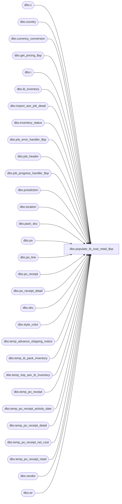

# dbo.populate_ib_cost_retail_$sp

**Database:** me_01  
**Server:** bedrockdb02  

## Architecture Diagram



## Table Dependencies

| Referenced Table |
|---|
| dbo.c |
| dbo.country |
| dbo.currency_conversion |
| dbo.get_pricing_$sp |
| dbo.i |
| dbo.ib_inventory |
| dbo.import_asn_job_detail |
| dbo.inventory_status |
| dbo.job_error_handler_$sp |
| dbo.job_header |
| dbo.job_progress_handler_$sp |
| dbo.jurisdiction |
| dbo.location |
| dbo.pack_sku |
| dbo.po |
| dbo.po_line |
| dbo.po_receipt |
| dbo.po_receipt_detail |
| dbo.sku |
| dbo.style_color |
| dbo.temp_advance_shipping_notice |
| dbo.temp_ib_pack_inventory |
| dbo.temp_imp_asn_ib_inventory |
| dbo.temp_po_receipt |
| dbo.temp_po_receipt_activity_date |
| dbo.temp_po_receipt_detail |
| dbo.temp_po_receipt_net_cost |
| dbo.temp_po_receipt_retail |
| dbo.vendor |
| dbo.wr |

## Stored Procedure Code

```sql
CREATE PROCEDURE dbo.populate_ib_cost_retail_$sp

  (
    @job_id AS INT
  )

AS

SET NOCOUNT ON

/*
  Description	: This procedure is part of the import ASN process and it's called from import_asn_batch_$sp passing a job_id as an in parameter.
          It populates temp_po_receipt_net_cost with the last_net_po_cost for each style_color_id included in po/temp_po_receipt_detail
          associated to a vendor that has the asn_auto_receive_flag turned ON.
          It also populates temp_po_receipt_retail with the effective retail & effective price status for all the style_color_id included
          in temp_po_receipt_detail associated to a vendor that has the asn_auto_receive_flag turned ON.
          We only have to retrieve the latest valuation/selling price from ib_price_short. The reason for this is PO referred by the PO Receipt is Open
          so effective price should exists. If for synchronization reason that price is not there then we use the minimum effective price in the future.
          If none of the previous 2 prices exists then the job will fail and the error will be logged into job_error.
          This procedure also populates temp_po_receipt_activity_date which will be used later on when ib_activity will be updated.
          This procedure also populates temp_imp_asn_ib_inventory which will be used later on when transactions of type 200 (receipt)
          will be added to ib_inventory and ib_inventory_total will be updated accordingly.

  Defect #1-46NA2L: If deadlock happened previously and we're re-processing the same job_id, prevent ib_inventory to be updated with the wrong document_number.
  Defect #125696  : If deadlock happened previously and we're re-processing the same job_id, prevent ib_pack_inventory to be updated with the wrong document_number.
  Defect 125728 and 125729:  remove group by if 2 rows for the same sku/location are received and exists in temp_po_receipt_detail table.
              In this situation insert 2 rows in temp_ib_inventory because they are for different cartons
              and the units needs to match the cartons in IB for receiving cartons from the GUI.
  Defect #126011 When retrieving pricing information, take into consideration that locations could have been added or removed from a pricing group.
  Defect #126011-2 SQL to reset the pricing_group_id to NULL in #temp_pg_effective is modified.
  Defect #1-46NA2L If deadlock happened previously after step #2 (po_receipt created but IB not updated) and we're re-processing the same job_id.
  Defect #126011-3 SQL at line 67 modified.

  Date		developer	defect/description
  2014/07/25	Feng		ME5.0.FT62701.Wholesale Integration (In-transit inventory) UC008 – Generate ASN Receipts - ASN Import Via Pipeline  & XML Coding
              table po_receipt: added shipped_date, track_in_transit_flag, discrepancy_posted
              table po_receipt_detail: added units_shipped
              vendor table asn_auto_receive_flag does not used anymore, which has been replaced by track_in_transit_flag and combined with asn_auto_generate_po_rcpt_status (1-Preliminary, 2-Shipped, 3-Received)
              if track_in_transit_flag = false, asn_auto_generate_po_rcpt_status could only have value 1 (Preliminary) or 3 (Received).
              Therefore for the cases for updating IB, cost and last activity date of PO Receipt auto generated with Shipped status will follow the Received status, need to:
              1) add field shipped_date, state_no in table temp_po_receipt_net_cost, variable table #temp_pg_location
              2) replace asn_auto_receive_flag with the combination of track_in_transit_flag and asn_auto_generate_po_rcpt_status.
              3) add scenario for Shipped PO Receipt when update IB with transaction code = 202
  11/25/2015	Ivan D		141207 - Import ASN, If the ASN carton has a pack on it then ib_inventory for that pack will not be reduced
*/

-----------------------------------------------------------------------------------------------------------------------------
--	Declarations / Sets: Declare And Set Variables
-----------------------------------------------------------------------------------------------------------------------------

DECLARE
   @c_false AS BIT
  ,@c_true AS BIT
  ,@count AS INT
  ,@Date AS SMALLDATETIME
  ,@debug_flag AS BIT
  ,@document_no AS NVARCHAR (20)
  ,@error_msg AS NVARCHAR (2000)
  ,@job_debug_flag AS BIT
  ,@job_type AS TINYINT
  ,@language_id AS SMALLINT
  ,@line_id AS SMALLINT
  ,@msg AS NVARCHAR (500)
  ,@operation_name AS NVARCHAR (30)
  ,@po_detail_flag AS BIT
  ,@proc_name AS NVARCHAR (30)
  ,@sql_err_num AS DECIMAL (38, 0)
  ,@State_No AS INT
  ,@table_name AS NVARCHAR (30)

DECLARE @Available_Status_Id SMALLINT = (SELECT inventory_status_id FROM inventory_status WHERE inventory_status_code = '001')
DECLARE @Reserved_Status_Id SMALLINT = (SELECT inventory_status_id FROM inventory_status WHERE inventory_status_code = '009')

SELECT
   @c_false = 0
  ,@c_true = 1
  ,@job_type = 10
  ,@line_id = 10
  ,@proc_name = OBJECT_NAME (@@PROCID)


-----------------------------------------------------------------------------------------------------------------------------
--	Error Trapping: Check If Temp Table(s) Already Exist(s) And Drop If Applicable
-----------------------------------------------------------------------------------------------------------------------------

IF OBJECT_ID (N'tempdb.dbo.#temp_pi_prices', N'U') IS NOT NULL
BEGIN

  DROP TABLE dbo.#temp_pi_prices

END


IF OBJECT_ID (N'tempdb.dbo.#temp_receive_dates', N'U') IS NOT NULL
BEGIN

  DROP TABLE dbo.#temp_receive_dates

END


IF OBJECT_ID (N'tempdb.dbo.#temp_wrk_price_lookup', N'U') IS NOT NULL
BEGIN

  DROP TABLE dbo.#temp_wrk_price_lookup

END


-----------------------------------------------------------------------------------------------------------------------------
--	Table Create: Create Table Shells
-----------------------------------------------------------------------------------------------------------------------------

CREATE TABLE dbo.#temp_pi_prices

  (
     location_id SMALLINT NULL
    ,sku_id DECIMAL (13, 0) NULL
    ,price_status_id SMALLINT NULL
    ,valuation_unit_retail DECIMAL (14, 2) NULL
    ,selling_unit_retail DECIMAL (14, 2) NULL
  )


CREATE TABLE dbo.#temp_wrk_price_lookup

  (
     jurisdiction_id SMALLINT NULL
    ,location_id SMALLINT NULL
    ,style_id DECIMAL (12, 0) NULL
    ,color_id SMALLINT NULL
    ,style_color_id DECIMAL (13, 0) NULL
    ,sku_id DECIMAL (13, 0) NULL
  )


-----------------------------------------------------------------------------------------------------------------------------
--	TRY ... CATCH
-----------------------------------------------------------------------------------------------------------------------------

BEGIN TRY

  -- Get parameters associates to the current job
  SELECT
    @job_debug_flag = JH.debug_flag
  FROM
    dbo.job_header JH WITH (NOLOCK)
  WHERE
    JH.job_id = @job_id
    AND JH.job_type = @job_type


  -- Log progress if job_params.debug_flag is true
  EXECUTE dbo.job_progress_handler_$sp

     @job_type = @job_type
    ,@job_id = @job_id
    ,@proc_name = @proc_name
    ,@debug_line_id = @line_id
    ,@debug_flag = @job_debug_flag


  SET @line_id = 20


  -- Populate temp_po_receipt_net_cost with net final cost (we know the PO exists, we validated previously that style / color from temp_asn_po_location_detail was on the PO)
  INSERT INTO dbo.temp_po_receipt_net_cost

    (
       job_id
      ,location_id
      ,receive_date
      ,shipped_date
      ,state_no
      ,po_id
      ,pack_id
      ,style_id
      ,style_color_id
      ,sku_id
      ,net_final_cost
      ,net_final_cost_local
    )

  SELECT DISTINCT
     @job_id AS job_id
    ,r.location_id
    ,r.receive_date
    ,r.shipped_date
    ,r.state_no
    ,r.po_id
    ,0 AS pack_id
    ,sku.style_id
    ,sku.style_color_id
    ,sku.sku_id
    ,pl.net_final_cost
    ,NULL AS net_final_cost_local
  FROM
    dbo.temp_po_receipt r WITH (NOLOCK)
    INNER JOIN dbo.temp_po_receipt_detail d WITH (NOLOCK) ON d.job_id = r.job_id
      AND d.po_receipt_id = r.po_receipt_id
    INNER JOIN dbo.po WITH (NOLOCK) ON po.po_id = r.po_id
    INNER JOIN dbo.vendor v WITH (NOLOCK) ON v.vendor_id = po.vendor_id
      AND
      (
        (
          v.track_in_transit_flag = 1
          AND v.asn_auto_generate_po_rcpt_status IN (2, 3)
        )
        OR
        (
          v.track_in_transit_flag = 0
          AND v.asn_auto_generate_po_rcpt_status = 3
        )
        OR
        (
            po.special_order_flag = 1 AND po.predistribution_type = 2 AND po.source = 6  --DSI PO
        )
      )
    INNER JOIN dbo.po_line pl WITH (NOLOCK) ON pl.po_id = po.po_id
    INNER JOIN dbo.sku WITH (NOLOCK) ON sku.style_color_id = pl.style_color_id
      AND sku.sku_id = d.sku_id
  WHERE
    r.job_id = @job_id

  UNION

  SELECT DISTINCT
     @job_id  AS job_id
    ,r.location_id
    ,r.receive_date
    ,r.shipped_date
    ,r.state_no
    ,r.po_id
    ,d.pack_id
    ,sku.style_id
    ,sku.style_color_id
    ,sku.sku_id
    ,pl.net_final_cost
    ,NULL AS net_final_cost_local
  FROM
    dbo.temp_po_receipt r WITH (NOLOCK)
    INNER JOIN dbo.temp_po_receipt_detail d WITH (NOLOCK) ON d.job_id = r.job_id
      AND d.po_receipt_id = r.po_receipt_id
    INNER JOIN dbo.po WITH (NOLOCK) ON po.po_id = r.po_id
    INNER JOIN dbo.vendor v WITH (NOLOCK) ON v.vendor_id = po.vendor_id
      AND
      (
        (
          v.track_in_transit_flag = 1
          AND v.asn_auto_generate_po_rcpt_status IN (2, 3)
        )
        OR
        (
          v.track_in_transit_flag = 0
          AND v.asn_auto_generate_po_rcpt_status = 3
        )
        OR
        (
            po.special_order_flag = 1 AND po.predistribution_type = 2 AND po.source = 6  --DSI PO
        )
      )
    INNER JOIN dbo.po_line pl WITH (NOLOCK) ON pl.po_id = po.po_id
      AND pl.pack_id = d.pack_id
    INNER JOIN dbo.pack_sku ps WITH (NOLOCK) ON ps.pack_id = d.pack_id
    INNER JOIN dbo.sku WITH (NOLOCK) ON sku.sku_id = ps.sku_id
  WHERE
    r.job_id = @job_id


  -- Log progress if job_params.debug_flag is true
  EXECUTE dbo.job_progress_handler_$sp

     @job_type = @job_type
    ,@job_id = @job_id
    ,@proc_name = @proc_name
    ,@debug_line_id = @line_id
    ,@debug_flag = @job_debug_flag


  SET @line_id = 25


  -- UPDATE temp_po_receipt_net_cost in order to set net_final_cost_local
  UPDATE
    t
  SET
    t.net_final_cost_local = t.net_final_cost / cc.exchange_rate
  FROM
    dbo.temp_po_receipt_net_cost t
    INNER JOIN dbo.location l ON l.location_id = t.location_id
    INNER JOIN dbo.jurisdiction j ON j.jurisdiction_id = l.jurisdiction_id
    INNER JOIN dbo.country co ON co.country_id = j.country_id
    INNER JOIN dbo.currency_conversion cc ON cc.to_currency_id = co.currency_id
      AND cc.currency_conversion_type = 1
      AND cc.effective_from_date <= t.receive_date
      AND
      (
        cc.effective_to_date >= t.receive_date
        OR cc.effective_to_date IS NULL
      )
  WHERE
    t.job_id = @job_id
    AND t.state_no = 2 -- Received Status
    AND t.receive_date IS NOT NULL


  SET @line_id = 26


  -- UPDATE temp_po_receipt_net_cost in order to set net_final_cost_local
  UPDATE
    t
  SET
    t.net_final_cost_local = t.net_final_cost / cc.exchange_rate
  FROM
    dbo.temp_po_receipt_net_cost t
    INNER JOIN dbo.location l ON l.location_id = t.location_id
    INNER JOIN dbo.jurisdiction j ON j.jurisdiction_id = l.jurisdiction_id
    INNER JOIN dbo.country co ON co.country_id = j.country_id
    INNER JOIN dbo.currency_conversion cc ON cc.to_currency_id = co.currency_id
      AND cc.currency_conversion_type = 1
      AND cc.effective_from_date <= t.shipped_date
      AND
      (
        cc.effective_to_date >= t.shipped_date
        OR cc.effective_to_date IS NULL
      )
  WHERE
    t.job_id = @job_id
    AND t.state_no = 8 -- Shipped Status
    AND t.shipped_date IS NOT NULL


-----------------------------------------------------------------------------------------------------------------------------
--	Data Population: Unique Set Of Dates Per State No
-----------------------------------------------------------------------------------------------------------------------------

  SELECT DISTINCT
     (CASE
      WHEN TPRNC.state_no = 2 THEN TPRNC.receive_date
      WHEN TPRNC.state_no = 8 THEN TPRNC.shipped_date
      END) AS input_date
    ,TPRNC.state_no
  INTO
    dbo.#temp_receive_dates
  FROM
    dbo.temp_po_receipt_net_cost TPRNC WITH (NOLOCK)
  WHERE
    TPRNC.job_id = @job_id
    AND TPRNC.state_no IN (2, 8) -- 2 - Received Status, 8 - Shipped Status


-----------------------------------------------------------------------------------------------------------------------------
--	Data Population: Work Table For get_pricing
-----------------------------------------------------------------------------------------------------------------------------

  SET @State_No = (SELECT TOP (1) ttRD.state_no FROM dbo.#temp_receive_dates ttRD ORDER BY ttRD.state_no)


  WHILE @State_No IS NOT NULL
  BEGIN

    SET @Date = (SELECT TOP (1) ttRD.input_date FROM dbo.#temp_receive_dates ttRD WHERE ttRD.state_no = @State_No ORDER BY ttRD.input_date)


    WHILE @Date IS NOT NULL
    BEGIN

      INSERT INTO dbo.#temp_wrk_price_lookup

        (
           jurisdiction_id
          ,location_id
          ,style_id
          ,color_id
          ,style_color_id
          ,sku_id
        )

      SELECT DISTINCT
         L.jurisdiction_id
        ,TPRNC.location_id
        ,TPRNC.style_id
        ,SC.color_id
        ,TPRNC.style_color_id
        ,TPRNC.sku_id
      FROM
        dbo.temp_po_receipt_net_cost TPRNC WITH (NOLOCK)
        INNER JOIN dbo.location L WITH (NOLOCK) ON L.location_id = TPRNC.location_id
        INNER JOIN dbo.style_color SC WITH (NOLOCK) ON SC.style_color_id = TPRNC.style_color_id
      WHERE
        TPRNC.job_id = @job_id
        AND TPRNC.state_no = @State_No
        AND (CASE
            WHEN @State_No = 2 THEN TPRNC.receive_date
            WHEN @State_No = 8 THEN TPRNC.shipped_date
            END) = @Date


-----------------------------------------------------------------------------------------------------------------------------
--	Call get_pricing
-----------------------------------------------------------------------------------------------------------------------------

      EXECUTE dbo.get_pricing_$sp

         @Date = @Date
        ,@Exclude_NULL_Results = 1
        ,@Group_ID = NULL
        ,@Include_Exception_Color = 1
        ,@Include_Exception_Color_Location = 1
        ,@Include_Exception_Color_SKU = 1
        ,@Include_Exception_Color_SKU_Location = 1
        ,@Include_Exception_Location = 1
        ,@Include_Exception_None = 1
        ,@Output_All_Exception_Values = 0 -- Not Longer Used, Needs To Be Removed From Procedure And Application Code
        ,@Price_Change_ID = NULL
        ,@Results_To_Table = 0
        ,@Temp_Price_Flag = 0
        ,@Use_PC_Instruction_Mode = 0
        ,@Use_Start_Date = 0
        ,@Sales_Posting_Mode = NULL
        ,@Use_PI_Mode = 1 -- NOTE: Only Using This Mode As The Output Table Definition Is Exactly What Is Need For This Procedure
        ,@Use_Post_Retro_Mode = 0


-----------------------------------------------------------------------------------------------------------------------------
--	Data Population: Populate "dbo.temp_po_receipt_retail" Table
-----------------------------------------------------------------------------------------------------------------------------

      INSERT INTO dbo.temp_po_receipt_retail

        (

           job_id
          ,location_id
          ,receive_date
          ,style_color_id
          ,price_status_id
          ,valuation_retail_price
          ,selling_retail_price
          ,shipped_date
          ,state_no
          ,sku_id
        )

      SELECT DISTINCT
         TPRNC.job_id
        ,TPRNC.location_id
        ,TPRNC.receive_date
        ,TPRNC.style_color_id
        ,ttPIP.price_status_id
        ,ttPIP.valuation_unit_retail AS valuation_retail_price
        ,ttPIP.selling_unit_retail AS selling_retail_price
        ,TPRNC.shipped_date
        ,TPRNC.state_no
        ,ttPIP.sku_id
      FROM
        dbo.temp_po_receipt_net_cost TPRNC WITH (NOLOCK)
        INNER JOIN dbo.#temp_pi_prices ttPIP ON ttPIP.location_id = TPRNC.location_id
          AND ttPIP.sku_id = TPRNC.sku_id
      WHERE
        TPRNC.job_id = @job_id
        AND TPRNC.state_no = @State_No
        AND (CASE
            WHEN @State_No = 2 THEN TPRNC.receive_date
            WHEN @State_No = 8 THEN TPRNC.shipped_date
            END) = @Date


      TRUNCATE TABLE dbo.#temp_wrk_price_lookup


      SET @Date = (SELECT TOP (1) ttRD.input_date FROM dbo.#temp_receive_dates ttRD WHERE ttRD.state_no = @State_No AND ttRD.input_date > @Date ORDER BY ttRD.input_date)

    END


    SET @State_No = (SELECT TOP (1) ttRD.state_no FROM dbo.#temp_receive_dates ttRD WHERE ttRD.state_no > @State_No ORDER BY ttRD.state_no)

  END


  IF OBJECT_ID (N'tempdb.dbo.#temp_pi_prices', N'U') IS NOT NULL
  BEGIN

    DROP TABLE dbo.#temp_pi_prices

  END


  IF OBJECT_ID (N'tempdb.dbo.#temp_receive_dates', N'U') IS NOT NULL
  BEGIN

    DROP TABLE dbo.#temp_receive_dates

  END


  IF OBJECT_ID (N'tempdb.dbo.#temp_wrk_price_lookup', N'U') IS NOT NULL
  BEGIN

    DROP TABLE dbo.#temp_wrk_price_lookup

  END


  -- Log progress if job_params.debug_flag is true
  EXECUTE dbo.job_progress_handler_$sp

     @job_type = @job_type
    ,@job_id = @job_id
    ,@proc_name = @proc_name
    ,@debug_line_id = @line_id
    ,@debug_flag = @job_debug_flag


  SET @line_id = 80


  IF EXISTS (SELECT * FROM dbo.temp_po_receipt_retail TPRR WITH (NOLOCK) WHERE TPRR.selling_retail_price IS NULL AND TPRR.job_id = @job_id)
  BEGIN

    SET @msg = N'Error: cannot get pricing information for some items part of job %i: '


    RAISERROR

      (
         @msg -- Message Text
        ,16 -- Severity
        ,1 -- State
        ,@job_id
      )

  END


  -- Log progress if job_params.debug_flag is true
  EXECUTE dbo.job_progress_handler_$sp

     @job_type = @job_type
    ,@job_id = @job_id
    ,@proc_name = @proc_name
    ,@debug_line_id = @line_id
    ,@debug_flag = @job_debug_flag


  SET @line_id = 90


  -- Populate temp_po_receipt_activity_date: this table will be use later on to update ib_activity_date for sku
  INSERT INTO dbo.temp_po_receipt_activity_date

    (
       job_id
      ,state_no
      ,style_id
      ,color_id
      ,location_id
    )

  SELECT DISTINCT
     r.job_id
    ,r.state_no
    ,d.style_id
    ,sc.color_id
    ,r.location_id
  FROM
    dbo.temp_advance_shipping_notice a WITH (NOLOCK)
    INNER JOIN dbo.vendor v WITH (NOLOCK) ON v.vendor_id = a.vendor_id
      AND
      (
        (
          v.track_in_transit_flag = 1
          AND v.asn_auto_generate_po_rcpt_status IN (2, 3)
        )
        OR
        (
          v.track_in_transit_flag = 0
          AND v.asn_auto_generate_po_rcpt_status = 3
        )
      )
    INNER JOIN dbo.temp_po_receipt r WITH (NOLOCK) ON r.job_id = a.job_id
      AND r.advance_shipping_notice_id = a.advance_shipping_notice_id
      AND r.state_no IN (2, 8) -- 2 - Received Status, 8 - Shipped Status (there is possible shipped receipt in temp_po_receipt now, based on the rule, not update ib_activity_date with shipped receipts; need to update style status = received for both po receipt status of shipped and received)
    INNER JOIN dbo.temp_po_receipt_detail d WITH (NOLOCK) ON d.job_id = r.job_id
      AND d.po_receipt_id = r.po_receipt_id
      AND	d.pack_id IS NULL
    INNER JOIN dbo.style_color sc WITH (NOLOCK) ON sc.style_color_id = d.style_color_id
  WHERE
    a.job_id = @job_id
    AND NOT EXISTS

      (
        SELECT
          *
        FROM
          dbo.temp_po_receipt_activity_date t WITH (NOLOCK)
        WHERE
          t.style_id = d.style_id
          AND t.color_id = sc.color_id
          AND t.location_id = r.location_id
      )


  -- Log progress if job_params.debug_flag is true
  EXECUTE dbo.job_progress_handler_$sp

     @job_type = @job_type
    ,@job_id = @job_id
    ,@proc_name = @proc_name
    ,@debug_line_id = @line_id
    ,@debug_flag = @job_debug_flag


  SET @line_id = 95


  -- For pack
  INSERT INTO dbo.temp_po_receipt_activity_date

    (
       job_id
      ,state_no
      ,style_id
      ,color_id
      ,location_id
    )

  SELECT DISTINCT
     r.job_id
    ,r.state_no
    ,d.style_id
    ,sc.color_id
    ,r.location_id
  FROM
    dbo.temp_advance_shipping_notice a WITH (NOLOCK)
    INNER JOIN dbo.vendor v WITH (NOLOCK) ON v.vendor_id = a.vendor_id
      AND
      (
        (
          v.track_in_transit_flag = 1
          AND v.asn_auto_generate_po_rcpt_status IN (2, 3)
        )
        OR
        (
          v.track_in_transit_flag = 0
          AND v.asn_auto_generate_po_rcpt_status = 3
        )
      )
    INNER JOIN dbo.temp_po_receipt r WITH (NOLOCK) ON r.job_id = a.job_id
      AND r.advance_shipping_notice_id = a.advance_shipping_notice_id
      AND r.state_no IN (2, 8) -- 2 - Received Status, 8 - Shipped Status (received status, there is possible shipped receipt in temp_po_receipt now, based on the rule, not update ib_activity_date with shipped receipts)
    INNER JOIN dbo.temp_po_receipt_detail d WITH (NOLOCK) ON d.job_id = r.job_id
      AND d.po_receipt_id = r.po_receipt_id
    INNER JOIN dbo.pack_sku ps WITH (NOLOCK) ON ps.pack_id = d.pack_id
    INNER JOIN dbo.sku WITH (NOLOCK) ON sku.sku_id = ps.sku_id
    INNER JOIN dbo.style_color sc WITH (NOLOCK) ON sc.style_color_id = sku.style_color_id
  WHERE
    a.job_id = @job_id
    AND NOT EXISTS

      (
        SELECT
          *
        FROM
          dbo.temp_po_receipt_activity_date t WITH (NOLOCK)
        WHERE
          t.style_id = d.style_id
        AND t.color_id = sc.color_id
        AND t.location_id = r.location_id
      )


  -- Log progress if job_params.debug_flag is true
  EXECUTE dbo.job_progress_handler_$sp

     @job_type = @job_type
    ,@job_id = @job_id
    ,@proc_name = @proc_name
    ,@debug_line_id = @line_id
    ,@debug_flag = @job_debug_flag


  SET @line_id = 100


  -- Populate temp_ib_inventory: this table will be use later in the process when it'll be time to add transaction 200 (receipt) to IB.
  -- Start by Inserting the transaction that belong to loose items
  INSERT INTO dbo.temp_imp_asn_ib_inventory

    (
       job_id
      ,sku_id
      ,location_id
      ,price_status_id
      ,transaction_date
      ,transaction_type_code
      ,inventory_status_id
      ,document_number
      ,transaction_units
      ,transaction_cost
      ,transaction_valuation_retail
      ,transaction_selling_retail
      ,transaction_cost_local
    )

  SELECT
     @job_id AS job_id
    ,d.sku_id
    ,r.location_id
    ,tr.price_status_id
    ,r.receive_date AS transaction_date
    ,200 AS transaction_type_code
    ,CASE WHEN p.source = 6 THEN @Reserved_Status_Id ELSE @Available_Status_Id END AS inventory_status_id
    ,r.document_no AS document_number
    ,d.units_received AS transaction_units
    ,d.units_received * nc.net_final_cost AS transaction_cost
    ,d.units_received * tr.valuation_retail_price AS transaction_valuation_retail
    ,d.units_received * tr.selling_retail_price AS transaction_selling_retail
    ,d.units_received * nc.net_final_cost_local AS transaction_cost_local
  FROM
    dbo.temp_po_receipt r WITH (NOLOCK)
    INNER JOIN dbo.temp_po_receipt_detail d WITH (NOLOCK) ON d.job_id = r.job_id
      AND d.po_receipt_id = r.po_receipt_id
      AND d.pack_id IS NULL
    INNER JOIN dbo.temp_po_receipt_net_cost nc WITH (NOLOCK) ON nc.job_id = r.job_id
      AND nc.receive_date = r.receive_date
      AND nc.state_no = r.state_no
      AND nc.po_id = r.po_id
      AND nc.location_id = r.location_id
      AND nc.style_color_id = d.style_color_id
      AND nc.sku_id = d.sku_id
      AND nc.pack_id = 0
    INNER JOIN dbo.temp_po_receipt_retail tr WITH (NOLOCK) ON  tr.job_id = r.job_id
      AND tr.receive_date = r.receive_date
      AND tr.location_id = r.location_id
      AND tr.sku_id = d.sku_id
    INNER JOIN dbo.po p WITH (NOLOCK) ON p.po_id = r.po_id
  WHERE
    r.job_id = @job_id
    AND r.state_no = 2
    AND r.receive_date IS NOT NULL


  -- Log progress if job_params.debug_flag is true
  EXECUTE dbo.job_progress_handler_$sp

     @job_type = @job_type
    ,@job_id = @job_id
    ,@proc_name = @proc_name
    ,@debug_line_id = @line_id
    ,@debug_flag = @job_debug_flag


  SET @line_id = 101


  -- Populate temp_ib_inventory: this table will be use later in the process when it'll be time to add transaction 202 (Shipped Receipt) to IB.
  -- Start by Inserting the transaction that belong to loose items
  INSERT INTO dbo.temp_imp_asn_ib_inventory

    (
       job_id
      ,sku_id
      ,location_id
      ,price_status_id
      ,transaction_date
      ,transaction_type_code
      ,inventory_status_id
      ,document_number
      ,transaction_units
      ,transaction_cost
      ,transaction_valuation_retail
      ,transaction_selling_retail
      ,transaction_cost_local
    )

  SELECT
     @job_id AS job_id
    ,d.sku_id
    ,r.location_id
    ,tr.price_status_id
    ,r.shipped_date AS transaction_date
    ,202 AS transaction_type_code
    ,2  AS inventory_status_id -- Unavailable: In Transit
    ,r.document_no AS document_number
    ,d.units_shipped AS transaction_units
    ,d.units_shipped * nc.net_final_cost AS transaction_cost
    ,d.units_shipped * tr.valuation_retail_price AS transaction_valuation_retail
    ,d.units_shipped * tr.selling_retail_price AS transaction_selling_retail
    ,d.units_shipped * nc.net_final_cost_local AS transaction_cost_local
  FROM
    dbo.temp_po_receipt r WITH (NOLOCK)
    INNER JOIN dbo.temp_po_receipt_detail d WITH (NOLOCK) ON d.job_id = r.job_id
      AND d.po_receipt_id = r.po_receipt_id
      AND d.pack_id IS NULL
    INNER JOIN dbo.temp_po_receipt_net_cost nc WITH (NOLOCK) ON nc.job_id = r.job_id
      AND nc.shipped_date = r.shipped_date
      AND nc.state_no = r.state_no
      AND nc.po_id = r.po_id
      AND nc.location_id = r.location_id
      AND nc.style_color_id = d.style_color_id
      AND nc.sku_id = d.sku_id
      AND nc.pack_id = 0
    INNER JOIN dbo.temp_po_receipt_retail tr WITH (NOLOCK) ON tr.job_id = r.job_id
      AND tr.shipped_date = r.shipped_date
      AND tr.location_id = r.location_id
      AND tr.sku_id = d.sku_id
  WHERE
    r.job_id = @job_id
    AND r.state_no = 8 -- Shipped
    AND r.shipped_date IS NOT NULL


  -- Log progress if job_params.debug_flag is true
  EXECUTE dbo.job_progress_handler_$sp

     @job_type = @job_type
    ,@job_id = @job_id
    ,@proc_name = @proc_name
    ,@debug_line_id = @line_id
    ,@debug_flag = @job_debug_flag


  SET @line_id = 105

  -- Inserting transactions that belong to pack items with transaction code = 200 receipt
  INSERT INTO dbo.temp_imp_asn_ib_inventory

    (
       job_id
      ,sku_id
      ,location_id
      ,price_status_id
      ,transaction_date
      ,transaction_type_code
      ,inventory_status_id
      ,document_number
      ,transaction_units
      ,transaction_cost
      ,transaction_valuation_retail
      ,transaction_selling_retail
      ,transaction_cost_local
    )

  SELECT
     @job_id AS job_id
    ,sku.sku_id
    ,r.location_id
    ,tr.price_status_id
    ,r.receive_date AS transaction_date
    ,200 AS transaction_type_code
    ,CASE WHEN p.source = 6 THEN @Reserved_Status_Id ELSE @Available_Status_Id END AS inventory_status_id
    ,r.document_no AS document_number
    ,ps.sku_quantity * d.units_received AS transaction_units
    ,ps.sku_quantity * d.units_received * nc.net_final_cost AS transaction_cost
    ,ps.sku_quantity * d.units_received * tr.valuation_retail_price AS transaction_valuation_retail
    ,ps.sku_quantity * d.units_received * tr.selling_retail_price AS transaction_selling_retail
    ,ps.sku_quantity * d.units_received * nc.net_final_cost_local AS transaction_cost_local
  FROM
    dbo.temp_po_receipt r WITH (NOLOCK)
    INNER JOIN dbo.temp_po_receipt_detail d WITH (NOLOCK) ON d.job_id = r.job_id
      AND d.po_receipt_id = r.po_receipt_id
      AND d.pack_id IS NOT NULL
    INNER JOIN dbo.pack_sku ps WITH (NOLOCK) ON ps.pack_id = d.pack_id
    INNER JOIN dbo.sku WITH (NOLOCK) ON sku.sku_id = ps.sku_id
    INNER JOIN dbo.temp_po_receipt_net_cost nc WITH (NOLOCK) ON nc.job_id = r.job_id
      AND nc.receive_date = r.receive_date
      AND nc.state_no = r.state_no
      AND nc.po_id = r.po_id
      AND nc.location_id = r.location_id
      AND nc.pack_id = d.pack_id
      AND nc.style_color_id = sku.style_color_id
      AND nc.sku_id = sku.sku_id
    INNER JOIN dbo.temp_po_receipt_retail tr WITH (NOLOCK) ON tr.job_id = r.job_id
      AND tr.receive_date = r.receive_date
      AND tr.location_id = r.location_id
      AND tr.sku_id = ps.sku_id
    INNER JOIN dbo.po p WITH (NOLOCK) ON p.po_id = r.po_id
  WHERE
    r.job_id = @job_id
    AND r.state_no = 2
    AND r.receive_date IS NOT NULL


  -- Log progress if job_params.debug_flag is true
  EXECUTE dbo.job_progress_handler_$sp

     @job_type = @job_type
    ,@job_id = @job_id
    ,@proc_name = @proc_name
    ,@debug_line_id = @line_id
    ,@debug_flag = @job_debug_flag


  SET @line_id = 106


  -- Inserting transactions that belong to pack items with transaction code = 202 receipt
  INSERT INTO dbo.temp_imp_asn_ib_inventory

    (
       job_id
      ,sku_id
      ,location_id
      ,price_status_id
      ,transaction_date
      ,transaction_type_code
      ,inventory_status_id
      ,document_number
      ,transaction_units
      ,transaction_cost
      ,transaction_valuation_retail
      ,transaction_selling_retail
      ,transaction_cost_local
    )

  SELECT
     @job_id AS job_id
    ,sku.sku_id
    ,r.location_id
    ,tr.price_status_id
    ,r.shipped_date AS transaction_date
    ,202 AS transaction_type_code
    ,2 AS inventory_status_id -- Unavailable: In Transit
    ,r.document_no AS document_number
    ,ps.sku_quantity * d.units_shipped AS transaction_units
    ,ps.sku_quantity * d.units_shipped * nc.net_final_cost AS transaction_cost
    ,ps.sku_quantity * d.units_shipped * tr.valuation_retail_price AS transaction_valuation_retail
    ,ps.sku_quantity * d.units_shipped * tr.selling_retail_price AS transaction_selling_retail
    ,ps.sku_quantity * d.units_shipped * nc.net_final_cost_local AS transaction_cost_local
  FROM
    dbo.temp_po_receipt r WITH (NOLOCK)
    INNER JOIN dbo.temp_po_receipt_detail d WITH (NOLOCK) ON d.job_id = r.job_id
      AND d.po_receipt_id = r.po_receipt_id
      AND d.pack_id IS NOT NULL
    INNER JOIN dbo.pack_sku ps WITH (NOLOCK) ON ps.pack_id = d.pack_id
    INNER JOIN dbo.sku WITH (NOLOCK) ON sku.sku_id = ps.sku_id
    INNER JOIN dbo.temp_po_receipt_net_cost nc WITH (NOLOCK) ON nc.job_id = r.job_id
      AND nc.shipped_date = r.shipped_date
      AND nc.state_no = r.state_no
      AND nc.po_id = r.po_id
      AND nc.location_id = r.location_id
      AND nc.pack_id = d.pack_id
      AND nc.style_color_id = sku.style_color_id
      AND nc.sku_id = sku.sku_id
    INNER JOIN dbo.temp_po_receipt_retail tr WITH (NOLOCK) ON tr.job_id = r.job_id
      AND tr.shipped_date = r.shipped_date
      AND tr.location_id = r.location_id
      AND tr.sku_id = ps.sku_id
  WHERE
    r.job_id = @job_id
    AND r.state_no = 8
    AND r.shipped_date IS NOT NULL


  -- Log progress if job_params.debug_flag is true
  EXECUTE dbo.job_progress_handler_$sp

     @job_type = @job_type
    ,@job_id = @job_id
    ,@proc_name = @proc_name
    ,@debug_line_id = @line_id
    ,@debug_flag = @job_debug_flag


  SET @line_id = 107


  -- Defect #125696: If a deadlock happened previously and we're re-processing the same job_id, prevent ib_pack_inventory to be updated with the wrong document_number
  INSERT INTO dbo.temp_ib_pack_inventory

        (
       job_id
      ,pack_id
      ,location_id
      ,transaction_date
      ,document_number
      ,transaction_units
    )

    SELECT
     @job_id AS job_id
    ,d.pack_id
        ,h.location_id
        ,h.receive_date AS transaction_date
        ,h.document_no AS document_number
        ,d.units_received AS transaction_units
    FROM
    dbo.temp_po_receipt h
    INNER JOIN dbo.temp_po_receipt_detail d ON d.job_id = h.job_id
        AND d.po_receipt_id = h.po_receipt_id
      AND d.pack_id IS NOT NULL
    INNER JOIN dbo.location l ON l.location_id = h.location_id
        AND l.warehouse_system_flag = 1
    WHERE
    h.job_id = @job_id
      AND h.state_no = 2
      AND h.receive_date IS NOT NULL


  -- Log progress if job_params.debug_flag is true
  EXECUTE dbo.job_progress_handler_$sp

     @job_type = @job_type
    ,@job_id = @job_id
    ,@proc_name = @proc_name
    ,@debug_line_id = @line_id
    ,@debug_flag = @job_debug_flag


  SET @line_id = 108


  -- copied the defect fixing above for shipped Receipt. Not sure why with l.warehouse_system_flag = 1?
  -- prevent ib_pack_inventory to be updated with the wrong document_number.
  INSERT INTO dbo.temp_ib_pack_inventory

        (
       job_id
      ,pack_id
      ,location_id
      ,transaction_date
      ,document_number
      ,transaction_units
    )

  SELECT
     @job_id AS job_id
    ,d.pack_id
        ,h.location_id
        ,h.shipped_date AS transaction_date
        ,h.document_no AS document_number
        ,d.units_received AS transaction_units
    FROM
    dbo.temp_po_receipt h
    INNER JOIN dbo.temp_po_receipt_detail d ON d.job_id = h.job_id
        AND d.po_receipt_id = h.po_receipt_id
        AND d.pack_id IS NOT NULL
    INNER JOIN dbo.location l ON l.location_id = h.location_id
      AND l.warehouse_system_flag = 1
    WHERE
    h.job_id = @job_id
    AND h.state_no = 8
    AND h.shipped_date IS NOT NULL


  -- Log progress if job_params.debug_flag is true
  EXECUTE dbo.job_progress_handler_$sp

     @job_type = @job_type
    ,@job_id = @job_id
    ,@proc_name = @proc_name
    ,@debug_line_id = @line_id
    ,@debug_flag = @job_debug_flag


  IF (SELECT COUNT (*) FROM (SELECT TOP (2) 1 AS count_results FROM dbo.import_asn_job_detail IAJD WHERE IAJD.job_id = @job_id) sqCR) = 2
  BEGIN

    SET @line_id = 110


    -- We need to make sure ib_inventory will be updated with the right document_number
    SELECT DISTINCT
       tr.document_no AS temp_document_no
      ,r.document_no AS document_no
      ,tr.state_no
    INTO
      #cross_ref_receipt
    FROM
      dbo.temp_po_receipt tr
      INNER JOIN dbo.temp_po_receipt_detail trd ON trd.po_receipt_id = tr.po_receipt_id
      INNER JOIN dbo.import_asn_job_detail i ON i.job_id = tr.job_id
        AND i.job_step_id = 2
      INNER JOIN dbo.po_receipt r ON r.location_id = tr.location_id
        AND CONVERT (NVARCHAR (10), r.create_date, 101) = CONVERT (NVARCHAR (10), i.time_stamp, 101)
      INNER JOIN dbo.po_receipt_detail rd ON rd.po_receipt_id = r.po_receipt_id
        AND rd.style_id = trd.style_id
        AND
        (
          rd.units_received = trd.units_received
          OR rd.units_shipped = trd.units_shipped
        )
        AND
        (
          rd.sku_id = trd.sku_id
          OR rd.pack_id = trd.pack_id
        )
    WHERE
      tr.job_id = @job_id
      AND tr.state_no IN (2, 8)


  -- Log progress if job_params.debug_flag is true
  EXECUTE dbo.job_progress_handler_$sp

     @job_type = @job_type
    ,@job_id = @job_id
    ,@proc_name = @proc_name
    ,@debug_line_id = @line_id
    ,@debug_flag = @job_debug_flag


    SET @line_id = 115


    -- There could be many temp_document_no referencing different po_receipt.document_no
    -- let cleaning this table (???)
    SELECT
       a.temp_document_no AS temp_document_no
      ,a.transaction_date AS transaction_date
      ,a.state_no
      ,COUNT (*) AS detail_count
      ,SUM (a.units) AS units
    INTO
      #work_cross_ref
    FROM

      (
        SELECT
           tr.document_no AS temp_document_no
          ,tr.receive_date AS transaction_date
          ,tr.state_no
          ,COUNT (*) AS detail_count
          ,SUM (trd.units_received) AS units
        FROM
          dbo.temp_po_receipt tr
          INNER JOIN dbo.temp_po_receipt_detail trd ON trd.po_receipt_id = tr.po_receipt_id
          INNER JOIN dbo.import_asn_job_detail i ON i.job_id = tr.job_id
            AND i.job_step_id = 2
        WHERE
          tr.job_id = @job_id
          AND tr.state_no = 2
          AND tr.receive_date IS NOT NULL
          AND EXISTS

            (
              SELECT
                *
              FROM
                #cross_ref_receipt c
              WHERE
                c.temp_document_no = tr.document_no
            )

        GROUP BY
           tr.document_no
          ,tr.receive_date
          ,tr.state_no

        UNION

        SELECT
           tr.document_no AS temp_document_no
          ,tr.shipped_date AS transaction_date
          ,tr.state_no
          ,COUNT (*) AS detail_count
          ,SUM (trd.units_shipped) AS units
        FROM
          dbo.temp_po_receipt tr
          INNER JOIN dbo.temp_po_receipt_detail trd ON trd.po_receipt_id = tr.po_receipt_id
          INNER JOIN dbo.import_asn_job_detail i ON i.job_id = tr.job_id
            AND i.job_step_id = 2
        WHERE
          tr.job_id = @job_id
          AND tr.state_no = 8
          AND tr.shipped_date IS NOT NULL
          AND EXISTS

            (
              SELECT
                *
              FROM
                #cross_ref_receipt c
              WHERE
                c.temp_document_no = tr.document_no
            )

        GROUP BY
           tr.document_no
          ,tr.shipped_date
          ,tr.state_no
      ) a


  -- Log progress if job_params.debug_flag is true
  EXECUTE dbo.job_progress_handler_$sp

     @job_type = @job_type
    ,@job_id = @job_id
    ,@proc_name = @proc_name
    ,@debug_line_id = @line_id
    ,@debug_flag = @job_debug_flag


    SET @line_id = 120


    SELECT
       a.temp_document_no
      ,a.document_no
      ,a.transaction_date AS transaction_date
      ,a.state_no
      ,COUNT (*) AS detail_count
      ,SUM (a.units) AS units
    INTO
      #work_receipt
    FROM

      (
        SELECT
           c.temp_document_no
          ,r.document_no
          ,r.receive_date AS transaction_date
          ,c.state_no
          ,COUNT (*) AS detail_count
          ,SUM (rd.units_received) AS units
        FROM
          #cross_ref_receipt c
          INNER JOIN dbo.po_receipt r ON r.document_no = c.document_no
            AND r.receive_date IS NOT NULL
          INNER JOIN dbo.po_receipt_detail rd ON rd.po_receipt_id = r.po_receipt_id
        WHERE
          c.state_no = 2 -- Received Status
          AND NOT EXISTS

            (
              SELECT
                *
              FROM
                dbo.ib_inventory i
              WHERE
                i.transaction_date = r.receive_date
                AND i.document_number = r.document_no
            )

        GROUP BY
           c.temp_document_no
          ,r.document_no
          ,r.receive_date
          ,c.state_no

        UNION

        SELECT
           c.temp_document_no
          ,r.document_no
          ,r.shipped_date AS transaction_date
          ,c.state_no
          ,COUNT (*) AS detail_count
          ,SUM (rd.units_shipped) AS units
        FROM
          #cross_ref_receipt c
          INNER JOIN dbo.po_receipt r ON r.document_no = c.document_no
            AND r.shipped_date IS NOT NULL
          INNER JOIN dbo.po_receipt_detail rd ON rd.po_receipt_id = r.po_receipt_id
        WHERE
          c.state_no = 8 -- Shipped Status
          AND NOT EXISTS

            (
              SELECT
                *
              FROM
                dbo.ib_inventory i
              WHERE
                i.transaction_date = r.shipped_date
                AND i.document_number = r.document_no
            )

        GROUP BY
           c.temp_document_no
          ,r.document_no
          ,r.shipped_date
          ,c.state_no
      ) a

    GROUP BY
       a.temp_document_no
      ,a.document_no
      ,a.transaction_date
      ,a.state_no


  -- Log progress if job_params.debug_flag is true
  EXECUTE dbo.job_progress_handler_$sp

     @job_type = @job_type
    ,@job_id = @job_id
    ,@proc_name = @proc_name
    ,@debug_line_id = @line_id
    ,@debug_flag = @job_debug_flag


    SET @line_id = 125


    DELETE
      wr
    FROM
      #work_receipt wr
      INNER JOIN #work_cross_ref wc ON wc.temp_document_no = wr.temp_document_no
        AND
        (
          wc.detail_count <> wr.detail_count
          OR wc.units <> wr.units
        )


  -- Log progress if job_params.debug_flag is true
  EXECUTE dbo.job_progress_handler_$sp

     @job_type = @job_type
    ,@job_id = @job_id
    ,@proc_name = @proc_name
    ,@debug_line_id = @line_id
    ,@debug_flag = @job_debug_flag


    SET @line_id = 130


    DELETE
      c
    FROM
      #cross_ref_receipt c
    WHERE
      c.document_no NOT IN

        (
          SELECT DISTINCT
            wr.document_no
          FROM
            #work_receipt wr
          WHERE
            wr.temp_document_no = c.temp_document_no
        )


  -- Log progress if job_params.debug_flag is true
  EXECUTE dbo.job_progress_handler_$sp

     @job_type = @job_type
    ,@job_id = @job_id
    ,@proc_name = @proc_name
    ,@debug_line_id = @line_id
    ,@debug_flag = @job_debug_flag


    SET @line_id = 132


    -- Now cross_ref_receipt table should have a unique link to receive done in the previous process
    UPDATE
      i
    SET
      i.document_number = (SELECT MAX (c.document_no) FROM #cross_ref_receipt c WHERE c.temp_document_no = i.document_number)
    FROM
      dbo.temp_imp_asn_ib_inventory i
    WHERE
      i.job_id = @job_id
      AND EXISTS

        (
          SELECT
            *
          FROM
            #cross_ref_receipt c
          WHERE
            c.temp_document_no = i.document_number
        )


  -- Log progress if job_params.debug_flag is true
  EXECUTE dbo.job_progress_handler_$sp

     @job_type = @job_type
    ,@job_id = @job_id
    ,@proc_name = @proc_name
    ,@debug_line_id = @line_id
    ,@debug_flag = @job_debug_flag


    SET @line_id = 135


    UPDATE
      i
    SET
      i.document_number = (SELECT MAX (c.document_no) FROM #cross_ref_receipt c WHERE c.temp_document_no = i.document_number)
    FROM
      dbo.temp_ib_pack_inventory i
    WHERE
      i.job_id = @job_id
      AND EXISTS

        (
          SELECT
            *
          FROM
            #cross_ref_receipt c
          WHERE
            c.temp_document_no = i.document_number
        )


  -- Log progress if job_params.debug_flag is true
  EXECUTE dbo.job_progress_handler_$sp

     @job_type = @job_type
    ,@job_id = @job_id
    ,@proc_name = @proc_name
    ,@debug_line_id = @line_id
    ,@debug_flag = @job_debug_flag

  END

END TRY
BEGIN CATCH

  SELECT
     @error_msg = ERROR_MESSAGE ()
    ,@sql_err_num = ERROR_NUMBER ()


  -- Test if the transaction is uncommittable
  IF XACT_STATE() = -1
    ROLLBACK TRANSACTION

  -- Test if the transaction is active and valid.
  IF XACT_STATE () = 1
    COMMIT TRANSACTION

  IF @line_id = 10
    SELECT
       @table_name = N'job_header'
      ,@operation_name = N'SELECT'
  ELSE IF @line_id = 20
    SELECT
       @table_name = N'temp_po_receipt_net_cost'
      ,@operation_name = N'INSERT'
  ELSE IF @line_id = 25
    SELECT
       @table_name = N'temp_po_receipt_net_cost'
      ,@operation_name = N'UPDATE'
  ELSE IF @line_id = 80
    SELECT
       @table_name = N'temp_po_receipt_retail'
      ,@operation_name = N'SELECT'
  ELSE IF @line_id BETWEEN 90 AND 95
    SELECT
       @table_name = N'temp_po_receipt_activity_date'
      ,@operation_name	= N'INSERT'
  ELSE IF @line_id BETWEEN 100 AND 106
    SELECT
       @table_name = N'temp_imp_asn_ib_inventory'
      ,@operation_name = N'INSERT'
  ELSE IF @line_id = 107
    SELECT
       @table_name = N'temp_ib_pack_inventory'
      ,@operation_name	= N'INSERT'
  ELSE IF @line_id = 108
    SELECT
       @table_name = N'temp_ib_pack_inventory'
      ,@operation_name	= N'INSERT'
  ELSE IF @line_id = 110
    SELECT
       @table_name = N'#cross_ref_receipt'
      ,@operation_name	= N'INSERT'
  ELSE IF @line_id = 115
    SELECT
       @table_name = N'#cross_ref_receipt'
      ,@operation_name = N'INSERT'
  ELSE IF @line_id = 120
    SELECT
       @table_name = N'#work_receipt'
      ,@operation_name	= N'INSERT'
  ELSE IF @line_id = 125
    SELECT
       @table_name = N'#work_receipt'
      ,@operation_name	= N'DELETE'
  ELSE IF @line_id = 130
    SELECT
       @table_name = N'#work_cross_ref'
      ,@operation_name	= N'DELETE'
  ELSE IF @line_id = 135
    SELECT
       @table_name = N'temp_imp_asn_ib_inv'
      ,@operation_name	= N'UPDATE'
  ELSE IF @line_id = 140
    SELECT
       @table_name = N'temp_ib_pack_inventory'
      ,@operation_name = N'UPDATE'


  EXECUTE dbo.job_error_handler_$sp

     @job_type
    ,@job_id
    ,@proc_name
    ,@line_id
    ,@sql_err_num
    ,@table_name
    ,@operation_name
    ,@error_msg
    ,@c_true

END CATCH
```

