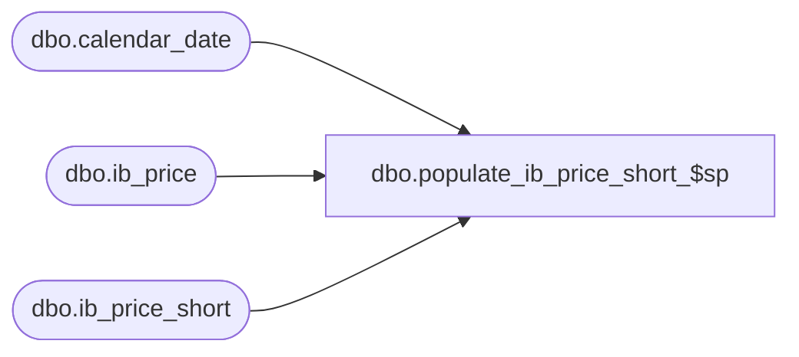

# dbo.populate_ib_price_short_$sp

**Database:** me_01  
**Server:** bedrockdb02  

## Architecture Diagram



## Table Dependencies

| Referenced Table |
|---|
| dbo.calendar_date |
| dbo.ib_price |
| dbo.ib_price_short |

## Stored Procedure Code

```sql
CREATE PROCEDURE [dbo].[populate_ib_price_short_$sp]
AS

/*
	Version		: 1.00
	Created		: 2011/05/11
	Created by	: Pierrette Lemay
	Description	: This procedure populate ib_price_short that is used by the Sales Posting, Imprt_ASN and PLU.

*/

BEGIN
	DECLARE @error_msg NVARCHAR(2000), @line_id int, @end_date SMALLDATETIME, @batch_size INT, @done BIT, @curr_ib_price_id DECIMAL(12,0),
		@default_date SMALLDATETIME;

	SELECT @line_id = 10,
		@done = 0,
		@curr_ib_price_id = 0,
		@end_date = DATEADD("Month", -6,GETDATE()),
		@batch_size = 10000,
		@default_date = MIN(calendar_date)
	FROM calendar_date;
		
	BEGIN TRY
		SET IDENTITY_INSERT ib_price_short ON;
		
		-- Make sure the indexes are removed before starting the 3 following inserts 
		IF EXISTS (SELECT 1 from sys.indexes WHERE name = N'ib_price_short_$ndx1')
				DROP INDEX ib_price_short_$ndx1 ON ib_price_short;
				
		IF EXISTS (SELECT 1 from sys.indexes WHERE name = N'ib_price_short_$ndx2')
				DROP INDEX ib_price_short_$ndx2 ON ib_price_short;
				
		IF EXISTS (SELECT 1 from sys.indexes WHERE name = N'ib_price_short_$ndx3')
				DROP INDEX ib_price_short_$ndx3 ON ib_price_short;
				
		IF EXISTS (SELECT 1 from sys.indexes WHERE name = N'ib_price_short_$ndx4')
				DROP INDEX ib_price_short_$ndx4 ON ib_price_short;	
				
		SET @line_id = 20;
		
		IF NOT object_id(N'tempdb..#temp_ib_price_phase1') IS NULL
			DROP TABLE #temp_ib_price_phase1;
		
		WHILE (@done = 0)
		BEGIN
			-- This is a non log operation
			SELECT TOP(@batch_size) ib_price_id
				, style_id, color_id
				, location_id, jurisdiction_id, pricing_group_id
				, temp_price_flag, start_date, end_date
				, valuation_retail_price, selling_retail_price, price_status_id
				, document_number, cancel_promo_flag, effective_date, price_change_type
			INTO #temp_ib_price_phase1
			FROM ib_price
			WHERE ib_price_id > @curr_ib_price_id
			AND (location_id IS NULL AND pricing_group_id IS NULL)
			AND (temp_price_flag = 0 OR end_date > @end_date) 
			ORDER BY ib_price_id;

			IF (@@ROWCOUNT = 0)
				SET @done = 1;
			ELSE
			BEGIN
				BEGIN TRAN;
				
				INSERT INTO ib_price_short
					( ib_price_id
					, style_id, color_id
					, location_id, jurisdiction_id, pricing_group_id
					, temp_price_flag, start_date, end_date
					, valuation_retail_price, selling_retail_price, price_status_id
					, document_number, cancel_promo_flag, effective_date, price_change_type )
				SELECT ib_price_id, style_id, color_id
					, location_id, jurisdiction_id, pricing_group_id
					, temp_price_flag, start_date, end_date
					, valuation_retail_price, selling_retail_price, price_status_id
					, document_number, cancel_promo_flag, effective_date, price_change_type
				FROM #temp_ib_price_phase1;
				
				COMMIT TRAN;				
				SELECT @curr_ib_price_id = MAX(ib_price_id) FROM #temp_ib_price_phase1;
			END;
			
			DROP TABLE #temp_ib_price_phase1;
		END;
	
		-- Now will do the second phase
		IF NOT object_id(N'tempdb..#temp_ib_price_phase2') IS NULL
			DROP TABLE #temp_ib_price_phase2;
		
		SELECT @line_id = 30, @done = 0, @curr_ib_price_id = 0;
		
		WHILE (@done = 0)
		BEGIN
			-- This is a non log operation
			SELECT TOP(@batch_size) ib_price_id
				, style_id, color_id
				, location_id, jurisdiction_id, pricing_group_id
				, temp_price_flag, start_date, end_date
				, valuation_retail_price, selling_retail_price, price_status_id
				, document_number, cancel_promo_flag, effective_date, price_change_type
			INTO #temp_ib_price_phase2
			FROM ib_price
			WHERE ib_price_id > @curr_ib_price_id
			AND (location_id IS NULL AND pricing_group_id IS NOT NULL)
			AND (temp_price_flag = 0 OR end_date > @end_date)
			ORDER BY ib_price_id;

			IF (@@ROWCOUNT = 0)
				SET @done = 1;
			ELSE
			BEGIN
				BEGIN TRAN;
				
				INSERT INTO ib_price_short
					( ib_price_id
					, style_id, color_id
					, location_id, jurisdiction_id, pricing_group_id
					, temp_price_flag, start_date, end_date
					, valuation_retail_price, selling_retail_price, price_status_id
					, document_number, cancel_promo_flag, effective_date, price_change_type )
				SELECT ib_price_id, style_id, color_id
					, location_id, jurisdiction_id, pricing_group_id
					, temp_price_flag, start_date, end_date
					, valuation_retail_price, selling_retail_price, price_status_id
					, document_number, cancel_promo_flag, effective_date, price_change_type
				FROM #temp_ib_price_phase2;
				
				COMMIT TRAN;
					
				SELECT @curr_ib_price_id = MAX(ib_price_id) FROM #temp_ib_price_phase2;
			END;
			
			DROP TABLE #temp_ib_price_phase2;
		END;
		
		-- Now will do the third phase
		IF NOT object_id(N'tempdb..#temp_ib_price_phase3') IS NULL
			DROP TABLE #temp_ib_price_phase3;
		
		SELECT @line_id = 40, @done = 0, @curr_ib_price_id = 0;
		
		WHILE (@done = 0)
		BEGIN
			-- This is a non log operation
			SELECT TOP(@batch_size) ib_price_id
				, style_id, color_id
				, location_id, jurisdiction_id, pricing_group_id
				, temp_price_flag, start_date, end_date
				, valuation_retail_price, selling_retail_price, price_status_id
				, document_number, cancel_promo_flag, effective_date, price_change_type
			INTO #temp_ib_price_phase3
			FROM ib_price
			WHERE ib_price_id > @curr_ib_price_id
			AND (location_id IS NOT NULL AND pricing_group_id IS NULL)
			AND temp_price_flag = 1 AND end_date > @end_date
			ORDER BY ib_price_id;

			IF (@@ROWCOUNT = 0)
				SET @done = 1;
			ELSE
			BEGIN
				BEGIN TRAN;
				
				INSERT INTO ib_price_short
					( ib_price_id
					, style_id, color_id
					, location_id, jurisdiction_id, pricing_group_id
					, temp_price_flag, start_date, end_date
					, valuation_retail_price, selling_retail_price, price_status_id
					, document_number, cancel_promo_flag, effective_date, price_change_type )
				SELECT ib_price_id, style_id, color_id
					, location_id, jurisdiction_id, pricing_group_id
					, temp_price_flag, start_date, end_date
					, valuation_retail_price, selling_retail_price, price_status_id
					, document_number, cancel_promo_flag, effective_date, price_change_type
				FROM #temp_ib_price_phase3;
				
				COMMIT TRAN;
							
				SELECT @curr_ib_price_id = MAX(ib_price_id) FROM #temp_ib_price_phase3;
			END;
			
			DROP TABLE #temp_ib_price_phase3;
		END;
		
		-- We need the index to be built at this point in order to facilitate the next phase
		SET @line_id = 50
		
		CREATE NONCLUSTERED INDEX ib_price_short_$ndx1 ON ib_price_short (document_number);
		
		CREATE NONCLUSTERED INDEX ib_price_short_$ndx2 ON ib_price_short (location_id, pricing_group_id); 

		CREATE NONCLUSTERED INDEX ib_price_short_$ndx3 ON ib_price_short (location_id, style_id, color_id, pricing_group_id, effective_date, ib_price_id);
		
		CREATE NONCLUSTERED INDEX ib_price_short_$ndx4 ON ib_price_short (style_id, effective_date); 

	
		-- Now will do the last phase
		IF NOT object_id(N'tempdb..#temp_ib_price_phase4') IS NULL
			DROP TABLE #temp_ib_price_phase4;
		
		SELECT @line_id = 60, @done = 0, @curr_ib_price_id = 0;
		
		WHILE (@done = 0)
		BEGIN
			-- This is a non log operation
			SELECT TOP(@batch_size) ib_price_id
				, style_id, color_id
				, location_id, jurisdiction_id, pricing_group_id
				, temp_price_flag, start_date, end_date
				, valuation_retail_price, selling_retail_price, price_status_id
				, document_number, cancel_promo_flag, effective_date, price_change_type
			INTO #temp_ib_price_phase4
			FROM ib_price
			WHERE ib_price_id > @curr_ib_price_id
			AND (location_id IS NOT NULL AND pricing_group_id IS NULL)
			AND temp_price_flag = 0 
			ORDER BY ib_price_id;

			IF (@@ROWCOUNT = 0)
				SET @done = 1;
			ELSE
			BEGIN
				BEGIN TRAN;
				
				INSERT INTO ib_price_short
					( ib_price_id
					, style_id, color_id
					, location_id, jurisdiction_id, pricing_group_id
					, temp_price_flag, start_date, end_date
					, valuation_retail_price, selling_retail_price, price_status_id
					, document_number, cancel_promo_flag, effective_date, price_change_type )
				SELECT DISTINCT t.ib_price_id, t.style_id, t.color_id
					, t.location_id, t.jurisdiction_id, t.pricing_group_id
					, t.temp_price_flag, t.start_date, t.end_date
					, t.valuation_retail_price, t.selling_retail_price, t.price_status_id
					, t.document_number, t.cancel_promo_flag, t.effective_date, t.price_change_type
				FROM #temp_ib_price_phase4 t, ib_price_short i WITH (NOLOCK)
				WHERE t.style_id = i.style_id 
				AND COALESCE(t.color_id, -1) = COALESCE(i.color_id, -1)
			    AND t.jurisdiction_id = i.jurisdiction_id
			    AND t.temp_price_flag = i.temp_price_flag 
			    AND t.start_date = i.start_date 
			    AND COALESCE(t.effective_date, @default_date) = COALESCE(i.effective_date, @default_date)
			    AND COALESCE(t.price_change_type, -1) = COALESCE(i.price_change_type, -1)
			    AND (t.valuation_retail_price <> i.valuation_retail_price 
					OR t.selling_retail_price <> i.selling_retail_price 
					OR t.price_status_id <> i.price_status_id)
			    AND t.ib_price_id > i.ib_price_id;
			    
			    INSERT INTO ib_price_short
					( ib_price_id
					, style_id, color_id
					, location_id, jurisdiction_id, pricing_group_id
					, temp_price_flag, start_date, end_date
					, valuation_retail_price, selling_retail_price, price_status_id
					, document_number, cancel_promo_flag, effective_date, price_change_type )
				SELECT DISTINCT t.ib_price_id, t.style_id, t.color_id
					, t.location_id, t.jurisdiction_id, t.pricing_group_id
					, t.temp_price_flag, t.start_date, t.end_date
					, t.valuation_retail_price, t.selling_retail_price, t.price_status_id
					, t.document_number, t.cancel_promo_flag, t.effective_date, t.price_change_type
				FROM #temp_ib_price_phase4 t
			    WHERE NOT EXISTS (select 1 from ib_price_short s
								where s.style_id = t.style_id
								and (s.color_id = t.color_id OR (s.color_id IS NULL AND t.color_id IS NULL))
								and (s.location_id = t.location_id OR (s.location_id IS NULL AND t.location_id IS NULL))
								and s.start_date = t.start_date
								and s.ib_price_id = t.ib_price_id);
				
				COMMIT TRAN;
					
				SELECT @curr_ib_price_id = MAX(ib_price_id) FROM #temp_ib_price_phase4;
			END;
			
			DROP TABLE #temp_ib_price_phase4;
		END;
		
		SET IDENTITY_INSERT ib_price_short OFF;

	END TRY

	BEGIN CATCH			
		SET @error_msg = N'Error in procedure populate_ib_price_short_$sp, line : ' + CAST(@line_id AS NVARCHAR(3)) + N' SQL Server error is : ' + CAST(ERROR_NUMBER() AS NVARCHAR) + N' ' + ERROR_MESSAGE()
		
		-- Test if the transaction is uncommittable.
		IF (@@TRANCOUNT <> 0)
			ROLLBACK TRANSACTION;
			
		RAISERROR (@error_msg, -- Message text.
               16, -- Severity.
               1) -- State.
	END CATCH
END
```

