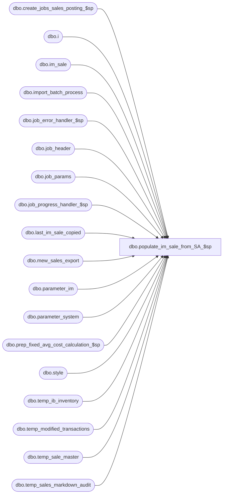

# dbo.populate_im_sale_from_SA_$sp

**Database:** me_01  
**Server:** bedrockdb02  

## Architecture Diagram



## Table Dependencies

| Referenced Table |
|---|
| dbo.create_jobs_sales_posting_$sp |
| dbo.i |
| dbo.im_sale |
| dbo.import_batch_process |
| dbo.job_error_handler_$sp |
| dbo.job_header |
| dbo.job_params |
| dbo.job_progress_handler_$sp |
| dbo.last_im_sale_copied |
| dbo.mew_sales_export |
| dbo.parameter_im |
| dbo.parameter_system |
| dbo.prep_fixed_avg_cost_calculation_$sp |
| dbo.style |
| dbo.temp_ib_inventory |
| dbo.temp_modified_transactions |
| dbo.temp_sale_master |
| dbo.temp_sales_markdown_audit |

## Stored Procedure Code

```sql
CREATE PROCEDURE [dbo].[populate_im_sale_from_SA_$sp]

AS

/*
  Version		: 1.05
  Created		: 2007/04/24
  Created by	: Pierrette Lemay
  Description	: This procedure copy transactions from mew_sales_export to im_sale.
          Create new jobs in the job_header table.
  History		: 1.01 Updated for Multi-Currency project.
          1.02 (April 2010) New table was added in the truncate section: temp_modified_transactions
          this new table is used for processing of transactions that were modified through the SA GUI.
          1.03 (Dec 01, 2010) Modification to support Markup Discount Defect#123090.
          Jan 21, 2011) Modification to support Markup Discount in layaway pick up,  Defect#123090 extra changes
          1.04 May 10, 2011 Use import_batch_process to delete the rows posted in im_sale.
          1.05 July 2011 - Enhancement to post MU discount transactions with opposite sign to MD discount

          2.0 This procedure was created when Merch started to support transactions coming from flat files.
          This code was extracted from the previous version of the procedure create_jobs_sales_posting_$sp to perform only the part
          that populate im_sale from mew_sales_export. The procedure then calls create_jobs_sales_posting_$sp to create jobs in job_header.

          2.1  Call create_jobs_sales_posting_$sp with 2 parameters now: @is_called_from_SA and first selected last_im_sale_copied.im_sale_number.
             Update a new column in last_im_sale_copied.last_identity_no_from_SA

          2.2  Modifications done for fixed average cost. (May 8, 2012)
          2.3 Nov 2012  When post_layaway_as_sale = 1 then Merch needs to ignore layaway pickup (201) and should delete the discounts associated 220 & 221.
                When deleting discounts attached to layaways deposit and cancel don't forget to also delete the markup discounts.
*/

BEGIN
  DECLARE @line_id SMALLINT, @job_type INT, @job_id SMALLINT, @c_true BIT, @c_false BIT, @table_name NVARCHAR(30), @debug_flag BIT,
    @operation_name NVARCHAR(30), @error_msg NVARCHAR(2000), @post_layaway_as_sale BIT, @proc_name NVARCHAR(30), @sql_err_num DECIMAL(38,0),
    @max_identity_no DECIMAL(22,0), @last_im_sale_copied DECIMAL(24,0), @from_identity_no DECIMAL(22,0), @to_identity_no DECIMAL(22,0),
    @max_im_sale_number DECIMAL(24,0), @is_new_transaction BIT, @done BIT, @range_batch_size INT, @is_called_from_SA BIT,
    @c_avg_cost_by_location TINYINT, @c_avg_cost_by_chain TINYINT, @avg_cost_level TINYINT, @ib_average_cost_type NCHAR(1), @c_avg_cost_by_jurisdiction TINYINT,
    @rows_inserted DECIMAL(24,0);

  SELECT   @job_type			  = 1
      , @job_id			  = -1
      , @proc_name		  = N'populate_im_sale_from_SA_$sp'
      , @c_false			  = 0
      , @c_true			  = 1
      , @done				  = 0
      , @is_new_transaction = 0
      , @is_called_from_SA  = 1
      , @post_layaway_as_sale = post_layaway_as_sale
      , @rows_inserted = 0
  FROM parameter_im;

  SELECT @c_avg_cost_by_location = 1,
    @c_avg_cost_by_chain = 2,
    @c_avg_cost_by_jurisdiction = 3,
    @avg_cost_level = ib_average_cost_location_level,
    @ib_average_cost_type = ib_average_cost_type
  FROM parameter_system;

  BEGIN TRY
    -- Get posting parameters
    SET @line_id = 10;

    SELECT  @range_batch_size = range_batch_size,
      @debug_flag = debug_flag
    FROM job_params
    WHERE job_type = @job_type;

    -- Log progress if job_params.debug_flag is true OR job_header.debug_flag is true
    EXEC job_progress_handler_$sp @job_type, @job_id, @proc_name, @line_id, @debug_flag;

    SET @line_id = 20
    -- Get the boundaries for the new transactions that will be copied to im_sale
    SELECT @max_identity_no = MAX(identity_no) FROM mew_sales_export;

    -- Log progress if job_params.debug_flag is true OR job_header.debug_flag is true
    EXEC job_progress_handler_$sp @job_type, @job_id, @proc_name, @line_id, @debug_flag;

    SET @line_id = 30;

    SELECT @last_im_sale_copied = im_sale_number,
        @from_identity_no = (im_sale_number + 1),
          @to_identity_no   = (im_sale_number + 1 + @range_batch_size)
    FROM last_im_sale_copied;

    -- Log progress if job_params.debug_flag is true OR job_header.debug_flag is true
    EXEC job_progress_handler_$sp @job_type, @job_id, @proc_name, @line_id, @debug_flag;

    -- If there is new transactions, copy them to im_sale
    IF ( (@last_im_sale_copied) < @max_identity_no)
    BEGIN
      SET @line_id = 40

      -- drop all indexes on the im_sale before inserting data to improve speed
      IF EXISTS (SELECT name FROM sys.indexes WHERE name = N'im_sale_$ndx1')
        DROP INDEX im_sale_$ndx1 ON dbo.im_sale

      IF EXISTS (SELECT name FROM sys.indexes WHERE name = N'im_sale_$ndx2')
        DROP INDEX im_sale_$ndx2 ON dbo.im_sale

      IF EXISTS (SELECT name FROM sys.indexes WHERE name = N'im_sale_$ndx3')
        DROP INDEX im_sale_$ndx3 ON dbo.im_sale

      IF EXISTS (SELECT name FROM sys.indexes WHERE name = N'im_sale_$ndx4')
        DROP INDEX im_sale_$ndx4 ON dbo.im_sale

      -- Log progress if job_params.debug_flag is true OR job_header.debug_flag is true
      EXEC job_progress_handler_$sp @job_type, @job_id, @proc_name, @line_id, @debug_flag;

      -- Copy new transactions to im_sale
      SET @line_id = 50

      WHILE (@done = @c_false)
      BEGIN
         -- When @post_layaway_as_sale = 1 then Merch needs to receive
                -- layaway deposit transactions (620) as Sale transactions (600)
                -- layaway cancel transactions (621) as Customer Return (610)
        -- When post_layaway_as_sale = 0 Merch will receive the actual layaway deposit (620),
        -- layaway cancel (621) and layaway pickup (622).

        BEGIN TRAN

          INSERT INTO im_sale
            ( im_sale_number
            , entry_no
            , transaction_line
            , transaction_date
            , transaction_no
            , location_id
            , register
            , reference_no
            , aw_transaction_type
            , style_id
            , sku_id
            , upc_number
            , price_override
            , aw_reason_code
            , units
            , sold_at_price
            , pos_discount_type_code
            , pos_discount_amount
            , tax_amount
            , originating_location_id
            , credit_originating_store )
          SELECT  identity_no
            , if_entry_no
            , transaction_line_id
            , transaction_date
            , transaction_no
            , location_id
            , register_no
            , reference_no
            , CASE WHEN (@post_layaway_as_sale = 1 AND mew_sales_export.transaction_type = 620)
                  THEN 600 * (1 - abs(sign(620 - mew_sales_export.transaction_type)))
                WHEN (@post_layaway_as_sale = 1 AND mew_sales_export.transaction_type = 621)
                  THEN 610 * (1 - abs(sign(621 - mew_sales_export.transaction_type)))
                WHEN (@post_layaway_as_sale = 1 AND mew_sales_export.transaction_type = 120)
                  THEN 601 * (1 - abs(sign(120 - mew_sales_export.transaction_type)))	+ mew_sales_export.markup_flag * (1 - abs(sign(120 - mew_sales_export.transaction_type))) -- make 601 discount transacitons 602 when markup flag is 1
                    WHEN (@post_layaway_as_sale = 1 AND mew_sales_export.transaction_type = 121)
                  THEN 601 * (1 - abs(sign(121 - mew_sales_export.transaction_type))) + mew_sales_export.markup_flag * (1 - abs(sign(121 - mew_sales_export.transaction_type)))-- make 601 discount transacitons 602 when markup flag is 1
                    ELSE mew_sales_export.transaction_type + mew_sales_export.markup_flag END transaction_type  -- make 601 discount transacitons 602 when markup flag is 1
            , style_id
            , sku_id
            , upc_no
            , price_override_flag
            , reason_code
            , units
            , sold_at_price
            , pos_disc_type_code
            , CASE WHEN (@post_layaway_as_sale = 1 AND mew_sales_export.transaction_type = 121)
                  THEN (-1 * mew_sales_export.pos_disc_type_amt)
                 ELSE mew_sales_export.pos_disc_type_amt END pos_disc_type_amt
            , tax_amount
            , originating_location_id
            , credit_originating_store
          FROM mew_sales_export
          WHERE identity_no BETWEEN @from_identity_no AND @to_identity_no

          SET @rows_inserted = @rows_inserted + @@ROWCOUNT


        --need to update last_im_sale_copied before deleting transactions
        SELECT @max_im_sale_number = MAX(im_sale_number) FROM im_sale

        IF @max_im_sale_number IS NOT NULL
        BEGIN
          -- im_sale and last_im_sale_copied should be in sync.
          UPDATE last_im_sale_copied
          SET im_sale_number = @max_im_sale_number,
              last_identity_no_from_SA = @max_im_sale_number;

        END

        IF (@post_layaway_as_sale = 0)
        BEGIN
          -- When post_layaway_as_sale = 0 Merch will receive the actual layaway deposit (620) and
          -- layaway cancel (621) and we need to move the inventory from available to unavailable and vice versa.
          -- However for pseudo style we don't have a price in ib_price_short so we need to move this inventory
          -- at the price = sold_at_price + pos_disc_type_amt (we should do it before deleting the discounts
          -- associated to layaway deposit and cancel.

          IF NOT object_id(N'tempdb..#pseudo_style') IS NULL
            DROP TABLE #pseudo_style

          SELECT DISTINCT i.style_id
          INTO #pseudo_style
          FROM im_sale i, style s
          WHERE i.style_id = s.style_id
          AND s.style_type = 2

          UPDATE i
          SET i.sold_at_price = i.sold_at_price + T.pos_discount_amount
          FROM im_sale i, #pseudo_style m,
                ( SELECT w.transaction_no, w.transaction_line, w.transaction_date, w.aw_transaction_type,
                     w.location_id, w.sku_id, w.sold_at_price, SUM(w.pos_discount_amount) pos_discount_amount
                FROM im_sale w, #pseudo_style p
                WHERE w.aw_transaction_type IN (120, 121, 122)
                AND w.style_id = p.style_id
                GROUP BY w.transaction_no, w.transaction_line, w.transaction_date, w.aw_transaction_type,
                     w.location_id, w.sku_id, w.sold_at_price) T
          WHERE i.style_id = m.style_id
          AND i.aw_transaction_type IN (620, 621)
          AND i.transaction_no = T.transaction_no
          AND i.transaction_line = T.transaction_line
          AND i.transaction_date = T.transaction_date
          AND i.location_id = T.location_id
          AND i.sku_id = T.sku_id
          AND i.sold_at_price = T.sold_at_price;

          DELETE im_sale WHERE aw_transaction_type IN (120, 121, 122)

          DROP TABLE #pseudo_style
        END
        ELSE
          -- When post_layaway_as_sale = 1 then Merch needs to ignore layaway pickup (201)
          DELETE im_sale WHERE aw_transaction_type IN (622, 220, 221)

        --select again to check if there are transactions left after the delete
        SELECT @max_im_sale_number = MAX(im_sale_number) FROM im_sale

        IF @max_im_sale_number IS NOT NULL
          SET @is_new_transaction = @c_true


        COMMIT TRAN

        IF (@to_identity_no > @max_identity_no)
          SET @done = @c_true

        SELECT	@from_identity_no = @to_identity_no + 1,
            @to_identity_no   = @to_identity_no + @range_batch_size
      END

      -- Log progress if job_params.debug_flag is true OR job_header.debug_flag is true
      EXEC job_progress_handler_$sp @job_type, @job_id, @proc_name, @line_id, @debug_flag;

      -- Re-build the index
      SET @line_id = 60

      CREATE UNIQUE CLUSTERED INDEX im_sale_$ndx1 ON dbo.im_sale
        (transaction_date, location_id, style_id, im_sale_number)

      CREATE INDEX im_sale_$ndx2 ON dbo.im_sale
        (transaction_no, transaction_line, location_id, sku_id)

      CREATE INDEX im_sale_$ndx3 ON dbo.im_sale
        (im_sale_number, location_id, sku_id, transaction_date)

      CREATE INDEX im_sale_$ndx4 ON dbo.im_sale
        (location_id, im_sale_number, aw_transaction_type)

      UPDATE STATISTICS im_sale

      -- Log progress if job_params.debug_flag is true
      EXEC job_progress_handler_$sp @job_type, @job_id, @proc_name, @line_id, @debug_flag;
    END

    SET @line_id = 70;
    SET @last_im_sale_copied = @max_im_sale_number - @rows_inserted -- Added For TFS Bug ID 136059
    -- Do the preparation work for the
    IF (@is_new_transaction = @c_true)
      EXEC create_jobs_sales_posting_$sp @is_called_from_SA, @last_im_sale_copied;

    -- Log progress if job_params.debug_flag is true OR job_header.debug_flag is true
    EXEC job_progress_handler_$sp @job_type, @job_id, @proc_name, @line_id, @debug_flag;

    SET @line_id = 80
    IF (@ib_average_cost_type = N'F' AND @avg_cost_level <> @c_avg_cost_by_location)
      EXEC prep_fixed_avg_cost_calculation_$sp @debug_flag;

    -- Log progress if job_params.debug_flag is true OR job_header.debug_flag is true
    EXEC job_progress_handler_$sp @job_type, @job_id, @proc_name, @line_id, @debug_flag;

    SET @line_id = 90
    -- Do the preparation work for the
    TRUNCATE TABLE temp_sale_master;
    TRUNCATE TABLE temp_ib_inventory;
    TRUNCATE TABLE temp_sales_markdown_audit;
    TRUNCATE TABLE temp_modified_transactions;

    -- Log progress if job_params.debug_flag is true OR job_header.debug_flag is true
    EXEC job_progress_handler_$sp @job_type, @job_id, @proc_name, @line_id, @debug_flag;

    SET @line_id = 100
    -- We need to keep track of the jobs part of this posting process
    -- Start by deleting the previous process
    BEGIN TRAN

    DELETE import_batch_process WHERE job_type = 1;

    INSERT INTO import_batch_process
      (job_type, process_date, job_id)
    SELECT 1, GETDATE(), job_id
    FROM job_header
    WHERE job_type = 1
    AND completed_flag = 0;

    COMMIT TRAN;

    -- Log progress if job_params.debug_flag is true OR job_header.debug_flag is true
    EXEC job_progress_handler_$sp @job_type, @job_id, @proc_name, @line_id, @debug_flag;

  END TRY

  BEGIN CATCH
    -- Test if the transaction is uncommittable.
    IF (XACT_STATE()) = -1
      ROLLBACK TRANSACTION

    -- Test if the transaction is active and valid.
    IF (XACT_STATE()) = 1
      COMMIT TRANSACTION

    IF @line_id = 10
      SELECT  @table_name			= N'job_params'
          , @operation_name	= N'SELECT'
          , @error_msg		= ERROR_MESSAGE()
          , @sql_err_num		= ERROR_NUMBER()
    IF @line_id = 20
      SELECT  @table_name			= N'mew_sales_export'
          , @operation_name	= N'SELECT'
          , @error_msg		= ERROR_MESSAGE()
          , @sql_err_num		= ERROR_NUMBER()
    ELSE IF @line_id = 30
      SELECT  @table_name			= N'last_im_sale_copied'
          , @operation_name	= N'SELECT'
          , @sql_err_num		= ERROR_NUMBER()
          , @error_msg		= ERROR_MESSAGE()
    ELSE IF @line_id = 40
      SELECT  @table_name			= N'im_sale'
          , @operation_name	= N'DROP INDEX'
          , @error_msg		= ERROR_MESSAGE()
          , @sql_err_num		= ERROR_NUMBER()
    ELSE IF @line_id = 50
      SELECT  @table_name			= N'im_sale'
          , @operation_name	= N'INSERT'
          , @sql_err_num		= ERROR_NUMBER()
          , @error_msg		= ERROR_MESSAGE()
    ELSE IF @line_id = 60
      SELECT  @table_name			= N'im_sale'
          , @operation_name	= N'CREATE INDEX'
          , @sql_err_num		= ERROR_NUMBER()
          , @error_msg		= ERROR_MESSAGE()
    ELSE IF @line_id = 70
      SELECT  @table_name			= N'create_jobs_sales_posting_$sp'
          , @operation_name	= N'EXECUTE'
          , @sql_err_num		= ERROR_NUMBER()
          , @error_msg		= ERROR_MESSAGE()
    ELSE IF @line_id = 80
      SELECT  @table_name			= N'prep_fixed_avg_cost_calculation_$sp'
          , @operation_name	= N'EXECUTE'
          , @sql_err_num		= ERROR_NUMBER()
          , @error_msg		= ERROR_MESSAGE()
    ELSE IF @line_id = 90
      SELECT  @table_name			= N'ptemp_sale_master'
          , @operation_name	= N'TRUNCATE TABLE'
          , @sql_err_num		= ERROR_NUMBER()
          , @error_msg		= ERROR_MESSAGE()
    ELSE IF @line_id = 100
      SELECT  @table_name			= N'import_batch_process'
          , @operation_name	= N'INSERT'
          , @sql_err_num		= ERROR_NUMBER()
          , @error_msg		= ERROR_MESSAGE()

    EXEC job_error_handler_$sp
          @job_type
          , @job_id
          , @proc_name
          , @line_id
          , @sql_err_num
          , @table_name
          , @operation_name
          , @error_msg
          , @c_true
  END CATCH
END
```

