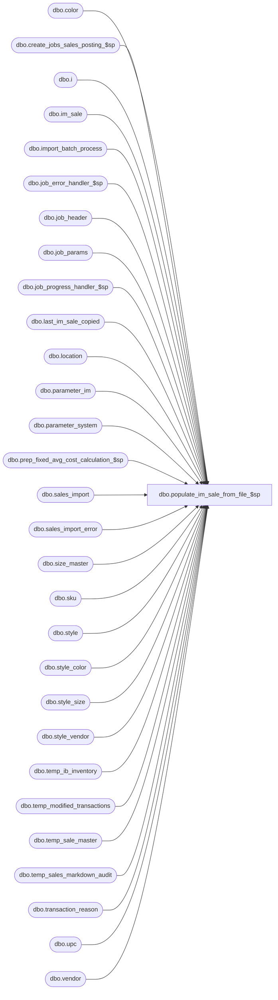

# dbo.populate_im_sale_from_file_$sp

**Database:** me_01  
**Server:** bedrockdb02  

## Architecture Diagram



## Table Dependencies

| Referenced Table |
|---|
| dbo.color |
| dbo.create_jobs_sales_posting_$sp |
| dbo.i |
| dbo.im_sale |
| dbo.import_batch_process |
| dbo.job_error_handler_$sp |
| dbo.job_header |
| dbo.job_params |
| dbo.job_progress_handler_$sp |
| dbo.last_im_sale_copied |
| dbo.location |
| dbo.parameter_im |
| dbo.parameter_system |
| dbo.prep_fixed_avg_cost_calculation_$sp |
| dbo.sales_import |
| dbo.sales_import_error |
| dbo.size_master |
| dbo.sku |
| dbo.style |
| dbo.style_color |
| dbo.style_size |
| dbo.style_vendor |
| dbo.temp_ib_inventory |
| dbo.temp_modified_transactions |
| dbo.temp_sale_master |
| dbo.temp_sales_markdown_audit |
| dbo.transaction_reason |
| dbo.upc |
| dbo.vendor |

## Stored Procedure Code

```sql
CREATE PROCEDURE [dbo].[populate_im_sale_from_file_$sp]

AS

/*
  Version		: 1.00
  Created		: 2011/08/18
  Created by	: Pierrette Lemay
  Description	: This procedure is part of the sales posting process and is used when importing sales transactions from a flat file.
          This implies the client doesn't have Sales Audit to feed the transactions through mew_sales_export.
          The procedure does :
          1- validations of the import files and moves the transaction to sales_import_error when at least one row part of a specific transaction is invalid.
          2- populate im_sale with the valid transactions
          3- Calls create_jobs_sales_posting_$sp to create jobs for the newly inserted transactions.
  History		: 1.01 Remove Primary size label & Secondary size label; replace these 2 fields by size_code in the import table.
          2.0  Call create_jobs_sales_posting_$sp with 2 parameters now: @is_called_from_SA and first selected last_im_sale_copied.im_sale_number.
          2.1 Change the validation of reference_no to add a new item in the where clause:  (reference_no IS NULL OR len(reference_no) <= 1)
          2.2 Add validation for transaction reason and pos_discount_amount
          2.3  Modifications done for fixed average cost. (May 8, 2012)
          2.4 Nov 2012  When post_layaway_as_sale = 1 then Merch needs to ignore layaway pickup (201) and should delete the discounts associated 220 & 221.
                When deleting discounts attached to layaways deposit and cancel don't forget to also delete the markup discounts.
          2.5  Check for discount transactions with no correspond sale/return tran. Bug 35669
    1/16/2015		Ivan Dimtirov	153823 - EWM: Merch: Sales Import: records ignored if other following records reject

*/

BEGIN
  DECLARE @line_id SMALLINT, @job_type INT, @job_id SMALLINT, @c_true BIT, @c_false BIT, @validation_batch_size INT,
      @min_imp_identity_no DECIMAL(24,0), @max_imp_identity_no DECIMAL(24,0), @curr_start_identity_no DECIMAL(24,0),
      @curr_end_identity_no DECIMAL(24,0), @crs_ranges_flag BIT, @from_identity_no DECIMAL(24,0), @to_identity_no DECIMAL(24,0),
      @table_name	NVARCHAR(30), @operation_name NVARCHAR(30), @error_msg NVARCHAR(2000), @post_layaway_as_sale BIT,
      @proc_name NVARCHAR(30), @sql_err_num DECIMAL(38,0), @max_identity_no DECIMAL(22,0), @last_im_sale_copied DECIMAL(24,0),
      @is_called_from_SA BIT, @max_im_sale_number DECIMAL(24,0), @is_new_transaction BIT, @done BIT, @range_batch_size INT,
      @debug_flag BIT, @c_avg_cost_by_location TINYINT, @c_avg_cost_by_chain TINYINT, @avg_cost_level TINYINT,
      @ib_average_cost_type NCHAR(1), @c_avg_cost_by_jurisdiction TINYINT, @rows_inserted DECIMAL(24,0);

  SELECT   @job_type			  = 1
      , @job_id			  = -1
      , @proc_name		  = N'populate_im_sale_from_file_$sp'
      , @c_false			  = 0
      , @c_true			  = 1
      , @validation_batch_size = 50000
      , @done				  = 0
      , @is_new_transaction = 0
      , @line_id			  = 10
      , @crs_ranges_flag	  = 0
      , @is_called_from_SA  = 0
      , @post_layaway_as_sale = post_layaway_as_sale
      , @rows_inserted = 0
  FROM parameter_im;

  SELECT @c_avg_cost_by_location = 1,
    @c_avg_cost_by_chain = 2,
    @c_avg_cost_by_jurisdiction = 3,
    @avg_cost_level = ib_average_cost_location_level,
    @ib_average_cost_type = ib_average_cost_type
  FROM parameter_system;

  IF NOT object_id(N'tempdb..#validation_ranges') IS NULL
    DROP TABLE #validation_ranges;

  CREATE TABLE #validation_ranges(
    from_identity_no DECIMAL(24,0) NOT NULL,
    to_identity_no	 DECIMAL(24,0) NOT NULL);

  BEGIN TRY
    -- Get posting parameters
    SELECT  @range_batch_size = range_batch_size,
      @debug_flag = debug_flag
    FROM job_params
    WHERE job_type = @job_type;

    -- Log progress if job_params.debug_flag is true OR job_header.debug_flag is true
    EXEC job_progress_handler_$sp @job_type, @job_id, @proc_name, @line_id, @debug_flag;

    SET @line_id = 20;
    -- Before starting to read sales_import, rebuild the index on it
    IF NOT EXISTS (SELECT 1 from sys.indexes WHERE name = N'sales_import_$ndx1')
      CREATE UNIQUE CLUSTERED INDEX sales_import_$ndx1 ON sales_import (identity_no);

    -- Log progress if job_params.debug_flag is true OR job_header.debug_flag is true
    EXEC job_progress_handler_$sp @job_type, @job_id, @proc_name, @line_id, @debug_flag;

    -- *********************************** VALIDATION SECTION ****************************************

    SET @line_id = 30;
    -- Populate #validation_ranges that will help to do validation by range of 100000 transactions

    SELECT @min_imp_identity_no = MIN(identity_no), @curr_start_identity_no = MIN(identity_no),
      @curr_end_identity_no = MIN(identity_no), @max_imp_identity_no = MAX(identity_no)
    FROM sales_import;

    WHILE (@curr_end_identity_no <= @max_imp_identity_no)
    BEGIN
      SET @curr_end_identity_no = @curr_start_identity_no + @validation_batch_size - 1;

      INSERT INTO #validation_ranges VALUES (@curr_start_identity_no, @curr_end_identity_no);

      SET @curr_start_identity_no = @curr_end_identity_no + 1;
    END

    -- Log progress if job_params.debug_flag is true OR job_header.debug_flag is true
    EXEC job_progress_handler_$sp @job_type, @job_id, @proc_name, @line_id, @debug_flag;

    SET @line_id = 40;
    -- Now that #validation_ranges is populated then create a cursor on the content;

    DECLARE crs_ranges CURSOR FOR
    SELECT from_identity_no, to_identity_no
    FROM #validation_ranges
    ORDER BY from_identity_no;

    OPEN crs_ranges;
    SET @crs_ranges_flag = 1;

    FETCH NEXT FROM crs_ranges INTO @from_identity_no, @to_identity_no;

    WHILE @@FETCH_STATUS = 0
    BEGIN
      BEGIN TRAN;

      -- Validation on location_code (error_id = 2)
      INSERT INTO sales_import_error
         ( error_id, identity_no, transaction_no, transaction_line, transaction_date, location_code, register
         , reference_no, transaction_type_code, upc_number, vendor_code, vendor_style, style_code, color_code
         , size_code, is_price_override, units, sold_at_price, pos_discount_type_code
         , pos_discount_amount, originating_location_code, credit_originating_store, is_markup)
      SELECT 2, identity_no, transaction_no, transaction_line, transaction_date, location_code, register
        , reference_no, transaction_type_code, upc_number, vendor_code, vendor_style, style_code, color_code
        , size_code, is_price_override, units, sold_at_price, pos_discount_type_code
        , pos_discount_amount, originating_location_code, credit_originating_store, is_markup
      FROM sales_import i
      WHERE identity_no BETWEEN @from_identity_no AND @to_identity_no
      AND NOT EXISTS (SELECT 1 FROM location l WHERE l.location_code = i.location_code);

      -- Validation on transaction type code (error_id = 3)
      INSERT INTO sales_import_error
         ( error_id, identity_no, transaction_no, transaction_line, transaction_date, location_code, register
         , reference_no, transaction_type_code, upc_number, vendor_code, vendor_style, style_code, color_code
         , size_code, is_price_override, units, sold_at_price, pos_discount_type_code
         , pos_discount_amount, originating_location_code, credit_originating_store, is_markup)
      SELECT 3, identity_no, transaction_no, transaction_line, transaction_date, location_code, register
        , reference_no, transaction_type_code, upc_number, vendor_code, vendor_style, style_code, color_code
        , size_code, is_price_override, units, sold_at_price, pos_discount_type_code
        , pos_discount_amount, originating_location_code, credit_originating_store, is_markup
      FROM sales_import i
      WHERE identity_no BETWEEN @from_identity_no AND @to_identity_no
      AND transaction_type_code NOT IN (120, 121, 220, 600, 601, 603, 605, 610, 615, 620, 621, 622);

      -- Validation on UPC (error_id = 4)
      INSERT INTO sales_import_error
         ( error_id, identity_no, transaction_no, transaction_line, transaction_date, location_code, register
         , reference_no, transaction_type_code, upc_number, vendor_code, vendor_style, style_code, color_code
         , size_code, is_price_override, units, sold_at_price, pos_discount_type_code
         , pos_discount_amount, originating_location_code, credit_originating_store, is_markup)
      SELECT 4, identity_no, transaction_no, transaction_line, transaction_date, location_code, register
        , reference_no, transaction_type_code, upc_number, vendor_code, vendor_style, style_code, color_code
        , size_code, is_price_override, units, sold_at_price, pos_discount_type_code
        , pos_discount_amount, originating_location_code, credit_originating_store, is_markup
      FROM sales_import i
      WHERE i.identity_no BETWEEN @from_identity_no AND @to_identity_no
      AND len(i.upc_number) > 1
      AND NOT EXISTS (SELECT 1 FROM upc WHERE upc.upc_number = i.upc_number);

      -- Validation on vendor style (error_id = 5)
      INSERT INTO sales_import_error
         ( error_id, identity_no, transaction_no, transaction_line, transaction_date, location_code, register
         , reference_no, transaction_type_code, upc_number, vendor_code, vendor_style, style_code, color_code
         , size_code, is_price_override, units, sold_at_price, pos_discount_type_code
         , pos_discount_amount, originating_location_code, credit_originating_store, is_markup)
      SELECT 5, identity_no, transaction_no, transaction_line, transaction_date, location_code, register
        , reference_no, transaction_type_code, upc_number, vendor_code, vendor_style, style_code, color_code
        , size_code, is_price_override, units, sold_at_price, pos_discount_type_code
        , pos_discount_amount, originating_location_code, credit_originating_store, is_markup
      FROM sales_import i
      WHERE i.identity_no BETWEEN @from_identity_no AND @to_identity_no
      AND LEN(i.vendor_style) > 1
      AND LEN(i.vendor_code) > 1
      AND NOT EXISTS (SELECT 1 FROM style_vendor s, vendor v
              WHERE s.vendor_style = i.vendor_style
              AND s.vendor_id = v.vendor_id
              AND v.vendor_code = i.vendor_code);

      -- Validation on style code (error_id = 6)
      INSERT INTO sales_import_error
         ( error_id, identity_no, transaction_no, transaction_line, transaction_date, location_code, register
         , reference_no, transaction_type_code, upc_number, vendor_code, vendor_style, style_code, color_code
         , size_code, is_price_override, units, sold_at_price, pos_discount_type_code
         , pos_discount_amount, originating_location_code, credit_originating_store, is_markup)
      SELECT 6, identity_no, transaction_no, transaction_line, transaction_date, location_code, register
        , reference_no, transaction_type_code, upc_number, vendor_code, vendor_style, style_code, color_code
        , size_code, is_price_override, units, sold_at_price, pos_discount_type_code
        , pos_discount_amount, originating_location_code, credit_originating_store, is_markup
      FROM sales_import i
      WHERE i.identity_no BETWEEN @from_identity_no AND @to_identity_no
      AND LEN(i.style_code) > 1
      AND NOT EXISTS (SELECT 1 FROM style s WHERE s.style_code = i.style_code);

      -- UPC or vendor style & vendor_code or style_code must be provided (error_id = 7)
      INSERT INTO sales_import_error
         ( error_id, identity_no, transaction_no, transaction_line, transaction_date, location_code, register
         , reference_no, transaction_type_code, upc_number, vendor_code, vendor_style, style_code, color_code
         , size_code, is_price_override, units, sold_at_price, pos_discount_type_code
         , pos_discount_amount, originating_location_code, credit_originating_store, is_markup)
      SELECT 7, identity_no, transaction_no, transaction_line, transaction_date, location_code, register
        , reference_no, transaction_type_code, upc_number, vendor_code, vendor_style, style_code, color_code
        , size_code, is_price_override, units, sold_at_price, pos_discount_type_code
        , pos_discount_amount, originating_location_code, credit_originating_store, is_markup
      FROM sales_import
      WHERE identity_no BETWEEN @from_identity_no AND @to_identity_no
      AND LEN(upc_number) <= 1
      AND (LEN(vendor_style) <= 1 OR LEN(vendor_code) <= 1)
      AND LEN(style_code) <= 1;

      -- pos_discount_amount missing for a discount transaction (error_id = 10)
      INSERT INTO sales_import_error
         ( error_id, identity_no, transaction_no, transaction_line, transaction_date, location_code, register
         , reference_no, transaction_type_code, upc_number, vendor_code, vendor_style, style_code, color_code
         , size_code, is_price_override, units, sold_at_price, pos_discount_type_code
         , pos_discount_amount, originating_location_code, credit_originating_store, is_markup)
      SELECT 10, identity_no, transaction_no, transaction_line, transaction_date, location_code, register
        , reference_no, transaction_type_code, upc_number, vendor_code, vendor_style, style_code, color_code
        , size_code, is_price_override, units, sold_at_price, pos_discount_type_code
        , pos_discount_amount, originating_location_code, credit_originating_store, is_markup
      FROM sales_import i
      WHERE i.identity_no BETWEEN @from_identity_no AND @to_identity_no
      AND i.transaction_type_code IN (601, 603)
      AND	i.pos_discount_amount = 0;

      -- transaction reason (pos_discount_type_code) missing for a discount transaction (error_id = 11)
      INSERT INTO sales_import_error
         ( error_id, identity_no, transaction_no, transaction_line, transaction_date, location_code, register
         , reference_no, transaction_type_code, upc_number, vendor_code, vendor_style, style_code, color_code
         , size_code, is_price_override, units, sold_at_price, pos_discount_type_code
         , pos_discount_amount, originating_location_code, credit_originating_store, is_markup)
      SELECT 11, identity_no, transaction_no, transaction_line, transaction_date, location_code, register
        , reference_no, transaction_type_code, upc_number, vendor_code, vendor_style, style_code, color_code
        , size_code, is_price_override, units, sold_at_price, pos_discount_type_code
        , pos_discount_amount, originating_location_code, credit_originating_store, is_markup
      FROM sales_import i
      WHERE i.identity_no BETWEEN @from_identity_no AND @to_identity_no
      AND transaction_type_code IN (601, 603)
      AND	i.pos_discount_type_code = 0;

      INSERT INTO sales_import_error
         ( error_id, identity_no, transaction_no, transaction_line, transaction_date, location_code, register
         , reference_no, transaction_type_code, upc_number, vendor_code, vendor_style, style_code, color_code
         , size_code, is_price_override, units, sold_at_price, pos_discount_type_code
         , pos_discount_amount, originating_location_code, credit_originating_store, is_markup)
      SELECT 11, identity_no, transaction_no, transaction_line, transaction_date, location_code, register
        , reference_no, transaction_type_code, upc_number, vendor_code, vendor_style, style_code, color_code
        , size_code, is_price_override, units, sold_at_price, pos_discount_type_code
        , pos_discount_amount, originating_location_code, credit_originating_store, is_markup
      FROM sales_import i
      WHERE transaction_type_code IN (601, 603)
      AND	i.pos_discount_type_code <> 0
      AND NOT EXISTS (SELECT 1 FROM transaction_reason tr
              WHERE tr.transaction_reason_code = CONVERT(NVARCHAR(5), i.pos_discount_type_code));

      -- 12 Missing information for ES transaction (reference_no should be provide in this case)
      INSERT INTO sales_import_error
         ( error_id, identity_no, transaction_no, transaction_line, transaction_date, location_code, register
         , reference_no, transaction_type_code, upc_number, vendor_code, vendor_style, style_code, color_code
         , size_code, is_price_override, units, sold_at_price, pos_discount_type_code
         , pos_discount_amount, originating_location_code, credit_originating_store, is_markup)
      SELECT 12, identity_no, transaction_no, transaction_line, transaction_date, location_code, register
        , reference_no, transaction_type_code, upc_number, vendor_code, vendor_style, style_code, color_code
        , size_code, is_price_override, units, sold_at_price, pos_discount_type_code
        , pos_discount_amount, originating_location_code, credit_originating_store, is_markup
      FROM sales_import i
      WHERE i.identity_no BETWEEN @from_identity_no AND @to_identity_no
      AND transaction_type_code IN (605, 603, 615)
      AND (reference_no IS NULL OR len(reference_no) <= 1);

      -- 14 Missing information for ES transaction : credit originating store is ON and field originating_location_code is empty
      INSERT INTO sales_import_error
         ( error_id, identity_no, transaction_no, transaction_line, transaction_date, location_code, register
         , reference_no, transaction_type_code, upc_number, vendor_code, vendor_style, style_code, color_code
         , size_code, is_price_override, units, sold_at_price, pos_discount_type_code
         , pos_discount_amount, originating_location_code, credit_originating_store, is_markup)
      SELECT 14, identity_no, transaction_no, transaction_line, transaction_date, location_code, register
        , reference_no, transaction_type_code, upc_number, vendor_code, vendor_style, style_code, color_code
        , size_code, is_price_override, units, sold_at_price, pos_discount_type_code
        , pos_discount_amount, originating_location_code, credit_originating_store, is_markup
      FROM sales_import i
      WHERE i.identity_no BETWEEN @from_identity_no AND @to_identity_no
      AND transaction_type_code IN (605, 603, 615)
      AND credit_originating_store = 1
      AND (originating_location_code IS NULL OR len(originating_location_code) <= 1);

      INSERT INTO sales_import_error
         ( error_id, identity_no, transaction_no, transaction_line, transaction_date, location_code, register
         , reference_no, transaction_type_code, upc_number, vendor_code, vendor_style, style_code, color_code
         , size_code, is_price_override, units, sold_at_price, pos_discount_type_code
         , pos_discount_amount, originating_location_code, credit_originating_store, is_markup)
      SELECT 14, identity_no, transaction_no, transaction_line, transaction_date, location_code, register
        , reference_no, transaction_type_code, upc_number, vendor_code, vendor_style, style_code, color_code
        , size_code, is_price_override, units, sold_at_price, pos_discount_type_code
        , pos_discount_amount, originating_location_code, credit_originating_store, is_markup
      FROM sales_import i
      WHERE i.identity_no BETWEEN @from_identity_no AND @to_identity_no
      AND transaction_type_code IN (605, 603, 615)
      AND credit_originating_store = 1
      AND LEN(originating_location_code) > 0
      AND NOT EXISTS (SELECT 1 FROM location l
              WHERE l.location_code = i.originating_location_code);

      -- now update style_id based on upc OR vendor_style OR style_code in the import table; this will help populating im_sale later ...
      UPDATE i
      SET i.style_id = sku.style_id,
        i.sku_id = sku.sku_id -- sku_id could be updated now when UPC provided
      FROM sales_import i, upc, sku
      WHERE i.identity_no BETWEEN @from_identity_no AND @to_identity_no
      AND len(i.upc_number) > 1
      AND i.upc_number = upc.upc_number
      AND upc.sku_id = sku.sku_id;

      UPDATE i
      SET i.style_id = sv.style_id
      FROM sales_import i, style_vendor sv, vendor v
      WHERE i.identity_no BETWEEN @from_identity_no AND @to_identity_no
      AND LEN(i.vendor_style) > 1
      AND LEN(i.vendor_code) > 1
      AND i.vendor_style = sv.vendor_style
      AND sv.vendor_id = v.vendor_id
      AND i.vendor_code = v.vendor_code
      AND i.style_id IS NULL;

      UPDATE i
      SET i.style_id = s.style_id
      FROM sales_import i, style s
      WHERE i.identity_no BETWEEN @from_identity_no AND @to_identity_no
      AND len(i.style_code) > 1
      AND i.style_code = s.style_code
      AND i.style_id IS NULL;

      -- complete validation of: Color code, Size Code

      -- Validation on color_code (error_id = 8: If style is colored, color_code must be provided otherwise set it to '000' No Color)
      INSERT INTO sales_import_error
         ( error_id, identity_no, transaction_no, transaction_line, transaction_date, location_code, register
         , reference_no, transaction_type_code, upc_number, vendor_code, vendor_style, style_code, color_code
         , size_code, is_price_override, units, sold_at_price, pos_discount_type_code
         , pos_discount_amount, originating_location_code, credit_originating_store, is_markup)
      SELECT 8, identity_no, transaction_no, transaction_line, transaction_date, location_code, register,
        reference_no, transaction_type_code, upc_number, vendor_code, vendor_style, i.style_code, color_code,
        size_code, is_price_override, units, sold_at_price, pos_discount_type_code,
        pos_discount_amount, originating_location_code, credit_originating_store, is_markup
      FROM sales_import i, style s
      WHERE i.identity_no BETWEEN @from_identity_no AND @to_identity_no
      AND len(i.upc_number) <= 1 -- if UPC provided, there is no need to validate the color
      AND i.style_id = s.style_id
      AND s.color_flag = 1
      AND NOT EXISTS (SELECT 1 FROM style_color sc, color c
              WHERE sc.style_id = i.style_id
              AND c.color_code = i.color_code
              AND c.color_id = sc.color_id);

      UPDATE i
      SET i.color_code = N'000'
      FROM sales_import i, style s
      WHERE i.identity_no BETWEEN @from_identity_no AND @to_identity_no
      AND i.style_id = s.style_id
      AND s.color_flag = 0;

      -- Validation of size (error_id = 9: if style is sized then size_code should be provided
      INSERT INTO sales_import_error
         ( error_id, identity_no, transaction_no, transaction_line, transaction_date, location_code, register
         , reference_no, transaction_type_code, upc_number, vendor_code, vendor_style, style_code, color_code
         , size_code, is_price_override, units, sold_at_price, pos_discount_type_code
         , pos_discount_amount, originating_location_code, credit_originating_store, is_markup)
      SELECT 9, identity_no, transaction_no, transaction_line, transaction_date, location_code, register,
        reference_no, transaction_type_code, upc_number, vendor_code, vendor_style, i.style_code, color_code,
        size_code, is_price_override, units, sold_at_price, pos_discount_type_code,
        pos_discount_amount, originating_location_code, credit_originating_store, is_markup
      FROM sales_import i, style s
      WHERE i.identity_no BETWEEN @from_identity_no AND @to_identity_no
      AND len(i.upc_number) <= 1 -- if UPC provided, there is no need to validate the size_code
      AND i.style_id = s.style_id
      AND s.size_flag = 1
      AND NOT EXISTS (SELECT 1 FROM size_master sm
              WHERE s.size_category_id = sm.size_category_id
              AND sm.size_code = i.size_code);

      UPDATE i
      SET i.size_code = sm.size_code
      FROM sales_import i, style s, size_master sm
      WHERE i.identity_no BETWEEN @from_identity_no AND @to_identity_no
      AND i.style_id = s.style_id
      AND s.size_flag = 0
      AND sm.no_size_flag = 1;

      -- now update sku_id ... in the import table; this will help populating im_sale later ...
      UPDATE i
      SET i.sku_id = sku.sku_id
      FROM sales_import i, style s, sku, style_color sc, color c, style_size ss, size_master sm
      WHERE i.identity_no BETWEEN @from_identity_no AND @to_identity_no
      AND i.sku_id IS NULL
      AND i.style_id = s.style_id
      AND s.style_id = sku.style_id
      -- Map the color
      AND sku.style_color_id = sc.style_color_id
      AND sc.color_id = c.color_id
      AND c.color_code = i.color_code
      -- Map the size
      AND sku.style_size_id = ss.style_size_id
      AND ss.size_master_id = sm.size_master_id
      AND sm.size_code = i.size_code;

      -- Now if one row doesn't have the sku_id and the style_id set, move to error table because otherwise the copy to im_sale will fail.
      -- Unable to set style_id and sku_id
      INSERT INTO sales_import_error
         ( error_id, identity_no, transaction_no, transaction_line, transaction_date, location_code, register
         , reference_no, transaction_type_code, upc_number, vendor_code, vendor_style, style_code, color_code
         , size_code, is_price_override, units, sold_at_price, pos_discount_type_code
         , pos_discount_amount, originating_location_code, credit_originating_store, is_markup)
      SELECT 13, identity_no, transaction_no, transaction_line, transaction_date, location_code, register,
        reference_no, transaction_type_code, upc_number, vendor_code, vendor_style, style_code, color_code,
        size_code, is_price_override, units, sold_at_price, pos_discount_type_code,
        pos_discount_amount, originating_location_code, credit_originating_store, is_markup
      FROM sales_import i
      WHERE identity_no BETWEEN @from_identity_no AND @to_identity_no
      AND (style_id IS NULL OR sku_id IS NULL)
      AND NOT EXISTS(SELECT 1 FROM sales_import_error e WITH (NOLOCK)
              WHERE e.identity_no = i.identity_no);

      -- Move to error discount transactions that do not have a corresponding sale/return transaciton
      INSERT INTO sales_import_error
         ( error_id, identity_no, transaction_no, transaction_line, transaction_date, location_code, register
         , reference_no, transaction_type_code, upc_number, vendor_code, vendor_style, style_code, color_code
         , size_code, is_price_override, units, sold_at_price, pos_discount_type_code
         , pos_discount_amount, originating_location_code, credit_originating_store, is_markup)
      SELECT 15, identity_no, transaction_no, transaction_line, transaction_date, location_code, register,
        reference_no, transaction_type_code, upc_number, vendor_code, vendor_style, style_code, color_code,
        size_code, is_price_override, units, sold_at_price, pos_discount_type_code,
        pos_discount_amount, originating_location_code, credit_originating_store, is_markup
      FROM sales_import i
      WHERE identity_no BETWEEN @from_identity_no AND @to_identity_no
      AND transaction_type_code IN (601, 603)
      AND NOT EXISTS (SELECT 1 FROM sales_import i2  --check if there is a sale/return transaction for the same line and sku
        WHERE i2.transaction_no = i.transaction_no
        AND i2.transaction_line = i.transaction_line
        AND i2.sku_id = i.sku_id
        AND i2.transaction_type_code IN (600, 605, 610, 615, 620, 621, 622, 660, 661, 662, 663))
      AND NOT EXISTS(SELECT 1 FROM sales_import_error e WITH (NOLOCK)
              WHERE e.identity_no = i.identity_no);

      -- Move the whole transaction where lines have been inserted in the error queue to sales_import_error
      -- Set error_id 99 to note that those rows are just transferred because some lines part of the same transaction_no have errors.
      INSERT INTO sales_import_error
         ( error_id, identity_no, transaction_no, transaction_line, transaction_date, location_code, register
         , reference_no, transaction_type_code, upc_number, vendor_code, vendor_style, style_code, color_code
         , size_code, is_price_override, units, sold_at_price, pos_discount_type_code
         , pos_discount_amount, originating_location_code, credit_originating_store, is_markup)
      SELECT 99, identity_no, transaction_no, transaction_line, transaction_date, location_code, register
        , reference_no, transaction_type_code, upc_number, vendor_code, vendor_style, style_code, color_code
        , size_code, is_price_override, units, sold_at_price, pos_discount_type_code
        , pos_discount_amount, originating_location_code, credit_originating_store, is_markup
      FROM sales_import i
      WHERE identity_no BETWEEN @from_identity_no AND (@to_identity_no + 50) -- add a little more line in case last transaction is in error and is covered by the range.
      AND EXISTS
        (
          SELECT 1
          FROM
            sales_import_error e WITH (NOLOCK)
          WHERE
            e.transaction_no = i.transaction_no
            AND e.register	= i.register
            AND e.location_code = i.location_code
            AND e.transaction_date = i.transaction_date
        )
      AND NOT EXISTS
        (
          SELECT 1
          FROM
            sales_import_error e WITH (NOLOCK)
          WHERE
            e.identity_no = i.identity_no
        );

      -- Remove those lines inserted to the error table from the import table
      DELETE s
      FROM sales_import s
      WHERE s.identity_no BETWEEN  @from_identity_no AND (@to_identity_no + 20) -- for the same reason as the previous SQL
      AND EXISTS (SELECT 1 FROM sales_import_error e WITH (NOLOCK)
            WHERE e.identity_no BETWEEN  @from_identity_no AND (@to_identity_no + 20)
            AND e.identity_no = s.identity_no);

      COMMIT TRAN;

      FETCH NEXT FROM crs_ranges INTO @from_identity_no, @to_identity_no;
    END;

    CLOSE crs_ranges;
    DEALLOCATE crs_ranges;
    SET @crs_ranges_flag = 0;

    -- Log progress if job_params.debug_flag is true OR job_header.debug_flag is true
    EXEC job_progress_handler_$sp @job_type, @job_id, @proc_name, @line_id, @debug_flag;

    -- *********************************** POPULATE in_sale SECTION **************************
    SET @line_id = 50;

    -- Get the boundaries for the new transactions that will be copied to im_sale
    SELECT @max_identity_no = MAX(identity_no) FROM sales_import

    SELECT @last_im_sale_copied = im_sale_number,
        @from_identity_no = (im_sale_number + 1),
          @to_identity_no   = (im_sale_number + 1 + @range_batch_size)
    FROM last_im_sale_copied;

    -- Log progress if job_params.debug_flag is true OR job_header.debug_flag is true
    EXEC job_progress_handler_$sp @job_type, @job_id, @proc_name, @line_id, @debug_flag;

    IF ( (@last_im_sale_copied) < @max_identity_no)
    BEGIN
      SET @line_id = 60

      -- drop all indexes on the im_sale before inserting data to improve speed
      IF EXISTS (SELECT name FROM sys.indexes WHERE name = N'im_sale_$ndx1')
        DROP INDEX im_sale_$ndx1 ON dbo.im_sale

      IF EXISTS (SELECT name FROM sys.indexes WHERE name = N'im_sale_$ndx2')
        DROP INDEX im_sale_$ndx2 ON dbo.im_sale

      IF EXISTS (SELECT name FROM sys.indexes WHERE name = N'im_sale_$ndx3')
        DROP INDEX im_sale_$ndx3 ON dbo.im_sale

      IF EXISTS (SELECT name FROM sys.indexes WHERE name = N'im_sale_$ndx4')
        DROP INDEX im_sale_$ndx4 ON dbo.im_sale

      -- Log progress if job_params.debug_flag is true OR job_header.debug_flag is true
      EXEC job_progress_handler_$sp @job_type, @job_id, @proc_name, @line_id, @debug_flag;

      -- Copy new transactions to im_sale
      SET @line_id = 70

      WHILE (@done = @c_false)
      BEGIN
        -- When @post_layaway_as_sale = 1 then Merch needs to receive
                -- layaway deposit transactions (620) as Sale transactions (600)
                -- layaway cancel transactions (621) as Customer Return (610)
        -- When post_layaway_as_sale = 0 Merch will receive the actual layaway deposit (620),
        -- layaway cancel (621) and layaway pickup (622).

        BEGIN TRAN

          INSERT INTO im_sale
            ( im_sale_number
            , entry_no
            , transaction_line
            , transaction_date
            , transaction_no
            , location_id
            , register
            , reference_no
            , aw_transaction_type
            , style_id
            , sku_id
            , upc_number
            , price_override
            , aw_reason_code
            , units
            , sold_at_price
            , pos_discount_type_code
            , pos_discount_amount
            , tax_amount
            , originating_location_id
            , credit_originating_store )
          SELECT  identity_no
            , identity_no
            , transaction_line
            , transaction_date
            , transaction_no
            , l.location_id
            , register
            , reference_no
            , CASE WHEN (@post_layaway_as_sale = 1 AND i.transaction_type_code = 620)
                  THEN 600 * (1 - abs(sign(620 - i.transaction_type_code)))
                WHEN (@post_layaway_as_sale = 1 AND i.transaction_type_code = 621)
                  THEN 610 * (1 - abs(sign(621 - i.transaction_type_code)))
                WHEN (@post_layaway_as_sale = 1 AND i.transaction_type_code = 120)
                  THEN 601 * (1 - abs(sign(120 - i.transaction_type_code))) + i.is_markup * (1 - abs(sign(120 - i.transaction_type_code))) -- make 601 discount transacitons 602 when markup flag is 1
                    WHEN (@post_layaway_as_sale = 1 AND i.transaction_type_code = 121)
                  THEN 601 * (1 - abs(sign(121 - i.transaction_type_code))) + i.is_markup * (1 - abs(sign(121 - i.transaction_type_code)))-- make 601 discount transacitons 602 when markup flag is 1
                    ELSE i.transaction_type_code + i.is_markup END transaction_type  -- make 601 discount transacitons 602 when markup flag is 1
            , style_id
            , sku_id
            , upc_number
            , is_price_override
            , NULL
            , units
            , sold_at_price
            , CASE WHEN (pos_discount_type_code = 0) THEN NULL
                 ELSE pos_discount_type_code END pos_discount_type_code
            , CASE WHEN (@post_layaway_as_sale = 1 AND i.transaction_type_code = 121)
                  THEN (-1 * i.pos_discount_amount)
                 ELSE i.pos_discount_amount END pos_disc_type_amt
            , NULL
            , NULL
            , 0
          FROM sales_import i, location l
          WHERE i.identity_no BETWEEN @from_identity_no AND @to_identity_no
          AND i.credit_originating_store = 0
          AND i.location_code = l.location_code
          UNION
          SELECT identity_no
            , identity_no
            , transaction_line
            , transaction_date
            , transaction_no
            , la.location_id
            , register
            , reference_no
            , CASE WHEN (@post_layaway_as_sale = 1 AND i.transaction_type_code = 620)
                  THEN 600 * (1 - abs(sign(620 - i.transaction_type_code)))
                WHEN (@post_layaway_as_sale = 1 AND i.transaction_type_code = 621)
                  THEN 610 * (1 - abs(sign(621 - i.transaction_type_code)))
                WHEN (@post_layaway_as_sale = 1 AND i.transaction_type_code = 120)
                  THEN 601 * (1 - abs(sign(120 - i.transaction_type_code))) + i.is_markup * (1 - abs(sign(120 - i.transaction_type_code))) -- make 601 discount transacitons 602 when markup flag is 1
                    WHEN (@post_layaway_as_sale = 1 AND i.transaction_type_code = 121)
                  THEN 601 * (1 - abs(sign(121 - i.transaction_type_code))) + i.is_markup * (1 - abs(sign(121 - i.transaction_type_code)))-- make 601 discount transacitons 602 when markup flag is 1
                    ELSE i.transaction_type_code + i.is_markup END transaction_type  -- make 601 discount transacitons 602 when markup flag is 1
            , style_id
            , sku_id
            , upc_number
            , is_price_override
            , NULL
            , units
            , sold_at_price
            , CASE WHEN (pos_discount_type_code = 0) THEN NULL
                 ELSE pos_discount_type_code END pos_discount_type_code
            , CASE WHEN (@post_layaway_as_sale = 1 AND i.transaction_type_code = 121)
                  THEN (-1 * i.pos_discount_amount)
                 ELSE i.pos_discount_amount END pos_disc_type_amt
            , NULL
            , lb.location_id
            , credit_originating_store
          FROM sales_import i, location la, location lb
          WHERE i.identity_no BETWEEN @from_identity_no AND @to_identity_no
          AND i.credit_originating_store = 1
          AND i.location_code = la.location_code
          AND i.originating_location_code = lb.location_code
          ORDER BY 1;

          SET @rows_inserted = @rows_inserted + @@ROWCOUNT


        IF (@post_layaway_as_sale = 0)
        BEGIN
          -- When post_layaway_as_sale = 0 Merch will receive the actual layaway deposit (620) and
          -- layaway cancel (621) and we need to move the inventory from available to unavailable and vice versa.
          -- However for pseudo style we don't have a price in ib_price_short so we need to move this inventory
          -- at the price = sold_at_price + pos_disc_type_amt (we should do it before deleting the discounts
          -- associated to layaway deposit and cancel.

          IF NOT object_id(N'tempdb..#pseudo_style') IS NULL
            DROP TABLE #pseudo_style

          SELECT DISTINCT i.style_id
          INTO #pseudo_style
          FROM im_sale i, style s
          WHERE i.style_id = s.style_id
          AND s.style_type = 2

          UPDATE i
          SET i.sold_at_price = i.sold_at_price + T.pos_discount_amount
          FROM im_sale i, #pseudo_style m,
                ( SELECT w.transaction_no, w.transaction_line, w.transaction_date, w.aw_transaction_type,
                     w.location_id, w.sku_id, w.sold_at_price, SUM(w.pos_discount_amount) pos_discount_amount
                FROM im_sale w, #pseudo_style p
                WHERE w.aw_transaction_type IN (120, 121, 122)
                AND w.style_id = p.style_id
                GROUP BY w.transaction_no, w.transaction_line, w.transaction_date, w.aw_transaction_type,
                     w.location_id, w.sku_id, w.sold_at_price) T
          WHERE i.style_id = m.style_id
          AND i.aw_transaction_type IN (620, 621)
          AND i.transaction_no = T.transaction_no
          AND i.transaction_line = T.transaction_line
          AND i.transaction_date = T.transaction_date
          AND i.location_id = T.location_id
          AND i.sku_id = T.sku_id
          AND i.sold_at_price = T.sold_at_price;

          DELETE im_sale WHERE aw_transaction_type IN (120, 121, 122)

          DROP TABLE #pseudo_style
        END
        ELSE
          -- When post_layaway_as_sale = 1 then Merch needs to ignore layaway pickup (201)
          DELETE im_sale WHERE aw_transaction_type IN (622, 220, 221)

        SELECT @max_im_sale_number = MAX(im_sale_number) FROM im_sale

        IF @max_im_sale_number IS NOT NULL
        BEGIN
          -- im_sale and last_im_sale_copied should be in sync.
          UPDATE last_im_sale_copied SET im_sale_number = @max_im_sale_number;

          SET @is_new_transaction = @c_true;

          -- MAINTAIN sales_import
          DELETE sales_import WHERE identity_no BETWEEN @from_identity_no AND @to_identity_no;
        END

        COMMIT TRAN

        IF (@to_identity_no > @max_identity_no)
          SET @done = @c_true;
        ELSE
          SELECT	@from_identity_no = @to_identity_no + 1,
              @to_identity_no   = @to_identity_no + @range_batch_size;
      END

      -- Log progress if job_params.debug_flag is true OR job_header.debug_flag is true
      EXEC job_progress_handler_$sp @job_type, @job_id, @proc_name, @line_id, @debug_flag;

      -- Re-build the index
      SET @line_id = 80

      CREATE UNIQUE CLUSTERED INDEX im_sale_$ndx1 ON dbo.im_sale
        (transaction_date, location_id, style_id, im_sale_number)

      CREATE INDEX im_sale_$ndx2 ON dbo.im_sale
        (transaction_no, transaction_line, location_id, sku_id)

      CREATE INDEX im_sale_$ndx3 ON dbo.im_sale
        (im_sale_number, location_id, sku_id, transaction_date)

      CREATE INDEX im_sale_$ndx4 ON dbo.im_sale
        (location_id, im_sale_number, aw_transaction_type)

      UPDATE STATISTICS im_sale

      -- Log progress if job_params.debug_flag is true OR job_header.debug_flag is true
      EXEC job_progress_handler_$sp @job_type, @job_id, @proc_name, @line_id, @debug_flag;
    END

    SET @line_id = 90;

    SELECT @last_im_sale_copied = MIN(im_sale_number) -1  FROM im_sale  WHERE im_sale_number BETWEEN @from_identity_no AND @to_identity_no;
    SET @last_im_sale_copied = ISNULL(@last_im_sale_copied, 1);

    -- Do the preparation work for the
    IF (@is_new_transaction = @c_true)
      EXEC create_jobs_sales_posting_$sp @is_called_from_SA, @last_im_sale_copied;

    -- Log progress if job_params.debug_flag is true OR job_header.debug_flag is true
    EXEC job_progress_handler_$sp @job_type, @job_id, @proc_name, @line_id, @debug_flag;

    IF (@ib_average_cost_type = N'F' AND @avg_cost_level <> @c_avg_cost_by_location)
      EXEC prep_fixed_avg_cost_calculation_$sp @debug_flag;

    -- Log progress if job_params.debug_flag is true OR job_header.debug_flag is true
    EXEC job_progress_handler_$sp @job_type, @job_id, @proc_name, @line_id, @debug_flag;

    SET @line_id = 110
    -- Do the preparation work for the
    TRUNCATE TABLE temp_sale_master;
    TRUNCATE TABLE temp_ib_inventory;
    TRUNCATE TABLE temp_sales_markdown_audit;
    TRUNCATE TABLE temp_modified_transactions;

    -- Log progress if job_params.debug_flag is true OR job_header.debug_flag is true
    EXEC job_progress_handler_$sp @job_type, @job_id, @proc_name, @line_id, @debug_flag;

    -- We need to keep track of the jobs part of this posting process
    -- Start by deleting the previous process
    BEGIN TRAN

    DELETE import_batch_process WHERE job_type = 1;

    INSERT INTO import_batch_process
      (job_type, process_date, job_id)
    SELECT 1, GETDATE(), job_id
    FROM job_header
    WHERE job_type = 1
    AND completed_flag = 0;

    COMMIT TRAN;

  END TRY

  BEGIN CATCH
    -- Test if the transaction is uncommittable.
    IF (XACT_STATE()) = -1
      ROLLBACK TRANSACTION

    -- Test if the transaction is active and valid.
    IF (XACT_STATE()) = 1
      COMMIT TRANSACTION

    IF (@crs_ranges_flag = 1)
    BEGIN
      CLOSE crs_ranges;
      DEALLOCATE crs_ranges;
    END

    IF @line_id = 10
      SELECT  @table_name			= N'job_params'
          , @operation_name	= N'SELECT'
          , @sql_err_num		= ERROR_NUMBER()
          , @error_msg		= ERROR_MESSAGE()
    ELSE IF @line_id = 20
      SELECT  @table_name			= N'sales_import_$ndx1'
          , @operation_name	= N'CREATE INDEX'
          , @sql_err_num		= ERROR_NUMBER()
          , @error_msg		= ERROR_MESSAGE()
    ELSE IF @line_id = 30
      SELECT  @table_name			= N'#validation_ranges'
          , @operation_name	= N'INSERT'
          , @sql_err_num		= ERROR_NUMBER()
          , @error_msg		= ERROR_MESSAGE()
    ELSE IF @line_id = 40
      SELECT  @table_name			= N'sales_import_error'
          , @operation_name	= N'INSERT'
          , @sql_err_num		= ERROR_NUMBER()
          , @error_msg		= ERROR_MESSAGE()
    ELSE IF @line_id = 50
      SELECT  @table_name			= N'last_im_sale_copied'
          , @operation_name	= N'SELECT'
          , @sql_err_num		= ERROR_NUMBER()
          , @error_msg		= ERROR_MESSAGE()
    ELSE IF @line_id = 60
      SELECT  @table_name			= N'im_sale'
          , @operation_name	= N'DROP INDEX'
          , @sql_err_num		= ERROR_NUMBER()
          , @error_msg		= ERROR_MESSAGE()
    ELSE IF @line_id = 70
      SELECT  @table_name			= N'im_sale'
          , @operation_name	= N'INSERT'
          , @sql_err_num		= ERROR_NUMBER()
          , @error_msg		= ERROR_MESSAGE()
    ELSE IF @line_id = 80
      SELECT  @table_name			= N'im_sale'
          , @operation_name	= N'CREATE INDEX'
          , @sql_err_num		= ERROR_NUMBER()
          , @error_msg		= ERROR_MESSAGE()
    ELSE IF @line_id = 90
      SELECT  @table_name			= N'create_jobs_sales_posting_$sp'
          , @operation_name	= N'EXECUTE'
          , @sql_err_num		= ERROR_NUMBER()
          , @error_msg		= ERROR_MESSAGE()
    ELSE IF @line_id = 100
      SELECT  @table_name			= N'prep_fixed_avg_cost_calculation_$sp'
          , @operation_name	= N'EXECUTE'
          , @sql_err_num		= ERROR_NUMBER()
          , @error_msg		= ERROR_MESSAGE()
    ELSE IF @line_id = 110
      SELECT  @table_name			= N'import_batch_process'
          , @operation_name	= N'INSERT'
          , @sql_err_num		= ERROR_NUMBER()
          , @error_msg		= ERROR_MESSAGE()

    EXEC job_error_handler_$sp
          @job_type
          , @job_id
          , @proc_name
          , @line_id
          , @sql_err_num
          , @table_name
          , @operation_name
          , @error_msg
          , @c_true
  END CATCH
END
```

