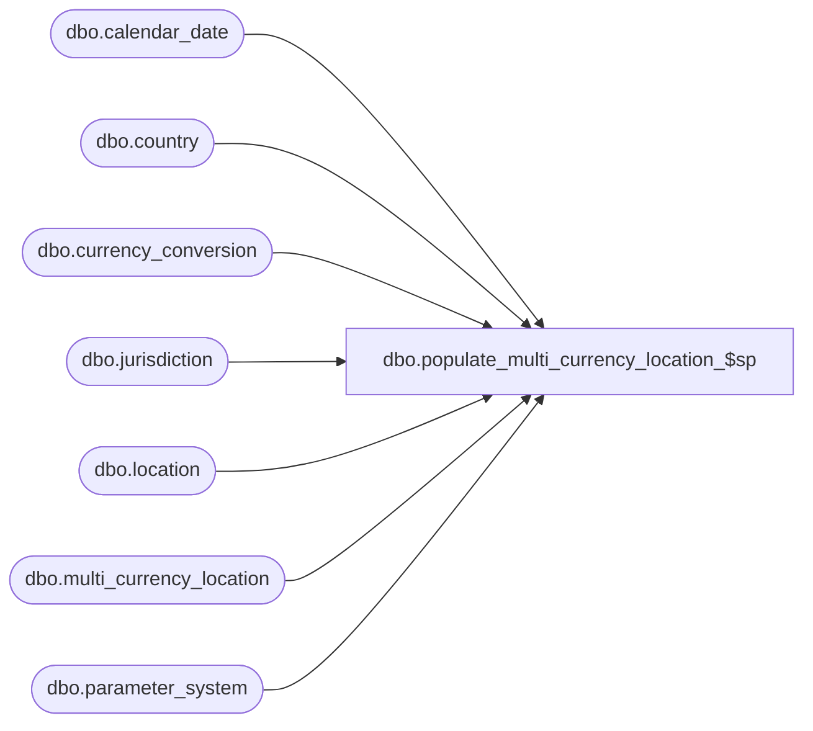

# dbo.populate_multi_currency_location_$sp

**Database:** me_01  
**Server:** bedrockdb02  

## Architecture Diagram



## Table Dependencies

| Referenced Table |
|---|
| dbo.calendar_date |
| dbo.country |
| dbo.currency_conversion |
| dbo.jurisdiction |
| dbo.location |
| dbo.multi_currency_location |
| dbo.parameter_system |

## Stored Procedure Code

```sql
CREATE PROC [dbo].[populate_multi_currency_location_$sp]
AS
/*
	Version		: 1.00
	Created		: Apr 2012
	Created by	: Michel Benoit
	Description	: Procedure will truncate and re-populate the multi_currency_location table
			  that will be referenced by MA in turn, to populate the following MA tables:

				multi_currency_location_cost_wk
				multi_currency_location_retail_wk
				multi_currency_location_cost_pd
				multi_currency_location_retail_pd

                          This is based on the 4.3 R2 UPGR script for multi_currency_location.
	
HISTORY:
Date       		Name         	Def#		Desc
May 02,2012		Michel Benoit	N/A		Initial Release
May 02,2012		Michel Benoit	N/A		Ported from R2
May 02,2012		Michel Benoit	N/A		Ported from R3
May 23,2012		Michel Benoit	N/A		removed execute as owner statement

*/

BEGIN

	DECLARE @error_msg NVARCHAR(2000)
	
	TRUNCATE TABLE dbo.multi_currency_location

	BEGIN TRY

		-- Populating multi_currency_location
		DECLARE @multi_jurisdiction_flag BIT, @min_calendar_date SMALLDATETIME
		SELECT @multi_jurisdiction_flag = multi_sales_jurisdiction_flag FROM dbo.parameter_system
		SELECT @min_calendar_date = MIN(calendar_date) from dbo.calendar_date

		IF @multi_jurisdiction_flag = 1
		BEGIN
			INSERT INTO dbo.multi_currency_location
				(location_id, currency_conversion_type, effective_from_date, effective_to_date, exchange_rate)
			SELECT l.location_id, cc.currency_conversion_type, 
				cc.effective_from_date,
				cc.effective_to_date,  cc.exchange_rate
			FROM dbo.location l, dbo.jurisdiction j, dbo.country co, dbo.currency_conversion cc
			WHERE l.jurisdiction_id = j.jurisdiction_id
			AND j.country_id = co.country_id
			AND co.currency_id = cc.to_currency_id   
			ORDER BY l.location_id

			UPDATE m
			SET m.effective_from_date = (SELECT MIN(calendar_date) FROM dbo.calendar_date)
			FROM dbo.multi_currency_location m
			WHERE NOT EXISTS (SELECT 1 FROM dbo.calendar_date cd WHERE m.effective_from_date = cd.calendar_date)
		END
		ELSE
		BEGIN
			INSERT INTO dbo.multi_currency_location
				(location_id, currency_conversion_type, effective_from_date, effective_to_date, exchange_rate)
			SELECT location_id, 1, @min_calendar_date, NULL, 1
			FROM dbo.location 
			ORDER BY location_id

			INSERT INTO dbo.multi_currency_location
				(location_id, currency_conversion_type, effective_from_date, effective_to_date, exchange_rate)
			SELECT location_id, 2, @min_calendar_date, NULL, 1
			FROM dbo.location
			ORDER BY location_id
		END

	END TRY

	BEGIN CATCH
		SET @error_msg = N'Error in populate_multi_currency_location_$sp: ' + CAST(ERROR_NUMBER() AS NVARCHAR) + N' ' + ERROR_MESSAGE()
		RAISERROR (@error_msg, -- Message text.
		   16, -- Severity.
		   1) -- State.

	END CATCH
END
```

