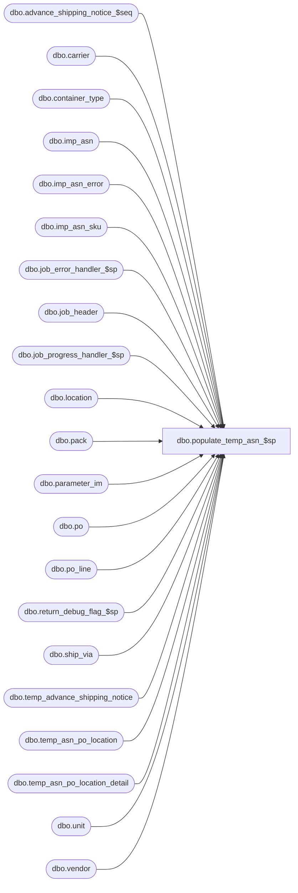

# dbo.populate_temp_asn_$sp

**Database:** me_01  
**Server:** bedrockdb02  

## Architecture Diagram



## Table Dependencies

| Referenced Table |
|---|
| dbo.advance_shipping_notice_$seq |
| dbo.carrier |
| dbo.container_type |
| dbo.imp_asn |
| dbo.imp_asn_error |
| dbo.imp_asn_sku |
| dbo.job_error_handler_$sp |
| dbo.job_header |
| dbo.job_progress_handler_$sp |
| dbo.location |
| dbo.pack |
| dbo.parameter_im |
| dbo.po |
| dbo.po_line |
| dbo.return_debug_flag_$sp |
| dbo.ship_via |
| dbo.temp_advance_shipping_notice |
| dbo.temp_asn_po_location |
| dbo.temp_asn_po_location_detail |
| dbo.unit |
| dbo.vendor |

## Stored Procedure Code

```sql
CREATE PROCEDURE [dbo].[populate_temp_asn_$sp]
	(@job_id INT)

AS

/*
	Version		: 1.00
	Created		: Dec 2010
	Description	: This procedure is part of the ASN import and it's called from import_asn_batch_$sp passing a job_id as an in parameter. 
				  It generates temporary ASN documents stored in: 
					temp_advance_shipping_notice, temp_asn_po_location and temp_asn_po_location_detail.	
	History		: Defect #126032 Remove the time from create_date and last_activity_date.	  
				  Defect #126095: Items doubled posted to ASN in a special situation.  
*/

BEGIN
	DECLARE @line_id SMALLINT, @proc_name NVARCHAR(30), @sql_err_num DECIMAL(38,0), @table_name NVARCHAR(30), 
			@operation_name	NVARCHAR(30), @error_msg	NVARCHAR(2000), @job_type TINYINT, @c_true BIT, @c_false BIT,
			@range_start DECIMAL(24,0), @range_end DECIMAL(24,0), @debug_flag BIT, @document_cnt INT, @today SMALLDATETIME,
			@seq_count INT, @job_debug_flag BIT, @from_new_id DECIMAL(12,0), @to_new_id DECIMAL(12,0), @document_no NVARCHAR(20), @doc_no_len int;

	SELECT   @job_type		= 10
			, @proc_name	= N'populate_temp_asn_$sp'
			, @c_false		= 0
			, @c_true		= 1
			, @line_id		= 10
			, @today		= CAST(CONVERT(varchar(10), GETDATE(), 101) AS SMALLDATETIME);
			
	BEGIN TRY
		-- Get parameters associates to the current job
		SELECT @range_start = range_start, @range_end = range_end, 
			   @job_debug_flag = debug_flag
		FROM job_header WITH (NOLOCK)
		WHERE job_id = @job_id
		AND job_type = @job_type;

		IF @@ROWCOUNT = 0 
			RAISERROR (N'Error: job #%i is missing in the job_header table.',
               16, -- Severity.
               1, -- State.
               @job_id);
               
		-- Log progress if job_params.debug_flag is true 
		EXEC return_debug_flag_$sp @job_type, @debug_flag OUT
		IF (@debug_flag = @c_true OR @job_debug_flag = @c_true)
			EXEC job_progress_handler_$sp @job_type, @job_id, @proc_name, @line_id; 

		SET @line_id = 20
		
		SELECT @document_cnt = COUNT(*)
		FROM imp_asn i
		WHERE i.imp_asn_id BETWEEN @range_start AND @range_end
		AND NOT EXISTS ( SELECT 1 FROM imp_asn_error e WITH (NOLOCK)
						WHERE e.imp_asn_id BETWEEN @range_start AND @range_end
						AND i.imp_asn_id = e.imp_asn_id );
						
		-- Log progress if job_params.debug_flag is true 
		EXEC return_debug_flag_$sp @job_type, @debug_flag OUT
		IF (@debug_flag = @c_true OR @job_debug_flag = @c_true)
			EXEC job_progress_handler_$sp @job_type, @job_id, @proc_name, @line_id;
			
		SET @line_id = 30;
		
		-- We want to make sure multiple jobs won't use the same document_no
		BEGIN TRAN

		SELECT @document_no = last_generated_asn_no,
		       @doc_no_len = LEN(advance_ship_notice_no_mask)
		FROM  parameter_im WITH (XLOCK)
		WHERE parameter_im_id = 1;

		UPDATE parameter_im
		SET last_generated_asn_no = RIGHT(N'00000000000000000000' + CAST( (CAST(@document_no AS INT) + @document_cnt) AS NVARCHAR(20) ), @doc_no_len)
		WHERE parameter_im_id = 1;

		COMMIT TRAN
		
		-- Log progress if job_params.debug_flag is true 
		EXEC return_debug_flag_$sp @job_type, @debug_flag OUT
		IF (@debug_flag = @c_true OR @job_debug_flag = @c_true)
			EXEC job_progress_handler_$sp @job_type, @job_id, @proc_name, @line_id;
			
		SET @line_id = 40;
		-- Need to reserve a range of advance_shipping_notice_id in advance_shipping_notice_$seq
		BEGIN TRAN
				select @seq_count = COUNT(*) from advance_shipping_notice_$seq with (TABLOCKX) WHERE dummycol = 0;
				
				IF @seq_count > 0
					DELETE FROM advance_shipping_notice_$seq WHERE dummycol = 0;

				INSERT INTO advance_shipping_notice_$seq (dummycol) VALUES (0);
										
				SELECT @from_new_id = COALESCE(advance_shipping_notice_seq_id, 1) FROM advance_shipping_notice_$seq WHERE dummycol = 0;
				
				DELETE FROM advance_shipping_notice_$seq WHERE dummycol = 0;
				
				SET IDENTITY_INSERT advance_shipping_notice_$seq ON
				  INSERT INTO advance_shipping_notice_$seq (advance_shipping_notice_seq_id, dummycol)
				  SELECT @from_new_id - 1 + @document_cnt, 0; 
				SET IDENTITY_INSERT advance_shipping_notice_$seq OFF

				SELECT @to_new_id = advance_shipping_notice_seq_id FROM advance_shipping_notice_$seq WHERE dummycol = 0;
				
				DELETE FROM advance_shipping_notice_$seq WHERE dummycol = 0;
				
		COMMIT TRAN
					
		-- Log progress if job_params.debug_flag is true 
		EXEC return_debug_flag_$sp @job_type, @debug_flag OUT
		IF (@debug_flag = @c_true OR @job_debug_flag = @c_true)
			EXEC job_progress_handler_$sp @job_type, @job_id, @proc_name, @line_id 
			
		SET @line_id = 50;
		-- Populate temp_advance_shipping_notice
		INSERT INTO temp_advance_shipping_notice
				   ( job_id
				   , imp_asn_id
				   , advance_shipping_notice_id
				   , vendor_id
				   , unit_weight_id
				   , container_type_id
				   , carrier_id
				   , ship_via_id
				   , document_no
				   , expected_receipt_date
				   , pro_bill_no
				   , create_date
				   , ship_date
				   , bill_of_lading
				   , weight
				   , no_of_containers
				   , shipment_ref_no
				   , last_activity_date
				   , updatestamp)
		SELECT @job_id
				, i.imp_asn_id
				, @from_new_id - 1 + ROW_NUMBER() OVER(ORDER BY i.imp_asn_id ASC)
				, v.vendor_id
				, u.unit_id
				, ct.container_type_id
				, c.carrier_id
				, s.ship_via_id
				, RIGHT(N'00000000000000000000' + CAST( (CAST(@document_no AS INT) + ROW_NUMBER() OVER(ORDER BY i.imp_asn_id ASC)) AS NVARCHAR(20) ), @doc_no_len) 
				, COALESCE(i.expected_receipt_date, @today) expected_receipt_date
				, i.pro_bill_no
				, GETDATE()
				, i.ship_date
				, i.bol
				, i.weight
				, i.no_of_containers
				, i.shipment_ref_no
				, GETDATE()
				, 0
		FROM imp_asn i WITH (NOLOCK)
		JOIN vendor v ON i.vendor_code = v.vendor_code
		LEFT OUTER JOIN unit u WITH (NOLOCK)
			ON i.unit_weight_code = u.unit_code
		LEFT OUTER JOIN container_type ct WITH (NOLOCK)
			ON i.container_type_code = ct.container_type_code
		LEFT OUTER JOIN carrier c WITH (NOLOCK)
			ON i.carrier_code = c.carrier_code
		LEFT OUTER JOIN ship_via s WITH (NOLOCK)
			ON i.ship_via_code = s.ship_via_code
		WHERE i.imp_asn_id BETWEEN @range_start AND @range_end
		AND NOT EXISTS ( SELECT 1 FROM imp_asn_error e WITH (NOLOCK)
						WHERE e.imp_asn_id BETWEEN @range_start AND @range_end
						AND e.imp_asn_id = i.imp_asn_id )
		ORDER BY i.imp_asn_id;

		-- Log progress if job_params.debug_flag is true 
		EXEC return_debug_flag_$sp @job_type, @debug_flag OUT
		IF (@debug_flag = @c_true OR @job_debug_flag = @c_true)
			EXEC job_progress_handler_$sp @job_type, @job_id, @proc_name, @line_id;

		SET @line_id = 60
		
		-- Verify that all the advance_shipping_notice_id are in the range of advance_shipping_notice_id reserved
		SELECT advance_shipping_notice_id
		FROM temp_advance_shipping_notice WITH (NOLOCK)
		WHERE job_id = @job_id
	    AND (advance_shipping_notice_id < @from_new_id
			OR advance_shipping_notice_id > @to_new_id)

		IF @@ROWCOUNT > 0
			RAISERROR (N'Some advance_shipping_notice_id are not in the range of reserved advance_shipping_notice_id. Job# %i',
               16, -- Severity.
               1, -- State.
               @job_id);

		-- Log progress if job_params.debug_flag is true 
		EXEC return_debug_flag_$sp @job_type, @debug_flag OUT
		IF (@debug_flag = @c_true OR @job_debug_flag = @c_true)
			EXEC job_progress_handler_$sp @job_type, @job_id, @proc_name, @line_id 

		SET @line_id = 70;
		-- Verify that all the document_no are in the valid range 
		SELECT document_no
		FROM temp_advance_shipping_notice t WITH (NOLOCK), parameter_im p WITH (NOLOCK)
		WHERE t.job_id = @job_id
		AND (document_no < p.first_advance_ship_notice_no
			OR document_no >= p.last_advance_ship_notice_no)

		IF @@ROWCOUNT > 0
			RAISERROR (N'Some document_no are not in the valid range for ASN document_no. Job# %i',
               16, -- Severity.
1, -- State.
               @job_id)

		-- Log progress if job_params.debug_flag is true 
		EXEC return_debug_flag_$sp @job_type, @debug_flag OUT
		IF (@debug_flag = @c_true OR @job_debug_flag = @c_true)
			EXEC job_progress_handler_$sp @job_type, @job_id, @proc_name, @line_id 

		SET @line_id = 80;

		INSERT INTO temp_asn_po_location
				(job_id, asn_po_location_id, advance_shipping_notice_id, po_id, ship_to_location_id, blanket_po_id, 
				 predistribution_type, ticket_source, ticket_status)
		SELECT @job_id, t.advance_shipping_notice_id * 1000000 + ROW_NUMBER() OVER(PARTITION BY i.imp_asn_id ORDER BY i.imp_asn_id ASC),
			t.advance_shipping_notice_id, i.po_id, l.location_id, i.blanket_po_id, po.predistribution_type, po.ticket_source,
			CASE WHEN po.ticket_source = 4 THEN 3 ELSE 2 END ticket_status
		FROM imp_asn_sku i WITH (NOLOCK), temp_advance_shipping_notice t WITH (NOLOCK), location l WITH (NOLOCK), po WITH (NOLOCK)
		WHERE i.imp_asn_id BETWEEN @range_start AND @range_end
		AND t.job_id = @job_id
		AND t.imp_asn_id = i.imp_asn_id
		AND i.ship_to_location = l.location_code
		AND i.po_id = po.po_id
		GROUP  BY i.imp_asn_id, t.advance_shipping_notice_id, i.po_id, l.location_id, i.blanket_po_id, po.predistribution_type, po.ticket_source
		UNION 
		SELECT @job_id, t.advance_shipping_notice_id * 1000000 + ROW_NUMBER() OVER(PARTITION BY i.imp_asn_id ORDER BY i.imp_asn_id ASC),
			t.advance_shipping_notice_id, i.po_id, l.location_id, i.blanket_po_id, po.predistribution_type, po.ticket_source,
			CASE WHEN po.ticket_source = 4 THEN 3 ELSE 2 END ticket_status
		FROM imp_asn_sku i WITH (NOLOCK), temp_advance_shipping_notice t WITH (NOLOCK), location l WITH (NOLOCK), po WITH (NOLOCK)
		WHERE i.imp_asn_id BETWEEN @range_start AND @range_end
		AND t.job_id = @job_id
		AND t.imp_asn_id = i.imp_asn_id
		AND i.ship_to_location = l.location_code
		AND  i.blanket_po_id = po.po_id
		AND i.po_number IS NULL
		GROUP  BY i.imp_asn_id, t.advance_shipping_notice_id, i.po_id, l.location_id, i.blanket_po_id, po.predistribution_type, po.ticket_source
		ORDER  BY 3;
		
		-- Log progress if job_params.debug_flag is true 
		EXEC return_debug_flag_$sp @job_type, @debug_flag OUT
		IF (@debug_flag = @c_true OR @job_debug_flag = @c_true)
			EXEC job_progress_handler_$sp @job_type, @job_id, @proc_name, @line_id 

		SET @line_id = 90
		-- Update last_item_id as ot'll be usefull to insert into temp_asn_po_location_detail
		UPDATE a
		SET last_item_id = T.max_asn_id
		FROM temp_advance_shipping_notice a,
			(SELECT advance_shipping_notice_id, MAX(asn_po_location_id) max_asn_id FROM temp_asn_po_location WHERE job_id = @job_id GROUP BY advance_shipping_notice_id) T
		WHERE a.job_id = @job_id
		AND a.advance_shipping_notice_id = T.advance_shipping_notice_id;

		-- Log progress if job_params.debug_flag is true 
		EXEC return_debug_flag_$sp @job_type, @debug_flag OUT
		IF (@debug_flag = @c_true OR @job_debug_flag = @c_true)
			EXEC job_progress_handler_$sp @job_type, @job_id, @proc_name, @line_id 

		SET @line_id = 100;
		-- Populate temp_asn_po_location_detail : Defect #126095
		INSERT INTO temp_asn_po_location_detail
			(job_id, asn_po_location_detail_id, asn_po_location_id, advance_shipping_notice_id,po_id, ship_to_location_id,
			 style_id, style_color_id, sku_id, carton_no, units_sent, selling_location_id, pack_id, po_line_id)
		SELECT @job_id, h.last_item_id + ROW_NUMBER() OVER(PARTITION BY h.advance_shipping_notice_id ORDER BY h.advance_shipping_notice_id ASC),
			pl.asn_po_location_id, h.advance_shipping_notice_id, pl.po_id, pl.ship_to_location_id, 
			i.style_id, i.style_color_id, i.sku_id, i.carton_no, SUM(i.units_shipped), sl.location_id, p.pack_id, 0
		FROM imp_asn_sku i WITH (NOLOCK)
		INNER JOIN temp_advance_shipping_notice h WITH (NOLOCK)
			ON  h.job_id = @job_id
			AND h.imp_asn_id = i.imp_asn_id
		INNER JOIN temp_asn_po_location pl WITH (NOLOCK)
			ON  h.job_id = pl.job_id
			AND h.advance_shipping_notice_id = pl.advance_shipping_notice_id
			AND i.po_id = pl.po_id
		INNER JOIN location l WITH (NOLOCK)
			ON  i.ship_to_location = l.location_code
			AND pl.ship_to_location_id = l.location_id
		LEFT OUTER JOIN pack p ON i.pack_code = p.pack_code
		LEFT OUTER JOIN location sl WITH (NOLOCK)
			ON  i.selling_location_code = sl.location_code
		WHERE i.imp_asn_id BETWEEN @range_start AND @range_end
		GROUP BY h.last_item_id, pl.asn_po_location_id, h.advance_shipping_notice_id, pl.po_id, pl.ship_to_location_id, 
				i.style_id, i.style_color_id, i.sku_id, i.carton_no, sl.location_id, p.pack_id
		ORDER  BY h.advance_shipping_notice_id, pl.asn_po_location_id;

		-- Log progress if job_params.debug_flag is true 
		EXEC return_debug_flag_$sp @job_type, @debug_flag OUT
		IF (@debug_flag = @c_true OR @job_debug_flag = @c_true)
			EXEC job_progress_handler_$sp @job_type, @job_id, @proc_name, @line_id 

		SET @line_id = 110
		-- UPDATE po_line_id in the detail table as it'll be usefull later in the process
		UPDATE d 
		SET d.po_line_id = pl.po_line_id
		FROM temp_asn_po_location_detail d WITH (NOLOCK),  temp_asn_po_location l WITH (NOLOCK), po_line pl WITH (NOLOCK)
		WHERE d.job_id = @job_id
		AND d.job_id = l.job_id
		AND d.advance_shipping_notice_id = l.advance_shipping_notice_id
		AND d.asn_po_location_id = l.asn_po_location_id
		AND l.po_id = pl.po_id
		AND (d.style_color_id = pl.style_color_id
			OR
			 d.pack_id = pl.pack_id);

		-- Log progress if job_params.debug_flag is true 
		EXEC return_debug_flag_$sp @job_type, @debug_flag OUT
		IF (@debug_flag = @c_true OR @job_debug_flag = @c_true)
			EXEC job_progress_handler_$sp @job_type, @job_id, @proc_name, @line_id 

		SET @line_id = 120
		-- Set last item id in the header table
		UPDATE a
		SET last_item_id = pld.seq
		FROM temp_advance_shipping_notice a WITH (NOLOCK)
		INNER JOIN
				(SELECT advance_shipping_notice_id, MAX(asn_po_location_detail_id) - advance_shipping_notice_id * 1000000 seq
				 FROM temp_asn_po_location_detail WITH (NOLOCK)
				 WHERE job_id = @job_id
				 GROUP BY advance_shipping_notice_id) pld
		ON a.advance_shipping_notice_id = pld.advance_shipping_notice_id
		AND a.job_id = @job_id;

		-- Log progress if job_params.debug_flag is true 
		EXEC return_debug_flag_$sp @job_type, @debug_flag OUT
		IF (@debug_flag = @c_true OR @job_debug_flag = @c_true)
			EXEC job_progress_handler_$sp @job_type, @job_id, @proc_name, @line_id 

	END TRY
	BEGIN CATCH

		SELECT @error_msg		= ERROR_MESSAGE()
			 , @sql_err_num		= ERROR_NUMBER()

		IF @line_id = 10
			SELECT @table_name		= N'job_header',
				 @operation_name	= N'SELECT'
		ELSE IF @line_id = 20
			SELECT @table_name		= N'imp_asn',
				 @operation_name	= N'SELECT'
		ELSE IF @line_id = 30
			SELECT @table_name		= N'parameter_im',
				 @operation_name	= N'UPDATE'
		ELSE IF @line_id = 40
			SELECT @table_name		= N'advance_shipping_notice_$seq',
				 @operation_name	= N'INSERT'
		ELSE IF @line_id = 50
			SELECT @table_name		= N'temp_advance_shipping_notice',
				 @operation_name	= N'INSERT'
		ELSE IF @line_id BETWEEN 60 AND 70
			SELECT @table_name		= N'temp_advance_shipping_notice',
				 @operation_name	= N'SELECT'
		ELSE IF @line_id = 80
			SELECT @table_name		= N'temp_asn_po_location',
				 @operation_name	= N'INSERT'
		ELSE IF @line_id = 90
			SELECT @table_name		= N'temp_advance_shipping_notice',
				 @operation_name	= N'UPDATE'
		ELSE IF @line_id = 100
			SELECT @table_name		= N'temp_asn_po_location_detail',
				 @operation_name	= N'INSERT'
		ELSE IF @line_id = 110
			SELECT @table_name		= N'temp_asn_po_location_detail',
				 @operation_name	= N'UPDATE'
		ELSE IF @line_id = 120
			SELECT @table_name		= N'temp_advance_shipping_notice',
				 @operation_name	= N'UPDATE'

		EXEC job_error_handler_$sp
					  @job_type 
					, @job_id 
					, @proc_name 
					, @line_id 
					, @sql_err_num 
					, @table_name 
					, @operation_name 
					, @error_msg 
					, @c_true
	END CATCH
END
```

