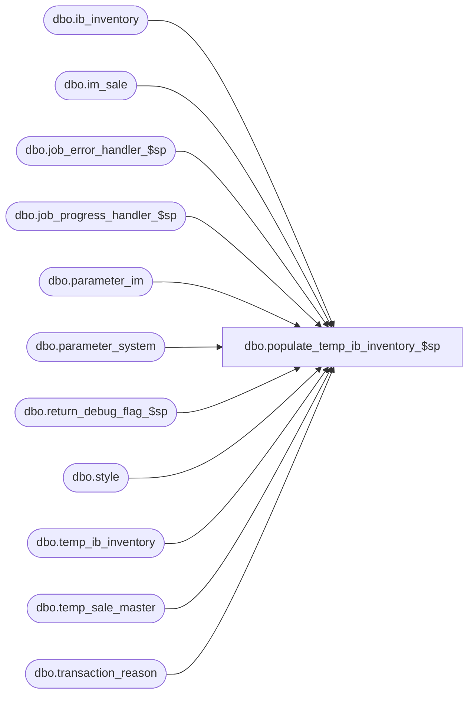

# dbo.populate_temp_ib_inventory_$sp

**Database:** me_01  
**Server:** bedrockdb02  

## Architecture Diagram



## Table Dependencies

| Referenced Table |
|---|
| dbo.ib_inventory |
| dbo.im_sale |
| dbo.job_error_handler_$sp |
| dbo.job_progress_handler_$sp |
| dbo.parameter_im |
| dbo.parameter_system |
| dbo.return_debug_flag_$sp |
| dbo.style |
| dbo.temp_ib_inventory |
| dbo.temp_sale_master |
| dbo.transaction_reason |

## Stored Procedure Code

```sql
CREATE PROCEDURE [dbo].[populate_temp_ib_inventory_$sp]

	(
		 @job_id AS INT
		,@min_im_sale_number AS DECIMAL (24, 0)
		,@max_im_sale_number AS DECIMAL (24, 0)
		,@min_location_id AS SMALLINT
		,@max_location_id AS SMALLINT
		,@debug_flag AS BIT
	)

AS


SET NOCOUNT ON

/*
Description	: This procedure is part of the Sales Posting process and is called by post_sales_batch_$sp. It posts the sales transactions stored in im_sale
to a temporary table that is used later in the process to update ib_inventory.
*/

-----------------------------------------------------------------------------------------------------------------------------
--	Declarations / Sets: Declare And Set Variables
-----------------------------------------------------------------------------------------------------------------------------

DECLARE
	 @c_available AS TINYINT
	,@c_discount_type AS SMALLINT
	,@c_eff_price_change AS SMALLINT
	,@c_exchange_rate_diff AS SMALLINT
	,@c_false AS BIT
	,@c_layaway_cancel_type AS SMALLINT
	,@c_layaway_deposit_type AS SMALLINT
	,@c_layaway_pickup_type AS smallint
	,@c_mu_discount_type AS SMALLINT
	,@c_pickup_disc_type AS SMALLINT
	,@c_pickup_mu_disc_type AS SMALLINT
	,@c_pos_variance AS TINYINT
	,@c_price_change_type_MD AS TINYINT
	,@c_price_change_type_MDC AS TINYINT
	,@c_price_change_type_MU AS TINYINT
	,@c_price_change_type_MUC AS TINYINT
	,@c_promo_type AS SMALLINT
	,@c_psc_type AS SMALLINT
	,@c_return_type AS SMALLINT
	,@c_sale_type AS SMALLINT
	,@c_true AS BIT
	,@c_unavailable AS TINYINT
	,@crs_cost_adj_flag AS BIT
	,@current_location_id AS SMALLINT
	,@current_sku_id AS DECIMAL (13, 0)
	,@current_transaction_cost AS DECIMAL (14, 2)
	,@current_transaction_cost_local AS DECIMAL (14, 2)
	,@current_transaction_date AS SMALLDATETIME
	,@document_number AS NVARCHAR (20)
	,@error_msg AS NVARCHAR (4000)
	,@job_type AS TINYINT
	,@line_id AS SMALLINT
	,@multiple_sales_flag AS BIT
	,@operation_name AS NVARCHAR (30)
	,@proc_name AS NVARCHAR (30)
	,@return_flag AS BIT
	,@sql_err_num AS DECIMAL (38,0)
	,@table_name AS NVARCHAR (30)
	,@ReturnedInventoryStatusId AS SMALLINT

SELECT
	 @c_available = 1
	,@c_discount_type = 601
	,@c_eff_price_change = 700 -- Effective Price Change
	,@c_exchange_rate_diff = 640
	,@c_false = 0
	,@c_layaway_cancel_type = 621
	,@c_layaway_deposit_type = 620
	,@c_layaway_pickup_type = 622
	,@c_mu_discount_type = 602
	,@c_pickup_disc_type = 220
	,@c_pickup_mu_disc_type = 221
	,@c_pos_variance = r.transaction_reason_id
	,@c_price_change_type_MD = 0 -- Markdown
	,@c_price_change_type_MDC = 1 -- Markdown Cancellation
	,@c_price_change_type_MU = 2 -- Markup
	,@c_price_change_type_MUC = 3 -- Markup Cancellation
	,@c_promo_type = 701
	,@c_psc_type = 710 -- Price Status Change
	,@c_return_type = 610
	,@c_sale_type = 600
	,@c_true = 1
	,@c_unavailable = 5
	,@crs_cost_adj_flag = 0
	,@job_type = 1
	,@multiple_sales_flag = p.multi_sales_jurisdiction_flag
	,@proc_name = OBJECT_NAME (@@PROCID)
FROM
	 dbo.parameter_system p
	,dbo.transaction_reason r
WHERE
	p.parameter_system_id = 1
	AND r.transaction_reason_id = 1

SELECT
	@ReturnedInventoryStatusId = p.returned_inv_status_id
FROM
	 dbo.parameter_im p
WHERE
	p.parameter_im_id = 1


-----------------------------------------------------------------------------------------------------------------------------
--	Error Trapping: Check If Temp Table(s) Already Exist(s) And Drop If Applicable
-----------------------------------------------------------------------------------------------------------------------------

IF OBJECT_ID (N'tempdb..#avg_cost_adj', N'U') IS NOT NULL
BEGIN

	DROP TABLE #avg_cost_adj

END


IF OBJECT_ID (N'tempdb..#ib_exchange_rate', N'U') IS NOT NULL
BEGIN

	DROP TABLE #ib_exchange_rate

END


-----------------------------------------------------------------------------------------------------------------------------
--	Table Create: Create Table Shells
-----------------------------------------------------------------------------------------------------------------------------

CREATE TABLE #avg_cost_adj

	(
		 ib_inventory_id DECIMAL (12, 0) NOT NULL
		,sku_id DECIMAL (13, 0) NOT NULL
		,location_id SMALLINT NOT NULL
		,price_status_id SMALLINT NOT NULL
		,transaction_date SMALLDATETIME NOT NULL
		,transaction_type_code SMALLINT NOT NULL
		,inventory_status_id SMALLINT NOT NULL
		,document_number NVARCHAR (20) NULL
		,transaction_units INT NOT NULL
		,transaction_cost DECIMAL (14, 2) NOT NULL
		,transaction_valuation_retail DECIMAL (14, 2) NOT NULL
		,transaction_selling_retail DECIMAL (14, 2) NOT NULL
		,transaction_cost_local DECIMAL (14, 2) NOT NULL
		,register_no SMALLINT NULL
	)


CREATE TABLE #ib_exchange_rate -- Used To Calculate The Exchange Rate Difference For: Return, Layaway Deposit, Layaway Pickup, And Layaway Cancel

	(
		 job_id INT NOT NULL
		,sku_id DECIMAL (13, 0) NOT NULL
		,location_id SMALLINT NOT NULL
		,price_status_id SMALLINT NOT NULL
		,transaction_date SMALLDATETIME NOT NULL
		,transaction_type_code SMALLINT NOT NULL
		,inventory_status_id SMALLINT NOT NULL
		,other_location_id SMALLINT NULL
		,transaction_reason_id SMALLINT NULL
		,document_number NVARCHAR (20) NULL
		,transaction_units INT NOT NULL
		,transaction_cost DECIMAL (14, 2) NOT NULL
		,transaction_valuation_retail DECIMAL (14, 2) NOT NULL
		,transaction_selling_retail DECIMAL (14, 2) NOT NULL
		,price_change_type SMALLINT NULL
		,units_affected INT NULL
		,transaction_no INT NULL
		,transaction_line SMALLINT NULL
		,sale_md_audit_flag BIT NOT NULL DEFAULT (0)
		,transaction_cost_local DECIMAL (14, 2) NULL
		,register_no SMALLINT NULL
	)


-----------------------------------------------------------------------------------------------------------------------------
--	Main Code Block
-----------------------------------------------------------------------------------------------------------------------------

BEGIN TRY

	SET @line_id = 10


-----------------------------------------------------------------------------------------------------------------------------
--	Insert The Variance For Sale transaction
-----------------------------------------------------------------------------------------------------------------------------

	BEGIN TRANSACTION

		INSERT INTO temp_ib_inventory

			(
				 job_id
				,sku_id
				,location_id
				,inventory_status_id
				,price_status_id
				,transaction_date
				,transaction_type_code
				,other_location_id
				,transaction_reason_id
				,document_number
				,transaction_units
				,transaction_cost
				,transaction_valuation_retail
				,transaction_selling_retail
				,price_change_type
				,units_affected
				,transaction_no
				,transaction_line
				,sale_md_audit_flag
				,transaction_cost_local
				,register_no
			)

		SELECT
			 @job_id AS job_id
			,T.sku_id
			,T.location_id
			,@c_available AS inventory_status_id
			,T.price_status_id
			,T.transaction_date
			,@c_discount_type AS transaction_type_code
			,NULL AS other_location_id
			,@c_pos_variance AS transaction_reason_id
			,NULL AS document_number
			,0 AS transaction_units
			,0 AS transaction_cost
			,-((T.selling_unit_retail - SUM_SALE) * T.exchange_rate) AS transaction_valuation_retail
			,-(T.selling_unit_retail - SUM_SALE) AS transaction_selling_retail
			,NULL AS price_change_type
			,NULL AS units_affected
			,T.transaction_no
			,T.transaction_line
			,1 AS sale_md_audit_flag
			,0 AS transaction_cost_local
			,T.register
		FROM

			(
				SELECT
					s.transaction_no
					,s.transaction_line
					,s.transaction_date
					,s.location_id
					,s.sku_id
					,m.exchange_rate
					,COALESCE (m.prm_price_status_id, m.price_status_id) AS price_status_id
					,SUM (s.units) * (COALESCE (m.prm_selling_unit_retail, m.selling_unit_retail)) AS selling_unit_retail
					,SUM (s.units * s.sold_at_price)
						+ COALESCE
							(
								(
									SELECT
										SUM (i.pos_discount_amount)
									FROM
										dbo.im_sale i
									WHERE
										i.aw_transaction_type IN (@c_discount_type, @c_mu_discount_type)
										AND i.im_sale_number BETWEEN @min_im_sale_number AND @max_im_sale_number
										AND i.location_id BETWEEN @min_location_id AND @max_location_id
										AND i.transaction_no = s.transaction_no
										AND i.transaction_line = s.transaction_line
										AND i.location_id = s.location_id
										AND i.transaction_date = s.transaction_date
										AND i.sku_id = s.sku_id
								)
							, 0) AS SUM_SALE
					,s.register

				FROM
					 dbo.im_sale s
					,dbo.temp_sale_master m
				WHERE
					s.im_sale_number BETWEEN @min_im_sale_number AND @max_im_sale_number
					AND s.location_id BETWEEN @min_location_id AND @max_location_id
					AND s.aw_transaction_type = @c_sale_type
					AND m.job_id = @job_id
					AND s.transaction_date = m.transaction_date
					AND s.location_id = m.location_id
					AND s.sku_id = m.sku_id
					AND s.style_id = m.style_id
				GROUP BY
					 s.transaction_no
					,s.transaction_line
					,s.transaction_date
					,s.location_id
					,s.sku_id
					,m.exchange_rate
					,m.prm_price_status_id
					,m.price_status_id
					,m.prm_valuation_unit_retail
					,m.valuation_unit_retail
					,m.prm_selling_unit_retail
					,m.selling_unit_retail
					,s.register
			) T

		WHERE
			T.selling_unit_retail - T.SUM_SALE <> 0

	COMMIT TRANSACTION


	-- Log progress if job_params.debug_flag is true OR job_header.debug_flag is true
	EXEC return_debug_flag_$sp @job_type, @return_flag OUT
	IF (@return_flag = @c_true OR @debug_flag = @c_true)
		EXEC job_progress_handler_$sp @job_type, @job_id, @proc_name, @line_id


	SET @line_id = 20


-----------------------------------------------------------------------------------------------------------------------------
--	Post Sale Discounts For Regular And Pseudo Styles
-----------------------------------------------------------------------------------------------------------------------------

	BEGIN TRANSACTION

		INSERT INTO temp_ib_inventory

			(
				 job_id
				,sku_id
				,location_id
				,inventory_status_id
				,price_status_id
				,transaction_date
				,transaction_type_code
				,other_location_id
				,transaction_reason_id
				,document_number
				,transaction_units
				,transaction_cost
				,transaction_valuation_retail
				,transaction_selling_retail
				,price_change_type
				,units_affected
				,transaction_no
				,transaction_line
				,sale_md_audit_flag
				,transaction_cost_local
				,register_no
			)

		SELECT
			 @job_id AS job_id
			,i.sku_id
			,i.location_id
			,@c_available AS inventory_status_id
			,COALESCE (m.prm_price_status_id, m.price_status_id) AS price_status_id
			,m.transaction_date
			,@c_discount_type AS transaction_type_code
			,NULL AS other_location_id
			,r.transaction_reason_id
			,NULL AS document_number
			,0 AS transaction_units
			,0 AS transaction_cost
			,-SUM (i.pos_discount_amount  * m.exchange_rate) AS transaction_valuation_retail
			,-SUM (i.pos_discount_amount) AS transaction_selling_retail
			,NULL AS price_change_type
			,NULL AS units_affected
			,i.transaction_no
			,i.transaction_line
			,0 AS sale_md_audit_flag
			,0 AS transaction_cost_local
			,i.register
		FROM
			 dbo.im_sale i
			,dbo.transaction_reason r
			,dbo.temp_sale_master m
		WHERE
			i.im_sale_number BETWEEN @min_im_sale_number AND @max_im_sale_number
			AND i.location_id BETWEEN @min_location_id AND @max_location_id
			AND i.aw_transaction_type = @c_discount_type
			AND i.pos_discount_amount > 0
			AND i.units > 0 -- Added to support transactions moved from one date to another: units is negative in this case
			AND m.job_id = @job_id
			AND i.transaction_date = m.transaction_date
			AND i.location_id = m.location_id
			AND i.sku_id = m.sku_id
			AND i.style_id = m.style_id
			AND CAST (i.pos_discount_type_code AS NVARCHAR (5)) = r.transaction_reason_code
		GROUP BY
			 i.sku_id
			,i.location_id
			,m.prm_price_status_id
			,m.price_status_id
			,m.transaction_date
			,r.transaction_reason_id
			,i.transaction_no
			,i.transaction_line
			,i.register


		-- Added to support transactions moved from one date to another: units and discount are negative in this situation
		INSERT INTO temp_ib_inventory

			(
				 job_id
				,sku_id
				,location_id
				,inventory_status_id
				,price_status_id
				,transaction_date
				,transaction_type_code
				,other_location_id
				,transaction_reason_id
				,document_number
				,transaction_units
				,transaction_cost
				,transaction_valuation_retail
				,transaction_selling_retail
				,price_change_type
				,units_affected
				,transaction_no
				,transaction_line
				,sale_md_audit_flag
				,transaction_cost_local
				,register_no
			)

		SELECT
			 @job_id AS job_id
			,i.sku_id
			,i.location_id
			,@c_available AS inventory_status_id
			,COALESCE (m.prm_price_status_id, m.price_status_id) AS price_status_id
			,m.transaction_date
			,@c_discount_type AS transaction_type_code
			,NULL AS other_location_id
			,r.transaction_reason_id
			,NULL AS document_number
			,0 AS transaction_units
			,0 AS transaction_cost
			,-SUM (i.pos_discount_amount  * m.exchange_rate) AS transaction_valuation_retail
			,-SUM (i.pos_discount_amount) AS transaction_selling_retail
			,NULL AS price_change_type
			,NULL AS units_affected
			,i.transaction_no
			,i.transaction_line
			,0 AS sale_md_audit_flag
			,0 AS transaction_cost_local
			,i.register
		FROM
			 dbo.im_sale i
			,dbo.transaction_reason r
			,dbo.temp_sale_master m
		WHERE
			i.im_sale_number BETWEEN @min_im_sale_number AND @max_im_sale_number
			AND i.location_id BETWEEN @min_location_id AND @max_location_id
			AND i.aw_transaction_type = @c_discount_type
			and i.units < 0
			AND i.pos_discount_amount < 0
			AND m.job_id = @job_id
			AND i.transaction_date = m.transaction_date
			AND i.location_id = m.location_id
			AND i.sku_id = m.sku_id
			AND i.style_id = m.style_id
			AND CAST (i.pos_discount_type_code AS NVARCHAR (5)) = r.transaction_reason_code
		GROUP BY
			 i.sku_id
			,i.location_id
			,m.prm_price_status_id
			,m.price_status_id
			,m.transaction_date
			,r.transaction_reason_id
			,i.transaction_no
			,i.transaction_line
			,i.register


		-- added for support of MU discounts, aw_transaction_reason is 602 but we still post as 601
		INSERT INTO temp_ib_inventory

			(
				 job_id
				,sku_id
				,location_id
				,inventory_status_id
				,price_status_id
				,transaction_date
				,transaction_type_code
				,other_location_id
				,transaction_reason_id
				,document_number
				,transaction_units
				,transaction_cost
				,transaction_valuation_retail
				,transaction_selling_retail
				,price_change_type
				,units_affected
				,transaction_no
				,transaction_line
				,sale_md_audit_flag
				,transaction_cost_local
				,register_no
			)

		SELECT
			 @job_id AS job_id
			,i.sku_id
			,i.location_id
			,@c_available AS inventory_status_id
			,COALESCE (m.prm_price_status_id, m.price_status_id) AS price_status_id
			,m.transaction_date
			,@c_discount_type AS transaction_type_code -- use 601 for ib_inventory for now
			,NULL AS other_location_id
			,r.transaction_reason_id
			,NULL AS document_number
			,0 AS transaction_units
			,0 AS transaction_cost
			,-SUM (i.pos_discount_amount  * m.exchange_rate) AS transaction_valuation_retail
			,-SUM (i.pos_discount_amount) AS transaction_selling_retail
			,NULL AS price_change_type
			,NULL AS units_affected
			,i.transaction_no
			,i.transaction_line
			,0 AS sale_md_audit_flag
			,0 AS transaction_cost_local
			,i.register
		FROM
			 dbo.im_sale i
			,dbo.transaction_reason r
			,dbo.temp_sale_master m
		WHERE
			i.im_sale_number BETWEEN @min_im_sale_number AND @max_im_sale_number
			AND i.location_id BETWEEN @min_location_id AND @max_location_id
			AND i.aw_transaction_type = @c_mu_discount_type
			AND i.pos_discount_amount < 0
			AND i.units > 0 -- Added to support transactions moved from one date to another: units are negative in this case
			AND m.job_id = @job_id
			AND i.transaction_date = m.transaction_date
			AND i.location_id = m.location_id
			AND i.sku_id = m.sku_id
			AND i.style_id = m.style_id
			AND CAST (i.pos_discount_type_code AS NVARCHAR (5)) = r.transaction_reason_code
		GROUP BY
			 i.sku_id
			,i.location_id
			,m.prm_price_status_id
			,m.price_status_id
			,m.transaction_date
			,r.transaction_reason_id
			,i.transaction_no
			,i.transaction_line
			,i.register


		-- Added to support transactions with MU discount moved from one date to another: units and discount are negative in this situation
		INSERT INTO temp_ib_inventory
			(
				 job_id
				,sku_id
				,location_id
				,inventory_status_id
				,price_status_id
				,transaction_date
				,transaction_type_code
				,other_location_id
				,transaction_reason_id
				,document_number
				,transaction_units
				,transaction_cost
				,transaction_valuation_retail
				,transaction_selling_retail
				,price_change_type
				,units_affected
				,transaction_no
				,transaction_line
				,sale_md_audit_flag
				,transaction_cost_local
				,register_no
			)

		SELECT
			 @job_id AS job_id
			,i.sku_id
			,i.location_id
			,@c_available AS inventory_status_id
			,COALESCE (m.prm_price_status_id, m.price_status_id) AS price_status_id
			,m.transaction_date
			,@c_discount_type AS transaction_type_code
			,NULL AS other_location_id
			,r.transaction_reason_id
			,NULL AS document_number
			,0 AS transaction_units
			,0 AS transaction_cost
			,-SUM (i.pos_discount_amount  * m.exchange_rate) AS transaction_valuation_retail
			,-SUM (i.pos_discount_amount) AS transaction_selling_retail
			,NULL AS price_change_type
			,NULL AS units_affected
			,i.transaction_no
			,i.transaction_line
			,0 AS sale_md_audit_flag
			,0 AS transaction_cost_local
			,i.register
		FROM
			 dbo.im_sale i
			,dbo.transaction_reason r
			,dbo.temp_sale_master m
		WHERE
			i.im_sale_number BETWEEN @min_im_sale_number AND @max_im_sale_number
			AND i.location_id BETWEEN @min_location_id AND @max_location_id
			AND i.aw_transaction_type = @c_mu_discount_type
			and i.units < 0
			AND i.pos_discount_amount > 0
			AND m.job_id = @job_id
			AND i.transaction_date = m.transaction_date
			AND i.location_id = m.location_id
			AND i.sku_id = m.sku_id
			AND i.style_id = m.style_id
			AND CAST (i.pos_discount_type_code AS NVARCHAR (5)) = r.transaction_reason_code
		GROUP BY
			 i.sku_id
			,i.location_id
			,m.prm_price_status_id
			,m.price_status_id
			,m.transaction_date
			,r.transaction_reason_id
			,i.transaction_no
			,i.transaction_line
			,i.register

	COMMIT TRANSACTION


	-- Log progress if job_params.debug_flag is true OR job_header.debug_flag is true
	EXEC return_debug_flag_$sp @job_type, @return_flag OUT
	IF (@return_flag = @c_true OR @debug_flag = @c_true)
		EXEC job_progress_handler_$sp @job_type, @job_id, @proc_name, @line_id


	SET @line_id = 30


-----------------------------------------------------------------------------------------------------------------------------
--	Post Sales For Regular And Pseudo Styles
-----------------------------------------------------------------------------------------------------------------------------

	BEGIN TRANSACTION

		INSERT INTO temp_ib_inventory

			(
				 job_id
				,sku_id
				,location_id
				,inventory_status_id
				,price_status_id
				,transaction_date
				,transaction_type_code
				,other_location_id
				,transaction_reason_id
				,document_number
				,transaction_units
				,transaction_cost
				,transaction_valuation_retail
				,transaction_selling_retail
				,price_change_type
				,units_affected
				,transaction_no
				,transaction_line
				,sale_md_audit_flag
				,transaction_cost_local
				,register_no
			)

		SELECT
			 @job_id AS job_id
			,s.sku_id
			,s.location_id
			,@c_available AS inventory_status_id
			,COALESCE (m.prm_price_status_id, m.price_status_id) AS price_status_id
			,m.transaction_date
			,@c_sale_type AS transaction_type_code
			,NULL AS other_location_id
			,NULL AS transaction_reason_id
			,NULL AS document_number
			,-SUM (s.units) AS transaction_units
			,-SUM (s.units * m.average_cost) AS transaction_cost
			,-SUM (s.units * (s.sold_at_price * m.exchange_rate)) AS transaction_valuation_retail
			,-SUM (s.units * s.sold_at_price) AS transaction_selling_retail
			,NULL AS price_change_type
			,NULL AS units_affected
			,s.transaction_no
			,s.transaction_line
			,0 AS sale_md_audit_flag
			,-SUM (s.units * m.average_cost_local) AS transaction_cost_local
			,s.register
		FROM
			 dbo.im_sale s
			,dbo.temp_sale_master m
		WHERE
			s.im_sale_number BETWEEN @min_im_sale_number AND @max_im_sale_number
			AND s.location_id BETWEEN @min_location_id AND @max_location_id
			AND s.aw_transaction_type = @c_sale_type
			AND m.job_id = @job_id
			AND s.transaction_date = m.transaction_date
			AND s.location_id = m.location_id
			AND s.sku_id = m.sku_id
			AND s.style_id = m.style_id
		GROUP BY
			 s.sku_id
			,s.location_id
			,m.prm_price_status_id
			,m.price_status_id
			,m.transaction_date
			,m.exchange_rate
			,s.transaction_no
			,s.transaction_line
			,s.register

	COMMIT TRANSACTION


	-- Log progress if job_params.debug_flag is true OR job_header.debug_flag is true
	EXEC return_debug_flag_$sp @job_type, @return_flag OUT
	IF (@return_flag = @c_true OR @debug_flag = @c_true)
		EXEC job_progress_handler_$sp @job_type, @job_id, @proc_name, @line_id


-----------------------------------------------------------------------------------------------------------------------------
--	Post Exchange Rate Difference For Sales Transactions
-----------------------------------------------------------------------------------------------------------------------------

	IF @multiple_sales_flag = 1
	BEGIN

		SET @line_id = 40


		BEGIN TRANSACTION

			INSERT INTO temp_ib_inventory

				(
					 job_id
					,sku_id
					,location_id
					,inventory_status_id
					,price_status_id
					,transaction_date
					,transaction_type_code
					,other_location_id
					,transaction_reason_id
					,document_number
					,transaction_units
					,transaction_cost
					,transaction_valuation_retail
					,transaction_selling_retail
					,price_change_type
					,units_affected
					,transaction_no
					,transaction_line
					,sale_md_audit_flag
					,transaction_cost_local
					,register_no
				)

			SELECT
				 t.job_id
				,t.sku_id
				,t.location_id
				,t.inventory_status_id
				,t.price_status_id
				,t.transaction_date
				,@c_exchange_rate_diff AS transaction_type_code
				,NULL AS other_location_id
				,NULL AS transaction_reason_id
				,NULL AS document_number
				,0 AS transaction_units
				,0 AS transaction_cost
				,(SUM (t.transaction_units) * (COALESCE (m.prm_valuation_unit_retail, m.valuation_unit_retail))) - SUM (t.transaction_valuation_retail) AS exchange_rate_diff
				,0 AS transaction_selling_retail
				,NULL AS price_change_type
				,NULL AS units_affected
				,t.transaction_no
				,t.transaction_line
				,1 AS sale_md_audit_flag
				,0 AS transaction_cost_local
				,t.register_no
			FROM
				 dbo.temp_ib_inventory t
				,dbo.temp_sale_master m
			WHERE
				t.job_id = @job_id
				AND t.job_id = m.job_id
				AND t.sku_id = m.sku_id
				AND t.location_id = m.location_id
				AND t.transaction_date = m.transaction_date
			GROUP BY
				 t.job_id
				,t.sku_id
				,t.location_id
				,t.price_status_id
				,t.transaction_date
				,t.inventory_status_id
				,t.transaction_no
				,t.transaction_line
				,m.prm_valuation_unit_retail
				,m.valuation_unit_retail
				,t.register_no
			HAVING
				(SUM (t.transaction_units) * (COALESCE (m.prm_valuation_unit_retail, m.valuation_unit_retail))) - SUM (t.transaction_valuation_retail) <> 0

		COMMIT TRANSACTION


		-- Log progress if job_params.debug_flag is true OR job_header.debug_flag is true
		EXEC return_debug_flag_$sp @job_type, @return_flag OUT
		IF (@return_flag = @c_true OR @debug_flag = @c_true)
			EXEC job_progress_handler_$sp @job_type, @job_id, @proc_name, @line_id

	END


-----------------------------------------------------------------------------------------------------------------------------
--	Start Processing Return Transactions (610)
-----------------------------------------------------------------------------------------------------------------------------

	SET @line_id = 50


	-- Need to insert transactions affecting return transactions into #ib_exchange_rate first and when the exchange rate
	-- difference will be calculated then we are going to insert these transactions back to temp_ib_inventory

	-- Insert the variance for Return transaction with unit > 0 i.e transactions were not moved from one date to another
	INSERT INTO #ib_exchange_rate

		(
			 job_id
			,sku_id
			,location_id
			,inventory_status_id
			,price_status_id
			,transaction_date
			,transaction_type_code
			,other_location_id
			,transaction_reason_id
			,document_number
			,transaction_units
			,transaction_cost
			,transaction_valuation_retail
			,transaction_selling_retail
			,price_change_type
			,units_affected
			,transaction_no
			,transaction_line
			,sale_md_audit_flag
			,transaction_cost_local
			,register_no
		)

	SELECT
		 @job_id AS job_id
		,T.sku_id
		,T.location_id
		,@ReturnedInventoryStatusId AS inventory_status_id
		,T.price_status_id
		,T.transaction_date
		,@c_discount_type AS transaction_type_code
		,NULL AS other_location_id
		,@c_pos_variance AS transaction_reason_id
		,NULL AS document_number
		,0 AS transaction_units
		,0 AS transaction_cost
		,((T.selling_unit_retail - SUM_SALE) * T.exchange_rate) AS transaction_valuation_retail
		,(T.selling_unit_retail - SUM_SALE) AS transaction_selling_retail
		,NULL AS price_change_type
		,NULL AS units_affected
		,T.transaction_no
		,T.transaction_line
		,1 AS sale_md_audit_flag
		,0 AS transaction_cost_local
		,T.register
	FROM

		(
			SELECT
				 s.transaction_no
				,s.transaction_line
				,s.transaction_date
				,s.location_id
				,s.sku_id
				,m.exchange_rate
				,COALESCE (m.prm_price_status_id,m.price_status_id) AS price_status_id
				,SUM (s.units) * (COALESCE (m.prm_selling_unit_retail,m.selling_unit_retail)) AS selling_unit_retail
				,SUM (s.units * s.sold_at_price)
					- COALESCE (
									(
										SELECT
											SUM (i.pos_discount_amount)
										FROM
											dbo.im_sale i
										WHERE
											i.aw_transaction_type IN (@c_discount_type, @c_mu_discount_type)
											AND i.im_sale_number BETWEEN @min_im_sale_number AND @max_im_sale_number
											AND i.location_id BETWEEN @min_location_id AND @max_location_id
											AND i.transaction_no = s.transaction_no
											AND i.transaction_line = s.transaction_line
											AND i.transaction_date = s.transaction_date
											AND i.location_id = s.location_id
											AND i.units > 0 -- with unit > 0 i.e transactions were not moved from one date to another
											AND i.sku_id = s.sku_id
									)
								, 0) AS SUM_SALE
				,s.register
			FROM
				 dbo.im_sale s
				,dbo.temp_sale_master m
			WHERE
				s.im_sale_number BETWEEN @min_im_sale_number AND @max_im_sale_number
				AND s.location_id BETWEEN @min_location_id AND @max_location_id
				AND s.aw_transaction_type = @c_return_type
				AND s.units > 0 -- with unit > 0 i.e transactions were not moved from one date to another
				AND m.job_id = @job_id
				AND s.transaction_date = m.transaction_date
				AND s.location_id = m.location_id
				AND s.sku_id = m.sku_id
				AND s.style_id = m.style_id
			GROUP BY
				 s.transaction_no
				,s.transaction_line
				,s.transaction_date
				,s.location_id
				,s.sku_id
				,m.exchange_rate
				,m.prm_price_status_id
				,m.price_status_id
				,m.prm_valuation_unit_retail
				,m.valuation_unit_retail
				,m.prm_selling_unit_retail
				,m.selling_unit_retail
				,s.register
		) T

	WHERE
		T.selling_unit_retail - T.SUM_SALE <> 0


	-- Insert the variance for Return transaction with unit < 0 i.e transactions were moved from one date to another
	INSERT INTO #ib_exchange_rate

		(
			 job_id
			,sku_id
			,location_id
			,inventory_status_id
			,price_status_id
			,transaction_date
			,transaction_type_code
			,other_location_id
			,transaction_reason_id
			,document_number
			,transaction_units
			,transaction_cost
			,transaction_valuation_retail
			,transaction_selling_retail
			,price_change_type
			,units_affected
			,transaction_no
			,transaction_line
			,sale_md_audit_flag
			,transaction_cost_local
			,register_no
		)

	SELECT
		 @job_id AS job_id
		,T.sku_id
		,T.location_id
		,@ReturnedInventoryStatusId AS inventory_status_id
		,T.price_status_id
		,T.transaction_date
		,@c_discount_type AS transaction_type_code
		,NULL AS other_location_id
		,@c_pos_variance AS transaction_reason_id
		,NULL AS document_number
		,0 AS transaction_units
		,0 AS transaction_cost
		,(T.selling_unit_retail + SUM_SALE) * T.exchange_rate AS transaction_valuation_retail
		,(T.selling_unit_retail + SUM_SALE) AS transaction_selling_retail
		,NULL AS price_change_type
		,NULL AS units_affected
		,T.transaction_no
		,T.transaction_line
		,1 AS sale_md_audit_flag
		,0 AS transaction_cost_local
		,T.register
	FROM

		(
			SELECT
				 s.transaction_no
				,s.transaction_line
				,s.transaction_date
				,s.location_id
				,s.sku_id
				,m.exchange_rate
				,COALESCE (m.prm_price_status_id, m.price_status_id) AS price_status_id
				,SUM (s.units) * (COALESCE (m.prm_selling_unit_retail, m.selling_unit_retail)) AS selling_unit_retail
				,ABS (SUM (s.units * s.sold_at_price))
					+ COALESCE (
									(
										SELECT
											SUM (i.pos_discount_amount)
										FROM
											dbo.im_sale i
										WHERE
											i.aw_transaction_type IN (@c_discount_type, @c_mu_discount_type)
											AND i.transaction_no = s.transaction_no
											AND i.transaction_line = s.transaction_line
											AND i.transaction_date = s.transaction_date
											AND i.location_id = s.location_id
											AND i.units < 0
											AND i.sku_id = s.sku_id
									)
								, 0) AS SUM_SALE
				,s.register
			FROM
				 dbo.im_sale s
				,dbo.temp_sale_master m
			WHERE
				s.im_sale_number BETWEEN @min_im_sale_number AND @max_im_sale_number
				AND s.location_id BETWEEN @min_location_id AND @max_location_id
				AND s.aw_transaction_type = @c_return_type
				AND s.units < 0 -- unit < 0 i.e transactions were moved from one date to another
				AND m.job_id = @job_id
				AND s.style_id = m.style_id
				AND s.sku_id = m.sku_id
				AND s.location_id = m.location_id
				AND s.transaction_date = m.transaction_date
			GROUP BY
				 s.transaction_no
				,s.transaction_line
				,s.transaction_date
				,s.location_id
				,s.sku_id
				,m.exchange_rate
				,m.prm_price_status_id
				,m.price_status_id
				,m.prm_valuation_unit_retail
				,m.valuation_unit_retail
				,m.prm_selling_unit_retail
				,m.selling_unit_retail
				,s.register
		) T

	WHERE
		T.selling_unit_retail + T.SUM_SALE <> 0


	-- Log progress if job_params.debug_flag is true OR job_header.debug_flag is true
	EXEC return_debug_flag_$sp @job_type, @return_flag OUT
	IF (@return_flag = @c_true OR @debug_flag = @c_true)
		EXEC job_progress_handler_$sp @job_type, @job_id, @proc_name, @line_id


	SET @line_id = 55


-----------------------------------------------------------------------------------------------------------------------------
--	Insert Discount For Return Transactions
-----------------------------------------------------------------------------------------------------------------------------

	INSERT INTO #ib_exchange_rate
		( job_id
		,sku_id
		,location_id
		,inventory_status_id
		,price_status_id
		,transaction_date
		,transaction_type_code
		,other_location_id
		,transaction_reason_id
		,document_number
		,transaction_units
		,transaction_cost
		,transaction_valuation_retail
		,transaction_selling_retail
		,price_change_type
		,units_affected
		,transaction_no
		,transaction_line
		,sale_md_audit_flag
		,transaction_cost_local
		,register_no )
	SELECT @job_id
		,i.sku_id
		,i.location_id
		,@ReturnedInventoryStatusId inventory_status_id
		,COALESCE(m.prm_price_status_id, m.price_status_id) price_status_id
		,m.transaction_date
		,@c_discount_type transaction_type_code
		,NULL other_location_id
		,r.transaction_reason_id
		,NULL document_number
		,0 transaction_units
		,0 transaction_cost
		,-SUM(i.pos_discount_amount  * m.exchange_rate) transaction_valuation_retail
		,-SUM(i.pos_discount_amount) transaction_selling_retail
		,NULL price_change_type
		,NULL units_affected
		,i.transaction_no
		,i.transaction_line
		,0 sale_md_audit_flag
		,0 transaction_cost_local
		,i.register
	FROM im_sale i, transaction_reason r , temp_sale_master m
	WHERE
		i.im_sale_number BETWEEN @min_im_sale_number AND @max_im_sale_number
	AND i.location_id BETWEEN @min_location_id AND @max_location_id
	AND i.aw_transaction_type = @c_discount_type
	AND i.pos_discount_amount < 0
	AND i.units > 0 -- Added to support transactions moved from one date to another: units is negative in this case
	-- join im_sale with temp_sale_master on transaction_date, sku, location
	AND m.job_id = @job_id
	AND i.transaction_date = m.transaction_date
	AND i.location_id = m.location_id
	AND i.sku_id = m.sku_id
	AND i.style_id = m.style_id
	-- join im_sale with transaction_reason
	AND CAST (i.pos_discount_type_code AS NVARCHAR (5)) = r.transaction_reason_code
	GROUP BY i.sku_id, i.location_id, m.prm_price_status_id, m.price_status_id, m.transaction_date
		,r.transaction_reason_id, i.transaction_no, i.transaction_line, i.register

	-- Added to support transactions moved from one date to another: units is negative and discount are positive in this situation
	INSERT INTO #ib_exchange_rate
		( job_id
		,sku_id
		,location_id
		,inventory_status_id
		,price_status_id
		,transaction_date
		,transaction_type_code
		,other_location_id
		,transaction_reason_id
		,document_number
		,transaction_units
		,transaction_cost
		,transaction_valuation_retail
		,transaction_selling_retail
		,price_change_type
		,units_affected
		,transaction_no
		,transaction_line
		,sale_md_audit_flag
		,transaction_cost_local
		,register_no )
	SELECT @job_id
		,i.sku_id
		,i.location_id
		,@ReturnedInventoryStatusId inventory_status_id
		,COALESCE(m.prm_price_status_id, m.price_status_id) price_status_id
		,m.transaction_date
		,@c_discount_type transaction_type_code
		,NULL other_location_id
		,r.transaction_reason_id
		,NULL document_number
		,0 transaction_units
		,0 transaction_cost
		,-SUM(i.pos_discount_amount  * m.exchange_rate) transaction_valuation_retail
		,-SUM(i.pos_discount_amount) transaction_selling_retail
		,NULL price_change_type
		,NULL units_affected
		,i.transaction_no
		,i.transaction_line
		,0 sale_md_audit_flag
		,0 transaction_cost_local
		,i.register
	FROM im_sale i, transaction_reason r , temp_sale_master m
	WHERE   i.im_sale_number BETWEEN @min_im_sale_number AND @max_im_sale_number
	AND i.location_id BETWEEN @min_location_id AND @max_location_id
	AND i.aw_transaction_type = @c_discount_type
	and i.units < 0
	AND i.pos_discount_amount > 0 -- Added to support transactions moved from one date to another: units is negative in this case
	-- join im_sale with temp_sale_master on transaction_date, sku, location
	AND m.job_id = @job_id
	AND i.transaction_date = m.transaction_date
	AND i.location_id = m.location_id
	AND i.sku_id = m.sku_id
	AND i.style_id = m.style_id
		-- join im_sale with transaction_reason
	AND CAST (i.pos_discount_type_code AS NVARCHAR (5)) = r.transaction_reason_code
	GROUP BY i.sku_id, i.location_id, m.prm_price_status_id, m.price_status_id, m.transaction_date
		,r.transaction_reason_id, i.transaction_no, i.transaction_line, i.register

	-- added to support MU discount transactions, aw_transaction_reason is 602 but we still post as 601
	INSERT INTO #ib_exchange_rate
		( job_id
		,sku_id
		,location_id
		,inventory_status_id
		,price_status_id
		,transaction_date
		,transaction_type_code
		,other_location_id
		,transaction_reason_id
		,document_number
		,transaction_units
		,transaction_cost
		,transaction_valuation_retail
		,transaction_selling_retail
		,price_change_type
		,units_affected
		,transaction_no
		,transaction_line
		,sale_md_audit_flag
		,transaction_cost_local
		,register_no )
	SELECT @job_id
		,i.sku_id
		,i.location_id
		,@ReturnedInventoryStatusId inventory_status_id
		,COALESCE(m.prm_price_status_id, m.price_status_id) price_status_id
		,m.transaction_date
		,@c_discount_type transaction_type_code
		,NULL other_location_id
		,r.transaction_reason_id
		,NULL document_number
		,0 transaction_units
		,0 transaction_cost
		,-SUM(i.pos_discount_amount  * m.exchange_rate) transaction_valuation_retail
		,-SUM(i.pos_discount_amount) transaction_selling_retail
		,NULL price_change_type
		,NULL units_affected
		,i.transaction_no
		,i.transaction_line
		,0 sale_md_audit_flag
		,0 transaction_cost_local
		,i.register
	FROM im_sale i, transaction_reason r , temp_sale_master m
	WHERE   i.im_sale_number BETWEEN @min_im_sale_number AND @max_im_sale_number
	AND i.location_id BETWEEN @min_location_id AND @max_location_id
	AND i.aw_transaction_type = @c_mu_discount_type
	AND i.pos_discount_amount > 0
	AND i.units > 0 -- Added to support transactions moved from one date to another: units is negative in this case
	-- join im_sale with temp_sale_master on transaction_date, sku, location
	AND m.job_id = @job_id
	AND i.transaction_date = m.transaction_date
	AND i.location_id = m.location_id
	AND i.sku_id = m.sku_id
	AND i.style_id = m.style_id
	-- join im_sale with transaction_reason
	AND CAST (i.pos_discount_type_code AS NVARCHAR (5)) = r.transaction_reason_code
	GROUP BY i.sku_id, i.location_id, m.prm_price_status_id, m.price_status_id, m.transaction_date
		,r.transaction_reason_id, i.transaction_no, i.transaction_line, i.register

	-- Added to support MU disount transactions moved from one date to another: units is negative and discount are positive in this situation
	INSERT INTO #ib_exchange_rate
		( job_id
		,sku_id
		,location_id
		,inventory_status_id
		,price_status_id
		,transaction_date
		,transaction_type_code
		,other_location_id
		,transaction_reason_id
		,document_number
		,transaction_units
		,transaction_cost
		,transaction_valuation_retail
		,transaction_selling_retail
		,price_change_type
		,units_affected
		,transaction_no
		,transaction_line
		,sale_md_audit_flag
		,transaction_cost_local
		,register_no )
	SELECT @job_id
		,i.sku_id
		,i.location_id
		,@ReturnedInventoryStatusId inventory_status_id
		,COALESCE(m.prm_price_status_id, m.price_status_id) price_status_id
		,m.transaction_date
		,@c_discount_type transaction_type_code
		,NULL other_location_id
		,r.transaction_reason_id
		,NULL document_number
		,0 transaction_units
		,0 transaction_cost
		,-SUM(i.pos_discount_amount  * m.exchange_rate) transaction_valuation_retail
		,-SUM(i.pos_discount_amount) transaction_selling_retail
		,NULL price_change_type
		,NULL units_affected
		,i.transaction_no
		,i.transaction_line
		,0 sale_md_audit_flag
		,0 transaction_cost_local
		,i.register
	FROM im_sale i, transaction_reason r , temp_sale_master m
	WHERE   i.im_sale_number BETWEEN @min_im_sale_number AND @max_im_sale_number
	AND i.location_id BETWEEN @min_location_id AND @max_location_id
	AND i.aw_transaction_type = @c_mu_discount_type
	and i.units < 0
	AND i.pos_discount_amount < 0 -- Added to support transactions moved from one date to another: units is negative in this case
	-- join im_sale with temp_sale_master on transaction_date, sku, location
	AND m.job_id = @job_id
	AND i.transaction_date = m.transaction_date
	AND i.location_id = m.location_id
	AND i.sku_id = m.sku_id
	AND i.style_id = m.style_id
	-- join im_sale with transaction_reason
	AND CAST (i.pos_discount_type_code AS NVARCHAR (5)) = r.transaction_reason_code
	GROUP BY i.sku_id, i.location_id, m.prm_price_status_id, m.price_status_id, m.transaction_date
		,r.transaction_reason_id, i.transaction_no, i.transaction_line, i.register


	-- Log progress if job_params.debug_flag is true OR job_header.debug_flag is true
	EXEC return_debug_flag_$sp @job_type, @return_flag OUT
	IF (@return_flag = @c_true OR @debug_flag = @c_true)
		EXEC job_progress_handler_$sp @job_type, @job_id, @proc_name, @line_id

	SET @line_id = 60
	-- This is the return
	INSERT INTO #ib_exchange_rate
			( job_id
			,sku_id
			,location_id
			,inventory_status_id
			,price_status_id
			,transaction_date
			,transaction_type_code
			,other_location_id
			,transaction_reason_id
			,document_number
			,transaction_units
			,transaction_cost
			,transaction_valuation_retail
			,transaction_selling_retail
			,price_change_type
			,units_affected
			,transaction_no
			,transaction_line
			,sale_md_audit_flag
			,transaction_cost_local
			,register_no )
	SELECT @job_id
			,s.sku_id
			,s.location_id
			,@ReturnedInventoryStatusId inventory_status_id
			,COALESCE(m.prm_price_status_id, m.price_status_id) price_status_id
			,m.transaction_date
			,@c_return_type transaction_type_code
			,NULL other_location_id
			,TR.transaction_reason_id
			,NULL document_number
			,SUM(s.units) transaction_units
			,SUM(s.units * m.average_cost) transaction_cost
			,SUM(s.units * (s.sold_at_price * m.exchange_rate)) transaction_valuation_retail
			,SUM(s.units * s.sold_at_price) transaction_selling_retail
			,NULL price_change_type
			,NULL units_affected
			,s.transaction_no
			,s.transaction_line
			,0 sale_md_audit_flag
			,SUM(s.units * m.average_cost_local) transaction_cost_local
			,s.register
		FROM
			dbo.im_sale s
			INNER JOIN dbo.temp_sale_master m ON m.transaction_date = s.transaction_date
				AND m.location_id = s.location_id
				AND m.sku_id = s.sku_id
				AND m.style_id = s.style_id
				AND m.job_id = @job_id
			LEFT JOIN dbo.transaction_reason TR ON TR.transaction_reason_code = CONVERT (NVARCHAR (5), s.aw_reason_code)
		WHERE
			s.im_sale_number BETWEEN @min_im_sale_number AND @max_im_sale_number
			AND s.location_id BETWEEN @min_location_id AND @max_location_id
			AND s.aw_transaction_type = @c_return_type
		GROUP BY s.sku_id, s.location_id, m.prm_price_status_id, m.price_status_id
			,m.exchange_rate, m.transaction_date, s.transaction_no, s.transaction_line, TR.transaction_reason_id, s.register

	-- Log progress if job_params.debug_flag is true OR job_header.debug_flag is true
	EXEC return_debug_flag_$sp @job_type, @return_flag OUT
	IF (@return_flag = @c_true OR @debug_flag = @c_true)
		EXEC job_progress_handler_$sp @job_type, @job_id, @proc_name, @line_id

	SET @line_id = 65
	-- Now that we have the data related to returns transactions in our temp table
	-- we could insert back these transactions into temp_ib_inventory
	BEGIN TRAN
	INSERT INTO temp_ib_inventory
		( job_id
		,sku_id
		,location_id
		,inventory_status_id
		,price_status_id
		,transaction_date
		,transaction_type_code
		,other_location_id
		,transaction_reason_id
		,document_number
		,transaction_units
		,transaction_cost
		,transaction_valuation_retail
		,transaction_selling_retail
		,price_change_type
		,units_affected
		,transaction_no
		,transaction_line
		,sale_md_audit_flag
		,transaction_cost_local
		,register_no )
	SELECT job_id
		,sku_id
		,location_id
		,inventory_status_id
		,price_status_id
		,transaction_date
		,transaction_type_code
		,other_location_id
		,transaction_reason_id
		,document_number
		,transaction_units
		,transaction_cost
		,transaction_valuation_retail
		,transaction_selling_retail
		,price_change_type
		,units_affected
		,transaction_no
		,transaction_line
		,sale_md_audit_flag
		,transaction_cost_local
		,register_no
	FROM #ib_exchange_rate

	COMMIT TRAN

	-- Log progress if job_params.debug_flag is true OR job_header.debug_flag is true
	EXEC return_debug_flag_$sp @job_type, @return_flag OUT
	IF (@return_flag = @c_true OR @debug_flag = @c_true)
		EXEC job_progress_handler_$sp @job_type, @job_id, @proc_name, @line_id

	-- Post Exchange Rate Difference for Return transactions :
	IF (@multiple_sales_flag = 1)
	BEGIN
		-- Post Exchange Rate Difference for Sales transactions : We're going to take what was inserted in #ib_exchange_rate
		-- The fomula used = System_valuation_retail - (valuation_retail_sold + valuation discount at the cash + valuation variance calculated)
		SET @line_id = 68
		BEGIN TRAN

		INSERT INTO temp_ib_inventory
			( job_id
			,sku_id
			,location_id
			,inventory_status_id
			,price_status_id
			,transaction_date
			,transaction_type_code
			,other_location_id
			,transaction_reason_id
			,document_number
			,transaction_units
			,transaction_cost
			,transaction_valuation_retail
			,transaction_selling_retail
			,price_change_type
			,units_affected
			,transaction_no
			,transaction_line
			,sale_md_audit_flag
			,transaction_cost_local
			,register_no )
		SELECT t.job_id, t.sku_id, t.location_id, t.inventory_status_id, t.price_status_id, t.transaction_date,
				@c_exchange_rate_diff transaction_type_code, NULL other_location_id, NULL transaction_reason_id,
				NULL document_number, 0 transaction_units, 0 transaction_cost,
				( SUM(t.transaction_units) * (COALESCE(m.prm_valuation_unit_retail, m.valuation_unit_retail))) -
					SUM(t.transaction_valuation_retail) exchange_rate_diff
			,0 transaction_selling_retail
			,NULL price_change_type
			,NULL units_affected
			,t.transaction_no
			,t.transaction_line
			,1 sale_md_audit_flag
			,0 transaction_cost_local
			,t.register_no
		FROM #ib_exchange_rate t, temp_sale_master m
		WHERE t.job_id = @job_id
		AND t.job_id = m.job_id
		AND t.sku_id = m.sku_id
		AND t.location_id = m.location_id
		AND t.transaction_date = m.transaction_date
		GROUP BY t.job_id, t.sku_id, t.location_id, t.price_status_id, t.transaction_date, t.inventory_status_id,
			t.transaction_no, t.transaction_line, m.prm_valuation_unit_retail, m.valuation_unit_retail, t.register_no
		HAVING ( SUM(t.transaction_units) * (COALESCE(m.prm_valuation_unit_retail, m.valuation_unit_retail)))
				- SUM(t.transaction_valuation_retail) <> 0

		COMMIT TRAN

		-- Log progress if job_params.debug_flag is true OR job_header.debug_flag is true
		EXEC return_debug_flag_$sp @job_type, @return_flag OUT
		IF (@return_flag = @c_true OR @debug_flag = @c_true)
			EXEC job_progress_handler_$sp @job_type, @job_id, @proc_name, @line_id

	END

	-- data into #ib_exchange_rate is not required any more
	TRUNCATE TABLE #ib_exchange_rate

	-- Price Status change for sale transaction on Promotion:  add to promo price status
	SET @line_id	= 70
	BEGIN TRAN

	INSERT INTO temp_ib_inventory
			( job_id
			,sku_id
			,location_id
			,inventory_status_id
			,price_status_id
			,transaction_date
			,transaction_type_code
			,other_location_id
			,transaction_reason_id
			,document_number
			,transaction_units
			,transaction_cost
			,transaction_valuation_retail
			,transaction_selling_retail
			,price_change_type
			,units_affected
			,transaction_no
			,transaction_line
			,sale_md_audit_flag
			,transaction_cost_local
			,register_no )
	SELECT @job_id
			,s.sku_id
			,s.location_id
			,@c_available inventory_status_id
			,m.prm_price_status_id
			,m.transaction_date
			,@c_psc_type transaction_type_code
			,NULL other_location_id
			,NULL transaction_reason_id
			,NULL document_number
			,SUM(s.units) transaction_units
			,SUM(s.units * m.average_cost) transaction_cost
			,SUM(s.units * m.valuation_unit_retail) transaction_valuation_retail
			,SUM(s.units * m.selling_unit_retail) transaction_selling_retail
			,NULL price_change_type
			,NULL units_affected
			,s.transaction_no
			,s.transaction_line
			,0 sale_md_audit_flag
			,SUM(s.units * m.average_cost_local) transaction_cost_local
			,s.register
		FROM
			im_sale s
			,temp_sale_master m
		WHERE
			s.im_sale_number BETWEEN @min_im_sale_number AND @max_im_sale_number
			AND s.location_id BETWEEN @min_location_id AND @max_location_id
			AND s.aw_transaction_type = @c_sale_type
			AND m.job_id = @job_id
			AND s.transaction_date = m.transaction_date
			AND s.location_id = m.location_id
			AND s.sku_id = m.sku_id
			AND s.style_id = m.style_id
			AND m.prm_price_status_id <> m.price_status_id
		GROUP BY
			s.sku_id
			,s.location_id
			,m.prm_price_status_id
			,m.transaction_date
			,s.transaction_no
			,s.transaction_line
			,s.register

	COMMIT TRAN

	-- Log progress if job_params.debug_flag is true OR job_header.debug_flag is true
	EXEC return_debug_flag_$sp @job_type, @return_flag OUT
	IF (@return_flag = @c_true OR @debug_flag = @c_true)
		EXEC job_progress_handler_$sp @job_type, @job_id, @proc_name, @line_id

	-- Post promotion for sale transactions
	SET @line_id	= 80
	BEGIN TRAN

		INSERT INTO temp_ib_inventory
				( job_id
				,sku_id
				,location_id
				,inventory_status_id
				,price_status_id
				,transaction_date
				,transaction_type_code
				,other_location_id
				,transaction_reason_id
				,document_number
				,transaction_units
				,transaction_cost
				,transaction_valuation_retail
				,transaction_selling_retail
				,price_change_type
				,units_affected
				,transaction_no
				,transaction_line
				,sale_md_audit_flag
				,transaction_cost_local
				,register_no )
		SELECT @job_id
				,s.sku_id
				,s.location_id
				,@c_available inventory_status_id
				,m.prm_price_status_id
				,m.transaction_date
				,@c_promo_type transaction_type_code
				,NULL other_location_id
				,NULL transaction_reason_id
				,NULL document_number
				,0 transaction_units
				,0 transaction_cost
				,SUM(s.units * (m.prm_valuation_unit_retail - m.valuation_unit_retail)) transaction_valuation_retail
				,SUM(s.units * (m.prm_selling_unit_retail - m.selling_unit_retail)) transaction_selling_retail
				,NULL price_change_type
				,SUM(s.units) units_affected
				,s.transaction_no
				,s.transaction_line
				,1 sale_md_audit_flag
				,0 transaction_cost_local
				,s.register
			FROM
				im_sale s
				,temp_sale_master m
			WHERE
				s.im_sale_number BETWEEN @min_im_sale_number AND @max_im_sale_number
				AND s.location_id BETWEEN @min_location_id AND @max_location_id
				AND s.aw_transaction_type = @c_sale_type
				AND m.job_id = @job_id
				AND s.transaction_date = m.transaction_date
				AND s.location_id = m.location_id
				AND s.sku_id = m.sku_id
				AND s.style_id = m.style_id
				AND ( ( m.prm_selling_unit_retail <> m.selling_unit_retail
						AND m.prm_selling_unit_retail <> m.start_sel_unit_retail )
						OR ( m.prm_price_status_id <> m.price_status_id
							AND m.prm_price_status_id <> m.start_price_status_id
							AND m.transaction_date = GETDATE() ) )
			GROUP BY
				s.sku_id
				,s.location_id
				,m.prm_price_status_id
				,m.transaction_date
				,s.transaction_no
				,s.transaction_line
				,s.register

	COMMIT TRAN

	-- Log progress if job_params.debug_flag is true OR job_header.debug_flag is true
	EXEC return_debug_flag_$sp @job_type, @return_flag OUT
	IF (@return_flag = @c_true OR @debug_flag = @c_true)
		EXEC job_progress_handler_$sp @job_type, @job_id, @proc_name, @line_id

	-- Price Status change for sale transaction on Promotion:  remove from previous price status
	SET @line_id	= 90
	BEGIN TRAN

		INSERT INTO temp_ib_inventory
				( job_id
				,sku_id
				,location_id
				,inventory_status_id
				,price_status_id
				,transaction_date
				,transaction_type_code
				,other_location_id
				,transaction_reason_id
				,document_number
				,transaction_units
				,transaction_cost
				,transaction_valuation_retail
				,transaction_selling_retail
				,price_change_type
				,units_affected
				,transaction_no
				,transaction_line
				,sale_md_audit_flag
				,transaction_cost_local
				,register_no )
		SELECT @job_id
				,s.sku_id
				,s.location_id
				,@c_available inventory_status_id
				,m.price_status_id
				,m.transaction_date
				,@c_psc_type transaction_type_code
				,NULL other_location_id
				,NULL transaction_reason_id
				,NULL document_number
				,- SUM(s.units) transaction_units
				,- SUM(s.units * m.average_cost) transaction_cost
				,- SUM(s.units * m.valuation_unit_retail) transaction_valuation_retail
				,- SUM(s.units * m.selling_unit_retail) transaction_selling_retail
				,NULL price_change_type
				,NULL units_affected
				,s.transaction_no
				,s.transaction_line
				,0 sale_md_audit_flag
				,- SUM(s.units * m.average_cost_local) transaction_cost_local
				,s.register
			FROM
				im_sale s
				,temp_sale_master m
			WHERE
				s.im_sale_number BETWEEN @min_im_sale_number AND @max_im_sale_number
				AND s.location_id BETWEEN @min_location_id AND @max_location_id
				AND s.aw_transaction_type = @c_sale_type
				AND m.job_id = @job_id
				AND s.transaction_date = m.transaction_date
				AND s.location_id = m.location_id
				AND s.sku_id = m.sku_id
				AND s.style_id = m.style_id
				AND m.prm_price_status_id <> m.price_status_id
			GROUP BY
				s.sku_id
				,s.location_id
				,m.price_status_id
				,m.transaction_date
				,s.transaction_no
				,s.transaction_line
				,s.register

	COMMIT TRAN

	-- Log progress if job_params.debug_flag is true OR job_header.debug_flag is true
	EXEC return_debug_flag_$sp @job_type, @return_flag OUT
	IF (@return_flag = @c_true OR @debug_flag = @c_true)
		EXEC job_progress_handler_$sp @job_type, @job_id, @proc_name, @line_id

	-- Price Status change for return transaction on Promotion:  remove from promotion price status
	SET @line_id = 100
	BEGIN TRAN

		INSERT INTO temp_ib_inventory
				( job_id
				,sku_id
				,location_id
				,inventory_status_id
				,price_status_id
				,transaction_date
				,transaction_type_code
				,other_location_id
				,transaction_reason_id
				,document_number
				,transaction_units
				,transaction_cost
				,transaction_valuation_retail
				,transaction_selling_retail
				,price_change_type
				,units_affected
				,transaction_no
				,transaction_line
				,sale_md_audit_flag
				,transaction_cost_local
				,register_no )
		SELECT @job_id
				,s.sku_id
				,s.location_id
				,@ReturnedInventoryStatusId inventory_status_id
				,m.prm_price_status_id
				,m.transaction_date
				,@c_psc_type transaction_type_code
				,NULL other_location_id
				,NULL transaction_reason_id
				,NULL document_number
				,- SUM(s.units) transaction_units
				,- SUM(s.units * m.average_cost) transaction_cost
				,- SUM(s.units * m.valuation_unit_retail) transaction_valuation_retail
				,- SUM(s.units * m.selling_unit_retail) transaction_selling_retail
				,NULL price_change_type
				,NULL units_affected
				,s.transaction_no
				,s.transaction_line
				,0 sale_md_audit_flag
				,- SUM(s.units * m.average_cost_local) transaction_cost_local
				,s.register
			FROM
				im_sale s
				,temp_sale_master m
			WHERE
				s.im_sale_number BETWEEN @min_im_sale_number AND @max_im_sale_number
				AND s.location_id BETWEEN @min_location_id AND @max_location_id
				AND s.aw_transaction_type = @c_return_type
				AND m.job_id = @job_id
				AND s.transaction_date = m.transaction_date
				AND s.sku_id = m.sku_id
				AND s.location_id = m.location_id
				AND s.sku_id = m.sku_id
				AND s.style_id = m.style_id
				AND m.prm_price_status_id <> m.price_status_id
			GROUP BY
				s.sku_id
				,s.location_id
				,m.prm_price_status_id
				,m.transaction_date
				,s.transaction_no
				,s.transaction_line
				,s.register

	COMMIT TRAN

	-- Log progress if job_params.debug_flag is true OR job_header.debug_flag is true
	EXEC return_debug_flag_$sp @job_type, @return_flag OUT
	IF (@return_flag = @c_true OR @debug_flag = @c_true)
		EXEC job_progress_handler_$sp @job_type, @job_id, @proc_name, @line_id

	-- Post promotion for return transactions
	SET @line_id = 110
	BEGIN TRAN

		INSERT INTO temp_ib_inventory
				( job_id
				,sku_id
				,location_id
				,inventory_status_id
				,price_status_id
				,transaction_date
				,transaction_type_code
				,other_location_id
				,transaction_reason_id
				,document_number
				,transaction_units
				,transaction_cost
				,transaction_valuation_retail
				,transaction_selling_retail
				,price_change_type
				,units_affected
				,transaction_no
				,transaction_line
				,sale_md_audit_flag
				,transaction_cost_local
				,register_no )
		SELECT @job_id
				,s.sku_id
				,s.location_id
				,@ReturnedInventoryStatusId inventory_status_id
				,m.prm_price_status_id
				,m.transaction_date
				,@c_promo_type transaction_type_code
				,NULL other_location_id
				,NULL transaction_reason_id
				,NULL document_number
				,0 transaction_units
				,0 transaction_cost
				,- SUM(s.units * (m.prm_valuation_unit_retail - m.valuation_unit_retail)) transaction_valuation_retail
				,- SUM(s.units * (m.prm_selling_unit_retail - m.selling_unit_retail)) transaction_selling_retail
				,NULL price_change_type
				,- SUM(s.units) units_affected
				,s.transaction_no
				,s.transaction_line
				,1 sale_md_audit_flag
				,0 transaction_cost_local
				,s.register
			FROM
				im_sale s
				,temp_sale_master m
			WHERE
				s.im_sale_number BETWEEN @min_im_sale_number AND @max_im_sale_number
				AND s.location_id BETWEEN @min_location_id AND @max_location_id
				AND s.aw_transaction_type = @c_return_type
				AND m.job_id = @job_id
				AND s.transaction_date = m.transaction_date
				AND s.location_id = m.location_id
				AND s.sku_id = m.sku_id
				AND s.style_id = m.style_id
				AND ( ( m.prm_selling_unit_retail <> m.selling_unit_retail
						AND m.prm_selling_unit_retail <> m.start_sel_unit_retail )
						OR ( m.prm_price_status_id <> m.price_status_id
							AND m.prm_price_status_id <> m.start_price_status_id
							AND m.transaction_date = GETDATE() ) )
			GROUP BY
				s.sku_id
				,s.location_id
				,m.prm_price_status_id
				,m.transaction_date
				,s.transaction_no
				,s.transaction_line
				,s.register

	COMMIT TRAN

	-- Log progress if job_params.debug_flag is true OR job_header.debug_flag is true
	EXEC return_debug_flag_$sp @job_type, @return_flag OUT
	IF (@return_flag = @c_true OR @debug_flag = @c_true)
		EXEC job_progress_handler_$sp @job_type, @job_id, @proc_name, @line_id

	SET @line_id = 120
	-- Price Status change for return transaction on Promotion:  add to the previous price status
	BEGIN TRAN

		INSERT INTO temp_ib_inventory
			( job_id
			,sku_id
			,location_id
			,inventory_status_id
			,price_status_id
			,transaction_date
			,transaction_type_code
			,other_location_id
			,transaction_reason_id
			,document_number
			,transaction_units
			,transaction_cost
			,transaction_valuation_retail
			,transaction_selling_retail
			,price_change_type
			,units_affected
			,transaction_no
			,transaction_line
			,sale_md_audit_flag
			,transaction_cost_local
			,register_no )
		SELECT @job_id
			,s.sku_id
			,s.location_id
			,@ReturnedInventoryStatusId inventory_status_id
			,m.price_status_id
			,m.transaction_date
			,@c_psc_type transaction_type_code
			,NULL other_location_id
			,NULL transaction_reason_id
			,NULL document_number
			,SUM(s.units) transaction_units
			,SUM(s.units * m.average_cost) transaction_cost
			,SUM(s.units * m.valuation_unit_retail) transaction_valuation_retail
			,SUM(s.units * m.selling_unit_retail) transaction_selling_retail
			,NULL price_change_type
			,NULL units_affected
			,s.transaction_no
			,s.transaction_line
			,0 sale_md_audit_flag
			,SUM(s.units * m.average_cost_local) transaction_cost_local
			,s.register
		FROM
			im_sale s
			,temp_sale_master m
		WHERE
			s.im_sale_number BETWEEN @min_im_sale_number AND @max_im_sale_number
			AND s.location_id BETWEEN @min_location_id AND @max_location_id
			AND s.aw_transaction_type = @c_return_type
			AND m.job_id = @job_id
			AND s.transaction_date = m.transaction_date
			AND s.location_id = m.location_id
			AND s.sku_id = m.sku_id
			AND s.style_id = m.style_id
			AND m.prm_price_status_id <> m.price_status_id
		GROUP BY
			s.sku_id
			,s.location_id
			,m.price_status_id
			,m.transaction_date
			,s.transaction_no
			,s.transaction_line
			,s.register

	COMMIT TRAN

	-- Log progress if job_params.debug_flag is true OR job_header.debug_flag is true
	EXEC return_debug_flag_$sp @job_type, @return_flag OUT
	IF (@return_flag = @c_true OR @debug_flag = @c_true)
		EXEC job_progress_handler_$sp @job_type, @job_id, @proc_name, @line_id

	SET @line_id = 130 -- layaway business
	BEGIN TRAN

		-- Layaway Deposit for regular styles (620): remove from available at the permanent price
		INSERT INTO temp_ib_inventory
				( job_id
				,sku_id
				,location_id
				,inventory_status_id
				,price_status_id
				,transaction_date
				,transaction_type_code
				,other_location_id
				,transaction_reason_id
				,document_number
				,transaction_units
				,transaction_cost
				,transaction_valuation_retail
				,transaction_selling_retail
				,price_change_type
				,units_affected
				,transaction_no
				,transaction_line
				,sale_md_audit_flag
				,transaction_cost_local
				,register_no )
		SELECT   @job_id
				,i.sku_id
				,i.location_id
				,@c_available inventory_status_id
				,m.price_status_id
				,m.transaction_date
				,@c_layaway_deposit_type transaction_type_code
				,NULL other_location_id
				,NULL transaction_reason_id
				,i.reference_no document_number
				,- SUM(i.units) transaction_units
				,- SUM(i.units * m.average_cost) transaction_cost
				,- SUM(i.units * m.valuation_unit_retail) transaction_valuation_retail
				,- SUM(i.units * m.selling_unit_retail) transaction_selling_retail
				,NULL price_change_type
				,NULL units_affected
				,i.transaction_no
				,i.transaction_line
				,0 sale_md_audit_flag
				,- SUM(i.units * m.average_cost_local) transaction_cost_local
				,i.register
			FROM im_sale i, style s, temp_sale_master m
			WHERE i.im_sale_number BETWEEN @min_im_sale_number AND @max_im_sale_number
			AND   i.location_id    BETWEEN @min_location_id AND @max_location_id
			AND   i.aw_transaction_type	= @c_layaway_deposit_type
			AND   i.style_id	= s.style_id
			AND   s.style_type	= 1
			AND   m.job_id		= @job_id
			AND   i.transaction_date	= m.transaction_date
			AND   i.location_id			= m.location_id
			AND   i.sku_id				= m.sku_id
			AND   i.style_id			= m.style_id
			GROUP BY i.sku_id, i.location_id, m.price_status_id, m.transaction_date,
						i.reference_no, i.transaction_no, i.transaction_line, i.register

	COMMIT TRAN

	-- Log progress if job_params.debug_flag is true OR job_header.debug_flag is true
	EXEC return_debug_flag_$sp @job_type, @return_flag OUT
	IF (@return_flag = @c_true OR @debug_flag = @c_true)
		EXEC job_progress_handler_$sp @job_type, @job_id, @proc_name, @line_id

	SET @line_id = 140
	-- Layaway Deposit for regular styles: add to unavailable layaway at the permanent price
	BEGIN TRAN

		INSERT INTO temp_ib_inventory
				( job_id
				,sku_id
				,location_id
				,inventory_status_id
				,price_status_id
				,transaction_date
				,transaction_type_code
				,other_location_id
				,transaction_reason_id
				,document_number
				,transaction_units
				,transaction_cost
				,transaction_valuation_retail
				,transaction_selling_retail
				,price_change_type
				,units_affected
				,transaction_no
				,transaction_line
				,sale_md_audit_flag
				,transaction_cost_local
				,register_no )
		SELECT   @job_id
				,i.sku_id
				,i.location_id
				,@c_unavailable inventory_status_id
				,m.price_status_id
				,m.transaction_date
				,@c_layaway_deposit_type transaction_type_code
				,NULL other_location_id
				,NULL transaction_reason_id
				,i.reference_no document_number
				,SUM(i.units) transaction_units
				,SUM(i.units * m.average_cost) transaction_cost
				,SUM(i.units * m.valuation_unit_retail) transaction_valuation_retail
				,SUM(i.units * m.selling_unit_retail) transaction_selling_retail
				,NULL price_change_type
				,NULL units_affected
				,i.transaction_no
				,i.transaction_line
				,0 sale_md_audit_flag
				,SUM(i.units * m.average_cost_local) transaction_cost_local
				,i.register
			FROM im_sale i, style s, temp_sale_master m
			WHERE i.im_sale_number BETWEEN @min_im_sale_number AND @max_im_sale_number
			AND   i.location_id    BETWEEN @min_location_id AND @max_location_id
			AND   i.aw_transaction_type	= @c_layaway_deposit_type
			AND   i.style_id	= s.style_id
			AND   s.style_type	= 1
			AND   m.job_id		= @job_id
			AND   i.transaction_date	= m.transaction_date
			AND   i.location_id			= m.location_id
			AND   i.sku_id				= m.sku_id
			AND   i.style_id			= m.style_id
			GROUP BY i.sku_id, i.location_id, m.price_status_id, m.transaction_date,
						i.reference_no, i.transaction_no, i.transaction_line, i.register

	COMMIT TRAN

	-- Log progress if job_params.debug_flag is true OR job_header.debug_flag is true
	EXEC return_debug_flag_$sp @job_type, @return_flag OUT
	IF (@return_flag = @c_true OR @debug_flag = @c_true)
		EXEC job_progress_handler_$sp @job_type, @job_id, @proc_name, @line_id

	-- Layaway Deposit for pseudo style style(620)
	SET @line_id = 150
	-- the row in temp_sale_master will only contains the average_cost and price_status_id
	-- we'll use to post the price from im_sale.sold_at_price
	IF EXISTS (SELECT 1 FROM im_sale i, style s
				WHERE i.im_sale_number BETWEEN @min_im_sale_number AND @max_im_sale_number
				AND i.location_id BETWEEN @min_location_id AND @max_location_id
				AND i.aw_transaction_type = @c_layaway_deposit_type
				AND i.style_id = s.style_id
				AND s.style_type = 2)
	BEGIN
		BEGIN TRAN
		-- remove from available at sold_at_price
			INSERT INTO temp_ib_inventory
					( job_id
					,sku_id
					,location_id
					,inventory_status_id
					,price_status_id
					,transaction_date
					,transaction_type_code
					,other_location_id
					,transaction_reason_id
					,document_number
					,transaction_units
					,transaction_cost
					,transaction_valuation_retail
					,transaction_selling_retail
					,price_change_type
					,units_affected
					,transaction_no
					,transaction_line
					,sale_md_audit_flag
					,transaction_cost_local
					,register_no )
			SELECT   @job_id
					,i.sku_id
					,i.location_id
					,@c_available inventory_status_id
					,m.price_status_id
					,m.transaction_date
					,@c_layaway_deposit_type transaction_type_code
					,NULL other_location_id
					,NULL transaction_reason_id
					,i.reference_no document_number
					,- SUM(i.units) transaction_units
					,- SUM(i.units * m.average_cost) transaction_cost
					,- SUM(i.units * (i.sold_at_price * m.exchange_rate)) transaction_valuation_retail
					,- SUM(i.units * i.sold_at_price) transaction_selling_retail
					,NULL price_change_type
					,NULL units_affected
					,i.transaction_no
					,i.transaction_line
					,0 sale_md_audit_flag
					,- SUM(i.units * m.average_cost_local) transaction_cost_local
					,i.register
				FROM im_sale i, style s, temp_sale_master  m
				WHERE i.im_sale_number BETWEEN @min_im_sale_number AND @max_im_sale_number
				AND   i.location_id    BETWEEN @min_location_id AND @max_location_id
				AND   i.aw_transaction_type	= @c_layaway_deposit_type
				AND   i.style_id = s.style_id
				AND   s.style_type = 2
				AND   m.job_id	= @job_id
				AND   i.transaction_date	= m.transaction_date
				AND   i.location_id			= m.location_id
				AND   i.sku_id				= m.sku_id
				AND   i.style_id			= m.style_id
				GROUP BY i.sku_id, i.location_id, m.price_status_id, m.transaction_date,
						i.reference_no, i.transaction_no, i.transaction_line, i.register

				-- add to unavailable at sold_at_price
				INSERT INTO temp_ib_inventory
					( job_id
					,sku_id
					,location_id
					,inventory_status_id
					,price_status_id
					,transaction_date
					,transaction_type_code
					,other_location_id
					,transaction_reason_id
					,document_number
					,transaction_units
					,transaction_cost
					,transaction_valuation_retail
					,transaction_selling_retail
					,price_change_type
					,units_affected
					,transaction_no
					,transaction_line
					,sale_md_audit_flag
					,transaction_cost_local
					,register_no )
			SELECT   @job_id
					,i.sku_id
					,i.location_id
					,@c_unavailable inventory_status_id
					,m.price_status_id
					,m.transaction_date
					,@c_layaway_deposit_type transaction_type_code
					,NULL other_location_id
					,NULL transaction_reason_id
					,i.reference_no document_number
					,SUM(i.units) transaction_units
					,SUM(i.units * m.average_cost) transaction_cost
					,SUM(i.units * (i.sold_at_price * m.exchange_rate)) transaction_valuation_retail
					,SUM(i.units * i.sold_at_price) transaction_selling_retail
					,NULL price_change_type
					,NULL units_affected
					,i.transaction_no
					,i.transaction_line
					,0 sale_md_audit_flag
					,SUM(i.units * m.average_cost_local) transaction_cost_local
					,i.register
				FROM im_sale i, style s, temp_sale_master  m
				WHERE i.im_sale_number BETWEEN @min_im_sale_number AND @max_im_sale_number
				AND   i.location_id    BETWEEN @min_location_id AND @max_location_id
				AND   i.aw_transaction_type	= @c_layaway_deposit_type
				AND   i.style_id = s.style_id
				AND   s.style_type = 2
				AND   m.job_id	= @job_id
				AND   i.transaction_date	= m.transaction_date
				AND   i.location_id			= m.location_id
				AND   i.sku_id				= m.sku_id
				AND   i.style_id			= m.style_id
				GROUP BY i.sku_id, i.location_id, m.price_status_id, m.transaction_date,
						i.reference_no, i.transaction_no, i.transaction_line, i.register

		COMMIT TRAN
	END

	-- Log progress if job_params.debug_flag is true OR job_header.debug_flag is true
	EXEC return_debug_flag_$sp @job_type, @return_flag OUT
	IF (@return_flag = @c_true OR @debug_flag = @c_true)
		EXEC job_progress_handler_$sp @job_type, @job_id, @proc_name, @line_id

	SET @line_id = 160
	BEGIN TRAN
	-- Layaway Cancel for regular style (621): add to available layaway at the permanent price
	INSERT INTO temp_ib_inventory
			( job_id
			,sku_id
			,location_id
			,inventory_status_id
			,price_status_id
			,transaction_date
			,transaction_type_code
			,other_location_id
			,transaction_reason_id
			,document_number
			,transaction_units
			,transaction_cost
			,transaction_valuation_retail
			,transaction_selling_retail
			,price_change_type
			,units_affected
			,transaction_no
			,transaction_line
			,sale_md_audit_flag
			,transaction_cost_local
			,register_no )
	SELECT   @job_id
			,i.sku_id
			,i.location_id
			,@c_available inventory_status_id
			,m.price_status_id
			,m.transaction_date
			,@c_layaway_cancel_type transaction_type_code
			,NULL other_location_id
			,NULL transaction_reason_id
			,i.reference_no document_number
			,SUM(i.units) transaction_units
			,SUM(i.units * m.average_cost) transaction_cost
			,SUM(i.units * m.valuation_unit_retail) transaction_valuation_retail
			,SUM(i.units * m.selling_unit_retail) transaction_selling_retail
			,NULL price_change_type
			,NULL units_affected
			,i.transaction_no
			,i.transaction_line
			,0 sale_md_audit_flag
			,SUM(i.units * m.average_cost_local) transaction_cost_local
			,i.register
		FROM im_sale i, style s, temp_sale_master m
		WHERE i.im_sale_number BETWEEN @min_im_sale_number AND @max_im_sale_number
		AND i.location_id BETWEEN @min_location_id AND @max_location_id
		AND i.aw_transaction_type = @c_layaway_cancel_type
		AND i.style_id = s.style_id
		AND s.style_type = 1
		AND m.job_id		= @job_id
		AND i.transaction_date = m.transaction_date
		AND i.location_id	= m.location_id
		AND i.sku_id		= m.sku_id
		AND i.style_id		= m.style_id
		GROUP BY i.sku_id, i.location_id, m.price_status_id, m.transaction_date,
					i.reference_no, i.transaction_no, i.transaction_line, i.register

	COMMIT TRAN

	-- Log progress if job_params.debug_flag is true OR job_header.debug_flag is true
	EXEC return_debug_flag_$sp @job_type, @return_flag OUT
	IF (@return_flag = @c_true OR @debug_flag = @c_true)
		EXEC job_progress_handler_$sp @job_type, @job_id, @proc_name, @line_id

	SET @line_id = 170
	BEGIN TRAN
	-- Layaway Cancel (621): remove from UNAVAILABLE at the permanent price
	INSERT INTO temp_ib_inventory
			( job_id
			,sku_id
			,location_id
			,inventory_status_id
			,price_status_id
			,transaction_date
			,transaction_type_code
			,other_location_id
			,transaction_reason_id
			,document_number
			,transaction_units
			,transaction_cost
			,transaction_valuation_retail
			,transaction_selling_retail
			,price_change_type
			,units_affected
			,transaction_no
			,transaction_line
			,sale_md_audit_flag
			,transaction_cost_local
			,register_no )
		SELECT  @job_id
			,i.sku_id
			,i.location_id
			,@c_unavailable inventory_status_id
			,m.price_status_id
			,m.transaction_date
			,@c_layaway_cancel_type transaction_type_code
			,NULL other_location_id
			,NULL transaction_reason_id
			,i.reference_no document_number
			,- SUM(i.units) transaction_units
			,- SUM(i.units * m.average_cost) transaction_cost
			,- SUM(i.units * m.valuation_unit_retail) transaction_valuation_retail
			,- SUM(i.units * m.selling_unit_retail) transaction_selling_retail
			,NULL price_change_type
			,NULL units_affected
			,i.transaction_no
			,i.transaction_line
			,0 sale_md_audit_flag
			,- SUM(i.units * m.average_cost_local) transaction_cost_local
			,i.register
		FROM im_sale i, style s, temp_sale_master m
		WHERE i.im_sale_number BETWEEN @min_im_sale_number AND @max_im_sale_number
		AND i.location_id BETWEEN @min_location_id AND @max_location_id
		AND i.aw_transaction_type = @c_layaway_cancel_type
		AND i.style_id = s.style_id
		AND s.style_type = 1
		AND m.job_id		= @job_id
		AND i.transaction_date = m.transaction_date
		AND i.location_id	= m.location_id
		AND i.sku_id		= m.sku_id
		AND i.style_id		= m.style_id
		GROUP BY i.sku_id, i.location_id, m.price_status_id, m.transaction_date,
					i.reference_no, i.transaction_no, i.transaction_line, i.register

	COMMIT TRAN

	-- Log progress if job_params.debug_flag is true OR job_header.debug_flag is true
	EXEC return_debug_flag_$sp @job_type, @return_flag OUT
	IF (@return_flag = @c_true OR @debug_flag = @c_true)
		EXEC job_progress_handler_$sp @job_type, @job_id, @proc_name, @line_id

	-- Layaway Cancel for pseudo style style(621)
	SET @line_id = 180
	-- the row in temp_sale_master will only contains the average_cost and price_status_id
	-- we'll use to post the price from im_sale.sold_at_price
	IF EXISTS (SELECT 1 FROM im_sale i, style s
				WHERE i.im_sale_number BETWEEN @min_im_sale_number AND @max_im_sale_number
				AND i.location_id BETWEEN @min_location_id AND @max_location_id
				AND i.aw_transaction_type = @c_layaway_cancel_type
				AND i.style_id = s.style_id
				AND s.style_type = 2)
	BEGIN
		BEGIN TRAN
		-- add to available at sold_at_price
		INSERT INTO temp_ib_inventory
				( job_id
				,sku_id
				,location_id
				,inventory_status_id
				,price_status_id
				,transaction_date
				,transaction_type_code
				,other_location_id
				,transaction_reason_id
				,document_number
				,transaction_units
				,transaction_cost
				,transaction_valuation_retail
				,transaction_selling_retail
				,price_change_type
				,units_affected
				,transaction_no
				,transaction_line
				,sale_md_audit_flag
				,transaction_cost_local
				,register_no )
		SELECT   @job_id
				,i.sku_id
				,i.location_id
				,@c_available inventory_status_id
				,m.price_status_id
				,m.transaction_date
				,@c_layaway_cancel_type transaction_type_code
				,NULL other_location_id
				,NULL transaction_reason_id
				,i.reference_no document_number
				,SUM(i.units) transaction_units
				,SUM(i.units * m.average_cost) transaction_cost
				,SUM(i.units * (i.sold_at_price * m.exchange_rate)) transaction_valuation_retail
				,SUM(i.units * i.sold_at_price) transaction_selling_retail
				,NULL price_change_type
				,NULL units_affected
				,i.transaction_no
				,i.transaction_line
				,0 sale_md_audit_flag
				,SUM(i.units * m.average_cost_local) transaction_cost_local
				,i.register
			FROM im_sale i, style s, temp_sale_master  m
			WHERE i.im_sale_number BETWEEN @min_im_sale_number AND @max_im_sale_number
			AND   i.location_id    BETWEEN @min_location_id AND @max_location_id
			AND   i.aw_transaction_type	= @c_layaway_cancel_type
			AND   i.style_id = s.style_id
			AND   s.style_type = 2
			AND   m.job_id	= @job_id
			AND   i.transaction_date	= m.transaction_date
			AND   i.location_id			= m.location_id
			AND   i.sku_id				= m.sku_id
			AND   i.style_id			= m.style_id
			GROUP BY i.sku_id, i.location_id, m.price_status_id, m.transaction_date,
					i.reference_no, i.transaction_no, i.transaction_line, i.register

			-- remove from unavailable at sold_at_price
			INSERT INTO temp_ib_inventory
				( job_id
				,sku_id
				,location_id
				,inventory_status_id
				,price_status_id
				,transaction_date
				,transaction_type_code
				,other_location_id
				,transaction_reason_id
				,document_number
				,transaction_units
				,transaction_cost
				,transaction_valuation_retail
				,transaction_selling_retail
				,price_change_type
				,units_affected
				,transaction_no
				,transaction_line
				,sale_md_audit_flag
				,transaction_cost_local
				,register_no )
		SELECT   @job_id
				,i.sku_id
				,i.location_id
				,@c_unavailable inventory_status_id
				,m.price_status_id
				,m.transaction_date
				,@c_layaway_cancel_type transaction_type_code
				,NULL other_location_id
				,NULL transaction_reason_id
				,i.reference_no document_number
				,- SUM(i.units) transaction_units
				,- SUM(i.units * m.average_cost) transaction_cost
				,- SUM(i.units * (i.sold_at_price * m.exchange_rate)) transaction_valuation_retail
				,- SUM(i.units * i.sold_at_price) transaction_selling_retail
				,NULL price_change_type
				,NULL units_affected
				,i.transaction_no
				,i.transaction_line
				,0 sale_md_audit_flag
				,- SUM(i.units * m.average_cost_local) transaction_cost_local
				,i.register
			FROM im_sale i, style s, temp_sale_master  m
			WHERE i.im_sale_number BETWEEN @min_im_sale_number AND @max_im_sale_number
			AND   i.location_id    BETWEEN @min_location_id AND @max_location_id
			AND   i.aw_transaction_type	= @c_layaway_cancel_type
			AND   i.style_id = s.style_id
			AND   s.style_type = 2
			AND   m.job_id	= @job_id
			AND   i.transaction_date	= m.transaction_date
			AND   i.location_id			= m.location_id
			AND   i.sku_id				= m.sku_id
			AND   i.style_id			= m.style_id
			GROUP BY i.sku_id, i.location_id, m.price_status_id, m.transaction_date,
					i.reference_no, i.transaction_no, i.transaction_line, i.register

			COMMIT TRAN
	END

	-- Log progress if job_params.debug_flag is true OR job_header.debug_flag is true
	EXEC return_debug_flag_$sp @job_type, @return_flag OUT
	IF (@return_flag = @c_true OR @debug_flag = @c_true)
		EXEC job_progress_handler_$sp @job_type, @job_id, @proc_name, @line_id

	SET @line_id = 200
	-- Layaway Pickup (622) : post the sale (600), remove it from unavailable status 5 --> line_id 200
	--						: post the discount  --> line_id 210
	--						: post  the variance --> line_id 220
	-- We are going to use again #ib_exchange_rate in_order to calculate the exchange rate difference
	-- and when the exchange rate difference will be calculated then
	-- we are going to insert these transactions back to temp_ib_inventory.

	INSERT INTO #ib_exchange_rate
			( job_id
			,sku_id
			,location_id
			,inventory_status_id
			,price_status_id
			,transaction_date
			,transaction_type_code
			,other_location_id
			,transaction_reason_id
			,document_number
			,transaction_units
			,transaction_cost
			,transaction_valuation_retail
			,transaction_selling_retail
			,price_change_type
			,units_affected
			,transaction_no
			,transaction_line
			,sale_md_audit_flag
			,transaction_cost_local
			,register_no )
	SELECT   @job_id
			,s.sku_id
			,s.location_id
			,@c_unavailable inventory_status_id
			,COALESCE(m.prm_price_status_id, m.price_status_id) price_status_id
			,s.transaction_date
			,@c_sale_type transaction_type_code
			,NULL other_location_id
			,NULL transaction_reason_id
			,s.reference_no document_number
			,- SUM(s.units) transaction_units
			,- SUM(s.units * m.average_cost) transaction_cost
			,- SUM(s.units * (s.sold_at_price * m.exchange_rate)) transaction_valuation_retail
			,- SUM(s.units * s.sold_at_price) transaction_selling_retail
			,NULL price_change_type
			,NULL units_affected
			,s.transaction_no
			,s.transaction_line
			,0 sale_md_audit_flag
			,- SUM(s.units * m.average_cost_local) transaction_cost_local
			,s.register
		FROM dbo.im_sale s, dbo.temp_sale_master m
		WHERE s.im_sale_number BETWEEN @min_im_sale_number AND @max_im_sale_number
		AND s.location_id BETWEEN @min_location_id AND @max_location_id
		AND s.aw_transaction_type = @c_layaway_pickup_type
		AND m.job_id = @job_id
		AND s.transaction_date = m.transaction_date
		AND s.location_id = m.location_id
		AND s.sku_id = m.sku_id
		AND s.style_id = m.style_id
		GROUP BY s.sku_id, s.location_id, m.prm_price_status_id, m.price_status_id
			,m.exchange_rate, s.transaction_date, s.reference_no , s.transaction_no, s.transaction_line, s.register

	-- Log progress if job_params.debug_flag is true OR job_header.debug_flag is true
	EXEC return_debug_flag_$sp @job_type, @return_flag OUT
	IF (@return_flag = @c_true OR @debug_flag = @c_true)
		EXEC job_progress_handler_$sp @job_type, @job_id, @proc_name, @line_id

	SET @line_id = 210
	-- Layaway Pickup (622) : post the sale (600), remove it from unavailable status 5 --> line_id 200
	--						: post the discount --> line_id 210
	--						: variance after
	INSERT INTO #ib_exchange_rate
			( job_id
			,sku_id
			,location_id
			,inventory_status_id
			,price_status_id
			,transaction_date
			,transaction_type_code
			,other_location_id
			,transaction_reason_id
			,document_number
			,transaction_units
			,transaction_cost
			,transaction_valuation_retail
			,transaction_selling_retail
			,price_change_type
			,units_affected
			,transaction_no
			,transaction_line
			,sale_md_audit_flag
			,transaction_cost_local
			,register_no )
	SELECT   @job_id
			,s.sku_id
			,s.location_id
			,@c_unavailable inventory_status_id
			,COALESCE(m.prm_price_status_id, m.price_status_id) price_status_id
			,m.transaction_date
			,@c_discount_type transaction_type_code
			,NULL other_location_id
			,r.transaction_reason_id
			,s.reference_no document_number
			,0 transaction_units
			,0 transaction_cost
			,-SUM(s.pos_discount_amount  * m.exchange_rate) transaction_valuation_retail
			,-SUM(s.pos_discount_amount) transaction_selling_retail
			,NULL price_change_type
			,NULL units_affected
			,s.transaction_no
			,s.transaction_line
			,0 sale_md_audit_flag
			,0 transaction_cost_local
			,s.register
		FROM dbo.im_sale s, dbo.temp_sale_master m, transaction_reason r
		WHERE s.im_sale_number BETWEEN @min_im_sale_number AND @max_im_sale_number
		AND s.location_id BETWEEN @min_location_id AND @max_location_id
		AND s.aw_transaction_type IN (@c_pickup_disc_type, @c_pickup_mu_disc_type)
		AND m.job_id = @job_id
		AND s.transaction_date = m.transaction_date
		AND s.location_id = m.location_id
		AND s.sku_id = m.sku_id
		AND s.style_id = m.style_id
		AND CAST(s.pos_discount_type_code AS NVARCHAR(5)) = r.transaction_reason_code
		GROUP BY s.sku_id
			,s.location_id
			,m.prm_price_status_id
			,m.price_status_id
			,m.transaction_date
			,m.exchange_rate
			,r.transaction_reason_id
			,s.reference_no
			,s.transaction_no
			,s.transaction_line
			,s.register
	-- Log progress if job_params.debug_flag is true OR job_header.debug_flag is true
	EXEC return_debug_flag_$sp @job_type, @return_flag OUT
	IF (@return_flag = @c_true OR @debug_flag = @c_true)
		EXEC job_progress_handler_$sp @job_type, @job_id, @proc_name, @line_id

	SET @line_id	= 220
	-- Layaway Pickup (622) : post the sale (600), remove it from unavailable status 5 --> line_id 200
	--						: post the discount --> line_id 210
	--						: post the variance --> line_id 220
	INSERT INTO #ib_exchange_rate
			( job_id
			,sku_id
			,location_id
			,inventory_status_id
			,price_status_id
			,transaction_date
			,transaction_type_code
			,other_location_id
			,transaction_reason_id
			,document_number
			,transaction_units
			,transaction_cost
			,transaction_valuation_retail
			,transaction_selling_retail
			,price_change_type
			,units_affected
			,transaction_no
			,transaction_line
			,sale_md_audit_flag
			,transaction_cost_local
			,register_no )
	SELECT   @job_id
			,T.sku_id
			,T.location_id
			,@c_unavailable inventory_status_id
			,T.price_status_id
			,T.transaction_date
			,@c_discount_type transaction_type_code
			,NULL other_location_id
			,@c_pos_variance transaction_reason_id
			,NULL document_number
			,0 transaction_units
			,0 transaction_cost
			,-( (T.selling_unit_retail - SUM_SALE) * T.exchange_rate) transaction_valuation_retail
			,-(T.selling_unit_retail - SUM_SALE) transaction_selling_retail
			,NULL price_change_type
			,NULL units_affected
			,T.transaction_no
			,T.transaction_line
			,1 sale_md_audit_flag
			,0 transaction_cost_local
			,T.register
		FROM
				(SELECT s.transaction_no
					,s.transaction_line
					,s.transaction_date
					,s.location_id
					,s.sku_id
					,COALESCE(m.prm_price_status_id, m.price_status_id) price_status_id
					,m.exchange_rate exchange_rate
					,SUM(s.units) * (COALESCE(m.prm_selling_unit_retail, m.selling_unit_retail)) selling_unit_retail
					,SUM(s.units * s.sold_at_price) + COALESCE( (SELECT SUM(i.pos_discount_amount)
														FROM im_sale i
														WHERE i.im_sale_number BETWEEN @min_im_sale_number AND @max_im_sale_number
														AND i.location_id BETWEEN @min_location_id AND @max_location_id
														AND i.aw_transaction_type IN (@c_pickup_disc_type, @c_pickup_mu_disc_type)
														AND i.transaction_no = s.transaction_no
														AND i.transaction_line = s.transaction_line
														AND i.transaction_date = s.transaction_date
														AND i.location_id = s.location_id
														AND i.sku_id = s.sku_id
														), 0) SUM_SALE
					,s.register
				FROM dbo.im_sale s, dbo.temp_sale_master m
				WHERE s.im_sale_number BETWEEN @min_im_sale_number AND @max_im_sale_number
				AND s.location_id BETWEEN @min_location_id AND @max_location_id
				AND s.aw_transaction_type = @c_layaway_pickup_type
				AND m.job_id = @job_id
				AND s.transaction_date = m.transaction_date
				AND s.location_id = m.location_id
				AND s.sku_id = m.sku_id
				AND s.style_id = m.style_id
				GROUP BY s.transaction_no, s.transaction_line, s.transaction_date, s.location_id, s.sku_id,
					m.prm_price_status_id, m.price_status_id, m.exchange_rate, m.prm_valuation_unit_retail,
					m.valuation_unit_retail, m.prm_selling_unit_retail, m.selling_unit_retail, s.register) T
		WHERE
			(T.selling_unit_retail - T.SUM_SALE) <> 0

	-- Log progress if job_params.debug_flag is true OR job_header.debug_flag is true
	EXEC return_debug_flag_$sp @job_type, @return_flag OUT
	IF (@return_flag = @c_true OR @debug_flag = @c_true)
		EXEC job_progress_handler_$sp @job_type, @job_id, @proc_name, @line_id

	SET @line_id = 225;
	-- Defect: 142009 remnant cost by inventory status in IB due to layaway transactions
	-- If the average_cost values changed since the time layaway deposit (transaction type 620) was send to IB
	-- and the time layaway pickup (transaction type 622) is posted to IB,
	-- we are going to post 2 620 transactions to do a transaction_cost adjustment at the deposit time

	DECLARE crs_cost_adj CURSOR FOR
	SELECT sku_id, location_id, document_number, transaction_date, transaction_cost, transaction_cost_local
	FROM #ib_exchange_rate i
	WHERE transaction_type_code = @c_sale_type
	ORDER BY sku_id, location_id, document_number, transaction_date;

	OPEN crs_cost_adj
	SET @crs_cost_adj_flag = 1

	FETCH NEXT FROM crs_cost_adj INTO @current_sku_id, @current_location_id, @document_number, @current_transaction_date,
										@current_transaction_cost, @current_transaction_cost_local;

	WHILE @@FETCH_STATUS = 0
	BEGIN
		--Get the cost used at the deposit time by sku, location, date: need to retrieve that last layaway deposit and go backyard
		INSERT INTO #avg_cost_adj (ib_inventory_id, sku_id, location_id, price_status_id, transaction_date, transaction_type_code, inventory_status_id,
					document_number, transaction_units, transaction_cost, transaction_valuation_retail, transaction_selling_retail, transaction_cost_local, register_no)
		SELECT TOP (1) i.ib_inventory_id, i.sku_id, i.location_id, COALESCE(m.prm_price_status_id, m.price_status_id), @current_transaction_date, i.transaction_type_code, i.inventory_status_id, i.document_number,
					-i.transaction_units, -i.transaction_cost, -i.transaction_units * COALESCE(m.prm_valuation_unit_retail, m.valuation_unit_retail), -i.transaction_units * COALESCE(m.prm_selling_unit_retail, m.selling_unit_retail), -i.transaction_cost_local, i.register_no
		FROM ib_inventory i
		INNER JOIN temp_sale_master m
			ON m.job_id = @job_id
			AND m.transaction_date = @current_transaction_date
			AND m.location_id = i.location_id
			AND m.sku_id = i.sku_id
		WHERE i.sku_id = @current_sku_id
		AND i.location_id = @current_location_id
		AND i.document_number = @document_number
		AND transaction_type_code = @c_layaway_deposit_type
		AND inventory_status_id = @c_available
		AND ( (ABS(transaction_cost) <> ABS(@current_transaction_cost))
			OR
				(ABS(transaction_cost_local) <> ABS(@current_transaction_cost_local)) )
		ORDER BY ib_inventory_id DESC;

		INSERT INTO #avg_cost_adj (ib_inventory_id, sku_id, location_id, price_status_id, transaction_date, transaction_type_code, inventory_status_id,
					document_number, transaction_units, transaction_cost, transaction_valuation_retail, transaction_selling_retail, transaction_cost_local, register_no)
		SELECT TOP (1) i.ib_inventory_id, i.sku_id, i.location_id, COALESCE(m.prm_price_status_id, m.price_status_id), @current_transaction_date, i.transaction_type_code, i.inventory_status_id, i.document_number,
					-i.transaction_units, -i.transaction_cost, -i.transaction_units * COALESCE(m.prm_valuation_unit_retail, m.valuation_unit_retail), -i.transaction_units * COALESCE(m.prm_selling_unit_retail, m.selling_unit_retail), -i.transaction_cost_local, i.register_no
		FROM ib_inventory i
		INNER JOIN temp_sale_master m
			ON m.job_id = @job_id
			AND m.transaction_date = @current_transaction_date
			AND m.location_id = i.location_id
			AND m.sku_id = i.sku_id
		WHERE i.sku_id = @current_sku_id
		AND i.location_id = @current_location_id
		AND i.document_number = @document_number
		AND transaction_type_code = @c_layaway_deposit_type
		AND inventory_status_id =  @c_unavailable
		AND ( (ABS(transaction_cost) <> ABS(@current_transaction_cost))
			OR
				(ABS(transaction_cost_local) <> ABS(@current_transaction_cost_local)) )
		ORDER BY ib_inventory_id DESC;

		IF (@@ROWCOUNT > 0)
		BEGIN
			-- Here we need to change the inventory_status_id that was used for the Sales transaction because the inventory is moved
			-- From Unavail: layaway to Available by the obove transactions
			UPDATE #ib_exchange_rate
			SET inventory_status_id = @c_available
			WHERE sku_id = @current_sku_id
			AND location_id = @current_location_id
			AND transaction_date = @current_transaction_date
			AND transaction_type_code IN (@c_sale_type, @c_discount_type);
		END

		FETCH NEXT FROM crs_cost_adj INTO @current_sku_id, @current_location_id, @document_number, @current_transaction_date,
										@current_transaction_cost, @current_transaction_cost_local;
	END

	CLOSE crs_cost_adj;
	DEALLOCATE crs_cost_adj;
	SET @crs_cost_adj_flag = 0;

	-- Log progress if job_params.debug_flag is true OR job_header.debug_flag is true
	EXEC return_debug_flag_$sp @job_type, @return_flag OUT
	IF (@return_flag = @c_true OR @debug_flag = @c_true)
		EXEC job_progress_handler_$sp @job_type, @job_id, @proc_name, @line_id

	-- INSERT the 2 generated 620 transactions in order to adjust the transaction_cost used at the time of the layaway deposit
	-- when this cost is different than the current average cost (the one that is being used in the Sales transaction)
	INSERT INTO temp_ib_inventory
		( job_id
		,sku_id
		,location_id
		,inventory_status_id
		,price_status_id
		,transaction_date
		,transaction_type_code
		,document_number
		,transaction_units
		,transaction_cost
		,transaction_valuation_retail
		,transaction_selling_retail
		,transaction_cost_local
		,sale_md_audit_flag
		,register_no
		)
	SELECT @job_id
		,sku_id
		,location_id
		,inventory_status_id
		,price_status_id
		,transaction_date
		,transaction_type_code
		,document_number
		,transaction_units
		,transaction_cost
		,transaction_valuation_retail
		,transaction_selling_retail
		,transaction_cost_local
		,0
		,register_no
	FROM #avg_cost_adj;

	-- End Defect: 142009

	SET @line_id = 230
	-- Now that we have the data related to layaway pickup transactions in our temp table
	-- we could insert then back into temp_ib_inventory
	BEGIN TRAN
	INSERT INTO temp_ib_inventory
		( job_id
		,sku_id
		,location_id
		,inventory_status_id
		,price_status_id
		,transaction_date
		,transaction_type_code
		,other_location_id
		,transaction_reason_id
		,document_number
		,transaction_units
		,transaction_cost
		,transaction_valuation_retail
		,transaction_selling_retail
		,price_change_type
		,units_affected
		,transaction_no
		,transaction_line
		,sale_md_audit_flag
		,transaction_cost_local
		,register_no)
	SELECT job_id
		,sku_id
		,location_id
		,inventory_status_id
		,price_status_id
		,transaction_date
		,transaction_type_code
		,other_location_id
		,transaction_reason_id
		,document_number
		,transaction_units
		,transaction_cost
		,transaction_valuation_retail
		,transaction_selling_retail
		,price_change_type
		,units_affected
		,transaction_no
		,transaction_line
		,sale_md_audit_flag
		,transaction_cost_local
		,register_no
	FROM #ib_exchange_rate

	COMMIT TRAN

	-- Log progress if job_params.debug_flag is true OR job_header.debug_flag is true
	EXEC return_debug_flag_$sp @job_type, @return_flag OUT
	IF (@return_flag = @c_true OR @debug_flag = @c_true)
		EXEC job_progress_handler_$sp @job_type, @job_id, @proc_name, @line_id

	-- Post Exchange Rate Difference for Return transactions :
	IF (@multiple_sales_flag = 1)
	BEGIN
		-- Post Exchange Rate Difference for Sales transactions : We're going to take what was inserted in #ib_exchange_rate
		-- The fomula used = System_valuation_retail - (valuation_retail_sold + valuation discount at the cash + valuation variance calculated)
		SET @line_id = 240
		BEGIN TRAN

		INSERT INTO temp_ib_inventory
			( job_id
			,sku_id
			,location_id
			,inventory_status_id
			,price_status_id
			,transaction_date
			,transaction_type_code
			,other_location_id
			,transaction_reason_id
			,document_number
			,transaction_units
			,transaction_cost
			,transaction_valuation_retail
			,transaction_selling_retail
			,price_change_type
			,units_affected
			,transaction_no
			,transaction_line
			,sale_md_audit_flag
			,transaction_cost_local
			,register_no )
		SELECT t.job_id, t.sku_id, t.location_id, t.inventory_status_id, t.price_status_id, t.transaction_date,
				@c_exchange_rate_diff transaction_type_code, NULL other_location_id, NULL transaction_reason_id,
				NULL document_number, 0 transaction_units, 0 transaction_cost,
				( SUM(t.transaction_units) * (COALESCE(m.prm_valuation_unit_retail, m.valuation_unit_retail))) -
					SUM(t.transaction_valuation_retail) exchange_rate_diff
			,0 transaction_selling_retail
			,NULL price_change_type
			,NULL units_affected
			,t.transaction_no
			,t.transaction_line
			,1 sale_md_audit_flag
			,0 transaction_cost_local
			,t.register_no
		FROM #ib_exchange_rate t, temp_sale_master m
		WHERE t.job_id = @job_id
		AND t.job_id = m.job_id
		AND t.sku_id = m.sku_id
		AND t.location_id = m.location_id
		AND t.transaction_date = m.transaction_date
		GROUP BY t.job_id, t.sku_id, t.location_id, t.price_status_id, t.transaction_date, t.inventory_status_id,
			t.transaction_no, t.transaction_line, m.prm_valuation_unit_retail, m.valuation_unit_retail, t.register_no
		HAVING ( SUM(t.transaction_units) * (COALESCE(m.prm_valuation_unit_retail, m.valuation_unit_retail)))
				- SUM(t.transaction_valuation_retail) <> 0

		COMMIT TRAN

		-- Log progress if job_params.debug_flag is true OR job_header.debug_flag is true
		EXEC return_debug_flag_$sp @job_type, @return_flag OUT
		IF (@return_flag = @c_true OR @debug_flag = @c_true)
			EXEC job_progress_handler_$sp @job_type, @job_id, @proc_name, @line_id

	END

	-- data into #ib_exchange_rate is not required any more
	TRUNCATE TABLE #ib_exchange_rate

	SET @line_id = 250
	BEGIN TRAN
	-- Price Status change for Layaway transactions on Promotion:  add the promotion to unavailable
	INSERT INTO temp_ib_inventory
			( job_id
			,sku_id
			,location_id
			,inventory_status_id
			,price_status_id
			,transaction_date
			,transaction_type_code
			,other_location_id
			,transaction_reason_id
			,document_number
			,transaction_units
			,transaction_cost
			,transaction_valuation_retail
			,transaction_selling_retail
			,price_change_type
			,units_affected
			,transaction_no
			,transaction_line
			,sale_md_audit_flag
			,transaction_cost_local
			,register_no )
	SELECT   @job_id
			,s.sku_id
			,s.location_id
			,@c_unavailable inventory_status_id
			,m.prm_price_status_id price_status_id
			,m.transaction_date
			,@c_psc_type transaction_type_code
			,NULL other_location_id
			,NULL transaction_reason_id
			,s.reference_no document_number
			,SUM(s.units) transaction_units
			,SUM(s.units * m.average_cost) transaction_cost
			,SUM(s.units * m.valuation_unit_retail) transaction_valuation_retail
			,SUM(s.units * m.selling_unit_retail) transaction_selling_retail
			,NULL price_change_type
			,NULL units_affected
			,s.transaction_no
			,s.transaction_line
			,0 sale_md_audit_flag
			,SUM(s.units * m.average_cost_local) transaction_cost_local
			,s.register
		FROM dbo.im_sale s, dbo.temp_sale_master m
		WHERE s.im_sale_number BETWEEN @min_im_sale_number AND @max_im_sale_number
		AND s.location_id BETWEEN @min_location_id AND @max_location_id
		AND s.aw_transaction_type = @c_layaway_pickup_type
		AND m.job_id = @job_id
		AND s.transaction_date = m.transaction_date
		AND s.location_id = m.location_id
		AND s.sku_id = m.sku_id
		AND s.style_id = m.style_id
		AND m.prm_price_status_id <> m.price_status_id
		GROUP BY s.sku_id
			,s.location_id
			,m.prm_price_status_id
			,m.transaction_date
			,s.reference_no
			,s.transaction_no
			,s.transaction_line
			,s.register

	COMMIT TRAN

	-- Log progress if job_params.debug_flag is true OR job_header.debug_flag is true
	EXEC return_debug_flag_$sp @job_type, @return_flag OUT
	IF (@return_flag = @c_true OR @debug_flag = @c_true)
		EXEC job_progress_handler_$sp @job_type, @job_id, @proc_name, @line_id

	SET @line_id = 260
	BEGIN TRAN
	-- Promotion for Layaway pickup transactions
	INSERT INTO temp_ib_inventory
			( job_id
			,sku_id
			,location_id
			,inventory_status_id
			,price_status_id
			,transaction_date
			,transaction_type_code
			,other_location_id
			,transaction_reason_id
			,document_number
			,transaction_units
			,transaction_cost
			,transaction_valuation_retail
			,transaction_selling_retail
			,price_change_type
			,units_affected
			,transaction_no
			,transaction_line
			,sale_md_audit_flag
			,transaction_cost_local
			,register_no )
	SELECT   @job_id
			,s.sku_id
			,s.location_id
			,@c_unavailable inventory_status_id
			,m.prm_price_status_id price_status_id
			,m.transaction_date
			,@c_promo_type transaction_type_code
			,NULL other_location_id
			,NULL transaction_reason_id
			,s.reference_no document_number
			,0 transaction_units
			,0 transaction_cost
			,SUM(s.units * (m.prm_valuation_unit_retail - m.valuation_unit_retail)) transaction_valuation_retail
			,SUM(s.units * (m.prm_selling_unit_retail - m.selling_unit_retail)) transaction_selling_retail
			,NULL price_change_type
			,SUM(s.units) units_affected
			,s.transaction_no
			,s.transaction_line
			,1 sale_md_audit_flag
			,0 transaction_cost_local
			,s.register
		FROM dbo.im_sale s, dbo.temp_sale_master m
		WHERE s.im_sale_number BETWEEN @min_im_sale_number AND @max_im_sale_number
		AND s.location_id BETWEEN @min_location_id AND @max_location_id
		AND s.aw_transaction_type = @c_layaway_pickup_type
		AND m.job_id = @job_id
		AND s.transaction_date = m.transaction_date
		AND s.location_id = m.location_id
		AND s.sku_id = m.sku_id
		AND s.style_id = m.style_id
		AND ( (m.prm_selling_unit_retail <> m.selling_unit_retail
				AND
				m.prm_selling_unit_retail <> m.start_sel_unit_retail)
				OR
				(m.prm_price_status_id <> m.price_status_id
				AND
				m.prm_price_status_id <> m.start_price_status_id
				AND m.transaction_date = GETDATE()) )
		GROUP BY s.sku_id
			,s.location_id
			,m.prm_price_status_id
			,m.transaction_date
			,s.reference_no
			,s.transaction_no
			,s.transaction_line
			,s.register

	COMMIT TRAN

	-- Log progress if job_params.debug_flag is true OR job_header.debug_flag is true
	EXEC return_debug_flag_$sp @job_type, @return_flag OUT
	IF (@return_flag = @c_true OR @debug_flag = @c_true)
		EXEC job_progress_handler_$sp @job_type, @job_id, @proc_name, @line_id

	SET @line_id = 270
	BEGIN TRAN
	-- Price Status change for Layaway transaction on Promotion: remove from unavailable
	INSERT INTO temp_ib_inventory
			( job_id
			,sku_id
			,location_id
			,inventory_status_id
			,price_status_id
			,transaction_date
			,transaction_type_code
			,other_location_id
			,transaction_reason_id
			,document_number
			,transaction_units
			,transaction_cost
			,transaction_valuation_retail
			,transaction_selling_retail
			,price_change_type
			,units_affected
			,transaction_no
			,transaction_line
			,sale_md_audit_flag
			,transaction_cost_local
			,register_no )
	SELECT   @job_id
			,s.sku_id
			,s.location_id
			,@c_unavailable inventory_status_id
			,m.price_status_id
			,m.transaction_date
			,@c_psc_type transaction_type_code
			,NULL other_location_id
			,NULL transaction_reason_id
			,s.reference_no document_number
			,- SUM(s.units) transaction_units
			,- SUM(s.units * m.average_cost) transaction_cost
			,- SUM(s.units * m.valuation_unit_retail) transaction_valuation_retail
			,- SUM(s.units * m.selling_unit_retail) transaction_selling_retail
			,NULL price_change_type
			,NULL units_affected
			,s.transaction_no
			,s.transaction_line
			,0 sale_md_audit_flag
			,- SUM(s.units * m.average_cost_local) transaction_cost_local
			,s.register
		FROM dbo.im_sale s, dbo.temp_sale_master m
		WHERE s.im_sale_number BETWEEN @min_im_sale_number AND @max_im_sale_number
		AND s.location_id BETWEEN @min_location_id AND @max_location_id
		AND s.aw_transaction_type = @c_layaway_pickup_type
		AND m.job_id = @job_id
		AND s.transaction_date = m.transaction_date
		AND s.location_id = m.location_id
		AND s.sku_id = m.sku_id
		AND s.style_id = m.style_id
		AND m.prm_price_status_id <> m.price_status_id
		GROUP BY s.sku_id
			,s.location_id
			,m.price_status_id
			,m.transaction_date
			,s.reference_no
			,s.transaction_no
			,s.transaction_line
			,s.register

	COMMIT TRAN

	-- Log progress if job_params.debug_flag is true OR job_header.debug_flag is true
	EXEC return_debug_flag_$sp @job_type, @return_flag OUT
	IF (@return_flag = @c_true OR @debug_flag = @c_true)
		EXEC job_progress_handler_$sp @job_type, @job_id, @proc_name, @line_id

	SET @line_id = 280
	BEGIN TRAN
	-- Price Change Effective happened: GENERATE 710 add old status, 710 rem to new status, 700 add the diff to the new price status
	-- Price Status change for Sale/Return/Layaway Pickup transactions: remove from old price status
	INSERT INTO temp_ib_inventory
			( job_id
			,sku_id
			,location_id
			,inventory_status_id
			,price_status_id
			,transaction_date
			,transaction_type_code
			,other_location_id
			,transaction_reason_id
			,document_number
			,transaction_units
			,transaction_cost
			,transaction_valuation_retail
			,transaction_selling_retail
			,price_change_type
			,units_affected
			,transaction_no
			,transaction_line
			,sale_md_audit_flag
			,transaction_cost_local
			,register_no
			)
	SELECT   @job_id
			,i.sku_id
			,i.location_id
			,i.inventory_status_id
			,m.price_status_id
			,m.curr_effective_date
			,@c_psc_type transaction_type_code
			,NULL other_location_id
			,NULL transaction_reason_id
			,m.curr_eff_document_number
			,- SUM(i.transaction_units) transaction_units
			,- SUM(i.transaction_cost) transaction_cost
			,(- SUM(i.transaction_units) * m.valuation_unit_retail) transaction_valuation_retail
			,(- SUM(i.transaction_units) * m.selling_unit_retail) transaction_selling_retail
			,NULL price_change_type
			,ABS(SUM(i.transaction_units)) unit_affected
			,NULL transaction_no
			,NULL transaction_line
			,0 sale_md_audit_flag
			,- SUM(i.transaction_cost_local) transaction_cost_local
			,NULL AS register_no
		FROM ( SELECT DISTINCT sku_id, location_id, transaction_date, curr_price_status_id, price_status_id, curr_eff_document_number,
								curr_effective_date, curr_prm_sel_unit_retail, valuation_unit_retail, selling_unit_retail
				FROM temp_sale_master
				WHERE job_id = @job_id
				AND curr_eff_document_number IS NOT NULL
				AND curr_price_change_type IN (@c_price_change_type_MD, @c_price_change_type_MU) ) m,
				( SELECT sku_id, location_id, transaction_date, price_status_id, inventory_status_id, transaction_units, transaction_cost,
						transaction_selling_retail, transaction_cost_local
				FROM temp_ib_inventory
				WHERE job_id = @job_id
				AND transaction_type_code IN (@c_sale_type, @c_return_type, @c_layaway_pickup_type) ) i
		WHERE m.sku_id = i.sku_id
		AND m.location_id = i.location_id
		AND m.transaction_date = i.transaction_date
		AND ( m.curr_price_status_id <> m.price_status_id )
		GROUP BY i.sku_id
			,i.location_id
			,m.price_status_id
			,m.curr_effective_date
			,i.inventory_status_id
			,m.curr_eff_document_number
			,m.valuation_unit_retail
			,m.selling_unit_retail

	COMMIT TRAN

	-- Log progress if job_params.debug_flag is true OR job_header.debug_flag is true
	EXEC return_debug_flag_$sp @job_type, @return_flag OUT
	IF (@return_flag = @c_true OR @debug_flag = @c_true)
		EXEC job_progress_handler_$sp @job_type, @job_id, @proc_name, @line_id

	SET @line_id = 290
	BEGIN TRAN
	-- Price Status change for Sale/Return/Layaway Pickup transactions: add items to the current price status
	INSERT INTO temp_ib_inventory
			( job_id
			,sku_id
			,location_id
			,inventory_status_id
			,price_status_id
			,transaction_date
			,transaction_type_code
			,other_location_id
			,transaction_reason_id
			,document_number
			,transaction_units
			,transaction_cost
			,transaction_valuation_retail
			,transaction_selling_retail
			,price_change_type
			,units_affected
			,transaction_no
			,transaction_line
			,sale_md_audit_flag
			,transaction_cost_local
			,register_no
			)
	SELECT   @job_id
			,i.sku_id
			,i.location_id
			,i.inventory_status_id
			,m.curr_price_status_id
			,m.curr_effective_date
			,@c_psc_type transaction_type_code
			,NULL other_location_id
			,NULL transaction_reason_id
			,m.curr_eff_document_number
			,SUM(i.transaction_units) transaction_units
			,SUM(i.transaction_cost) transaction_cost
			,SUM(i.transaction_units * m.valuation_unit_retail) transaction_valuation_retail
			,SUM(i.transaction_units * m.selling_unit_retail) transaction_selling_retail
			,NULL price_change_type
			,ABS(SUM(i.transaction_units)) unit_affected
			,NULL transaction_no
			,NULL transaction_line
			,0 sale_md_audit_flag
			,SUM(i.transaction_cost_local) transaction_cost_local
			,NULL AS register_no
		FROM ( SELECT DISTINCT sku_id, location_id, transaction_date, curr_price_status_id, curr_eff_document_number,
								curr_effective_date, curr_prm_sel_unit_retail, valuation_unit_retail, selling_unit_retail, price_status_id
				FROM temp_sale_master
				WHERE job_id = @job_id
				AND curr_eff_document_number IS NOT NULL
				AND curr_price_change_type IN (@c_price_change_type_MD, @c_price_change_type_MU) ) m,
				( SELECT sku_id, location_id, transaction_date, price_status_id, inventory_status_id, transaction_units, transaction_cost,
						transaction_selling_retail, transaction_cost_local
				FROM temp_ib_inventory
				WHERE job_id = @job_id
				AND transaction_type_code IN (@c_sale_type, @c_return_type, @c_layaway_pickup_type) ) i
		WHERE m.sku_id = i.sku_id
		AND m.location_id = i.location_id
		AND m.transaction_date = i.transaction_date
		AND   ( m.curr_price_status_id <> m.price_status_id )
		GROUP BY i.sku_id
			,i.location_id
			,i.inventory_status_id
			,m.curr_price_status_id
			,m.curr_effective_date
			,m.curr_eff_document_number
			,m.valuation_unit_retail
			,m.selling_unit_retail


	COMMIT TRAN

	-- Log progress if job_params.debug_flag is true OR job_header.debug_flag is true
	EXEC return_debug_flag_$sp @job_type, @return_flag OUT
	IF (@return_flag = @c_true OR @debug_flag = @c_true)
		EXEC job_progress_handler_$sp @job_type, @job_id, @proc_name, @line_id

	SET @line_id = 300
	BEGIN TRAN
	-- Effective Price change adjustment for Sale/Return/Layaway Pickup transactions
	INSERT INTO temp_ib_inventory
			( job_id
			,sku_id
			,location_id
			,inventory_status_id
			,price_status_id
			,transaction_date
			,transaction_type_code
			,other_location_id
			,transaction_reason_id
			,document_number
			,transaction_units
			,transaction_cost
			,transaction_valuation_retail
			,transaction_selling_retail
			,price_change_type
			,units_affected
			,transaction_no
			,transaction_line
			,sale_md_audit_flag
			,transaction_cost_local
			,register_no
			)
	SELECT   @job_id
			,i.sku_id
			,i.location_id
			,i.inventory_status_id
			,m.curr_price_status_id
			,m.curr_effective_date
			,@c_eff_price_change transaction_type_code
			,NULL other_location_id
			,NULL transaction_reason_id
			,m.curr_eff_document_number
			,0 transaction_units
			,0 transaction_cost
			,SUM(i.transaction_units) * (m.curr_prm_val_unit_retail - m.valuation_unit_retail) transaction_valuation_retail
			,SUM(i.transaction_units) * (m.curr_prm_sel_unit_retail - m.selling_unit_retail) transaction_selling_retail
			,m.curr_price_change_type price_change_type
			,ABS(SUM(i.transaction_units)) unit_affected
			,NULL transaction_no
			,NULL transaction_line
			,0 sale_md_audit_flag
			,0 transaction_cost_local
			,NULL AS register_no
		FROM ( SELECT DISTINCT sku_id, location_id, transaction_date, curr_price_status_id, price_status_id, curr_price_change_type, curr_eff_document_number, curr_effective_date,
							curr_prm_val_unit_retail, curr_prm_sel_unit_retail, valuation_unit_retail, selling_unit_retail
				FROM temp_sale_master
				WHERE job_id = @job_id
				AND curr_eff_document_number IS NOT NULL
				AND curr_price_change_type IN (@c_price_change_type_MD, @c_price_change_type_MU) ) m,
				( SELECT sku_id, location_id, transaction_date, price_status_id, inventory_status_id, transaction_units, transaction_cost, transaction_selling_retail
				FROM temp_ib_inventory
				WHERE job_id = @job_id
				AND transaction_type_code IN (@c_sale_type, @c_return_type, @c_layaway_pickup_type) ) i
		WHERE m.sku_id = i.sku_id
		AND m.location_id = i.location_id
		AND m.transaction_date = i.transaction_date
		AND ( m.curr_prm_sel_unit_retail <> m.selling_unit_retail )
		GROUP BY i.sku_id
			,i.location_id
			,i.inventory_status_id
			,m.curr_price_status_id
			,m.curr_effective_date
			,m.curr_eff_document_number
			,m.valuation_unit_retail
			,m.curr_prm_val_unit_retail
			,m.curr_prm_sel_unit_retail
			,m.selling_unit_retail
			,m.curr_price_change_type

	COMMIT TRAN

	-- Log progress if job_params.debug_flag is true OR job_header.debug_flag is true
	EXEC return_debug_flag_$sp @job_type, @return_flag OUT
	IF (@return_flag = @c_true OR @debug_flag = @c_true)
		EXEC job_progress_handler_$sp @job_type, @job_id, @proc_name, @line_id

	SET @line_id = 310
	BEGIN TRAN
	-- Price Change CANCELLATION appened after the Sale/Return/Layaway Pickup transactions: GENERATE 700, 710 old status, 710 new status
	-- Effective Price change adjustment (700) for Sale/Return/Layaway Pickup transactions
	INSERT INTO temp_ib_inventory
			( job_id
			,sku_id
			,location_id
			,inventory_status_id
			,price_status_id
			,transaction_date
			,transaction_type_code
			,other_location_id
			,transaction_reason_id
			,document_number
			,transaction_units
			,transaction_cost
			,transaction_valuation_retail
			,transaction_selling_retail
			,price_change_type
			,units_affected
			,transaction_no
			,transaction_line
			,sale_md_audit_flag
			,transaction_cost_local
			,register_no
			)

	SELECT   @job_id
			,i.sku_id
			,i.location_id
			,i.inventory_status_id
			,m.curr_price_status_id
			,m.curr_effective_date
			,@c_eff_price_change transaction_type_code
			,NULL other_location_id
			,NULL transaction_reason_id
			,m.curr_eff_document_number
			,0 transaction_units
			,0 transaction_cost
			,SUM(i.transaction_units) * (m.curr_prm_val_unit_retail - m.valuation_unit_retail) transaction_valuation_retail
			,SUM(i.transaction_units) * (m.curr_prm_sel_unit_retail - m.selling_unit_retail) transaction_selling_retail
			,m.curr_price_change_type price_change_type
			,ABS(SUM(i.transaction_units)) unit_affected
			,NULL transaction_no
			,NULL transaction_line
			,0 sale_md_audit_flag
			,0 transaction_cost_local
			,NULL AS register_no
		FROM ( SELECT DISTINCT sku_id, location_id, transaction_date, curr_price_status_id, curr_price_change_type, curr_eff_document_number, curr_effective_date,
							curr_prm_val_unit_retail, curr_prm_sel_unit_retail, valuation_unit_retail, selling_unit_retail, price_status_id
				FROM temp_sale_master
				WHERE job_id = @job_id
				AND curr_eff_document_number IS NOT NULL
				AND curr_price_change_type IN (@c_price_change_type_MDC, @c_price_change_type_MUC) ) m,
				( SELECT sku_id, location_id, transaction_date, price_status_id, inventory_status_id, transaction_units, transaction_cost, transaction_selling_retail
				FROM temp_ib_inventory
				WHERE job_id = @job_id
				AND transaction_type_code IN (@c_sale_type, @c_return_type, @c_layaway_pickup_type) ) i
		WHERE m.sku_id = i.sku_id
		AND m.location_id = i.location_id
		AND m.sku_id = i.sku_id
		AND m.transaction_date = i.transaction_date
		AND   ( m.curr_prm_sel_unit_retail <> m.selling_unit_retail )
		GROUP BY i.sku_id
			,i.location_id
			,i.inventory_status_id
			,m.curr_price_status_id
			,m.curr_effective_date
			,m.curr_eff_document_number
			,m.valuation_unit_retail
			,m.curr_prm_val_unit_retail
			,m.curr_prm_sel_unit_retail
			,m.selling_unit_retail
			,m.curr_price_change_type

	COMMIT TRAN

	-- Log progress if job_params.debug_flag is true OR job_header.debug_flag is true
	EXEC return_debug_flag_$sp @job_type, @return_flag OUT
	IF (@return_flag = @c_true OR @debug_flag = @c_true)
		EXEC job_progress_handler_$sp @job_type, @job_id, @proc_name, @line_id

	SET @line_id = 320
	BEGIN TRAN
	-- Generate a 710 for MarkUP & MarkDown Cancellation
	INSERT INTO temp_ib_inventory
			( job_id
			,sku_id
			,location_id
			,inventory_status_id
			,price_status_id
			,transaction_date
			,transaction_type_code
			,other_location_id
			,transaction_reason_id
			,document_number
			,transaction_units
			,transaction_cost
			,transaction_valuation_retail
			,transaction_selling_retail
			,price_change_type
			,units_affected
			,transaction_no
			,transaction_line
			,sale_md_audit_flag
			,transaction_cost_local
			,register_no
			)
	SELECT   @job_id
			,i.sku_id
			,i.location_id
			,i.inventory_status_id
			,m.price_status_id
			,m.curr_effective_date
			,@c_psc_type transaction_type_code
			,NULL other_location_id
			,NULL transaction_reason_id
			,m.curr_eff_document_number
			,- SUM(i.transaction_units) transaction_units
			,- SUM(i.transaction_cost) transaction_cost
			,(- SUM(i.transaction_units) * m.valuation_unit_retail) transaction_valuation_retail
			,(- SUM(i.transaction_units) * m.selling_unit_retail) transaction_selling_retail
			,NULL price_change_type
			,ABS(SUM(i.transaction_units)) unit_affected
			,NULL transaction_no
			,NULL transaction_line
			,0 sale_md_audit_flag
			,- SUM(i.transaction_cost_local) transaction_cost_local
			,NULL AS register_no
		FROM ( SELECT DISTINCT sku_id, location_id, transaction_date, price_status_id, curr_price_change_type, curr_eff_document_number, curr_effective_date,
							curr_price_status_id, curr_prm_sel_unit_retail, valuation_unit_retail, selling_unit_retail
				FROM temp_sale_master
				WHERE job_id = @job_id
				AND curr_eff_document_number IS NOT NULL
				AND curr_price_change_type IN (@c_price_change_type_MDC, @c_price_change_type_MUC) ) m,
				( SELECT sku_id, location_id, transaction_date, price_status_id, inventory_status_id, transaction_units,
						transaction_cost, transaction_selling_retail, transaction_cost_local
				FROM temp_ib_inventory
				WHERE job_id = @job_id
				AND transaction_type_code IN (@c_sale_type, @c_return_type, @c_layaway_pickup_type) ) i
		WHERE m.sku_id = i.sku_id
		AND m.location_id = i.location_id
		AND m.transaction_date = i.transaction_date
		AND   ( m.curr_price_status_id <> m.price_status_id )
		GROUP BY i.sku_id
			,i.location_id
			,m.price_status_id
			,m.curr_effective_date
			,i.inventory_status_id
			,m.curr_eff_document_number
			,m.valuation_unit_retail
			,m.selling_unit_retail

	COMMIT TRAN

	-- Log progress if job_params.debug_flag is true OR job_header.debug_flag is true
	EXEC return_debug_flag_$sp @job_type, @return_flag OUT
	IF (@return_flag = @c_true OR @debug_flag = @c_true)
		EXEC job_progress_handler_$sp @job_type, @job_id, @proc_name, @line_id

	SET @line_id = 330
	BEGIN TRAN
	-- Generate a 710 for MarkUP & MarkDown Cancellation
	INSERT INTO temp_ib_inventory
			( job_id
			,sku_id
			,location_id
			,inventory_status_id
			,price_status_id
			,transaction_date
			,transaction_type_code
			,other_location_id
			,transaction_reason_id
			,document_number
			,transaction_units
			,transaction_cost
			,transaction_valuation_retail
			,transaction_selling_retail
			,price_change_type
			,units_affected
			,transaction_no
			,transaction_line
			,sale_md_audit_flag
			,transaction_cost_local
			,register_no
			)
	SELECT   @job_id
			,i.sku_id
			,i.location_id
			,i.inventory_status_id
			,m.curr_price_status_id
			,m.curr_effective_date
			,@c_psc_type transaction_type_code
			,NULL other_location_id
			,NULL transaction_reason_id
			,m.curr_eff_document_number
			,SUM(i.transaction_units) transaction_units
			,SUM(i.transaction_cost) transaction_cost
			,(SUM(i.transaction_units) * m.valuation_unit_retail) transaction_valuation_retail
			,(SUM(i.transaction_units) * m.selling_unit_retail) transaction_selling_retail
			,NULL price_change_type
			,ABS(SUM(i.transaction_units)) unit_affected
			,NULL transaction_no
			,NULL transaction_line
			,0 sale_md_audit_flag
			,SUM(i.transaction_cost_local) transaction_cost_local
			,NULL AS register_no
		FROM ( SELECT DISTINCT sku_id, location_id, transaction_date, price_status_id, curr_price_change_type, curr_eff_document_number, curr_effective_date,
							curr_price_status_id, curr_prm_sel_unit_retail, valuation_unit_retail, selling_unit_retail
				FROM temp_sale_master
				WHERE job_id = @job_id
				AND curr_eff_document_number IS NOT NULL
				AND curr_price_change_type IN (@c_price_change_type_MDC, @c_price_change_type_MUC) ) m,
				( SELECT sku_id, location_id, transaction_date, price_status_id, inventory_status_id, transaction_units,
						transaction_cost, transaction_selling_retail, transaction_cost_local
				FROM temp_ib_inventory
				WHERE job_id = @job_id
				AND transaction_type_code IN (@c_sale_type, @c_return_type, @c_layaway_pickup_type) ) i
		WHERE m.sku_id = i.sku_id
		AND m.location_id = i.location_id
		AND m.transaction_date = i.transaction_date
		AND   ( m.curr_price_status_id <> m.price_status_id )
		GROUP BY i.sku_id
			,i.location_id
			,i.inventory_status_id
			,m.curr_price_status_id
			,m.curr_effective_date
			,m.curr_eff_document_number
			,m.valuation_unit_retail
			,m.selling_unit_retail

	COMMIT TRAN

	-- Log progress if job_params.debug_flag is true OR job_header.debug_flag is true
	EXEC return_debug_flag_$sp @job_type, @return_flag OUT
	IF (@return_flag = @c_true OR @debug_flag = @c_true)
		EXEC job_progress_handler_$sp @job_type, @job_id, @proc_name, @line_id

END TRY

BEGIN CATCH
	-- Test if the transaction is uncommittable
	IF (XACT_STATE()) = -1
		ROLLBACK TRANSACTION

	-- Test if the transaction is active and valid.
	IF (XACT_STATE()) = 1
		COMMIT TRANSACTION

	SELECT    @table_name		= N'temp_ib_inventory'
			,@operation_name	= N'INSERT'
			,@error_msg		= ERROR_MESSAGE()
			,@sql_err_num		= ERROR_NUMBER();

	IF (@crs_cost_adj_flag = 1)
	BEGIN
		CLOSE crs_cost_adj;
		DEALLOCATE crs_cost_adj;
	END

	EXEC job_error_handler_$sp
				@job_type
				,@job_id
				,@proc_name
				,@line_id
				,@sql_err_num
				,@table_name
				,@operation_name
				,@error_msg
				,@c_true
END CATCH


--//--//--//  End DMER-323 Sales Posting proc changes
```

