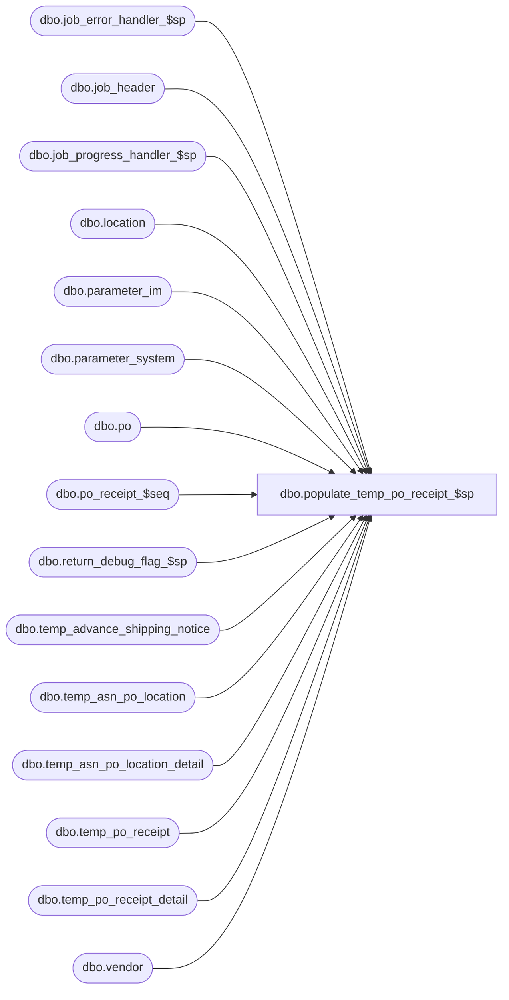

# dbo.populate_temp_po_receipt_$sp

**Database:** me_01  
**Server:** bedrockdb02  

## Architecture Diagram



## Table Dependencies

| Referenced Table |
|---|
| dbo.job_error_handler_$sp |
| dbo.job_header |
| dbo.job_progress_handler_$sp |
| dbo.location |
| dbo.parameter_im |
| dbo.parameter_system |
| dbo.po |
| dbo.po_receipt_$seq |
| dbo.return_debug_flag_$sp |
| dbo.temp_advance_shipping_notice |
| dbo.temp_asn_po_location |
| dbo.temp_asn_po_location_detail |
| dbo.temp_po_receipt |
| dbo.temp_po_receipt_detail |
| dbo.vendor |

## Stored Procedure Code

```sql
CREATE PROCEDURE [dbo].[populate_temp_po_receipt_$sp]
  (@job_id INT)

AS

/*
  Description	: This procedure is part of the ASN import and it's called from import_asn_batch_$sp passing a job_id as an in parameter.
          It generates temporary Po receipts documents for all non-4Wall ship to locations and connected stores when gen_po_receipt_for_asn_flag in parameter_im is set.
          Tables temp_po_receipt and temp_po_receipt_detail store this information during the execution of the process.
*/

BEGIN

  DECLARE @line_id SMALLINT, @proc_name NVARCHAR(30), @sql_err_num DECIMAL(38,0), @table_name NVARCHAR(30), @document_no NVARCHAR(20),
      @operation_name	NVARCHAR(30), @error_msg	NVARCHAR(2000), @job_type TINYINT, @c_true BIT, @c_false BIT, @installed_4wall_flag BIT, @installed_distro_no_wms_flag BIT,
      @debug_flag BIT, @job_debug_flag BIT, @from_new_id DECIMAL(12,0), @to_new_id DECIMAL(12,0), @temp_count INT, @today SMALLDATETIME,
      @gen_po_receipt_for_oim_loc_flag BIT, @state_no TINYINT, @seq_count int, @docStatus TINYINT, @doc_no_len int, @gen_po_receipt_flag BIT;

  SELECT   @job_type		= 10
      , @proc_name	= N'populate_temp_po_receipt_$sp'
      , @c_false		= 0
      , @c_true		= 1
      , @line_id		= 10
      , @today		= CAST(CONVERT(varchar(10), GETDATE(), 101) AS SMALLDATETIME)
      , @gen_po_receipt_for_oim_loc_flag = i.gen_po_receipt_for_oim_loc_flag
      , @installed_4wall_flag = s.installed_4wall_flag
      , @installed_distro_no_wms_flag = s.installed_distro_no_wms_flag
  FROM parameter_im i, parameter_system s;

  IF NOT object_id(N'tempdb..#temp_po_receipt') IS NULL
    DROP TABLE #temp_po_receipt;

  CREATE TABLE #temp_po_receipt
    (po_receipt_id decimal(12, 0) IDENTITY NOT NULL,
    po_id decimal(12, 0) NOT NULL,
    location_id smallint NOT NULL,
    advance_shipping_notice_id decimal(12, 0) NOT NULL,
    document_status smallint NOT NULL,
    create_date smalldatetime NOT NULL,
    receive_date smalldatetime NULL,
    shipped_date smalldatetime NULL,
    state_no int NOT NULL,
    last_item_id decimal(15, 0) NULL,
    ticket_source smallint NOT NULL,
    ticket_status smallint NOT NULL,
    track_in_transit_flag bit NOT NULL,
    discrepancy_posted smallint NOT NULL);

  BEGIN TRY
    -- Get parameters associates to the current job
    SELECT @job_debug_flag = debug_flag
    FROM job_header WITH (NOLOCK)
    WHERE job_id = @job_id
    AND job_type = @job_type;

    IF @@ROWCOUNT = 0
      RAISERROR (N'Error: job #%i is missing in the job_header table.',
               16, -- Severity.
               1, -- State.
               @job_id);

    -- Log progress if job_params.debug_flag is true
    EXEC return_debug_flag_$sp @job_type, @debug_flag OUT
    IF (@debug_flag = @c_true OR @job_debug_flag = @c_true)
      EXEC job_progress_handler_$sp @job_type, @job_id, @proc_name, @line_id

    SET @line_id = 20

        -- the function is now called even when parameter gen_po_receipt_for_asn_flag FROM parameter_im  is OFF, we need to check here
        SELECT @gen_po_receipt_flag = gen_po_receipt_for_asn_flag FROM parameter_im WITH (NOLOCK);

        -- cases A - F are only called when flag is ON

        IF(@gen_po_receipt_flag = @c_true)
        BEGIN
            /* Generate Header, case A covers rules:
            IM00733.1.1.1
            IM00733.1.1.2
            IM00733.1.1.5

            IM00733.1.2.1
            IM00733.1.2.2
            IM00733.1.2.5
            -- location flags: warehouse_system_flag = 0, uers_oim_flag = 0,  location type in (1,3,4) 1 = head office, 3 = distribution centre, 4 = warehouse

            */
            INSERT INTO #temp_po_receipt
                ( po_id
                , location_id
                , advance_shipping_notice_id
                , document_status
                , create_date
                , receive_date
                , shipped_date
         , state_no
                , ticket_source
                , ticket_status
                , track_in_transit_flag
                , discrepancy_posted)
            SELECT b.po_id
                , b.ship_to_location_id
                , a.advance_shipping_notice_id
                , CASE WHEN v.asn_auto_generate_po_rcpt_status = 1 THEN 1
                        WHEN v.asn_auto_generate_po_rcpt_status = 2 AND v.track_in_transit_flag = 1 THEN 26 ELSE 4 END-- 1= Preliminary, 26 = Shipped, 4 = Received
                , GETDATE()
                , CASE WHEN v.asn_auto_generate_po_rcpt_status = 1 THEN NULL ELSE @today END
                , CASE WHEN v.track_in_transit_flag = 1 THEN (CASE WHEN a.ship_date IS NOT NULL THEN a.ship_date ELSE @today END) ELSE NULL END
                , CASE WHEN v.asn_auto_generate_po_rcpt_status = 1 THEN 1
                        WHEN v.asn_auto_generate_po_rcpt_status = 2 AND v.track_in_transit_flag = 1 THEN 8 ELSE 2 END-- state_no 1 = Preliminary, Shipped = 8, Received = 2
                , b.ticket_source
                , CASE WHEN b.ticket_source = 3 THEN 3 ELSE 2 END
                , v.track_in_transit_flag
                , 0 --default to 0 = Discrepancy Not Posted
            FROM temp_advance_shipping_notice a WITH (NOLOCK), temp_asn_po_location b WITH (NOLOCK), location l WITH (NOLOCK), vendor v WITH (NOLOCK)
            WHERE a.job_id = @job_id
            AND b.job_id = @job_id
            AND a.job_id = b.job_id
            AND a.advance_shipping_notice_id = b.advance_shipping_notice_id
            AND b.ship_to_location_id = l.location_id
            AND l.location_type IN (1, 3, 4) --1 = head office, 3 = distribution centre, 4 = warehouse
            AND l.warehouse_system_flag = 0
            AND l.uses_oim_flag = 0
            AND a.vendor_id = v.vendor_id
            AND v.asn_auto_generate_po_rcpt_status <> 4 -- 4: None

            -- Log progress if job_params.debug_flag is true
            EXEC return_debug_flag_$sp @job_type, @debug_flag OUT
            IF (@debug_flag = @c_true OR @job_debug_flag = @c_true)
                EXEC job_progress_handler_$sp @job_type, @job_id, @proc_name, @line_id;

            --------------------------end case A-------------------------------------

            /* Generate Header, case B and case F covers rules:
            IM00733.1.2.3
            IM00733.1.2.4
            IM00733.1.2.6

            IM00733.1.5.1
            IM00733.1.5.2
            IM00733.1.5.3

            -- location flags: warehouse_system_flag = 1, uers_oim_flag = 0,  location type in (1,3,4)  1 = head office, 3 = distribution centre, 4 = warehouse

            */
            IF ((@installed_4wall_flag = 0 AND @installed_distro_no_wms_flag = 0) OR (@installed_4wall_flag = 0 AND @installed_distro_no_wms_flag = 1))
            BEGIN
                SET @line_id = 30;
                INSERT INTO #temp_po_receipt
                ( po_id
                , location_id
                , advance_shipping_notice_id
                , document_status
                , create_date
                , receive_date
                , shipped_date
                , state_no
                , ticket_source
                , ticket_status
                , track_in_transit_flag
                , discrepancy_posted)
                    SELECT b.po_id
                        , b.ship_to_location_id
                        , a.advance_shipping_notice_id
                        , CASE WHEN v.asn_auto_generate_po_rcpt_status = 1 THEN 1
                                WHEN v.asn_auto_generate_po_rcpt_status = 2 AND v.track_in_transit_flag = 1 THEN 26 ELSE 4 END-- 1= Preliminary, 26 = Shipped, 4 = Received
                        , GETDATE()
                        , CASE WHEN v.asn_auto_generate_po_rcpt_status = 1 THEN NULL ELSE @today END
                        , CASE WHEN v.track_in_transit_flag = 1 THEN (CASE WHEN a.ship_date IS NOT NULL THEN a.ship_date ELSE @today END) ELSE NULL END
                        , CASE WHEN v.asn_auto_generate_po_rcpt_status = 1 THEN 1
                                WHEN v.asn_auto_generate_po_rcpt_status = 2 AND v.track_in_transit_flag = 1 THEN 8 ELSE 2 END-- state_no 1 = Preliminary, Shipped = 8, Received = 2
                        , b.ticket_source
                        , CASE WHEN b.ticket_source = 3 THEN 3 ELSE 2 END
                        , v.track_in_transit_flag
                        , 0 --default to 0 = Discrepancy Not Posted
                    FROM temp_advance_shipping_notice a WITH (NOLOCK), temp_asn_po_location b WITH (NOLOCK), location l WITH (NOLOCK), vendor v WITH (NOLOCK)
                    WHERE a.job_id = @job_id
                    AND b.job_id = @job_id
                    AND a.job_id = b.job_id
                    AND a.advance_shipping_notice_id = b.advance_shipping_notice_id
                    AND b.ship_to_location_id = l.location_id
                    AND l.location_type IN (1, 3, 4) --1 = head office, 3 = distribution centre, 4 = warehouse
                    AND l.warehouse_system_flag = 1
                    AND l.uses_oim_flag = 0
                    AND a.vendor_id = v.vendor_id
                    AND v.asn_auto_generate_po_rcpt_status <> 4 -- 4: None

                    -- Log progress if job_params.debug_flag is true
                    EXEC return_debug_flag_$sp @job_type, @debug_flag OUT
                    IF (@debug_flag = @c_true OR @job_debug_flag = @c_true)
                        EXEC job_progress_handler_$sp @job_type, @job_id, @proc_name, @line_id;
            END;

            --------------------------end case B and F-------------------------------------

            /* Generate Header, case C covers rules:
            IM00733.1.3.1
            IM00733.1.3.2
            IM00733.1.3.5

            IM00733.1.4.1
            IM00733.1.4.2
            IM00733.1.4.5

            -- location flags: warehouse_system_flag = 0, uers_oim_flag = 0,  location type = 2 = Store

            */
            SET @line_id = 40;
            INSERT INTO #temp_po_receipt
                ( po_id
                , location_id
                , advance_shipping_notice_id
                , document_status
                , create_date
                , receive_date
                , shipped_date
                , state_no
                , ticket_source
                , ticket_status
                , track_in_transit_flag
                , discrepancy_posted)
            SELECT b.po_id
                , b.ship_to_location_id
                , a.advance_shipping_notice_id
                , CASE WHEN v.asn_auto_generate_po_rcpt_status = 1 THEN 1
                        WHEN v.asn_auto_generate_po_rcpt_status = 2 AND v.track_in_transit_flag = 1 THEN 26 ELSE 4 END-- 1= Preliminary, 26 = Shipped, 4 = Received
                , GETDATE()
                , CASE WHEN v.asn_auto_generate_po_rcpt_status = 1 THEN NULL ELSE @today END
                , CASE WHEN v.track_in_transit_flag = 1 THEN (CASE WHEN a.ship_date IS NOT NULL THEN a.ship_date ELSE @today END) ELSE NULL END
                , CASE WHEN v.asn_auto_generate_po_rcpt_status = 1 THEN 1
                        WHEN v.asn_auto_generate_po_rcpt_status = 2 AND v.track_in_transit_flag = 1 THEN 8 ELSE 2 END-- state_no 1 = Preliminary, Shipped = 8, Received = 2
                , b.ticket_source
                , CASE WHEN b.ticket_source = 3 THEN 3 ELSE 2 END
                , v.track_in_transit_flag
                , 0 --default to 0 = Discrepancy Not Posted
            FROM temp_advance_shipping_notice a WITH (NOLOCK), temp_asn_po_location b WITH (NOLOCK), location l WITH (NOLOCK), vendor v WITH (NOLOCK)
            WHERE a.job_id = @job_id
            AND b.job_id = @job_id
            AND a.job_id = b.job_id
            AND a.advance_shipping_notice_id = b.advance_shipping_notice_id
            AND b.ship_to_location_id = l.location_id
            AND l.location_type = 2 --Store
            AND l.warehouse_system_flag = 0
            AND l.uses_oim_flag = 0
            AND a.vendor_id = v.vendor_id
            AND v.asn_auto_generate_po_rcpt_status <> 4 -- 4: None

            -- Log progress if job_params.debug_flag is true
            EXEC return_debug_flag_$sp @job_type, @debug_flag OUT
            IF (@debug_flag = @c_true OR @job_debug_flag = @c_true)
                EXEC job_progress_handler_$sp @job_type, @job_id, @proc_name, @line_id;

            --------------------------end case C-------------------------------------

            /* Generate Header, case D covers rules:
            IM00733.1.4.3
            IM00733.1.4.4
            IM00733.1.4.6
            @gen_po_receipt_for_oim_loc_flag = 1
            -- location flags: warehouse_system_flag = 0, uers_oim_flag = 1,  location type = 2 (2 = Store)

            */
            IF (@gen_po_receipt_for_oim_loc_flag = 1)
            BEGIN
                SET @line_id = 50;

                INSERT INTO #temp_po_receipt
                ( po_id
                , location_id
                , advance_shipping_notice_id
                , document_status
                , create_date
                , receive_date
                , shipped_date
                , state_no
                , ticket_source
                , ticket_status
                , track_in_transit_flag
                , discrepancy_posted)
                    SELECT b.po_id
                        , b.ship_to_location_id
                        , a.advance_shipping_notice_id
                        , CASE WHEN v.asn_auto_generate_po_rcpt_status = 1 THEN 1
                                WHEN v.asn_auto_generate_po_rcpt_status = 2 AND v.track_in_transit_flag = 1 THEN 26 ELSE 4 END-- 1= Preliminary, 26 = Shipped, 4 = Received
                        , GETDATE()
                        , CASE WHEN v.asn_auto_generate_po_rcpt_status = 1 THEN NULL ELSE @today END
                        , CASE WHEN v.track_in_transit_flag = 1 THEN (CASE WHEN a.ship_date IS NOT NULL THEN a.ship_date ELSE @today END) ELSE NULL END
                        , CASE WHEN v.asn_auto_generate_po_rcpt_status = 1 THEN 1
                                WHEN v.asn_auto_generate_po_rcpt_status = 2 AND v.track_in_transit_flag = 1 THEN 8 ELSE 2 END-- state_no 1 = Preliminary, Shipped = 8, Received = 2
                        , b.ticket_source
                        , CASE WHEN b.ticket_source = 3 THEN 3 ELSE 2 END
                        , v.track_in_transit_flag
                        , 0 --default to 0 = Discrepancy Not Posted
                    FROM temp_advance_shipping_notice a WITH (NOLOCK), temp_asn_po_location b WITH (NOLOCK), location l WITH (NOLOCK), vendor v WITH (NOLOCK)
                    WHERE a.job_id = @job_id
                    AND b.job_id = @job_id
                    AND a.job_id = b.job_id
                    AND a.advance_shipping_notice_id = b.advance_shipping_notice_id
                    AND b.ship_to_location_id = l.location_id
                    AND l.location_type = 2 --Store
                    AND l.warehouse_system_flag = 0
                    AND l.uses_oim_flag = 1
                    AND a.vendor_id = v.vendor_id
                    AND v.asn_auto_generate_po_rcpt_status <> 4 -- 4: None

                    -- Log progress if job_params.debug_flag is true
                    EXEC return_debug_flag_$sp @job_type, @debug_flag OUT
                    IF (@debug_flag = @c_true OR @job_debug_flag = @c_true)
                        EXEC job_progress_handler_$sp @job_type, @job_id, @proc_name, @line_id;
            END;

            --------------------------end case D-------------------------------------

            /* Generate Header, case E covers rules:
            IM00733.1.3.4
            IM00733.1.3.6
            @gen_po_receipt_for_oim_loc_flag = 0
            -- location flags: warehouse_system_flag = 0, uers_oim_flag = 1,  location type = 2 (2 = Store)

            */
            IF (@gen_po_receipt_for_oim_loc_flag = 0)
            BEGIN
                SET @line_id = 60;
                INSERT INTO #temp_po_receipt
                ( po_id
                , location_id
                , advance_shipping_notice_id
                , document_status
                , create_date
                , receive_date
                , shipped_date
                , state_no
                , ticket_source
                , ticket_status
                , track_in_transit_flag
                , discrepancy_posted)
                    SELECT b.po_id
                        , b.ship_to_location_id
                        , a.advance_shipping_notice_id
                        , CASE  WHEN v.asn_auto_generate_po_rcpt_status = 3 THEN 4 -- 1 = Preliminary, 26 = Shipped, 4 = Received --never generate Preliminary PO Receipt at this case E
                                WHEN v.asn_auto_generate_po_rcpt_status = 2 AND v.track_in_transit_flag = 1 THEN 26 END
                        , GETDATE()
                        , CASE WHEN v.asn_auto_generate_po_rcpt_status = 1 THEN NULL ELSE @today END
                        , CASE WHEN v.track_in_transit_flag = 1 THEN (CASE WHEN a.ship_date IS NOT NULL THEN a.ship_date ELSE @today END) ELSE NULL END
                        , CASE WHEN v.asn_auto_generate_po_rcpt_status = 3 THEN 2
                                WHEN v.asn_auto_generate_po_rcpt_status = 2 AND v.track_in_transit_flag = 1 THEN 8 END-- state_no 1 = Preliminary, Shipped = 8, Received = 2
                        , b.ticket_source
                        , CASE WHEN b.ticket_source = 3 THEN 3 ELSE 2 END
                        , v.track_in_transit_flag
                        , 0 --default to 0 = Discrepancy Not Posted
                    FROM temp_advance_shipping_notice a WITH (NOLOCK), temp_asn_po_location b WITH (NOLOCK), location l WITH (NOLOCK), vendor v WITH (NOLOCK)
                    WHERE a.job_id = @job_id
                    AND b.job_id = @job_id
                    AND a.job_id = b.job_id
                    AND a.advance_shipping_notice_id = b.advance_shipping_notice_id
                    AND b.ship_to_location_id = l.location_id
                    AND l.location_type = 2 --Store
                    AND l.warehouse_system_flag = 0
                    AND l.uses_oim_flag = 1
                    AND a.vendor_id = v.vendor_id
                    AND v.asn_auto_generate_po_rcpt_status in (2,3) -- 2: Shipped, 3: Received

                    -- Log progress if job_params.debug_flag is true
                    EXEC return_debug_flag_$sp @job_type, @debug_flag OUT
                    IF (@debug_flag = @c_true OR @job_debug_flag = @c_true)
                        EXEC job_progress_handler_$sp @job_type, @job_id, @proc_name, @line_id;
            END;

            --------------------------end case E-------------------------------------
        END; -- end when @gen_po_receipt_flag = true


        /* Generate Header, case G covers DSI POs
        -- DSI PO - special_order_flag = 1, predistribution_type = 2,  source = 6
    */

        SET @line_id = 70;
        MERGE #temp_po_receipt AS Target
        USING (SELECT b.po_id
                    , b.ship_to_location_id
                    , a.advance_shipping_notice_id
                    , 4 as document_status -- 1 = Preliminary, 26 = Shipped, 4 = Received, DSI PO receipts are always received
                    , GETDATE() as create_date
                    ,  @today as receive_date
                    , CASE WHEN v.track_in_transit_flag = 1 THEN (CASE WHEN a.ship_date IS NOT NULL THEN a.ship_date ELSE @today END) ELSE NULL END as shipped_date
                    , 2 as state_no-- state_no 1 = Preliminary, Shipped = 8, Received = 2
                    , b.ticket_source
                    , CASE WHEN b.ticket_source = 3 THEN 3 ELSE 2 END as ticket_status
                    , v.track_in_transit_flag
                    , 0 as discrepancy_posted --default to 0 = Discrepancy Not Posted
            FROM temp_advance_shipping_notice a WITH (NOLOCK), temp_asn_po_location b WITH (NOLOCK), location l WITH (NOLOCK), vendor v WITH (NOLOCK), po (NOLOCK)
            WHERE a.job_id = @job_id
            AND b.job_id = @job_id
            AND a.job_id = b.job_id
            AND a.advance_shipping_notice_id = b.advance_shipping_notice_id
            AND b.ship_to_location_id = l.location_id
            --AND l.location_type = 2 --Store
            --AND l.warehouse_system_flag = 0
            AND a.vendor_id = v.vendor_id
            --AND v.allow_direct_shipments_to_customer_flag = 1
            AND b.po_id = po.po_id
            AND po.special_order_flag = 1 AND po.predistribution_type = 2 AND po.source = 6  ) AS Source
            ON (Target.po_id = Source.po_id AND Target.location_id = Source.ship_to_location_id AND Target.advance_shipping_notice_id = Source.advance_shipping_notice_id)
            WHEN MATCHED THEN
                UPDATE SET Target.document_status = Source.document_status, Target.receive_date = Source.receive_date, Target.shipped_date = Source.shipped_date, Target.state_no = Source.state_no
            WHEN NOT MATCHED THEN
            INSERT
                ( po_id
                , location_id
                , advance_shipping_notice_id
                , document_status
                , create_date
                , receive_date
                , shipped_date
                , state_no
                , ticket_source
                , ticket_status
                , track_in_transit_flag
                , discrepancy_posted)
            VALUES
                 ( Source.po_id
                , Source.ship_to_location_id
                , Source.advance_shipping_notice_id
                , Source.document_status
                , Source.create_date
                , Source.receive_date
                , Source.shipped_date
                , Source.state_no
                , Source.ticket_source
                , Source.ticket_status
                , Source.track_in_transit_flag
                , Source.discrepancy_posted);

            -- Log progress if job_params.debug_flag is true
            EXEC return_debug_flag_$sp @job_type, @debug_flag OUT
            IF (@debug_flag = @c_true OR @job_debug_flag = @c_true)
                EXEC job_progress_handler_$sp @job_type, @job_id, @proc_name, @line_id;

            -------------------------- end case G -------------------------------------

    SELECT @temp_count = COUNT(*) FROM #temp_po_receipt;

    IF(@temp_count > 0)
    BEGIN
      SET @line_id = 80;
      -- Business rule validation: if the po referenced by the po_receipt has approval <> 'approved' (3), 'reapproved'(7) or 'none' (1)
      -- then receive cannot be performed.

      SELECT 1
      FROM #temp_po_receipt r WITH (NOLOCK), po WITH (NOLOCK)
      WHERE r.state_no IN (2, 8)
      AND r.po_id = po.po_id
      AND po.approval_status NOT IN (1,3,7);

      IF @@ROWCOUNT > 0
        RAISERROR (N'The PO referenced by some po_receipt has not been approved then auto-receive cannot be performed. Job# %i',
           16, -- Severity.
           1, -- State.
           @job_id);

      -- Log progress if job_params.debug_flag is true
      EXEC return_debug_flag_$sp @job_type, @debug_flag OUT
      IF (@debug_flag = @c_true OR @job_debug_flag = @c_true)
        EXEC job_progress_handler_$sp @job_type, @job_id, @proc_name, @line_id

      SET @line_id = 90;
      -- We want to make sure multiple jobs won't use the same document_no
      BEGIN TRAN

      SELECT @document_no = last_generated_po_receipt_no,
             @doc_no_len = LEN(po_receipt_no_mask)
      FROM  parameter_im WITH (XLOCK) WHERE parameter_im_id = 1;

      IF(@temp_count > 0)
        UPDATE parameter_im
        SET last_generated_po_receipt_no = RIGHT(N'00000000000000000000' + CAST( (CAST(@document_no AS INT) + @temp_count) AS NVARCHAR(20) ), @doc_no_len)
        WHERE parameter_im_id = 1;

      COMMIT TRAN

      -- Log progress if job_params.debug_flag is true
      EXEC return_debug_flag_$sp @job_type, @debug_flag OUT
      IF (@debug_flag = @c_true OR @job_debug_flag = @c_true)
        EXEC job_progress_handler_$sp @job_type, @job_id, @proc_name, @line_id;

      SET @line_id = 100;
      -- Reserve a range of po_receipt_id
      BEGIN TRAN
          select @seq_count = COUNT(*) from po_receipt_$seq with (TABLOCKX) WHERE dummycol = 0;

          IF @seq_count > 0
            DELETE FROM po_receipt_$seq WHERE dummycol = 0;

          INSERT INTO po_receipt_$seq (dummycol) VALUES (0);

          SELECT @from_new_id = COALESCE(po_receipt_seq_id, 1) FROM po_receipt_$seq WHERE dummycol = 0;

          DELETE FROM po_receipt_$seq WHERE dummycol = 0;

          SET IDENTITY_INSERT po_receipt_$seq ON
            INSERT INTO po_receipt_$seq (po_receipt_seq_id, dummycol)
            SELECT @from_new_id - 1 + @temp_count, 0;
          SET IDENTITY_INSERT po_receipt_$seq OFF

          SELECT @to_new_id = po_receipt_seq_id FROM po_receipt_$seq WHERE dummycol = 0;

          DELETE FROM po_receipt_$seq WHERE dummycol = 0;

      COMMIT TRAN

      -- Log progress if job_params.debug_flag is true
      EXEC return_debug_flag_$sp @job_type, @debug_flag OUT
      IF (@debug_flag = @c_true OR @job_debug_flag = @c_true)
        EXEC job_progress_handler_$sp @job_type, @job_id, @proc_name, @line_id

      SET @line_id = 110

      INSERT INTO temp_po_receipt
        (job_id,
        po_receipt_id,
        po_id,
        location_id,
        advance_shipping_notice_id,
        document_no,
        document_status,
        create_date,
        receive_date,
        shipped_date,
          state_no,
        last_item_id,
        ticket_source,
        ticket_status,
        track_in_transit_flag,
          discrepancy_posted)
      SELECT @job_id,
        @from_new_id - 1 + po_receipt_id,
        po_id,
        location_id,
        advance_shipping_notice_id,
        RIGHT(N'00000000000000000000' + CAST( (CAST(@document_no AS INT) + po_receipt_id) AS NVARCHAR(20)), @doc_no_len),
        document_status,
        create_date,
        receive_date,
        shipped_date,
          state_no,
        last_item_id,
        ticket_source,
        ticket_status,
        track_in_transit_flag,
        discrepancy_posted
      FROM #temp_po_receipt
      ORDER BY po_receipt_id;

      -- Log progress if job_params.debug_flag is true
      EXEC return_debug_flag_$sp @job_type, @debug_flag OUT
      IF (@debug_flag = @c_true OR @job_debug_flag = @c_true)
        EXEC job_progress_handler_$sp @job_type, @job_id, @proc_name, @line_id

      SET @line_id = 120;

      INSERT INTO temp_po_receipt_detail
        ( job_id
        , po_receipt_detail_id
        , po_receipt_id
        , sku_id
        , style_id
        , style_color_id
        , carton_no
        , units_shipped
        , units_received
        , pack_id
        , po_line_id)
      SELECT @job_id,
        r.po_receipt_id * 1000000 + (ROW_NUMBER() OVER(PARTITION BY r.po_receipt_id ORDER BY r.po_receipt_id ASC)),
        r.po_receipt_id,
        a.sku_id,
        a.style_id,
        a.style_color_id,
        a.carton_no,
        a.units_sent,
        a.units_sent,
        a.pack_id,
        a.po_line_id
      FROM temp_po_receipt r WITH (NOLOCK), temp_asn_po_location_detail a WITH (NOLOCK)
      WHERE r.job_id = @job_id
      AND r.state_no = 2 -- set received units for po receipt status = Received
      AND r.job_id = a.job_id
      AND a.advance_shipping_notice_id = r.advance_shipping_notice_id
      AND a.po_id = r.po_id
      AND a.ship_to_location_id = r.location_id;

      -- Log progress if job_params.debug_flag is true
      EXEC return_debug_flag_$sp @job_type, @debug_flag OUT
      IF (@debug_flag = @c_true OR @job_debug_flag = @c_true)
        EXEC job_progress_handler_$sp @job_type, @job_id, @proc_name, @line_id

      SET @line_id = 130;

      INSERT INTO temp_po_receipt_detail
        ( job_id
        , po_receipt_detail_id
        , po_receipt_id
        , sku_id
        , style_id
        , style_color_id
        , carton_no
        , units_shipped
        , units_received
        , pack_id
        , po_line_id)
      SELECT @job_id,
        r.po_receipt_id * 1000000 + (ROW_NUMBER() OVER(PARTITION BY r.po_receipt_id ORDER BY r.po_receipt_id ASC)),
        r.po_receipt_id,
        a.sku_id,
        a.style_id,
        a.style_color_id,
        a.carton_no,
        a.units_sent,
        0,
        a.pack_id,
        a.po_line_id
      FROM temp_po_receipt r WITH (NOLOCK), temp_asn_po_location_detail a WITH (NOLOCK)
      WHERE r.job_id = @job_id
      AND (r.state_no = 1 OR r.state_no = 8) --don't set received units for po receipt status = Preliminary or Shipped
      AND r.job_id = a.job_id
      AND a.advance_shipping_notice_id = r.advance_shipping_notice_id
      AND a.po_id = r.po_id
      AND a.ship_to_location_id = r.location_id;

      -- Log progress if job_params.debug_flag is true
      EXEC return_debug_flag_$sp @job_type, @debug_flag OUT
      IF (@debug_flag = @c_true OR @job_debug_flag = @c_true)
        EXEC job_progress_handler_$sp @job_type, @job_id, @proc_name, @line_id

      SET @line_id = 140;
      -- Update last_item_id
      UPDATE r
      SET last_item_id = T.cnt
      FROM temp_po_receipt r,
        (SELECT po_receipt_id, COUNT(*) cnt FROM temp_po_receipt_detail WHERE job_id = @job_id GROUP BY po_receipt_id) T
      WHERE r.job_id = @job_id
      AND r.po_receipt_id = T.po_receipt_id;

      -- Log progress if job_params.debug_flag is true
      EXEC return_debug_flag_$sp @job_type, @debug_flag OUT
      IF (@debug_flag = @c_true OR @job_debug_flag = @c_true)
        EXEC job_progress_handler_$sp @job_type, @job_id, @proc_name, @line_id

    END
  END TRY
  BEGIN CATCH

    SELECT @error_msg		= ERROR_MESSAGE()
       , @sql_err_num		= ERROR_NUMBER()

    IF @line_id = 10
      SELECT @table_name		= N'job_header',
         @operation_name	= N'SELECT'
    ELSE IF @line_id BETWEEN 20 AND 60
      SELECT @table_name		= N'#temp_po_receipt',
         @operation_name	= N'INSERT'
    ELSE IF @line_id = 80
      SELECT @table_name		= N'#temp_po_receipt',
         @operation_name	= N'SELECT'
    ELSE IF @line_id = 90
      SELECT @table_name		= N'parameter_im',
         @operation_name	= N'UPDATE'
    ELSE IF @line_id = 100
      SELECT @table_name		= N'po_receipt_$seq',
           @operation_name	= N'INSERT'
    ELSE IF @line_id = 110
      SELECT @table_name		= N'temp_po_receipt',
           @operation_name	= N'INSERT'
    ELSE IF @line_id BETWEEN 120 AND 130
      SELECT @table_name		= N'temp_po_receipt_detail',
         @operation_name	= N'INSERT'
    ELSE IF @line_id = 140
      SELECT @table_name		= N'temp_po_receipt',
         @operation_name	= N'UPDATE'

    EXEC job_error_handler_$sp
            @job_type
          , @job_id
          , @proc_name
          , @line_id
          , @sql_err_num
          , @table_name
          , @operation_name
          , @error_msg
          , @c_true
  END CATCH
END
```

